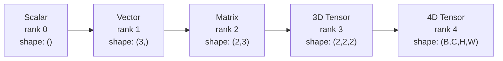
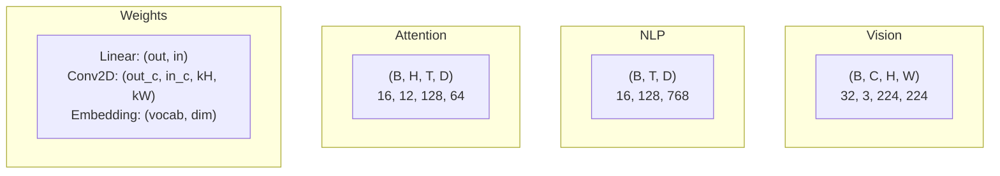
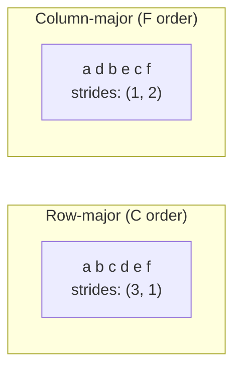
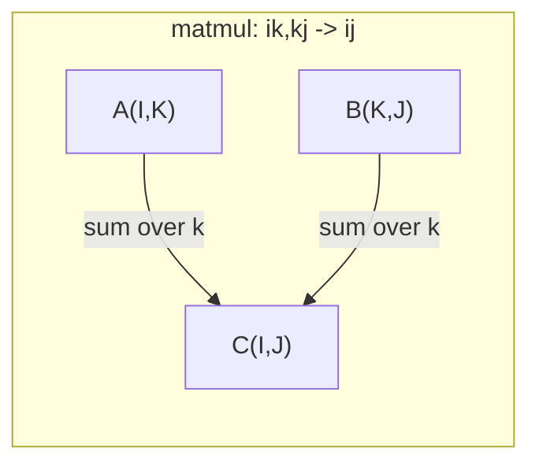

# टेंसर ऑपरेशन

> टेन्सर डेटा और डीप लर्निंग के बीच की सामान्य भाषा है। प्रत्येक छवि, प्रत्येक वाक्य, प्रत्येक ग्रेडिएंट उनके माध्यम से चलता है।

**Type:** Build
**Language:**पायथन
**前置要求：**चरण 1, पाठ 01 (रेखीय बीजगणित अंतर्ज्ञान),02 (वेक्टर, मैट्रिक्स और संचालन)
**Time:** ~90 分钟

## 学习目标
- शून्य से एक Tensor वर्ग को प्राप्त करने के लिए, आकार, कदम, रीस्फॉर्म, ट्रांसपोस और तत्व-बुद्धिमान संचालन का समर्थन करें
-  अनुप्रयोग प्रसारण  नियम, अनकपी डेटा के मामले में विभिन्न आकार के टेंसर  पर संचालन
- ऩ्क उत्पाद ऩ्क मैट्रिक्स गुणन ऩ्क बाहरी उत्पाद व बैच्ड ऑपरेशंस ऩ्क एकसम अभिव्यक्ति
-  ट्रैक मल्टी-हेड ध्यान प्रत्येक चरण के सटीक Tensor आकार

## 问题
तुम एक ट्रांसफार्मर बनाया है. आगे की पास लग रहा है.`RuntimeError: mat1 and mat2 shapes cannot be multiplied (32x768 and 512x768)`你着这些形状──你试图转换──现在它提示 `Expected 4D input (got 3D input)`तुमने एक अनस्प्रेस जोड़ा और कहीं और खराब हो गया 

आकार की त्रुटियां गहन सीखने के कोड में सबसे आम बग हैं। वे अवधारणा में मुश्किल नहीं हैं - प्रत्येक ऑपरेशन में एक आकार अनुबंध होता है - लेकिन जल्दी से प्रतीत होता है। एक ट्रांसफार्मर कई रीफॉर्म, ट्रांसपॉइंट और प्रसारण को जोड़ता है। एक अक्ष  गलती हुई है, त्रुटि हुई है।

मैट्रिक्स 处理两组事物之间成对关系──真数据不能放进两个维度── एक बैच के 32张 224x224 आरजीबी छवियां एक 4D टेंसर हैः`(32, 3, 224, 224)`                                                                                                                                                                                                                                                              `(batch, heads, seq_len, head_dim)` आप एक ऐसी संरचना की आवश्यकता है जो किसी भी आयाम में संवर्धित हो सकती है, और उसके संचालन सभी आयामों में  कर सकते हैं।

## 概念
### एक tensor क्या है

Tensor एक एकीकृत डेटा प्रकार के बहु-आयामी संख्याओं की संख्या है। आयामों को **rank**(या **order**)― प्रत्येक आयाम एक है **axis****shape**एक टूपल, प्रत्येक अक्ष पर एक बड़े आकार का है



总元素数 = 所有 आकारों के गुणाङ्क――आकार `(2, 3, 4)`包含 `2 * 3 * 4 = 24`个元素──

### गहन सीखने के बीच के टेंसर आकार

परम्परागत रूप से, विभिन्न डेटा प्रकार विशिष्ट Tensor आकारों में प्रदर्शित होंगे



PyTorch उपयोग NCHW-चैनल-पहला) ・TensorFlow 默认使用 NHWC-चैनल-आखिरी) ・不匹配的布局会导致静默变慢或报错──

### मेमोरी लेआउट कैसे काम करता है

内存 में 2D सरणी है एक段 1D बाइट्स 序列。**Strides** आपको बताएँ कि प्रत्येक अक्ष के साथ आगे कितने तत्वों को कूदने की आवश्यकता है



स्थानांतरण 不移动数据── यह कदमों का आदान-प्रदान, बनाता है Tensor 变为 **non-contiguous**-- एक पंक्ति में तत्वों में से एक का एक दूसरे के साथ कोई संबंध नहीं है।

### प्रसारण नियम

प्रसारण  आपको ण ण ण ण ण ण ण ण ण ण ण ण ण ण ण ण ण ण ण ण ण ण ण ण ण ण ण ण ण ण ण ण ण ण ण ण ण ण ण ण ण ण ण ण ण ण ण ण ण ण ण ण ण ण ण ण ण ण ण ण ण ण ण ण ण ण ण ण ण ण ण ण ण ण ण ण ण ण ण ण ण ण ण ण ण ण ण ण ण ण ण ण ण ण ण ण ण ण ण ण ण ण ण ण ण ण ण ण ण ण ण ण ण ण ण ण ण ण ण ण ण ण ण ण ण ण ण ण ण ण ण ण ण ण ण ण ण ण ण ण ण ण ण ण ण ण ण ण ण ण ण ण ण ण ण ण ण ण ण ण ण ण ण ण ण ण ण ण ण ण ण ण ण ण ण ण ण ण ण ण ण ण ण ण ण ण ण ण ण ण ण ण ण ण ण ण ण ण ण ण ण ण ण ण ण ण ण ण ण ण ण ण ण ण ण ण ण ण ण ण ण ण ण ण ण ण ण ण ण ण ण ण ण ण ण ण ण ण ण ण ण ण ण ण ण ण ण ण ण ण ण ण ण

```
Tensor A:     (8, 1, 6, 1)
Tensor B:        (7, 1, 5)
Padded B:     (1, 7, 1, 5)
Result:       (8, 7, 6, 5)
```

### एंसम: सामान्य तन्सर संचालन

आइंस्टीन सारांश प्रत्येक अक्ष को अक्षरों से चिह्नित करते हुए--- इनपुट में आता है, लेकिन आउटपुट में नहीं आता है-- मध्य अक्षों को प्राप्त किया जाएगा और--- उभयतर पक्षों पर उत्पन्न होने वाली अक्षों को प्राप्त किया जाएगा---



关键模式:`i,i->`(बिंदु उत्पाद)`i,j->ij`(बाहरी उत्पाद)`ii->`(ट्रेस)`ij->ji`(संवहन)`bij,bjk->bik`(बैच मत्मुल)`bhtd,bhsd->bhts`(ध्यान स्कोर)。


```figure
tensor-broadcast
```

##  इसे निर्माण
代码位于 `code/tensors.py` प्रत्येक चरण में उनमें से एक को उद्धृत किया जाएगा

### 步骤 1:टेन्सर  भंडारण और कदम

Tensor  भंडारण एक 平的数字列表以及形形转数据──Strides 告诉索引逻辑 如何把多维索引 映射到平位置──

```python
class Tensor:
    def __init__(self, data, shape=None):
        if isinstance(data, (list, tuple)):
            self._data, self._shape = self._flatten_nested(data)
        elif isinstance(data, np.ndarray):
            self._data = data.flatten().tolist()
            self._shape = tuple(data.shape)
        else:
            self._data = [data]
            self._shape = ()

        if shape is not None:
            total = reduce(lambda a, b: a * b, shape, 1)
            if total != len(self._data):
                raise ValueError(
                    f"Cannot reshape {len(self._data)} elements into shape {shape}"
                )
            self._shape = tuple(shape)

        self._strides = self._compute_strides(self._shape)

    @staticmethod
    def _compute_strides(shape):
        if len(shape) == 0:
            return ()
        strides = [1] * len(shape)
        for i in range(len(shape) - 2, -1, -1):
            strides[i] = strides[i + 1] * shape[i + 1]
        return tuple(strides)
```

对于形 `(3, 4)`, कदम है `(4, 1)`-- अग्रिम में एक पंक्ति में 4 तत्वों से कूदने, अग्रिम में एक पंक्ति में 1 तत्वों से कूदने

### 步骤 2: रीशॉप, स्क््रेस, अनस्क््रेस

आकार  आकार बदलना, लेकिन तत्वों की क्रमशः परिवर्तन नहीं करना चाहिए।`-1`让某一个维度自动推断其大小──

```python
t = Tensor(list(range(12)), shape=(2, 6))
r = t.reshape((3, 4))
r = t.reshape((-1, 3))
```

Squeeze 会移除大小为 1 के अक्षों──Unsqueeze 会插入一个──Unsqueezing for broadcasting 至关重要 -- एक पूर्वाग्रह वेक्टर `(D,)`बैच तक`(B, T, D)`ऊपर, जरूरत uncompressing करने के लिए`(1, 1, D)`

```python
t = Tensor(list(range(6)), shape=(1, 3, 1, 2))
s = t.squeeze()
v = Tensor([1, 2, 3])
u = v.unsqueeze(0)
```

### 第3 步:प्रसारण और प्रतिस्थापन

दो अक्षों को स्थानांतरित करें। सभी अक्षों को स्थानांतरित करें। यह एनसीएचडब्ल्यू और एनएचडब्ल्यूसी के बीच स्थानांतरण का तरीका है।

```python
mat = Tensor(list(range(6)), shape=(2, 3))
tr = mat.transpose(0, 1)

t4d = Tensor(list(range(24)), shape=(1, 2, 3, 4))
perm = t4d.permute((0, 2, 3, 1))
```

ट्रांसपोज या परमुट  के बाद, टेन्सर 內存中是非连接的──在 PyTorch में,`view`会在非连接的子上失败 -- 使用 `reshape`, या पहले调用 `.contiguous()`

### 步骤 4: तत्व-वार संचालन और घटाने

तत्व-बुद्धिमान ओप्स (अधि + गुणा + घटाएँ) प्रत्येक तत्व पर स्वतंत्र रूप से लागू होंगे,并保持形 不变── Reductions (संख्यक = औसत = अधिकतम) एक या कई अक्षों को मोड़ेंगे──

```python
a = Tensor([[1, 2], [3, 4]])
b = Tensor([[10, 20], [30, 40]])
c = a + b
d = a * 2
s = a.sum(axis=0)
```

सीएनएन के बीच वैश्विक औसत बंडलिंगः`(B, C, H, W).mean(axis=[2, 3])` उत्पन्न `(B, C)`◊NLP 中的序列 mean pooling:`(B, T, D).mean(axis=1)` उत्पन्न `(B, D)`

### 步骤 5: NumPy के साथ प्रसारण

`tensors.py`मध्य `demo_broadcasting_numpy()`कार्य  ने मूल मोड दिखाया है

```python
activations = np.random.randn(4, 3)
bias = np.array([0.1, 0.2, 0.3])
result = activations + bias

images = np.random.randn(2, 3, 4, 4)
scale = np.array([0.5, 1.0, 1.5]).reshape(1, 3, 1, 1)
result = images * scale

a = np.array([1, 2, 3]).reshape(-1, 1)
b = np.array([10, 20, 30, 40]).reshape(1, -1)
outer = a * b
```

通过广播 计算双向距离:将 `(M, 2)`पुनर्विकल्पना `(M, 1, 2)`,将 `(N, 2)`पुनर्विकल्पना `(1, N, 2)`,相减、平方、 अन्तिम अक्ष के साथ 求和、取平方根── परिणाम निम्नानुसार हैः`(M, N)`

### 步骤 6: एइनसम संचालन

`demo_einsum()`和 `demo_einsum_gallery()`कार्य प्रत्येक सामान्य पद्धति को चरणबद्ध रूप से प्रदर्शित करेंगे।

```python
a = np.array([1.0, 2.0, 3.0])
b = np.array([4.0, 5.0, 6.0])
dot = np.einsum("i,i->", a, b)

A = np.array([[1, 2], [3, 4], [5, 6]], dtype=float)
B = np.array([[7, 8, 9], [10, 11, 12]], dtype=float)
matmul = np.einsum("ik,kj->ij", A, B)

batch_A = np.random.randn(4, 3, 5)
batch_B = np.random.randn(4, 5, 2)
batch_mm = np.einsum("bij,bjk->bik", batch_A, batch_B)
```

एक संकुचन की गणना लागत सभी सूचकांक आकारों (Reserved and Asked and Asked) के गुणांक है।`bij,bjk->bik`:`32 * 128 * 64 * 128 = 33,554,432`दो गुणा जोड़ें

### 步骤 7: एकनसम के माध्यम से ध्यान तंत्र

`demo_attention_einsum()`फ़ंक्शन 端到端实现 मल्टी-हेड ध्यान

```python
B, H, T, D = 2, 4, 8, 16
E = H * D

X = np.random.randn(B, T, E)
W_q = np.random.randn(E, E) * 0.02

Q = np.einsum("bte,ek->btk", X, W_q)
Q = Q.reshape(B, T, H, D).transpose(0, 2, 1, 3)

scores = np.einsum("bhtd,bhsd->bhts", Q, K) / np.sqrt(D)
weights = softmax(scores, axis=-1)
attn_output = np.einsum("bhts,bhsd->bhtd", weights, V)

concat = attn_output.transpose(0, 2, 1, 3).reshape(B, T, E)
output = np.einsum("bte,ek->btk", concat, W_o)
```

प्रत्येक चरण एक Tensor ऑपरेशन हैःप्रोजेक्शन(एकसम 执行 matmul) √head splitting(रेशम + ट्रांसपोज़) √attention scores(एकसम 执行 बैच मटमुल) √weighted sum(एकसम 执行 बैच मटमुल) √head merging(Transpose + reshape) √output projection(एकसम 执行 matmul) √

## इसका उपयोग करें
### स्क्रैच बनाम नंबरपी

| Operation | Scratch (Tensor class) | NumPy |
|---|---|---|
| Create | `Tensor([[1,2],[3,4]])` | `np.array([[1,2],[3,4]])` |
| Reshape | `t.reshape((3,4))` | `a.reshape(3,4)` |
| Transpose | `t.transpose(0,1)` | `a.T` or `a.transpose(0,1)` |
| Squeeze | `t.squeeze(0)` | `np.squeeze(a, 0)` |
| Sum | `t.sum(axis=0)` | `a.sum(axis=0)` |
| Einsum | N/A | `np.einsum("ij,jk->ik", a, b)` |

### स्क्रैच बनाम पायटॉर्च

```python
import torch

t = torch.tensor([[1, 2, 3], [4, 5, 6]], dtype=torch.float32)
t.shape
t.stride()
t.is_contiguous()

t.reshape(3, 2)
t.unsqueeze(0)
t.transpose(0, 1)
t.transpose(0, 1).contiguous()

torch.einsum("ik,kj->ij", A, B)
```

PyTorch  ऑटोग्रेड बढ़ाया गया, GPU समर्थन और अनुकूलित BLAS कर्नेलों。शैली सेमेटिक समान है──यदि आप खरोंच संस्करण को समझते हैं, तो PyTorch आकार त्रुटियों को तब ही पढ़ना संभव हो जाएगा──

### प्रत्येक तंत्रिका नेटवर्क परत एक Tensor ऑपरेशन है

| Operation | Tensor Form | Einsum |
|---|---|---|
| Linear layer | `Y = X @ W.T + b` | `"bd,od->bo"` + bias |
| Attention QKV | `Q = X @ W_q` | `"btd,dh->bth"` |
| Attention scores | `Q @ K.T / sqrt(d)` | `"bhtd,bhsd->bhts"` |
| Attention output | `softmax(scores) @ V` | `"bhts,bhsd->bhtd"` |
| Batch norm | `(X - mu) / sigma * gamma` | element-wise + broadcast |
| Softmax | `exp(x) / sum(exp(x))` | element-wise + reduction |

## 交付 यह
इस वर्ग में दो दोहराए जाने योग्य संकेत दिए गए हैंः

1. **`outputs/prompt-tensor-shapes.md`**-- एक प्रयोग किया जाता है डिबग Tensor आकार असंगतियों के लिए प्रणालीकरण प्रम्प्ट── समाहित प्रत्येक प्रकार के सामान्य संचालन ((मटमल्ल, प्रसारण, बिल्ली, रैखिक, कन्वि 2 डी, बैचनॉर्म, सॉफ्टमैक्स) के निर्णय तालिकाओं, साथ ही एक फिक्स खोज तालिका──

2. **`outputs/prompt-tensor-debugger.md`**-- एक चरणबद्ध डिबग प्रॉम्प्ट, जब आकार त्रुटि ब्लॉस्टर आप जब, आप किसी भी एआई सहायक में पेस्ट कर सकते हैं ∙∙

## अभ्यास
1. **Easy -- Reshape round-trip.**取一个形 为 `(2, 3, 4)`इसका तनाव. . . इसे फिर से आकार देगा.`(6, 4)`, फिर से आकार के लिए `(24,)`, फिर फिर फिर बदल `(2, 3, 4)`️ छपाई के माध्यम से फ्लैट डेटा 验证 प्रत्येक चरण के तत्व क्रम में रखा गया है

2. **Medium -- Implement broadcasting.**`Tensor`वर्ग  विस्तार एक `broadcast_to(shape)`विधि,将大小为 1 के आयाम 扩展到目标形──然后修改 `_elementwise_op`, इसे ऑपरेशन से पहले स्वचालित प्रसारण करना`(3, 1)`和 `(1, 4)` परीक्षण करने के लिए, परिणाम होना चाहिए `(3, 4)`

3. **Hard -- Build einsum from scratch.**                                                                                                                                                                                                                                                                                                                                                                                                                                                                                                                             `einsum(subscripts, *tensors)`फ़ंक्शन, कम से कम समर्थनःdot उत्पाद`i,i->`)、मैट्रिक्स गुणा करना`ij,jk->ik`)、बाहरी उत्पाद`i,j->ij`) और प्रत्यारोपण`ij->ji`)――उपसर्ग स्ट्रिंग का विश्लेषण करें, अनुबंधित सूचकांक पहचानें,并遍历所有 सूचकांक संयोजन──将你的结果与 `np.einsum`तुलना में

4. **Hard -- Attention shape tracker.**编写一个函数,输入 `batch_size``seq_len``embed_dim`和 `num_heads`,并印印多头注意每步的精确形:输入、Q/K/V प्रोजेक्शन、头分、注意点、软max वजन、重量总量、头合、输出 प्रोजेक्शन──与`demo_attention_einsum()`आउटपुट  परीक्षण करवाएं。

## 关键术语
| Term | What people say | What it actually means |
|---|---|---|
| Tensor | “一个 Matrix，但有更多 dimensions” | 一个具有统一 type 以及已定义 shape、strides 和 operations 的多维数组 |
| Rank | “dimensions 的数量” | axes 的数量。一个 Matrix 的 rank 是 2，而不是等于它的 matrix rank |
| Shape | “Tensor 的大小” | 一个 tuple，列出每个 axis 上的大小。`(2, 3)` 表示 2 行、3 列 |
| Stride | “内存如何排列” | 沿每个 axis 前进一个位置需要跳过的元素数量 |
| Broadcasting | “shapes 不同时它也能直接工作” | 一组严格规则：从右对齐，dimensions 必须相等，或其中一个必须是 1 |
| Contiguous | “Tensor 是正常的” | 元素在内存中按逻辑 layout 顺序连续存储，没有间隙或重排 |
| Einsum | “一种花哨的 matmul 写法” | 一种通用记法，可以用一行表达任意 Tensor contraction、outer product、trace 或 transpose |
| View | “和 reshape 一样” | 一个共享相同 memory buffer，但具有不同 shape/stride metadata 的 Tensor。会在 non-contiguous data 上失败 |
| Contraction | “对某个 index 求和” | Tensor 之间共享的 index 被相乘并求和，从而产生更低 rank 结果的一般 operation |
| NCHW / NHWC | “PyTorch vs TensorFlow format” | image tensors 的 memory layout conventions。NCHW 把 channels 放在 spatial dims 之前，NHWC 把它们放在之后 |

## 延伸阅读
- [NumPy Broadcasting](https://numpy.org/doc/stable/user/basics.broadcasting.html)-- 带有可见化示例的规范规则
- [PyTorch Tensor Views](https://pytorch.org/docs/stable/tensor_view.html)-- दृश्यों, 何時可用, 何時会复制
- [einops](https://github.com/arogozhnikov/einops)-- एक Tensor को फिर से आकार देने के लिए अधिक पठनीय, अधिक सुरक्षित भंडार
- [The Illustrated Transformer](https://jalammar.github.io/illustrated-transformer/)-- 可視化 ध्यान मध्य प्रवाह के टेंसर के आकार
- [Einstein Summation in NumPy](https://numpy.org/doc/stable/reference/generated/numpy.einsum.html)-- 带有例的完整的总数文件
