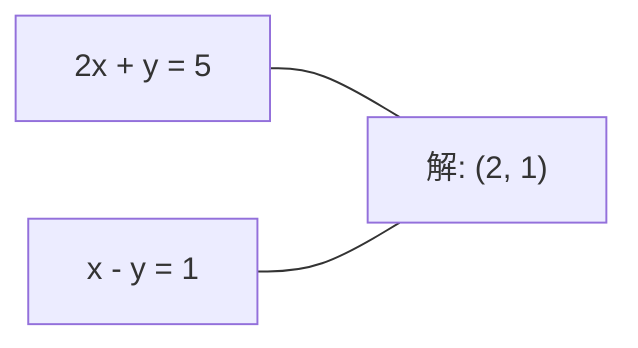
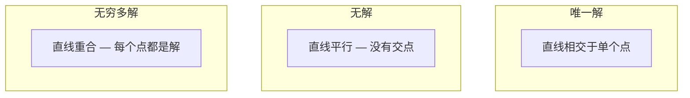

# रैखिक प्रणाली

>  खोज समाधान Ax = b गणित में सबसे पुरानी समस्याओं में से एक है, और यह आज भी आपके तंत्रिका नेटवर्क पर चल रहा है

**Type:** Build
**Language:**पायथन
**前置要求：**चरण 1पाठ 01 (रेखीय बीजगणित अंतर्ज्ञान),02 (वेक्टर और मैट्रिक्स),03 (मैट्रिक्स परिवर्तन)
**Time:** ~120 minutes

## 学习目标
- उपयोग带 आंशिक घूर्णन और वापस प्रतिस्थापन के Gaussian उन्मूलन 求解 Ax = b
- उपयोग LU、QR 和 Cholesky विघटन 分解矩阵,并解释每种方法适用场景
- 推导最小正方形的正常方程,并将其与线性回归和脊回归 联系起来
- उपयोग स्थिति संख्या  निदान खराब स्थिति वाले सिस्टम,并 लागू नियमन उसे स्थिर बनाने

## 问题
प्रत्येक प्रशिक्षण रैखिक प्रतिगमन , आप सभी एक रैखिक प्रणाली को हल करने के लिए खोज रहे हैं  प्रत्येक गणना न्यूनतम वर्ग फिट , आप सभी एक रैखिक प्रणाली को हल करने के लिए खोज रहे हैं  प्रत्येक तंत्रिका नेटवर्क परत `y = Wx + b`时,它都在评估线性系统的一侧. 时,你在修改这个系统. 时,你在分解一个矩阵. 时,你在分解一个矩阵. 时,你在解一个线性系统.

方程 Ax = b 无处不在──A है ज्ञात系数构成的矩阵──b है ज्ञात输出构成的矢量──x है你想找到的未知量矢量──在线性归归归中,A है आपका डेटा矩阵,b है आपका लक्ष्य वैक्टर,x है वजन वैक्टर── संपूर्ण मॉडल का सार यह हो सकता हैः x को ढूंढें, जिससे Ax 尽可能接近 b──

इस कक्षा में इस समीकरण को शून्य से बनाने के सभी मुख्य तरीकों को समझा जाएगा। आप समझेंगे कि क्यों कुछ तरीके तेज़ और अन्य तरीके अधिक स्थिर हैं, क्यों कुछ तरीके केवल वर्ग प्रणालियों के लिए लागू होते हैं जबकि अन्य अत्यधिक निर्धारित प्रणालियों को संभाल सकते हैं, और क्यों मैट्रिक्स की स्थिति संख्या आपके उत्तर का निर्णय लेती है कि क्या इसका कोई अर्थ है।

## 概念
### एक्स = बी का अर्थ क्या है

एक रैखिक समीकरण प्रणाली 具有几何解释── प्रत्येक समीकरण 定义一个超平面──解就是所有超平面相交的点(或点集)──

```
2x + y = 5          2D 中的两条直线。
x - y  = 1          它们相交于 x=2, y=1。
```



तीन प्रकार की स्थिति हो सकती हैः



In matrix 形式中, "एक समाधान" का अर्थ है A अपरिवर्तनीय है──"कोई समाधान" का अर्थ है प्रणाली असंगत है──"असीमित समाधान" का अर्थ है A में शून्य स्थान है──बहुत सारे ML 问题都属于没有精确解的类别,因为你的方程 (数据点) 无知参数 (参数) 更多──这是最小方体 发挥作用的所在──

### स्तंभ चित्र बनाम पंक्ति चित्र

Ax = b को समझने के दो तरीके हैं

**Row picture.**ए के प्रत्येक पंक्ति एक समीकरण को परिभाषित करती है। प्रत्येक समीकरण एक हाइपरप्लेन है।

**Column picture.**प्रश्न बन जाता हैः ए के स्तंभों का क्या रैखिक संयोजन b उत्पन्न कर सकता है?

```
A = | 2  1 |    b = | 5 |
    | 1 -1 |        | 1 |

Row picture: 同时求解 2x + y = 5 和 x - y = 1。

Column picture: 找到 x1, x2，使得：
  x1 * [2, 1] + x2 * [1, -1] = [5, 1]
  2 * [2, 1] + 1 * [1, -1] = [4+1, 2-1] = [5, 1]   check.
```

स्तंभ चित्र 更根本── यदि b 位于 A के स्तंभ स्थान में, प्रणाली就有解── यदि b ∈ B में नहीं है, तो आप स्तंभ स्थान को मध्य से प्राप्त करते हैं  यह निकटतम बिंदु सबसे कम वर्ग समाधान है

### गौसीयन उन्मूलन

गौशियन उन्मूलन 将 Ax = b 转换为上方三角形系统 Ux = c, फिर वापसी प्रतिस्थापन 求解──这是最直接的方法──

算法:

```
1. 对每一列 k（pivot column）：
   a. 在第 k 行及其下方，找到 column k 中最大的 entry（partial pivoting）。
   b. 将该行与第 k 行交换。
   c. 对 k 下方的每一行 i：
      - 计算 multiplier m = A[i][k] / A[k][k]
      - 从第 i 行中减去 m 倍的第 k 行。
2. Back substitute：从最后一个 equation 向上求解。
```

उदाहरण:

```
Original:
| 2  1  1 | 8 |       R2 = R2 - (2)R1     | 2  1   1 |  8 |
| 4  3  3 |20 |  -->  R3 = R3 - (1)R1 --> | 0  1   1 |  4 |
| 2  3  1 |12 |                            | 0  2   0 |  4 |

                       R3 = R3 - (2)R2     | 2  1   1 |  8 |
                                       --> | 0  1   1 |  4 |
                                           | 0  0  -2 | -4 |

Back substitute:
  -2 * x3 = -4    -->  x3 = 2
  x2 + 2  = 4     -->  x2 = 2
  2*x1 + 2 + 2 = 8 --> x1 = 2
```

Gaussian elimination की गणना लागत O (n) 3 है। 1000x1000 प्रणाली के लिए, यह लगभग एक अरब बार फ्लोटिंग-पॉइंट ऑपरेशन है। यह बहुत जल्दी है, लेकिन यदि आपको एक ही A (एक ही ए) का उपयोग करने की आवश्यकता है तो कई सिस्टम का समाधान करना है, तो यह बेहतर भी किया जा सकता है।

### आंशिक पिवटिंगः क्यों महत्वपूर्ण

 बिना पिवोटिंग, गौशियन उन्मूलन संभव विफलता या कचरा परिणाम उत्पन्न करना है यदि पिवोट तत्व शून्य है, तो आप शून्य से अलग हो जाएगा यदि यह बहुत छोटा है, तो आप गोल त्रुटि को बढ़ा देंगे

```
Bad pivot:                       With partial pivoting:
| 0.001  1 | 1.001 |            先交换行：
| 1      1 | 2     |            | 1      1 | 2     |
                                 | 0.001  1 | 1.001 |
m = 1/0.001 = 1000              m = 0.001/1 = 0.001
R2 = R2 - 1000*R1               R2 = R2 - 0.001*R1
| 0.001  1     | 1.001   |      | 1      1     | 2     |
| 0     -999   | -999.0  |      | 0      0.999 | 0.999 |

x2 = 1.000（正确）              x2 = 1.000（正确）
x1 = (1.001 - 1)/0.001          x1 = (2 - 1)/1 = 1.000（正确）
   = 0.001/0.001 = 1.000        稳定，因为 multiplier 很小。
```

सटीकता सीमित में फ्लोटिंग-पॉइंट अंकगणित में, अपरिवर्तित संस्करण महत्वपूर्ण अंकों को खो सकता है।

### एलयू विघटन

LU विघटन होगा A विभाजित निम्न त्रिकोण मैट्रिक्स L और ऊपरी त्रिकोण मैट्रिक्स U:A = LU――L मैट्रिक्स  भंडारण गौशियन उन्मूलन के बीच गुणकों。यू मैट्रिक्स है उन्मूलन के परिणाम。

```
A = L @ U

| 2  1  1 |   | 1  0  0 |   | 2  1   1 |
| 4  3  3 | = | 2  1  0 | @ | 0  1   1 |
| 2  3  1 |   | 1  2  1 |   | 0  0  -2 |
```

क्यों कारक को सीधे खत्म करने के बजाय? क्योंकि एक बार जब L और U होता है, तो किसी भी नए b के लिए हल करने के लिए Ax = b केवल O (n^2) की आवश्यकता होती हैः

```
Ax = b
LUx = b
令 y = Ux:
  Ly = b    (forward substitution, O(n^2))
  Ux = y    (back substitution, O(n^2))
```

O  n^3) का खर्च केवल फ़ाक्टरिज़ेशन  में  एक बार  भुगतान करता है। इसके बाद प्रत्येक बार हल करना    है। यदि आपको एक ही A  विभिन्न b वेक्टर  का उपयोग करने की आवश्यकता है तो 1000  प्रणाली का हल निकालें, LU                                                                                                                                                                                                                           

आंशिक पिवटिंग का उपयोग करते समय, आपको PA = LU मिलता है, जिसमें P रेकॉर्ड पंक्ति स्वैप की परमुटेशन मैट्रिक्स है。

### क्यूआर विघटन

क्यूआर विघटन होगा एक विभाजित करने के लिए ऑर्तोगनल मैट्रिक्स क्यू और ऊपरी त्रिकोण मैट्रिक्स आरः ए = क्यूआर。

ऑर्तोगनल मैट्रिक्स 具有 Q^T Q = I 的性质── इसकी स्तंभें हैं ऑर्तोनॉर्मल वेक्टर──乘以 Q 会保持长和角──

```
A = Q @ R

Q has orthonormal columns: Q^T Q = I
R is upper triangular

To solve Ax = b:
  QRx = b
  Rx = Q^T b    (只需乘以 Q^T，不需要 inversion)
  Back substitute to get x.
```

时,QR比 LU 时,数 स्थिरता上更好──ग्राम-स्मिड्ट प्रक्रिया 逐列构建 Q:

```
Given columns a1, a2, ... of A:

q1 = a1 / ||a1||

q2 = a2 - (a2 . q1) * q1        (减去到 q1 上的 projection)
q2 = q2 / ||q2||                (normalize)

q3 = a3 - (a3 . q1) * q1 - (a3 . q2) * q2
q3 = q3 / ||q3||

R[i][j] = qi . aj    for i <= j
```

प्रत्येक चरण में सभी पूर्ववर्ती क्यू वेक्टरों के घटक को हटा दिया जाएगा, केवल एक नया ऑर्थोगनल दिशा छोड़ दिया जाएगा।

### चोलेस्की विघटन

जब A = A^T है और सकारात्मक निश्चित है, तो आप इसे A = L^T में विभाजित कर सकते हैं, जिसमें L निम्न त्रिकोणात्मक है।

```
A = L @ L^T

| 4  2 |   | 2  0 |   | 2  1 |
| 2  5 | = | 1  2 | @ | 0  2 |

L[i][i] = sqrt(A[i][i] - sum(L[i][k]^2 for k < i))
L[i][j] = (A[i][j] - sum(L[i][k]*L[j][k] for k < j)) / L[j][j]    for i > j
```

चोलेस्की LU से 快两倍, और केवल आधा भंडारण स्थान की आवश्यकता है। यह केवल सममित सकारात्मक निश्चित मैट्रिक्स के लिए उपयुक्त है, लेकिन इस प्रकार का मैट्रिक्स अक्सर दिखाई देता हैः

- कोवरिएंसी मैट्रिक्स सममित सकारात्मक अर्ध-परिभाषित हैं।
- गौसी प्रक्रियाओं के मध्य के कर्नेल मैट्रिक्स सममित सकारात्मक निश्चित है。
- संकुचित फ़ंक्शन में न्यूनतम 处 का हेसनियन है सममित सकारात्मक निश्चित
- A^T A 总是 सममित सकारात्मक अर्ध-परिभाषित

Gaussian प्रक्रियाओं में, आप Cholesky का उपयोग कर केमल मैट्रिक्स K को विभाजित करें, फिर K alpha = y का पता लगाने के लिए भविष्यवाणी का अर्थ प्राप्त करें──Cholesky कारक भी मार्जिनल संभावना के लॉग-निर्धारक को देगाःlog det(K) = 2 * योगफल(log(diag(L)))。

### न्यूनतम वर्गों:当 Ax = b 没有精确解时

यदि A है m x n 且 m > n(समय अधिक है अज्ञात), प्रणाली है अतिपरिभाषित।

```
minimize ||Ax - b||^2

这是 squared residuals 的总和：
  sum((A[i,:] @ x - b[i])^2 for i in range(m))
```

न्यूनतम 满足 सामान्य समीकरणोंः

```
A^T A x = A^T b
```

推导:展开A 求 Gradient,并令其为零:2 A ∈ A ∈ A ∈ A ∈ A ∈ A ∈ A ∈ A ∈ A ∈ A ∈ A ∈ A ∈ A ∈ A ∈ A ∈ A ∈ A ∈ A ∈ A ∈ A ∈ A ∈ A ∈ A ∈ A ∈ A ∈ A ∈ A ∈ A ∈ A ∈ A ∈ A ∈ A ∈ A ∈ A ∈ A ∈ A ∈ A ∈ A ∈ A ∈ A ∈ A ∈ A ∈ A ∈ A ∈ A ∈ A ∈ A ∈ A ∈ A ∈ A ∈ A ∈ A ∈ A ∈ A ∈ A ∈ A ∈ A ∈ A ∈ A ∈ A ∈ A ∈ A ∈ A ∈ A ∈ A ∈ A ∈ A ∈ A ∈ A ∈ A ∈ A ∈ A ∈ A ∈ A ∈ A ∈ A ∈ A ∈ A ∈ A ∈ A ∈ A ∈ A ∈ A ∈ A ∈ A ∈ A ∈ A ∈ A ∈ A ∈ A ∈ A ∈ A ∈ A ∈ A ∈ A ∈ A ∈ A ∈ A ∈ A ∈ A ∈ A ∈ A                                                                                              

```
Original system (overdetermined, 4 equations, 2 unknowns):
| 1  1 |         | 3 |
| 1  2 | x     = | 5 |       没有精确的 x 能满足全部 4 个 equations。
| 1  3 |         | 6 |
| 1  4 |         | 8 |

Normal equations:
A^T A = | 4  10 |    A^T b = | 22 |
        | 10 30 |            | 63 |

Solve: x = [1.5, 1.7]

这就是 linear regression。x[0] 是 intercept，x[1] 是 slope。
```

### सामान्य समीकरण = रैखिक प्रतिगमन

इस प्रकार का संबंध सटीक है। रैखिक प्रतिगमन में, डेटा मैट्रिक्स X प्रत्येक पंक्ति एक नमूना के लिए, प्रत्येक पंक्ति एक विशेषता के लिए, लक्ष्य वेक्टर y प्रत्येक प्रविष्टि एक नमूना के लिए, वजन वेक्टर के लिए  满足:

```
X^T X w = X^T y
w = (X^T X)^(-1) X^T y
```

यह रैखिक विघटन के बंद-रूप समाधान है।`sklearn.linear_model.LinearRegression.fit()`शहर गणना इस परिणाम ((( या QR या SVD  गणना बराबर मूल्य परिणाम) 👇

मैट्रिक्स के लिए 添加 नियमितता शब्द lambda * मैं, तुम प्राप्त कर रहे हैं रिज प्रतिगमनः

```
(X^T X + lambda * I) w = X^T y
w = (X^T X + lambda * I)^(-1) X^T y
```

नियमन Matrix की स्थिति को बेहतर बनाता है, और वजन को शून्य तक संकुचित करने से रोकता है।

### प्यूडियोइंवर्स (मूर-पेनरोज)

Pseudoinverse A+ matrix inversion 推广到非-चौरस 和 singular matrices── किसी भी Matrix A के लिए:

```
x = A+ b

where A+ = V Sigma+ U^T    (computed via SVD)
```

सिग्मा+ 通过对每一个非零单数值 取相互并转置结果构成──如果A = U सिग्मा V^T,则A+ = V सिग्मा+ U^T──

```
A = U Sigma V^T        (SVD)

Sigma = | 5  0 |       Sigma+ = | 1/5  0  0 |
        | 0  2 |                | 0  1/2  0 |
        | 0  0 |

A+ = V Sigma+ U^T
```

प्यूडोइंवर्स  दे न्यूनतम-नॉर्म न्यूनतम-क्वायर समाधान―यदि प्रणाली है:
- 唯一解:A+b 给出该解──
- 无解:A+b 给出最小平方的解决方案──
- बिना किसी समस्या के समाधान:

NumPy के `np.linalg.lstsq`和 `np.linalg.pinv`内部都使用SVD──

### स्थिति संख्या

स्थिति संख्या  माप समाधान इनपुट के छोटे परिवर्तनों के प्रति संवेदनशील है।

```
kappa(A) = ||A|| * ||A^(-1)|| = sigma_max / sigma_min
```

इनमें से सिग्मा_मैक्स एवं सिग्मा_मिन 分别是最大和最小单数值──

```
Well-conditioned (kappa ~ 1):        Ill-conditioned (kappa ~ 10^15):
b 中的小变化 -->                    b 中的小变化 -->
x 中的小变化                         x 中的巨大变化

| 2  0 |   kappa = 2/1 = 2          | 1   1          |   kappa ~ 10^15
| 0  1 |   safe to solve            | 1   1+10^(-15) |   solution is garbage
```

经验法则:
- कपा < 100: सुरक्षा, समाधान 准确──
- कप्पा ~ 10^k: तुम लगभग फ्लोटिंग-पॉइंट अंकगणित से मध्य हानि k 位精度
- कप्पा ~ 10^16(फ़्लोट64): समाधान 没有意义──矩阵 实际上是单一──

                                                                                                                                                                                                                                                              

### पुनरावर्ती पद्धतिःसंयुक्त ग्रेडिएंट

 बहुत बड़ी दुर्लभ प्रणालियों के लिए (数百万未知),LU या Cholesky जैसे प्रत्यक्ष विधियाँ 成本过高──Iterative methods 会通过多次代改进一个猜想 来近似解决方案──

संयोग gradient (CG) में A है सममित सकारात्मक निश्चित 时求解 Ax = b。 यह सटीक अंकगणित में सबसे अधिक n बार代 में सटीक हल खोजने के लिए है, लेकिन अगर A के स्वमूल्य  एकत्र, आमतौर पर होगा अधिक तेजी से प्राप्त。

```
Algorithm sketch:
  x0 = initial guess (often zero)
  r0 = b - A x0           (residual)
  p0 = r0                 (search direction)

  For k = 0, 1, 2, ...:
    alpha = (rk . rk) / (pk . A pk)
    x_{k+1} = xk + alpha * pk
    r_{k+1} = rk - alpha * A pk
    beta = (r_{k+1} . r_{k+1}) / (rk . rk)
    p_{k+1} = r_{k+1} + beta * pk
    if ||r_{k+1}|| < tolerance: stop
```

CG के लिएः
- बड़े पैमाने पर अनुकूलन (न्यूटन-सीजी विधि)
- 求解 पीडीई विवशता
- कर्नेल विधियाँ, जिनमें कर्नेल मैट्रिक्स 太大无法 कारक
- 作为其他 पुनरावर्ती समाधान के पूर्व-संशोधन

अभिसरण दर  निर्भर करता है स्थिति संख्या  बेहतर प्रणाली 收更快, यह भी नियमितता  मददगार का एक और कारण 

### पूर्ण चित्रः何时使用哪种方法

| Method | Requirements | Cost | Use case |
|--------|-------------|------|----------|
| Gaussian elimination | Square, nonsingular A | O(n^3) | 对 square system 的一次性求解 |
| LU decomposition | Square, nonsingular A | O(n^3) factor + O(n^2) solve | 使用相同 A 的多次求解 |
| QR decomposition | Any A (m >= n) | O(mn^2) | Least squares，numerically stable |
| Cholesky | Symmetric positive definite A | O(n^3/3) | Covariance matrices，Gaussian processes，ridge regression |
| Normal equations | Overdetermined (m > n) | O(mn^2 + n^3) | Linear regression（小 n） |
| SVD / pseudoinverse | Any A | O(mn^2) | Rank-deficient systems，minimum-norm solutions |
| Conjugate gradient | Symmetric positive definite, sparse A | O(n * k * nnz) | Large sparse systems，k = iterations |

### एमएल से कनेक्शन

इस वर्ग में प्रत्येक विधि उत्पादन स्तर एमएल में दिखाई देती हैः

**Linear regression.**बंद-रूप समाधान 求解 सामान्य समीकरण X^T X w = X^T y。 यह चॉलेस्की के माध्यम से किया जा सकता है यदि n 很小) 、QRयदि संख्यात्मक स्थिरता 很重要) या SVDयदि मैट्रिक्स संभव है रैंक-दोषपूर्ण) 完成

**Ridge regression.**向 X^T X 添加 lambda * I。 नियमित प्रणाली (X^T X + lambda * I) w = X^T y 总是可以通过Cholesky 求解,因为当 lambda > 0 时,X^T X + lambda * I 是对称正确的──

**Gaussian processes.**अनुमानात्मक औसत 需要求解 K alpha = y, जिसमें K है कर्नेल मैट्रिक्स──对 K 做 चोलेस्की फैक्टराइजेशन 是标准方法──लॉग मार्जिनल संभावना 使用 log det(K) = 2 योगफल(log(diag(L)))。

**Neural network initialization.**ऑर्थोगनल आरंभिकरण का उपयोग करें क्यूआर विघटन  स्तंभों को बनाने के लिए ऑर्थोनॉर्मल के वजन मैट्रिक्स── यह गहरे नेटवर्क के बीच संकेतों के टूटने को रोक सकता है──

**Preconditioning.**बड़े पैमाने पर अनुकूलक उपयोग अपूर्ण Cholesky या अपूर्ण LU 作为 संयुग्मित ग्रेडिएंट सॉल्वर के पूर्व शर्तों──

**Feature engineering.**X^T X का स्थिति संख्या  बताएँ कि क्या विशेषताएं संरेखित हैं── यदि कप्पा  बहुत बड़ा है, तो सुविधाओं को हटाएँ अथवा नियमितता जोड़ें──


```figure
linear-system-conditioning
```

##  इसे निर्माण
### 步骤 1: आंशिक पिवटिंग के साथ गौशियन उन्मूलन

```python
import numpy as np

def gaussian_elimination(A, b):
    n = len(b)
    Ab = np.hstack([A.astype(float), b.reshape(-1, 1).astype(float)])

    for k in range(n):
        max_row = k + np.argmax(np.abs(Ab[k:, k]))
        Ab[[k, max_row]] = Ab[[max_row, k]]

        if abs(Ab[k, k]) < 1e-12:
            raise ValueError(f"Matrix is singular or nearly singular at pivot {k}")

        for i in range(k + 1, n):
            m = Ab[i, k] / Ab[k, k]
            Ab[i, k:] -= m * Ab[k, k:]

    x = np.zeros(n)
    for i in range(n - 1, -1, -1):
        x[i] = (Ab[i, -1] - Ab[i, i+1:n] @ x[i+1:n]) / Ab[i, i]

    return x
```

### 步骤 2: LU विघटन

```python
def lu_decompose(A):
    n = A.shape[0]
    L = np.eye(n)
    U = A.astype(float).copy()
    P = np.eye(n)

    for k in range(n):
        max_row = k + np.argmax(np.abs(U[k:, k]))
        if max_row != k:
            U[[k, max_row]] = U[[max_row, k]]
            P[[k, max_row]] = P[[max_row, k]]
            if k > 0:
                L[[k, max_row], :k] = L[[max_row, k], :k]

        for i in range(k + 1, n):
            L[i, k] = U[i, k] / U[k, k]
            U[i, k:] -= L[i, k] * U[k, k:]

    return P, L, U

def lu_solve(P, L, U, b):
    n = len(b)
    Pb = P @ b.astype(float)

    y = np.zeros(n)
    for i in range(n):
        y[i] = Pb[i] - L[i, :i] @ y[:i]

    x = np.zeros(n)
    for i in range(n - 1, -1, -1):
        x[i] = (y[i] - U[i, i+1:] @ x[i+1:]) / U[i, i]

    return x
```

### 步骤 3: चोलेस्की विघटन

```python
def cholesky(A):
    n = A.shape[0]
    L = np.zeros_like(A, dtype=float)

    for i in range(n):
        for j in range(i + 1):
            s = A[i, j] - L[i, :j] @ L[j, :j]
            if i == j:
                if s <= 0:
                    raise ValueError("Matrix is not positive definite")
                L[i, j] = np.sqrt(s)
            else:
                L[i, j] = s / L[j, j]

    return L
```

### 步骤 4: सामान्य समीकरणों के माध्यम से न्यूनतम वर्ग

```python
def least_squares_normal(A, b):
    AtA = A.T @ A
    Atb = A.T @ b
    return gaussian_elimination(AtA, Atb)

def ridge_regression(A, b, lam):
    n = A.shape[1]
    AtA = A.T @ A + lam * np.eye(n)
    Atb = A.T @ b
    L = cholesky(AtA)
    y = np.zeros(n)
    for i in range(n):
        y[i] = (Atb[i] - L[i, :i] @ y[:i]) / L[i, i]
    x = np.zeros(n)
    for i in range(n - 1, -1, -1):
        x[i] = (y[i] - L.T[i, i+1:] @ x[i+1:]) / L.T[i, i]
    return x
```

### 步骤 5: स्थिति संख्या

```python
def condition_number(A):
    U, S, Vt = np.linalg.svd(A)
    return S[0] / S[-1]
```

## इसका उपयोग करें
इन भागों को संयोजित करके वास्तविक डेटा पर रैखिक रिएग्रेशन और रिज रिएग्रेशन करेंः

```python
np.random.seed(42)
X_raw = np.random.randn(100, 3)
w_true = np.array([2.0, -1.0, 0.5])
y = X_raw @ w_true + np.random.randn(100) * 0.1

X = np.column_stack([np.ones(100), X_raw])

w_ols = least_squares_normal(X, y)
print(f"OLS weights (ours):    {w_ols}")

w_np = np.linalg.lstsq(X, y, rcond=None)[0]
print(f"OLS weights (numpy):   {w_np}")
print(f"Max difference: {np.max(np.abs(w_ols - w_np)):.2e}")

w_ridge = ridge_regression(X, y, lam=1.0)
print(f"Ridge weights (ours):  {w_ridge}")

from sklearn.linear_model import Ridge
ridge_sk = Ridge(alpha=1.0, fit_intercept=False)
ridge_sk.fit(X, y)
print(f"Ridge weights (sklearn): {ridge_sk.coef_}")
```

## 交付 यह
本课产出:
- `code/linear_systems.py`, शून्य से प्राप्त Gaussian उन्मूलन शामिल है, LU विघटन, Cholesky विघटन, न्यूनतम वर्गों और रिज regression
- एक व्यवहार्य प्रदर्शन, सामान्य समीकरणों और sklearn के रैखिक regression का प्रदर्शन करें  समान वजन उत्पन्न करें

## अभ्यास
1. अपने गौशियन उन्मूलन प्रयोग करें, अपने LU समाधान और `np.linalg.solve`求解 प्रणाली `[[1,2,3],[4,5,6],[7,8,10]] x = [6, 15, 27]`验证三者在浮点容忍内给出相同答案──

2. 生成一个50x5 यादृच्छिक矩阵 X 和 लक्ष्य y = X @ w_true + noise──分别使用正常方程、QR(通过 `np.linalg.qr`)、SVD(पास `np.linalg.svd`) और `np.linalg.lstsq`求解 w―比较四个解决方案──测量 X^T X 的条件数,并解释它如何影响你信任哪种方法──

3. 通过让两列几乎相同来创建一个几乎单一矩阵(例如, स्तंभ 2 = स्तंभ 1 + 1e-10 *噪声) ⋅计算它的条件数──分别在有规范化和无规范化的情况下求解 Ax = b(添加0.01 * I) ⋅比较解决方案和残留物──解释为什么规范化有帮助──

4. 100x100 यादृच्छिक सममित सकारात्मक निश्चित मैट्रिक्स के लिए संयोगी ग्रेडिएंट एल्गोरिथ्म को प्राप्त करना 统计 इसे सहनशीलता 1e-8 तक प्राप्त करना 需要多少次代谢与 n 代谢的理论最大值进行比较

5. 10 ̊50 ̊200 ̊500 के लिए बड़े पैमाने पर सममित सकारात्मक निश्चित मैट्रिक्स ऊपर, अपने Cholesky हल करने वाले के लिए, अपने LU हल करने वाले के लिए और`np.linalg.solve`计时――绘制结果――验证 चोलेस्की 约比 LU 快 2倍――

## 关键术语
| Term | What people say | What it actually means |
|------|----------------|----------------------|
| Linear system | "Solve for x" | 一组 linear equations Ax = b。找到 x 意味着找到在 transformation A 下产生 output b 的 input。 |
| Gaussian elimination | "Row reduce" | 使用 row operations 系统性地将 diagonal 下方的 entries 置零，产生可通过 back substitution 求解的 upper triangular system。O(n^3)。 |
| Partial pivoting | "Swap rows for stability" | 在 column k 中进行 elimination 前，将该 column 中 absolute value 最大的行交换到 pivot 位置。防止除以很小的数。 |
| LU decomposition | "Factor into triangles" | 写成 A = LU，其中 L 是 lower triangular（存储 multipliers），U 是 upper triangular（eliminated matrix）。将 O(n^3) 成本摊销到多次求解中。 |
| QR decomposition | "Orthogonal factorization" | 写成 A = QR，其中 Q 的 columns 是 orthonormal，R 是 upper triangular。对于 least squares，比 LU 更稳定。 |
| Cholesky decomposition | "Square root of a matrix" | 对 symmetric positive definite A，写成 A = LL^T。成本是 LU 的一半。用于 covariance matrices、kernel matrices 和 ridge regression。 |
| Least squares | "Best fit when exact is impossible" | 当 system overdetermined（equations 多于 unknowns）时，最小化 squared residuals 的总和 ||Ax - b||^2。 |
| Normal equations | "The calculus shortcut" | A^T A x = A^T b。将 ||Ax - b||^2 的 Gradient 设为零。这就是 linear regression 的 closed-form solution。 |
| Pseudoinverse | "Inversion for non-square matrices" | A+ = V Sigma+ U^T via SVD。对于任意 Matrix，无论 square 或 rectangular、singular 与否，给出 minimum-norm least-squares solution。 |
| Condition number | "How trustworthy is this answer" | kappa = sigma_max / sigma_min。衡量对 input perturbations 的敏感性。大约损失 log10(kappa) 位精度。 |
| Ridge regression | "Regularized least squares" | 求解 (X^T X + lambda I) w = X^T y。添加 lambda I 改善 conditioning，并将 weights 向零收缩。防止 overfitting。 |
| Conjugate gradient | "Iterative Ax=b for big matrices" | 用于 symmetric positive definite systems 的 iterative solver。最多 n 步收敛。适合 factorization 成本过高的大型 sparse systems。 |
| Overdetermined system | "More data than parameters" | 在 m-by-n system 中 m > n。不存在精确解。Least squares 找到最佳近似。这就是每个 regression problem。 |
| Back substitution | "Solve from the bottom up" | 给定 upper triangular system，先求解最后一个 equation，然后向后 substitute。O(n^2)。 |
| Forward substitution | "Solve from the top down" | 给定 lower triangular system，先求解第一个 equation，然后向前 substitute。O(n^2)。用于 LU solves 中的 L step。 |

## 延伸阅读
- [MIT 18.06: Linear Algebra](https://ocw.mit.edu/courses/18-06-linear-algebra-spring-2010/)(गिलबर्ट स्ट्रैंग) --  关于线性系统和矩阵因数化的权威课程
- [Numerical Linear Algebra](https://people.maths.ox.ac.uk/trefethen/text.html)(ट्रेफेटन और बाउ) -- संख्यात्मक स्थिरता, संस्थिता और एल्गोरिदम को समझने के लिए असफलता के मानक संदर्भ
- [Matrix Computations](https://www.cs.cornell.edu/cv/GolubVanLoan4/golubandvanloan.htm)(गोलब एंड वान लोन) -- 涵盖各类矩阵算法 的百科式参考
- [3Blue1Brown: Inverse Matrices](https://www.3blue1brown.com/lessons/inverse-matrices)-- क्ष = बी के लिए खोज 几何义的可视化直觉
