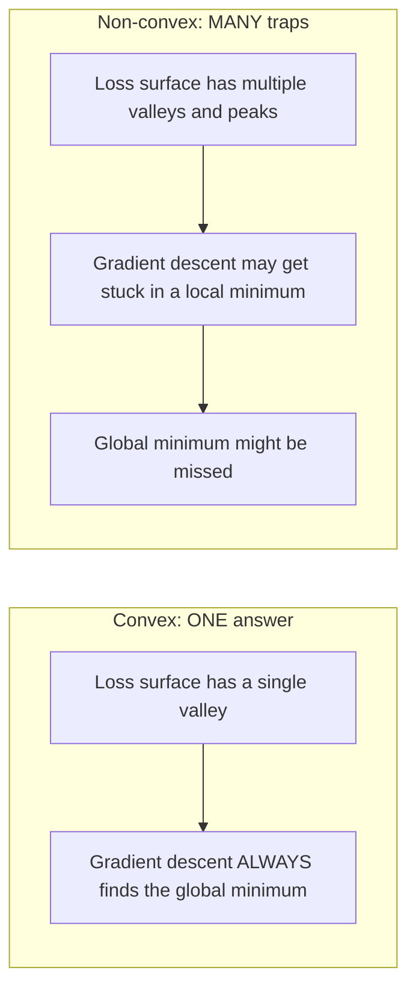
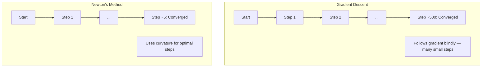
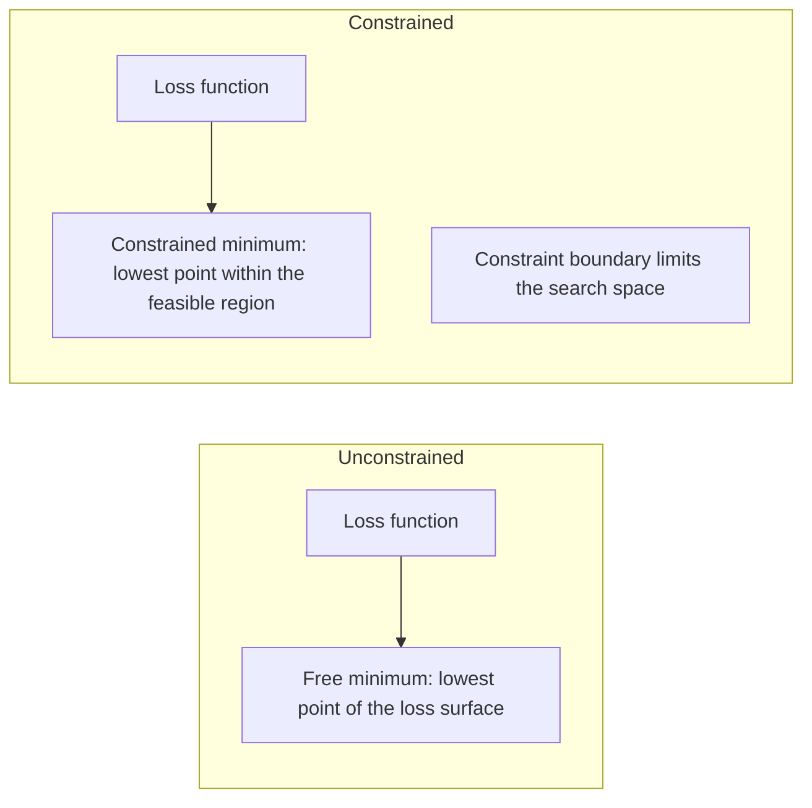
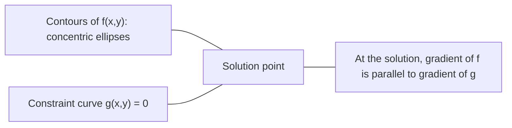

# 凸优化

> 凸 समस्या केवल एक ही है।

**类型：**构建
**语言：**पायथन
**前置要求：**चरण 1, पाठ 04 (ML के लिए गणना)
**时间：**≈ 90 मिनट

## 学习目标

- उपयोग परिभाषा、二阶导数和 हेशियन 判据测试 एक फ़ंक्शन क्या एक凸 फ़ंक्शन के लिए है
- न्यूटन की विधि को प्राप्त करने के लिए, इसे ग्रेडिएंट ड्रेसेंस से तुलना कीजिए
- उपयोग लाग्रेंज गुणक 求解带约束的优化问题,并解释 KKT शर्तें
-  explained why Neural Network Loss landscape is not concave, लेकिन SGD  अभी भी एक अच्छा समाधान खोजने में सक्षम है

## 问题

पाठ 08 सीखें आप ग्रेडिएंट अवतरण, क्षण और आदम. ये ऑप्टिमाइज़र किसी भी सतह पर ऊपर-नीचे चल सकते हैं. लेकिन वे गारंटी नहीं देते हैं. ग्रेडिएंट अवतरण गैर-कुम्फ परिदृश्य में खराब स्थानिक न्यूनतम मूल्य में पड़ सकता है, या तो सaddle point पर, या हमेशा झोंझोल। आप अभी भी इसका उपयोग करते हैं, क्योंकि तंत्रिका नेटवर्क गैर-कुम्फ है, और कोई विकल्प नहीं है।

लेकिन एमएल में कई समस्याएं हैं किम के। रैखिक प्रतिगमन, लॉजिस्टिक प्रतिगमन, एसवीएम, लसओ, रिज प्रतिगमन। इन समस्याओं के लिए, अधिक शक्तिशाली उपकरण हैंः साथ ही साथ गणितीय गारंटी का अनुकूलन।

समझना कि क्याम का तीन बिंदु मूल्य है। पहला, यह आपको बताता है कि क्याम का प्रश्न सरल है, क्याम का प्रश्न कठिन है। दूसरा, यह न्यूटन की विधि जैसे कि कम्फ के प्रश्न के लिए तेजी से उपकरण प्रदान करता है।

## 概念

### 凸集

यदि संच S के मध्य किसी भी दो बिंदुओं के लिए, उनके बीच का रेखा段 भी पूरी तरह से S के मध्य में स्थित है, तो संच S है凸集──

| 凸集 | 非凸 |
|---|---|
| **矩形**：内部任意两点都可以用一条仍在内部的线段连接 | **星形/月牙形**：两个内部点之间的线段可能穿过集合外部 |
| **三角形**：对所有内部点都满足相同性质 | **甜甜圈/环形**：中间的孔意味着某些线段会离开集合 |
| 任意两点之间的线段都留在集合内 | 某些点对之间的线段会离开集合 |

形式化测试: के लिए S 中任意点 x、y, तथा [0, 1],点 tx + (1-t) y 也在 S 中。

凸集 उदाहरण:
- एक सीधी रेखा, एक समतल, पूरे आर
- एक गेंद (圆、球体、超球)
- एक आधा अंतरिक्ष: {x: a^T x <= b}
- 任意数凸集的交交交

गैर-घटक उदाहरणः
- एक मिठाई चक्कर
- 两个不相交圆的并集
- किसी भी प्रकार के जाल या छेद के साथ

### 凸函数

यदि फ़ंक्शन f का परिभाषित क्षेत्र है, और इसके परिभाषित क्षेत्र में किसी भी दो बिंदु x、y, तथा [0, 1] में किसी भी t के लिएः

```
f(tx + (1-t)y) <= t*f(x) + (1-t)*f(y)
```

几何上看: चित्र पर किसी भी दो बिंदुओं के बीच की रेखा खंड चित्र के ऊपर या चित्र पर स्थित है।

| 属性 | 凸函数 | 非凸函数 |
|---|---|---|
| **线段测试** | 图像上任意两点之间的线段位于曲线**之上或之上** | 图像上某些点之间的线段会下探到曲线**之下** |
| **形状** | 单个向上弯曲的碗/谷底 | 多个峰和谷，曲率混合 |
| **局部最小值** | 每个局部最小值都是全局最小值 | 可能存在多个高度不同的局部最小值 |

常见凸函数:
- f(x) = x^2(抛物线)
- f(x) =) ✓x ✓ ✓ ✓ ✓ ✓ ✓ ✓ ✓ ✓ ✓ ✓ ✓ ✓ ✓ ✓ ✓ ✓ ✓ ✓ ✓ ✓ ✓ ✓ ✓ ✓ ✓ ✓ ✓ ✓ ✓ ✓ ✓ ✓ ✓ ✓ ✓ ✓ ✓ ✓ ✓ ✓ ✓ ✓ ✓ ✓ ✓ ✓ ✓ ✓ ✓ ✓ ✓ ✓ ✓ ✓ ✓ ✓ ✓ ✓ ✓ ✓ ✓ ✓ ✓ ✓ ✓ ✓ ✓ ✓ ✓ ✓ ✓ ✓ ✓ ✓ ✓ ✓ ✓ ✓ ✓ ✓ ✓ ✓ ✓ ✓ ✓ ✓ ✓ ✓ ✓ ✓ ✓ ✓ ✓ ✓ ✓ ✓ ✓ ✓ ✓ ✓ ✓ ✓ ✓ ✓ ✓ ✓ ✓ ✓ ✓ ✓ ✓ ✓ ✓ ✓ ✓ ✓ ✓ ✓ ✓ ✓ ✓ ✓ ✓ ✓ ✓ ✓ ✓ ✓ ✓ ✓ ✓ ✓ ✓ ✓ ✓ ✓ ✓ ✓ ✓ ✓ ✓ ✓ ✓ ✓ ✓ ✓ ✓ ✓ ✓ ✓ ✓ ✓ ✓ ✓ ✓ ✓ ✓ ✓ ✓ ✓ ✓ ✓ ✓ ✓ ✓ ✓ ✓ ✓ ✓ ✓ ✓ ✓ ✓ ✓ ✓ ✓ ✓ ✓ ✓ ✓ ✓ ✓ ✓ ✓ ✓ ✓ ✓ ✓ ✓ ✓ ✓ ✓ ✓ ✓ ✓ ✓ ✓ ✓ ✓ ✓ ✓ ✓ ✓ ✓ ✓ ✓ ✓ ✓ ✓ ✓ ✓ ✓ ✓ ✓ ✓ ✓ ✓ ✓ ✓ ✓ ✓ ✓ ✓ ✓ ✓ ✓ ✓ ✓ ✓ ✓ ✓ ✓ ✓ ✓ ✓ ✓
- f(x) = e^x(指数)
- f(x) = अधिकतम(0, x)(ReLU, यद्यपि यह分段线性 है)
- f(x) = -log(x) के लिए x > 0(负对数)
- 任意线性函数 f(x) = a^T x + b(既凸又)

### 测试凸性

तीन प्रयोगात्मक परीक्षण, सबसे आसान से लेकर सबसे कठोर तक।

**测试 1：二阶导数测试（1D）。**यदि सभी x के लिए f'(x) >= 0, तो f है凸函数。

- f(x) = x^2:f'(x) = 2 >= 0。凸──
- f(x) = x^3:f'(x) = 6x。x < 0 时为负──非凸──
- f(x) = e^x: f'(x) = e^x > 0。凸。

**测试 2：Hessian 测试（多变量）。**यदि हेसियन मैट्रिक्स H(x) सभी x के लिए सकारात्मक अर्ध-परिभाषित है, तो f है凸函数。 हेसियन है द्वितीय श्रेणी के परिधि संचयी मैट्रिक्स。

**测试 3：定义测试。**直接检查不等式 f(tx + (1-t) y) <= t*f(x) + (1-t) *f(y)。适用于导数难以计算的函数。

### क्यों महत्वपूर्ण है

凸优化的 मूल सिद्धांत:

**对于凸函数，每个局部最小值都是全局最小值。**

इसका अर्थ है कि ग्रेडिएंट डेसेंट को फंस नहीं दिया जाएगा। नीचे की ओर कोई भी मार्ग एक ही उत्तर की ओर जाता है।



结果:
- कोई आवश्यकता नहीं
- जटिल सीखने की दर के समायोजन की आवश्यकता नहीं है
- प्राप्ति को साबित कर सकते हैं (आकार का अनुपात फ़ंक्शन के गुण पर निर्भर करता है)
- 解是唯一的 (पृथ्वी के अलावा)

### एमएल के बीच का कम्बल और गैर कम्बल

| 问题 | 凸？ | 原因 |
|---------|---------|-----|
| Linear regression (MSE) | 是 | Loss 关于权重是二次的 |
| Logistic regression | 是 | Log-loss 关于权重是凸的 |
| SVM (hinge loss) | 是 | 线性函数的最大值 |
| LASSO (L1 regression) | 是 | 凸函数之和是凸的 |
| Ridge regression (L2) | 是 | 二次 + 二次 = 凸 |
| Neural Network（任意 Loss） | 否 | 非线性 activations 会产生非凸 landscape |
| k-means clustering | 否 | 离散分配步骤 |
| Matrix factorization | 否 | 未知量的乘积 |

带有凸 Loss का रैखिक मॉडल 凸的── एक बार जुड़ने के बाद 带有非线性 सक्रियण के छिपे हुए परत,凸性 नष्ट हो जाएगी──

### हेसियन मैट्रिक्स

函数 f: R^n -> R का हेसियन H है द्वी चरण偏导数组成的 n x n मैट्रिक्स。

```
H[i][j] = d^2 f / (dx_i dx_j)
```

对于 f(x, y) = x^2 + 3xy + y^2:

```
df/dx = 2x + 3y       d^2f/dx^2 = 2      d^2f/dxdy = 3
df/dy = 3x + 2y       d^2f/dydx = 3      d^2f/dy^2 = 2

H = [ 2  3 ]
    [ 3  2 ]
```

Hessian 告诉你曲率信息:
- स्वमूल्य पूर्ण为正: फ़ंक्शन प्रत्येक दिशा में ऊपर से ऊपर है
- स्वमूल्य 全为负: प्रत्येक दिशा में सभी ओर नीचे 曲 (), अधिकतम मूल्य)
- 符号混合:सैडल प्वाइंट ((कुछ दिशाएं ऊपर曲, अन्य दिशाएं नीचे曲)
- 零 स्वमूल्य:该方向上是平坦的(退化)

                                                                                                                                                                                                                                                              

### न्यूटन की विधि

ग्रेडिएंट अवतरण उपयोग एक चरण सूचना ((ग्रेडिएंट) ――न्यूटन की विधि उपयोग दो चरण सूचना ((हेशियन) ・・・ यह एक दूसरे निकटता के लिए वर्तमान बिंदु पर उपयुक्त है, फिर सीधे उस दूसरे कार्य के न्यूनतम मूल्य पर कूदता है。

```
Update rule:
  x_new = x - H^(-1) * gradient

Compare to gradient descent:
  x_new = x - lr * gradient
```

न्यूटन की विधि के विपरीत हेसियन 替代标量学习率── यह स्थानीय वक्रता दर के आधार पर स्वचालित रूप से समायोजन और दिशा में उपयोग की जाती है──



优点:
- 接近最小值时二次收(每步误差平方级下降)
- 调学习 दर की आवश्यकता नहीं
- 尺度不变 (आप जो भी काम कर सकते हैं, वह सब कुछ है)

缺点:
- 計算 Hessian 需要 O(n^2) 内存,求逆需要 O(n^3)
- एक लाख भार के साथ तंत्रिका नेटवर्क के लिए, यह 10 12 अनुच्छेद और 10 18 ऑपरेशन का मतलब है
- गहन शिक्षा के लिए अप्रयुक्त

### 约束优化

无约束优化:在所有 x上最小化 f(x) ⋅
约束优化: 约束条件下最小化 f (x) ⋅

现实问题有约束――你想最小化成本,但预算有限――你想最小化错误,但模型复杂性有限――



### लॅग्रेंज गुणक

लॅग्रेंज गुणक 方法把束问题转换为无束问题――

问题:在 g(x) = 0 的约束下最小化 f(x)。

解法:引入一个新变量 (अधिक संख्या में गुणांक)

```
L(x, lambda) = f(x) + lambda * g(x)
```

                                                                                                                                                                                                                                                              

```
dL/dx = df/dx + lambda * dg/dx = 0
dL/dlambda = g(x) = 0
```

几何直觉:                                                                                                                                                                                                                                                            



उदाहरण: में x + y = 1 के约束下最小化 f(x,y) = x^2 + y^2。

```
L = x^2 + y^2 + lambda(x + y - 1)

dL/dx = 2x + lambda = 0  =>  x = -lambda/2
dL/dy = 2y + lambda = 0  =>  y = -lambda/2
dL/dlambda = x + y - 1 = 0

From first two: x = y
Substituting: 2x = 1, so x = y = 0.5, lambda = -1
```

सीधा रेखा x + y = 1 ऊपर की दूरी मूल बिंदु से निकटतम बिंदु है (0.5, 0.5) ⋅

### केकेटी की शर्तें

करुश-कुह-टकर की स्थिति में लैग्रेंज गुणक  विस्तार से 

问题:在 g_i(x) <= 0,i = 1, ..., m 的约束下最小化 f(x) 』

केकेटी की शर्तें (अधिकतम उत्कृष्ट आवश्यकताएं):

```
1. Stationarity:    df/dx + sum(lambda_i * dg_i/dx) = 0
2. Primal feasibility:  g_i(x) <= 0  for all i
3. Dual feasibility:    lambda_i >= 0  for all i
4. Complementary slackness:  lambda_i * g_i(x) = 0  for all i
```

पूरक ढीलापन                                                                                                                                                                                                                                                            

केकेटी स्थितियां एसवीएम का केंद्र हैं। समर्थन वेक्टरों का एक समूह है। सक्रिय डेटा बिंदुओं का एक समूह है।

### नियमन 作为束优化

L1 और L2 नियमितता कोई सहज तकनीक नहीं है।

**L2 regularization (Ridge)：**

```
minimize  Loss(w)  subject to  ||w||^2 <= t

Equivalent unconstrained form:
minimize  Loss(w) + lambda * ||w||^2
```

约束 约束 约束 约束 约束 约束 约束 约束 约束 约束 约束 约束 约束 约束 约束 约束 约束 约束 约束 约束 约束 约束 约束 约束 约束 约束 约束 约束 约束 约束 约束 约束 约束 约束 约束 约束 约束 约束 约束 约束 约束 约束 约束 约束 约束 约束 约束 约束 约束 约束 约束 约束 约束 约束 约束 约束 约束 约束 约束 约束 约束 约束 约束 约束 约束 约束 约束 约束 约束 约束 约束 约束 约束 约束 约束 约 约 约 约 约 约 约 约 约 约 约 约 约 约 约 约 约 约 约 约 约 约 约 约 约 约 约 约 约 约 约 约 约 约 约 约 约 约 约 约 约 约 约 约 约 约 约 约 约 约 约 约 约 约 约 约 约 约 约 约 约 约 约 约 约 约 约 约 约 约 约 约 约 约 约 约 约 约 约 约 约 约 约      约 约                                                                                                              

**L1 regularization (LASSO)：**

```
minimize  Loss(w)  subject to  ||w||_1 <= t

Equivalent unconstrained form:
minimize  Loss(w) + lambda * ||w||_1
```

约束 束 束 束 束 束 束 束 束 束 束 束 束 束 束 束 束 束 束 束 束 束 束 束 束 束 束 束 束 束 束 束 束 束 束 束 束 束 束 束 束 束 束 束 束 束 束 束 束 束 束 束 束 束 束 束 束 束 束 束 束 束 束 束 束 束 束 束 束 束 束 束 束 束 束 束 束 束 束 束 束 束 束 束 束 束 束 束 束 束 束 束 束 束 束 束 束 束 束 束 束 束 束 束 束 束 束 束 束 束 束 束 束 束 束 束 束 束 束 束 束 束 束 束 束 束 束 束 束 束 束 束 束 束 束 束 束 束 束 束 束 束 束 束                                                                                                                                                                                                                             

| 属性 | L2 约束（圆） | L1 约束（菱形） |
|---|---|---|
| **约束形状** | 圆（更高维中是球面） | 菱形（2D 中旋转的正方形） |
| **Loss 等高线接触的位置** | 光滑边界：圆上的任意点 | 角点：与某个轴对齐 |
| **解的行为** | 权重较小但非零 | 某些权重恰好为零（稀疏） |
| **结果** | 权重收缩 | 特征选择 |

यह समझाता है कि L1 क्यों दुर्लभ मॉडल उत्पन्न करेगा, जबकि L2 केवल वजन का छोटा होना है।

### द्वैतता

प्रत्येक के लिए एक साथ एक समस्या है।

लैग्रंजियन दोहरी कार्यः

```
Primal: minimize f(x) subject to g(x) <= 0
Lagrangian: L(x, lambda) = f(x) + lambda * g(x)
Dual function: d(lambda) = min_x L(x, lambda)
Dual problem: maximize d(lambda) subject to lambda >= 0
```

क्यों द्वैतता महत्वपूर्ण हैः
- दोहरी समस्या कभी-कभी प्राथमिक से अधिक आसानी से हल की जाती है
- SVM दोहरे रूप से 求解, जिसमें से समस्या डेटा बिंदुओं के बीच डॉट उत्पादों पर निर्भर है (
- दोहरी  प्रदान करने के लिए प्राथमिक इष्टतम के नीचे की सीमा, प्रयोग किया जा सकता है जांच के लिए गुणवत्ता

具体到SVM:

```
Primal: find w, b that maximize the margin 2/||w|| subject to
        y_i(w^T x_i + b) >= 1 for all i

Dual:   maximize sum(alpha_i) - 0.5 * sum_ij(alpha_i * alpha_j * y_i * y_j * x_i^T x_j)
        subject to alpha_i >= 0 and sum(alpha_i * y_i) = 0

The dual only involves dot products x_i^T x_j.
Replace x_i^T x_j with K(x_i, x_j) to get the kernel trick.
```

### क्यों गहन शिक्षा अभी भी काम कर सकती है

न्यूरल नेटवर्क हानि फ़ंक्शन 极其非凸── प्रत्येक क्लासिक मानदंड के अनुसार, अनुकूलित करना उन्हें सभी विफल होना चाहिए── हालांकि स्टोकास्टिक ग्रेडिएंट वंशानुक्रम  विश्वसनीय रूप से एक अच्छा समाधान ढूंढ सकता है── कई कारक इस बात की व्याख्या करते हैं──

**大多数局部最小值已经足够好。**उच्चतम स्थान में, प्रत्येक महत्वपूर्ण बिंदु (उच्चतम स्थान में) सेटल बिंदुओं के बजाय स्थानिक न्यूनतम मूल्य हैं। कुछ स्थानिक न्यूनतम मूल्य आमतौर पर पूरे स्थानिक न्यूनतम मूल्य के करीब होता है।

**真正的障碍是 saddle points，而不是局部最小值。**एक में n 个参数 के फ़ंक्शन में, सaddle point समान रूप से सकारात्मक वक्रता और नकारात्मक वक्रता के साथ दिशा में है। उच्च स्तर के किसी भी महत्वपूर्ण बिंदु के लिए, सभी n 个 स्व-मूल्यों का अनुमानित स्थानिक न्यूनतम मूल्य (N) के लिए लगभग 2^(-n) है। लगभग सभी महत्वपूर्ण बिंदु सaddle points हैं।

**Overparameterization 会平滑 landscape。**参数 संख्या प्रशिक्षण नमूने के नेटवर्क में अधिक है अधिक चिकनी  अधिक कनेक्ट होता है हानि सतहों  व्यापक नेटवर्क में कम खराब स्थानिक न्यूनतम मूल्य  यह अंतर्ज्ञान के विपरीत है, लेकिन अनुभव के परिणामों के साथ मेल खाता है

**Loss landscape 结构：**

| 属性 | 低维空间 | 高维空间 |
|---|---|---|
| **Landscape** | 许多孤立的峰和谷 | 平滑连通的谷 |
| **最小值** | 许多孤立局部最小值 | 很少有糟糕局部最小值；大多数接近最优 |
| **导航** | 难以找到全局最小值 | 许多路径通向好的解 |
| **Critical points** | 局部最小值和 saddle points 混合 | 压倒性地是 saddle points，而非局部最小值 |

**随机噪声充当隐式 regularization。**मिनी-बैच एसजीडी  शोर का परिचय, तेज न्यूनतम में गिरावट को रोकने हेतु  शार्प न्यूनतम  आसानी से अनुकूलित; फ्लैट न्यूनतम 泛化更好── शोर प्रदूषण के अनुकूलन के लिए अनुकूलित होगा।

### 实践中的二阶方法

शुद्ध न्यूटन की विधि बड़े मॉडल के लिए अप्रयुक्त है  कुछ निकटतापूर्ण तरीके दूसरे चरण की जानकारी को उपलब्ध कराने के लिए 

**L-BFGS (Limited-memory BFGS)：**उपयोग हालिया m 个 ग्रेडिएंट 差分近似逆赫西亚语──需要 O(mn) 内存, बजाय O(n^2)──适用于最多约10,000 个参数问题──适用于经典ML(लॉजिकल रेग्रेशन、CRFs),但不用于深度学习──

**Natural gradient：**फ़िशर सूचना मैट्रिक्स का उपयोग करना (लग-संभावना की अपेक्षाएं हेसियन) मानक हेसियन के बजाय। यह अनुमानित वितरण की संभावना को ध्यान में रखता है।

**Hessian-free optimization：**उपयोग संयुग्मित ग्रेडिएंट 求解 Hx = g, स्पष्ट रूप से H  को आकार देने के लिए H  को उपयोग करें। केवल हेसन वेक्टर उत्पादों की आवश्यकता होती है, जो स्वचालित भिन्नता के माध्यम से किया जा सकता है।

**Diagonal approximations：**आदम का दूसरा क्षण हेसियन के कोण के लिए कोण के लिए निकटता है।

| 方法 | 内存 | 每步成本 | 何时使用 |
|--------|--------|--------------|-------------|
| Gradient Descent | O(n) | O(n) | Baseline，大模型 |
| Newton's method | O(n^2) | O(n^3) | 小型凸问题 |
| L-BFGS | O(mn) | O(mn) | 中型凸问题 |
| Adam | O(n) | O(n) | Deep Learning 默认选择 |
| K-FAC | O(n) | 每层 O(n) | 研究、大 batch training |


```figure
convex-vs-nonconvex
```

##  इसे निर्माण

### 步骤 1:凸性检查器

 एक फ़ंक्शन का निर्माण,  से नमूना बिंदु और जाँच परिभाषा के माध्यम से अनुभवात्मक परीक्षण और परीक्षण की परिभाषा 

```python
import random
import math

def check_convexity(f, dim, bounds=(-5, 5), samples=1000):
    violations = 0
    for _ in range(samples):
        x = [random.uniform(*bounds) for _ in range(dim)]
        y = [random.uniform(*bounds) for _ in range(dim)]
        t = random.uniform(0, 1)
        mid = [t * xi + (1 - t) * yi for xi, yi in zip(x, y)]
        lhs = f(mid)
        rhs = t * f(x) + (1 - t) * f(y)
        if lhs > rhs + 1e-10:
            violations += 1
    return violations == 0, violations
```

### 步骤 2: 2D के न्यूटन के विधि के लिए उपयोग किया

प्रयोग स्पष्ट हेसन 实现 न्यूटन की विधि 将收速度与渐进下降比较

```python
def newtons_method(f, grad_f, hessian_f, x0, steps=50, tol=1e-12):
    x = list(x0)
    history = [x[:]]
    for _ in range(steps):
        g = grad_f(x)
        H = hessian_f(x)
        det = H[0][0] * H[1][1] - H[0][1] * H[1][0]
        if abs(det) < 1e-15:
            break
        H_inv = [
            [H[1][1] / det, -H[0][1] / det],
            [-H[1][0] / det, H[0][0] / det],
        ]
        dx = [
            H_inv[0][0] * g[0] + H_inv[0][1] * g[1],
            H_inv[1][0] * g[0] + H_inv[1][1] * g[1],
        ]
        x = [x[0] - dx[0], x[1] - dx[1]]
        history.append(x[:])
        if sum(gi ** 2 for gi in g) < tol:
            break
    return history
```

### 步骤 3:लार्गेज गुणक 求解器

通过在拉格兰基上执行 渐进下降 来求解约束优化──

```python
def lagrange_solve(f_grad, g_val, g_grad, x0, lr=0.01,
                   lr_lambda=0.01, steps=5000):
    x = list(x0)
    lam = 0.0
    history = []
    for _ in range(steps):
        fg = f_grad(x)
        gv = g_val(x)
        gg = g_grad(x)
        x = [
            xi - lr * (fgi + lam * ggi)
            for xi, fgi, ggi in zip(x, fg, gg)
        ]
        lam = lam + lr_lambda * gv
        history.append((x[:], lam, gv))
    return history
```

### 步骤 4: प्रथम चरण की तुलना द्वितीय चरण से करें

उसी द्वितीय कार्य पर चलती है ग्रेडिएंट डेसेंट तथा न्यूटन की विधि──

```python
def quadratic(x):
    return 5 * x[0] ** 2 + x[1] ** 2

def quadratic_grad(x):
    return [10 * x[0], 2 * x[1]]

def quadratic_hessian(x):
    return [[10, 0], [0, 2]]
```

न्यूटन की विधि 1 步内收 में होगी, यह दूसरे कार्य के लिए सटीक है) ◊ ग्रेडिएंट डिसेंट में 100 कदम की आवश्यकता होगी, क्योंकि हेसियन के स्वमूल्य 5 गुना से भिन्न होते हैं, जिससे एक लंबा घाटी बनती है ◊

## इसका उपयोग करें

                                                                                                                                                                                                                                                              

对于凸问题(लॉजिस्टिक रेग्रेशन、SVMs、LASSO):
- प्रयोग专用 solver(लिबलाइनर、CVXPY、scipy.optimize.minimize with method='L-BFGS-B')
- 预期 प्राप्त करने के लिए अद्वितीय समग्र हल
- द्वितीय चरण विधि व्यावहारिक तथा शीघ्र

对于非凸问题:
- प्रयोग एक阶方法(एसजीडी、आदम)
-                                                                                                                                                                                                                                                               
- उपयोग ओवरपेरैमेटरीकरण, शोर और सीखने की दर के रूप में विनियमन
- एक अच्छे स्थान पर न्यूनतम मूल्य पर्याप्त है।

```python
from scipy.optimize import minimize

result = minimize(
    fun=lambda w: sum((y - X @ w) ** 2) + 0.1 * sum(w ** 2),
    x0=np.zeros(d),
    method='L-BFGS-B',
    jac=lambda w: -2 * X.T @ (y - X @ w) + 0.2 * w,
)
```

 SVM के लिए, दोहरे सूत्र  तुम कर सकते हैं उपयोग कर सकते हैं कर्नेल ट्रिकः

```python
from sklearn.svm import SVC

svm = SVC(kernel='rbf', C=1.0)
svm.fit(X_train, y_train)
print(f"Support vectors: {svm.n_support_}")
```

## अभ्यास

1. **凸性画廊。**प्रयोग检查器测试 इन कार्यों की凸性:f(x) = x^4、f(x) = sin(x)、f(x,y) = x^2 + y^2、f(x,y) = x*y、f(x) = max(x, 0) 😇 व्याख्या क्यों प्रत्येक परिणाम उचित है。

2. **Newton vs Gradient Descent 竞赛。**आरंभ बिंदु से (10, 10) निकलते समय, f ((x,y) = 50*x^2 + y^2 上运行两种方法── प्रत्येक विधि को नुकसान < 1e-10?

3. **Lagrange multiplier 几何。**在约束 x + 2y = 4 下最小化 f(x,y) = (x-3)^2 + (y-3)^2──通过检查解处 f 的渐进与 g 的渐进平行来验证解──

4. **Regularization 约束。** L1 सीमित अनुकूलन को प्राप्त करें: x में + y में <= 1 के बंधन के नीचे न्यूनतमकरण (x-3)^2 + (y-2)^2 दिखाएं एक आसन के बराबर शून्य है  आकार के बंधन से उत्पन्न दुर्लभता)

5. **Hessian eigenvalue 分析。**计算 Rosenbrock फ़ंक्शन 在 (1,1) 和 (-1,1) 处的赫西亚语――计算两个点处的自值――自值 告诉你最小值附近和远离最小值处的曲率有什么区别?

## 关键术语

| 术语 | 含义 |
|------|---------------|
| 凸集 | 集合中任意两点之间的线段仍留在集合内部的集合 |
| 凸函数 | 图像上任意两点之间的线段位于图像之上或图像上的函数。等价地，Hessian 在所有位置都是 positive semidefinite |
| 局部最小值 | 比所有邻近点都低的点。对于凸函数，每个局部最小值都是全局最小值 |
| 全局最小值 | 函数在其整个定义域上的最低点 |
| Hessian Matrix | 所有二阶偏导数组成的 Matrix。编码曲率信息 |
| Positive semidefinite | Eigenvalues 全部非负的 Matrix。是“二阶导数 >= 0”的多维类比 |
| Condition number | Hessian 的最大 eigenvalue 与最小 eigenvalue 的比值。高 condition number 意味着拉长的谷和缓慢的 Gradient Descent |
| Newton's method | 使用逆 Hessian 确定步进方向和大小的二阶 Optimizer。接近最小值时二次收敛 |
| Lagrange multiplier | 为了将约束优化问题转换为无约束问题而引入的变量 |
| KKT conditions | 不等式约束下最优性的必要条件。推广了 Lagrange multipliers |
| Complementary slackness | 在解处，约束要么是 active 的，要么其 multiplier 为零。二者不会同时非零 |
| Duality | 每个约束问题都有一个伴随的 dual problem。对于凸问题，二者具有相同的最优值 |
| Strong duality | Primal 和 dual 的最优值相等。对满足 Slater's condition 的凸问题成立 |
| L-BFGS | 近似二阶方法，存储最近 m 个 Gradient 差分，而不是完整 Hessian |
| Saddle point | Gradient 为零，但在某些方向上是最小值、在另一些方向上是最大值的点 |
| Overparameterization | 使用比训练样本更多的参数。会平滑 Loss landscape 并减少糟糕局部最小值 |

## 延伸阅读

- [Boyd & Vandenberghe: Convex Optimization](https://web.stanford.edu/~boyd/cvxbook/)- मानक शिक्षण सामग्री, ऑनलाइन निःशुल्क प्रदान
- [Bottou, Curtis, Nocedal: Optimization Methods for Large-Scale Machine Learning (2018)](https://arxiv.org/abs/1606.04838)- 连接凸优化理论与深度学习 实践
- [Choromanska et al.: The Loss Surfaces of Multilayer Networks (2015)](https://arxiv.org/abs/1412.0233)- क्यों गैर-अलंकृत तंत्रिका नेटवर्क परिदृश्यों को इतना बुरा नहीं लग रहा है
- [Nocedal & Wright: Numerical Optimization](https://link.springer.com/book/10.1007/978-0-387-40065-5)- न्यूटन की विधि  L-BFGS 和约束优化综合参考
