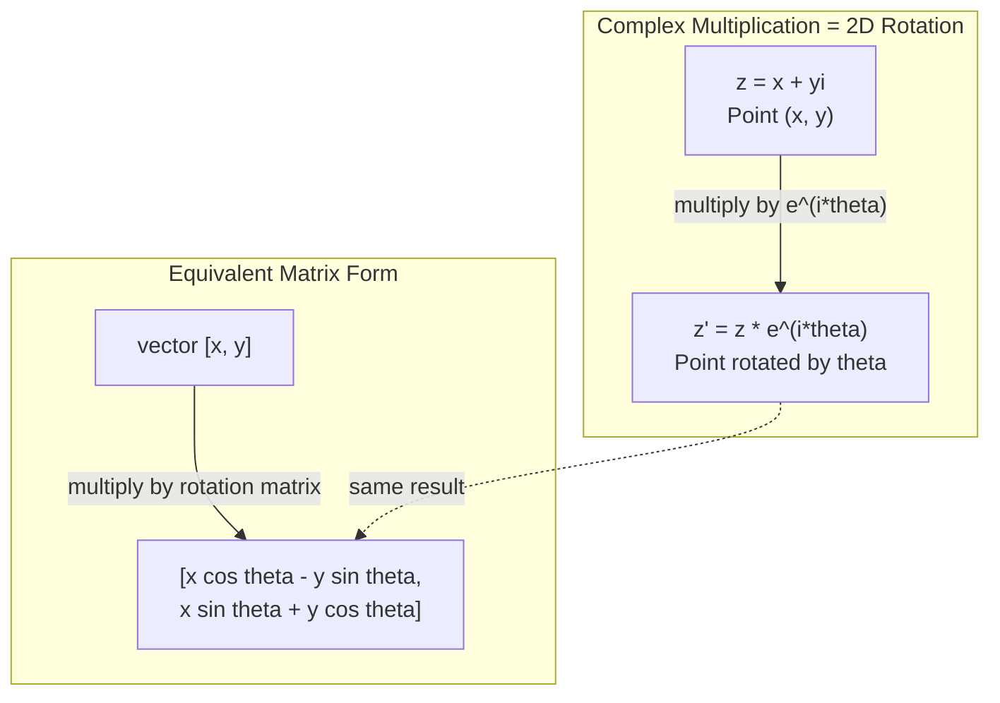
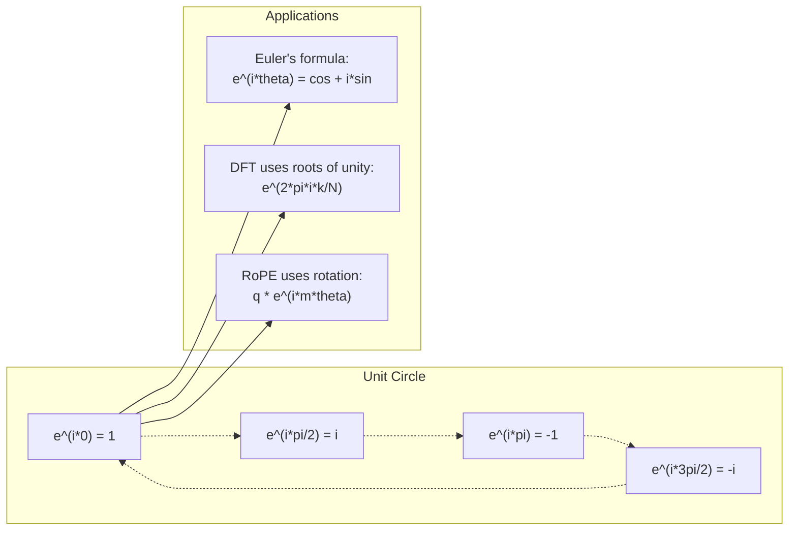

# AI 中中的复数

> -1 की वर्गमूल खोट नहीं है। यह घूर्णन, आवृत्ति तथा अर्धसिनल प्रसंस्करण क्षेत्र की कुंजी है।

**Type:** Learn
**Language:**पायथन
**Prerequisites:** Phase 1, Lessons 01-04（linear algebra, calculus）
**Time:** ~60 分钟

## 学习目标
-                                                                                                                                                                                                                                                               
-  अनुप्रयोग Euler के सूत्र में रूपांतरण 复指数与三角函数之间
- उपयोग करें प्रतिकृति इकाई आधार को प्राप्त करें
- 解释复数旋转 कैसे बनें ट्रांसफार्मर 中 RoPE 和正弦位置编码的基础

## 问题
तुम एक लेख खोलना Fourier परिवर्तनों के बारे में परिकल्पना, हर जगह हैं ।`i`你查看 ट्रांसफार्मर 位置编码, विभिन्न आवृत्ति के नीचे देखें `sin`和 `cos` 也就是复指数的实部和虚部──你读到量子计算,又发现一切都用复向 空间来表达──

复数 बहुत अमूर्त लगती है। -1 के वर्गमूल पर आधारित एक संख्यात्मक प्रणाली, एक प्रकार की गणितीय तकनीक की तरह महसूस होती है। लेकिन यह कोई तकनीक नहीं है। यह घूर्णन और झुकने की प्राकृतिक भाषा है।

यदि आप संख्या को नहीं समझते हैं, तो आप डिस्क्रिट फ़ौरियर ट्रांसफॉर्म को नहीं समझ सकते हैं। आप एफएफटी को नहीं समझ सकते हैं। आप आधुनिक भाषा मॉडल में रोपी (रोटरी स्थिति एम्बेडिंग) को नहीं समझ सकते हैं।

यह कक्षा शून्य से निर्माण से संख्यक परिचालन तक होगी, इसे भौतिकी से जोड़कर, और मशीन लर्निंग में संख्यक की स्थिति को प्रदर्शित करेगी।

## 概念
### क्या है?

复数 में दो भाग हैंः实部 और虚部──

```
z = a + bi

where:
  a is the real part
  b is the imaginary part
  i is the imaginary unit, defined by i^2 = -1
```

यही है। आप संख्या अक्ष को एक समतल में विस्तारित करते हैं। वास्तविक संख्या एक अक्ष पर स्थित है, शून्य संख्या दूसरी अक्ष पर स्थित है। प्रत्येक जटिल संख्या इस समतल पर एक बिंदु है।

### 复数运算

**加法。**实部相加,虚部相加──

```
(a + bi) + (c + di) = (a + c) + (b + d)i

Example: (3 + 2i) + (1 + 4i) = 4 + 6i
```

**乘法。**उपयोग वितरण विधि,并记住 i^2 = -1──

```
(a + bi)(c + di) = ac + adi + bci + bdi^2
                 = ac + adi + bci - bd
                 = (ac - bd) + (ad + bc)i

Example: (3 + 2i)(1 + 4i) = 3 + 12i + 2i + 8i^2
                            = 3 + 14i - 8
                            = -5 + 14i
```

**共轭。**翻转虚部的符号──

```
conjugate of (a + bi) = a - bi
```

एक गुणांक और उसके समकक्ष का गुणांक सामान्यतः वास्तविक संख्या हैः

```
(a + bi)(a - bi) = a^2 + b^2
```

**除法。**分子 और分母 एक ही समय में分母 के सम──

```
(a + bi) / (c + di) = (a + bi)(c - di) / (c^2 + d^2)
```

यह विभाजित में शून्य भाग को नष्ट कर देगा, एक शुद्ध गुणा प्राप्त करेगा।

### 复平面

复平面把每复数映射到一个2D点──水平轴是实轴,垂直轴是虚轴──

```
z = 3 + 2i  corresponds to the point (3, 2)
z = -1 + 0i corresponds to the point (-1, 0) on the real axis
z = 0 + 4i  corresponds to the point (0, 4) on the imaginary axis
```

复数同时是一点,也是从原点出发的向量── इस प्रकार का द्वि重解释正是复数在几何中有用的原因──

### 极坐标形式

समतल में किसी भी बिंदु को मूल बिंदु से दूरी के साथ-साथ उसके सापेक्ष वास्तविक धुरी के कोण के रूप में वर्णित किया जा सकता है।

```
z = r * (cos(theta) + i*sin(theta))

where:
  r = |z| = sqrt(a^2 + b^2)     (magnitude, or modulus)
  theta = atan2(b, a)             (phase, or argument)
```

直角形式(a + bi)适合加法──极坐标形式(r, theta)适合乘法──

**极坐标形式下的乘法。**模长相乘, कोण相加──

```
z1 = r1 * e^(i*theta1)
z2 = r2 * e^(i*theta2)

z1 * z2 = (r1 * r2) * e^(i*(theta1 + theta2))
```

यही कारण है कि एक बार में एक बार में एक बार में एक बार में एक बार में एक बार में एक बार में एक बार में एक बार में एक बार में एक बार में एक बार में एक बार में एक बार में एक बार में एक बार में एक बार में एक बार में एक बार में एक बार में एक बार में एक बार में एक बार में एक बार में एक बार में एक बार में एक बार में एक बार में एक बार में एक बार में एक बार में एक बार में एक बार में एक बार में एक बार में एक बार में एक बार में एक बार में एक बार में एक बार में एक बार में एक बार में एक बार में एक बार में एक बार में एक बार में एक बार में एक बार में एक बार में एक बार में एक बार में एक बार में एक बार में एक बार में एक बार में एक बार में एक बार में एक बार में एक बार में एक बार में एक बार में एक बार में एक बार में एक बार में एक बार में एक बार में एक बार में एक बार में एक बार में एक बार में एक बार में एक बार में एक बार में एक बार में एक बार में एक बार में एक बार में एक बार में एक बार में एक बार में एक बार में एक बार में एक बार में एक बार में एक बार में एक बार में एक बार में एक बार में एक बार में एक बार में एक बार में एक बार में एक बार में एक बार में एक बार में एक बार में एक बार में एक बार में एक बार में एक बार में एक बार में एक बार में एक बार में एक बार में एक बार में एक बार में एक बार में एक बार में एक बार में एक बार में एक बार में एक बार में एक बार में एक बार में एक बार में एक बार में एक बार में एक बार में एक बार में एक बार में एक बार में एक बार में एक बार में एक बार में एक बार में एक बार में एक बार में एक बार में एक बार में एक बार में एक बार में एक बार में एक बार में एक बार में एक बार में एक बार में एक बार में एक बार में एक बार में एक बार में एक बार में एक बार में एक बार में एक बार में एक बार में एक बार में एक बार में एक बार में एक बार में एक बार में एक बार में एक बार में एक बार में एक बार में एक बार में एक बार में एक बार में एक बार में एक बार में एक बार में एक बार में एक बार में एक बार में एक बार में एक बार में एक बार में एक बार में एक बार में एक बार

### यूलर का सूत्र

复指数 और三角函数 के बीच का पुल:

```
e^(i*theta) = cos(theta) + i*sin(theta)
```

यह इस वर्ग का सबसे महत्वपूर्ण सूत्र है।

```
e^(i*pi) = cos(pi) + i*sin(pi) = -1 + 0i = -1

Therefore: e^(i*pi) + 1 = 0
```

五个基本常数 ((e, i, pi, 1, 0) एक समीकरण से जुड़े हुए हैं

### एमएल के लिए यूलर का सूत्र क्यों महत्वपूर्ण है?

यूलर के सूत्र से पता चलता है,`e^(i*theta)`会随着太太 变化描绘单位圆──当太太 = 0 时,你在 (1, 0) ・当太太 = pi/2 时,你在 (0, 1) ・当太太 = pi 时,你在 (-1, 0) ・当太太 = 3*pi/2 时,你在 (0, -1) ・完整一圈旋转是太太 = 2*pi。

इसका अर्थ है कि पुन सूचकांक घूर्णन है तथा घूर्णन सिग्नल प्रसंस्करण और एमएल में कहीं भी नहीं है।

### 2D घुमावदार के साथ संपर्क

将复数 (x + yi) 乘以 e^(i*theta),会把点 (x, y) 周围原点旋转的角──

```
Rotation via complex multiplication:
  (x + yi) * (cos(theta) + i*sin(theta))
  = (x*cos(theta) - y*sin(theta)) + (x*sin(theta) + y*cos(theta))i

Rotation via matrix multiplication:
  [cos(theta)  -sin(theta)] [x]   [x*cos(theta) - y*sin(theta)]
  [sin(theta)   cos(theta)] [y] = [x*sin(theta) + y*cos(theta)]
```

它们产生完全相同的结果──复数乘法就是 2D 旋转──旋转矩阵 只是用矩阵 记法写出的复数乘法──



### फासर और घूर्णन संकेत

复指数 e^(i*omega*t) एक角频率 ओमेगा 绕单位圆旋转的点──随着t 增加,这个点将描绘出圆──

इस घूर्णन बिंदु के वास्तविक भाग में है cos(omega*t)。虚部 में है sin(omega*t)。正弦信号就是旋转复数投下的影子。

```
e^(i*omega*t) = cos(omega*t) + i*sin(omega*t)

Real part:      cos(omega*t)    -- a cosine wave
Imaginary part: sin(omega*t)    -- a sine wave
```

यही चरण का दर्शाता तरीका है। आप एक झूलते-झूलते स्ट्रिंग तरंग को नहीं, बल्कि एक समतल घूर्णन वाले तीर को देख रहे हैं।

### 单位根

N सेकंड यूनिट रूट है इकाई चक्र ऊपर और अलग-अलग वितरण के N 个点:

```
w_k = e^(2*pi*i*k/N)    for k = 0, 1, 2, ..., N-1
```

जब N = 4 时,根是:1, i, -1, -i(四个罗盘方向)
जब N = 8 होता है, तो आपको चार रोसस दिशाएँ मिलती हैं, फिर चार विपरीत दिशाएँ जोड़ती हैं।

单位根是分离福利变形的基础――DFT将信号分解为这个 N 个等间隔频率上的分量――

### डीएफटी के साथ संपर्क

信号 x[0], x[1], ..., x[N-1] का डिस्क्रिट फ़ूरी ट्रांसफ़ॉर्म है:

```
X[k] = sum_{n=0}^{N-1} x[n] * e^(-2*pi*i*k*n/N)
```

प्रत्येक X[k]  माप संकेत के साथ संबंध की डिग्री, यानि आवृत्ति k ् ् ् ् ् ् ् ् ् ् ् ् ् ् ् ् ् ् ् ् ् ् ् ् ् ् ् ् ् ् ् ् ् ् ् ् ् ् ् ् ् ् ् ् ् ् ् ् ् ् ् ् ् ् ् ् ् ् ् ् ् ् ् ् ् ् ् ् ् ् ् ् ् ् ् ् ् ् ् ् ् ् ् ् ् ् ् ् ् ् ् ् ् ् ् ् ् ् ् ् ् ् ् ् ् ् ् ् ् ् ् ् ् ् ् ् ् ् ् ् ् ् ् ् ् ् ् ् ् ् ् ् ् ् ् ् ् ् ् ् ् ् ् ् ् ् ् ् ् ् ् ् ् ् ् ् ् ् ् ् ् ् ् ् ् ् ् ् ् ् ् ् ् ् ् ् ् ् ् ् ् ् ् ् ् ् ् ् ् ् ् ् ् ् ् ् ् ् ् ् ् ् ् ् ् ् ् ् ् ् ् ् ् ् ् ् ् ् ् ् ् ् ् ् ् ् ् ् ् ् ् ् ् ् ् ् ् ् ् ् ् ् ् ् 

### क्यों मैं नहीं झूठा हूँ

कल्पना यह शब्द ऐतिहासिक संयोग है. डेसकार्ट्स 曾经带着轻蔑的意思使用它──但我并非比负数更虚──负数回答是:3 से घटाकर क्या प्राप्त करें 5? 虚数单位回答是:什么数平方后得到 -1?

अधिक उपयोगी समझ यह हैः i एक 90 डिग्री घूर्णन गणक है। एक वास्तविक संख्या को एक बार में गुणा करें, आप 90 डिग्री घूर्णन पर शून्य अक्ष में हैं। पुनः एक बार में दोहराएं, आप 90 डिग्री घूर्णन पर हैं, इस समय नकारात्मक वास्तविक अक्ष की ओर इंगित करते हैं। यही कारण है कि i^2 = -1। यह रहस्यमय नहीं है। यह दो चौथाई के एक चक्र से बना एक अर्धचक्र घूर्णन है।

यही कारण है कि जटिलताएं इंजीनियरिंग में कहीं भी मौजूद नहीं हैं। किसी भी घूर्णन वाली वस्तु का विद्युत चुम्बकीय तरंग, क्वांटम अवस्था, संकेत झोंका, स्थान कोड, सभी प्राकृतिक रूप से जटिलता के वर्णन के लिए उपयुक्त हैं।

### 复指数 बनाम 三角函数

 振幅 A、频率 omega、相位 phi── यह संभव है, लेकिन इसे कष्टप्रद बना देगा──相加两个相位的余弦需要三角恒等式──

प्रयोग复指数后, एक ही संकेत को A*e^(i*(omega*t + phi))。相加两个信号只是相加两个复数──相乘(调制)只是模长相乘、角度相加──相位偏移变成角度加法──频率偏移变成乘以phasor──

 पूरे संकेत प्रसंस्करण क्षेत्र में सभी को दोहराव के लिए बदल दिया गया है, क्योंकि गणित अधिक शुद्ध है  वास्तविक संकेत हमेशा केवल संख्याओं का प्रतिनिधित्व करने के लिए वास्तविक भाग 虚部 को एक साथ ले जाने के रूप में, सभी तत्वों का संचालन स्वाभाविक रूप से स्थापित करते हैं

### ट्रांसफार्मर के साथ संपर्क करें

**正弦位置编码**(原始 论文)

```
PE(pos, 2i) = sin(pos / 10000^(2i/d))
PE(pos, 2i+1) = cos(pos / 10000^(2i/d))
```

और क्योंकि यह प्रकट होता है, वे विभिन्न आवृत्तियों के तहत दोहरा सूचकांक के वास्तविक और虚部 हैं। प्रत्येक आवृत्ति को अलग-अलग स्थिति के लिए कोड किया जाता है।

**RoPE（Rotary Position Embedding）**और आगे── यह स्पष्ट रूप से दोहरा घूर्णन मैट्रिक्स  गुणा करके क्वेरी तथा कुंजी वेक्टर── दो टोकन के बीच की सापेक्ष स्थिति एक घुमावदार कोण में बदल जाती है── ध्यान इन घूर्णन के बाद के वेक्टर  गणना का उपयोग करके, मॉडल को सापेक्ष स्थिति के प्रति संवेदनशील बनाने के लिए कई गुना गुणा करता है──

| Operation | Algebraic Form | Geometric Meaning |
|-----------|---------------|-------------------|
| 加法 | (a+c) + (b+d)i | 平面中的 Vector 加法 |
| 乘法 | (ac-bd) + (ad+bc)i | 旋转并缩放 |
| 共轭 | a - bi | 关于实轴反射 |
| 模长 | sqrt(a^2 + b^2) | 到原点的距离 |
| 相位 | atan2(b, a) | 相对正实轴的角度 |
| 除法 | multiply by conjugate | 反向旋转并重新缩放 |
| 幂 | r^n * e^(i*n*theta) | 旋转 n 次，按 r^n 缩放 |




```figure
roots-of-unity
```

##  इसे निर्माण
### 步骤 1: जटिल 类

 एक जटिल संख्या वर्ग का निर्माण, 运算,模长,相位, तथा 直角形式 और 极坐标形式 के बीच परिवर्तन का समर्थन करना

```python
import math

class Complex:
    def __init__(self, real, imag=0.0):
        self.real = real
        self.imag = imag

    def __add__(self, other):
        return Complex(self.real + other.real, self.imag + other.imag)

    def __mul__(self, other):
        r = self.real * other.real - self.imag * other.imag
        i = self.real * other.imag + self.imag * other.real
        return Complex(r, i)

    def __truediv__(self, other):
        denom = other.real ** 2 + other.imag ** 2
        r = (self.real * other.real + self.imag * other.imag) / denom
        i = (self.imag * other.real - self.real * other.imag) / denom
        return Complex(r, i)

    def magnitude(self):
        return math.sqrt(self.real ** 2 + self.imag ** 2)

    def phase(self):
        return math.atan2(self.imag, self.real)

    def conjugate(self):
        return Complex(self.real, -self.imag)
```

### 步骤 2:极坐标转换与尤勒 के सूत्र

```python
def to_polar(z):
    return z.magnitude(), z.phase()

def from_polar(r, theta):
    return Complex(r * math.cos(theta), r * math.sin(theta))

def euler(theta):
    return Complex(math.cos(theta), math.sin(theta))
```

验证:`euler(theta).magnitude()`应始终为1.0──`euler(0)`应给出 (1, 0)`euler(pi)`应给出 (-1, 0)

### 步骤 3: घुमाव

将点 (x, y) 旋转 theta 角, केवल एक बार दोहराएँ गुणा करने की आवश्यकता हैः

```python
point = Complex(3, 4)
rotated = point * euler(math.pi / 4)
```

模长保持不变──只有角度发生变化──

### 步骤 4: दोहरा संख्याओं के आधार पर DFT

```python
def dft(signal):
    N = len(signal)
    result = []
    for k in range(N):
        total = Complex(0, 0)
        for n in range(N):
            angle = -2 * math.pi * k * n / N
            total = total + Complex(signal[n], 0) * euler(angle)
        result.append(total)
    return result
```

यह ओ (एन) 2 का डीएफटी है। प्रत्येक आउटपुट एक्स (के) में एक संकेत नमूना है।

### 步骤 5: उल्टा डीएफटी

उल्टा डीएफटी से आवृत्ति पर मूल संकेतों का पुनर्निर्माण होता है।

```python
def idft(spectrum):
    N = len(spectrum)
    result = []
    for n in range(N):
        total = Complex(0, 0)
        for k in range(N):
            angle = 2 * math.pi * k * n / N
            total = total + spectrum[k] * euler(angle)
        result.append(Complex(total.real / N, total.imag / N))
    return result
```

यह एक पूर्ण पुनर्निर्माण प्रदान करेगा। पहले डीएफटी का उपयोग करें, फिर आईडीएफटी का उपयोग करें, आप मशीन की सटीकता के दायरे में मूल संकेत प्राप्त करेंगे। कोई जानकारी नहीं खोई।

### 步骤 6: इकाई

```python
def roots_of_unity(N):
    return [euler(2 * math.pi * k / N) for k in range(N)]
```

验证 दो प्रकृतिएं:
- प्रत्येक जड़ के लिए एक के लिए कठोर है
- सभी के लिए एक दूसरे के प्रति प्रतिरोध

इन गुणों से डीएफटी को उलटा-उलटा किया जाता है।

## इसका उपयोग करें
पायथन 内置支持复数──字面量 `j`दिखाएँ

```python
z = 3 + 2j
w = 1 + 4j

print(z + w)
print(z * w)
print(abs(z))

import cmath
print(cmath.phase(z))
print(cmath.exp(1j * cmath.pi))
```

对于数组,numpy 原生支持复数:

```python
import numpy as np

z = np.array([1+2j, 3+4j, 5+6j])
print(np.abs(z))
print(np.angle(z))
print(np.conj(z))
print(np.real(z))
print(np.imag(z))

signal = np.sin(2 * np.pi * 5 * np.linspace(0, 1, 128))
spectrum = np.fft.fft(signal)
freqs = np.fft.fftfreq(128, d=1/128)
```

## 交付 यह
运行 `code/complex_numbers.py`उत्पन्न करने के लिए`outputs/skill-complex-arithmetic.md`

## अभ्यास
1. **手算复数运算。**計算 (2 + 3i) * (4 - i),并用代码验证──然后计算 (5 + 2i) / (1 - 3i)──把两个结果都画在复平面上,并检查乘法是否旋转并缩放第一数──

2. **旋转序列。**〇点 (1, 0) 开始──连续乘以 e^(i*pi/6) 十二次──验证 12次乘法后你会回到 (1, 0) ・印印每一步的坐标,并确认它们描绘出一个正 12边形──

3. **已知信号的 DFT。**创建一个信号,它在32个点上采用样 sin(2*pi*3*t) 与 0.5*sin(2*pi*7*t) 之和──运行你的DFT──验证幅度频谱在频率 3 和 7 处有峰值,并且频率 7 处的峰值高度是频率 3 处的一半──

4. **单位根可视化。**計算 8 次单位根──验证它们的和为零──验证任意根乘以本原根 e^(2*pi*i/8) 都会得到下一个根──

5. **旋转 Matrix 等价性。**10 ् ् ् ् ् ् ् ् ् ् ् ् ् ् ् ् ् ् ् ् ् ् ् ् ् ् ् ् ् ् ् ् ् ् ् ् ् ् ् ् ् ् ् ् ् ् ् ् ् ् ् ् ् ् ् ् ् ् ् ् ् ् ् ् ् ् ् ् ् ् ् ् ् ् ् ् ् ् ् ् ् ् ् ् ् ् ् ् ् ् ् ् ् ् ् ् ् ् ् ् ् ् ् ् ् ् ् ् ् ् ् ् ् ् ् ् ् ् ् ् ् ् ् ् ् ् ् ् ् ् ् ् ् ् ् ् ् ् ् ् ् ् ् ् ् ् ् ् ् ् ् ् ् ् ् ् ् ् ् ् ् ् ् ् ् ् ् ् ् ् ् ् ् ् ् ् ् ् ् ् ् ् ् ् ् ् ् ् ् ् ् ् ् ् ् ् ् ् ् ् ् ् ् ् ् ् ् ् ् ् ् ् ् ् ् ् ् ् ् ् ् ् ् ् ् ् ् ् ् ् ् ् ् ् ् ् ् ् ् ् ् ् ् ् ् ् ् ् ् ् ् ् ् ् 

## 关键术语
| Term | What it means |
|------|---------------|
| 复数 | 形如 a + bi 的数，其中 a 是实部，b 是虚部，并且 i^2 = -1 |
| 虚数单位 | 数 i，定义为 i^2 = -1。它在哲学意义上并不“虚”——它是一个旋转算子 |
| 复平面 | x 轴为实轴、y 轴为虚轴的 2D 平面。也称为 Argand plane |
| 模长（模） | 到原点的距离：sqrt(a^2 + b^2)。写作 \|z\| |
| 相位（辐角） | 相对正实轴的角度：atan2(b, a)。写作 arg(z) |
| 共轭 | 关于实轴的镜像：a + bi 的共轭是 a - bi |
| 极坐标形式 | 将 z 表示为 r * e^(i*theta)，而不是 a + bi。让乘法变得容易 |
| Euler's formula | e^(i*theta) = cos(theta) + i*sin(theta)。连接指数函数与三角函数 |
| Phasor | 表示正弦信号的旋转复数 e^(i*omega*t) |
| 单位根 | k = 0 到 N-1 时的 N 个复数 e^(2*pi*i*k/N)。单位圆上等间隔的 N 个点 |
| DFT | Discrete Fourier Transform。使用单位根将信号分解为复正弦分量 |
| RoPE | Rotary Position Embedding。使用复数乘法在 Transformer Attention 中编码相对位置 |

## 延伸阅读
- [Visual Introduction to Euler's Formula](https://betterexplained.com/articles/intuitive-understanding-of-eulers-formula/)- बिना भारी पत्रकारिता के मामले में स्थापित
- [Su et al.: RoFormer (2021)](https://arxiv.org/abs/2104.09864)-  प्रस्तावित प्रयोग दोहराव घूर्णन के रोटरी स्थिति एम्बेडिंग का निबंध
- [Vaswani et al.: Attention Is All You Need (2017)](https://arxiv.org/abs/1706.03762)-  प्रस्तावित正弦位置编码的原始变压器 论文
- [3Blue1Brown: Euler's formula with introductory group theory](https://www.youtube.com/watch?v=mvmuCPvRoWQ)- के लिए क्यों e^(i*pi) = -1 का दृश्य व्याख्या
- [Needham: Visual Complex Analysis](https://global.oup.com/academic/product/visual-complex-analysis-9780198534464)-                                                                                                                                                                                                                                                                                                                                                                                                                                                                                                                             
- [Strang: Introduction to Linear Algebra, Ch. 10](https://math.mit.edu/~gs/linearalgebra/)- 线性代数和特征值语境中的复数
