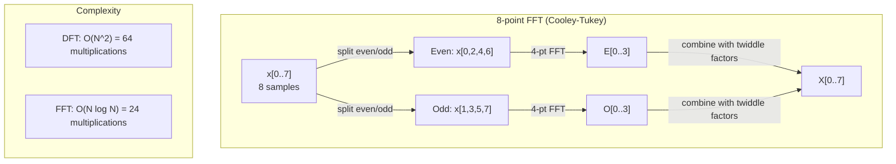
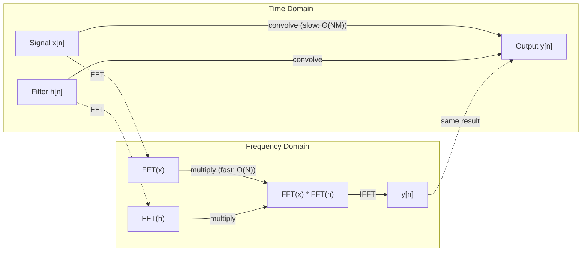

# फ़ुअरी परिवर्तन

> प्रत्येक संकेत सिनेस तरंगों का एक संयोजन है।

**Type:** Build
**Language:**पायथन
**Prerequisites:** Phase 1, Lessons 01-04, 19 (complex numbers)
**Time:** ~90 分钟

## 学习目标
- शून्य से DFT को प्राप्त करने के लिए,并使用O(N log N) का Cooley-Tukey FFT 验证它
- आवृत्ति गुणांक को समझनाः संकेत से मध्य提取 परिमाण, चरण तथा शक्ति स्पेक्ट्रम
-  अनुप्रयोग संभल प्रमेय, FFT गुणन के माध्यम से  निष्पादन संभल
- फोरेयर आवृत्ति विघटन और ट्रांसफार्मर स्थिति एन्कोडिंग और सीएनएन संवर्धन परतों को जोड़ने के लिए  संपर्क करें

## 问题
एक段音频录音 एक समय के साथ परिवर्तनशील दबाव मापने की एक श्रृंखला है। शेयर मूल्य एक श्रृंखला है जो आकाश में क्रमबद्ध है।

लेकिन कई पैटर्न समय डोमेन में अदृश्य हैं। यह ऑडियो सिग्नल शुद्ध स्वर या एकॉर्ड है? क्या यह साप्ताहिक चक्र है? क्या इस चित्र में दोहराव बनावट है? ये प्रश्न आवृत्ति सामग्री पर ध्यान केंद्रित करते हैं, जबकि समय डोमेन इसे छिपाएगा।

फ़ूरियर परिवर्तन समय डोमेन से डेटा को आवृत्ति डोमेन में परिवर्तित करेगा। यह एक संकेत प्राप्त करता है और इसे विभिन्न आवृत्तियों की साइन तरंगों में विभाजित करेगा। प्रत्येक साइन तरंग में एक परिमाण और एक चरण होता है।

यह एमएल के लिए  बहुत महत्वपूर्ण है, क्योंकि आवृत्ति-क्षेत्र सोच  सर्वत्र可见──कन्व्ह्यूशनल तंत्रिका नेटवर्क  कन्व्ल्यूशन निष्पादित करें, जबकि कन्व्ल्यूशन  फ़्रीक्वेंसी डोमेन में गुणा है──ट्रांसफॉर्मर पोजिशियल कोडिंग्स का उपयोग करें फ़्रीक्वेंसी विघटन                                                                                                                                                                                                                                                                                                                                                                                                                                             

## 概念
### डीएफटी परिभाषा

给定 N 个样本 x[0], x[1], ..., x[N-1],Discrete Fourier Transform 会生成 N 个 आवृत्ति गुणांक X[0], X[1], ..., X[N-1]:

```
X[k] = sum_{n=0}^{N-1} x[n] * e^(-2*pi*i*k*n/N)

for k = 0, 1, ..., N-1
```

प्रत्येक X[k] शहर एक जटिल संख्या है। इसकी मात्रा है। X[k] भी प्रवृत्तियों के परिमाण का प्रतिनिधित्व करता है।

关键洞见:`e^(-2*pi*i*k*n/N)`                                                                                                                                                                                                                                                              

### प्रत्येक अंक का अर्थ

**X[0]: DC component。**यह सभी नमूनों का योग है, औसत 成 अनुपात के साथ। यह संकेत का निरंतर प्रतिनिधित्व करता है।

```
X[0] = sum_{n=0}^{N-1} x[n] * e^0 = sum of all samples
```

**X[k] for 1 <= k <= N/2: positive frequencies。**X[k] प्रत्येक N 个 नमूने 中 k 个 चक्र का आवृत्ति──k 越大, आवृत्ति 越高(ओस्किलेशन 越快)。

**X[N/2]: Nyquist frequency。**यह N 个 नमूना 能表示的最高频率 है। इस आवृत्ति से अधिक, उपनाम दिखाई देगा, यानी उच्च आवृत्तियों 伪装 कम आवृत्तियों 

**X[k] for N/2 < k < N: negative frequencies。**对于真值信号,X[N-k] = conj(X[k])。 नकारात्मक आवृत्तियां ही सकारात्मक हैं 镜像──这就是为什么有用信息位于前 N/2 + 1 个系数中──

### उल्टा डीएफटी

रिवर्स डीएफटी से आवृत्ति गुणांक से पुनर्गठन मूल संकेतः

```
x[n] = (1/N) * sum_{k=0}^{N-1} X[k] * e^(2*pi*i*k*n/N)

for n = 0, 1, ..., N-1
```

यह आगे के डीएफटी से केवल एक अंतर हैः एक्सपेंेंट के बीच का प्रतीक सही है, नकारात्मक नहीं है), और इसमें 1/N सामान्यीकरण कारक है।

उल्टा डीएफटी एक सही पुनर्निर्माण है। कोई भी जानकारी नहीं खोई जाएगी। आप समय डोमेन से आवृत्ति डोमेन तक जा सकते हैं, फिर से लौट सकते हैं, बिना किसी त्रुटि के। डीएफटी एक आधार परिवर्तन है, यानी अलग-अलग समन्वय प्रणाली के साथ एक ही जानकारी को पुनः व्यक्त कर सकते हैं।

### FFT: इसे तेज करना

यदि ऊपर परिभाषित DFT है O(N^2): N 个 आउटपुट गुणांक के बीच के प्रत्येक के लिए, N 个 इनपुट नमूने के लिए 求和──当 N = 1 मिलियन 时, यह 10^12 बार संचालन है──

फास्ट फ़ूरियर ट्रांसफ़ॉर्म (एफएफटी) O  N log N 计算同样结果──当 N = 1 मिलियन 时, यह लगभग 20000000 बार संचालन है, एक बिलियन बार के बजाय।

Cooley-Tukey एल्गोरिथ्म ((( सबसे आम见的 FFT) का उपयोग विभाजित और जीतने के लिएः

1.  सिग्नल  को सम अनुक्रमित एवं विषम अनुक्रमित नमूनों में विभाजित करेगा
2. 递归计算每一半的DFT──
3. प्रयोग "द्विविध कारक" e^(-2*pi*i*k/N) 合并两个半尺寸 DFTs──

```
X[k] = E[k] + e^(-2*pi*i*k/N) * O[k]          for k = 0, ..., N/2 - 1
X[k + N/2] = E[k] - e^(-2*pi*i*k/N) * O[k]    for k = 0, ..., N/2 - 1

where E = DFT of even-indexed samples
      O = DFT of odd-indexed samples
```

इस प्रकार की सममितता का अर्थ होता है प्रत्येक परत का परिणत करना O (N) कार्य, तथा log2 (N) 层――总计:O (N) log N)──



FFT  सिग्नल लंबाई की आवश्यकता है 2 के ── अभ्यास में, संकेत आमतौर पर शून्य-पैड तक अगले 2 के ──

### स्पेक्ट्रम विश्लेषण

**power spectrum** X [k] है, जो कि प्रत्येक आवृत्ति गुणांक के वर्ग आयाम है  यह प्रत्येक आवृत्ति पर ऊर्जा का कितना है 

**phase spectrum**यह प्रत्येक आवृत्ति का चरण ऑफसेट है। अधिकांश विश्लेषण कार्यों के लिए, आप पावर स्पेक्ट्रम की चिंता करते हैं, और चरणों को अनदेखा करते हैं।

```
Power at frequency k:  P[k] = |X[k]|^2 = X[k].real^2 + X[k].imag^2
Phase at frequency k:  phi[k] = atan2(X[k].imag, X[k].real)
```

### आवृत्ति संकल्प

डीएफटी का आवृत्ति संकल्प ऩमों पर निर्भर करता है 数量 N 和 नमूनाकरण दर fs。

```
Frequency of bin k:      f_k = k * fs / N
Frequency resolution:    delta_f = fs / N
Maximum frequency:       f_max = fs / 2  (Nyquist)
```

दो बहुत ही निकट आवृत्तियों को अलग करने के लिए, आपको अधिक नमूनों की आवश्यकता है। उच्च आवृत्तियों को पकड़ने के लिए, आपको अधिक नमूनों की आवश्यकता है।

### संकुचन प्रमेय

यह सिग्नल प्रसंस्करण में सबसे महत्वपूर्ण परिणामों में से एक है, और सीएनएन से सीधे संबंधित है।

**time domain 中的 convolution 等于 frequency domain 中的 pointwise multiplication。**

```
x * h = IFFT(FFT(x) . FFT(h))

where * is convolution and . is element-wise multiplication
```

यह महत्वपूर्ण क्यों हैः

- 两个长度为 N 和 M के संकेत 直接卷曲 需要 O(N*M) संचालन。
- 基于 FFT 的卷曲 需要 O(N log N):परिवर्तन 两者、乘、परिवर्तन वापस──
- ् ् ् ् ् ् ् ् ् ् ् ् ् ् ् ् ् ् ् ् ् ् ् ् ् ् ् ् ् ् ् ् ् ् ् ् ् ् ् ् ् ् ् ् ् ् ् ् ् ् ् ् ् ् ् ् ् ् ् ् ् ् ् ् ् ् ् ् ् ् ् ् ् ् ् ् ् ् ् ् ् ् ् ् ् ् ् ् ् ् ् ् ् ् ् ् ् ् ् ् ् ् ् ् ् ् ् ् ् ् ् ् ् ् ् ् ् ् ् ् ् ् ् ् ् ् ् ् ् ् ् ् ् ् ् ् ् ् ् ् ् ् ् ् ् ् ् ् ् ् ् ् ् ् ् ् ् ् ् ् ् ् ् ् ् ् ् ् ् ् ् ् ् ् ् ् ् ् ् ् ् ् ् ् ् ् ् ् ् ् ् ् ् ् ् ् ् ् ् ् ् ् ् ् ् ् ् ् ् ् ् ् ् ् ् ् ् ् ् ् ् ् ् ् ् ् ् ् ् ् ् ् ् ् ् ् ् ् ् ् ् ् ् ् ् ् ् ् ् ् ् ् ् ् ्
- यह वास्तव में बड़े रिसेप्टिव क्षेत्रों के संवर्धित परतों में होता है।

ध्यानःDFT  गणना है परिपत्र घुमावदार (सग्नल)  (सग्नल)  (सग्नल)  (सग्नल)  (सग्नल)  (सग्नल)  (सग्नल)  (सग्नल)  (सग्नल)  (सग्नल) )  (सग्नल)  (सग्नल)  (सग्नल)  (सग्नल)  (सग्नल)  (सग्नल)  (सग्नल)  (सग्नल)  (सग्नल)  (सग्नल)  (सग्नल)  (सग्नल)  (सग्नल)  (सग्नल)  (सग्नल)  (सग्नल)  (सग्नल)  (सग्नल)  (सग्नल)  (सग्नल)  (सग्नल)  (सग्नल)  (सग्नल)  (सग्नल)  (सग्नल)  (द) )  (द)  ()  () () () () () () () () () () () () () () () () () () () () () () () () () ( () () () () () ( () () () ( () () ( () () () () () ( () ( () () () () ( ( () () () () ( () () () () () ( ( () () () ( () () ( () () () () ( () () () () (



### खिड़की

डीएफटी 假设信号是周期的,也就是把N 个样本 视为无限重复信号的一个周期──如果信号的起点和终点不是相同的值,就会在边界产生间断性,并表现为虚假的高频内容──这称为光谱泄漏──

विंडोरिंग बैठक में गणना डीएफटी पूर्व होगा संकेत 两端 taper到零, इस प्रकार रिसाव को कम करना 

常见 खिड़कियाँ:

| Window | Shape | Main lobe width | Side lobe level | Use case |
|--------|-------|----------------|-----------------|----------|
| Rectangular | 平坦（无 window） | 最窄 | 最高 (-13 dB) | 当 signal 在 N 个 samples 中正好 periodic 时 |
| Hann | Raised cosine | 中等 | 低 (-31 dB) | 通用 spectral analysis |
| Hamming | Modified cosine | 中等 | 更低 (-42 dB) | Audio processing、speech analysis |
| Blackman | Triple cosine | 宽 | 非常低 (-58 dB) | 当 side lobe suppression 至关重要时 |

```
Hann window:    w[n] = 0.5 * (1 - cos(2*pi*n / (N-1)))
Hamming window: w[n] = 0.54 - 0.46 * cos(2*pi*n / (N-1))
```

DFT  से पहले, विंडो संकेत के साथ तत्व-बुद्धिमान गुणा करने के लिए लागू विंडोः`X = DFT(x * w)`

### डीएफटी गुण

| Property | Time Domain | Frequency Domain |
|----------|-------------|-----------------|
| Linearity | a*x + b*y | a*X + b*Y |
| Time shift | x[n - k] | X[f] * e^(-2*pi*i*f*k/N) |
| Frequency shift | x[n] * e^(2*pi*i*f0*n/N) | X[f - f0] |
| Convolution | x * h | X * H (pointwise) |
| Multiplication | x * h (pointwise) | X * H (circular convolution, scaled by 1/N) |
| Parseval's theorem | sum \|x[n]\|^2 | (1/N) * sum \|X[k]\|^2 |
| Conjugate symmetry (real input) | x[n] real | X[k] = conj(X[N-k]) |

पार्सेवल का प्रमेय बताता है कि दो क्षेत्रों में कुल ऊर्जा एक ही है।

### स्थिति कोडिंग के साथ संपर्क

原始 ट्रांसफार्मर प्रयोग सिनोसाइडल स्थिति कोडिंगः

```
PE(pos, 2i)   = sin(pos / 10000^(2i/d_model))
PE(pos, 2i+1) = cos(pos / 10000^(2i/d_model))
```

प्रत्येक आयाम (2i, 2i+1) में विभिन्न आवृत्ति टरकावटों के साथ होते हैं। आवृत्तियों से उच्च (आयाम 0,1) से निम्न (आखिर) आयामों तक) ज्यामितीय अंतर के अनुसार 排列── यह प्रत्येक स्थिति को सभी आवृत्ति बैंडों में ऊपर एक अद्वितीय पैटर्न होता है, फ़ूरियर गुणांक की तरह  कैसे एक संकेत को अद्वितीय रूप से पहचानें──

यह प्रदान करता है कीट गुणः

- **Uniqueness:** किसी भी दो स्थानों में एक ही एन्कोडिंग नहीं होगी
- **Bounded values:**पाप और कारण 始终在 [-1, 1] 内。
- **Relative position:**स्थिति p+k का एन्कोडिंग स्थिति p 处 एन्कोडिंग के लिए रैखिक फ़ंक्शन को दर्शाया जा सकता है。 मॉडल सापेक्ष स्थितियों पर ध्यान केंद्रित करना सीख सकता है。

### सीएनएन से संबंध

संवर्धन परत 通过在信号或图像上滑动一个学习过器 (एक सीखे हुए फ़िल्टर) को लागू करेगा, इसे इनपुट पर लागू किया जाएगा।

 Convolution प्रमेय के अनुसार, यह बराबर है:
1. इनपुट  निष्पादन FFT
2. कर्नेल  निष्पादन FFT
3. आवृत्ति डोमेन में गुणा
4. परिणामों के लिए IFFT निष्पादन

标准 CNN 实现直接 convolution का उपयोग करना((छोटे 3x3 कर्नल के लिए 更快) 👇 लेकिन बड़े कर्नल या वैश्विक convolution के लिए, FFT पर आधारित विधि काफी अधिक तेजी से होगी। कुछ वास्तुकलाएं (जैसे FNet) पूरी तरह से FFT के साथ  ध्यान दें, O  N log N) और न कि O  N ^ 2) जटिलता में 

### स्पेक्ट्रोग्राम तथा अल्पकालिक फ़ूरियर ट्रांसफॉर्म

एक बार FFT पूरे सिग्नल की आवृत्ति सामग्री देगा, लेकिन यह नहीं बता सकता कि ये आवृत्तियां किस समय दिखाई देती हैं।

शॉर्ट-टाइम फ़ौरी ट्रांसफॉर्म (STFT) 通过在信号的重叠窗户上计算 FFT 来解决这个问题──结果是谱谱图: एक प्रकार का 2D प्रतिनिधित्व, जिसमें से एक अक्ष समय है, दूसरा अक्ष आवृत्ति है── प्रत्येक बिंदु की तीव्रता इस समय को इंगित करती है 

```
STFT procedure:
1. Choose a window size (e.g., 1024 samples)
2. Choose a hop size (e.g., 256 samples -- 75% overlap)
3. For each window position:
   a. Extract the windowed segment
   b. Apply a Hann/Hamming window
   c. Compute FFT
   d. Store the magnitude spectrum as one column of the spectrogram
```

स्पेक्ट्रोग्राम ऑडियो एमएल मॉडल का मानक इनपुट प्रतिनिधित्व करते हैं। भाषण पहचान मॉडल (स्पीच रिकग्निशन मॉडल) मेल-स्पेक्ट्रोग्राम को संसाधित करते हैं, या फिर आवृत्तियों को मेल पैमाने पर प्रदर्शित करते हैं, जो मानव पिच धारणा के अनुरूप है।

### उपनाम

यदि संकेत 包含高于fs/2 (Nyquist आवृत्ति) की आवृत्तियों, तो दर fs नमूनाकरण होगा उपनाम प्रतियां उत्पन्न करें।

```
Example:
  True signal: 90 Hz sine wave
  Sampling rate: 100 Hz
  Apparent frequency: 100 - 90 = 10 Hz

  The samples from the 90 Hz signal at 100 Hz sampling rate
  are identical to the samples from a 10 Hz signal.
  No amount of math can recover the original 90 Hz.
```

यही कारण है कि एनालॉग-टू-डिजिटल कन्वर्टर्स में एंटी-एलिज़िंग फ़िल्टर होंगे, जो कि नमुना लेने में पहले से ही उच्च से अधिक है।

### शून्य पैडिंग नहीं बढ़ाएगा रिज़ॉल्यूशन

एक सामान्य गलतफहमी यह हैः FFT में पहले संकेत पर शून्य-पैडिंग करें, आवृत्ति संकल्प को बढ़ाएँ। यह नहीं होगा। शून्य-पैडिंग केवल मौजूदा आवृत्ति डिब्बों के बीच मूल्य को घुसाता है, जिससे स्पेक्ट्रम अधिक सपाट दिखता है। लेकिन यह मूल नमूनों में मौजूद आवृत्ति विवरणों को प्रकट नहीं कर सकता है।

वास्तविक आवृत्ति संकल्प केवल अवलोकन समय T = N / fs पर निर्भर करता है। दो आवृत्तियों के अंतर को अलग करने के लिए, आपको कम से कम T = 1 / delta_f सेकंड के डेटा की आवश्यकता है।


```figure
fourier-synthesis
```

##  इसे निर्माण
### 步骤 1: शून्य से डीएफटी

O  N ^2) DFT  सीधे परिभाषा से आया है

```python
import math

class Complex:
    ...

def dft(x):
    N = len(x)
    result = []
    for k in range(N):
        total = Complex(0, 0)
        for n in range(N):
            angle = -2 * math.pi * k * n / N
            w = Complex(math.cos(angle), math.sin(angle))
            xn = x[n] if isinstance(x[n], Complex) else Complex(x[n])
            total = total + xn * w
        result.append(total)
    return result
```

### 步骤 2: उल्टा डीएफटी

结构 समान, exponent 为正,并除以 N──

```python
def idft(X):
    N = len(X)
    result = []
    for n in range(N):
        total = Complex(0, 0)
        for k in range(N):
            angle = 2 * math.pi * k * n / N
            w = Complex(math.cos(angle), math.sin(angle))
            total = total + X[k] * w
        result.append(Complex(total.real / N, total.imag / N))
    return result
```

### 步骤 3: एफएफटी (कौली-टुकई)

पुनरावर्ती एफएफटी 要求长度为 2 的──拆分为 even 和 odd,递归, फिर द्विगुण कारक 合并── का उपयोग करते हैं।

```python
def fft(x):
    N = len(x)
    if N <= 1:
        return [x[0] if isinstance(x[0], Complex) else Complex(x[0])]
    if N % 2 != 0:
        return dft(x)

    even = fft([x[i] for i in range(0, N, 2)])
    odd = fft([x[i] for i in range(1, N, 2)])

    result = [Complex(0)] * N
    for k in range(N // 2):
        angle = -2 * math.pi * k / N
        twiddle = Complex(math.cos(angle), math.sin(angle))
        t = twiddle * odd[k]
        result[k] = even[k] + t
        result[k + N // 2] = even[k] - t
    return result
```

### 步骤 4: स्पेक्ट्रम विश्लेषण सहायक

```python
def power_spectrum(X):
    return [xk.real ** 2 + xk.imag ** 2 for xk in X]

def convolve_fft(x, h):
    N = len(x) + len(h) - 1
    padded_N = 1
    while padded_N < N:
        padded_N *= 2

    x_padded = x + [0.0] * (padded_N - len(x))
    h_padded = h + [0.0] * (padded_N - len(h))

    X = fft(x_padded)
    H = fft(h_padded)

    Y = [xk * hk for xk, hk in zip(X, H)]

    y = idft(Y)
    return [y[n].real for n in range(N)]
```

## इसका उपयोग करें
वास्तविक काम में, numpy के FFT का उपयोग करके, यह अत्यधिक अनुकूलित C पुस्तकालयों द्वारा समर्थित है।

```python
import numpy as np

signal = np.sin(2 * np.pi * 5 * np.arange(256) / 256)
spectrum = np.fft.fft(signal)
freqs = np.fft.fftfreq(256, d=1/256)

power = np.abs(spectrum) ** 2

positive_freqs = freqs[:len(freqs)//2]
positive_power = power[:len(power)//2]
```

对于窗户和更高级的光谱分析:

```python
from scipy.signal import windows, stft

window = windows.hann(256)
windowed = signal * window
spectrum = np.fft.fft(windowed)
```

 संभल के लिएः

```python
from scipy.signal import fftconvolve

result = fftconvolve(signal, kernel, mode='full')
```

स्पेक्ट्रोग्राम के लिएः

```python
from scipy.signal import stft

frequencies, times, Zxx = stft(signal, fs=sample_rate, nperseg=256)
spectrogram = np.abs(Zxx) ** 2
```

स्पेक्ट्रोग्राम मैट्रिक्स का आकार है (n_frequencies, n_time_frames) ⋅ प्रत्येक पंक्ति एक समय विंडो है ⋅ ऊपरी शक्ति स्पेक्ट्रम ⋅ यह ऑडियो एमएल मॉडल ⋅ के रूप में इनपुट ⋅ खपत ⋅ सामग्री ⋅ है ⋅

## 交付 यह
运行 `code/fourier.py`生成 `outputs/prompt-spectral-analyzer.md`

## अभ्यास
1. **Pure tone identification。** एक संकेत बनाएं, जिसमें एक अज्ञात आवृत्ति (~1 से 50 हर्ट्ज के बीच) की एक सिंगल सिनेस वेव हो, 128 हर्ट्ज से नमूना 1 सेकंड में उपयोग करें।

2. **FFT vs DFT verification。**生成一个长度为64的随机信号――同时计算 DFT(O(N^2)) 和 FFT──验证所有系数在 1e-10 以内匹配──在长度为 256、512、1024和 2048 的信号上分计时两个函数──绘制 DFT时间与 FFT时间的比例──

3. **Convolution theorem proof by example。**创建信号 x = [1, 2, 3, 4, 0, 0, 0, 0] 和 फ़िल्टर h = [1, 1, 1, 0, 0, 0, 0, 0]──直接计算它们的圆形卷积 (圆卷积) 然后通过FFT 计算(转变、乘变、逆转变) 验证结果匹配──现在通过适当的零执行线形卷积──

4. **Windowing effects。** एक संकेत बनाएं, यह 10 Hz है और 12 Hz है  बहुत करीब) दो सिनेस वेव्स के                                                                                                                                                                                                                                                  

5. **Positional encoding analysis。**के लिए d_model = 128 和 max_pos = 512 生成 sinusidal positional encodings── प्रति एक जोड़ी स्थिति (p1, p2), गणना उन्हें कोडिंग के डॉट उत्पाद──说明 डॉट उत्पाद केवल पर निर्भर करता है p1 - p2 पर निर्भर करता है, न कि पूर्ण स्थितियों── दूरी के साथ  बढ़ता है, डॉट उत्पाद क्या होगा?

## 关键术语
| Term | What it means |
|------|---------------|
| DFT (Discrete Fourier Transform) | 将 N 个 time-domain samples 转换为 N 个 frequency-domain coefficients。每个 coefficient 都是与该 frequency 上 complex sinusoid 的 correlation |
| FFT (Fast Fourier Transform) | 用于计算 DFT 的 O(N log N) algorithm。Cooley-Tukey algorithm 递归拆分 even/odd indices |
| Inverse DFT | 从 frequency coefficients 重建 time-domain signal。公式与 DFT 相同，但 exponent sign 相反，并带有 1/N scaling |
| Frequency bin | DFT output 中的每个 index k 表示 frequency k*fs/N Hz。"bin" 是离散的 frequency slot |
| DC component | X[0]，zero-frequency coefficient。与 signal mean 成比例 |
| Nyquist frequency | fs/2，在 sampling rate fs 下可表示的最大 frequency。高于它的 frequencies 会 alias |
| Power spectrum | \|X[k]\|^2，每个 frequency coefficient 的 squared magnitude。显示 energy 在 frequencies 上的分布 |
| Phase spectrum | angle(X[k])，每个 frequency component 的 phase offset。在 analysis 中通常会忽略 |
| Spectral leakage | 将 non-periodic signal 当作 periodic 处理导致的虚假 frequency content。可通过 windowing 减少 |
| Window function | 在 DFT 前应用的 tapering function（Hann、Hamming、Blackman），用于减少 spectral leakage |
| Twiddle factor | FFT butterfly computation 中用于合并 sub-DFTs 的 complex exponential e^(-2*pi*i*k/N) |
| Convolution theorem | time domain 中的 convolution 等于 frequency domain 中的 pointwise multiplication。它是 signal processing 和 CNNs 的基础 |
| Circular convolution | signal 会 wrap around 的 convolution。这是 DFT 自然计算的内容 |
| Linear convolution | 没有 wraparound 的标准 convolution。通过在 DFT 前 zero-padding 实现 |
| Parseval's theorem | 总 energy 在 Fourier transform 中保持不变。sum \|x[n]\|^2 = (1/N) sum \|X[k]\|^2 |
| Aliasing | 当 sampling rate 不足时，高于 Nyquist 的 frequencies 表现为较低 frequencies |

## 延伸阅读
- [Cooley & Tukey: An Algorithm for the Machine Calculation of Complex Fourier Series (1965)](https://www.ams.org/journals/mcom/1965-19-090/S0025-5718-1965-0178586-1/)- 改变计算的原始 FFT 论文
- [3Blue1Brown: But what is the Fourier Transform?](https://www.youtube.com/watch?v=spUNpyF58BY)-  फ़ूरियर परिवर्तनों के बारे में सर्वश्रेष्ठ दृश्यता प्रवेश
- [Lee-Thorp et al.: FNet: Mixing Tokens with Fourier Transforms (2021)](https://arxiv.org/abs/2105.03824)- में ट्रांसफार्मर मध्यउपयोग FFT  प्रतिस्थापन स्व-विचार
- [Smith: The Scientist and Engineer's Guide to Digital Signal Processing](http://www.dspguide.com/)- 免费在线教材, गहराई से कवर FFT, विंडो और स्पेक्ट्रल विश्लेषण
- [Vaswani et al.: Attention Is All You Need (2017)](https://arxiv.org/abs/1706.03762)- फ़ूरियर आवृत्ति विघटन से उत्पन्न सिनोसाइडल स्थिति कोड
- [Radford et al.: Whisper (2022)](https://arxiv.org/abs/2212.04356)- मेल-स्पेक्ट्रोग्राम का उपयोग करें इनपुट प्रतिनिधित्व के रूप में भाषण पहचान
