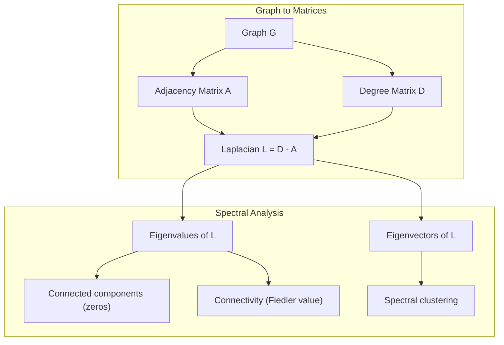
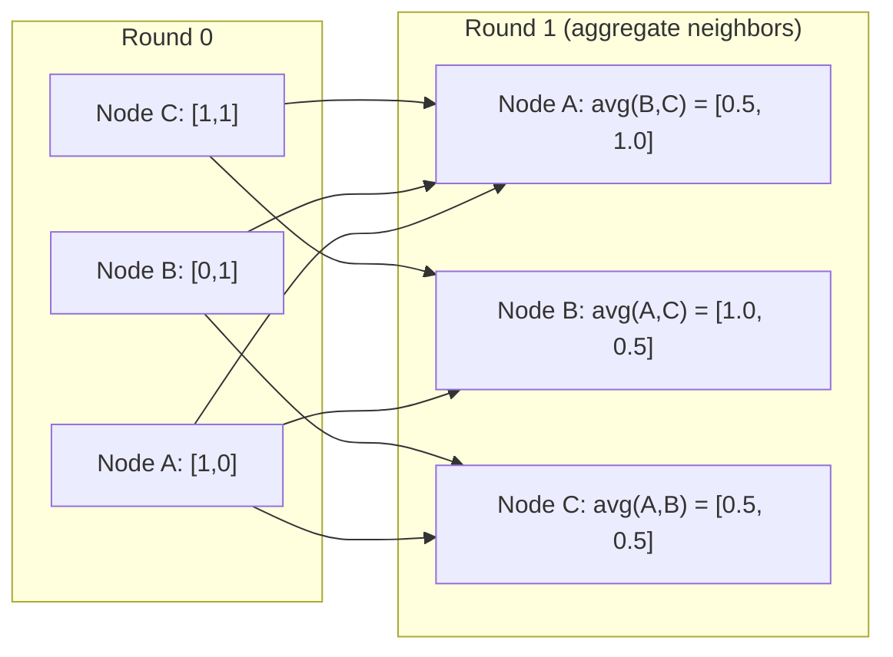

# 面向 मशीन लर्निंग की ग्राफ थ्योरी

> ग्राफ एक संबंध के डेटा संरचना है। यदि आपके डेटा में कनेक्शन शामिल हैं, तो आपको ग्राफ सिद्धांत की आवश्यकता है।

**Type:** Build
**Language:**पायथन
**Prerequisites:** Phase 1, Lessons 01-03（linear algebra, matrices）
**Time:** ~90 分钟

## 学习目标
- 构建一个图表类,包含邻属矩阵/列表表示,并实现 BFS 和 DFS 遍历
- 计算 ग्राफ लैप्लाशियन,并 उपयोग अपने स्वयं के मूल्यों 检测 जुड़े घटकों 和对节点 聚类
- एक दौर GNN 风格的 संदेश पारित करने के लिए सामान्यीकृत आसन्नता मैट्रिक्स गुणा के लिए प्राप्त
- उपयोग Fiedler वेक्टर  अनुप्रयोग स्पेक्ट्रल क्लस्टरिंग 来划分图

## 问题
सामाजिक नेटवर्क, अणु, ज्ञान आधार, उद्धरण नेटवर्क, रोड मैप सभी ग्राफ हैं। पारंपरिक रूप से, डेटा को एक साधारण रूप से देखा जाता है। प्रत्येक पंक्ति स्वतंत्र है। प्रत्येक विशेषता एक पंक्ति है। लेकिन जब कनेक्ट संरचना महत्वपूर्ण होती है, तो एक साधारण रूप से विफल हो जाता है।

考虑一个社交网络――你想预测某用户会购买什么产品――他们的购买历史很重要――但他们朋友的购买历史更重要――连接本身承载信号――

या एक अणु पर विचार करें। आप सोच रहे हैं कि यह किसी प्रोटीन के साथ गठबंधन करेगा या नहीं। परमाणु महत्वपूर्ण हैं, लेकिन वास्तव में महत्वपूर्ण है कि परमाणु एक दूसरे के लिए कैसे बनते हैं। संरचना डेटा है।

ग्राफ न्यूरल नेटवर्क (GNN) गहन शिक्षा के क्षेत्र में सबसे तेजी से बढ़ते क्षेत्र हैं। वे दवा खोज, सामाजिक सिफारिश, धोखाधड़ी का पता लगाने और ज्ञान ग्राफ तर्क को प्रेरित करते हैं। प्रत्येक GNN एक ही आधार पर स्थापित किया गया हैः आधार ग्राफ सिद्धांत।

आपको चार चीजों की आवश्यकता हैः
1. एक प्रकार के ग्राफ प्रदर्शित करने के लिए मैट्रिक्स के तरीके के लिए (आप उन्हें करने के लिए गुणा कर सकते हैं)
2. ग्राफ संरचना की खोज करने के लिए उपयोग किया जाता है पार एल्गोरिदम
3. लैप्लाशियन, यह स्पेक्ट्रल ग्राफ सिद्धांत है
4. संदेश पारित, यह GNNs 工作的操作

## 概念
### ग्राफः नोड्स और एज

एक ग्राफ G = (V, E) द्वारा शिखर (नोड) V 和 किनारे E 组成──每条边缘 连接两个节点──

**Directed vs undirected。**में निर्देशन ग्राफ (डिग्राफ) में, एज (u, v) इंगित u 连接到 v,并且 v 也连接到 u── में निर्देशन ग्राफ (डिग्राफ) में, एज (u, v) इंगित u 指向 v,但反向不一定成立──

**Weighted vs unweighted。**अनवज़न वाले ग्राफ में, किनारे ️ मौजूद हैं, ️ मौजूद नहीं हैं। ️ वज़न वाले ग्राफ में, प्रत्येक किनारे का एक मान वजन होता है, जैसे कि दूरी ️ लागत या ताकत️।

| Graph type | Example |
|-----------|---------|
| Undirected, unweighted | Facebook friendship network |
| Directed, unweighted | Twitter follow network |
| Undirected, weighted | Road map（distances） |
| Directed, weighted | Web page links（PageRank scores） |

### निकटता मैट्रिक्स

संबद्धता मैट्रिक्स A है कोर का प्रतिनिधित्व── एक के लिए जिसमें n 个 नोड्स का ग्राफः

```
A[i][j] = 1    if there is an edge from node i to node j
A[i][j] = 0    otherwise
```

对于未定向图表,A 是对称:A[i][j] =A[j][i]。对于权重图表,A[i][j] =边缘 (i, j) का वजन。

**示例：一个 triangle：**

```
Nodes: 0, 1, 2
Edges: (0,1), (1,2), (0,2)

A = [[0, 1, 1],
     [1, 0, 1],
     [1, 1, 0]]
```

आसन्नता मैट्रिक्स प्रत्येक GNN के इनपुट हैं।

### डिग्री

नोड की डिग्री है उसके किनारों से जुड़ी संख्याएँ।

डिग्री मैट्रिक्स D है विकर्णः

```
D[i][i] = degree of node i
D[i][j] = 0    for i != j
```

对于三角形示例:D = diag(2,2,2), चूंकि प्रत्येक नोड दो अन्य नोडों से जुड़े होते हैं

डिग्री 告诉你节点的重要性── उच्च डिग्री = केंद्र नोड── एक नेटवर्क का डिग्री वितरण 揭示了它的结构── सामाजिक नेटवर्क 遵循电力法──少量枢纽,许多叶节)── यादृच्छिक आलेख 具有波森分布式度──

### बीएफएस और डीएफएस

 दो बुनियादी ग्राफ क्रॉसिंग एल्गोरिदम आप दोनों की जरूरत है

**Breadth-First Search (BFS)：**先探索所有邻居,再探索邻居的邻居──使用队列 (FIFO)──

```
BFS from node 0:
  Visit 0
  Queue: [1, 2]        (neighbors of 0)
  Visit 1
  Queue: [2, 3]        (add neighbors of 1)
  Visit 2
  Queue: [3]           (neighbors of 2 already visited)
  Visit 3
  Queue: []            (done)
```

BFS को अनवज़न वाले ग्राफों में सबसे कम पथों में पाया जाता है। बिन्दु से किसी भी नोड की दूरी तक, जैसे कि उस नोड का पहला BFS स्तर पाया जाता है। यही कारण है कि BFS का उपयोग सामाजिक नेटवर्क के बीच हॉप-कंट दूरी पर किया जाता है।

**Depth-First Search (DFS)：**∙ वापसी से पहले यथासंभव गहराई में प्रवेश करना ∙ उपयोग स्टैक (LIFO) या पुनरावृत्ति ∙

```
DFS from node 0:
  Visit 0
  Stack: [1, 2]        (neighbors of 0)
  Visit 2               (pop from stack)
  Stack: [1, 3]         (add neighbors of 2)
  Visit 3               (pop from stack)
  Stack: [1]
  Visit 1               (pop from stack)
  Stack: []             (done)
```

डीएफएस के लिए प्रयोग किया जा सकता हैः
- 查找 जुड़े घटकों(从未访问的节点 运行 DFS)
- चक्र का पता लगाना ((DFS पेड़ 中的后边)
- स्थलीय क्रमण (反向 DFS समाप्त क्रम)

| Algorithm | Data structure | Finds | Use case |
|-----------|---------------|-------|----------|
| BFS | Queue | Shortest paths | Social network distance, knowledge graph traversal |
| DFS | Stack | Components, cycles | Connectivity, topological sort |

### ग्राफ लैप्लाशियन

L = D - A── स्पेक्ट्रल ग्राफ थ्योरी 中最重要的矩阵──

 त्रिकोण के लिएः

```
D = [[2, 0, 0],    A = [[0, 1, 1],    L = [[2, -1, -1],
     [0, 2, 0],         [1, 0, 1],         [-1, 2, -1],
     [0, 0, 2]]         [1, 1, 0]]         [-1, -1,  2]]
```

लैप्लाशियन 具有非常重要的性质:

1. **L 是 positive semi-definite。**सभी स्व-मूल्य = 0

2. **zero eigenvalues 的数量等于 connected components 的数量。**एक जुड़े हुए ग्राफ 恰恰 एक शून्य स्वमूल्य है ∙ एक में 3  डिस्कनेक्ट घटक ∙ ग्राफ के तीन शून्य स्वमूल्य हैं ∙

3. **最小的 non-zero eigenvalue（Fiedler value）衡量 connectivity。**较大的Fiedler value 表示图 连接良好──较小的Fiedler value 表示图 有一个薄弱点,也就是瓶──

4. **Fiedler value 的 eigenvector（Fiedler vector）揭示最佳切分。**值为正的节点 进入一组,值为负的节点 进入另一组──这是光谱集群──



### स्पेक्ट्रल गुण

आसन्नता मैट्रिक्स और लैप्लाशियन के स्वमान किसी भी पार नहीं किए जाने के मामले में संरचनात्मक गुणों को प्रकट कर सकते हैं।

**Spectral clustering**का कार्यविधि इस प्रकार हैः
1. 计算 लैप्लाशियन L
2. 找到 L के k 个最小的自向量(跳过第一个; जुड़े ग्राफ के लिए, यह है全 1)
3. इन स्वयं वेक्टरों को प्रत्येक नोड के नए सीजन के रूप में उपयोग करें
4. इन बैठकों पर चलना k-means

क्यों यह प्रभावी है?L के स्ववेक्टर  कोड किया गया ग्राफ ऊपर 平滑 के फ़ंक्शन  अच्छे से जुड़े नोड्स  समान स्ववेक्टर मान  प्राप्त होंगे  फ्लैग के गले से अलग किए गए नोड्स  प्राप्त होंगे  अलग-अलग मूल्य  प्राप्त होंगे  स्ववेक्टर  स्वाभाविक रूप से अलग समूह  प्राप्त होंगे 

**Random walk connection。**सामान्यीकृत लैप्लाशियन के साथ ग्राफ ऊपर के यादृच्छिक चलने का स्थिर वितरण 有关── यादृच्छिक चलने का साथ नोड डिग्री 成比例──मिश्रण समय(चलन 收得有多快) स्पेक्ट्रल अंतराल से निर्भर करता है──

### संदेश पारित करना

यह ग्राफ न्यूरल नेटवर्क का मूल कार्य है। प्रत्येक नोड अपने पड़ोसियों से संदेश एकत्र करता है, उन्हें इकट्ठा करता है, और फिर अपनी स्थिति को अपडेट करता है।

```
h_v^(k+1) = UPDATE(h_v^(k), AGGREGATE({h_u^(k) : u in neighbors(v)}))
```

सबसे सरल रूप में, संकलित = औसत, अद्यतन = रैखिक परिवर्तन + सक्रियणः

```
h_v^(k+1) = sigma(W * mean({h_u^(k) : u in neighbors(v)}))
```

यह वास्तव में एक और प्रकार के मैट्रिक्स गुणन में ढूढ़ता है। यदि H सभी नोड सुविधाओं का मैट्रिक्स है, तो A आसन्नता मैट्रिक्स हैः

```
H^(k+1) = sigma(A_norm * H^(k) * W)
```

इनमें से A_norm सामान्यीकृत आसन्नता मैट्रिक्स है।

एक दौर संदेश गुजरता है 让每个节点 看到它的近邻──两轮让它看到邻居的邻居──K 轮让每个节点 获得来自其K-hop社区的信息──



### 概念与 ML 应用

| Concept | ML Application |
|---------|---------------|
| Adjacency matrix | GNN input representation |
| Graph Laplacian | Spectral clustering, community detection |
| BFS/DFS | Knowledge graph traversal, path finding |
| Degree distribution | Node importance, feature engineering |
| Message passing | GNN layers (GCN, GAT, GraphSAGE) |
| Eigenvalues of L | Community detection, graph partitioning |
| Spectral clustering | Unsupervised node grouping |
| PageRank | Node importance, web search |


```figure
graph-degree-distribution
```

##  इसे निर्माण
### 步骤 1: शून्य से प्राप्ति ग्राफ 类

```python
class Graph:
    def __init__(self, n_nodes, directed=False):
        self.n = n_nodes
        self.directed = directed
        self.adj = {i: {} for i in range(n_nodes)}

    def add_edge(self, u, v, weight=1.0):
        self.adj[u][v] = weight
        if not self.directed:
            self.adj[v][u] = weight

    def neighbors(self, node):
        return list(self.adj[node].keys())

    def degree(self, node):
        return len(self.adj[node])

    def adjacency_matrix(self):
        import numpy as np
        A = np.zeros((self.n, self.n))
        for u in range(self.n):
            for v, w in self.adj[u].items():
                A[u][v] = w
        return A

    def degree_matrix(self):
        import numpy as np
        D = np.zeros((self.n, self.n))
        for i in range(self.n):
            D[i][i] = self.degree(i)
        return D

    def laplacian(self):
        return self.degree_matrix() - self.adjacency_matrix()
```

निकटता सूची`self.adj`) उच्च कुशल भंडारण पड़ोसी कर सकते हैं।

### 步骤 2: बीएफएस और डीएफएस

```python
from collections import deque

def bfs(graph, start):
    visited = set()
    order = []
    distances = {}
    queue = deque([(start, 0)])
    visited.add(start)
    while queue:
        node, dist = queue.popleft()
        order.append(node)
        distances[node] = dist
        for neighbor in graph.neighbors(node):
            if neighbor not in visited:
                visited.add(neighbor)
                queue.append((neighbor, dist + 1))
    return order, distances


def dfs(graph, start):
    visited = set()
    order = []
    stack = [start]
    while stack:
        node = stack.pop()
        if node in visited:
            continue
        visited.add(node)
        order.append(node)
        for neighbor in reversed(graph.neighbors(node)):
            if neighbor not in visited:
                stack.append(neighbor)
    return order
```

BFS 使用 deque(डबल-एंड्ड कतार) को प्राप्त करने के लिए O(1) पॉपलेफ्ट。DFS उपयोग सूची 作为堆──两者都会恰好访问每个节点 一次,时间复杂度为 O(V + E)。

### 步骤 3:संलग्न घटक व लैप्लाशियन स्वमूल्य

```python
def connected_components(graph):
    visited = set()
    components = []
    for node in range(graph.n):
        if node not in visited:
            order, _ = bfs(graph, node)
            visited.update(order)
            components.append(order)
    return components


def laplacian_eigenvalues(graph):
    import numpy as np
    L = graph.laplacian()
    eigenvalues = np.linalg.eigvalsh(L)
    return eigenvalues
```

`eigvalsh`सममित मैट्रिक्स के लिए, लैप्लाशियन अप्रयुक्त ग्राफ के लिए हमेशा सममित होता है। यह क्रमशः अपने स्वयं के मानों को वापस करता है।

### 步骤 4: स्पेक्ट्रल क्लस्टरिंग

```python
def spectral_clustering(graph, k=2):
    import numpy as np
    L = graph.laplacian()
    eigenvalues, eigenvectors = np.linalg.eigh(L)
    features = eigenvectors[:, 1:k+1]

    labels = np.zeros(graph.n, dtype=int)
    for i in range(graph.n):
        if features[i, 0] >= 0:
            labels[i] = 0
        else:
            labels[i] = 1
    return labels
```

对于 k=2,Fiedler वेक्टर के लिए 符号会将图分为两个集群──对于 k>2,你会在前 k 个个个个个个个个个个个个个个个个个个个个个个个个个个个个个个个个个个个个个个个个个个个个个个个个个个个个个个个个个个个个个个个个个个个个个个个个个个个个个个个个个个个个个个个个个个个个个个个个个个个个个个个个个个个个个个个个个个个个个个个个个个个个个个个个个个个个个个个个个个个个个个个个个个个个个个个个个个个个个个个个个个个个个个个个个个个个个个个个个个个个个个个个个个个个个个个个个个个个个个个个个个个个个个个个个个个个个个个个个个个个个个个个个个个个个个个个个个个个个个个个个个个个个个个个个个个个个个个个个个个个个个个个个个个个个个个个个个个个个个个个个个个个个个个个个个个个个个个个个个个个个个个个个个个个个个个个个个个个个个个个个个个个个个个个个个个个个个个个个个个个个个个个个个个个个个个个个个个个个个个个个个个个个个个个个个个个个个个个个个个个个个个个个个个个个个个个个个个个个个个个个个个个个个个个个个个个个个个个个个个个个个个个个个个个个个个个个个个个个个个个个个个个个个个个个个个个个个个个个个个个个个个个个个个个个个个个个个个个

### 步骤 5: संदेश पारित

```python
def message_passing(graph, features, weight_matrix):
    import numpy as np
    A = graph.adjacency_matrix()
    row_sums = A.sum(axis=1, keepdims=True)
    row_sums[row_sums == 0] = 1
    A_norm = A / row_sums
    aggregated = A_norm @ features
    output = aggregated @ weight_matrix
    return output
```

यह एक दौर GNN संदेश पारित करना है। प्रत्येक नोड की नई विशेषताएं अपने पड़ोसी की विशेषताएं के वजन औसत हैं, फिर से वजन मैट्रिक्स के माध्यम से 转换 堆叠多轮可以将信息传播更远

## इसका उपयोग करें
उपयोग नेटवर्कएक्स और नम्पी, एक ही ऑपरेशन एक-लाइनर हैंः

```python
import networkx as nx
import numpy as np

G = nx.karate_club_graph()

A = nx.adjacency_matrix(G).toarray()
L = nx.laplacian_matrix(G).toarray()

eigenvalues = np.linalg.eigvalsh(L.astype(float))
print(f"Smallest eigenvalues: {eigenvalues[:5]}")
print(f"Connected components: {nx.number_connected_components(G)}")

communities = nx.community.greedy_modularity_communities(G)
print(f"Communities found: {len(communities)}")

pr = nx.pagerank(G)
top_nodes = sorted(pr.items(), key=lambda x: x[1], reverse=True)[:5]
print(f"Top 5 PageRank nodes: {top_nodes}")
```

नेटवर्कएक्स अनुकूलित सी बैकेंड्स का उपयोग करके किसी भी आकार के ग्राफ को संसाधित कर सकता है।

### नम्बिया स्पेक्ट्रल विश्लेषण

```python
import numpy as np

A = np.array([
    [0, 1, 1, 0, 0],
    [1, 0, 1, 0, 0],
    [1, 1, 0, 1, 0],
    [0, 0, 1, 0, 1],
    [0, 0, 0, 1, 0]
])

D = np.diag(A.sum(axis=1))
L = D - A

eigenvalues, eigenvectors = np.linalg.eigh(L)
print(f"Eigenvalues: {np.round(eigenvalues, 4)}")
print(f"Fiedler value: {eigenvalues[1]:.4f}")
print(f"Fiedler vector: {np.round(eigenvectors[:, 1], 4)}")

fiedler = eigenvectors[:, 1]
group_a = np.where(fiedler >= 0)[0]
group_b = np.where(fiedler < 0)[0]
print(f"Cluster A: {group_a}")
print(f"Cluster B: {group_b}")
```

फिडलर वेक्टर 承担了主要工作──正值条目位于一个集群,负值条目位于另一个集群──不需要再进化优化,只需要一次自定义组合──

## 交付 यह
本课产出:
- `outputs/skill-graph-analysis.md`: ग्राफ-संरचित डेटा के विश्लेषण के लिए कौशल संदर्भ

## संबंध

| Concept | Where it shows up |
|---------|------------------|
| Adjacency matrix | GCN, GAT, GraphSAGE input |
| Laplacian | Spectral clustering, ChebNet filters |
| BFS | Knowledge graph traversal, shortest path queries |
| Message passing | Every GNN layer, neural message passing |
| Spectral gap | Graph connectivity, mixing time of random walks |
| Degree distribution | Power-law networks, node feature engineering |
| Connected components | Preprocessing, handling disconnected graphs |
| PageRank | Node importance ranking, attention initialization |

GNNs 值得特别说明──GCN(Kipf & Welling, 2017) में ग्राफ घुमाव संचालन उपयोग添加了自路的邻接矩阵,A_hat = A + I:

```text
H^(l+1) = sigma(D_hat^(-1/2) * A_hat * D_hat^(-1/2) * H^(l) * W^(l))
```

इनमें A_hat = A + I(adjacency加 self-loops),D_hat है A_hat का डिग्री मैट्रिक्स。self-loops  सुनिश्चित करें प्रत्येक नोड में  एकत्रित  के दौरान अपनी विशेषताएं शामिल हों。 यह सही है साथ में सममित सामान्यीकरण के संदेश पारित करना──D_hat^(-1/2) *A_hat * D_hat^(-1/2) है सामान्यीकृत आसन्नता मैट्रिक्स──Laplacian प्रकट यहाँ, क्योंकि इस तरह की सामान्यीकरण के साथ L_sym = I - D^(-1/2) *A * D^(-1/2) 相关── समझना लैप्लशियन,就意味着理解GCNs为何有效──

## अभ्यास
1. **从零实现 PageRank。**开始──每一步:score(v) = (1-d) /n + d * योगफल(score(u) /out_degree(u)), जिसमें u 是所有指向 v 的节点──使用d=0.85──运行直到收(变化 < 1e-6)──在一个小型网页图上测试──

2. **使用 spectral clustering 查找 communities。** एक ग्राफ बनाएं जिसमें दो स्पष्ट रूप से अलग समूह शामिल हैं️उदाहरण के लिए, दो क्लिक ️ एक किनारे ️ ️ ️ ️ ️ ️ ️ ️ ️ ️ ️ ️ ️ ️ ️ ️ ️ ️ ️ ️ ️ ️ ️ ️ ️ ️ ️ ️ ️ ️ ️ ️ ️ ️ ️ ️ ️ ️ ️ ️ ️ ️ ️ ️ ️ ️ ️ ️ ️ ️ ️ ️ ️ ️ ️ ️ ️ ️ ️ ️ ️ ️ ️ ️ ️ ️ ️ ️ ️ ️ ️ ️ ️ ️ ️ ️ ️ ️ ️ ️ ️ ️ ️ ️ ️ ️ ️ ️ ️ ️ ️ ️ ️ ️ ️ ️ ️ ️ ️ ️ ️ ️ ️ ️ ️ ️ ️ ️ ️ ️ ️ ️ ️ ️ ️ ️ ️ ️ ️ ️ ️ ️ ️ ️ ️ ️ ️ ️ ️ ️ ️ ️ ️ ️ ️ ️ ️ ️  ️ ️  ️ ️  ️   ️    ️   ️           

3. **为 weighted graphs 中的 shortest paths 实现 Dijkstra's algorithm。**समान वजन वाले एक ही ग्राफ में, परिणाम बीएफएस के साथ तुलना करेंगे

4. **构建一个 2-layer message passing network。**उपयोग करें विभिन्न वजन मैट्रिक्स 应用两次消息传递──展示经过2轮后, प्रत्येक नोड के पास अपने 2-हॉप पड़ोस से जानकारी है──

5. **分析一个真实世界 graph。**उपयोग कराटे क्लब ग्राफ(34 नोड्स, 78 किनारे) ―― गणना डिग्री वितरण、लैप्लाशियन स्वमान एवं स्पेक्ट्रल क्लस्टरिंग──将 स्पेक्ट्रल क्लस्टरिंग 结果与已知地面真理分比较──

## 关键术语
| Term | What people say | What it actually means |
|------|----------------|----------------------|
| Graph | “Nodes and edges” | 一种数学结构 G=(V,E)，用于编码 pairwise relationships |
| Adjacency matrix | “The connection table” | 一个 n x n matrix，其中如果 nodes i 和 j 相连，则 A[i][j] = 1 |
| Degree | “一个 node 有多 connected” | 接触某个 node 的 edges 数量 |
| Laplacian | “D minus A” | L = D - A，其 eigenvalues 会揭示 graph structure 的 matrix |
| Fiedler value | “The algebraic connectivity” | L 的最小 non-zero eigenvalue，用于衡量 graph 连接得有多好 |
| BFS | “Level-by-level search” | 在深入之前先访问所有 neighbors 的 traversal，可找到 shortest paths |
| DFS | “Go deep first” | 在回溯之前沿一条 path 走到末端的 traversal |
| Message passing | “Nodes talk to neighbors” | 每个 node 从其 neighbors 聚合信息，这是 GNNs 的核心 |
| Spectral clustering | “Cluster by eigenvectors” | 使用 graph 的 Laplacian 的 eigenvectors 来划分 graph |
| Connected component | “A separate piece” | 一个 maximal subgraph，其中每个 node 都能到达其他每个 node |

## 延伸阅读
- **Kipf & Welling (2017)**:ग्राफ कन्भल्यूशनल नेटवर्क के साथ अर्ध-निरीक्षण वर्गीकरण──开启现代 GNNs 的论文──प्रदर्शन किया स्पेक्ट्रल ग्राफ कन्भल्यूशन 如何简化为信息传递──
- **Spielman (2012)**: स्पेक्ट्रल ग्राफ थ्योरी व्याख्यान नोट्स──关于 लाप्लाशियन、 स्पेक्ट्रल रिक्तियां 和 ग्राफ विभाजन के अधिकार
- **Hamilton (2020)** ग्राफ प्रतिनिधित्व सीखने──一本 from基础 to application covering GNNs के पुस्तक──
- **Bronstein et al. (2021)**:आकृति विज्ञान गहन शिक्षाः ग्रिड, समूह, ग्राफ, भूविज्ञान और गेज
- **Veličković et al. (2018)**:ग्राफ ध्यान नेटवर्क──उद् ध्यान तंत्र  विस्तार संदेश पारित करना──
