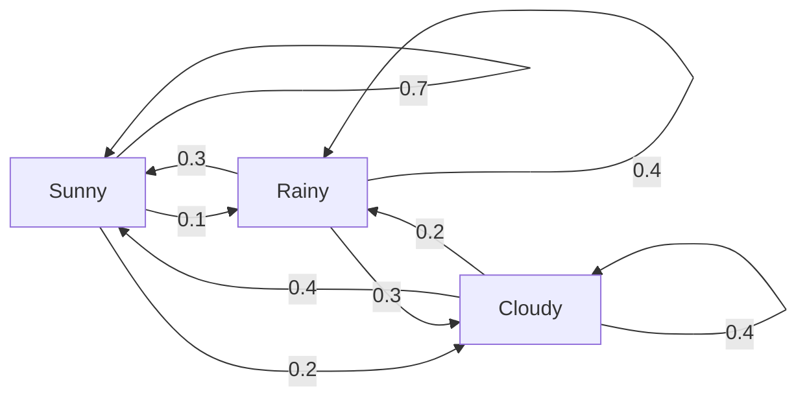
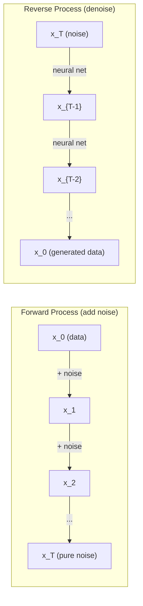

# स्टोकास्टिक प्रक्रियाएँ

> 具有结构的随机性──随机走行──मार्कोव चेन 和 विसारण मॉडल 背后的数学──

**Type:** Learn
**Language:**पायथन
**Prerequisites:** Phase 1, Lessons 06-07（probability, Bayes）
**Time:** ~75 分钟

## 学习目标
- 模拟 1D 和 2D यादृच्छिक चलने,并验证位移的平方(n) 缩放规律
- 构建 मार्कोव श्रृंखला 模拟器,并通过自身组合 计算其静止分布
- मात्रा-हस्टिंग्स MCMC एवं Langevin गतिशीलता को प्राप्त करना, उद्देश्य वितरण से उपयोग किया जाता है
- आगे फैलाव प्रक्रिया को ब्राउनीयन आंदोलन से जोड़ें, रिवर्स प्रक्रिया को समझाएं

## 问题
कई एआई सिस्टम समय के साथ विकसित होने की यादृच्छिकता से संबंधित हैं। यह स्थैतिक यादृच्छिकता नहीं है, बल्कि संरचनात्मक क्रमबद्धता है, जिसमें से प्रत्येक चरण पहले हुई सामग्री पर निर्भर करता है।

भाषा मॉडल एक बार एक टोकन उत्पन्न करते हैं। प्रत्येक टोकन पहले से ही संदर्भ पर निर्भर करता है। मॉडल एक संभावना वितरण का उत्पादन करता है, फिर इसे जारी रखता है। यह एक स्टोकास्टिक प्रक्रिया है।

विसारण मॉडल 逐步图像添加噪音,直到它变成纯静态噪音──然后它们反转这个过程,逐步谴责这个过程,逐步谴责这个过程,直到出现一张新图像──前进过程是一个马科夫链──反转过程是一个反向运行的学到的马科夫链──

एक नए राज्य की ओर एक निश्चित संभावना के साथ प्रत्येक क्रिया होती है। एक स्वतंत्र दुनिया में एक स्वतंत्र नीति का पालन करने वाले एजेंटों की एक पूरी तरह से एक मार्कोव निर्णय प्रक्रिया होती है।

MCMC नमूनाकरण Bayesian inference का आधार है, यह एक Markov श्रृंखला का निर्माण करता है, इसका स्थिर वितरण है,

ये सब चार बुनियादी विचारों पर आधारित हैंः
1. यादृच्छिक चलने  सबसे सरल स्टोकैस्टिक प्रक्रिया
2. मार्कोव चेन  带有过渡矩阵的结构化随机性
3. Langevin गतिशीलता  带噪音的渐进下降
4. मेट्रोपोलिस-हस्टिंग्स                                                                                                                                                                                                                                                           

## 概念
### यादृच्छिक पैदल यात्रा

〇位置 0 开始── प्रत्येक चरण,抛一枚公平硬币──正面:向右移动(+1)──反面:向左移动(-1)──

经过 n 步后, आपकी स्थिति है n 个随机 +/-1 值的总和──期望位置是 0(यह पैदल है निष्पक्ष की)──लेकिन दूरी से मूल बिंदु की अपेक्षा दूरी से वर्गानुसार                                                                                                                                                                                                                                     

यह एक बिंदु है, यह एक समान है, दोनों दिशाओं में कोई बहाव नहीं है। लेकिन समय के साथ, यह शुरू से दूर और आगे बढ़ता है।

```
Step 0:  Position = 0
Step 1:  Position = +1 or -1
Step 2:  Position = +2, 0, or -2
...
Step 100: Expected distance from origin ~ 10 (sqrt(100))
Step 10000: Expected distance from origin ~ 100 (sqrt(10000))
```

**在 2D 中**,walk 以相等概率上、向下、向左或向右移动── दूरी से मूल बिंदु भी अनुसरण करें

**为什么是 sqrt(n)？**प्रत्येक चरण में एक-दूसरे के साथ एक-दूसरे के साथ भिन्नता होती है, इसलिए Var(S_n) = n。 मानक विचलन = sqrt(n)。 केंद्रीय सीमा प्रमेय के अनुसार, S_n / sqrt(n)  प्राप्त करने के लिए मानक सामान्य वितरण。

इस प्रकार की वर्गों में संकुचित किया गया है।

**与 Brownian motion 的联系。**取一个步骤尺寸 为 1/sqrt(n) 、每单位时间 n 步的随机走行──当 n 趋近无穷时,这个走行会收到布朗运动 B(t)  एक निरंतर-समय प्रक्रिया, जिसमें B(t) 服从平均值为 0、变量 为 t का सामान्य वितरण──

ब्राउनियन गति विसारण के गणितीय आधार है। यह द्रव्यमान के बीच कणों की गतिशीलता, शेयर मूल्य की गति, तथा विसारण मॉडल के बीच शोर प्रक्रिया को दर्शाता है।

**Gambler's ruin。**एक यादृच्छिक पैदल यात्री से स्थिति k  प्रारंभ, में 0 和 N 处有吸收障碍──到达 N 早期到达 0 的概率是多少?

### मार्कोव चेन

मार्कोव श्रृंखला एक प्रणाली है, जो राज्यों के बीच स्थिर संभावना के अनुसार परिवर्तित होती है।

```
P(X_{t+1} = j | X_t = i, X_{t-1} = ...) = P(X_{t+1} = j | X_t = i)
```

यह मार्कोव गुण है। इसका मतलब है कि आप एक संक्रमण मैट्रिक्स P के साथ पूरी गतिशीलता का वर्णन कर सकते हैंः

```
P[i][j] = probability of going from state i to state j
```

P का प्रत्येक पंक्ति में 1 के लिए मांग और 1 के लिए है (आपको किसी स्थान पर जाना होगा)

**示例 —— Weather：**

```
States: Sunny (0), Rainy (1), Cloudy (2)

P = [[0.7, 0.1, 0.2],    (if sunny: 70% sunny, 10% rainy, 20% cloudy)
     [0.3, 0.4, 0.3],    (if rainy: 30% sunny, 40% rainy, 30% cloudy)
     [0.4, 0.2, 0.4]]    (if cloudy: 40% sunny, 20% rainy, 40% cloudy)
```

किसी भी स्थिति से 开始── कई बार संक्रमण के बाद, राज्यों का वितरण  प्राप्त होगा स्थिर वितरण pi, जिसमें से pi * P = pi── यह P का स्वयं मूल्य 为 1 का बाएं स्वयं वेक्टर है。

 长期来看, चाहे जितनी भी स्थिति हो,                                                                                                                                                                                                                                                        



**计算 stationary distribution。**दो तरीके हैंः

1. **Power method**: होगा किसी भी प्रारम्भिक वितरण反复乘以P──经过足够多的代谢后,它会收──
2. **Eigenvalue method**: पाएं P का स्वमूल्य 为 1 का बाएं स्ववेक्टर。 यह बराबर है P^T का स्वमूल्य 为 1 का स्ववेक्टर。

两种方法都要求链 满足收条件──

**收敛条件。**यदि एक मार्कोव श्रृंखला  निम्नलिखित शर्तों को पूरा, यह एकमात्र स्थिर वितरण प्राप्त होगाः
- **Irreducible**प्रत्येक राज्य में किसी भी अन्य राज्य से पहुंच सकते हैं
- **Aperiodic**: श्रृंखला स्थिर चक्र चक्र में नहीं होगी

आप ML में मिलने वाली अधिकांश श्रृंखलाएं इन दोनों शर्तों को पूरा करती हैं।

**Absorbing states。**यदि एक बार किसी राज्य में प्रवेश करने पर, वह कभी नहीं छोड़ेगा ((P[i][i] = 1), यह राज्य है अवशोषण की।

**Mixing time。**需要多少步,chain 才会接近stationary distribution?形式化地说,就是 कुल भिन्नता दूरी और स्थिरीकरण की दूरी किसी 值 से नीचे आवश्यक चरण संख्या में घटती है。फास्ट मिक्सिंग = 需要的步数少──P का स्पेक्ट्रल गैप(1 减去第二大自值) नियंत्रण मिक्सिंग समय──gap 越大, मिक्सिंग 越快──

### भाषा मॉडल के साथ संपर्क

भाषा मॉडल 中的 टोकन पीढ़ी 近似是一个马科夫过程──给定当前文本,模型输出下一个 टोकन 上的分布──温度 控制敏度:

```
P(token_i) = exp(logit_i / temperature) / sum(exp(logit_j / temperature))
```

- तापमान = 1.0: मानक वितरण
- तापमान < 1.0:更尖(更确定性)
- तापमान > 1.0:更平坦(更随机)
- तापमान -> 0:argmax(लाभकारी)

शीर्ष-के नमूनाकरण 截断至概率最高的 k 个 टोकन―― शीर्ष-p(अणु) नमूनाकरण 截断至累积概率 超过 p 的最小 टोकन 集合──两者都会修改马科夫过渡概率──

### ब्राउनियन मोशन

रैंडम वॉक की निरंतर समय सीमा──स्थिति B(t)
1. B(0) = 0
2. B(t) - B(s) 服从均值为 0、变量 为 t - s का सामान्य वितरण
3. 相互独立 不重叠区间上 相互独立 相互独立 相互独立

ब्राउनियन गति निरंतर है, लेकिन यह हर आयाम पर गतिशील है।

अलग-अलग मूवमेंट में, आप इस तरह के निकटता Brownian आंदोलन कर सकते हैंः

```
B(t + dt) = B(t) + sqrt(dt) * z,    where z ~ N(0, 1)
```

sqrt(dt) 缩放 बहुत महत्वपूर्ण है── यह तात्पर्य है कि यादृच्छिक चलने के लिए उपयोग किया जाता है।

### लैंग्विन डायनामिक्स

ग्रेडिएंट डिसेंट 寻找函数的最小值──लंज्विन गतिशीलता 寻找与 exp(-U(x) /T) 成正比的概率分布, जिनमें U ऊर्जा फ़ंक्शन है, T तापमान──

```
x_{t+1} = x_t - dt * gradient(U(x_t)) + sqrt(2 * T * dt) * z_t
```

कणों पर दो प्रकार के प्रभाव हैंः
1. **Gradient force**(-dt * ग्रेडिएंट(U)): कम ऊर्जा की ओर बढ़ना (Gradent Descent)
2. **Random force**(sqrt(2*T*dt) * z):推向随机方向( अन्वेषण)

जब तापमान T = 0 时, यह शुद्ध ग्रेडिएंट निदान है. उच्च तापमान. नीचे, यह लगभग यादृच्छिक चल रहा है.

**与 diffusion models 的联系。**विसारण मॉडल की आगे की प्रक्रिया है:

```
x_t = sqrt(alpha_t) * x_{t-1} + sqrt(1 - alpha_t) * noise
```

यह एक क्रमिक रूप से डेटा और शोर के साथ मिश्रित मार्कोव श्रृंखला है।

रिवर्स प्रोसेस  शोर से डेटा तक लौटने  यह भी एक मार्कोव चेन है, लेकिन इसकी संक्रमण संभावनाएं न्यूरल नेटवर्क द्वारा सीख प्राप्त है──网络学习预测 प्रत्येक कदम में शोर शामिल है, फिर इसे घटाएगा──



### MCMC: मार्कोव चेन मोंटे कार्लो

कभी कभी आपको एक से एक की आवश्यकता होती है जिसे आप मान प्राप्त कर सकते हैं, लेकिन एक निरंतर संख्या को अलग करने की अनुमति नहीं दे सकते हैं, लेकिन सीधे रूप से एक विन्यास का उपयोग नहीं कर सकते हैं।

**Metropolis-Hastings**构造一个静止分布 为 p(x) के मार्कोव श्रृंखलाः

1. किसी स्थान से x  प्रारंभ
2. प्रस्ताव वितरण Q(x' ने कहा) 提议一个新位置 x'
3. 計算 स्वीकृति अनुपात:a(x') * Q(x यह भी है) / (p(x) * Q(x' यह भी है))
4. 以概率 min(1, a) 接受 x'──否则留在 x──
5. पुनः पुनः

यदि Q है सममित का (उदाहरण के लिए Q) x'x (च) = Q (च) x (च) = N (च) x (च) = सिग्मा^2)), अनुपात 可简化为 a = p (च) / p (च) 

तापमान और स्थिति में, यह श्रृंखला पक्का प्राप्ति तक पहुँचती है। लेकिन यदि प्रस्ताव  बहुत छोटा (या बहुत बड़ा) हो, तो प्रस्ताव  बहुत धीमा हो सकता है।

**为什么它有效。**स्वीकृति अनुपात  विवरण संतुलन सुनिश्चित करेंः स्थित x में नहीं स्थानांतरित x' की संभावना, स्थित x में नहीं स्थानांतरित x' की संभावना के बराबर है।

**实践注意事项：**
- **Burn-in**: छोड़ दिया पहले N 个样本──链 需要时间从起点到静止分布──
- **Thinning**: प्रत्येक के लिए एक नमूना रखें, ताकि ऑटो-संदर्भण कम हो।
- **Multiple chains**: विभिन्न बिंदुओं से कई श्रृंखलाएं चलती हैं। यदि वे एक ही वितरण तक पहुंचती हैं, तो प्राप्ति का प्रमाण उपलब्ध है।
- **Acceptance rate**: डी 维 गौसी के प्रस्तावों के लिए, सर्वोत्तम स्वीकृति दर लगभग 23% है।

### एआई में स्टोकास्टिक प्रक्रियाएं

| Process | AI Application |
|---------|---------------|
| Random walk | RL 中的 exploration、Node2Vec embeddings |
| Markov chain | Text generation、MCMC sampling |
| Brownian motion | Diffusion models（forward process） |
| Langevin dynamics | Score-based generative models、SGLD |
| Markov decision process | Reinforcement learning |
| Metropolis-Hastings | Bayesian inference、posterior sampling |


```figure
random-walk-diffusion
```

##  इसे निर्माण
### 步骤 1: यादृच्छिक चलने सिम्युलेटर

```python
import numpy as np

def random_walk_1d(n_steps, seed=None):
    rng = np.random.RandomState(seed)
    steps = rng.choice([-1, 1], size=n_steps)
    positions = np.concatenate([[0], np.cumsum(steps)])
    return positions


def random_walk_2d(n_steps, seed=None):
    rng = np.random.RandomState(seed)
    directions = rng.choice(4, size=n_steps)
    dx = np.zeros(n_steps)
    dy = np.zeros(n_steps)
    dx[directions == 0] = 1   # right
    dx[directions == 1] = -1  # left
    dy[directions == 2] = 1   # up
    dy[directions == 3] = -1  # down
    x = np.concatenate([[0], np.cumsum(dx)])
    y = np.concatenate([[0], np.cumsum(dy)])
    return x, y
```

1D चलना  भंडारण संचयी राशि── प्रत्येक चरण +1 या -1── बीतने के बाद, स्थिति है 总和── भिन्नता 随着 n 线性增长, इसलिए मानक विचलन 按平方(n) 增长──

### 步骤 2: मार्कोव श्रृंखला

```python
class MarkovChain:
    def __init__(self, transition_matrix, state_names=None):
        self.P = np.array(transition_matrix, dtype=float)
        self.n_states = len(self.P)
        self.state_names = state_names or [str(i) for i in range(self.n_states)]

    def step(self, current_state, rng=None):
        if rng is None:
            rng = np.random.RandomState()
        probs = self.P[current_state]
        return rng.choice(self.n_states, p=probs)

    def simulate(self, start_state, n_steps, seed=None):
        rng = np.random.RandomState(seed)
        states = [start_state]
        current = start_state
        for _ in range(n_steps):
            current = self.step(current, rng)
            states.append(current)
        return states

    def stationary_distribution(self):
        eigenvalues, eigenvectors = np.linalg.eig(self.P.T)
        idx = np.argmin(np.abs(eigenvalues - 1.0))
        stationary = np.real(eigenvectors[:, idx])
        stationary = stationary / stationary.sum()
        return np.abs(stationary)
```

स्थिर वितरण P का स्वयं मूल्य है 为 1 का बाएं स्वयं वेक्टर。 हम इसे खोजने के लिए P^T के स्वयं वेक्टर की गणना करके इसे ((转置会把左 eigenvectors 转化为右 eigenvectors) 

### 步骤 3: लैंग्विन गतिशीलता

```python
def langevin_dynamics(grad_U, x0, dt, temperature, n_steps, seed=None):
    rng = np.random.RandomState(seed)
    x = np.array(x0, dtype=float)
    trajectory = [x.copy()]
    for _ in range(n_steps):
        noise = rng.randn(*x.shape)
        x = x - dt * grad_U(x) + np.sqrt(2 * temperature * dt) * noise
        trajectory.append(x.copy())
    return np.array(trajectory)
```

ग्रेडिएंट x                                                                                                                                                                                                                                                                                                                                                                                                                                                                                                                         

### 步骤 4: मेट्रोपोलिस-हस्टिंग्स

```python
def metropolis_hastings(target_log_prob, proposal_std, x0, n_samples, seed=None):
    rng = np.random.RandomState(seed)
    x = np.array(x0, dtype=float)
    samples = [x.copy()]
    accepted = 0
    for _ in range(n_samples - 1):
        x_proposed = x + rng.randn(*x.shape) * proposal_std
        log_ratio = target_log_prob(x_proposed) - target_log_prob(x)
        if np.log(rng.rand()) < log_ratio:
            x = x_proposed
            accepted += 1
        samples.append(x.copy())
    acceptance_rate = accepted / (n_samples - 1)
    return np.array(samples), acceptance_rate
```

इस एल्गोरिथ्म ने एक नया बिंदु प्रस्तावित किया, जांच की कि क्या इसकी उच्च संभावना है या नहीं, फिर दोहराया गया।

## इसका उपयोग करें
ा अभ्यास में, आप इन एल्गोरिदम को प्राप्त करने के लिए परिपक्व पुस्तकालय का उपयोग करेंगे  लेकिन डिबगिंग और ट्यूनिंग के लिए तंत्र को समझना  महत्वपूर्ण है 

```python
import numpy as np

rng = np.random.RandomState(42)
walk = np.cumsum(rng.choice([-1, 1], size=10000))
print(f"Final position: {walk[-1]}")
print(f"Expected distance: {np.sqrt(10000):.1f}")
print(f"Actual distance: {abs(walk[-1])}")
```

### संक्रमण मैट्रिक्स के numpy के साथ

```python
import numpy as np

P = np.array([[0.7, 0.1, 0.2],
              [0.3, 0.4, 0.3],
              [0.4, 0.2, 0.4]])

distribution = np.array([1.0, 0.0, 0.0])
for _ in range(100):
    distribution = distribution @ P

print(f"Stationary distribution: {np.round(distribution, 4)}")
```

पहले से पुनरावृत्ति से पुनरावृत्ति करने के लिए पहले से पर्याप्त पुनरावृत्ति के बाद, यह स्थिर वितरण तक पहुंच जाएगा, चाहे आप किस स्थान से शुरू करें यह बाएं स्वायत्त वेक्टर की शक्ति विधि की खोज है

### वास्तविक ढांचे के साथ कनेक्शन

- **PyTorch diffusion：**गले लगाते हुए चेहरा `diffusers`मध्य `DDPMScheduler`实现了 आगे और रिवर्स मार्कोव चेन
- **NumPyro / PyMC：**MCMC(NUTS नमूना का उपयोग करके, यह मेट्रोपोलिस-हस्टिंग्स के लिए सुधार है) बेयिसियन निष्कर्ष करने के लिए
- **Gymnasium (RL)：**पर्यावरण चरण समारोह  परिभाषित एक मार्कोव निर्णय प्रक्रिया

### 验证 मार्कोव श्रृंखला अभिसरण

```python
import numpy as np

P = np.array([[0.9, 0.1], [0.3, 0.7]])

eigenvalues = np.linalg.eigvals(P)
spectral_gap = 1 - sorted(np.abs(eigenvalues))[-2]
print(f"Eigenvalues: {eigenvalues}")
print(f"Spectral gap: {spectral_gap:.4f}")
print(f"Approximate mixing time: {1/spectral_gap:.1f} steps")
```

स्पेक्ट्रल गैप  tell you chain  forget its initial state speed──gap 0.2 का अर्थ है लगभग 5 步即可混合──gap 为 0.01 का अर्थ है लगभग 100 步──运行长度模拟 之前必检查这个点  mixing 很慢的链 会浪费计算──

## 交付 यह
本课产出:
- `outputs/prompt-stochastic-process-advisor.md` एक त्वरित, किसी भी स्टोकैस्टिक प्रक्रिया ढांचे के अनुकूल किसी भी समस्या को पहचानने में मदद करने के लिए

## संबंध

| Concept | Where it shows up |
|---------|------------------|
| Random walk | Node2Vec graph embeddings、RL 中的 exploration |
| Markov chain | LLMs 中的 Token generation、MCMC sampling |
| Brownian motion | DDPM 中的 forward diffusion process、SDE-based models |
| Langevin dynamics | Score-based generative models、stochastic gradient Langevin dynamics (SGLD) |
| Stationary distribution | MCMC convergence target、PageRank |
| Metropolis-Hastings | Bayesian posterior sampling、simulated annealing |
| Temperature | LLM sampling、RL 中的 Boltzmann exploration、simulated annealing |
| Mixing time | MCMC 的 convergence speed、spectral gap analysis |
| Absorbing state | End-of-sequence token、RL 中的 terminal states |
| Detailed balance | MCMC samplers 的 correctness guarantee |

विसारण मॉडल 值得特别关注──DDPM(Ho et al., 2020) ने एक आगे की मार्कोव श्रृंखला को परिभाषित किया हैः

```
q(x_t | x_{t-1}) = N(x_t; sqrt(1-beta_t) * x_{t-1}, beta_t * I)
```

इनमें से बीटा_टी एक शोर अनुसूची है। T 步后,x_T 近似为 N(0, I) ⋅ रिवर्स प्रक्रिया द्वारा एक पूर्वानुमान शोर के तंत्रिका नेटवर्क 参数化:

```
p_theta(x_{t-1} | x_t) = N(x_{t-1}; mu_theta(x_t, t), sigma_t^2 * I)
```

पीढ़ी का प्रत्येक कदम मार्कोव श्रृंखला में सीखा गया एक कदम है। मार्कोव श्रृंखलाओं को समझने का अर्थ है कि कैसे और क्यों डेटा उत्पन्न करने में सक्षम है।

SGLD(Stochastic Gradient Langevin Dynamics) ले मिनी-बैच ग्रेडिएंट अवतरण और लैंग्विन शोर 结合起来──你不计算完整的 Gradient,而是使用 Stochastic अनुमान并添加校准的噪音──随着学习率 衰退,SGLD 会从优化 过渡到样本  你几乎免费得到近似的贝叶斯后样本──这是从神经网络 获得不确定性估计的最简单方式之一──

穿越这些联系的关键洞见是:स्टोकैस्टिक प्रक्रियाएं केवल सैद्धांतिक उपकरण नहीं हैं। वे आधुनिक एआई प्रणाली के भीतर की गणना तंत्र हैं। जब आप एलएलएम के तापमान को समायोजित करते हैं, तो आप एक मार्कोव श्रृंखला को समायोजित कर रहे हैं। जब आप विसारण मॉडल का अभ्यास करते हैं, तो आप एक ब्राउनीयन गति की तरह एक प्रक्रिया को उलट-बदलते हुए सीख रहे हैं। जब आप बेयिसियन निष्कर्ष का संचालन करते हैं, तो आप एक रिसेप्टर के पीछे की श्रृंखला का निर्माण कर रहे हैं।

## अभ्यास
1. **模拟 1000 条 10000 步的 random walks。**绘制最终位置的分布──验证它近似为平均0、标准偏差平方rt(10000) = 100 का गौशियन──

2. **使用 Markov chain 构建 text generator。**एक छोटे से शरीर में ऊपर प्रशिक्षणः प्रत्येक शब्द के लिए,统计到下一个词的转变―― निर्माण संक्रमण मैट्रिक्स――通过从链中采样生成新句子――

3. **使用 Metropolis-Hastings 实现 simulated annealing。**उच्च तापमान से 开始 (लगभग सभी सामग्री को स्वीकार करें), फिर धीरे-धीरे降温 (लगभग सभी सामग्री को स्वीकार करें) 

4. **比较不同 temperatures 下的 Langevin dynamics。**दोहरे कुएं की संभावित U(x) = (x^2 - 1)^2 中采样──低温 时,样本 聚集在一个井中──高温 时,它们分布在两个井中──找到链 在井中混合的关键温度──

5. **实现 forward diffusion process。**एक 1D संकेत से (उदाहरण के लिए, सिनेस वेव) शुरू करें। रैखिक शोर अनुसूची का उपयोग करें, 100 步中 धीरे-धीरे शोर जोड़ें।

## 关键术语
| Term | What people say | What it actually means |
|------|----------------|----------------------|
| Random walk | “抛硬币式移动” | 一个 position 在每一步按随机 increments 改变的过程 |
| Markov property | “无记忆性” | future 只依赖当前 state，而不依赖 history |
| Transition matrix | “概率表” | P[i][j] = 从 state i 移动到 state j 的概率 |
| Stationary distribution | “长期平均” | 满足 pi*P = pi 的分布 pi —— chain 的 equilibrium |
| Brownian motion | “随机抖动” | random walk 的 continuous-time limit，B(t) ~ N(0, t) |
| Langevin dynamics | “带噪声的 Gradient Descent” | 结合 deterministic Gradient 与 random perturbation 的 update rule |
| MCMC | “向目标行走” | 构造一个 stationary distribution 为你想要的分布的 Markov chain |
| Metropolis-Hastings | “提议并接受/拒绝” | 使用 acceptance ratios 来确保收敛的 MCMC algorithm |
| Temperature | “随机性旋钮” | 控制 exploration 与 exploitation 之间权衡的参数 |
| Diffusion process | “噪声进，噪声出” | Forward：逐渐添加 noise。Reverse：逐渐移除 noise。生成 data。 |

## 延伸阅读
- **Ho, Jain, Abbeel (2020)** प्रसारण संभाव्यता मॉडल का खंडन करना. प्रसारण मॉडल खोलना 革命的 DDPM 论文──清晰推导了前进和反转马科夫链──
- **Song & Ermon (2019)**  डेटा वितरण के ग्रेडिएंट्स का अनुमान लगाकर जनरेटिव मॉडलिंग। Langevin गतिशीलता का उपयोग करें  नमूनाकरण का स्कोर आधारित 方法──
- **Roberts & Rosenthal (2004)** सामान्य राज्य अंतरिक्ष मार्कोव श्रृंखला और MCMC एल्गोरिदम.    MCMC 何时以及为什么有效的理论──
- **Norris (1997)** मार्कोव चेन. 标准教材── समावेशीकरण, स्थिर वितरण तथा हिट समय को कवर करती है──
- **Welling & Teh (2011)**  स्टोकास्टिक ग्रेडिएंट लैंग्विन डायनामिक्स के माध्यम से बेयिसियन लर्निंग। एसजीडी को लैंग्विन डायनामिक्स के साथ जोड़कर बेयिसियन निष्कर्षों का विस्तार करने के लिए उपयोग किया जाएगा──
