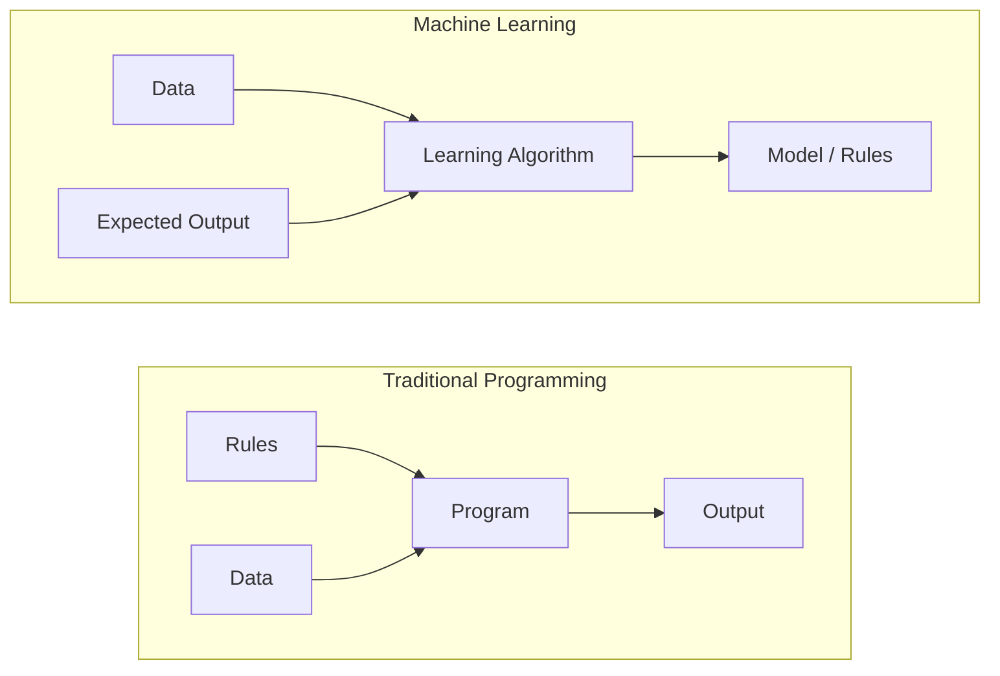
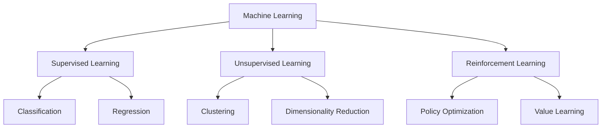
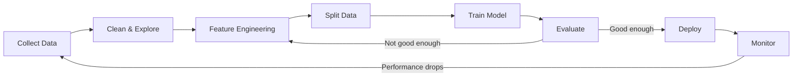
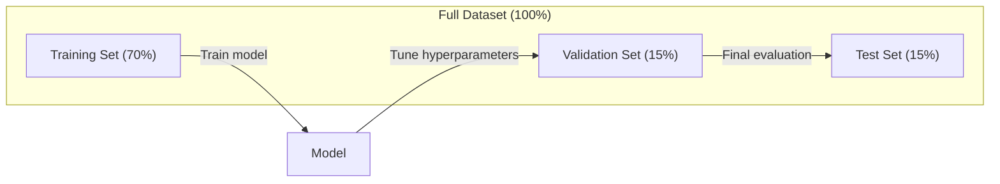
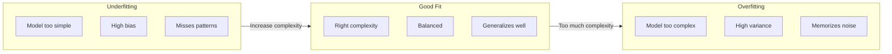
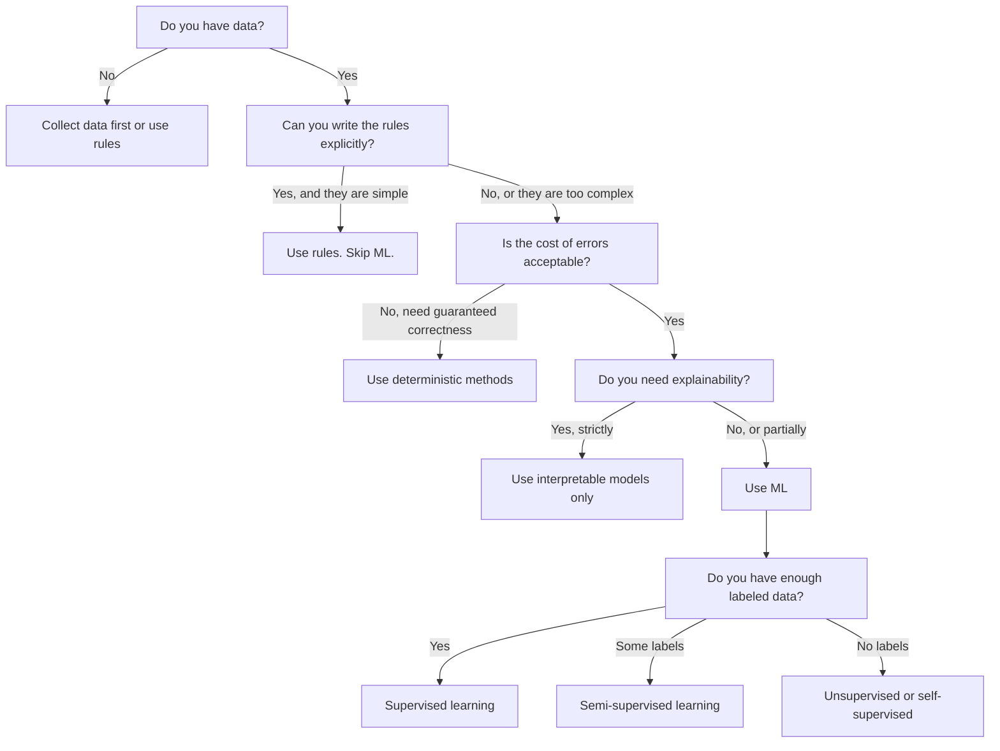

#  मशीन लर्निंग क्या है

> मशीन लर्निंग कंप्यूटर द्वारा डेटा में मॉडल की खोज की प्रक्रिया है, न कि हाथ से लिखे गए नियमों को।

**类型：**学习
**语言：**पायथन
**先修要求：**चरण 1 (गणित आधार)
**时间：** 45 मिनट

## 学习目标

- 解释监督无监督和加强学习的区别,并判断给定问题适用哪种类型
- निकटतम केंद्रस्थ वर्गीकरण को शून्य से प्राप्त करने के लिए, आकस्मिक आधार रेखा का उपयोग करके इसका मूल्यांकन किया गया
- 区分 वर्गीकरण 和 पुनरावृत्ति 任务,并为每种任务选择合适的损失函数
-  मूल्यांकन करना कि क्या व्यावसायिक समस्याएं एमएल का उपयोग करने के लिए उपयुक्त हैं या निश्चितता नियमों के समाधान के लिए अधिक उपयुक्त हैं

## 问题

आप एक कचरा मेल फ़िल्टर बनाना चाहते हैं। पारंपरिक अभ्यास यह हैः बैठकर कुछ सौ नियम लिखें। यदि मेल में 'फ्री मनी' है, तो इसे कचरा मेल के रूप में चिह्नित करें। यदि इसमें 3 से अधिक भाव हैं, तो इसे कचरा मेल के रूप में चिह्नित करें।

मशीन लर्निंग ने इस तरीके को बदल दिया है। आप नियम लिखना बंद कर देते हैं, बल्कि कंप्यूटर को हजारों ईमेल भेजते हैं, जो स्पैम या स्पैम नहीं हैं। इसे खुद नियम खोजने दें।

यह लेखन नियम से डेटा से सीखने के लिए परिवर्तन मशीन लर्निंग का मूल है। प्रत्येक सुझाव इंजन, आवाज सहायक, स्वचालित ड्राइविंग वाहन और भाषा मॉडल इस तरह से काम करते हैं।

## 概念

### नियम से सीखने के बजाय डेटा से सीखें

传统编程和机器学习以相反的方向解决问题──



傳統編程:你编寫規則──程序把規則應用到數據上并產生輸出──

मशीन लर्निंग: आप डेटा प्रदान करते हैं और आउटपुट की अपेक्षा करते हैं।

शिक्षित मॉडल स्वतः就是规则,以数字形式编码(重量、参数)  यह देखने के नमूने में सामान्यीकरण करता है, जिससे पहले से नहीं देखे गए डेटा का पूर्वानुमान किया जा सकता है

### मशीन लर्निंग के तीन प्रकार



**Supervised Learning**:आपके पास इनपुट-आउटपुट जोड़ी है।
-  यहाँ बिल्ली या कुत्ते की तस्वीरों के लिए 10,000 张 अंकित हैं।
-  यहाँ घर की विशेषताएं और कीमतें हैं.

**Unsupervised Learning**:你只有输入──没有标签──模型 自己寻找结构──
-  यहाँ 10,000 条客户购买历史──找出自然分组──
-  यहाँ 1,000 维 के डेटा बिंदु हैं                                                                                                                                                                                                                                                          

**Reinforcement Learning**:एजेंट ने पर्यावरण में क्रियाएं करने से इनाम या दंड प्राप्त होता है।
-  खेल खेल  जीत +1, हार -1  रणनीति खोज 
-  इस मशीन के हाथ को नियंत्रित करें                                                                                                                                                                                                                                                           

आप अभ्यास में निर्माण की अधिकांश सामग्री पर्यवेक्षित शिक्षा का उपयोग करते हैं। अनियंत्रित शिक्षा का उपयोग हमेशा पूर्व प्रसंस्करण और खोज के लिए किया जाता है।

### 超越三大类型

उपरोक्त तीन वर्ग बहुत स्पष्ट हैं, लेकिन वास्तविक दुनिया के एमएल  अक्सर 

**Semi-supervised learning**प्रयोग एक छोटा सा भाग लेबल डेटा तथा बड़ी मात्रा में अनलेबल डेटा──आपके पास 100 张带标签的医学图像和 100,000 张未标签的图像──技术包括:

- **Label propagation：**构建一个连接相似数据点的图――标签 通过图 从标签节点 传播到未标签邻居──
- **Pseudo-labeling：**लेबल किए गए डेटा में ऊपर प्रशिक्षण मॉडल, इसका उपयोग करके अनलेबल किए गए डेटा के लेबल का पूर्वानुमान करें, फिर संपूर्ण डेटा पर पुनः प्रशिक्षण दें।
- **Consistency regularization：** एक इनपुट और इसके हल्के परेशान संस्करण के लिए, मॉडल  को एक ही पूर्वानुमान देना चाहिए️️️️️️️️️️️️️️️️️️️️️️️️️️️️️️️️️️️️️️️️️️️️️️️️️️️️️️️️️️️️️️️️️️️️️️️️️️️️️️️️️️️️️️️️️️️️️️️️️️️️️️️️️️️️️️️️️️️️️️️️️️️️️️️️️️️️️️️️️️️️️️️️️️️️️️️️️️️️️️️️️️️️️️️️️️️️️️️️️️️️️️️️️️️️️️️️️️️️️️️️️️️️️️️️️️️️️️️️️️️️️️️️️️️️️️️️️️️️️️️️️️️️️️️️️️️️️️️️️️️️️️️️️️️️️️️️️️️️️️️️️️️️️️️️️️️️️️️️️️️️️️️️️️️️️️️️️️️️️️️️️️️️️️️️️️️️️️️️️️️️️️️️️️️️️️️️️️️️️️️️️️️️️️️️️️️️️️️️️️️️️️️️️️️️️️️️️️️️️️️️️️️️️️️️️️️️️️️️️️️️️️️️️️️️️️️️️️️️️️️️️️️️️️️️️️️️️️️️️️️️️️️️️️️️️️️️️️️️️️️️️️️️

**Self-supervised learning**डेटा से स्वयं निर्माण पर्यवेक्षण―― पूरी तरह से कोई कृत्रिम लेबल की आवश्यकता नहीं है―― मॉडल  डेटा संरचना के आधार पर स्वयं निर्माण भविष्यवाणी कार्य──

- **Masked language modeling (BERT)：**隐藏句中 15% 的词,训练模型 预测缺失的词──标签 来自原始文本──
- **Contrastive learning (SimCLR)：**取一张图像, create two enhanced versions── प्रशिक्षण मॉडल 识别它们来自同一张图像,同时将它们与其他图像的增强版本区分──
- **Next-token prediction (GPT)：**给定前面所有词,预测下一个词―― प्रत्येक文本文档都将成为一个训练样本――

ये तीन प्रकारों के बाहर की श्रेणियों से स्वतंत्र नहीं हैं। ये पर्यवेक्षित और अवलोकन रहित विचार मार्ग की रणनीति के संयोजन हैं।

### वर्गीकरण बनाम प्रतिगमन

यह दो प्रमुख पर्यवेक्षित शिक्षा कार्य हैं।

| 方面 | Classification | Regression |
|--------|---------------|------------|
| 输出 | 离散类别 | 连续数值 |
| 示例 | “这封邮件是垃圾邮件吗？” | “房价会是多少？” |
| 输出空间 | {cat, dog, bird} | 任意实数 |
| Loss Function | Cross-entropy, accuracy | Mean squared error, MAE |
| 决策 | 类别之间的边界 | 拟合数据的曲线 |

वर्गीकरण 回答 किस श्रेणी में है? नवीनता 回答 कितना?

कुछ प्रश्न दो प्रकार से व्यक्त किए जा सकते हैं।

### ML 工作流

प्रत्येक मशीन लर्निंग परियोजना एक ही पाइपलाइन का पालन करती है, चाहे वह कौन सी एल्गोरिथ्म का उपयोग करती हो।



**Collect Data**: मूल डेटा एकत्र करना। अधिक डेटा लगभग हमेशा बेहतर होता है, लेकिन मात्रा से गुणवत्ता अधिक महत्वपूर्ण है।

**Clean & Explore**: अनुपस्थिति को संसाधित करना, पुनःपूर्ति को हटाना, दृश्यता को वितरित करना, असामान्य की खोज करना। यह चरण आमतौर पर परियोजना के कुल समय का 60-80% हिस्सा लेता है।

**Feature Engineering**: मूल डेटा को मॉडल में परिवर्तित करें उपयोग की जाने वाली सुविधाएँ।

**Split Data**:划分为训练、验证 和测试集──模型 在训练数据上训练,你在验证数据上调超参数,并在测试数据上报告最终性能──

**Train Model**: 把 प्रशिक्षण डेटा 输入算法──算法调整内部参数,以最小化损失函数──

**Evaluate**: वैधता/परीक्षण डेटा में प्रदर्शन का माप करें। यदि प्रदर्शन अस्वीकार्य है, तो विभिन्न सुविधाओं, एल्गोरिदम या हाइपरपरमैटर का प्रयोग करने के लिए वापस जाएं।

**Deploy**: मॉडल को उत्पादन वातावरण में डालकर नए डेटा का पूर्वानुमान लगाने दें।

**Monitor**: निरंतर प्रदर्शन का पालन करना, डेटा वितरण परिवर्तन, मॉडल का अनुसरण करना, प्रदर्शन में गिरावट, पुनः प्रशिक्षण

### प्रशिक्षण, सत्यापन एवं परीक्षण

यह शुरुआती लोगों के लिए सबसे आसान है। आपको प्रशिक्षण के दौरान कभी नहीं देखे गए डेटा पर आकलन करने की आवश्यकता है। अन्यथा आप सीखने के बजाय स्मृति को मापते हैं।



| 划分 | 目的 | 使用时机 | 典型大小 |
|-------|---------|-----------|-------------|
| Training | model 从这些数据中学习 | 训练期间 | 60-80% |
| Validation | 调整 hyperparameter、比较 model | 每次训练运行之后 | 10-20% |
| Test | 最终无偏 performance 估计 | 只在最后使用一次 | 10-20% |

टेस्ट सेट है पवित्र है। आप इसे एक बार ही देख सकते हैं। यदि आप टेस्ट प्रदर्शन के आधार पर लगातार मॉडलिंग करते हैं, तो आप वास्तव में टेस्ट सेट पर प्रशिक्षण में हैं, तो आपके रिपोर्ट के अंक भी अर्थहीन हैं।

 लघु डेटासेट के लिए, k-fold क्रॉस-वैलिडेशन का उपयोग करें: डेटा को k  में विभाजित करें, k-1  में प्रशिक्षण करें, शेष 1  में परीक्षण करें, रेंज करें, और परिणाम प्राप्त करें औसत

### अति-अनुकूलन बनाम अति-अनुकूलन



**Underfitting**                                                                                                                                                                                                                                                              

**Overfitting**: मॉडल 太复杂, प्रशिक्षण डेटा को याद रखें, जिसमें शोर शामिल है──就像一条穿越每训练点的曲曲线, लेकिन नए डेटा पर असफल── प्रशिक्षण त्रुटि 低──测试错误 高──

**Good fit**:model 捕捉真实模式,而不记忆噪音──训练错误和测试错误都相对较低──

अतिसंयोजन के लक्षण:
- प्रशिक्षण सटीकता 远高于 सत्यापन सटीकता
- प्रशिक्षण डेटा में मॉडल अच्छा प्रदर्शन करता है, लेकिन नए डेटा में प्रदर्शन बहुत खराब है
- 增加更多训练数据 会提升性能(模型 原本是记忆而不是学习)

修复 अतिसंयोजनः
- ️ अधिक प्रशिक्षण डेटा प्राप्त करें
- 降低模型复杂性(更少参数、更简单 वास्तुकला)
- नियमन (बड़े वजन के लिए 添加惩罚)
- ड्रॉपअप(प्रशिक्षण के दौरान随机将神经元 置零)
- प्रारंभिक रोकना (जब सत्यापन त्रुटि 开始上升时停止训练)

修复 अयोग्य होना
- उपयोग अधिक जटिल मॉडल
- 添加更多 सुविधा
- 降低 नियमितता
- 训练更久

### पूर्वाग्रह-विविधता व्यापार

यह एक अनुचित और अनुचित गणित है।

**Bias**: मॉडल से 错误假设的错误──当真相关系非线性时, रैखिक मॉडल में उच्च पूर्वाग्रह होगा── उच्च पूर्वाग्रह होगा──

**Variance**प्रशिक्षण डेटा से प्राप्तः प्रशिक्षण डेटा से प्राप्त हुआ 中微小波动敏感性 त्रुटि── उच्च भिन्नता वाला मॉडल विभिन्न डेटा समूहों पर प्रशिक्षण करते समय बहुत अलग-अलग पूर्वानुमान देता है── उच्च भिन्नता से ओवरफिटिंग होती है──

| Model complexity | Bias | Variance | 结果 |
|-----------------|------|----------|--------|
| 过低（用 linear model 拟合弯曲数据） | High | Low | Underfitting |
| 刚好合适 | Medium | Medium | 良好的 generalization |
| 过高（用 degree-20 polynomial 拟合 10 个点） | Low | High | Overfitting |

总 error = Bias^2 + Variance + अपरिहार्य शोर

आप अपूरणीय शोर को कम नहीं कर सकते हैं (यह स्वयं डेटा की अपूर्वता है)

### कोई मुफ्त दोपहर का भोजन सिद्धांत नहीं

किसी भी समस्या के लिए एक एकल एल्गोरिथ्म नहीं है जो सभी समस्याओं के लिए सबसे अच्छा हो। एक श्रेणी में एल्गोरिथ्म अच्छा प्रदर्शन करता है, लेकिन दूसरे श्रेणी में शायद बहुत खराब प्रदर्शन करता है। यही कारण है कि डेटा वैज्ञानिक कई एल्गोरिथ्मों की कोशिश करेगा और परिणामों की तुलना करेगा।

实践中,选择取决于:
- आप कितना डेटा है
- वहाँ कई विशेषताएं हैं
- 关系 is linear या नॉनलाइनर
- यदि नहीं तो व्याख्या की आवश्यकता है
- आप कितना भार ले सकते हैं

### 什么时候不要使用机器学习

एमएल बहुत मजबूत है, लेकिन हमेशा सही उपकरण नहीं है।

**不要在以下情况下使用 ML：**

- **规则简单且定义明确。**税费计算、排序算法、单位转换―― यदि आप कुछ if-statements 写出逻辑, मॉडल केवल जटिलता बढ़ाएगा, बिना किसी लाभ के।
- **你没有数据或数据很少。**ML 需要从样本中学习──只有10数据点时,无法训练出有意义的东西──先收集数据──
- **错误成本是灾难性的，并且你需要保证正确性。** चिकित्सा खुराक गणना 核反应堆控制 密码学验证 ML मॉडल 概率性 它们有时会错如果有时会错不可接受,就使用确定性方法
- **lookup table 或 heuristic 可以解决问题。**यदि एक सरल सीमा या तालिका 99% की स्थिति को कवर करती है, तो अतिरिक्त एमएल रखरखाव लागत को बढ़ाएगा, लेकिन कोई अर्थपूर्ण सुधार नहीं होगा।
- **你无法解释决策，而 explainability 又是必需的。**                                                                                                                                                                                                                                                              
- **问题变化得比你重新训练还快。**यदि नियम हर दिन बदलते हैं, और फिर से प्रशिक्षण एक सप्ताह की आवश्यकता होती है, मॉडल हमेशा पुराना होता है।

इस निर्णय प्रवाह चार्ट का उपयोग करेंः




```figure
f3-learning-boundary
```

##  इसे निर्माण

`code/ml_intro.py`मध्य कोड शून्य से निकटतम सेंट्रॉइड वर्गीकरण को लागू करता है, यह सबसे सरल एमएल एल्गोरिथ्म है। यह मूल विचार प्रदर्शित करता हैः डेटा से सीखना, फिर नए डेटा का पूर्वानुमान करना।

### 步骤 1: शून्य से प्राप्त करने के लिए निकटतम Centroid वर्गीकरण

निकटतम केंद्रवर्ती वर्गीकरणकर्ता 会计算训练数据 中每个类的中心 (中中每个类的中心) ️️️️️️️️️️️️️️️️️️️️️️️️️️️️️️️️️️️️️️️️️️️️️️️️️️️️️️️️️️️️️️️️️️️️️️️️️️️️️️️️️️️️️️️️️️️️️️️️️️️️️️️️️️️️️️️️️️️️️️️️️️️️️️️️️️️️️️️️️️️️️️️️️️️️️️️️️️️️️️️️️️️️️️️️️️️️️️️️️️️️️️️️

```python
class NearestCentroid:
    def fit(self, X, y):
        self.classes = np.unique(y)
        self.centroids = np.array([
            X[y == c].mean(axis=0) for c in self.classes
        ])

    def predict(self, X):
        distances = np.array([
            np.sqrt(((X - c) ** 2).sum(axis=1))
            for c in self.centroids
        ])
        return self.classes[distances.argmin(axis=0)]
```

यही पूरी एल्गोरिथ्म है। यह दो अर्थों का अनुमान है।

### 步骤 2: में सिंथेटिक डेटा 上 प्रशिक्षण

हम एक 2D वर्गीकरण डेटासेट उत्पन्न करते हैं, जिसमें से दो कक्षाएं हैं जिनमें से एक में एक छोटा सा भार है।

```python
rng = np.random.RandomState(42)
X_class0 = rng.randn(100, 2) + np.array([1.0, 1.0])
X_class1 = rng.randn(100, 2) + np.array([-1.0, -1.0])
X = np.vstack([X_class0, X_class1])
y = np.array([0] * 100 + [1] * 100)
```

### 步骤 3: मूल रेखा से तुलना

प्रत्येक एमएल मॉडल को एक तुच्छ आधार रेखा से तुलना करनी चाहिए। यहाँ की आधार रेखा एक वर्ग का आकस्मिक पूर्वानुमान करेगी। यदि आपका एमएल मॉडल आकस्मिक अनुमानों से अधिक नहीं हो सकता है, तो यह स्पष्ट होगा कि समस्याएं हैं।

```python
baseline_preds = rng.choice([0, 1], size=len(y_test))
baseline_acc = np.mean(baseline_preds == y_test)
```

इस शुद्ध डेटा संग्रह में, सेंट्रॉइड वर्गीकरणकर्ता  को लगभग 90%+ सटीकता प्राप्त करने में सक्षम होना चाहिए।

### यह महत्वपूर्ण क्यों है

निकटतम केंद्रवर्ती वर्गीकरण 极其简单―― इसमें कोई हाइपरपरमीटर नहीं है, कोई पुनरावृत्ति नहीं है, कोई ग्रेडिएंट अवतरण नहीं है―― लेकिन इसमें मूलभूत एमएल मोड को कैप्चर किया गया हैः

1. प्रशिक्षण डेटा से**学习**一种表示(केन्द्र)
2. उपयोग करना है नए डेटा के लिए प्रदर्शन**预测**(अन्यतम दूरी)
3. मूल रेखा के साथ**评估**(随机猜测)

प्रत्येक एमएल एल्गोरिथ्म, लॉजिस्टिक रिग्रेशन से लेकर ट्रांसफार्मर तक, सभी एक ही तीन चरणों के मॉडल का पालन करते हैं।

### 步骤 4:Centroid Classifier क्या करने के लिए कुछ नहीं

निकटतम केंद्रवर्ती वर्गीकरण  यह मान लें कि प्रत्येक वर्ग एक एकल ब्लाब का गठन करता है  यह रैखिक निर्णय सीमा को रेखांकित करता है  यह निम्नलिखित स्थितियों में विफल रहता हैः

- वर्ग में कई क्लस्टर होते हैं (जैसे कि संख्या 1)
- निर्णय सीमा गैर रैखिक है (उदाहरण के लिए एक वर्ग  घेरे दूसरे वर्ग)
- feature के पैमाने 差异很大(दूरी 被最大的尺度 के फीचर 主导)

इन सीमाओं ने अन्य सभी एल्गोरिदम को जन्म दिया है जो आप सीखेंगे। K- निकटतम पड़ोसी कई क्लस्टरों को संभाल सकते हैं। निर्णय वृक्ष गैर-रैखिक सीमा को संभाल सकता है। फीचर स्केलिंग को संशोधित किया जा सकता है।

## इसका उपयोग करें

दुकान              `NearestCentroid`और सिंथेटिक डेटा जनरेटरः

```python
from sklearn.neighbors import NearestCentroid
from sklearn.datasets import make_classification
from sklearn.model_selection import train_test_split

X, y = make_classification(
    n_samples=500, n_features=2, n_redundant=0,
    n_clusters_per_class=1, random_state=42
)
X_train, X_test, y_train, y_test = train_test_split(X, y, test_size=0.3)

clf = NearestCentroid()
clf.fit(X_train, y_train)
print(f"Accuracy: {clf.score(X_test, y_test):.3f}")
```

## 交付 यह

本课会生成 `outputs/prompt-ml-problem-framer.md`, यह एक त्वरित, विशिष्ट एमएल 任务 में परिवर्तित कर सकते हैं। इसे एक समस्या विवरण प्रदान करें। हम अगले तिमाही के लिए चर्न या पेक्षित मांग को कम करना चाहते हैं।), यह सीखने के प्रकार की पहचान करेगा, भविष्यवाणी लक्ष्य को परिभाषित करेगा, उम्मीदवार सुविधा को सूचीबद्ध करेगा, सफलता मीट्रिक का चयन करेगा, बेसलाइन स्थापित करेगा, और डेटा रिसाव या वर्ग असंतुलन आदि को चिह्नित करेगा। किसी भी एमएल परियोजना की शुरुआत में इसका उपयोग करने के लिए, गलत चीजों के निर्माण से बचने के लिए।

## 关键术语

| 术语 | 人们常说 | 实际含义 |
|------|----------------|----------------------|
| Model | “The AI” | 一个带有可学习 parameter 的数学函数，用于把输入映射到输出 |
| Training | “Teaching the AI” | 运行 optimization algorithm 来调整 model parameter，使预测匹配已知输出 |
| Feature | “An input column” | 数据中可测量的属性，model 用它进行预测 |
| Label | “The answer” | training example 的已知输出，用于计算 error signal |
| Hyperparameter | “A setting you tweak” | 训练前设置的 parameter，用于控制学习过程（learning rate、layer 数量） |
| Loss Function | “How wrong the model is” | 衡量预测输出与实际输出之间差距的函数，训练会尝试将其最小化 |
| Overfitting | “It memorized the test” | model 学到了 training-specific noise，而不是通用模式，因此在新数据上失败 |
| Underfitting | “It didn't learn anything” | model 太简单，无法捕捉数据中的真实模式 |
| Generalization | “It works on new data” | model 对未训练过的数据做出准确预测的能力 |
| Cross-validation | “Testing on different chunks” | 反复把数据拆分为 train/test fold 并对结果取平均，从而得到更稳健的 performance 估计 |
| Regularization | “Keeping weights small” | 向 Loss Function 添加 penalty term，以抑制过于复杂的 model |
| Data drift | “The world changed” | 传入数据的统计分布随时间发生变化，导致 model performance 下降 |

## अभ्यास

1. 选择任意数据集 (उदाहरण के लिए Iris、Titanic) 按 70/15/15 拆分为火车/验证/测试──解释为什么不应该在测试集上调整超参数──
2. 列出三真世界问题──对每一个问题,判断它是分类,退缩还是集群,以及它是监督还是无监督──
3. एक मॉडल प्रशिक्षण डेटा में 99% सटीकता तक पहुंचता है, लेकिन परीक्षण डेटा में केवल 60% तक पहुंचता है।

## 延伸阅读

- [An Introduction to Statistical Learning](https://www.statlearning.com/)- 免费教材, कवर सभी क्लासिक एमएल 方法,并配有实践示例
- [Google's Machine Learning Crash Course](https://developers.google.com/machine-learning/crash-course)- एमएल अवधारणाओं के लिए सरल दृश्यता परिचय
- [Scikit-learn User Guide](https://scikit-learn.org/stable/user_guide.html)- पायथन में एमएल के कार्यान्वयन के लिए व्यावहारिक संदर्भ
