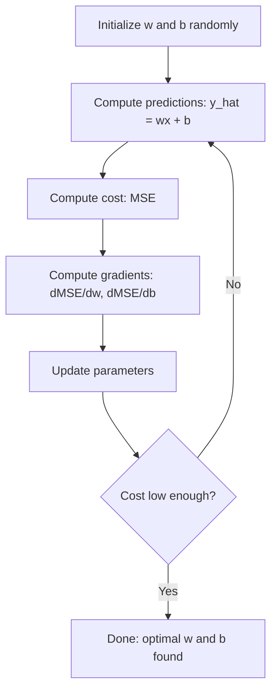

# रैखिक प्रतिगमन

> रैखिक प्रतिगमन आपके डेटा में सबसे अच्छी सीधी रेखा से चित्रित होगा। यह मशीन लर्निंग की हैलो दुनिया🏼 है।

**Type:** Build
**Languages:** Python
**Prerequisites:** Phase 1 (Linear Algebra, Calculus, Optimization), Phase 2 Lesson 1
**Time:** ~90 minutes

## 学习目标

- 推导 औसत वर्ग त्रुटि का ग्रेडिएंट डाउनसेन्ट 更新规则,并从零实现线性回归
- गणना जटिलता और अनुकूलन परिदृश्य कोण से तुलना करें ग्रेडिएंट डाउनसेन्ट सामान्य समीकरण
- 构建带特性 मानकीकरण के बहु रैखिक विघटन मॉडल,并解释学到的重量
- 解释 Ridge regression (L2 नियमितता) 如何通过惩罚较大的重量以防止过度

## 问题

आप एक डेटा समूह हैः घर के क्षेत्रफल और उसके आदान-प्रदान मूल्य। आप नए घर के क्षेत्रफल अनुमानित मूल्य के आधार पर सोच सकते हैं। आप एक अनुमानित अनुमान के साथ एक अनुमानित अनुमान पर अनुमान लगा सकते हैं, लेकिन आपको एक सूत्र की आवश्यकता है। आपको सबसे अधिक सटीक डेटा की एक सीधी रेखा की आवश्यकता है, ताकि आप किसी भी क्षेत्रफल में प्रवेश कर सकें और मूल्य अनुमान प्राप्त कर सकें।

रैखिक प्रतिगमन आपको यह रेखा देगा। इससे भी महत्वपूर्ण बात यह है कि यह एक पूर्ण एमएल प्रशिक्षण लूप पेश करता हैः मॉडल परिभाषित करें, लागत फ़ंक्शन परिभाषित करें, अनुकूलन मापदंडों को परिभाषित करें। प्रत्येक एमएल एल्गोरिदम एक ही पैटर्न का पालन करता है। सबसे सरल मामलों में इसे प्राप्त करने के लिए, आप इस पैटर्न को हर जगह पहचान लेंगे।

यह केवल सरल प्रश्नों के लिए ही लागू नहीं है। उत्पादन प्रणालियों में रैखिक प्रतिगमन मांग पूर्वानुमान, ए/बी परीक्षण विश्लेषण, वित्तीय मॉडलिंग के लिए भी उपयोग किया जाता है, और प्रत्येक प्रतिगमन कार्य का आधार रेखा है।

## 概念

### मॉडल

रैखिक प्रतिगमन 假设 इनपुट (x) और आउटपुट (y)  के बीच एक रैखिक संबंध हैः

```
y = wx + b
```

- `w`(वेट/झल):当 x 增加 1 时,y 改变多少
- `b`(bias/intercept): जब x = 0 时,y 的值

多个输入 (विशेषताओं) के लिए, यह विस्तारित हैः

```
y = w1*x1 + w2*x2 + ... + wn*xn + b
```

या लिखना वेक्टर 形式 मेंः`y = w^T * x + b`

目標: w 和 b का मूल्य ढूंढना, make prediction of y सभी प्रशिक्षण उदाहरणों में 上尽可能接近真实 y──

### लागत फ़ंक्शन (मध्यम वर्ग त्रुटि)

如何衡量尽可能接近? आपको एक एकल संख्या की आवश्यकता है ताकि अनुमान लगाया जा सके कि गलतियां हैं। सबसे आम विकल्प औसत वर्ग त्रुटि (MSE) हैः

```
MSE = (1/n) * sum((y_predicted - y_actual)^2)
```

क्यों वर्ग होना चाहिए? दो कारण हैं। पहला, यह बड़ी त्रुटियों के लिए छोटे त्रुटियों से अधिक दंडित करता है। पहला, 10 की तुलना में 10 गुना गलत है।

लागत फ़ंक्शन एक कण अनुभाग को आकार देगा। एकल वजन के लिए, एमएसई कण अनुभाग एक कटोरे की तरह दिखता है।

### क्रमिक गिरावट

ग्रिडिएंट डाउन लगातार नीचे की ओर कदम से नीचे के नीचे के लिए खोजने के लिए.



ग्रेडिएंट आपको दो बातें बताएंगे: प्रत्येक पैरामीटर को किस दिशा में स्थानांतरित होना चाहिए, तथा कितनी स्थानांतरित होनी चाहिए।

对于 y_hat = wx + b के एमएसई:

```
dMSE/dw = (2/n) * sum((y_hat - y) * x)
dMSE/db = (2/n) * sum(y_hat - y)
```

更新规则:

```
w = w - learning_rate * dMSE/dw
b = b - learning_rate * dMSE/db
```

सीखने की दर 控制步长──太大:会越过最小值并发散──太小:प्रशिक्षण 会耗时很久──典型起始值:0.01、0.001 或 0.0001──

### सामान्य समीकरण (闭式解)

विशेष रूप से रैखिक प्रतिगमन के लिए, एक सीधा सूत्र है जो बिना किसी 代 के स्थिति में सर्वोत्तम भार दे सकता हैः

```
w = (X^T * X)^(-1) * X^T * y
```

यह एक बड़े डेटा संग्रह के लिए बहुत उपयुक्त है, क्योंकि मैट्रिक्स की उलटाई में विशेषता संख्यात्मक जटिलता O (n ^ 3) है।

### बहु-रेखीय प्रतिगमन

ढ़ेरों विशेषताओं के लिए, मॉडल 变为:

```
y = w1*x1 + w2*x2 + ... + wn*xn + b
```

एक ही काम करने का तरीकाः एमएसई लागत फ़ंक्शन है, ग्रेडिएंट डाउनसेंट साथ ही सभी वजन अपडेट करते हैं। एकमात्र अंतर यह है कि आप एक हाइपरप्लेन के लिए उपयुक्त हैं, न कि एक लाइन के लिए।

विशेषता स्केलिंग यहाँ बहुत महत्वपूर्ण है। यदि एक विशेषता का दायरा 0 से 1 है, तो दूसरा 0 से 1,000,000 तक है, ग्रेडिएंट डेसेंट बैठक कठिन है, क्योंकि लागत सतह बदल जाएगी लांघ।

### बहुपद प्रतिगमन

यदि संबंध रैखिक नहीं है तो आप अभी भी रैखिक regression का उपयोग करके बहुपद सुविधाओं का निर्माण कर सकते हैंः

```
y = w1*x + w2*x^2 + w3*x^3 + b
```

यह अभी भी रैखिक निरंतर है, क्योंकि वजन (w1, w2, w3) के लिए मॉडल रैखिक है।

उच्चतम स्तर के बहुपद अधिक जटिल वक्रों के अनुरूप हो सकते हैं, लेकिन अत्यधिक अनुकूलन भी है। 10 डिग्री बहुपद 10 अंक डेटा सेट्स में प्रत्येक बिंदु के माध्यम से होगा, लेकिन नए डेटा पर पूर्वानुमान बहुत खराब है।

### आर-क्वायर स्कोर

MSE  आपको बताता है कि गलत है, लेकिन यह संख्या y के आकार पर निर्भर करती है। R-क्वायर (R ^ 2)  एक गैर-निर्भर माप सूचक प्रदान करता हैः

```
R^2 = 1 - (sum of squared residuals) / (sum of squared deviations from mean)
    = 1 - SS_res / SS_tot
```

- R^2 = 1.0:完美预测
- R^2 = 0.0: मॉडल नहीं है प्रति बार सभी पूर्वानुमान औसत बेहतर
- R^2 < 0.0:model 比预测 औसत 更差

### नियमन 预览 (रिज रिग्रेशन)

जब आपके पास कई विशेषताएं होती हैं, तो मॉडल अधिक वजन के वितरण के माध्यम से अधिक फिट हो सकता है।

```
Cost = MSE + lambda * sum(w_i^2)
```

惩罚项会抑制较大的重量──超参数 lambda 控制权衡:lambda 越高,重量 越小,规范化 越强──后课程会深入讲解这一点──现在只需要知道它存在,以及它为什么有帮助──

## 构建

### 步骤 1: नमूना डेटा उत्पन्न करें

```python
import random
import math

random.seed(42)

TRUE_W = 3.0
TRUE_B = 7.0
N_SAMPLES = 100

X = [random.uniform(0, 10) for _ in range(N_SAMPLES)]
y = [TRUE_W * x + TRUE_B + random.gauss(0, 2.0) for x in X]

print(f"Generated {N_SAMPLES} samples")
print(f"True relationship: y = {TRUE_W}x + {TRUE_B} (+ noise)")
print(f"First 5 points: {[(round(X[i], 2), round(y[i], 2)) for i in range(5)]}")
```

### 步骤 2: शून्य से रैखिक regression को प्राप्त करने के लिए ग्रेडिएंट अवतरण का उपयोग करें

```python
class LinearRegression:
    def __init__(self, learning_rate=0.01):
        self.w = 0.0
        self.b = 0.0
        self.lr = learning_rate
        self.cost_history = []

    def predict(self, X):
        return [self.w * x + self.b for x in X]

    def compute_cost(self, X, y):
        predictions = self.predict(X)
        n = len(y)
        cost = sum((pred - actual) ** 2 for pred, actual in zip(predictions, y)) / n
        return cost

    def compute_gradients(self, X, y):
        predictions = self.predict(X)
        n = len(y)
        dw = (2 / n) * sum((pred - actual) * x for pred, actual, x in zip(predictions, y, X))
        db = (2 / n) * sum(pred - actual for pred, actual in zip(predictions, y))
        return dw, db

    def fit(self, X, y, epochs=1000, print_every=200):
        for epoch in range(epochs):
            dw, db = self.compute_gradients(X, y)
            self.w -= self.lr * dw
            self.b -= self.lr * db
            cost = self.compute_cost(X, y)
            self.cost_history.append(cost)
            if epoch % print_every == 0:
                print(f"  Epoch {epoch:4d} | Cost: {cost:.4f} | w: {self.w:.4f} | b: {self.b:.4f}")
        return self

    def r_squared(self, X, y):
        predictions = self.predict(X)
        y_mean = sum(y) / len(y)
        ss_res = sum((actual - pred) ** 2 for actual, pred in zip(y, predictions))
        ss_tot = sum((actual - y_mean) ** 2 for actual in y)
        return 1 - (ss_res / ss_tot)


print("=== Training Linear Regression (Gradient Descent) ===")
model = LinearRegression(learning_rate=0.005)
model.fit(X, y, epochs=1000, print_every=200)
print(f"\nLearned: y = {model.w:.4f}x + {model.b:.4f}")
print(f"True:    y = {TRUE_W}x + {TRUE_B}")
print(f"R-squared: {model.r_squared(X, y):.4f}")
```

### 步骤 3: सामान्य समीकरण ( closed式解)

```python
class LinearRegressionNormal:
    def __init__(self):
        self.w = 0.0
        self.b = 0.0

    def fit(self, X, y):
        n = len(X)
        x_mean = sum(X) / n
        y_mean = sum(y) / n
        numerator = sum((X[i] - x_mean) * (y[i] - y_mean) for i in range(n))
        denominator = sum((X[i] - x_mean) ** 2 for i in range(n))
        self.w = numerator / denominator
        self.b = y_mean - self.w * x_mean
        return self

    def predict(self, X):
        return [self.w * x + self.b for x in X]

    def r_squared(self, X, y):
        predictions = self.predict(X)
        y_mean = sum(y) / len(y)
        ss_res = sum((actual - pred) ** 2 for actual, pred in zip(y, predictions))
        ss_tot = sum((actual - y_mean) ** 2 for actual in y)
        return 1 - (ss_res / ss_tot)


print("\n=== Normal Equation (Closed-Form) ===")
model_normal = LinearRegressionNormal()
model_normal.fit(X, y)
print(f"Learned: y = {model_normal.w:.4f}x + {model_normal.b:.4f}")
print(f"R-squared: {model_normal.r_squared(X, y):.4f}")
```

### 步骤 4:बहुत लीनियर रेग्रिशन

```python
class MultipleLinearRegression:
    def __init__(self, n_features, learning_rate=0.01):
        self.weights = [0.0] * n_features
        self.bias = 0.0
        self.lr = learning_rate
        self.cost_history = []

    def predict_single(self, x):
        return sum(w * xi for w, xi in zip(self.weights, x)) + self.bias

    def predict(self, X):
        return [self.predict_single(x) for x in X]

    def compute_cost(self, X, y):
        predictions = self.predict(X)
        n = len(y)
        return sum((pred - actual) ** 2 for pred, actual in zip(predictions, y)) / n

    def fit(self, X, y, epochs=1000, print_every=200):
        n = len(y)
        n_features = len(X[0])
        for epoch in range(epochs):
            predictions = self.predict(X)
            errors = [pred - actual for pred, actual in zip(predictions, y)]
            for j in range(n_features):
                grad = (2 / n) * sum(errors[i] * X[i][j] for i in range(n))
                self.weights[j] -= self.lr * grad
            grad_b = (2 / n) * sum(errors)
            self.bias -= self.lr * grad_b
            cost = self.compute_cost(X, y)
            self.cost_history.append(cost)
            if epoch % print_every == 0:
                print(f"  Epoch {epoch:4d} | Cost: {cost:.4f}")
        return self

    def r_squared(self, X, y):
        predictions = self.predict(X)
        y_mean = sum(y) / len(y)
        ss_res = sum((actual - pred) ** 2 for actual, pred in zip(y, predictions))
        ss_tot = sum((actual - y_mean) ** 2 for actual in y)
        return 1 - (ss_res / ss_tot)


random.seed(42)
N = 100
X_multi = []
y_multi = []
for _ in range(N):
    size = random.uniform(500, 3000)
    bedrooms = random.randint(1, 5)
    age = random.uniform(0, 50)
    price = 50 * size + 10000 * bedrooms - 1000 * age + 50000 + random.gauss(0, 20000)
    X_multi.append([size, bedrooms, age])
    y_multi.append(price)


def standardize(X):
    n_features = len(X[0])
    means = [sum(X[i][j] for i in range(len(X))) / len(X) for j in range(n_features)]
    stds = []
    for j in range(n_features):
        variance = sum((X[i][j] - means[j]) ** 2 for i in range(len(X))) / len(X)
        stds.append(variance ** 0.5)
    X_scaled = []
    for i in range(len(X)):
        row = [(X[i][j] - means[j]) / stds[j] if stds[j] > 0 else 0 for j in range(n_features)]
        X_scaled.append(row)
    return X_scaled, means, stds


y_mean_val = sum(y_multi) / len(y_multi)
y_std_val = (sum((yi - y_mean_val) ** 2 for yi in y_multi) / len(y_multi)) ** 0.5
y_scaled = [(yi - y_mean_val) / y_std_val for yi in y_multi]

X_scaled, x_means, x_stds = standardize(X_multi)

print("\n=== Multiple Linear Regression (3 features) ===")
print("Features: house size, bedrooms, age")
multi_model = MultipleLinearRegression(n_features=3, learning_rate=0.01)
multi_model.fit(X_scaled, y_scaled, epochs=1000, print_every=200)

print(f"\nWeights (standardized): {[round(w, 4) for w in multi_model.weights]}")
print(f"Bias (standardized): {multi_model.bias:.4f}")
print(f"R-squared: {multi_model.r_squared(X_scaled, y_scaled):.4f}")
```

### 步骤 5: बहुपद विघटन

```python
class PolynomialRegression:
    def __init__(self, degree, learning_rate=0.01):
        self.degree = degree
        self.weights = [0.0] * degree
        self.bias = 0.0
        self.lr = learning_rate

    def make_features(self, X):
        return [[x ** (d + 1) for d in range(self.degree)] for x in X]

    def predict(self, X):
        features = self.make_features(X)
        return [sum(w * f for w, f in zip(self.weights, row)) + self.bias for row in features]

    def fit(self, X, y, epochs=1000, print_every=200):
        features = self.make_features(X)
        n = len(y)
        for epoch in range(epochs):
            predictions = [sum(w * f for w, f in zip(self.weights, row)) + self.bias for row in features]
            errors = [pred - actual for pred, actual in zip(predictions, y)]
            for j in range(self.degree):
                grad = (2 / n) * sum(errors[i] * features[i][j] for i in range(n))
                self.weights[j] -= self.lr * grad
            grad_b = (2 / n) * sum(errors)
            self.bias -= self.lr * grad_b
            if epoch % print_every == 0:
                cost = sum(e ** 2 for e in errors) / n
                print(f"  Epoch {epoch:4d} | Cost: {cost:.6f}")
        return self

    def r_squared(self, X, y):
        predictions = self.predict(X)
        y_mean = sum(y) / len(y)
        ss_res = sum((actual - pred) ** 2 for actual, pred in zip(y, predictions))
        ss_tot = sum((actual - y_mean) ** 2 for actual in y)
        return 1 - (ss_res / ss_tot)


random.seed(42)
X_poly = [x / 10.0 for x in range(0, 50)]
y_poly = [0.5 * x ** 2 - 2 * x + 3 + random.gauss(0, 1.0) for x in X_poly]

x_max = max(abs(x) for x in X_poly)
X_poly_norm = [x / x_max for x in X_poly]
y_poly_mean = sum(y_poly) / len(y_poly)
y_poly_std = (sum((yi - y_poly_mean) ** 2 for yi in y_poly) / len(y_poly)) ** 0.5
y_poly_norm = [(yi - y_poly_mean) / y_poly_std for yi in y_poly]

print("\n=== Polynomial Regression (degree 2 vs degree 5) ===")
print("True relationship: y = 0.5x^2 - 2x + 3")

print("\nDegree 2:")
poly2 = PolynomialRegression(degree=2, learning_rate=0.1)
poly2.fit(X_poly_norm, y_poly_norm, epochs=2000, print_every=500)
print(f"  R-squared: {poly2.r_squared(X_poly_norm, y_poly_norm):.4f}")

print("\nDegree 5:")
poly5 = PolynomialRegression(degree=5, learning_rate=0.1)
poly5.fit(X_poly_norm, y_poly_norm, epochs=2000, print_every=500)
print(f"  R-squared: {poly5.r_squared(X_poly_norm, y_poly_norm):.4f}")

print("\nDegree 2 fits the true curve well. Degree 5 fits training data slightly better")
print("but risks overfitting on new data.")
```

### 步骤 6: रिज रेग्रिशन (L2 नियमितता)

```python
class RidgeRegression:
    def __init__(self, n_features, learning_rate=0.01, alpha=1.0):
        self.weights = [0.0] * n_features
        self.bias = 0.0
        self.lr = learning_rate
        self.alpha = alpha

    def predict_single(self, x):
        return sum(w * xi for w, xi in zip(self.weights, x)) + self.bias

    def predict(self, X):
        return [self.predict_single(x) for x in X]

    def fit(self, X, y, epochs=1000, print_every=200):
        n = len(y)
        n_features = len(X[0])
        for epoch in range(epochs):
            predictions = self.predict(X)
            errors = [pred - actual for pred, actual in zip(predictions, y)]
            mse = sum(e ** 2 for e in errors) / n
            reg_term = self.alpha * sum(w ** 2 for w in self.weights)
            cost = mse + reg_term
            for j in range(n_features):
                grad = (2 / n) * sum(errors[i] * X[i][j] for i in range(n))
                grad += 2 * self.alpha * self.weights[j]
                self.weights[j] -= self.lr * grad
            grad_b = (2 / n) * sum(errors)
            self.bias -= self.lr * grad_b
            if epoch % print_every == 0:
                print(f"  Epoch {epoch:4d} | Cost: {cost:.4f} | L2 penalty: {reg_term:.4f}")
        return self


print("\n=== Ridge Regression (L2 Regularization) ===")
print("Same data as multiple regression, with alpha=0.1")
ridge = RidgeRegression(n_features=3, learning_rate=0.01, alpha=0.1)
ridge.fit(X_scaled, y_scaled, epochs=1000, print_every=200)
print(f"\nRidge weights: {[round(w, 4) for w in ridge.weights]}")
print(f"Plain weights: {[round(w, 4) for w in multi_model.weights]}")
print("Ridge weights are smaller (shrunk toward zero) due to the L2 penalty.")
```


```figure
linear-regression-fit
```

## इसका उपयोग करें

अब थोड़ा सीखे और कुछ ऐसा ही करो, यह ही तरीका है जिसे आप प्रोडक्शन में इस्तेमाल करेंगे।

```python
from sklearn.linear_model import LinearRegression as SklearnLR
from sklearn.linear_model import Ridge
from sklearn.preprocessing import PolynomialFeatures, StandardScaler
from sklearn.model_selection import train_test_split
from sklearn.metrics import mean_squared_error, r2_score
import numpy as np

np.random.seed(42)
X_sk = np.random.uniform(0, 10, (100, 1))
y_sk = 3.0 * X_sk.squeeze() + 7.0 + np.random.normal(0, 2.0, 100)

X_train, X_test, y_train, y_test = train_test_split(X_sk, y_sk, test_size=0.2, random_state=42)

lr = SklearnLR()
lr.fit(X_train, y_train)
y_pred = lr.predict(X_test)

print("=== Scikit-learn Linear Regression ===")
print(f"Coefficient (w): {lr.coef_[0]:.4f}")
print(f"Intercept (b): {lr.intercept_:.4f}")
print(f"R-squared (test): {r2_score(y_test, y_pred):.4f}")
print(f"MSE (test): {mean_squared_error(y_test, y_pred):.4f}")

poly = PolynomialFeatures(degree=2, include_bias=False)
X_poly_sk = poly.fit_transform(X_train)
X_poly_test = poly.transform(X_test)

lr_poly = SklearnLR()
lr_poly.fit(X_poly_sk, y_train)
print(f"\nPolynomial degree 2 R-squared: {r2_score(y_test, lr_poly.predict(X_poly_test)):.4f}")

scaler = StandardScaler()
X_train_scaled = scaler.fit_transform(X_train)
X_test_scaled = scaler.transform(X_test)

ridge = Ridge(alpha=1.0)
ridge.fit(X_train_scaled, y_train)
print(f"Ridge R-squared: {r2_score(y_test, ridge.predict(X_test_scaled)):.4f}")
print(f"Ridge coefficient: {ridge.coef_[0]:.4f}")
```

आपके स्किट-लर्न के परिणाम एक ही होंगे। अंतर इस बात में है कि स्किट-लर्न के साथ एज केसों का निपटारा किया जाएगा।

## 交付

本课会产出:
- `outputs/skill-regression.md`- एक कौशल, जो समस्या के आधार पर उपयुक्त regression का चयन करने के लिए उपयोग किया जाता है

## अभ्यास

1. 实现 बैच ग्रेडिएंट अवतरण, स्टोकास्टिक ग्रेडिएंट अवतरण (SGD) तथा मिनी-बैच ग्रेडिएंट अवतरण, 
2. क्यूबिक फ़ंक्शन से (y = ax^3 + bx^2 + cx + d + शोर) 生成数据──拟合度 1、3 和 10 के बहुपद── तुलना प्रशिक्षण R^2 和 परीक्षण R^2──到哪个程度 时过变得明显?
3. 实现 लासो रेग्रेसशन(L1 नियमनः दंड *(वित्त = अल्फा राशि *((वित्त = i ही)) 房价数据上培训多功能中──比较会变为零,以及与Ridge的区别──为什么L1会产生稀少解决方案,而L2不会?

## 关键术语

| Term | 人们常说 | 实际含义 |
|------|----------------|----------------------|
| Linear regression | “在数据中画一条线” | 找到 weight w 和 bias b，使 wx+b 与真实 y 值之间的平方差之和最小 |
| Cost function | “model 有多差” | 一个将 model parameters 映射为单一数字的函数，用于衡量 prediction error，并由 optimization 最小化 |
| Mean squared error | “平方误差的平均值” | (1/n) * (predicted - actual)^2 的求和，对大误差施加不成比例的惩罚 |
| Gradient descent | “往下坡走” | 使用偏导数，沿着降低 cost function 的方向迭代调整 parameters |
| Learning rate | “步长” | 控制每一步 Gradient Descent 中 parameters 改变量的标量 |
| Normal equation | “直接求解” | 闭式解 w = (X^T X)^-1 X^T y，无需迭代即可得到最优 weights |
| R-squared | “拟合有多好” | model 所解释的 y 方差比例，范围从负无穷到 1.0 |
| Feature scaling | “让 features 可比较” | 将 features 转换到相近范围（例如 zero mean、unit variance），使 Gradient Descent 更快收敛 |
| Regularization | “惩罚复杂度” | 向 cost function 添加一个会缩小 weights 的项，以防止 overfitting |
| Ridge regression | “L2 regularization” | 向 MSE 添加 lambda * sum(w_i^2) 惩罚项的 linear regression |
| Polynomial regression | “用线性数学拟合曲线” | 对 polynomial features (x, x^2, x^3, ...) 做 linear regression，对 weights 仍然是线性的 |
| Overfitting | “记住 training data” | 使用过于复杂的 model，以至于拟合了 training data 中的噪声，并在新数据上失效 |

## 延伸阅读

- [An Introduction to Statistical Learning (ISLR)](https://www.statlearning.com/)-- 免费 PDF,第3章和第6章 涵盖线性回归与规范化,并包含实用R示例
- [The Elements of Statistical Learning (ESL)](https://hastie.su.domains/ElemStatLearn/)-- 免费 PDF, ISLR अधिक प्राथमिक गणितीय सहायक पढ़ने, रिडज और लासो के लिए अधिक गहराई से संसाधित
- [Stanford CS229 Lecture Notes on Linear Regression](https://cs229.stanford.edu/main_notes.pdf)-- एंड्रयू एन के नोट्स, प्रथम प्रकृति सिद्धांत से सामान्य समीकरण और ग्रेडिएंट अवतरण का सुझाव
- [scikit-learn LinearRegression documentation](https://scikit-learn.org/stable/modules/linear_model.html)-- LinearRegression、Ridge、Lasso 和 ElasticNet का व्यावहारिक संदर्भ, कोड उदाहरण शामिल है
