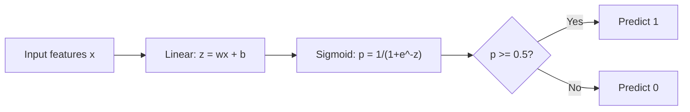
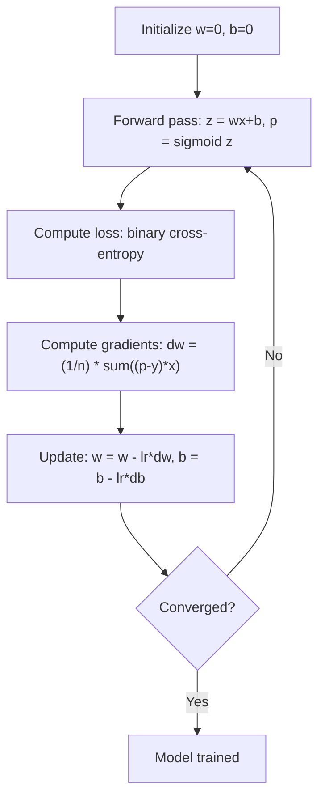

# रसदगत गिरावट

> लॉजिस्टिक रिग्रेशन को S-क्रव में एक सीधा रेखा बना दिया जाएगा, जिसका उत्तर उत्तर उत्तर संयोग से है या नहीं प्रश्न में दिया जाएगा।

**类型：**निर्माण
**语言：**पायथन
**先修要求：**चरण 2 पाठ 1-2 (एलएम क्या है, रैखिक प्रतिगमन)
**时间：**≈ 90 मिनट

## 学习目标

- उपयोग सिग्मोइड फ़ंक्शन 和 द्विआधारी क्रॉस-एंट्रोपी हानि शून्य से लॉजिस्टिक रिग्रेशन को प्राप्त करने के लिए
- 計算并解释 द्विआधारी वर्गीकरण 中的精度、召回、F1 स्कोर 和混沌矩阵
- explicit क्यों MSE वर्गीकरण के अनुरूप नहीं है, और क्यों द्विआधारी क्रॉस-एंट्रोपी एक संकुचित लागत सतह उत्पन्न होगा
- 构建用于多类分类的软max regression model,并评估门调节的权衡

## 问题

आप सोचेंगे कि यह घातक या सौम्य है। आप रैखिक प्रतिगमन का उपयोग करने की कोशिश करेंगे। यह 0.3、1.7 या -0.5 के समान संख्याओं का उत्पादन करेगा। इन संख्याओं का क्या अर्थ है?1.7 क्या बहुत घातक है??-0.5 क्या बहुत सौम्य है? रैखिक प्रतिगमन का उत्पादन अनंत संख्याएं हैं। वर्गीकरण के लिए 0 से 1 के बीच की सीमा संभावनाओं की आवश्यकता होती है, साथ ही स्पष्ट निर्णयः हां या नहीं।

लॉजिस्टिक रेग्रिशन  ने इस समस्या को हल किया  यह समान 线性组合 (wx + b) का उपयोग करता है, फिर सिग्मोइड फ़ंक्शन के माध्यम से, किसी भी संख्या को (0, 1) 范围内 तक संकुचित करेगा  आउटपुट就是概率──आप एक सीमा सेट करते हैं  आमतौर पर 0.5), फिर निर्णय लेते हैं

यह अभ्यास में उपयोग की जाने वाली सबसे व्यापक एल्गोरिदम में से एक है। हालांकि नाम में रिग्रेशन है, लॉजिस्टिक रिग्रेशन एक वर्गीकरण एल्गोरिदम है, रिग्रेशन एल्गोरिदम नहीं। यह नाम लॉजिस्टिक से आया है जिसका उपयोग यह करता है।

## 核心概念

### क्यों रैखिक प्रतिगमन वर्गीकरण के लिए उपयुक्त नहीं है

假设根据学习时长预测通过/未通过(1/0) ―― रैखिक regression 会拟合一条穿越数据的直线:

```
hours:  1   2   3   4   5   6   7   8   9   10
actual: 0   0   0   0   1   1   1   1   1   1
```

线性拟合可能会在第1小时给出 -0.2,在第10小时给出 1.3── इस प्रकार का मान संभावना नहीं है── वे 0 से कम होंगे, 1 से भी अधिक होंगे── इससे भी बदतर, एक आउटलियर (उदाहरण के लिए किसी ने 50 घंटे सीखा है) पूरे 条直线 को खींच लेगा, मालिक की भविष्यवाणी को बदल देगा──

वर्गीकरण 需要一个满足以下条件的函数:
- 输出 0  के बीच 1  के बीच मूल्य (概率)
- 产生清晰的转变 (निर्णय सीमा)
-                                                                                                                                                                                                                                                               

### सिग्मोइड फ़ंक्शन

सिग्मोइड फ़ंक्शन ठीक है ऐसा करनाः

```
sigmoid(z) = 1 / (1 + e^(-z))
```

性质:
- जब z है बहुत बड़ी संख्या में,sigmoid(z)  करीब 1
- जब z है बहुत बड़ी नकारात्मक संख्या,sigmoid(z)  करीब 0
- जब z = 0 时,sigmoid(z) = 0.5
- 输出始终位于0 और 1 के बीच
- यह कार्य सरल और सूक्ष्म है

इसका व्युत्पन्न 具有方便的形式:sigmoid'(z) = sigmoid(z) * (1 - sigmoid(z))。 यह让渐进式 计算更高效──

### लॉजिस्टिक रिग्रेशन = रैखिक मॉडल + सिग्मोइड

模型先计算 z = wx + b(与线性回归相同), फिर सिग्मोइड लागू करेंः



输出 p को P  y=1  x के रूप में समझाया जाता है, यानी输入 वर्ग 1 के अंतर्गत आता है की संभावना  निर्णय सीमा  स्थित है wx + b = 0 की स्थिति में, इस समय सिग्मोइड 输出恰好为 0.5 

### द्विआधारी क्रॉस-एंट्रोपी हानि

不能在物流回归中使用MSE──带 sigmoid 的MSE 会产生非凸的成本表面,并存在许多地方最小──应使用二进制交叉输入日记损失):

```
Loss = -(1/n) * sum(y * log(p) + (1-y) * log(1-p))
```

यह क्यों प्रभावी हैः
- जब y=1 且 p 接近 1 时:log(1) = 0, इसलिए हानि 接近 0(正确,低成本)
- जब y=1 और p 接近 0 时:log(0) 接近负无穷, इसलिए हानि 很大(错误,高成本)
- जब y=0 且 p 接近 0 时:log(1) = 0, इसलिए हानि 接近 0(正确,低成本)
- जब y=0 且 p 接近 1 时:log(0) 接近负无穷, इसलिए हानि 很大(错误,高成本)

् लॉजिस्टिक रिग्रेशन के लिए, यह हानि फ़ंक्शन है, इसलिए यह केवल एक वैश्विक न्यूनतम है।

### लॉजिस्टिक रिग्रेशन की क्रमिक गिरावट

सिग्मोइड 搭配 द्विआधारी क्रॉस-एंट्रोपी 时,ग्रेडिएंट 具有简洁形式:

```
dL/dw = (1/n) * sum((p - y) * x)
dL/db = (1/n) * sum(p - y)
```

它们看起来与线性回归的渐进式完全相同──区别在于p = sigmoid(wx + b),而不是p = wx + b──sigmoid 引入非线性,但渐进式 更新规则保持不变──



### निर्णय सीमा

对于2D 输入(两个特征), निर्णय सीमा निम्नलिखित शर्तों को पूरा करने के लिए है:

```
w1*x1 + w2*x2 + b = 0
```

एक तरफ के बिंदुओं को वर्गीकरण के लिए 1, दूसरी तरफ के बिंदुओं को वर्गीकरण के लिए 0 के लिए किया जाता है।

### उपयोग सॉफ्टमैक्स  बहु-वर्ग वर्गीकरण करें

द्विआधारी लॉजिस्टिक रिग्रेशन 处理两个类──对于 k 个类,使用软max फ़ंक्शन:

```
softmax(z_i) = e^(z_i) / sum(e^(z_j) for all j)
```

प्रत्येक वर्ग के लिए अपना वजन वेक्टर होता है। प्रत्येक वर्ग के लिए मॉडल  एक स्कोर z_i का गणना करता है, फिर softmax स्कोर  को कुल और 1 के लिए संभावना में परिवर्तित करता है।

हानि फ़ंक्शन 变为 श्रेणीगत क्रॉस-एंट्रोपीः

```
Loss = -(1/n) * sum(sum(y_k * log(p_k)))
```

इनमें से y_k के लिए सही वर्ग 为 1, के लिए अन्य सभी वर्गों के लिए 0(एक गर्म एन्कोडिंग)

### मूल्यांकन मेट्रिक्स

 केवल सटीकता पर निर्भर नहीं है  95% नकारात्मक  5% सकारात्मक डेटासेट के लिए, एक कुल अनुमान नकारात्मक मॉडल 95% सटीकता प्राप्त कर सकता है, लेकिन इसका कोई उपयोग नहीं है

**Confusion Matrix**:

| | Predicted Positive | Predicted Negative |
|---|---|---|
| Actually Positive | True Positive (TP) | False Negative (FN) |
| Actually Negative | False Positive (FP) | True Negative (TN) |

**Precision**: सभी भविष्यवाणियों में सकारात्मक के लिए नमूना, वहाँ कितने वास्तव में सकारात्मक है?
```
Precision = TP / (TP + FP)
```

**Recall**(संवेदनशीलता): सभी सकारात्मक उदाहरणों में, हमने कितना पकड़ा है?
```
Recall = TP / (TP + FN)
```

**F1 Score**: सटीकता एवं याद करने का सामंजस्यपूर्ण औसत── संतुलन दो मापों──
```
F1 = 2 * (Precision * Recall) / (Precision + Recall)
```

 प्राथमिकता के क्षेत्र:
- **Precision**:当 झूठी सकारात्मक 代价高时(स्पैम फ़िल्टर,你不希望阻止合法电子邮件)
- **Recall**: जब झूठी नकारात्मक 代价高时(कैंसर स्क्रीनिंग,你不希望漏掉瘤)
- **F1**: जब आप एक संतुलन के एकल मीट्रिक की जरूरत है


```figure
logistic-sigmoid
```

##  इसे निर्माण

### 步骤 1: सिग्मोइड फ़ंक्शन और डेटा जनरेशन

```python
import random
import math

def sigmoid(z):
    z = max(-500, min(500, z))
    return 1.0 / (1.0 + math.exp(-z))


random.seed(42)
N = 200
X = []
y = []

for _ in range(N // 2):
    X.append([random.gauss(2, 1), random.gauss(2, 1)])
    y.append(0)

for _ in range(N // 2):
    X.append([random.gauss(5, 1), random.gauss(5, 1)])
    y.append(1)

combined = list(zip(X, y))
random.shuffle(combined)
X, y = zip(*combined)
X = list(X)
y = list(y)

print(f"Generated {N} samples (2 classes, 2 features)")
print(f"Class 0 center: (2, 2), Class 1 center: (5, 5)")
print(f"First 5 samples:")
for i in range(5):
    print(f"  Features: [{X[i][0]:.2f}, {X[i][1]:.2f}], Label: {y[i]}")
```

### 步骤 2: शून्य से प्राप्त लॉजिस्टिक रिग्रेशन

```python
class LogisticRegression:
    def __init__(self, n_features, learning_rate=0.01):
        self.weights = [0.0] * n_features
        self.bias = 0.0
        self.lr = learning_rate
        self.loss_history = []

    def predict_proba(self, x):
        z = sum(w * xi for w, xi in zip(self.weights, x)) + self.bias
        return sigmoid(z)

    def predict(self, x, threshold=0.5):
        return 1 if self.predict_proba(x) >= threshold else 0

    def compute_loss(self, X, y):
        n = len(y)
        total = 0.0
        for i in range(n):
            p = self.predict_proba(X[i])
            p = max(1e-15, min(1 - 1e-15, p))
            total += y[i] * math.log(p) + (1 - y[i]) * math.log(1 - p)
        return -total / n

    def fit(self, X, y, epochs=1000, print_every=200):
        n = len(y)
        n_features = len(X[0])
        for epoch in range(epochs):
            dw = [0.0] * n_features
            db = 0.0
            for i in range(n):
                p = self.predict_proba(X[i])
                error = p - y[i]
                for j in range(n_features):
                    dw[j] += error * X[i][j]
                db += error
            for j in range(n_features):
                self.weights[j] -= self.lr * (dw[j] / n)
            self.bias -= self.lr * (db / n)
            loss = self.compute_loss(X, y)
            self.loss_history.append(loss)
            if epoch % print_every == 0:
                print(f"  Epoch {epoch:4d} | Loss: {loss:.4f} | w: [{self.weights[0]:.3f}, {self.weights[1]:.3f}] | b: {self.bias:.3f}")
        return self

    def accuracy(self, X, y):
        correct = sum(1 for i in range(len(y)) if self.predict(X[i]) == y[i])
        return correct / len(y)


split = int(0.8 * N)
X_train, X_test = X[:split], X[split:]
y_train, y_test = y[:split], y[split:]

print("\n=== Training Logistic Regression ===")
model = LogisticRegression(n_features=2, learning_rate=0.1)
model.fit(X_train, y_train, epochs=1000, print_every=200)

print(f"\nTrain accuracy: {model.accuracy(X_train, y_train):.4f}")
print(f"Test accuracy:  {model.accuracy(X_test, y_test):.4f}")
print(f"Weights: [{model.weights[0]:.4f}, {model.weights[1]:.4f}]")
print(f"Bias: {model.bias:.4f}")
```

### 步骤 3: शून्य से भ्रम मैट्रिक्स और मेट्रिक्स को प्राप्त करने के लिए

```python
class ClassificationMetrics:
    def __init__(self, y_true, y_pred):
        self.tp = sum(1 for t, p in zip(y_true, y_pred) if t == 1 and p == 1)
        self.tn = sum(1 for t, p in zip(y_true, y_pred) if t == 0 and p == 0)
        self.fp = sum(1 for t, p in zip(y_true, y_pred) if t == 0 and p == 1)
        self.fn = sum(1 for t, p in zip(y_true, y_pred) if t == 1 and p == 0)

    def accuracy(self):
        total = self.tp + self.tn + self.fp + self.fn
        return (self.tp + self.tn) / total if total > 0 else 0

    def precision(self):
        denom = self.tp + self.fp
        return self.tp / denom if denom > 0 else 0

    def recall(self):
        denom = self.tp + self.fn
        return self.tp / denom if denom > 0 else 0

    def f1(self):
        p = self.precision()
        r = self.recall()
        return 2 * p * r / (p + r) if (p + r) > 0 else 0

    def print_confusion_matrix(self):
        print(f"\n  Confusion Matrix:")
        print(f"                  Predicted")
        print(f"                  Pos   Neg")
        print(f"  Actual Pos     {self.tp:4d}  {self.fn:4d}")
        print(f"  Actual Neg     {self.fp:4d}  {self.tn:4d}")

    def print_report(self):
        self.print_confusion_matrix()
        print(f"\n  Accuracy:  {self.accuracy():.4f}")
        print(f"  Precision: {self.precision():.4f}")
        print(f"  Recall:    {self.recall():.4f}")
        print(f"  F1 Score:  {self.f1():.4f}")


y_pred_test = [model.predict(x) for x in X_test]
print("\n=== Classification Report (Test Set) ===")
metrics = ClassificationMetrics(y_test, y_pred_test)
metrics.print_report()
```

### 步骤 4: निर्णय सीमा 分析

```python
print("\n=== Decision Boundary ===")
w1, w2 = model.weights
b = model.bias
print(f"Decision boundary: {w1:.4f}*x1 + {w2:.4f}*x2 + {b:.4f} = 0")
if abs(w2) > 1e-10:
    print(f"Solved for x2:     x2 = {-w1/w2:.4f}*x1 + {-b/w2:.4f}")

print("\nSample predictions near the boundary:")
test_points = [
    [3.0, 3.0],
    [3.5, 3.5],
    [4.0, 4.0],
    [2.5, 2.5],
    [5.0, 5.0],
]
for point in test_points:
    prob = model.predict_proba(point)
    pred = model.predict(point)
    print(f"  [{point[0]}, {point[1]}] -> prob={prob:.4f}, class={pred}")
```

### 步骤 5: 使用 softmax 处理 बहु-वर्ग

```python
class SoftmaxRegression:
    def __init__(self, n_features, n_classes, learning_rate=0.01):
        self.n_features = n_features
        self.n_classes = n_classes
        self.lr = learning_rate
        self.weights = [[0.0] * n_features for _ in range(n_classes)]
        self.biases = [0.0] * n_classes

    def softmax(self, scores):
        max_score = max(scores)
        exp_scores = [math.exp(s - max_score) for s in scores]
        total = sum(exp_scores)
        return [e / total for e in exp_scores]

    def predict_proba(self, x):
        scores = [
            sum(self.weights[k][j] * x[j] for j in range(self.n_features)) + self.biases[k]
            for k in range(self.n_classes)
        ]
        return self.softmax(scores)

    def predict(self, x):
        probs = self.predict_proba(x)
        return probs.index(max(probs))

    def fit(self, X, y, epochs=1000, print_every=200):
        n = len(y)
        for epoch in range(epochs):
            grad_w = [[0.0] * self.n_features for _ in range(self.n_classes)]
            grad_b = [0.0] * self.n_classes
            total_loss = 0.0
            for i in range(n):
                probs = self.predict_proba(X[i])
                for k in range(self.n_classes):
                    target = 1.0 if y[i] == k else 0.0
                    error = probs[k] - target
                    for j in range(self.n_features):
                        grad_w[k][j] += error * X[i][j]
                    grad_b[k] += error
                true_prob = max(probs[y[i]], 1e-15)
                total_loss -= math.log(true_prob)
            for k in range(self.n_classes):
                for j in range(self.n_features):
                    self.weights[k][j] -= self.lr * (grad_w[k][j] / n)
                self.biases[k] -= self.lr * (grad_b[k] / n)
            if epoch % print_every == 0:
                print(f"  Epoch {epoch:4d} | Loss: {total_loss / n:.4f}")
        return self

    def accuracy(self, X, y):
        correct = sum(1 for i in range(len(y)) if self.predict(X[i]) == y[i])
        return correct / len(y)


random.seed(42)
X_3class = []
y_3class = []

centers = [(1, 1), (5, 1), (3, 5)]
for label, (cx, cy) in enumerate(centers):
    for _ in range(50):
        X_3class.append([random.gauss(cx, 0.8), random.gauss(cy, 0.8)])
        y_3class.append(label)

combined = list(zip(X_3class, y_3class))
random.shuffle(combined)
X_3class, y_3class = zip(*combined)
X_3class = list(X_3class)
y_3class = list(y_3class)

split_3 = int(0.8 * len(X_3class))
X_train_3 = X_3class[:split_3]
y_train_3 = y_3class[:split_3]
X_test_3 = X_3class[split_3:]
y_test_3 = y_3class[split_3:]

print("\n=== Multi-class Softmax Regression (3 classes) ===")
softmax_model = SoftmaxRegression(n_features=2, n_classes=3, learning_rate=0.1)
softmax_model.fit(X_train_3, y_train_3, epochs=1000, print_every=200)
print(f"\nTrain accuracy: {softmax_model.accuracy(X_train_3, y_train_3):.4f}")
print(f"Test accuracy:  {softmax_model.accuracy(X_test_3, y_test_3):.4f}")

print("\nSample predictions:")
for i in range(5):
    probs = softmax_model.predict_proba(X_test_3[i])
    pred = softmax_model.predict(X_test_3[i])
    print(f"  True: {y_test_3[i]}, Predicted: {pred}, Probs: [{', '.join(f'{p:.3f}' for p in probs)}]")
```

### 步骤 6: सीमा समायोजन

```python
print("\n=== Threshold Tuning ===")
print("Default threshold: 0.5. Adjusting the threshold trades precision for recall.\n")

thresholds = [0.3, 0.4, 0.5, 0.6, 0.7]
print(f"{'Threshold':>10} {'Accuracy':>10} {'Precision':>10} {'Recall':>10} {'F1':>10}")
print("-" * 52)

for t in thresholds:
    y_pred_t = [1 if model.predict_proba(x) >= t else 0 for x in X_test]
    m = ClassificationMetrics(y_test, y_pred_t)
    print(f"{t:>10.1f} {m.accuracy():>10.4f} {m.precision():>10.4f} {m.recall():>10.4f} {m.f1():>10.4f}")
```

## इसका उपयोग करें

अब कुछ सीखकर वही करना है।

```python
from sklearn.linear_model import LogisticRegression as SklearnLR
from sklearn.metrics import accuracy_score, precision_score, recall_score, f1_score
from sklearn.metrics import confusion_matrix, classification_report
from sklearn.model_selection import train_test_split
from sklearn.preprocessing import StandardScaler
import numpy as np

np.random.seed(42)
X_0 = np.random.randn(100, 2) + [2, 2]
X_1 = np.random.randn(100, 2) + [5, 5]
X_sk = np.vstack([X_0, X_1])
y_sk = np.array([0] * 100 + [1] * 100)

X_tr, X_te, y_tr, y_te = train_test_split(X_sk, y_sk, test_size=0.2, random_state=42)

scaler = StandardScaler()
X_tr_sc = scaler.fit_transform(X_tr)
X_te_sc = scaler.transform(X_te)

lr = SklearnLR()
lr.fit(X_tr_sc, y_tr)
y_pred = lr.predict(X_te_sc)

print("=== Scikit-learn Logistic Regression ===")
print(f"Accuracy:  {accuracy_score(y_te, y_pred):.4f}")
print(f"Precision: {precision_score(y_te, y_pred):.4f}")
print(f"Recall:    {recall_score(y_te, y_pred):.4f}")
print(f"F1:        {f1_score(y_te, y_pred):.4f}")
print(f"\nConfusion Matrix:\n{confusion_matrix(y_te, y_pred)}")
print(f"\nClassification Report:\n{classification_report(y_te, y_pred)}")
```

आप के खरोंच से 实现 होगा उत्पन्न समान निर्णय सीमा 和 मापों── स्किट-लर्न  बढ़ाया हल विकल्पों लिबलाइनर、lbfgs、सागा)、 स्वचालित नियमितकरण、 मल्टी-क्लास रणनीतियों एक बनाम शेष、 मल्टीनोमल) तथा संख्यात्मक स्थिरता अनुकूलन──

## 交付 यह

本课会产出:
- `code/logistic_regression.py`- शून्य से प्राप्त लॉजिस्टिक प्रतिगमन, जिसमें मेट्रिक्स शामिल हैं

## अभ्यास

1. 生成一个不是线性分离的数据集 (例如两个同心圆) ⋅训练物流回归并观察它的失败──然后添加多项式特性(x1^2、x2^2、x1*x2)并再次训练──展示精度 得到提升──
2. 3. वर्ग सॉफ्टमैक्स मॉडल 实现 एक बहु-वर्ग भ्रम मैट्रिक्स ⋅ गणना प्रति वर्ग सटीकता 和 याद रखना ⋅ किस वर्ग को सबसे कठिन वर्गीकरण?
3. ० से आरओसी वक्र का निर्माण करना 〇对 0 से 〇 के बीच 100  सीमा मान, सही सकारात्मक दर और गलत सकारात्मक दर का गणना करना 〇 ट्रैपेज़ोइडल नियम का उपयोग करना 计算 AUC  वक्र के नीचे क्षेत्र) 

## 关键术语

| Term | 人们常说 | 实际含义 |
|------|----------------|----------------------|
| Logistic regression | “用于 Classification 的 Regression” | 一个 linear model 后接 sigmoid function，用于输出 class probabilities |
| Sigmoid function | “S-curve” | function 1/(1+e^(-z))，将任意实数映射到 (0, 1) 范围 |
| Binary cross-entropy | “Log loss” | Loss Function -[y*log(p) + (1-y)*log(1-p)]，会严厉惩罚自信但错误的预测 |
| Decision boundary | “分界线” | 模型输出概率等于 0.5 的 surface，用于分隔 predicted classes |
| Softmax | “Multi-class sigmoid” | 将 scores 的 Vector 转换为总和为 1 的概率的 function |
| Precision | “选中的有多少是相关的” | TP / (TP + FP)，positive predictions 中实际为 positive 的比例 |
| Recall | “相关的有多少被选中” | TP / (TP + FN)，actual positives 中被模型正确识别的比例 |
| F1 score | “平衡 Accuracy” | precision 和 recall 的 harmonic mean：2*P*R / (P+R) |
| Confusion matrix | “错误分解” | 展示每个 class pair 的 TP、TN、FP、FN 计数的表格 |
| Threshold | “cutoff” | 超过该 probability value 时模型预测 class 1（默认 0.5，可调） |
| One-hot encoding | “类别的二进制列” | 将 class k 表示为一个 Vector：除位置 k 为 1 外，其余位置均为 0 |
| Categorical cross-entropy | “Multi-class log loss” | binary cross-entropy 到 k 个 classes 的扩展，使用 one-hot encoded labels |
