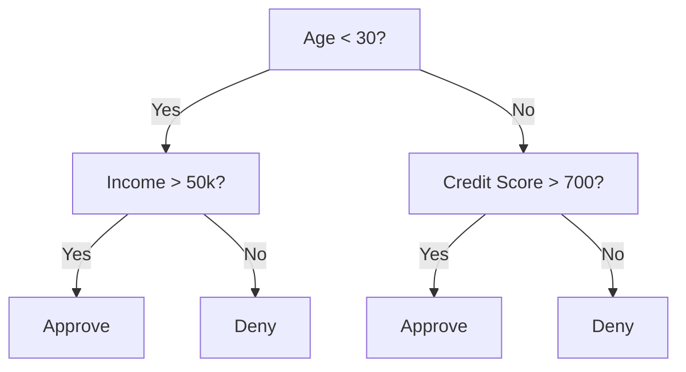
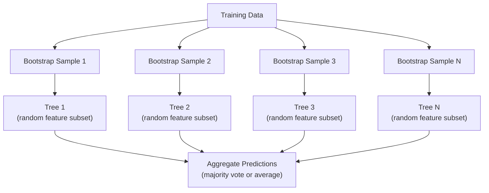

# निर्णय वृक्ष और आकस्मिक वन

> निर्णय वृक्ष केवल एक प्रक्रिया है। लेकिन कई वृक्षों से बना वन, एमएल में सबसे शक्तिशाली उपकरणों में से एक है।

**类型：**निर्माण
**语言：**पायथन
**先修要求：**चरण 1 ((पाठ 09 सूचना सिद्धांत, 06 संभावना)
**时间：**≈ 90 मिनट

## 学习目标

-                                                                                                                                                                                                                                                                                                                                                                                                                                                                                                                              
- 零构建一个决策树分类器,并加入预剪切 控制(最大深度、min样本)
- बूटस्ट्रैप नमूनाकरण और सुविधा यादृच्छिकरण का उपयोग करें  यादृच्छिक जंगल का निर्माण,并 व्याख्या यह क्यों कर सकता है भिन्नता कम
- MDI विशेषता महत्व की तुलना permutation महत्व,并识别 MDI

## 问题

आप तालिकागत डेटा हैं, उदाहरण है, विशेषता है, एक लक्ष्य स्तंभ भी है जिसे आप भविष्यवाणी करना चाहते हैं। आप सीधे न्यूरल नेटवर्क पर जा सकते हैं। लेकिन तालिकागत डेटा, पेड़ आधारित मॉडल के लिए, निर्णय के पेड़, यादृच्छिक वन, ग्रेडिएंट बूस्ट पेड़) डीप लर्निंग से बेहतर हैं।

क्यों?वृक्ष  बिना पूर्व प्रसंस्करण                                                                                                                                                                                                                                                                                                                                                                                                                                                                                                                   

इस वर्ग में पुनरावर्ती विभाजन का उपयोग किया जाएगा, शून्य से निर्णय के पेड़ का निर्माण करने से, फिर उस पर यादृच्छिक वन का निर्माण किया जाएगा।

## 核心概念

### निर्णय वृक्ष क्या कर रहे हैं

निर्णय वृक्ष 通过提出一系列 yes/no 问题,把 feature space 划分为矩形区域──



प्रत्येक आंतरिक नोड एक सीमा का उपयोग करेगा 测试某个特征―― प्रत्येक पत्ती नोड भविष्यवाणी करेगा―― एक नए डेटा बिंदु को वर्गीकृत करने के लिए, आप जड़ से शुरू करते हैं, शाखाओं के साथ आगे बढ़ते हैं, जब तक आप एक पत्ती तक नहीं पहुंचते हैं――

पेड़  शीर्ष-तल  विधि से निर्माणः प्रत्येक नोड में, चयन सबसे अधिक से अलग डेटा की विशेषता और सीमा                                                                                                                                                                                                                                                   

### विभाजन मानदंडः अशुद्धता का माप

प्रत्येक नोड में, हमारे पास नमूने का एक समूह है। हम उन्हें विभाजित करने की इच्छा रखते हैं, ताकि उत्पन्न होने वाले बाल नोड  यथासंभव शुद्ध हों।

**Gini impurity**️ मापने के लिए यह हैः यदि उस नोड के वर्ग वितरण के अनुसार ️ किसी यादृच्छिक चयन के नमूना 贴 लेबल को दिया जाए, तो इसे गलत वर्गीकृत करने की संभावना है

```
Gini(S) = 1 - sum(p_k^2)

where p_k is the proportion of class k in set S.
```

对于纯节点(全部属于同一个类),Gini = 0──对于50/50类的二进制分区,Gini = 0.5──越低越好──

```
Example: 6 cats, 4 dogs

Gini = 1 - (0.6^2 + 0.4^2) = 1 - (0.36 + 0.16) = 0.48
```

**Entropy**衡量节 中的信息量(混乱程度) ――चरण 1 पाठ 09 已覆盖──

```
Entropy(S) = -sum(p_k * log2(p_k))
```

对于纯节点, Entropy = 0──对于50/50 द्विआधारी विभाजन, Entropy = 1.0──越低越好──

```
Example: 6 cats, 4 dogs

Entropy = -(0.6 * log2(0.6) + 0.4 * log2(0.4))
        = -(0.6 * -0.737 + 0.4 * -1.322)
        = 0.442 + 0.529
        = 0.971 bits
```

**Information gain**                                                                                                                                                                                                                                                              

```
IG(S, feature, threshold) = Impurity(S) - weighted_avg(Impurity(S_left), Impurity(S_right))

where the weights are the proportions of samples in each child.
```

प्रत्येक नोड के ऊपर लोभी एल्गोरिथ्म: प्रयास प्रत्येक विशेषता 和 प्रत्येक संभव के सीमाएँ── चयन जानकारी प्राप्त करने के लिए सबसे बड़ा `(feature, threshold)`组合──

### विभाजन 如何工作

对于当前节上包含 n 个特性、m 个样本的数据集:

1. प्रत्येक विशेषता के लिए j(j = 1 से n):
   - 按 विशेषता j对样品 排序
   -                                                                                                                                                                                                                                                               
   - 计算每门的信息获取
2. 选择 सूचना प्राप्त करने का उच्चतम विशेषता और सीमा
3. डेटा को बाएं भाग में विभाजित करना (विशेषता <= सीमा) और दाएं भाग में विभाजित करना (विशेषता > सीमा)
4. प्रत्येक बच्चे के लिए

इस प्रकार की लोभपूर्ण विधि पूरी दुनिया का सबसे अच्छा पेड़ पाने की गारंटी नहीं देती है।

### 停止条件

यदि कोई रुकावट न हो, तो पेड़ बढ़ता रहेगा, जब तक कि हर पत्ती शुद्ध न हो, प्रत्येक पत्ती का एक नमूना न हो।

**Pre-pruning**完全长成之前停止:
- अधिकतम गहराई:当 tree  设定 गहराई तक पहुँचें 时停止分裂
- प्रति पत्ती न्यूनतम नमूनेः यदि किसी नोड के नमूने कम से कम k, तो रुकें
- न्यूनतम सूचना लाभः यदि अशुद्धता में सुधार में सर्वोत्तम विभाजन किसी सीमा से कम हो, तो रोकें
- अधिकतम पत्ती नोड्स: सीमित पत्तियों की कुल संख्या

**Post-pruning**पहले पूर्ण वृक्ष उत्पन्न करें, फिर फिर पुनः पुनः पुनः पुनः पुनः पुनः पुनः पुनः पुनः पुनः पुनः पुनः पुनः पुनः पुनः पुनः पुनः पुनः पुनः पुनः पुनः पुनः पुनः पुनः पुनः पुनः पुनः पुनः पुनः पुनः पुनः पुनः पुनः पुनः पुनः पुनः पुनः पुनः पुनः पुनः पुनः पुनः पुनः पुनः पुनः पुनः पुनः पुनः पुनः पुनः पुनः पुनः पुनः पुनः पुनः पुनः पुनः पुनः पुनः पुनः पुनः पुनः पुनः पुनः पुनः पुनः पुनः पुनः पुनः पुनः पुनः पुनः पुनः पुनः पुनः पुनः पुनः पुनः पुनः पुनः पुनः पुनः पुनः पुनः पुनः पुनः पुनः पुनः पुनः पुनः पुनः पुनः पुनः पुनः पुनः पुनः पुनः पुनः पुनः पुनः पुनः पुनः पुनः पुनः पुनः पुनः पुनः पुनः पुनः पुनः पुनः पुनः पुनः पुनः पुनः पुनः पुनः पुनः पुनः पुनः पुनः पुनः पुनः पुनः पुनः पुनः पुनः पुनः पुनः पुनः पुनः पुनः पुनः पुनः पुनः पुनः पुनः पुनः पुनः पुनः पुनः पुनः पुनः पुनः पुनः पुनः पुनः पुनः पुनः पुनः पुनः पुनः पुनः पुनः पुनः पुनः पुनः पुनः पुनः पुनः पुनः पुनः पुनः पुनः पुनः पुनः पुनः पुनः पुनः पुनः पुनः पुनः पुनः पुनः पुनः पुनः पुनः पुनः पुनः पुनः पुनः पुनः पुनः पुनः पुनः पुनः पुनः पुनः पुनः पुनः पुनः पुनः पुनः पुनः पुनः पुनः पुनः पुनः पुनः पुनः पुनः पुनः पुनः पुनः पुनः पुनः पुनः पुनः पुनः पुनः पुनः पुनः पुनः पुनः पुनः पुनः पुनः पुनः पुनः पुनः पुनः पुनः पुनः पुनः पुनः पुनः पुनः पुनः पुनः पुनः पुनः पुनः पुनः पुनः पुनः पुनः पुनः पुनः पुनः पुनः पुनः पुनः पुनः पुनः पुनः पुनः पुनः पुनः पुनः पुनः पुनः पुनः पुनः पुनः पुनः पुनः पुनः पुनः पुनः पुनः पुनः पुनः पुनः पुनः पुनः पुनः पुनः पुनः पुनः पुनः पुनः पुनः पुनः पुनः पुनः पुनः पुनः पुनः पुनः पुनः पुनः पुनः पुनः पुनः पुनः पुनः पुनः पुनः पुनः पुनः पुनः पुनः पुनः पुनः पुनः पुनः पुनः पुनः पुनः पुनः पुनः पुनः पुनः पुनः पुनः पुनः पुनः पुनः पुनः पुनः पुनः पुनः पुनः पुनः पुनः पुनः पुनः पुनः पुनः पुनः पुनः पुनः पुनः पुनः पुनः पुनः पुनः पुनः पुनः पुनः पुनः पुनः पुनः पुनः पुनः पुनः पुनः पुनः पुनः पुनः पुनः पुनः पुनः पुनः पुनः पुनः पुनः पुनः पुनः पुनः पुनः पुनः पुनः पुनः पुनः पुनः पुनः पुनः पुनः पुनः पुनः पुनः पुनः पुनः पुनः पुनः पुनः पुनः पुनः पुनः पुनः पुनः पुनः पुनः पुनः पुनः पुनः पुनः पुनः पुनः पुनः पुनः पुनः पुनः पुनः पुनः पुनः पुनः पुनः पुनः पुनः पुनः पुनः पुनः पुनः पुनः पुनः पुनः पुनः पुनः पुनः पुनः पुनः पुनः पुनः पुनः पुनः पुनः पुनः पुनः पुनः पुनः पुनः पुनः पुनः पुनः पुनः पुनः पुनः पुनः पुनः पुनः पुनः पुनः पुनः पुनः पुनः पुनः पुनः पुनः पुनः पुनः पुनः पुनः पुनः पुनः पुनः पुनः पुनः पुनः पुनः पुनः पुनः पुनः पुनः पुनः पुनः पुनः पुनः पुनः पुनः पुनः पुनः पुनः पुनः पुनः पुनः पुनः पुनः पुनः पुनः पुनः पुनः पुनः पुनः पुनः पुनः पुनः पुनः पुनः पुनः पुनः पुनः पुनः पुनः पुनः पुनः पुनः पुनः
- लागत-कम्प्लेक्सता काटना(छोटे-लर्निंग प्रयोग): एक साथ जोड़ें पत्तियों के साथ संख्या में वृद्धि योग्य दण्ड
- कम त्रुटि काटनाः यदि हटाया एक उपवृक्ष नहीं बढ़ाई सत्यापन त्रुटि, तो इसे हटा दें

पूर्व-काटना अधिक सरल भी अधिक तेज़ है।

### वापसी के निर्णय के पेड़ों के साथ

पारिगमन के लिए, पाना भविष्यवाणी पाना पाना पाना पाना पाना पाना पाना पाना पाना पाना पाना पाना पाना पाना पाना पाना पाना पाना पाना पाना पाना पाना पाना पाना पाना पाना पाना पाना पाना पाना पाना पाना पाना पाना पाना पाना पाना पाना पाना पाना पाना पाना पाना पाना पाना पाना पाना पाना पाना पाना पाना पाना पाना पाना पाना पाना पाना पाना पाना पाना पाना पाना पाना पाना पाना पाना पाना प प पाना प  प  प  प   प   प       

**Variance reduction**替代 सूचना लाभ:

```
VR(S, feature, threshold) = Var(S) - weighted_avg(Var(S_left), Var(S_right))
```

选择使变化 降低最多的分离―― Tree 会把输入空间 划分为多个区域,并预测每个区域中一个常数(平均值)。

### यादृच्छिक वनःसंयुक्त का बल

एक निर्णय वृक्ष  उच्च भिन्नता  डेटा में छोटे बदलाव पूरी तरह से अलग-अलग पेड़ उत्पन्न कर सकते हैं



两种随机性 让树木 多样性:

**Bagging（bootstrap aggregating）：**प्रत्येक पेड़ एक बूटस्ट्रैप नमूना में होता है। ऊपर प्रशिक्षण, यानी प्रशिक्षण डेटा से प्राप्त किए गए नमूने में से कोई भी वापस आ जाता है। प्रत्येक बूटस्ट्रैप में लगभग 63% मूल नमूने दिखाई देते हैं। शेष बैग के बाहर नमूने हैं, सत्यापन के लिए उपयोग किए जा सकते हैं।

**Feature randomization：**प्रत्येक विभाजन के दौरान, केवल एक आकस्मिक विशेषता उपसमूह पर विचार करें। वर्गीकरण के लिए,默认是 sqrt(n_ विशेषताएं) ◦ प्रतिगमन के लिए, है n_ विशेषताएं/3♦ यह सभी पेड़ों को एक ही प्रमुख विशेषता में होने से रोकता है ऊपर विभाजन ◦

关键洞见: कई विकोरेटेड पेड़ों के लिए 平均,                                                                                                                                                                                                                                                      

### विशेषता महत्व

यादृच्छिक वनों में महत्वपूर्णता के आंकड़े उपलब्ध हैंः

**Mean Decrease in Impurity (MDI)：**प्रत्येक विशेषता के लिए, सभी वृक्षों में सभी नोड्स इस विशेषता का उपयोग करते हैं  कुल मात्रा                                                                                                                                                                                                                                                     

```
importance(feature_j) = sum over all nodes where feature_j is used:
    (n_samples_at_node / n_total_samples) * impurity_decrease
```

यह विधि बहुत ही त्वरित है, लेकिन उच्च कार्डिनलता के साथ-साथ कई संभावित विभाजन बिंदुओं के साथ विशेषताएं हैं।

**Permutation importance**एक अन्य विधि है: किसी विशेषताओं के मानों को गड़बड़ करना, और मॉडल की सटीकता को मापना।

### पेड़ 何時胜过 तंत्रिका नेटवर्क

पेड़ और वनों में तालिकागत आंकड़े ऊपर आमतौर पर न्यूरल नेटवर्क से अधिक हैं।

| Factor | Trees | Neural networks |
|--------|-------|----------------|
| Mixed types (numeric + categorical) | 原生支持 | 需要 encoding |
| Small datasets (< 10k rows) | 表现良好 | 容易 overfit |
| Feature interactions | 通过 splitting 找到 | 需要 architecture design |
| Interpretability | 完全透明 | Black box |
| Training time | 分钟级 | 小时级 |
| Hyperparameter sensitivity | 低 | 高 |

जब डेटा में स्थानिक या अनुक्रमिक संरचना होती है, तो छवि, पाठ, ऑडियो)


```figure
decision-tree-depth
```

##  इसे निर्माण

### 步骤 1:गिनी अशुद्धता एवं एंट्रॉपी

शून्य संरचना से इन दो विभाजन मानदंडों को सत्यापित करें, और यह सुनिश्चित करें कि वे किस विभाजन के बारे में एक अच्छा विभाजन है।

```python
import math

def gini_impurity(labels):
    n = len(labels)
    if n == 0:
        return 0.0
    counts = {}
    for label in labels:
        counts[label] = counts.get(label, 0) + 1
    return 1.0 - sum((c / n) ** 2 for c in counts.values())

def entropy(labels):
    n = len(labels)
    if n == 0:
        return 0.0
    counts = {}
    for label in labels:
        counts[label] = counts.get(label, 0) + 1
    return -sum(
        (c / n) * math.log2(c / n) for c in counts.values() if c > 0
    )
```

### 步骤 2: सर्वोत्तम विभाजन को खोजने

尝试每个特征 和每一个门──返回信息获取最高的那个──

```python
def information_gain(parent_labels, left_labels, right_labels, criterion="gini"):
    measure = gini_impurity if criterion == "gini" else entropy
    n = len(parent_labels)
    n_left = len(left_labels)
    n_right = len(right_labels)
    if n_left == 0 or n_right == 0:
        return 0.0
    parent_impurity = measure(parent_labels)
    child_impurity = (
        (n_left / n) * measure(left_labels) +
        (n_right / n) * measure(right_labels)
    )
    return parent_impurity - child_impurity
```

### 步骤 3: निर्णय का निर्माण करेंवृक्ष वर्ग

पुनरावर्ती विभाजन, भविष्यवाणी तथा विशेषता महत्व ट्रैकिंग

```python
class DecisionTree:
    def __init__(self, max_depth=None, min_samples_split=2,
                 min_samples_leaf=1, criterion="gini",
                 max_features=None):
        self.max_depth = max_depth
        self.min_samples_split = min_samples_split
        self.min_samples_leaf = min_samples_leaf
        self.criterion = criterion
        self.max_features = max_features
        self.tree = None
        self.feature_importances_ = None

    def fit(self, X, y):
        self.n_features = len(X[0])
        self.feature_importances_ = [0.0] * self.n_features
        self.n_samples = len(X)
        self.tree = self._build(X, y, depth=0)
        total = sum(self.feature_importances_)
        if total > 0:
            self.feature_importances_ = [
                fi / total for fi in self.feature_importances_
            ]

    def predict(self, X):
        return [self._predict_one(x, self.tree) for x in X]
```

### 步骤 4: रैंडमफोरेस्ट वर्ग का निर्माण

बूटस्ट्रैप नमूनाकरण, सुविधाओं का यादृच्छिकरण तथा बहुमत मतदान

```python
class RandomForest:
    def __init__(self, n_trees=100, max_depth=None,
                 min_samples_split=2, max_features="sqrt",
                 criterion="gini"):
        self.n_trees = n_trees
        self.max_depth = max_depth
        self.min_samples_split = min_samples_split
        self.max_features = max_features
        self.criterion = criterion
        self.trees = []

    def fit(self, X, y):
        n = len(X)
        for _ in range(self.n_trees):
            indices = [random.randint(0, n - 1) for _ in range(n)]
            X_boot = [X[i] for i in indices]
            y_boot = [y[i] for i in indices]
            tree = DecisionTree(
                max_depth=self.max_depth,
                min_samples_split=self.min_samples_split,
                max_features=self.max_features,
                criterion=self.criterion,
            )
            tree.fit(X_boot, y_boot)
            self.trees.append(tree)

    def predict(self, X):
        all_preds = [tree.predict(X) for tree in self.trees]
        predictions = []
        for i in range(len(X)):
            votes = {}
            for preds in all_preds:
                v = preds[i]
                votes[v] = votes.get(v, 0) + 1
            predictions.append(max(votes, key=votes.get))
        return predictions
```

完整实现及所有辅助方法 见 `code/trees.py`

## इसका उपयोग करें

प्रयोग स्किट-लर्निंग, प्रशिक्षण यादृच्छिक जंगल केवल तीन पंक्तियों की जरूरत हैः

```python
from sklearn.ensemble import RandomForestClassifier
from sklearn.datasets import load_iris
from sklearn.model_selection import train_test_split

X, y = load_iris(return_X_y=True)
X_train, X_test, y_train, y_test = train_test_split(X, y, random_state=42)

rf = RandomForestClassifier(n_estimators=100, random_state=42)
rf.fit(X_train, y_train)
print(f"Accuracy: {rf.score(X_test, y_test):.4f}")
print(f"Feature importances: {rf.feature_importances_}")
```

अभ्यास में, ग्रेडिएंट बूस्ट पेड़ (XGBoost, LightGBM, CatBoost) आमतौर पर यादृच्छिक जंगलों की तुलना में अधिक मजबूत होते हैं, क्योंकि वे क्रमशः पेड़ बनाते हैं, प्रत्येक पेड़ पेड़ों के सामने की त्रुटियों को ठीक करता है।

## 交付 यह

本课会产出 `outputs/prompt-tree-interpreter.md`, यह एक प्रम्प्ट है जिसका उपयोग व्यवसाय से संबंधित पक्षों के लिए निर्णय पेड़ के विभाजन की व्याख्या करने के लिए किया जाता है। इसे प्रशिक्षित पेड़ के संरचना में प्रवेश करने के लिए, यह मॉडल को सामान्य नियम, विशेषता महत्व के लिए अनुवाद करेगा, अनुक्रमण, चिह्नित ओवरफitting या लीक, और अगले कदम के लिए सुझाव देगा।

## अभ्यास

1. एक 2D डेटासेट में 3 वर्गों के साथ एक निर्णय पेड़ को ऊपर प्रशिक्षण दिया गया है।

2.                                                                                                                                                                                                                                                               

3.                                                                                                                                                                                                                                                               

4. 5 अलग-अलग डेटासेट में, गिनी की अशुद्धता और एंट्रोपी की तुलना में, विभाजन मानदंडों के रूप में, सटीकता और पेड़ की गहराई को मापने के लिए प्रदर्शन किया गया है। ज्यादातर मामलों में, वे लगभग एक ही परिणाम प्राप्त करते हैं।

5. 实现 परमुटेशन महत्व―― एक डेटासेट में 上将它与 MDI महत्व तुलना करें, इनमें से एक विशेषता है यादृच्छिक शोर, लेकिन उच्च कार्डिनलता है―― MDI 会把噪音 विशेषता 排得很高―― परमुटेशन महत्व 不会――

## 关键术语

| Term | 人们常说 | 实际含义 |
|------|----------------|----------------------|
| Decision tree | “用于 predictions 的流程图” | 一种通过学习一系列 if/else splits，将 feature space 划分为矩形区域的 model |
| Gini impurity | “node 有多混杂” | 在某个 node 上 misclassify 一个 random sample 的概率。0 = pure，0.5 = binary 情况下的最大 impurity |
| Entropy | “node 中的混乱程度” | node 上的信息量。0 = pure，1.0 = binary 情况下的最大 uncertainty。来自 information theory |
| Information gain | “split 有多好” | split 后 impurity 的降低量。用于选择 splits 的 greedy criterion |
| Pre-pruning | “提前停止 tree” | 通过设置 max depth、min samples 或 min gain thresholds，提前停止 tree growth |
| Post-pruning | “事后修剪 tree” | 先生成完整 tree，再移除不会提升 validation performance 的 subtrees |
| Bagging | “在随机 subsets 上训练” | Bootstrap aggregating。在不同的有放回 random sample 上训练每个 model |
| Random forest | “一堆 trees” | Decision trees 的 ensemble，每棵 tree 都在 bootstrap sample 上训练，并在每次 split 使用 random feature subsets |
| Feature importance (MDI) | “哪些 features 重要” | 每个 feature 贡献的总 impurity decrease，在所有 trees 和 nodes 上求和 |
| Permutation importance | “打乱后检查” | 随机打乱某个 feature 的 values 时 accuracy 的下降量。对于 noisy features，比 MDI 更可靠 |
| Variance reduction | “info gain 的 regression 版本” | Information gain 的 regression tree 对应形式。选择使 target variance 降低最多的 split |
| Bootstrap sample | “带重复的 random sample” | 从原始 dataset 中有放回抽取得到的 random sample。大小相同，但包含 duplicates |

## 延伸阅读

- [Breiman: Random Forests (2001)](https://link.springer.com/article/10.1023/A:1010933404324)- मूल आकस्मिक जंगल 论文
- [Grinsztajn et al.: Why do tree-based models still outperform deep learning on tabular data? (2022)](https://arxiv.org/abs/2207.08815)- 关于树木 vs तंत्रिका नेटवर्क में तालिकागत कार्यों में
- [scikit-learn Decision Trees documentation](https://scikit-learn.org/stable/modules/tree.html)- 带视觉化工具的实践指南
- [XGBoost: A Scalable Tree Boosting System (Chen & Guestrin, 2016)](https://arxiv.org/abs/1603.02754)- 主导 Kaggle के ग्रेडिएंट बढ़ाना 论文
