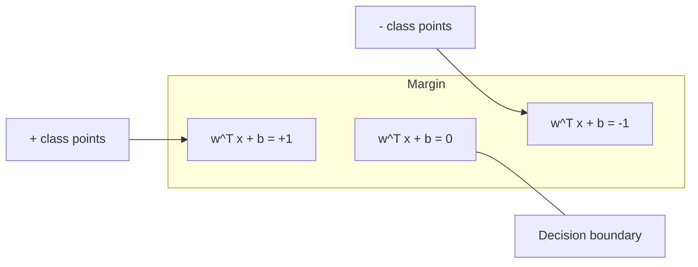
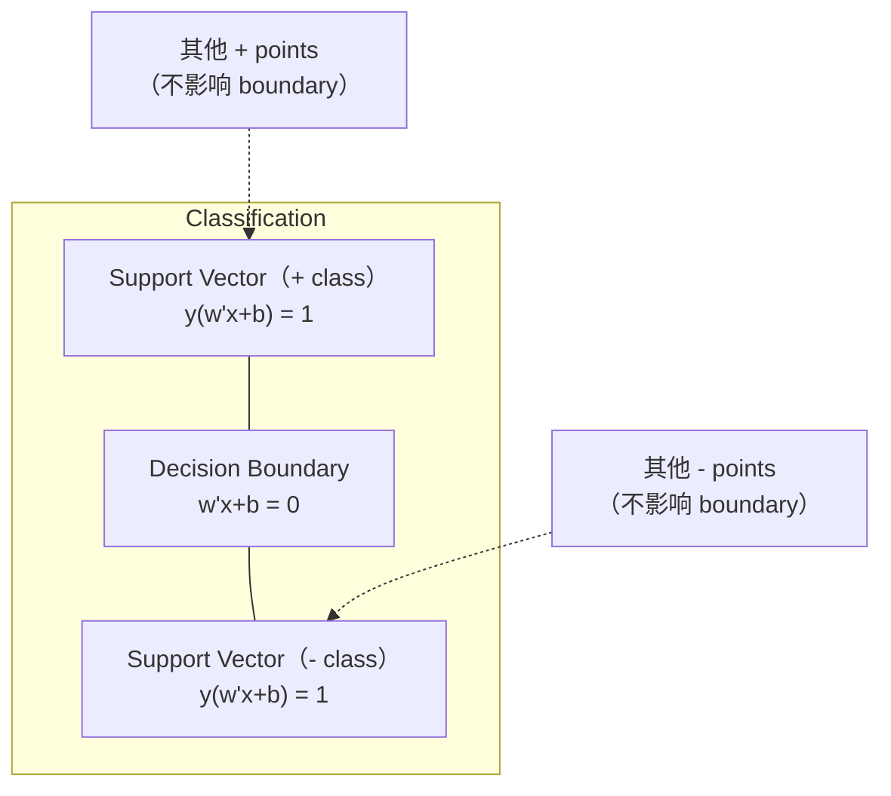
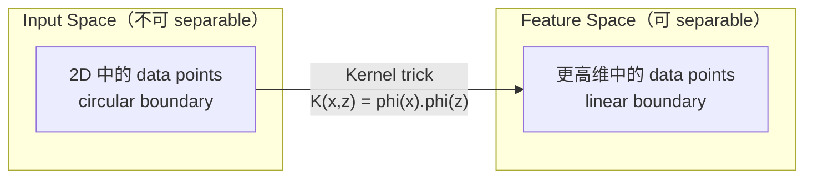

# समर्थन वेक्टर मशीनें

> दो वर्गों के बीच सबसे चौड़ी सड़कें मिलें।

**Type:** Build
**Language:**पायथन
**先修要求：**चरण 1 ((पाठ 08 अनुकूलन, 14 मानदंड और दूरी, 18 घुमावदार अनुकूलन)
**Time:** ~90 分钟

## 学习目标
- उपयोग hinge हानि 和 प्राथमिक सूत्र ऊपर की ग्रेडिएंट अवतरण, शून्य से एक रैखिक SVM को प्राप्त करने के लिए
- 解释 अधिकतम मार्जिन सिद्धांत,并从训练好的模型中识别支持向量
- रैखिक, बहुपद और आरबीएफ कर्नेल की तुलना करें, और कर्नेल ट्रिक को समझाएं
-  मूल्यांकन द्वारा C पैरामीटर  नियंत्रण की मार्जिन चौड़ाई और वर्गीकरण त्रुटियों  के बीच वजन

## 问题
आप दो प्रकार के डेटा बिंदु हैं, एक सीधी रेखा या हाइपरप्लेन (एक रेखा या हाइपरप्लेन) को खींचने की आवश्यकता है।

选择边界 最大的那一条──边界是决策边界与两侧最近数据点之间的距离──较宽的边界意味着分类者更有信心,并且能更好地概括到未见数据──

इस धारणा ने सपोर्ट वेक्टर मशीनों को जन्म दिया, यह एमएल मध्य गणित में सबसे उत्कृष्ट एल्गोरिदम में से एक है। डीप लर्निंग से पहले एसवीएम प्रमुख वर्गीकरण विधि थे, और छोटे डेटा संग्रह में, उच्च डेटा, और सिद्धांतों की आवश्यकता में, पूरी तरह से समझ में, सिद्धांत के साथ मॉडल की समस्या में, अभी भी सबसे अच्छा विकल्प है।

एसवीएम सीधे कनेक्ट चरण 1: अनुकूलन संकुचित है का (Lection 18) , मार्जिन उपयोग मानदंडों से आयाम (Lection 14)), जबकि कर्नेल ट्रिक उपयोग बिंदु उत्पादों, में वास्तव में गणना उच्च अंतरिक्ष के मामले में संसाधित करने के लिए गैर-रेखीय सीमाओं।

## 概念
### अधिकतम间隔 वर्गीकरण

给定 给定 y_i में {-1, +1} 和 feature vectors x_i के रैखिक रूप से अलग करने योग्य डेटा, हम एक हाइपरप्लेन w^T x + b = 0 को खोजने की उम्मीद करते हैं 来分离类别。

हाइपरप्लेन से दूरीः

```
distance = |w^T x_i + b| / ||w||
```

对于正确分类的点:y_i * (w^T x_i + b) > 0── मार्जिन हाइपरप्लेन से लेकर किसी भी ओर निकटतम बिंदु की दूरी के दो गुना है──



अनुकूलन समस्याः

```
maximize    2 / ||w||     (margin width)
subject to  y_i * (w^T x_i + b) >= 1  for all i
```

等地(कम से कम कीमतें और अधिक से अधिक समय में अनुकूलित करने के लिए आसान):

```
minimize    (1/2) ||w||^2
subject to  y_i * (w^T x_i + b) >= 1  for all i
```

यह एक संकुचित चतुर्भुज कार्यक्रम है। इसका एकमात्र वैश्विक समाधान है। यह सही है कि यह मार्जिन सीमाओं के ऊपर स्थित है। इसमें y_i * (w^T x_i + b) = 1) समर्थन वेक्टर हैं। ये एकमात्र निर्णय सीमा के बिंदु हैं।

### समर्थन वेक्टर:关键的少数点



अधिकांश प्रशिक्षण बिंदुओं में कोई संबंध नहीं है। केवल समर्थन वेक्टर महत्वपूर्ण हैं। यही कारण है कि भविष्यवाणी समय में एसवीएम मेमोरी-कुशल हैंः आपको केवल समर्थन वेक्टरों को संग्रहीत करने की आवश्यकता है, न कि पूरे प्रशिक्षण सेट को।

समर्थन वेक्टरों की संख्या ने भी सामान्यीकरण त्रुटि की सीमा दी है।

### नरम सीमाः C पैरामीटर का प्रयोग करें 处理噪声

वास्तविक डेटा बहुत कम ही पूरी तरह से अलग किया जा सकता है। कुछ बिंदु सीमा के गलत पक्ष में या सीमा के अंदर स्थित हो सकते हैं।

```
minimize    (1/2) ||w||^2 + C * sum(xi_i)
subject to  y_i * (w^T x_i + b) >= 1 - xi_i
            xi_i >= 0  for all i
```

slack variable xi_i 衡量点 i 违反差距 的程度──C 控制 इस तरह के व्यापार-बंद:

| C value | Behavior |
|---------|----------|
| Large C | 对 violations 施加重罚。margin 窄，misclassifications 更少。Overfits |
| Small C | 允许更多 violations。margin 宽，misclassifications 更多。Underfits |

C है नियमन शक्ति 的倒数── बड़ी C = 更少 नियमन── छोटी C = 更多 नियमन──

### झिल्ली हानि:SVM का हानि कार्य

सॉफ्ट मार्जिन SVM को अनलिमिटेड अनुकूलन के लिए पुनः लिखा जा सकता हैः

```
minimize    (1/2) ||w||^2 + C * sum(max(0, 1 - y_i * (w^T x_i + b)))
```

项 max(0, 1 - y_i * f(x_i)) यानि hinge loss──当点被正确分类且位于边缘 之外时,它为零──当点位于边缘 内部或被错误分类时,它是线性的──

```
单个点的 Hinge loss：

loss
  |
  | \
  |  \
  |   \
  |    \
  |     \_______________
  |
  +-----|-----|-------->  y * f(x)
       0     1

当 y*f(x) >= 1 时为 zero loss（正确分类，位于 margin 外）。
当 y*f(x) < 1 时为 linear penalty。
```

लॉजिस्टिक हानि (लॉजिस्टिक रिग्रेशन)

```
Hinge:     max(0, 1 - y*f(x))          在 margin 处 hard cutoff
Logistic:  log(1 + exp(-y*f(x)))        平滑，永远不会精确为零
```

हिंग हानि  दुर्लभ समाधान उत्पन्न करना  केवल समर्थन वेक्टर हैं 有非零贡献) ・ लॉजिक हानि सभी डेटा बिंदुओं का उपयोग करना  यह एसवीएम को भविष्यवाणी समय में अधिक स्मृति-कुशल बनाता है

### उपयोग ग्रेडिएंट अवतरण  प्रशिक्षण रैखिक एसवीएम

आप लिंकेज हानि के साथ L2 नियमितता ऊपर की ग्रेडिएंट अवतरण का उपयोग कर सकते हैं रैखिक SVM को प्रशिक्षित करने के लिए, बिना किसी आवश्यकता के लिए पूछने के लिए बाध्य QP:

```
L(w, b) = (lambda/2) * ||w||^2 + (1/n) * sum(max(0, 1 - y_i * (w^T x_i + b)))

关于 w 的 Gradient：
  If y_i * (w^T x_i + b) >= 1:  dL/dw = lambda * w
  If y_i * (w^T x_i + b) < 1:   dL/dw = lambda * w - y_i * x_i

关于 b 的 Gradient：
  If y_i * (w^T x_i + b) >= 1:  dL/db = 0
  If y_i * (w^T x_i + b) < 1:   dL/db = -y_i
```

इसे प्राथमिक सूत्र कहा जाता है। प्रत्येक युग का समय O (n * d) के लिए होता है, जिसमें n नमूने की संख्या है, d (विशेषताओं की संख्या है) ।

### दोहरे सूत्र और कर्नेल ट्रिक

SVM समस्या का लैग्रेंजियन ड्यूल (Fase 1 Lesson 18,KKT conditions) से आया है):

```
maximize    sum(alpha_i) - (1/2) * sum_ij(alpha_i * alpha_j * y_i * y_j * (x_i . x_j))
subject to  0 <= alpha_i <= C
            sum(alpha_i * y_i) = 0
```

यह महत्वपूर्ण है कि कुंजी के साथ प्रत्येक बिंदु उत्पाद को प्रतिस्थापित करें, एसवीएम गैर-रैखिक सीमाओं को सीख सकता है, और स्पष्ट रूप से गणना परिवर्तन की आवश्यकता नहीं है।

```
Linear kernel:      K(x, z) = x . z
Polynomial kernel:  K(x, z) = (x . z + c)^d
RBF (Gaussian):     K(x, z) = exp(-gamma * ||x - z||^2)
```

आरबीएफ कर्नेल डेटा को अंतहीन आयामी अंतरिक्ष में मैगरेट करेगा। इनपुट अंतरिक्ष में निकटतम बिंदु, इसके कर्नेल मान 1 के करीब है।



कर्नेल ट्रिक में उच्चतम अंतरिक्ष में प्रवेश न करने के मामले में, गणना उच्चतम अंतरिक्ष में बिंदु उत्पाद में।

### प्रतिगमन के लिए एसवीएम (एसवीआर)

समर्थन वेक्टर प्रतिगमन एक इप्सिलन ट्यूब के लिए एक चौड़ाई के लिए उपयुक्त डेटा के आसपास होगा।

```
minimize    (1/2) ||w||^2 + C * sum(xi_i + xi_i*)
subject to  y_i - (w^T x_i + b) <= epsilon + xi_i
            (w^T x_i + b) - y_i <= epsilon + xi_i*
            xi_i, xi_i* >= 0
```

epsilon पैरामीटर 控制管宽──tube 越宽 = समर्थन वेक्टर 越少 = फिट 更平滑──tube 越窄 = समर्थन वेक्टर 越多 = फिट 更紧──

### क्यों एसवीएम 输给了深度学习 (Deep Learning) और वे कब और क्यों जीते हैं?

1990 के दशक के अंत से 2010 के दशक की शुरुआत तक एसवीएम ने एमएल को प्रमुख बनाया। कई कारणों से डीप लर्निंग ने उन्हें पार कर लियाः

| Factor | SVMs | Deep learning |
|--------|------|---------------|
| Feature engineering | 需要它 | 学习 features |
| Scalability | kernel 为 O(n^2) 到 O(n^3) | 使用 SGD 时每个 epoch 为 O(n) |
| Image/text/audio | 需要 handcrafted features | 从 raw data 学习 |
| Large datasets (>100k) | 慢 | 扩展良好 |
| GPU acceleration | 收益有限 | 巨大加速 |

इन परिदृश्यों में एसवीएम अभी भी जीतते हैंः
- छोटे डेटा सेट ((100 से कम हजारों नमूने)
- 高维 दुर्लभ डेटा (TF-IDF सुविधाओं के साथ)
- जब आप आवश्यक गणित गारंटी ((मार्जिन सीमाओं)
- 当 प्रशिक्षण समय 必须最小化(रेखीय एसवीएम 非常快)
- 具有清晰 मार्जिन संरचना की द्विआधारी वर्गीकरण
- विसंगति का पता लगाना (एक वर्ग का एसवीएम)


```figure
svm-margin
```

##  इसे निर्माण
### 步骤 1: झिल्ली हानि और ग्रेडिएंट

基础―― गणना एक बैच के शिंज हानि  और उसके ग्रेडिएंट――

```python
def hinge_loss(X, y, w, b):
    n = len(X)
    total_loss = 0.0
    for i in range(n):
        margin = y[i] * (dot(w, X[i]) + b)
        total_loss += max(0.0, 1.0 - margin)
    return total_loss / n
```

### 步骤 2: ग्रेडिएंट अवतरण के माध्यम से रैखिक एसवीएम

️️️️️️️️️️️️️️️️️️️️️️️️️️️️️️️️️️️️️️️️️️️️️️️️️️️️️️️️️️️️️️️️️️️️️️️️️️️️️️️️️️️️️️️️️️️️️️️️️️️️️️️️️️️️️️️️️️️️️️️️️️️️️️️️️️️️️️️️️️️️️️️️️️️️️️️️️️️️️️️️️️️️️️️️️️️️️️️️️️️️️️️️️️️️️️️️️️️️️️️️️️️️️️️️️️️️️️️️️️️️️️️️️️️️️️️️️️️️️️️️️️️️️️️️️️️️️️️️️️️️️️️️️️️️️️️️️️️️️️️️️️️️️️️️️️️️️️️️️️️️️️️️️️️️️️️️️️️️️️️️️️️️️️️️️️️️️️️️️️️️️️️️️️️️️️️️️️️️️️️️️️️️️️️️️️️️️️️️️️️️️️️️️️️️️️️️️️️️️️️️️️️️️️️️️️️️️️️️️️️️️️️️️️️️️️️️️️️️️️️️️️️️️️️️️️️️️️️️️️️️️️️️️️️️️️️️️️️️️️️️️️️️️️️️️️️️️️️️️️️️️️️️️️️️

```python
class LinearSVM:
    def __init__(self, lr=0.001, lambda_param=0.01, n_epochs=1000):
        self.lr = lr
        self.lambda_param = lambda_param
        self.n_epochs = n_epochs
        self.w = None
        self.b = 0.0

    def fit(self, X, y):
        n_features = len(X[0])
        self.w = [0.0] * n_features
        self.b = 0.0

        for epoch in range(self.n_epochs):
            for i in range(len(X)):
                margin = y[i] * (dot(self.w, X[i]) + self.b)
                if margin >= 1:
                    self.w = [wj - self.lr * self.lambda_param * wj
                              for wj in self.w]
                else:
                    self.w = [wj - self.lr * (self.lambda_param * wj - y[i] * X[i][j])
                              for j, wj in enumerate(self.w)]
                    self.b -= self.lr * (-y[i])

    def predict(self, X):
        return [1 if dot(self.w, x) + self.b >= 0 else -1 for x in X]
```

### 步骤 3: कर्नेल कार्य

实现 रैखिक、बहुपद 和 RBF कर्नेल。

```python
def linear_kernel(x, z):
    return dot(x, z)

def polynomial_kernel(x, z, degree=3, c=1.0):
    return (dot(x, z) + c) ** degree

def rbf_kernel(x, z, gamma=0.5):
    diff = [xi - zi for xi, zi in zip(x, z)]
    return math.exp(-gamma * dot(diff, diff))
```

### 步骤 4: मार्जिन और समर्थन वेक्टर पहचान

训练后, पहचान哪些点是支持向量,并计算边界宽度──

```python
def find_support_vectors(X, y, w, b, tol=1e-3):
    support_vectors = []
    for i in range(len(X)):
        margin = y[i] * (dot(w, X[i]) + b)
        if abs(margin - 1.0) < tol:
            support_vectors.append(i)
    return support_vectors
```

完整实现和所有示范 见 `code/svm.py`

## इसका उपयोग करें
प्रयोग स्किट-लर्नः

```python
from sklearn.svm import SVC, LinearSVC, SVR
from sklearn.preprocessing import StandardScaler
from sklearn.pipeline import Pipeline

clf = Pipeline([
    ("scaler", StandardScaler()),
    ("svm", SVC(kernel="rbf", C=1.0, gamma="scale")),
])
clf.fit(X_train, y_train)
print(f"Accuracy: {clf.score(X_test, y_test):.4f}")
print(f"Support vectors: {clf['svm'].n_support_}")
```

重要: प्रशिक्षण SVM 之前始终要规模你的特征──SVMs feature magnitudes 敏感, क्योंकि मार्जिन  निर्भर करता है कि क्या होता है, जबकि स्केल के बिना विशेषताएं 扭曲几何结构──

对于大数据集,使用 `LinearSVC`(प्राथमिक सूत्र, प्रत्येक युग 为 O  n)) बजाय `SVC`(दोहरी सूत्र,O(n^2) तक O(n^3)):

```python
from sklearn.svm import LinearSVC

clf = Pipeline([
    ("scaler", StandardScaler()),
    ("svm", LinearSVC(C=1.0, max_iter=10000)),
])
```

## अभ्यास
1. 生成一 2D रैखिक रूप से पृथक् डेटासेट──训练你的线性SVM,并识别支持向量──验证支持向量是最接近决策界的点──

2. एक शोर डेटासेट में 上将 C 0.001 से 1000 变化──为每 C मूल्य 绘制决策界限──观察从宽边缘(不适合) 到狭边缘(过) 的过渡──

3. 创建一个类界限 为圆形(非线性) 的数据集──展示线性SVM 会失败──计算RBF内核矩阵,并展示类别在内核诱导功能空间中变得分离性──

4. एक ही डेटासेट में ऊपर की तुलना में लचीलापन हानि के साथ तार्किक हानि। एक रैखिक एसवीएम और तार्किक regression को प्रशिक्षित करें।

5. 实现 SVR(इप्सिलन-असंवेदनशील हानि) ――将它拟合到 y = sin(x) + noise──绘制预测 周围的इप्सिलन ट्यूब,并突出显示支持向量(tube 外的点)。

## 关键术语
| Term | What it actually means |
|------|----------------------|
| Support vectors | 最接近 decision boundary 的 training points。唯一决定 hyperplane 的点 |
| Margin | decision boundary 与最近 support vectors 之间的距离。SVMs 会最大化它 |
| Hinge loss | max(0, 1 - y*f(x))。正确分类且位于 margin 外时为零。否则为 linear penalty |
| C parameter | margin width 与 classification errors 之间的 trade-off。Large C = narrow margin，small C = wide margin |
| Soft margin | 通过 slack variables 允许 margin violations 的 SVM formulation。处理 non-separable data |
| Kernel trick | 在不显式映射到高维 feature space 的情况下，计算该空间中的 dot products |
| Linear kernel | K(x, z) = x . z。等价于标准 dot product。用于 linearly separable data |
| RBF kernel | K(x, z) = exp(-gamma * \|\|x-z\|\|^2)。映射到 infinite dimensions。学习任意 smooth boundary |
| Polynomial kernel | K(x, z) = (x . z + c)^d。映射到 polynomial combinations 的 feature space |
| Dual formulation | SVM problem 的重写形式，只依赖数据点之间的 dot products。支持 kernels |
| SVR | Support Vector Regression。围绕数据拟合 epsilon-tube。tube 内的点具有 zero loss |
| Slack variables | xi_i：衡量一个点违反 margin 的程度。正确分类且位于 margin 外的点为零 |
| Maximum margin | 选择能够最大化到每个类别最近点距离的 hyperplane 的原则 |

## 延伸阅读
- [Vapnik: The Nature of Statistical Learning Theory (1995)](https://link.springer.com/book/10.1007/978-1-4757-3264-1)- 关于SVM तथा सांख्यिकीय शिक्षा का आधारभूत ग्रंथ
- [Cortes & Vapnik: Support-vector networks (1995)](https://link.springer.com/article/10.1007/BF00994018)- मूल एसवीएम पेपर
- [Platt: Sequential Minimal Optimization (1998)](https://www.microsoft.com/en-us/research/publication/sequential-minimal-optimization-a-fast-algorithm-for-training-support-vector-machines/)- एसवीएम प्रशिक्षण  व्यावहारिक एसएमओ एल्गोरिथ्म बनें
- [scikit-learn SVM documentation](https://scikit-learn.org/stable/modules/svm.html)- 包含 कार्यान्वयन की विस्तृत जानकारी
- [LIBSVM: A Library for Support Vector Machines](https://www.csie.ntu.edu.tw/~cjlin/libsvm/)- अधिकांश एसवीएम कार्यान्वयन  के पीछे सी ++ पुस्तकालय
