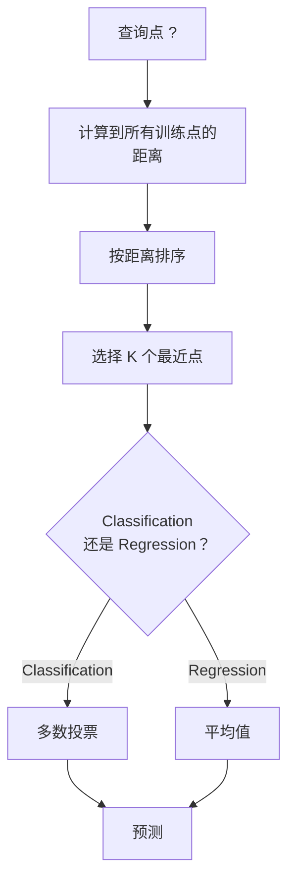
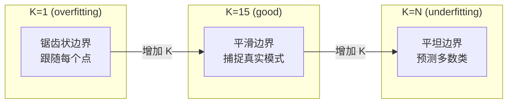
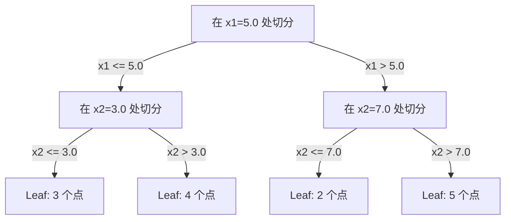

# K- निकटतम पड़ोसी और दूरी

> 保存一切──通过查看你的邻居来预测── यह सबसे सरल और वास्तव में प्रभावी एल्गोरिथ्म है──

**Type:** Build
**Language:**पायथन
**前置要求：**चरण 1 (पाठ 14 नियम और दूरी)
**Time:** ~90 分钟

## 学习目标
- शून्य से प्राप्त करने के लिए KNN वर्गीकरण और प्रतिगमन, समर्थित के लिए विनियमन और मतदान के अधिकार
- तुलना करें L1、L2、कोसाइन 和 मिन्कोव्स्की  दूरी माप, और एक विशिष्ट डेटा प्रकार के लिए उपयुक्त माप चुनें
- 解释维度灾难,并演示为什么KNN在高维空间中会退化
-  निर्माण KD-tree उच्च दक्षता प्राप्त करने के लिए निकटतम पड़ोसी खोज,并分析 यह कैसे brute-force से बेहतर है

## 问题
आपके पास एक डेटा सेट है। एक नया डेटा बिंदु आ गया है। आपको इसके लिए वर्गीकरण या इसका मूल्य भविष्यवाणी करने की आवश्यकता है। इसके साथ डेटा से सीखने के तत्वों के साथ, जैसे रैखिक प्रतिगमन या एसवीएम, आपको केवल नए बिंदु से निकटतम के प्रशिक्षण बिंदुओं को खोजने की आवश्यकता है, और उन्हें मतदान करने दें।

यह K- निकटतम पड़ोसी है। इसमें कोई प्रशिक्षण चरण नहीं है। इसमें कोई सीखने की आवश्यकता नहीं है। इसमें कोई न्यूनतम हानि फ़ंक्शन नहीं है।

यह सरल लगता है, लेकिन कई मुद्दों पर, विशेष रूप से मध्यम और छोटे डेटासेट पर, KNN प्रतिस्पर्धी है। गहन समझ में यह कुछ बुनियादी अवधारणाओं को प्रकट करेगाः दूरी की मात्रा का चयन करना (भाग 1 पाठ 14) ̊ परिमाण की आपदा, और आलसी सीखने और उत्सुक सीखने के बीच अंतर।

KNN भी आधुनिक AI के विभिन्न स्थानों पर विभिन्न नामों से दिखाई देता है। वेक्टर डेटाबेस एम्बेडिंग्स में मौजूद हैं।

## 概念
### KNN कैसे काम करता है

एक टैगिंग बिंदु के साथ डेटा संग्रह और एक नया पूछताछ बिंदु निर्धारित करेंः

1.  गणना क्वेरी बिंदु से डेटा केंद्र प्रत्येक बिंदु की दूरी
2. 按距离排序
3. 取最近的 K 个点
4. 对于分类: K 个邻居中进行多数投票
5. 对于回归:对 K 个邻居的值取平均 (K 个邻居的值取平均)



यह पूर्ण एल्गोरिथ्म है। कोई अनुक्रम नहीं है। कोई ग्रेडिएंट वंश नहीं है। कोई युग नहीं है।

### K चुनना

K एकमात्र हाइपरपरमैटर है। यह पूर्वाग्रह-वियरिएंस ट्रेडऑफ को नियंत्रित करता हैः

| K | 行为 |
|---|----------|
| K = 1 | 决策边界跟随每一个点。训练误差为零。高方差。Overfits |
| Small K (3-5) | 对局部结构敏感。可以捕捉复杂边界 |
| Large K | 边界更平滑。对噪声更稳健。可能 underfit |
| K = N | 对每个点都预测多数类。最大 bias |

常见起点是对包含 N 个点的数据集使用 K = sqrt(N)。二分类时使用奇数 K,以避免平票──



### दूरी की माप

距离函数 ने परिभाषित किया है क्या 近──不同度量会产生不同的邻居、不同的预测──

**L2 (Euclidean)**                                                                                                                                                                                                                                                              

```
d(a, b) = sqrt(sum((a_i - b_i)^2))
```

विशेषताओं के लिए संवेदनशील। L2 और KNN का उपयोग करना।

**L1 (Manhattan)**L2 से अधिक अपवादों का प्रतिरोध कर सकता है, क्योंकि यह अंतर के वर्ग मूल्य के प्रति नहीं होगा।

```
d(a, b) = sum(|a_i - b_i|)
```

**Cosine distance**衡量 भेक्टर 之间角,忽略大小──文本和嵌入数据至关重要──

```
d(a, b) = 1 - (a . b) / (||a|| * ||b||)
```

**Minkowski**प्रयोग पैरामीटर p 泛化 L1 和 L2──

```
d(a, b) = (sum(|a_i - b_i|^p))^(1/p)

p=1: Manhattan
p=2: Euclidean
p->inf: Chebyshev (max absolute difference)
```

उपयोग किस प्रकार के माप पर निर्भर करता हैः

| 数据类型 | 最佳度量 | 原因 |
|-----------|------------|-----|
| 数值特征，尺度相近 | L2 (Euclidean) | 默认选择，适用于空间数据 |
| 数值特征，存在 outliers | L1 (Manhattan) | 稳健，不会放大大差异 |
| Text embeddings | Cosine | 大小是噪声，方向是含义 |
| 高维稀疏 | Cosine 或 L1 | L2 受维度灾难影响严重 |
| 混合类型 | Custom distance | 按特征类型组合度量 |

### भारित KNN

标准 KNN सभी K  पड़ोसी ों को समान अधिकार देता है  लेकिन 0.1 के पड़ोसी ों की दूरी 5.0 के पड़ोसी ों की तुलना में अधिक महत्वपूर्ण 

**Distance-weighted KNN**फ़रम के अनुसार प्रति पड़ोसी के लिए 倒数加权:

```
weight_i = 1 / (distance_i + epsilon)

For classification: weighted vote
For regression:     weighted average = sum(w_i * y_i) / sum(w_i)
```

जब जांच बिंदु प्रशिक्षण बिंदु के साथ पूरी तरह से मेल खाती है, तो एपिसिजन शून्य से अलग होने से बचा सकता है।

भारित KNN K के चयन के प्रति संवेदनशील नहीं है, क्योंकि दूर के पड़ोसियों का योगदान कितना भी हो, वे बहुत छोटे हैं।

### 维度灾难

KNN प्रदर्शन में उच्च स्तर पर गिरावट आएगी। यह एक अस्पष्ट चिंता नहीं है, बल्कि एक गणितीय तथ्य है।

**问题 1：距离会收敛。** आयाम बढ़ने के साथ, अधिकतम दूरी और न्यूनतम दूरी के अनुपात 1 के करीब आते हैं सभी बिंदु प्रश्न बिंदुओं के समान दूर होते हैं

```
In d dimensions, for random uniform points:

d=2:    max_dist / min_dist = varies widely
d=100:  max_dist / min_dist ~ 1.01
d=1000: max_dist / min_dist ~ 1.001

When all distances are nearly equal, "nearest" is meaningless.
```

**问题 2：体积会爆炸。**डेटा के एक निश्चित अनुपात में K  पड़ोसियों को पकड़ने के लिए, आपको खोज अर्धव्यास को बढ़ाने की आवश्यकता है, ताकि यह सुविधाओं के विशाल भाग को कवर कर सके।

**问题 3：角落占主导。**d 维单位超立方体 में, अधिकांश体积集中在角落附近,中心 के बजाय।

实际后果:केएनएन में लगभग 20-50 个特征内表现良好―― इस सीमा से परे, आपको केएनएन के अनुप्रयोग में आयामों में कमी करने की आवश्यकता है (PCA,UMAP,t-SNE), या निम्न संरचनाओं में डेटा का उपयोग करने योग्य पेड़ आधारित खोज संरचनाओं का उपयोग करना होगा―

### KD-tree:快速 निकटतम पड़ोसी 搜索

क्रूर-बल केएनएन प्रत्येक प्रशिक्षण बिंदु की दूरी तक प्रश्न बिंदु की गणना करेगा। प्रत्येक प्रश्न की जटिलता O (n * d) है।

केडी-tree 会沿征轴递归划分空间── प्रत्येक परत में, यह एक आयाम के अनुसार मध्यबिज के अनुसार काटने के लिए किया जाता है──



 निकटतम पड़ोसी को खोजने के लिए, पहले पेड़ में से एक में खोज बिंदुओं के साथ एक पत्ती को देखें, फिर वापस जाएं, और केवल निकटतम क्षेत्र में अधिक निकटतम बिंदुओं को शामिल करने के लिए उन्हें देखें।

平均查询时间:低维时为O(लॉग n) ・・・ लेकिन KD-tree 在高维(d > 20) will退化为O(n), चूंकि वापस溯能排除的分支越来越少──

### गेंद के पेड़: 更适合中等维度

गेंद के पेड़ डेटा को एक बैच के सुपरबॉल बॉडी में विभाजित करेंगे, बजाय एक बॉक्स के जोड़े के। प्रत्येक बिंदु एक गेंद को परिभाषित करता है।

KD-tree के मुकाबले का लाभः
- मध्यम स्तर पर प्रदर्शन बेहतर है (~ 50 प्रतिशत)
- 能处理非轴对齐结构
- अधिक निकट सीमा का मतलब है कि खोज के दौरान अधिक शाखाओं को काट सकते हैं

KD-tree और ball trees होते हैं सटीक एल्गोरिथ्म। वास्तविक बड़े पैमाने पर खोज के लिए, लगभग निकटतम पड़ोसी के तरीके का उपयोग किया जाएगा।

### आलसी सीखने बनाम उत्सुक सीखने

KNN आलसी छात्र हैः प्रशिक्षण समय काम नहीं करता है, सभी काम पूर्वानुमान के दौरान पूरा होते हैं। अधिकांश अन्य एल्गोरिदम (रैखिक रेग्रिशन, एसवीएम, तंत्रिका नेटवर्क) उत्सुक छात्र हैंः वे प्रशिक्षण के दौरान भारी मात्रा में गणना करते हैं ताकि वे एक तंग मॉडल का निर्माण कर सकें, फिर पूर्वानुमान जल्दी कर सकें।

| 方面 | Lazy (KNN) | Eager (SVM, neural net) |
|--------|------------|------------------------|
| 训练时间 | O(1)，只存储数据 | O(n * epochs) |
| 预测时间 | 每次查询 O(n * d) | O(d) 或 O(parameters) |
| 预测时内存 | 存储整个训练集 | 只存储模型参数 |
| 适应新数据 | 立即添加点 | 重新训练模型 |
| 决策边界 | 隐式，在运行时计算 | 显式，训练后固定 |

आलसी सीखना 适合以下场景:
- संख्यात्मक परिवर्तन (अवश्यकता नहीं)
- केवल बहुत कम पूछताछ की आवश्यकता है पूर्वानुमान
- तुम चाहते हो प्रशिक्षण समय शून्य के लिए
- पर्याप्त छोटे, क्रूर बल खोज  शीघ्र

### प्रतिगमन के लिए KNN

केएनएन रिग्रेशन ने बहुमत मत नहीं दिया बल्कि केएन के पड़ोसियों के लिए लक्ष्य मूल्य प्राप्त किया।

```
prediction = (1/K) * sum(y_i for i in K nearest neighbors)

Or with distance weighting:
prediction = sum(w_i * y_i) / sum(w_i)
where w_i = 1 / distance_i
```

KNN रिग्रेशन 产生分段常数预测(使用加权时为分段平滑) ⋅ यह प्रशिक्षण डेटा के दायरे से बाहर नहीं किया जा सकता है ⋅ यदि प्रशिक्षण लक्ष्य 0 से 100 के बीच है, तो KNN 永远不会预测 200 ⋅


```figure
knn-smoothness
```

##  इसे निर्माण
### 步骤 1: दूरी फ़ंक्शन

 L1、L2、कोसाइन 和 मिन्कोव्स्की 距离── ये सामग्री सीधे से कनेक्ट है चरण 1 पाठ 14──

```python
import math

def l2_distance(a, b):
    return math.sqrt(sum((ai - bi) ** 2 for ai, bi in zip(a, b)))

def l1_distance(a, b):
    return sum(abs(ai - bi) for ai, bi in zip(a, b))

def cosine_distance(a, b):
    dot_val = sum(ai * bi for ai, bi in zip(a, b))
    norm_a = math.sqrt(sum(ai ** 2 for ai in a))
    norm_b = math.sqrt(sum(bi ** 2 for bi in b))
    if norm_a == 0 or norm_b == 0:
        return 1.0
    return 1.0 - dot_val / (norm_a * norm_b)

def minkowski_distance(a, b, p=2):
    if p == float('inf'):
        return max(abs(ai - bi) for ai, bi in zip(a, b))
    return sum(abs(ai - bi) ** p for ai, bi in zip(a, b)) ** (1 / p)
```

### 步骤 2: KNN वर्गीकरण और रेग्रेसर

 पूर्ण KNN का निर्माण, समर्थित विन्यास योग्य K  दूरी माप तथा चयनित दूरी वृद्धि क्षमता

```python
class KNN:
    def __init__(self, k=5, distance_fn=l2_distance, weighted=False,
                 task="classification"):
        self.k = k
        self.distance_fn = distance_fn
        self.weighted = weighted
        self.task = task
        self.X_train = None
        self.y_train = None

    def fit(self, X, y):
        self.X_train = X
        self.y_train = y

    def predict(self, X):
        return [self._predict_one(x) for x in X]
```

### 步骤 3: कुशल खोज के लिए KD-tree

शून्य से निर्माण केडी-वृक्ष, प्रत्येक आयाम के मध्यबिंदु में क्रमशः

```python
class KDTree:
    def __init__(self, X, indices=None, depth=0):
        # Recursively partition the data
        self.axis = depth % len(X[0])
        # Split on median of the current axis
        ...

    def query(self, point, k=1):
        # Traverse to leaf, then backtrack
        ...
```

完整实现见 `code/knn.py`, जिसमें सभी सहायक विधि एवं प्रदर्शन शामिल हैं।

### 步骤 4: विशेषता स्केलिंग

केएनएन को सुविधाओं को स्केलिंग की आवश्यकता होती है, क्योंकि विशेषता के लिए दूरी 0 से 1000 तक की विशेषताओं के लिए एक मूल्य सीमा है।

```python
def standardize(X):
    n = len(X)
    d = len(X[0])
    means = [sum(X[i][j] for i in range(n)) / n for j in range(d)]
    stds = [
        max(1e-10, (sum((X[i][j] - means[j]) ** 2 for i in range(n)) / n) ** 0.5)
        for j in range(d)
    ]
    return [[((X[i][j] - means[j]) / stds[j]) for j in range(d)] for i in range(n)], means, stds
```

## इसका उपयोग करें
प्रयोग स्किट-लर्नः

```python
from sklearn.neighbors import KNeighborsClassifier
from sklearn.preprocessing import StandardScaler
from sklearn.pipeline import Pipeline

clf = Pipeline([
    ("scaler", StandardScaler()),
    ("knn", KNeighborsClassifier(n_neighbors=5, metric="euclidean")),
])
clf.fit(X_train, y_train)
print(f"Accuracy: {clf.score(X_test, y_test):.4f}")
```

जब डेटाबेस पर्याप्त बड़ा और आयाम पर्याप्त कम हो जाता है, तो स्किट-लर्न स्वचालित रूप से केडी-ट्री या बॉल ट्री का उपयोग करेगा।`algorithm`参数 नियंत्रण यह बिंदु है

 बड़े पैमाने पर निकटतम पड़ोसी खोज के लिए ((数百万个矢量), FAISS、Annoy या वेक्टर डेटाबेस का उपयोग करेंः

```python
import faiss

index = faiss.IndexFlatL2(dimension)
index.add(embeddings)
distances, indices = index.search(query_vectors, k=5)
```

## अभ्यास
1. 3 श्रेणियों वाले 2D डेटासेट पर KNN वर्गीकरण को प्राप्त करना। K=1、K=5、K=15 तथा K=N के निर्णय सीमा को चित्रित करना।

2. 2、5、10、50、100 和 500 维中生成 1000 个随机点── प्रत्येक आयाम के लिए, अधिकतम जोड़ी दूरी और न्यूनतम जोड़ी दूरी के अनुपात का गणना करें── आकार के साथ परिवर्तन के साथ इस अनुपात का चित्रण करें, ताकि दृश्यमान आयाम आपदाओं को प्रदर्शित किया जा सके──

3. प्रलेख वर्गीकरण  प्रश्न पर KNN के L1、L2 तथा कॉसाइन दूरी की तुलना करें (TF-IDF वेक्टरों का उपयोग करके) ◊ किस प्रकार के माप से सर्वोत्तम सटीकता मिलती है?

4.  KD-tree को लागू करें, और 2D、10D और 50D में, 1k、10k और 100k बिंदुओं के डेटासेट को अलग-अलग मापें।

5. 为 y = sin(x) + शोर 构建一个重量KNregressor──将它与K=3、10、30 के unweighted KNN比较──展示加权会产生更平滑的预测,特别是K 较大时──

## 关键术语
| 术语 | 它实际意味着什么 |
|------|----------------------|
| K-nearest neighbors | 一种非参数算法，通过寻找距离查询点最近的 K 个训练点来预测 |
| Lazy learning | 训练时不进行计算。所有工作都发生在预测时。KNN 是典型例子 |
| Eager learning | 训练时进行大量计算以构建紧凑模型。大多数 ML 算法都是 eager |
| Curse of dimensionality | 在高维中，距离会收敛，neighborhoods 会扩展到覆盖空间的大部分，使 KNN 失效 |
| KD-tree | 沿特征轴递归划分空间的二叉树。在低维中查询为 O(log n) |
| Ball tree | 嵌套超球体构成的树。在中等维度（最高约 ~50）中比 KD-trees 表现更好 |
| Weighted KNN | neighbors 按距离倒数加权。更近的 neighbors 对预测影响更大 |
| Feature scaling | 将特征归一化到可比较范围。KNN 等基于距离的方法需要它 |
| Majority vote | 通过统计 K 个 neighbors 中哪个类别最常见来进行 Classification |
| Brute force search | 计算到每个训练点的距离。每次查询 O(n*d)。精确但在大 n 时很慢 |
| Approximate nearest neighbor | 能比精确搜索快得多地找到近似最近点的算法（HNSW、LSH、IVF） |
| Voronoi diagram | 一种空间划分，其中每个区域包含所有比任何其他训练点都更接近某个训练点的点。K=1 KNN 会产生 Voronoi 边界 |

## 延伸阅读
- [Cover & Hart: Nearest Neighbor Pattern Classification (1967)](https://ieeexplore.ieee.org/document/1053964)- 奠基性的 KNN 论文, साबित करने के लिए इसकी त्रुटि दर के लिए अधिकतम बेय के लिए दो गुना
- [Friedman, Bentley, Finkel: An Algorithm for Finding Best Matches in Logarithmic Expected Time (1977)](https://dl.acm.org/doi/10.1145/355744.355745)- 原始 KD-tree 论文
- [Beyer et al.: When Is "Nearest Neighbor" Meaningful? (1999)](https://link.springer.com/chapter/10.1007/3-540-49257-7_15)- निकटतम पड़ोसी 维度灾难的形式化分析
- [scikit-learn Nearest Neighbors documentation](https://scikit-learn.org/stable/modules/neighbors.html)- 包含算法选择的实践指南
- [FAISS: A Library for Efficient Similarity Search](https://github.com/facebookresearch/faiss)- मेटा उपयोग किया गया है अरबों के स्तर के निकटतम पड़ोसी की खोज के लिए अनुमानित भंडार
