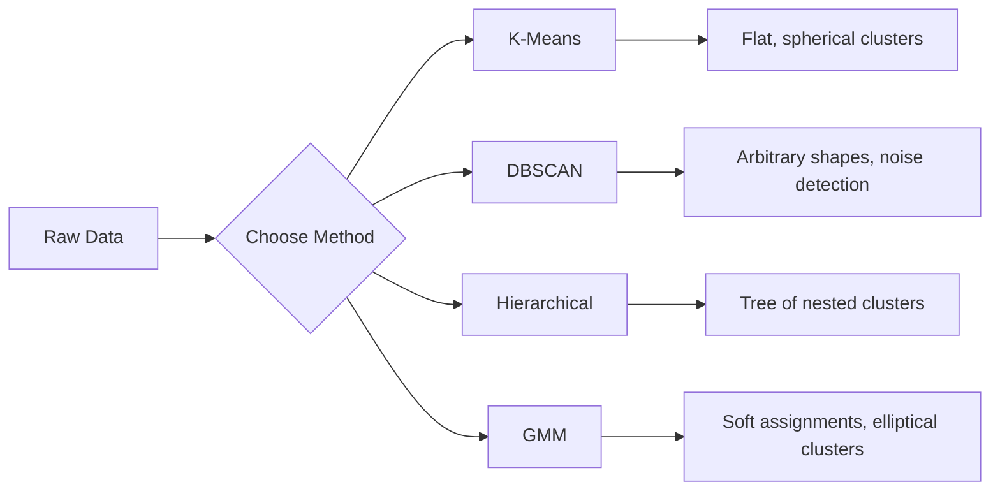

# बिना पर्यवेक्षण के सीखना

>  कोई टैग नहीं, कोई शिक्षक नहीं 

**类型:**构建
**语言:**पायथन
**前置条件:**चरण 1(नॉर्म्स एंड डिस्टेंस,संभाव्यता और वितरण)
**时间:**~ 90 मिनट

## 学习目标

- K-Means、DBSCAN तथा Gaussian Mix Models को प्राप्त करने से, और उनकी तुलना करने से
- प्रयोग सिल्हूट स्कोर 和 कोहनी विधि  मूल्यांकन क्लस्टर 质量,并选择最优 K
- 解释 DBSCAN 何时优于 K-Means,并识别哪种算法能处理非球形群和外形
- उपयोग क्लस्टरिंग विधि अप्रासंगिकता का पता लगाने के लिए पाइपलाइन का निर्माण, सामान्य मोड से विचलित बिंदुओं को चिह्नित करने के लिए

## 问题

अब तक, प्रत्येक अनुभाग में डेटा के साथ एक टैग है:  यह एक इनपुट है, यह एक सही आउटपुट है। वास्तविक दुनिया में, टैगिंग लागत बहुत अधिक है।

अनियंत्रित सीखने में ऐसी स्थिति होती है जब कोई व्यक्ति उसे नहीं बताता कि वह क्या खोजता है। यह समान डेटा बिंदुओं को विभाजित करता है, छिपे हुए संरचनाओं को ढूंढता है और विसंगतियों का खुलासा करता है। यदि अनियंत्रित सीखने में सामग्री से उत्तर के साथ सीखने की तरह होता है, तो अनियंत्रित सीखने में मूल डेटा को देखने की आवश्यकता होती है, जब तक कि मॉडल स्वयं प्रकट नहीं होता है।

 समस्या यह है कि कोई टैग नहीं है, आप सीधे सही या गलत माप नहीं कर सकते हैं। आपको एल्गोरिथ्म खोजने के लिए विभिन्न उपकरणों की आवश्यकता है।

## 核心概念

### समूहबद्ध करनाः एक साथ समान वस्तुओं को विभाजित करना

समूह बनाने से प्रत्येक डेटा बिंदु को एक समूह में विभाजित किया जाएगा, ताकि एक ही समूह के भीतर के बिंदु एक दूसरे के साथ अन्य समूह के बिंदुओं की तुलना में अधिक समान हों।



### K-Means: हमेशा इस्तेमाल मुख्य शक्ति विधि

K-Means 会把数据分分为恰好 K 个群── प्रत्येक समूह में एक केंद्र बिंदु होता है, प्रत्येक बिंदु निकटतम केंद्र बिंदु से संबंधित होता है──

लॉयड का एल्गोरिथ्म:

1. 随机选择 K 个点作为初始中心点
2. प्रत्येक डेटा बिंदु को निकटतम केंद्र बिंदु पर वितरित करें
3. प्रत्येक केंद्र बिंदु को पुनः गणना करने के लिए अपने वितरण बिंदु के औसत मूल्य
4. पुनः चरण 2-3, जब तक वितरण परिणाम नहीं बदलता

目标函数 (Inertia) प्रत्येक बिंदु को उसके संबंधित केंद्र बिंदु तक कुल वर्ग दूरी को मापता है।

### 选择 K

两种标准方法:

**Elbow method：**के लिए K = 1, 2, 3, ..., n 运行 K-Means── चित्रण गतिरोध के साथ K के संबंध चित्र── खोज ेलbow, यानि लगातार बढ़ते हुए क्लस्टर 时 गतिरोध 不再显著下降的位置──

**Silhouette score：**प्रत्येक बिंदु पर, इसे अपने समूह के समानता की डिग्री को मापें (a) अन्य समूहों के निकटतम समूहों के साथ तुलना में (b) कैसे---सिलुएट गुणांक 为 (b - a) / max (a, b) से लेकर -1 (分错) समूह तक +1 (分错) समूहों के बीच औसत प्राप्त करना है।

### DBSCAN: घनत्व आधारित क्लस्टरिंग

K-Means 假设群是球形的,并要求你先选择 K――DBSCAN इन दो假设ों को नहीं करता── यह समूह को दुर्लभ क्षेत्र से अलग 密区的密区 找 देगा।

两个参数:
- **eps**क्षेत्रफल
- **min_samples**密区形成 की आवश्यकता में न्यूनतम अंक संख्या

तीन वर्गः
- **Core point**: eps  दूरी                                                                                                                                                                                                                                                                                                                                                                                                                                                                                                                         
- **Border point**: किसी मूल बिंदु पर स्थित है, लेकिन स्वयं मूल बिंदु नहीं है
- **Noise point**न ही मूल बिंदु है, न ही सीमा बिंदु है।

डीबीएससीएएन एक दूसरे को ईपीएस के दायरे में स्थित कोर बिंदु  कनेक्ट एक ही क्लस्टर में शामिल करेगा।

优点:能发现任意形状的集群,自动确定集群数量,识别outlier──弱点:难以处理密度差异较大的集群──

### पदानुक्रमिक समूह

构建嵌套 क्लस्टर 的树(डेंडरोग्राम) 

संश्लेषणात्मक ((自底向上):
1. प्रत्येक बिंदु अपने स्वयं के समूह से शुरू होता है
2. 合并两个最近的集群
3. पुनः, जब तक केवल एक समूह शेष नहीं है
4. में अपेक्षित स्तर के स्तर से विभाजित डेंड्रोग्राम, प्राप्त K 个 क्लस्टर

क्लस्टर के बीच निकटता की डिग्री इस प्रकार मापी जा सकती हैः
- **Single linkage**: दो क्लस्टर के बीच किसी भी दो बिंदुओं के बीच न्यूनतम दूरी
- **Complete linkage**: arbitrary दो बिंदुओं के बीच अधिकतम दूरी
- **Average linkage**सभी बिंदुओं के बीच औसत दूरी
- **Ward's method**: समूह में कुल अंतर में न्यूनतम वृद्धि का कारण बनता है

### गौसी मिश्रण मॉडल (GMM)

K-Means 给出硬分配: प्रत्येक बिंदु ठीक से एक समूह का है.

जीएमएम 假设 डेटा K 个 गौशियन वितरण के मिश्रित उत्पादन से, प्रत्येक वितरण का अपना औसत मूल्य और सह-परिवर्तन है।

- **E-step**: गणना प्रत्येक बिंदु के लिए प्रत्येक गौशियन की संभावना
- **M-step**: अधिकतम डेटा संभावना के लिए प्रत्येक गौशियन का औसत मूल्य, सह-अंतर और मिश्रण वजन अद्यतन करें

जीएमएम एक गोल आकार के क्लस्टर का निर्माण कर सकता है, न कि केवल K-Means उस तरह के गोल आकार का), और प्राकृतिक रूप से ओवरलैप क्लस्टर को संसाधित कर सकता है।

### किस प्रकार का उपयोग करें

| Method | Best for | Avoid when |
|--------|----------|------------|
| K-Means | 大型数据集、球形 cluster、已知 K | 形状不规则、存在 outlier |
| DBSCAN | K 未知、任意形状、outlier detection | 密度差异大、维度非常高 |
| Hierarchical | 小型数据集、需要 dendrogram、K 未知 | 大型数据集（O(n^2) memory） |
| GMM | 重叠 cluster、需要软分配 | 非常大的数据集、维度过多 |

### उपयोग क्लस्टरिंग करें विसंगतियों का पता लगाने

संवर्धन 天然支持 विसंगतियों का पता लगानाः
- **K-Means**किसी भी केंद्र बिंदु से दूर है
- **DBSCAN**परिभाषा के अनुसार, शोर बिंदु है
- **GMM**सभी Gaussian में नीचे संभावना सभी बहुत कम है:


```figure
kmeans-step
```

##  इसे निर्माण

### 步骤 1: K-Means को प्राप्त करने से

```python
import math
import random


def euclidean_distance(a, b):
    return math.sqrt(sum((ai - bi) ** 2 for ai, bi in zip(a, b)))


def kmeans(data, k, max_iterations=100, seed=42):
    random.seed(seed)
    n_features = len(data[0])

    centroids = random.sample(data, k)

    for iteration in range(max_iterations):
        clusters = [[] for _ in range(k)]
        assignments = []

        for point in data:
            distances = [euclidean_distance(point, c) for c in centroids]
            nearest = distances.index(min(distances))
            clusters[nearest].append(point)
            assignments.append(nearest)

        new_centroids = []
        for cluster in clusters:
            if len(cluster) == 0:
                new_centroids.append(random.choice(data))
                continue
            centroid = [
                sum(point[j] for point in cluster) / len(cluster)
                for j in range(n_features)
            ]
            new_centroids.append(centroid)

        if all(
            euclidean_distance(old, new) < 1e-6
            for old, new in zip(centroids, new_centroids)
        ):
            print(f"  Converged at iteration {iteration + 1}")
            break

        centroids = new_centroids

    return assignments, centroids
```

### 步骤 2: एलबो विधि 和 सिल्हूट स्कोर

```python
def compute_inertia(data, assignments, centroids):
    total = 0.0
    for point, cluster_id in zip(data, assignments):
        total += euclidean_distance(point, centroids[cluster_id]) ** 2
    return total


def silhouette_score(data, assignments):
    n = len(data)
    if n < 2:
        return 0.0

    clusters = {}
    for i, c in enumerate(assignments):
        clusters.setdefault(c, []).append(i)

    if len(clusters) < 2:
        return 0.0

    scores = []
    for i in range(n):
        own_cluster = assignments[i]
        own_members = [j for j in clusters[own_cluster] if j != i]

        if len(own_members) == 0:
            scores.append(0.0)
            continue

        a = sum(euclidean_distance(data[i], data[j]) for j in own_members) / len(own_members)

        b = float("inf")
        for cluster_id, members in clusters.items():
            if cluster_id == own_cluster:
                continue
            avg_dist = sum(euclidean_distance(data[i], data[j]) for j in members) / len(members)
            b = min(b, avg_dist)

        if max(a, b) == 0:
            scores.append(0.0)
        else:
            scores.append((b - a) / max(a, b))

    return sum(scores) / len(scores)


def find_best_k(data, max_k=10):
    print("Elbow method:")
    inertias = []
    for k in range(1, max_k + 1):
        assignments, centroids = kmeans(data, k)
        inertia = compute_inertia(data, assignments, centroids)
        inertias.append(inertia)
        print(f"  K={k}: inertia={inertia:.2f}")

    print("\nSilhouette scores:")
    for k in range(2, max_k + 1):
        assignments, centroids = kmeans(data, k)
        score = silhouette_score(data, assignments)
        print(f"  K={k}: silhouette={score:.4f}")

    return inertias
```

### 步骤 3: डीबीएससीएएन को प्रारंभ से प्राप्त करना

```python
def dbscan(data, eps, min_samples):
    n = len(data)
    labels = [-1] * n
    cluster_id = 0

    def region_query(point_idx):
        neighbors = []
        for i in range(n):
            if euclidean_distance(data[point_idx], data[i]) <= eps:
                neighbors.append(i)
        return neighbors

    visited = [False] * n

    for i in range(n):
        if visited[i]:
            continue
        visited[i] = True

        neighbors = region_query(i)

        if len(neighbors) < min_samples:
            labels[i] = -1
            continue

        labels[i] = cluster_id
        seed_set = list(neighbors)
        seed_set.remove(i)

        j = 0
        while j < len(seed_set):
            q = seed_set[j]

            if not visited[q]:
                visited[q] = True
                q_neighbors = region_query(q)
                if len(q_neighbors) >= min_samples:
                    for nb in q_neighbors:
                        if nb not in seed_set:
                            seed_set.append(nb)

            if labels[q] == -1:
                labels[q] = cluster_id

            j += 1

        cluster_id += 1

    return labels
```

### 步骤 4:गॉसियन मिश्रण मॉडल(ईएम एल्गोरिथ्म)

```python
def gmm(data, k, max_iterations=100, seed=42):
    random.seed(seed)
    n = len(data)
    d = len(data[0])

    indices = random.sample(range(n), k)
    means = [list(data[i]) for i in indices]
    variances = [1.0] * k
    weights = [1.0 / k] * k

    def gaussian_pdf(x, mean, variance):
        d = len(x)
        coeff = 1.0 / ((2 * math.pi * variance) ** (d / 2))
        exponent = -sum((xi - mi) ** 2 for xi, mi in zip(x, mean)) / (2 * variance)
        return coeff * math.exp(max(exponent, -500))

    for iteration in range(max_iterations):
        responsibilities = []
        for i in range(n):
            probs = []
            for j in range(k):
                probs.append(weights[j] * gaussian_pdf(data[i], means[j], variances[j]))
            total = sum(probs)
            if total == 0:
                total = 1e-300
            responsibilities.append([p / total for p in probs])

        old_means = [list(m) for m in means]

        for j in range(k):
            r_sum = sum(responsibilities[i][j] for i in range(n))
            if r_sum < 1e-10:
                continue

            weights[j] = r_sum / n

            for dim in range(d):
                means[j][dim] = sum(
                    responsibilities[i][j] * data[i][dim] for i in range(n)
                ) / r_sum

            variances[j] = sum(
                responsibilities[i][j]
                * sum((data[i][dim] - means[j][dim]) ** 2 for dim in range(d))
                for i in range(n)
            ) / (r_sum * d)
            variances[j] = max(variances[j], 1e-6)

        shift = sum(
            euclidean_distance(old_means[j], means[j]) for j in range(k)
        )
        if shift < 1e-6:
            print(f"  GMM converged at iteration {iteration + 1}")
            break

    assignments = []
    for i in range(n):
        assignments.append(responsibilities[i].index(max(responsibilities[i])))

    return assignments, means, weights, responsibilities
```

### 步骤 5: परीक्षण डेटा उत्पन्न करें और सभी सामग्री का संचालन करें

```python
def make_blobs(centers, n_per_cluster=50, spread=0.5, seed=42):
    random.seed(seed)
    data = []
    true_labels = []
    for label, (cx, cy) in enumerate(centers):
        for _ in range(n_per_cluster):
            x = cx + random.gauss(0, spread)
            y = cy + random.gauss(0, spread)
            data.append([x, y])
            true_labels.append(label)
    return data, true_labels


def make_moons(n_samples=200, noise=0.1, seed=42):
    random.seed(seed)
    data = []
    labels = []
    n_half = n_samples // 2
    for i in range(n_half):
        angle = math.pi * i / n_half
        x = math.cos(angle) + random.gauss(0, noise)
        y = math.sin(angle) + random.gauss(0, noise)
        data.append([x, y])
        labels.append(0)
    for i in range(n_half):
        angle = math.pi * i / n_half
        x = 1 - math.cos(angle) + random.gauss(0, noise)
        y = 1 - math.sin(angle) - 0.5 + random.gauss(0, noise)
        data.append([x, y])
        labels.append(1)
    return data, labels


if __name__ == "__main__":
    centers = [[2, 2], [8, 3], [5, 8]]
    data, true_labels = make_blobs(centers, n_per_cluster=50, spread=0.8)

    print("=== K-Means on 3 blobs ===")
    assignments, centroids = kmeans(data, k=3)
    print(f"  Centroids: {[[round(c, 2) for c in cent] for cent in centroids]}")
    sil = silhouette_score(data, assignments)
    print(f"  Silhouette score: {sil:.4f}")

    print("\n=== Elbow Method ===")
    find_best_k(data, max_k=6)

    print("\n=== DBSCAN on 3 blobs ===")
    db_labels = dbscan(data, eps=1.5, min_samples=5)
    n_clusters = len(set(db_labels) - {-1})
    n_noise = db_labels.count(-1)
    print(f"  Found {n_clusters} clusters, {n_noise} noise points")

    print("\n=== GMM on 3 blobs ===")
    gmm_assignments, gmm_means, gmm_weights, _ = gmm(data, k=3)
    print(f"  Means: {[[round(m, 2) for m in mean] for mean in gmm_means]}")
    print(f"  Weights: {[round(w, 3) for w in gmm_weights]}")
    gmm_sil = silhouette_score(data, gmm_assignments)
    print(f"  Silhouette score: {gmm_sil:.4f}")

    print("\n=== DBSCAN on moons (non-spherical clusters) ===")
    moon_data, moon_labels = make_moons(n_samples=200, noise=0.1)
    moon_db = dbscan(moon_data, eps=0.3, min_samples=5)
    n_moon_clusters = len(set(moon_db) - {-1})
    n_moon_noise = moon_db.count(-1)
    print(f"  Found {n_moon_clusters} clusters, {n_moon_noise} noise points")

    print("\n=== K-Means on moons (will fail to separate) ===")
    moon_km, moon_centroids = kmeans(moon_data, k=2)
    moon_sil = silhouette_score(moon_data, moon_km)
    print(f"  Silhouette score: {moon_sil:.4f}")
    print("  K-Means splits moons poorly because they are not spherical")

    print("\n=== Anomaly detection with DBSCAN ===")
    anomaly_data = list(data)
    anomaly_data.append([20.0, 20.0])
    anomaly_data.append([-5.0, -5.0])
    anomaly_data.append([15.0, 0.0])
    anomaly_labels = dbscan(anomaly_data, eps=1.5, min_samples=5)
    anomalies = [
        anomaly_data[i]
        for i in range(len(anomaly_labels))
        if anomaly_labels[i] == -1
    ]
    print(f"  Detected {len(anomalies)} anomalies")
    for a in anomalies[-3:]:
        print(f"    Point {[round(v, 2) for v in a]}")
```

## इसका उपयोग करें

प्रयोग स्किट-लर्न, उसी तरह के एल्गोरिदम एक पंक्ति में किया जा सकता हैः

```python
from sklearn.cluster import KMeans, DBSCAN, AgglomerativeClustering
from sklearn.mixture import GaussianMixture
from sklearn.metrics import silhouette_score as sklearn_silhouette

km = KMeans(n_clusters=3, random_state=42).fit(data)
db = DBSCAN(eps=1.5, min_samples=5).fit(data)
agg = AgglomerativeClustering(n_clusters=3).fit(data)
gmm_model = GaussianMixture(n_components=3, random_state=42).fit(data)
```

️️️️️️️️️️️️️️️️️️️️️️️️️️️️️️️️️️️️️️️️️️️️️️️️️️️️️️️️️️️️️️️️️️️️️️️️️️️️️️️️️️️️️️️️️️️️️️️️️️️️️️️️️️️️️️️️️️️️️️️️️️️️️️️️️️️️️️️️️️️️️️️️️️️️️️️️️️️️️️️️️️️️️️️️️️️️️️️️️️️️️️️️️️️️️️️️️️️️️️️️️️️️️️️️️️️️️️️️️️️️️️️️️️️️️️️️️️️️️️️️️️️️️️️️️️️️️️️️️️️️️️️️️️️️️️️️️️️️️️️️️️️️️️️️️️️️️️️️️️️️️️️️️️️️️️️️️️️️️️️️️️️️️️️️️️️️️️️️️️️️️️️️️️️️️️️️️️️️️️️️️️️️️️️️️️️️️️️️️️️️️️️️️️️️️️️️️️️️️️️️️️️️️️️️️️️️️️️️️️️️️️️️️️️️️️️️️️️️️️️️️️️️️️️️️️️️️️️️️️️️️️️️️️️️️️️️️️️️️️️️️️️️️️️️️️️️️️️️️️️️️️️️️️️️

## 交付 यह

इस वर्ग का उत्पादन K-Means、DBSCAN और GMM के कार्यान्वयन से हुआ है।

## अभ्यास

1. 实现 K-Means++ प्रारंभिककरण: केंद्रस्थला को क्रमशः न चुनें, बल्कि पहले प्रथम केंद्रस्थला को क्रमशः चुनें, उसके बाद प्रत्येक केंद्रस्थला को निकटतम केंद्रस्थला के वर्ग दूरी के सही अनुपात की संभावना के साथ चुना जाता है।
2. 向代码中加入等级聚合集群化――实现 Ward's linkage,并生成dendrogram (जैसे संयुक्त रूप से संयुक्त रूप से निर्मित)――在不同层级分分它,并与K-Means 结果比较――
3.  एक सरल विसंगति पता लगाने पाइपलाइन का निर्माण करें: एक ही डेटा पर चल रहे DBSCAN और GMM, दो प्रकार के तरीकों को चिह्नित करना जो कि डीबीएससीएएन में शोर, GMM में कम संभावना वाले बिंदुओं में असामान्य बिंदु हैं) 

## 关键术语

| Term | What people say | What it actually means |
|------|----------------|----------------------|
| Clustering | “把相似的事物分组” | 将数据划分为若干子集，使组内相似度高于组间相似度，并由特定距离度量来衡量 |
| Centroid | “cluster 的中心” | 分配给某个 cluster 的所有点的均值；K-Means 将其用作 cluster 的代表 |
| Inertia | “cluster 有多紧凑” | 每个点到其所属 centroid 的平方距离之和；越低表示越紧凑 |
| Silhouette score | “cluster 分离得有多好” | 对每个点计算 (b - a) / max(a, b)，其中 a 是平均 cluster 内距离，b 是最近 cluster 的平均距离 |
| Core point | “稠密区域中的点” | 在 DBSCAN 中，eps 距离内至少有 min_samples 个邻居的点 |
| EM algorithm | “软 K-Means” | Expectation-Maximization：迭代计算成员概率（E-step）并更新 distribution 参数（M-step） |
| Dendrogram | “cluster 的树” | 一种树状图，展示 hierarchical clustering 中 cluster 被合并的顺序以及合并时的距离 |
| Anomaly | “一个 outlier” | 不符合预期模式的数据点，在 DBSCAN 中被识别为 noise，或在 GMM 中被识别为低概率点 |

## 延伸阅读

- [Stanford CS229 - Unsupervised Learning](https://cs229.stanford.edu/notes2022fall/main_notes.pdf)- एंड्रयू एन  के बारे में Clustering और EM के व्याख्यान नोट्स
- [scikit-learn Clustering Guide](https://scikit-learn.org/stable/modules/clustering.html)- सभी क्लस्टरिंग एल्गोरिदम की व्यावहारिक तुलना में, दृश्यमान उदाहरणों के साथ
- [DBSCAN original paper (Ester et al., 1996)](https://www.aaai.org/Papers/KDD/1996/KDD96-037.pdf)- घनत्व आधारित क्लस्टरिंग का प्रस्तावित किया गया
