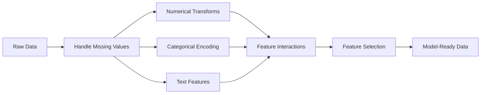

# विशेषता इंजीनियरिंग और चयन

> एक अच्छा सुविधा ₹1000 डेटा पॉइंट्स तक पहुंच गया

**Type:** Build
**Languages:** Python
**Prerequisites:** Phase 1（Statistics for ML、Linear Algebra）、Phase 2 Lessons 1-7
**Time:** ~90 分钟

## 学习目标

- 实现数值变换(मानकीकरण、 मिन-मैक्स स्केलिंग、लॉग परिवर्तन、बिनिंग),并解释每种方法适用场景
-  श्रेणीगत विशेषताएँ  एक-उष्ण  लेबल तथा लक्ष्य एन्कोडिंग का निर्माण,并识别 लक्ष्य एन्कोडिंग 风险
- से零 निर्माण एक TF-IDF वेक्टरराइज़र,并解释为什么它在文本分类中优于原始词频
- 应用 आधारित फ़िल्टर की विशेषता चयन (अनुरूपता सीमा, संबद्धता, पारस्परिक जानकारी)

## 问题

आप एक डेटा सेट है। आप एक एल्गोरिथ्म चुना है। आप इसे प्रशिक्षित किया है। परिणाम सामान्य है। आप एक अधिक जटिल एल्गोरिथ्म की कोशिश करते हैं। परिणाम अभी भी सामान्य है। आप एक सप्ताह के लिए हाइपरपरपैरामीटर को समायोजित किया है। केवल सीमांत उन्नयन है।

फिर किसी ने मूल डेटा को बेहतर सुविधा में बदल दिया, एक सरल लॉजिस्टिक रिग्रेशन ने आपको एक अच्छा ग्रेडिएंट-बढ़ता हुआ एसेम्बल को हरा दिया।

यह स्थिति अक्सर होती है। क्लासिक एमएल में, डेटा का प्रतिनिधित्व करने का तरीका एल्गोरिथ्म से अधिक महत्वपूर्ण है। एक जिसमें क्वायर फुटेज और कमरे के  के  के  के  के  के  के  के  के  के  के  के  के  के  के  के  के  के  के  के  के  के  के  के  के  के  के  के  के  के  के  के  के  के  के  के  के  के  के  के  के  के  के  के  के  के  के  के  के  के  के  के  के  के  के  के  के  के  के  के  के  के  के  के  के  के  के  के  के  के  के  के  के  के  के  के  के  के  के  के  के  के  के  के  के  के  के  के  के  के  के  के  के  के  के  के  के  के  के  के  के  के  के  के  के  के  के  के  के  के  के  के  के  के  के  के  के  के  के  के  के  के  के  के  के  के  के  के  के  के  के  के  के  के  के  के  के  के  के  के  के  के  के  के  के  के  के  के  के  के  के  के  के  के  के 

फीचर इंजीनियरिंग मूल डेटा को प्रदर्शित प्रारूप में परिवर्तित करने की प्रक्रिया है, जिससे मॉडल को मॉडल को ढूंढना आसान हो जाए। फीचर चयन उन फीचर की प्रक्रिया को छोड़ देता है जो केवल शोर बढ़ाते हैं और संकेत नहीं बढ़ाते हैं।

## 概念

### विशेषता पाइपलाइन



### संख्या मूल्य विशेषता

मूल संख्या बहुत कम सीधे मॉडल में उपयोग की जा सकती है।

**Scaling：**√√√√√√√√√√√√√√√√√√√√√√√√√√√√√√√√√√√√√√√√√√√√√√√√√√√√√√√√√√√√√√√√√√√√√√√√√√√√√√√√√√√√√√√√√√√√√√√√√√√√√√√√√√√√√√√√√√√√√√√√√√√√√√√√√√√√√√√√√√√√√√√√√√√√√√√√√√√√√√√√√√√√√√√√√√√√√√√√√√√√√√√√√√√√√√√√√√√√√√√√√√√√√√√√√√√√√√√√√√√√√√√√√√√√√√√√√√√√√√√√√√√√√√√√√√√√√√√√√√√√√√√√√√√√√√√√√√√√√√√√√√√√√√√√√√√√√√√√√√√√√√√√√√√√√√√√√√√√√√√√√√√√√√√√√√√√√√√√√√√√√√√√√√√√√√√√√√√√√√√√√√√√√√√√√√√√√√√√√√√√√√√√√√√√√√√√√√√√√√√√√√√√√√√√√√√√√√√√√√√√√√√√√√√√√√√√√√√√√√√√√√√√√√√√√√√√√√√√√√√√√√√√√√√√√√√√√√√√√√√√√√√√√√√√√√√√√√√√√√√√√√√√√√√√√

**Log transform：**压缩右偏分布(收入、人口、词频) 把乘法关系转换为加法关系

**Binning：**⇒ ⇒ ⇒ ⇒ ⇒ ⇒ ⇒ ⇒ ⇒ ⇒ ⇒ ⇒ ⇒ ⇒ ⇒ ⇒ ⇒ ⇒ ⇒ ⇒ ⇒ ⇒ ⇒ ⇒ ⇒ ⇒ ⇒ ⇒ ⇒ ⇒ ⇒ ⇒ ⇒ ⇒ ⇒ ⇒ ⇒ ⇒ ⇒ ⇒ ⇒ ⇒ ⇒ ⇒ ⇒ ⇒ ⇒ ⇒ ⇒ ⇒ ⇒ ⇒ ⇒ ⇒ ⇒ ⇒ ⇒ ⇒ ⇒ ⇒ ⇒ ⇒ ⇒ ⇒ ⇒ ⇒ ⇒ ⇒ ⇒ ⇒ ⇒ ⇒ ⇒ ⇒ ⇒ ⇒ ⇒ ⇒ ⇒ ⇒ ⇒ ⇒ ⇒ ⇒ ⇒ ⇒ ⇒ ⇒ ⇒ ⇒ ⇒ ⇒ ⇒ ⇒ ⇒ ⇒ ⇒ ⇒ ⇒ ⇒ ⇒ ⇒ ⇒ ⇒ ⇒ ⇒ ⇒ ⇒ ⇒ ⇒ ⇒ ⇒ ⇒ ⇒ ⇒ ⇒ ⇒ ⇒ ⇒ ⇒ ⇒ ⇒ ⇒ ⇒ ⇒ ⇒ ⇒ ⇒ ⇒ ⇒ ⇒ ⇒ ⇒ ⇒ ⇒ ⇒ ⇒ ⇒ ⇒ ⇒ ⇒ ⇒ ⇒ ⇒ ⇒ ⇒ ⇒ ⇒ ⇒ ⇒ ⇒ ⇒ ⇒ ⇒ ⇒ ⇒ ⇒ ⇒ ⇒ ⇒ ⇒ ⇒ ⇒ ⇒  ⇒       ⇒     ⇒                                                                                                                                                                     

**Polynomial features：**创建 x^2、x^3、x1*x2 项──让线性模型能够捕获非线性关系,代价是产生更多特征──

### श्रेणीगत विशेषताएं

模型需要数字──类别需要编码──

**One-hot encoding：**प्रत्येक श्रेणी के लिए एक दोआधारीकरण श्रेणी बनाएं।

**Label encoding：**प्रत्येक वर्ग को एक पूर्णांक में चित्रित करेंः लाल=0、नीला=1、ग्रीन=2── यह गलत क्रमबद्ध संबंध को पेश करेगा।

**Target encoding：**इस श्रेणी के लिए लक्ष्य चर के औसत मूल्य प्रतिस्थापन प्रत्येक श्रेणी में बहुत मजबूत है, लेकिन यह भी बहुत खतरनाक हैः डेटा रिसाव बहुत उच्च है।

### 文本 विशेषता

**Count vectorizer：**统计每个词在文档中出现的次数──猫坐在床上会变成 {the: 2, cat: 1, sat: 1, on: 1, mat: 1}──

**TF-IDF：**शब्द आवृत्ति-उपवर्ती दस्तावेज़ आवृत्ति── शब्द में दस्तावेजों के बीच की विशिष्टता के आधार पर शब्द के अतिरिक्त अधिकार── जैसे the इस तरह के सामान्य शब्द के वजन कम── दुर्लभ एवं विभेदित शब्द के वजन उच्च──

```
TF(word, doc) = count(word in doc) / total words in doc
IDF(word) = log(total docs / docs containing word)
TF-IDF = TF * IDF
```

### 缺失值

वास्तविक डेटा में रिक्त स्थान होंगे।

- **Drop rows：** केवल जब डेटा कम और समय के साथ उपयोग
- **Mean/median imputation：**简单,并保持分布形形(मध्यस्थ से बाहर के लिए 更稳健)
- **Mode imputation：**उपयोग करने के लिए श्रेणीगत विशेषताएं
- **Indicator column：**यह_यह_मिसिंग── डेटा की कमी का तथ्य स्वयं में सूचनात्मक मात्रा हो सकता है
- **Forward/backward fill：**समय क्रम डेटा के लिए उपयोग किया

### विशेषता बातचीत

️️️️️️️️️️️️️️️️️️️️️️️️️️️️️️️️️️️️️️️️️️️️️️️️️️️️️️️️️️️️️️️️️️️️️️️️️️️️️️️️️️️️️️️️️️️️️️️️️️️️️️️️️️️️️️️️️️️️️️️️️️️️️️️️️️️️️️️️️️️️️️️️️️️️️️️️️️️️️️️️️️️️️️️️️️️️️️️️

### विशेषता चयन

सुविधा 越多 हमेशा 越好不──无关 सुविधा                                                                                                                                                                                                                                                         

**Filter methods（pre-model）：**
- संबद्धताः स्थानांतरण एक दूसरे से अत्यधिक संबंधित विशेषता ((冗余)
- पारस्परिक सूचनाः किसी विशेषताओं को जानने का माप  लक्ष्य के अनिश्चितता के बारे में कितना कम कर सकता है
- भिन्नता सीमाः लगभग अपरिवर्तित सुविधा

**Wrapper methods（model-based）：**
- L1 नियमितीकरण(लसो):把无关 फीचर का权重推推到精确为零
- पुनरावर्ती विशेषता समाप्ति: प्रशिक्षण 移除最不重要 विशेषता 重复

**为什么 selection 重要：**एक 10 अच्छे फीचर का मॉडल, आमतौर पर एक 10 अच्छे फीचर के साथ जीतता है 90 शोर फीचर का मॉडल।


```figure
feature-scaling
```

##  इसे निर्माण

### 步骤 1: शून्य से वास्तविकता में संख्यात्मक मूल्य परिवर्तन

```python
import math


def min_max_scale(values):
    min_val = min(values)
    max_val = max(values)
    if max_val == min_val:
        return [0.0] * len(values)
    return [(v - min_val) / (max_val - min_val) for v in values]


def standardize(values):
    n = len(values)
    mean = sum(values) / n
    variance = sum((v - mean) ** 2 for v in values) / n
    std = math.sqrt(variance) if variance > 0 else 1.0
    return [(v - mean) / std for v in values]


def log_transform(values):
    return [math.log(v + 1) for v in values]


def bin_values(values, n_bins=5):
    min_val = min(values)
    max_val = max(values)
    bin_width = (max_val - min_val) / n_bins
    if bin_width == 0:
        return [0] * len(values)
    result = []
    for v in values:
        bin_idx = int((v - min_val) / bin_width)
        bin_idx = min(bin_idx, n_bins - 1)
        result.append(bin_idx)
    return result


def polynomial_features(row, degree=2):
    n = len(row)
    result = list(row)
    if degree >= 2:
        for i in range(n):
            result.append(row[i] ** 2)
        for i in range(n):
            for j in range(i + 1, n):
                result.append(row[i] * row[j])
    return result
```

### 步骤 2: शून्य से श्रेणीबद्ध एन्कोडिंग को प्राप्त करें

```python
def one_hot_encode(values):
    categories = sorted(set(values))
    cat_to_idx = {cat: i for i, cat in enumerate(categories)}
    n_cats = len(categories)

    encoded = []
    for v in values:
        row = [0] * n_cats
        row[cat_to_idx[v]] = 1
        encoded.append(row)

    return encoded, categories


def label_encode(values):
    categories = sorted(set(values))
    cat_to_int = {cat: i for i, cat in enumerate(categories)}
    return [cat_to_int[v] for v in values], cat_to_int


def target_encode(feature_values, target_values, smoothing=10):
    global_mean = sum(target_values) / len(target_values)

    category_stats = {}
    for feat, target in zip(feature_values, target_values):
        if feat not in category_stats:
            category_stats[feat] = {"sum": 0.0, "count": 0}
        category_stats[feat]["sum"] += target
        category_stats[feat]["count"] += 1

    encoding = {}
    for cat, stats in category_stats.items():
        cat_mean = stats["sum"] / stats["count"]
        weight = stats["count"] / (stats["count"] + smoothing)
        encoding[cat] = weight * cat_mean + (1 - weight) * global_mean

    return [encoding[v] for v in feature_values], encoding
```

### 步骤 3: से शून्य को प्राप्त करें

```python
def count_vectorize(documents):
    vocab = {}
    idx = 0
    for doc in documents:
        for word in doc.lower().split():
            if word not in vocab:
                vocab[word] = idx
                idx += 1

    vectors = []
    for doc in documents:
        vec = [0] * len(vocab)
        for word in doc.lower().split():
            vec[vocab[word]] += 1
        vectors.append(vec)

    return vectors, vocab


def tfidf(documents):
    n_docs = len(documents)

    vocab = {}
    idx = 0
    for doc in documents:
        for word in doc.lower().split():
            if word not in vocab:
                vocab[word] = idx
                idx += 1

    doc_freq = {}
    for doc in documents:
        seen = set()
        for word in doc.lower().split():
            if word not in seen:
                doc_freq[word] = doc_freq.get(word, 0) + 1
                seen.add(word)

    vectors = []
    for doc in documents:
        words = doc.lower().split()
        word_count = len(words)
        tf_map = {}
        for word in words:
            tf_map[word] = tf_map.get(word, 0) + 1

        vec = [0.0] * len(vocab)
        for word, count in tf_map.items():
            tf = count / word_count
            idf = math.log(n_docs / doc_freq[word])
            vec[vocab[word]] = tf * idf
        vectors.append(vec)

    return vectors, vocab
```

### 步骤 4: शून्य से निष्पादन अभाव मूल्य निर्धारण

```python
def impute_mean(values):
    present = [v for v in values if v is not None]
    if not present:
        return [0.0] * len(values), 0.0
    mean = sum(present) / len(present)
    return [v if v is not None else mean for v in values], mean


def impute_median(values):
    present = sorted(v for v in values if v is not None)
    if not present:
        return [0.0] * len(values), 0.0
    n = len(present)
    if n % 2 == 0:
        median = (present[n // 2 - 1] + present[n // 2]) / 2
    else:
        median = present[n // 2]
    return [v if v is not None else median for v in values], median


def impute_mode(values):
    present = [v for v in values if v is not None]
    if not present:
        return values, None
    counts = {}
    for v in present:
        counts[v] = counts.get(v, 0) + 1
    mode = max(counts, key=counts.get)
    return [v if v is not None else mode for v in values], mode


def add_missing_indicator(values):
    return [0 if v is not None else 1 for v in values]
```

### 步骤 5: शून्य से कार्यान्वयन सुविधा चयन

```python
def correlation(x, y):
    n = len(x)
    mean_x = sum(x) / n
    mean_y = sum(y) / n
    cov = sum((xi - mean_x) * (yi - mean_y) for xi, yi in zip(x, y)) / n
    std_x = math.sqrt(sum((xi - mean_x) ** 2 for xi in x) / n)
    std_y = math.sqrt(sum((yi - mean_y) ** 2 for yi in y) / n)
    if std_x == 0 or std_y == 0:
        return 0.0
    return cov / (std_x * std_y)


def mutual_information(feature, target, n_bins=10):
    feat_min = min(feature)
    feat_max = max(feature)
    bin_width = (feat_max - feat_min) / n_bins if feat_max != feat_min else 1.0
    feat_binned = [
        min(int((f - feat_min) / bin_width), n_bins - 1) for f in feature
    ]

    n = len(feature)
    target_classes = sorted(set(target))

    feat_bins = sorted(set(feat_binned))
    p_feat = {}
    for b in feat_bins:
        p_feat[b] = feat_binned.count(b) / n

    p_target = {}
    for t in target_classes:
        p_target[t] = target.count(t) / n

    mi = 0.0
    for b in feat_bins:
        for t in target_classes:
            joint_count = sum(
                1 for fb, tv in zip(feat_binned, target) if fb == b and tv == t
            )
            p_joint = joint_count / n
            if p_joint > 0:
                mi += p_joint * math.log(p_joint / (p_feat[b] * p_target[t]))

    return mi


def variance_threshold(features, threshold=0.01):
    n_features = len(features[0])
    n_samples = len(features)
    selected = []

    for j in range(n_features):
        col = [features[i][j] for i in range(n_samples)]
        mean = sum(col) / n_samples
        var = sum((v - mean) ** 2 for v in col) / n_samples
        if var >= threshold:
            selected.append(j)

    return selected


def remove_correlated(features, threshold=0.9):
    n_features = len(features[0])
    n_samples = len(features)

    to_remove = set()
    for i in range(n_features):
        if i in to_remove:
            continue
        col_i = [features[r][i] for r in range(n_samples)]
        for j in range(i + 1, n_features):
            if j in to_remove:
                continue
            col_j = [features[r][j] for r in range(n_samples)]
            corr = abs(correlation(col_i, col_j))
            if corr >= threshold:
                to_remove.add(j)

    return [i for i in range(n_features) if i not in to_remove]
```

### 步骤 6: पूर्ण पाइपलाइन व डेमो

```python
import random


def make_housing_data(n=200, seed=42):
    random.seed(seed)
    data = []
    for _ in range(n):
        sqft = random.uniform(500, 5000)
        bedrooms = random.choice([1, 2, 3, 4, 5])
        age = random.uniform(0, 50)
        neighborhood = random.choice(["downtown", "suburbs", "rural"])
        has_pool = random.choice([True, False])

        sqft_with_missing = sqft if random.random() > 0.05 else None
        age_with_missing = age if random.random() > 0.08 else None

        price = (
            50 * sqft
            + 20000 * bedrooms
            - 1000 * age
            + (50000 if neighborhood == "downtown" else 10000 if neighborhood == "suburbs" else 0)
            + (15000 if has_pool else 0)
            + random.gauss(0, 20000)
        )

        data.append({
            "sqft": sqft_with_missing,
            "bedrooms": bedrooms,
            "age": age_with_missing,
            "neighborhood": neighborhood,
            "has_pool": has_pool,
            "price": price,
        })
    return data


if __name__ == "__main__":
    data = make_housing_data(200)

    print("=== Raw Data Sample ===")
    for row in data[:3]:
        print(f"  {row}")

    sqft_raw = [d["sqft"] for d in data]
    age_raw = [d["age"] for d in data]
    prices = [d["price"] for d in data]

    print("\n=== Missing Value Handling ===")
    sqft_missing = sum(1 for v in sqft_raw if v is None)
    age_missing = sum(1 for v in age_raw if v is None)
    print(f"  sqft missing: {sqft_missing}/{len(sqft_raw)}")
    print(f"  age missing: {age_missing}/{len(age_raw)}")

    sqft_indicator = add_missing_indicator(sqft_raw)
    age_indicator = add_missing_indicator(age_raw)
    sqft_imputed, sqft_fill = impute_median(sqft_raw)
    age_imputed, age_fill = impute_mean(age_raw)
    print(f"  sqft filled with median: {sqft_fill:.0f}")
    print(f"  age filled with mean: {age_fill:.1f}")

    print("\n=== Numerical Transforms ===")
    sqft_scaled = standardize(sqft_imputed)
    age_scaled = min_max_scale(age_imputed)
    sqft_log = log_transform(sqft_imputed)
    age_binned = bin_values(age_imputed, n_bins=5)
    print(f"  sqft standardized: mean={sum(sqft_scaled)/len(sqft_scaled):.4f}, std={math.sqrt(sum(v**2 for v in sqft_scaled)/len(sqft_scaled)):.4f}")
    print(f"  age min-max: [{min(age_scaled):.2f}, {max(age_scaled):.2f}]")
    print(f"  age bins: {sorted(set(age_binned))}")

    print("\n=== Categorical Encoding ===")
    neighborhoods = [d["neighborhood"] for d in data]

    ohe, ohe_cats = one_hot_encode(neighborhoods)
    print(f"  One-hot categories: {ohe_cats}")
    print(f"  Sample encoding: {neighborhoods[0]} -> {ohe[0]}")

    le, le_map = label_encode(neighborhoods)
    print(f"  Label encoding map: {le_map}")

    te, te_map = target_encode(neighborhoods, prices, smoothing=10)
    print(f"  Target encoding: {({k: round(v) for k, v in te_map.items()})}")

    print("\n=== Text Features ===")
    descriptions = [
        "large modern house with pool",
        "small cozy cottage near downtown",
        "spacious family home with large yard",
        "modern apartment downtown with view",
        "rustic cabin in rural area",
    ]
    cv, cv_vocab = count_vectorize(descriptions)
    print(f"  Vocabulary size: {len(cv_vocab)}")
    print(f"  Doc 0 non-zero features: {sum(1 for v in cv[0] if v > 0)}")

    tf, tf_vocab = tfidf(descriptions)
    print(f"  TF-IDF vocabulary size: {len(tf_vocab)}")
    top_words = sorted(tf_vocab.keys(), key=lambda w: tf[0][tf_vocab[w]], reverse=True)[:3]
    print(f"  Doc 0 top TF-IDF words: {top_words}")

    print("\n=== Polynomial Features ===")
    sample_row = [sqft_scaled[0], age_scaled[0]]
    poly = polynomial_features(sample_row, degree=2)
    print(f"  Input: {[round(v, 4) for v in sample_row]}")
    print(f"  Polynomial: {[round(v, 4) for v in poly]}")
    print(f"  Features: [x1, x2, x1^2, x2^2, x1*x2]")

    print("\n=== Feature Selection ===")
    feature_matrix = [
        [sqft_scaled[i], age_scaled[i], float(sqft_indicator[i]), float(age_indicator[i])]
        + ohe[i]
        for i in range(len(data))
    ]

    print(f"  Total features: {len(feature_matrix[0])}")

    surviving_var = variance_threshold(feature_matrix, threshold=0.01)
    print(f"  After variance threshold (0.01): {len(surviving_var)} features kept")

    surviving_corr = remove_correlated(feature_matrix, threshold=0.9)
    print(f"  After correlation filter (0.9): {len(surviving_corr)} features kept")

    binary_prices = [1 if p > sum(prices) / len(prices) else 0 for p in prices]
    print("\n  Mutual information with target:")
    feature_names = ["sqft", "age", "sqft_missing", "age_missing"] + [f"neigh_{c}" for c in ohe_cats]
    for j in range(len(feature_matrix[0])):
        col = [feature_matrix[i][j] for i in range(len(feature_matrix))]
        mi = mutual_information(col, binary_prices, n_bins=10)
        print(f"    {feature_names[j]}: MI={mi:.4f}")

    print("\n  Correlation with price:")
    for j in range(len(feature_matrix[0])):
        col = [feature_matrix[i][j] for i in range(len(feature_matrix))]
        corr = correlation(col, prices)
        print(f"    {feature_names[j]}: r={corr:.4f}")
```

## इसका उपयोग करें

इन परिवर्तनों का उपयोग करके पाइपलाइनों का निर्माण किया जा सकता हैः

```python
from sklearn.preprocessing import StandardScaler, OneHotEncoder, PolynomialFeatures
from sklearn.impute import SimpleImputer
from sklearn.feature_extraction.text import TfidfVectorizer
from sklearn.feature_selection import mutual_info_classif, VarianceThreshold
from sklearn.compose import ColumnTransformer
from sklearn.pipeline import Pipeline

numeric_pipe = Pipeline([
    ("imputer", SimpleImputer(strategy="median")),
    ("scaler", StandardScaler()),
])

categorical_pipe = Pipeline([
    ("encoder", OneHotEncoder(sparse_output=False)),
])

preprocessor = ColumnTransformer([
    ("num", numeric_pipe, ["sqft", "age"]),
    ("cat", categorical_pipe, ["neighborhood"]),
])
```

शून्य से प्राप्त संस्करण प्रत्येक परिवर्तन को प्रदर्शित करता है  आंतरिक रूप से क्या हुआ है ;; पुस्तकालय संस्करण सीमा स्थिति प्रसंस्करण ∞ स्पेस मैट्रिक्स  समर्थन और पाइपलाइन  संयोजन को बढ़ाता है, लेकिन गणित सिद्धांत एक ही है ∞

## 交付 यह

本课会产出:
- `outputs/prompt-feature-engineer.md`- एक मूल डेटा प्रणाली डिजाइन सुविधा से उपयोग किया जाता है

## अभ्यास

1. ⇒ ⇒ ⇒ ⇒ ⇒ ⇒ ⇒ ⇒ ⇒ ⇒ ⇒ ⇒ ⇒ ⇒ ⇒ ⇒ ⇒ ⇒ ⇒ ⇒ ⇒ ⇒ ⇒ ⇒ ⇒ ⇒ ⇒ ⇒ ⇒ ⇒ ⇒ ⇒ ⇒ ⇒ ⇒ ⇒ ⇒ ⇒ ⇒ ⇒ ⇒ ⇒ ⇒ ⇒ ⇒ ⇒ ⇒ ⇒ ⇒ ⇒ ⇒ ⇒ ⇒ ⇒ ⇒ ⇒ ⇒ ⇒ ⇒ ⇒ ⇒ ⇒ ⇒ ⇒ ⇒ ⇒ ⇒ ⇒ ⇒ ⇒ ⇒ ⇒ ⇒ ⇒ ⇒ ⇒ ⇒ ⇒ ⇒ ⇒ ⇒ ⇒ ⇒ ⇒ ⇒ ⇒ ⇒ ⇒ ⇒ ⇒ ⇒ ⇒ ⇒ ⇒ ⇒ ⇒ ⇒ ⇒ ⇒ ⇒ ⇒ ⇒ ⇒ ⇒ ⇒ ⇒ ⇒ ⇒ ⇒ ⇒ ⇒ ⇒ ⇒ ⇒ ⇒ ⇒ ⇒ ⇒ ⇒ ⇒ ⇒ ⇒ ⇒ ⇒ ⇒ ⇒ ⇒ ⇒ ⇒ ⇒ ⇒ ⇒ ⇒ ⇒ ⇒ ⇒ ⇒ ⇒ ⇒ ⇒ ⇒ ⇒ ⇒       ⇒     ⇒                                                                                                                                                                                                                  
2. 实现 छोड़-एक-बाहर लक्ष्य एन्कोडिंग: प्रति एक पंक्ति, गणना निष्पादन 后行自身 लक्ष्य मूल्य 后行 लक्ष्य औसत मूल्य 展示
3.  एक स्वचालित सुविधा चयन पाइपलाइन का निर्माण करें, जो कि भिन्नता सीमाओं को जोड़ती है, सहसंबंध फ़िल्टरिंग और पारस्परिक सूचना रैंकिंग को जोड़ती है, इसे आवास डेटासेट में लागू करें, सभी सुविधाओं की तुलना चयनित सुविधाओं के मॉडल प्रदर्शन से करें।

## 关键术语

| Term | 人们常说 | 实际含义 |
|------|----------------|----------------------|
| Feature engineering | “做新列” | 将原始数据转换为能向模型暴露模式的表示形式 |
| Standardization | “把它变正常” | 减去 mean 并除以 standard deviation，使该 Feature 具有 mean=0 和 std=1 |
| One-hot encoding | “做 dummy variables” | 为每个类别创建一个二进制列，每一行中恰好有一列为 1 |
| Target encoding | “用答案来编码” | 用该类别的平均 target value 替换每个类别，并通过 smoothing 防止 overfitting |
| TF-IDF | “高级词频” | Term Frequency 乘以 Inverse Document Frequency：根据词在语料库中的区分度进行加权 |
| Imputation | “填空” | 用估计值（mean、median、mode 或模型预测值）替换缺失值 |
| Feature selection | “扔掉坏列” | 移除增加噪声或冗余的 Feature，只保留对 target 有信号的 Feature |
| Mutual information | “一个东西能告诉你另一个东西多少信息” | 观察变量 X 后，对变量 Y 的不确定性减少量的度量 |
| Data leakage | “不小心作弊” | 在训练过程中使用了预测时不可用的信息，从而得到虚假乐观的结果 |

## 延伸阅读

- [Feature Engineering and Selection (Max Kuhn & Kjell Johnson)](http://www.feat.engineering/)- 免费在线书籍, कवर फीचर इंजीनियरिंग का पूरा चित्र
- [scikit-learn Preprocessing Guide](https://scikit-learn.org/stable/modules/preprocessing.html)- सभी मानक परिवर्तन का व्यावहारिक संदर्भ
- [Target Encoding Done Right (Micci-Barreca, 2001)](https://dl.acm.org/doi/10.1145/507533.507538)- 带滑的目标编码的原始论文
