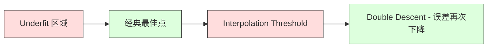
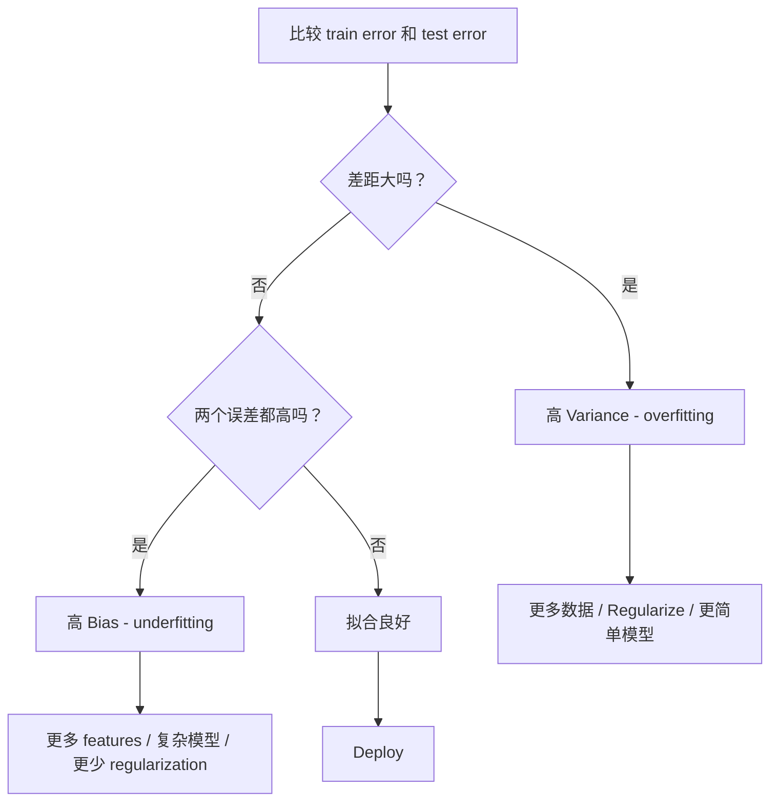
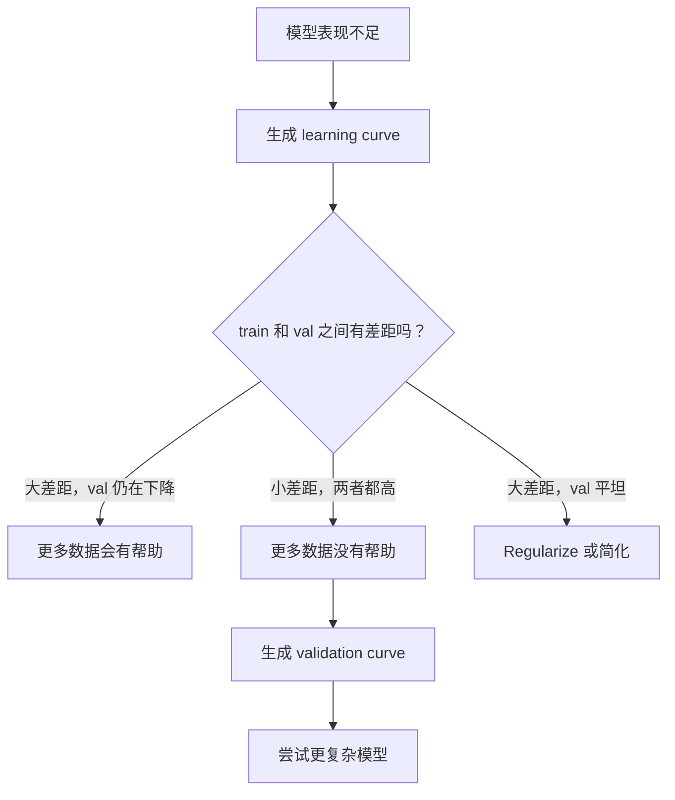

# पूर्वाग्रह-विविधता व्यापार

> प्रत्येक प्रकार की मॉडल त्रुटि तीन स्रोतों में से एक से आती हैः पूर्वाग्रह, भिन्नता या शोर। आप केवल पहले दो को नियंत्रित कर सकते हैं।

**Type:** Learn
**Language:**पायथन
**Prerequisites:** Phase 2, Lessons 01-09（ML 基础、Regression、Classification、评估）
**Time:** ~75 分钟

## 学习目标
- 推导期望预测 त्रुटि का पूर्वाग्रह-भिन्नता 分解,并解释不可约噪音的作用
- प्रयोग प्रशिक्षण त्रुटि और परीक्षण त्रुटि मोड निदान मॉडल क्या उच्च पूर्वाग्रह या उच्च भिन्नता है
- 解释 नियमन 技术(L1、L2、ड्रॉपअप、आरटी स्टॉप) कैसे उपयोग करें पूर्वाग्रह 换取 भिन्नता
- प्रयोग, दृश्यता विविधता मॉडल पर पूर्वाग्रह-विविधता व्यापार

## 问题
आप एक मॉडल को प्रशिक्षित किया है। यह परीक्षण डेटा में एक निश्चित त्रुटि है। यह त्रुटि कहाँ से आई है?

यदि आपका मॉडल बहुत सरल है (उदाहरण के लिए, रैखिक regression का उपयोग करके) यह वास्तविक मॉडल से गलत है। यह पूर्वाग्रह है। यदि आपका मॉडल बहुत जटिल है (उदाहरण के लिए, 15 डेटा बिंदुओं पर डिग्री-20 बहुपद का उपयोग करके), यह प्रशिक्षण डेटा के लिए सही होगा, लेकिन नए डेटा पर भारी परिवर्तन का पूर्वानुमान देता है। यह वैरिएंट है।

 निश्चित मॉडल क्षमता के लिए, आप दोनों को एक साथ न्यूनतम नहीं कर सकते हैं  कम पूर्वाग्रह, भिन्नता बढ़ेगी  कम पूर्वाग्रह, भिन्नता बढ़ेगी  यह समझना कि यह व्यापार मशीन लर्निंग में सबसे उपयोगी निदान कौशल है  यह आपको बताएगा कि आपको मॉडल को अधिक जटिल या सरल बनाना चाहिए, अधिक डेटा प्राप्त करना चाहिए या बेहतर सुविधाओं को इंजीनियर करना चाहिए, नियमन को मजबूत करना चाहिए या कम करना चाहिए 

## 概念
### पूर्वाग्रहः 系统性误差

पूर्वाग्रह का माप मॉडल औसत अनुमान और वास्तविक मूल्य के बीच विचलन की डिग्री है। यदि आप एक ही वितरण से कई अलग-अलग प्रशिक्षण सेटों पर एक ही मॉडल पर प्रशिक्षण देते हैं, और अनुमानित औसत लेते हैं, तो पूर्वाग्रह यह औसत मूल्य और वास्तविक मूल्य के बीच अंतर है।

उच्च पूर्वाग्रह का अर्थ है कि मॉडल बहुत कठिन है, वास्तविक मॉडल को पकड़ने में असमर्थ है।

```
高 Bias（underfitting）：
  模型总是预测大致相同的错误结果。
  训练误差：高
  测试误差：高
  二者差距：小
```

### भिन्नताः प्रशिक्षण डेटा की संवेदनशीलता

भिन्नता मापना है कि जब आप विभिन्न डेटा सेट पर प्रशिक्षण करते हैं, तो भविष्यवाणी कितना बदलती है।

उच्च भिन्नता का अर्थ है कि मॉडल में ध्वनि को अनुकूलित करने के लिए प्रशिक्षण डेटा में, नीचे के संकेतों के बजाय। डिग्री -20 बहुपद प्रत्येक प्रशिक्षण बिंदु के माध्यम से होगा, लेकिन उनके बीच तीव्र झोंकाव है।

```
高 Variance（overfitting）：
  模型完美拟合训练数据，但在新数据上失败。
  训练误差：低
  测试误差：高
  二者差距：大
```

### विघटन

 किसी भी बिंदु x के लिए, वर्ग हानि के तहत अपेक्षित पूर्वानुमान त्रुटि को सटीक रूप से विभाजित किया जा सकता हैः

```
Expected Error = Bias^2 + Variance + Irreducible Noise

where:
  Bias^2   = (E[f_hat(x)] - f(x))^2
  Variance = E[(f_hat(x) - E[f_hat(x)])^2]
  Noise    = E[(y - f(x))^2]             (sigma^2)
```

- `f(x)`है वास्तविक फ़ंक्शन
- `f_hat(x)`模範预测
- `E[...]`विभिन्न प्रशिक्षण समूहों के लिए अपेक्षाएँ
- `y`है देखने के लिए लेबल( वास्तविक फ़ंक्शन + शोर)

噪音项是不可约束的──在有噪音数据上,没有模型能比 sigma^2做得更好──你的任务是在偏见^2和变异之间找到正确平衡──

### मॉडल जटिलता बनाम त्रुटि


经典的 U 形曲线:

| Complexity | Bias | Variance | Total Error |
|-----------|------|----------|-------------|
| 过低 | 高 | 低 | 高（underfitting） |
| 刚刚好 | 中等 | 中等 | 最低 |
| 过高 | 低 | 高 | 高（overfitting） |

### 作为偏差-变化 控制的规范化

नियमन होगा इच्छा बढ़ाओ भेदभाव को कम करने के लिए। यह नियंत्रित मॉडल, यह करने के लिए यह नहीं कर सकता है का पीछा करने के लिए शोर।

- **L2 (Ridge):**सभी विशेषताओं को बनाए रखना, लेकिन उनके प्रभाव को कम करना।
- **L1 (Lasso):**कुछ अधिकारों को निर्दिष्ट करने के लिए शून्य तक।
- **Dropout:**प्रशिक्षण के दौरान नियर-असक्रिय न्यूरॉन्सों को अनिवार्य रूप से अनुचित प्रतिनिधित्वों का गठन करना
- **Early stopping:**मॉडेल पूरी तरह से अनुकूल प्रशिक्षण डेटा से पहले प्रशिक्षण बंद करें

नियमन 强度(lambda、drop-out rate、epoch 数) will directly control you in Bias-Variance 曲线 पर स्थिति 更多 नियमन का अर्थ है अधिक पूर्वाग्रह、更少变化──

### डबल अवतरणः 现代视角

经典理论认为: सर्वोत्तम बिंदु से अधिक जटिलता हमेशा प्रतिकूल होती है। लेकिन 2019 के बाद से किए गए शोध में अप्रत्याशित घटना दिखाई गई है। यदि आप मॉडल क्षमता को दूर से अंतःपूर्णांक सीमा से अधिक तक बढ़ाते रहते हैं, तो मॉडल के पर्याप्त तत्व हैं जो प्रशिक्षण डेटा के स्थान को सही ढंग से फिट करने के लिए उपयुक्त हैं), परीक्षण त्रुटि फिर से कम हो सकती है।



इस प्रकार की "डबल वंश" प्रभाव बताते हैं कि क्यों बड़े पैमाने पर अतिपरिमेय तंत्रिका नेटवर्क (ज्यादातर तत्वों की संख्या प्रशिक्षण से अधिक है) अभी भी अच्छी तरह से सामान्य हो सकते हैं।

关于双色 descendant 的关键观察:
- यह रैखिक मॉडल, निर्णय वृक्षों और तंत्रिका नेटवर्क में दिखाई देता है
- क्षेत्र में अंतरण, अधिक डेटा वास्तव में हानिकारक हो सकता है
- 更多 प्रशिक्षण युगों 也可能导致它(युग-बुद्धिमान डबल वंश)
- नियमन होगा समतल शिखर मूल्य, लेकिन इसे समाप्त नहीं करेगा

यह एक बहुत ही विशिष्ट समाधान में प्रवेश करने के लिए मजबूर है, प्रत्येक बिंदु के माध्यम से, डेटा में सूक्ष्म व्यवधानों से एक बहुत ही विशिष्ट समाधान में प्रवेश होता है। यह यहां है कि वैरिएंट शिखर पर पहुंचता है। इस सीमा से परे, मॉडल में कई संभावित समाधान हैं जो डेटा को सही ढंग से फिट कर सकते हैं। सीखने के एल्गोरिदम (जैसे कि अप्रत्यक्ष विनियमन के ग्रेडिएंट अवतरण के साथ) सबसे सरल कारणों में से एक है।

| Regime | Parameters vs Samples | Behavior |
|--------|----------------------|----------|
| Underparameterized | p << n | 经典 tradeoff 适用 |
| Interpolation threshold | p ~ n | Variance 达到峰值，测试误差激增 |
| Overparameterized | p >> n | Implicit regularization 开始起作用，测试误差下降 |

व्यावहारिक दृष्टिकोण से देखेंः यदि आप न्यूरल नेटवर्क या बड़े पेड़ समूहों का उपयोग करते हैं, तो अंतःपूर्णांक सीमा पर न रुकें।

### अपना मॉडल पहचानना



| Symptom | Diagnosis | Fix |
|---------|-----------|-----|
| 高 train error，高 test error | Bias | 更多 features、复杂模型、更少 regularization |
| 低 train error，高 test error | Variance | 更多数据、regularization、更简单模型、dropout |
| 低 train error，低 test error | 拟合良好 | Ship it |
| Train error 下降，test error 上升 | Overfitting 正在发生 | Early stopping |

### व्यावहारिक रणनीति

**当 Bias 是问题时：**
- 添加 बहुपद या बातचीत विशेषताएं
- प्रयोग更灵活的模型 (उदाहरण के लिए पेड़ के साथ संयोजन के बजाय रैखिक)
- 降低 नियमन शक्ति
- 訓練更久(अगर अभी तक प्राप्त नहीं हुआ है)

**当 Variance 是问题时：**
- Get more training डेटा
- प्रयोग बैगिंग(क्योंकि जंगल)
- 增加 regularisation(更高 lambda、更多 dropped out)
- सुविधा चयन (गूंज सुविधाओं को हटाने)
- क्रॉस-वैलिडेशन का उपयोग करें  यथाशीघ्र पता लगाएं

### संयोजन विधि एवं अनुपात

संयोजन विधिएं वेरिएंट के प्रति सबसे व्यावहारिक उपकरण हैं।

**Bagging (Bootstrap Aggregating)**प्रशिक्षण डेटा के विभिन्न बूटस्ट्रैप नमूनों में एक से अधिक मॉडल का प्रशिक्षण किया जाता है, फिर औसत पर अनुमान लगाया जाता है। प्रत्येक एकल मॉडल में उच्च भिन्नता होती है, लेकिन औसत मूल्य का भिन्नता बहुत कम होनी चाहिए।

यह गणित में प्रभावी है क्योंकि यदि औसत N 个独立预测, प्रत्येक भविष्यवाणी के भिन्नता हैं सिग्मा ^ 2, तो औसत मूल्य के भिन्नता है सिग्मा ^ 2 / N। ये मॉडल वास्तव में स्वतंत्र नहीं हैं।

**Boosting** क्रमशः निर्माण मॉडल के माध्यम से पूर्वाग्रह को कम करने के लिए, उनमें से प्रत्येक नया मॉडल वर्तमान समूह की गलतियों पर ध्यान केंद्रित करता है।

| Method | Primary Effect | Bias Change | Variance Change |
|--------|---------------|-------------|-----------------|
| Bagging | 降低 Variance | 不变 | 降低 |
| Boosting | 降低 Bias | 降低 | 可能增加 |
| Stacking | 同时降低两者 | 取决于 meta-learner | 取决于 base models |
| Dropout | Implicit bagging | 略微增加 | 降低 |

**实践规则：**यदि आपके आधार मॉडल में उच्च भिन्नता है, गहरे पेड़, उच्च डिग्री के बहुपद), उपयोग बैगिंग।

### सीखने की वक्रता

सीखने के वक्रों को प्रशिक्षण के लिए तैयार किया जाएगा त्रुटि और सत्यापन त्रुटि को प्रशिक्षण के बड़े कार्यों के लिए तैयार किया गया है। वे आपके पास मौजूद सबसे व्यावहारिक निदान उपकरण हैं।


如何解读它们:

| Scenario | Training Error | Validation Error | Gap | What It Means | What to Do |
|----------|---------------|-----------------|-----|---------------|------------|
| 高 Bias | 高 | 高 | 小 | 模型无法捕捉模式 | 更多 features、复杂模型、更少 regularization |
| 高 Variance | 低 | 高 | 大 | 模型记忆训练数据 | 更多数据、regularization、更简单模型 |
| 拟合良好 | 中等 | 中等 | 小 | 模型 generalizes well | Ship it |
| 高 Variance，正在改善 | 低 | 随更多数据下降 | 缩小 | 数据可以修复的 Variance 问题 | 收集更多数据 |
| 高 Bias，平坦 | 高 | 高且平坦 | 小且平坦 | 更多数据没有帮助 | 改变 model architecture |

关键洞察: यदि दो वक्रों में से कोई भी एक समतल हो गया है, तो अंतर बहुत छोटा है, लेकिन दो त्रुटियां अधिक हैं, अधिक डेटा का उपयोग नहीं किया जाएगा। आपको बेहतर मॉडल की आवश्यकता है।

### कैसे सीख वक्र उत्पन्न करें

दो तरीके हैंः

**Approach 1: 改变训练集大小，固定模型。**保持模型和超参数 不变──在越来越大的训练数据集上训练──测量每大小下训练误差和验证误差── यह मानक सीखने वक्र है──

**Approach 2: 改变模型复杂度，固定数据。**保持数据不变──扫描一个复杂度参数(बहुपद डिग्री、वृक्ष गहराई、层数量)──测量每个复杂度下训练误差和验证误差──यह सत्यापन वक्र है, सीधे दिखाएगा पूर्वाग्रह-परिवर्तन व्यापार-off──

ये दोनों तरीके एक दूसरे के पूरक हैं। पहला आपको बताता है कि क्या अधिक डेटा उपयोगी है। दूसरा आपको बताता है कि क्या विभिन्न मॉडल उपयोगी हैं।




```figure
bias-variance
```

##  इसे निर्माण
`code/bias_variance.py`मध्य कोड会运行完整的偏差差分解实验――下面是逐步方法――

### 步骤 1: ज्ञात फ़ंक्शन से संश्लेषित डेटा उत्पन्न करना

हम उपयोग करते हैं के साथ Gaussian शोर के `f(x) = sin(1.5x) + 0.5x`🏻 जानिए वास्तविक फ़ंक्शन हमें सटीक पूर्वाग्रह एवं भिन्नता की गणना करने में सक्षम बनाता है

```python
def true_function(x):
    return np.sin(1.5 * x) + 0.5 * x

def generate_data(n_samples=30, noise_std=0.5, x_range=(-3, 3), seed=None):
    rng = np.random.RandomState(seed)
    x = rng.uniform(x_range[0], x_range[1], n_samples)
    y = true_function(x) + rng.normal(0, noise_std, n_samples)
    return x, y
```

### 步骤 2: बूटस्ट्रैप नमूनाकरण और बहुपद फिटिंग

 प्रत्येक बहुपद डिग्री के लिए, हम कई बूटस्ट्रैप प्रशिक्षण सेट खींचते हैं, बहुपद को फिट करते हैं, और एक निश्चित परीक्षण ग्रिड पर रिकॉर्ड करते हैं  यह प्रत्येक परीक्षण बिंदु के लिए एक पूर्वानुमान वितरण प्रदान करेगा

```python
def fit_polynomial(x_train, y_train, degree, lam=0.0):
    X = np.column_stack([x_train ** d for d in range(degree + 1)])
    if lam > 0:
        penalty = lam * np.eye(X.shape[1])
        penalty[0, 0] = 0
        w = np.linalg.solve(X.T @ X + penalty, X.T @ y_train)
    else:
        w = np.linalg.lstsq(X, y_train, rcond=None)[0]
    return w
```

हम 200 अलग-अलग बूटस्ट्रैप नमूने में ऊपर से तैयार हैं। प्रत्येक बूटस्ट्रैप नमूने एक ही निचले स्तर के वितरण से निकाले गए हैं, लेकिन इसमें अलग-अलग बिंदु शामिल हैं।

### 步骤 3: कंप्यूटिंग पूर्वाग्रह^2, वैरिएंस विघटन

प्रत्येक परीक्षण बिंदु पर 200 组 पूर्वानुमान के साथ, हम सीधे परिभाषा के अनुसार गणना कर सकते हैंः

```python
mean_pred = predictions.mean(axis=0)
bias_sq = np.mean((mean_pred - y_true) ** 2)
variance = np.mean(predictions.var(axis=0))
total_error = np.mean(np.mean((predictions - y_true) ** 2, axis=1))
```

- `mean_pred`                                                                                                                                                                                                                                                              
- `bias_sq`औसत अनुमान और वास्तविक मूल्य के बीच अंतर का वर्ग है
- `variance`है पार बूटस्ट्रैप नमूने का पूर्वानुमान औसत विघटन दर
- `total_error` devrait approximation = पूर्वाग्रह^2 + भिन्नता + शोर

### 步骤 4: सीखने के वक्र

सीखने के वक्रों में मॉडल जटिलता निश्चित करते समय स्कैन प्रशिक्षण集大小── वे आपके मॉडल को डेटा-सीमित या क्षमता-सीमित दिखाते हैं──

```python
def demo_learning_curves():
    sizes = [10, 15, 20, 30, 50, 75, 100, 150, 200, 300]
    degree = 5

    for n in sizes:
        train_errors = []
        test_errors = []
        for seed in range(50):
            x_train, y_train = generate_data(n_samples=n, seed=seed * 100)
            w = fit_polynomial(x_train, y_train, degree)
            train_pred = predict_polynomial(x_train, w)
            train_mse = np.mean((train_pred - y_train) ** 2)
            test_pred = predict_polynomial(x_test, w)
            test_mse = np.mean((test_pred - y_test) ** 2)
            train_errors.append(train_mse)
            test_errors.append(test_mse)
        # 对多次运行取平均，得到 learning curve 上的点
```

对于高变化 模型(小数据上的 डिग्री 5), आप देखेंगेः
- प्रशिक्षण त्रुटि कम होती है, अधिक डेटा के साथ स्मृति में वृद्धि होती है।
- 测试差差一开始很高,模型获得更多信号后下降
-  अंतर अधिक डेटा के साथ छोटा हो जाता है

对于高偏见 模型 ((डिग्री 1), दो त्रुटियां एक ही उच्च मूल्य तक तेजी से प्राप्त होती हैं, अधिक डेटा कोई मदद नहीं करती है。

### 第5 步:नियमितता स्वीप

代码 भी शामिल `demo_regularization_sweep()`, यह एक उच्च-डिग्री बहुपद को तय करता है, और रिज की नियमितता शक्ति को 0.001 से 100 तक बढ़ाता है। यह एक और कोण से दिखाता है पूर्वाग्रह-विविधता व्यापारः हम मॉडल जटिलता को नहीं बदलते हैं, बल्कि बाध्यता की ताकत को बदलते हैं।

```python
def demo_regularization_sweep():
    alphas = [0.001, 0.005, 0.01, 0.05, 0.1, 0.5, 1.0, 5.0, 10.0, 50.0, 100.0]
    for alpha in alphas:
        results = bias_variance_decomposition([15], lam=alpha)
        r = results[15]
        print(f"alpha={alpha:.3f}  bias={r['bias_sq']:.4f}  var={r['variance']:.4f}")
```

निम्न अल्फा में, डिग्री-15 बहुपद  लगभग अवरुद्ध है। वेरिएंट 占主导, चूंकि मॉडल प्रत्येक बूटस्ट्रैप नमूने के बीच के शोर का पीछा करेगा।

यह बहुपद की डिग्री को बदलने के साथ मिलता है, केवल यहां पर नियंत्रण करने के लिए निरंतर घुमाव के बजाय अलग-अलग विकल्पों के साथ। व्यवहार में, विनियमन उस व्यापार को नियंत्रित करने का प्राथमिक तरीका है, क्योंकि यह सूक्ष्मता नियंत्रण की अनुमति देता है, और बिना किसी विशेषता सेट को बदलने की आवश्यकता नहीं है।

## इसका उपयोग करें
दुकान              `learning_curve`和 `validation_curve`, आप इन निदानों को स्वचालित कर सकते हैं, बूटस्ट्रैप लूप्स लिखने की आवश्यकता नहीं है।

### सत्यापन वक्रः扫描 मॉडल जटिलता

```python
from sklearn.model_selection import validation_curve
from sklearn.pipeline import make_pipeline
from sklearn.preprocessing import PolynomialFeatures
from sklearn.linear_model import Ridge

degrees = list(range(1, 16))
train_scores_all = []
val_scores_all = []

for d in degrees:
    pipe = make_pipeline(PolynomialFeatures(d), Ridge(alpha=0.01))
    train_scores, val_scores = validation_curve(
        pipe, X, y, param_name="polynomialfeatures__degree",
        param_range=[d], cv=5, scoring="neg_mean_squared_error"
    )
    train_scores_all.append(-train_scores.mean())
    val_scores_all.append(-val_scores.mean())
```

यह आपको सीधे Bias-Variance Tradeoff 曲线  देगा। जब वैधता स्कोर तुलना ट्रेन स्कोर 最差时,Variance 占主导──当两者都差时,Bias 占主导──

### सीखने की वक्रः扫描 प्रशिक्षण सेट आकार

```python
from sklearn.model_selection import learning_curve

pipe = make_pipeline(PolynomialFeatures(5), Ridge(alpha=0.01))
train_sizes, train_scores, val_scores = learning_curve(
    pipe, X, y, train_sizes=np.linspace(0.1, 1.0, 10),
    cv=5, scoring="neg_mean_squared_error"
)
train_mse = -train_scores.mean(axis=1)
val_mse = -val_scores.mean(axis=1)
```

`train_mse`和 `val_mse`तुलना `train_sizes`आउटड्राइंग                                                                                                                                                                                                                                                           

### उपयोग नियमन 扫描的 क्रॉस-वैलिडेशन

```python
from sklearn.model_selection import cross_val_score

alphas = [0.001, 0.01, 0.1, 1.0, 10.0, 100.0]
for alpha in alphas:
    pipe = make_pipeline(PolynomialFeatures(10), Ridge(alpha=alpha))
    scores = cross_val_score(pipe, X, y, cv=5, scoring="neg_mean_squared_error")
    print(f"alpha={alpha:>7.3f}  MSE={-scores.mean():.4f} +/- {scores.std():.4f}")
```

यह निश्चित मॉडल जटिलता स्कैन नियमितता ताकत के लिए होगा. आप एक ही पूर्वाग्रह-विविधता व्यापारफल देखेंगे: निम्न अल्फा का अर्थ उच्च भिन्नता, उच्च अल्फा का अर्थ उच्च पूर्वाग्रह।

### 整合起来: पूर्ण निदान कार्यप्रवाह

प्रैक्टिस में, आप इन निदानों को क्रमशः संचालित करेंगेः

1. 訓練你的模型──计算列车 和 परीक्षण त्रुटि──
2. यदि आप दोनो में से एक है, तो आप एक समस्या है।
3. यदि ट्रेन 低但测试 高:你有变化 问题── उत्पन्न सीखने के वक्र, देखें अधिक डेटा क्या मदद करता है── यदि नहीं, तो नियमितता से करें──
4. सत्यापन वक्र का निर्माण, आपके मुख्य जटिलता पैरामीटर को साफ़ करना, सर्वोत्तम बिंदु ढूंढना
5. सबसे अच्छा बिंदु पर, सीखने की वक्र उत्पन्न करें। यदि अंतर अभी भी बड़ा है, तो आपको अधिक डेटा या नियमितता की आवश्यकता होगी।
6. उपयोग `cross_val_score`尝试不同 अल्फा 值的 Ridge/Lasso──选择十字验证错误 最低的 अल्फा──

 अधिकांश तालिकागत डेटासेट के लिए, यह 10-15 मिनट का समय लगता है, लेकिन अनुमान लगाने के कुछ घंटे बचा सकता है

## 交付 यह
本课产出:`outputs/prompt-model-diagnostics.md`

## अभ्यास
1. उपयोग `noise_std=0`(गूंज नहीं) परिचालन विघटन. . . . . . . . . . . . . . . . . . . . . . . . . . . . . . . . . . . . . . . . . . . . . . . . . . . . . . . . . . . . . . . . . . . . . . . . . . . . . . . . . . . . . . . . . . . . . . . . . . . . . . . . . . . . . . . . . . . . . . . . . . . . . . . . . . . . . . . . . . . . . . . . . . . . . . . . . . . . . . . . . . . . . . . . . . . . . . . . . . . . . . . . . . . . . . . . . . . . . . . . . . . . . . . . . . . . . . . . . . . . . . . . . . . . . . . . . . . . . . . . . . . . . . . . . . . . . . . . . . . . . . . . . . . . . . . . . . . . . . . . . . . . . . . . . . . . . . . . . . . . . . . . . . . . . . . . . . . . . . . . . . . . . . . . . . . . . . . . . . . . . . . . . . . . . . . . . . . . . . . . . . . . . . . . . . . . . . . . . . . . . . . . . . . . . . . . . . . . . . . . . . . . . . . . . . . . . . . . . . . . . . . . . . . . . . . . . . . . . . . . . . . . . . . . . . . . . . . . . . . . . . . . . . . . . . . . . . . . . . . . . . . . . . . . . . . . . . . . . . .

2. प्रशिक्षण को 30 से बढ़ाकर 300 तक बढ़ाया जाएगा। यह कैसे भिन्नता घटक को प्रभावित करेगा?

3. ⇒ प्रयोग जोड़ना L2 नियमन (Ridge regression) ⋅ निश्चित उच्च-डिग्री बहुपद (Degree 15) के लिए, lambda 0 से 100 扫描 तक होगा

4. 将真实函数 से बहुपद 修改为 `sin(x)`◊ भेदभाव कैसे बदलता है? क्या अभी भी स्पष्टता का सबसे अच्छा स्तर है?

5. 实现一个简单的bootstrap aggregation(bagging)wrapper:在bootstrap नमूनों上训练 10 个模型并平均预测──展示这会降低变化,且几乎不增加偏见──

## 关键术语
| Term | What people say | What it actually means |
|------|----------------|----------------------|
| Bias | “模型太简单” | 来自错误假设的系统性误差。平均模型预测与真实值之间的差距。 |
| Variance | “模型在 overfitting” | 来自对训练数据敏感性的误差。预测在不同训练集之间变化的程度。 |
| Irreducible error | “数据中的噪声” | 来自真实数据生成过程中的随机性的误差。没有模型能消除它。 |
| Underfitting | “学得不够” | 模型有高 Bias。即使在训练数据上也会错过真实模式。 |
| Overfitting | “记住了数据” | 模型有高 Variance。它拟合了训练数据中无法 generalize 的噪声。 |
| Regularization | “约束模型” | 添加惩罚来降低模型复杂度，用 Bias 换取更低 Variance。 |
| Double descent | “更多参数可能有帮助” | 当模型容量远超 interpolation threshold 时，测试误差会再次下降。 |
| Model complexity | “模型有多灵活” | 模型拟合任意模式的容量。由 architecture、features 或 regularization 控制。 |

## 延伸阅读
- [Hastie, Tibshirani, Friedman: Elements of Statistical Learning, Ch. 7](https://hastie.su.domains/ElemStatLearn/)-- पूर्वाग्रह-विविधता 分解的权威论述
- [Belkin et al., Reconciling modern machine learning practice and the bias-variance trade-off (2019)](https://arxiv.org/abs/1812.11118)-- दोहरी वंश
- [Nakkiran et al., Deep Double Descent (2019)](https://arxiv.org/abs/1912.02292)-- युग-बुद्धिमान व नमूना-बुद्धिमान दोहरी गिरावट
- [Scott Fortmann-Roe: Understanding the Bias-Variance Tradeoff](http://scott.fortmann-roe.com/docs/BiasVariance.html)-- 清晰的可视化解释
