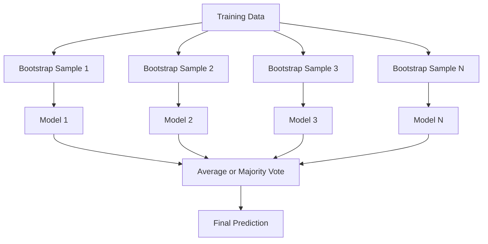
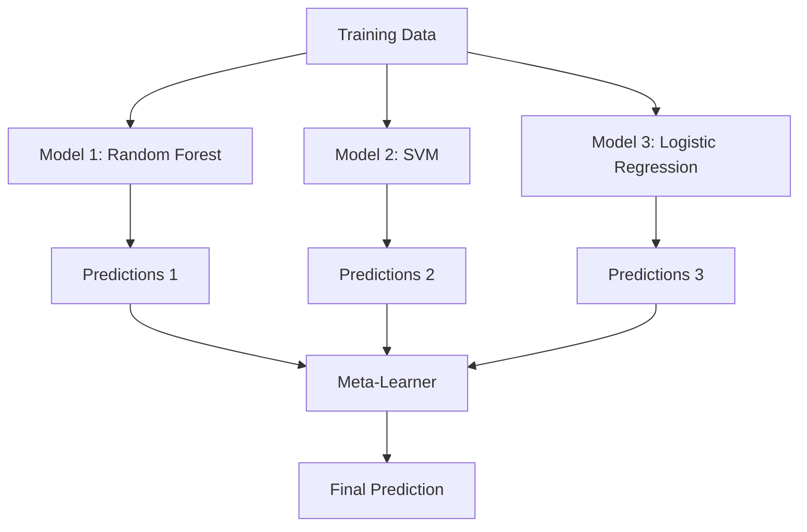

# विधिओं को एक साथ रखना

> एक झुंड कमजोर छात्र, यदि सही ढंग से गठबंधन किया जाए, तो एक मजबूत छात्र बन जाएगा।

**Type:** Build
**Language:**पायथन
**Prerequisites:** Phase 2, Lesson 10 (Bias-Variance Tradeoff)
**Time:** ~120 分钟

## 学习目标

- 零 से प्राप्त AdaBoost 和 ग्रेडिएंट बूस्टिंग,并 व्याख्या बूस्टिंग 如何按顺序降低偏差
-  एक बैगिंग एंसेंबली का निर्माण करें, और संबंधित मॉडल पर दिखाएं कि कैसे औसत में वृद्धि न होने के कारण भिन्नता को कम किया जाए
- प्रत्येक विधि के अनुसार, त्रुटि घटक की तुलना बैगिंग, बूस्टिंग और स्टैकिंग
-  मूल्यांकन समूह विविधता,并 व्याख्या क्यों अधिक स्वतंत्र कमजोर शिक्षार्थियों के शामिल होने के साथ, बहुमत मतदान सटीकता बढ़ेगा

## 问题

单个决策树 训练速度快且易解释,但会过于适合――单个线性模型 在复杂边界上会过于适合―― आप कुछ दिनों में सही मॉडल संरचना को डिजाइन कर सकते हैं――或者, आप एक समूह को असंतुष्ट मॉडल के साथ जोड़ सकते हैं, जिससे उनमें से किसी एक मॉडल से बेहतर परिणाम मिलता है――

इम्बेलेशन विधियां इस प्रकार की हैं। वे तालिकागत आंकड़ों में हैं, जो कि सबसे विश्वसनीय तकनीक है, जो कि अधिकांश उत्पादन एमएल सिस्टम का समर्थन करती है, और वे एक वास्तविक प्रभाव प्रदर्शित करती हैं।

## 概念

### क्यों इंसेंबल्स प्रभावी हैं

假设你有N 个独立分类器, प्रत्येक की सटीकता 都是p > 0.5──बहुसंख्यक मतों की सटीकता 为:

```
P(majority correct) = sum over k > N/2 of C(N,k) * p^k * (1-p)^(N-k)
```

 21  की सटीकता  60% के वर्गीकरण के लिए औसत है, बहुमत की सटीकता लगभग 74% है यदि 101  वर्गीकरण होते हैं, तो यह 84% तक बढ़ जाता है

关键要求是 **diversity**यदि सभी मॉडल एक ही गलती करते हैं, तो उन्हें संयोजित करने में कोई मदद नहीं मिलती है

- अलग से प्रशिक्षण के लिए एक सेट
- अलग अलग विशेषता उपसमूहों (रैंडम वन)
- 顺序式 त्रुटि सुधार(बूस्टिंग)
- 不同的模型家族(स्टैकिंग)

### बैगिंग (बूटस्ट्रैप एग्रीगेटिंग)

प्रशिक्षण डेटा के विभिन्न बूटस्ट्रैप नमूने को बैगिंग करके प्रत्येक प्रशिक्षण मॉडल में विविधता पैदा करना।



बूटस्ट्रैप नमूना मूल डेटा से प्राप्त किए गए पुनः निकाले गए नमूने हैं, जो मूल डेटा के समान हैं। प्रत्येक बूटस्ट्रैप में लगभग 63.2% अद्वितीय नमूने दिखाई देते हैं। शेष 36.8% (बाहर के बैग नमूने) एक मुफ्त सत्यापन सेट प्रदान करते हैं।

लगभग किसी भी प्रकार की पूर्वाग्रह के साथ बैगिंग में भिन्नता कम होती है। प्रत्येक पेड़ अपने स्वयं के बूटस्ट्रैप नमूने के लिए ओवरफिट होता है, लेकिन प्रत्येक पेड़ का ओवरफिट अलग होता है, इसलिए औसत से शोर का प्रतिरोध करना आवश्यक होता है।

**Random Forests**️️️️️️️️️️️️️️️️️️️️️️️️️️️️️️️️️️️️️️️️️️️️️️️️️️️️️️️️️️️️️️️️️️️️️️️️️️️️️️️️️️️️️️️️️️️️️️️️️️️️️️️️️️️️️️️️️️️️️️️️️️️️️️️️️️️️️️️️️️️️️️️️️️️️️️️️️️️️️️️️️️️️️️️️️️️️️️️️️️️️️️️️️️️️️️️️️️️️️️️️️️️️️️️️️️️️️️️️️️️️️️️️️️️️️️️️️️️️️️️️️️️️️️️️️️️️️️️️️️️️️️️️️️️️️️️️️️️️️️️️️️️️️️️️️️️️️️️️️️️️️️️️️️️️️️️️️️️️️️️️️️️️️️️️️️️️️️️️️️️️️️️️️️️️️️️️️️️️️️️️️️️️️️️️️️️️️️️️️️️️️️️️️️️️️️️️️️️️️️️️️️️️️️️️️️️️️️️️️️️️️️️️️️️️️️️️️️️️️️️️️️️️️️️️️️️️️️️️️️️️️️️️️️️️️️️️️️️️️️️️️️️️️️️️️️️️️️️️️️️️️️️️️️️️`sqrt(n_features)`, तथा पुनरावृत्ति मध्य `n_features / 3`

### Boosting(顺序式 त्रुटि सुधार)

按顺序训练模型── प्रत्येक नए मॉडल都关注之前模型预测错误的例子──


बढ़ाना  कम करना पूर्वाग्रहों में सुधार करना  प्रत्येक नए मॉडल में सही पूर्व-संयोजन के व्यवस्थित त्रुटिएँ होती हैं  अंतिम भविष्यवाणी सभी मॉडल का भारित योग है, जिसमें से बेहतर प्रदर्शन करने वाले मॉडल अधिक वजन प्राप्त करते हैं 

 वजन इस बात पर निर्भर करता हैः यदि बहुत अधिक रील चलें, तो बूस्टिंग अधिक फिट हो सकती है, क्योंकि यह लगातार कठिन उदाहरणों के साथ अनुकूलित होगी, जबकि उनमें से कुछ केवल शोर हो सकते हैं।

### एडबोस्ट

AdaBoost (अनुकूली बूस्टिंग) पहला व्यावहारिक बूस्टिंग एल्गोरिथ्म है। यह किसी भी मूल सीखने वाले के साथ उपयोग में आ सकता है, आमतौर पर निर्णय के तने के साथ उपयोग किया जाता है।

算法:

```
1. Initialize sample weights: w_i = 1/N for all i

2. For t = 1 to T:
   a. Train weak learner h_t on weighted data
   b. Compute weighted error:
      err_t = sum(w_i * I(h_t(x_i) != y_i)) / sum(w_i)
   c. Compute model weight:
      alpha_t = 0.5 * ln((1 - err_t) / err_t)
   d. Update sample weights:
      w_i = w_i * exp(-alpha_t * y_i * h_t(x_i))
   e. Normalize weights to sum to 1

3. Final prediction: H(x) = sign(sum(alpha_t * h_t(x)))
```

त्रुटि से कम मॉडल उच्च अल्फा प्राप्त करेंगे. गलत वर्गीकरण से किए गए नमूनों को अधिक वजन प्राप्त होगा. अगले मॉडल को ध्यान केंद्रित करने दें.

### धीरे-धीरे बढ़ना

ग्रेडिएंट बूस्टिंग 泛化到任意 Loss Function  यह पुनःवर्धित नमुने नहीं है, बल्कि प्रत्येक नए मॉडल को वर्तमान समूह के अवशेषों के अनुकूल बनाने के लिए लाएगा  हानि का नकारात्मक ग्रेडिएंट)

```
1. Initialize: F_0(x) = argmin_c sum(L(y_i, c))

2. For t = 1 to T:
   a. Compute pseudo-residuals:
      r_i = -dL(y_i, F_{t-1}(x_i)) / dF_{t-1}(x_i)
   b. Fit a tree h_t to the residuals r_i
   c. Find optimal step size:
      gamma_t = argmin_gamma sum(L(y_i, F_{t-1}(x_i) + gamma * h_t(x_i)))
   d. Update:
      F_t(x) = F_{t-1}(x) + learning_rate * gamma_t * h_t(x)

3. Final prediction: F_T(x)
```

क्वाड त्रुटि हानि के लिए, छद्म-अवशिष्ट यानि वास्तविक अवशेषः`r_i = y_i - F_{t-1}(x_i)` प्रत्येक पेड़  वास्तव में  सभी  एक समूह के साथ 

सीखने की दर (shrinkage) प्रत्येक पेड़ के योगदान को नियंत्रित करने की दरों में वृद्धि करना।

### XGBoost: क्यों यह मुख्य रूप से तालिका डेटा

XGBoost (eXtreme Gradient Boosting) एक परियोजना है जो तेजी से सटीक और अधिक अनुकूलित करने के लिए अनुकूलित है।

- **Regularized objective:**पत्ती के वजन पर L1 और L2 दंड लगाएं, एक पेड़ को रोकने के लिए  अत्यधिक आत्मविश्वास
- **Second-order approximation:**साथ ही नुकसान के प्रथम और द्वितीय चरण व्युत्पन्न का उपयोग करके, बेहतर विभाजन निर्णय लेने के लिए
- **Sparsity-aware splits:**通过在每次分分时学习缺失数据的最佳方向,原生处理缺失值
- **Column subsampling:** जैसे कि यादृच्छिक वन,  जैसे,  प्रत्येक विभाजन में  विविधता बढ़ाने के लिए विशेषताएं
- **Weighted quantile sketch:**वितरित डेटा में लगातार सुविधाओं की खोज करने के लिए शीर्ष उच्च प्रभाव
- **Cache-aware block structure:**प्रोसेसर कैश लाइनों के लिए  अनुकूलित स्मृति लेआउट

√ तालिकागत डेटा के लिए, XGBoost (और इसके बाद के LightGBM) ने न्यूरल नेटवर्क से बेहतर प्रदर्शन किया है। यह कुछ ही समय में नहीं बदलेगा।

### स्टैपिंग (मेटा-लर्निंग)

स्टैकिंग कई आधार मॉडल की भविष्यवाणियों को मेटा-लर्नर के लक्षणों के रूप में प्रस्तुत करेगा।



मेटा-लर्नर सीखेंगे कि किस इनपुट पर विश्वास करना चाहिए। यदि कुछ क्षेत्रों में यादृच्छिक वन बेहतर प्रदर्शन करते हैं, जबकि अन्य क्षेत्रों में एसवीएम बेहतर प्रदर्शन करता है, तो मेटा-लर्नर सीखेंगे कि किस आधार मॉडल पर व्यवहार करना है।

 डेटा लीक से बचने के लिए, आधार मॉडल भविष्यवाणियों  को प्रशिक्षण सेट से गुजरना होगा  उपर्युक्त क्रॉस-वैलिडेशन 生成──绝不能在同一批数据上既训练 आधार मॉडल,又生成 मेटा-विशेषताओं──

### मतदान

सबसे सरल संचयः प्रत्यक्ष संचयः भविष्यवाणियाँ

- **Hard voting:**वर्ग लेबल पर बहुमत मतदान करना
- **Soft voting:**अनुमानित संभावनाओं के लिए औसत का चयन करें, औसत संभावना का चयन करें उच्चतम श्रेणी।


```figure
f3-ensemble-average
```

##  इसे निर्माण

### 步骤 1: निर्णय स्टंप (Base Learner)

`code/ensembles.py`मध्य कोड शून्य से सब कुछ पूरा किया है।

```python
class DecisionStump:
    def __init__(self):
        self.feature_idx = None
        self.threshold = None
        self.polarity = 1
        self.alpha = None

    def fit(self, X, y, weights):
        n_samples, n_features = X.shape
        best_error = float("inf")

        for f in range(n_features):
            thresholds = np.unique(X[:, f])
            for thresh in thresholds:
                for polarity in [1, -1]:
                    pred = np.ones(n_samples)
                    pred[polarity * X[:, f] < polarity * thresh] = -1
                    error = np.sum(weights[pred != y])
                    if error < best_error:
                        best_error = error
                        self.feature_idx = f
                        self.threshold = thresh
                        self.polarity = polarity

    def predict(self, X):
        n = X.shape[0]
        pred = np.ones(n)
        idx = self.polarity * X[:, self.feature_idx] < self.polarity * self.threshold
        pred[idx] = -1
        return pred
```

### 步骤 2: शून्य से लागू करने के लिए AdaBoost

```python
class AdaBoostScratch:
    def __init__(self, n_estimators=50):
        self.n_estimators = n_estimators
        self.stumps = []
        self.alphas = []

    def fit(self, X, y):
        n = X.shape[0]
        weights = np.full(n, 1 / n)

        for _ in range(self.n_estimators):
            stump = DecisionStump()
            stump.fit(X, y, weights)
            pred = stump.predict(X)

            err = np.sum(weights[pred != y])
            err = np.clip(err, 1e-10, 1 - 1e-10)

            alpha = 0.5 * np.log((1 - err) / err)
            weights *= np.exp(-alpha * y * pred)
            weights /= weights.sum()

            stump.alpha = alpha
            self.stumps.append(stump)
            self.alphas.append(alpha)

    def predict(self, X):
        total = sum(a * s.predict(X) for a, s in zip(self.alphas, self.stumps))
        return np.sign(total)
```

### 步骤 3: शून्य से क्रमिक वृद्धि को प्राप्त करना

```python
class GradientBoostingScratch:
    def __init__(self, n_estimators=100, learning_rate=0.1, max_depth=3):
        self.n_estimators = n_estimators
        self.lr = learning_rate
        self.max_depth = max_depth
        self.trees = []
        self.initial_pred = None

    def fit(self, X, y):
        self.initial_pred = np.mean(y)
        current_pred = np.full(len(y), self.initial_pred)

        for _ in range(self.n_estimators):
            residuals = y - current_pred
            tree = SimpleRegressionTree(max_depth=self.max_depth)
            tree.fit(X, residuals)
            update = tree.predict(X)
            current_pred += self.lr * update
            self.trees.append(tree)

    def predict(self, X):
        pred = np.full(X.shape[0], self.initial_pred)
        for tree in self.trees:
            pred += self.lr * tree.predict(X)
        return pred
```

### 步骤 4: तुलना करें

代码会验证 हमारे खरोंच से कार्यान्वयन के साथ उत्पन्न हो सकता है या नहीं `AdaBoostClassifier`和 `GradientBoostingClassifier`तुलनात्मक सटीकता,并将所有方法并排比较──

## इसका उपयोग करें

### कैसे उपयोग करें हर तरह के तरीके

| Method | Reduces | Best for | Watch out for |
|--------|---------|----------|---------------|
| Bagging / Random Forest | Variance | noisy data、features 很多 | 对 bias 没有帮助 |
| AdaBoost | Bias | clean data、简单 base learners | 对 outliers 和 noise 敏感 |
| Gradient Boosting | Bias | tabular data、比赛 | 训练慢，不调参容易 overfit |
| XGBoost / LightGBM | Both | 生产环境 tabular ML | hyperparameters 很多 |
| Stacking | Both | 争取最后 1-2% accuracy | 复杂，存在 meta-learner overfitting 风险 |
| Voting | Variance | 快速组合 diverse models | 只有在模型足够 diverse 时才有帮助 |

### तालिकागत डेटा का उत्पादन स्टैक

 अधिकांश तालिकागत भविष्यवाणी समस्याओं के लिए, निम्नलिखित क्रमशः प्रयास करने का सुझाव दिया जाता हैः

1. उपयोग默认参数 **LightGBM 或 XGBoost**
2. 调优 n_estimators、learning_rate、max_depth、min_child_weight
3. यदि अंतिम 0.5% की वृद्धि की आवश्यकता है, एक निर्माण जिसमें 3-5 विविध मॉडल के स्टैकिंग समूह शामिल
4. 全程使用 क्रॉस वैधता

यद्यपि अध्ययन अभी भी जारी है, तालिकागत डेटा में न्यूरल नेटवर्क लगभग हमेशा ग्रेडिएंट बढ़ता है।

## 交付 यह

本课会产出 `outputs/prompt-ensemble-selector.md`-- एक सहायता आपको एक निर्धारित डेटासेट के लिए  चयन करने के लिए उपयुक्त सेट विधि का संकेत   अपने डेटा का वर्णन करें   आकार  विशेषता प्रकार  शोर स्तर  वर्ग संतुलन) तथा आप हल कर रहे हैं समस्या                                                                                                                                                                                                                                                                                                                                                                                                                                                                             `outputs/skill-ensemble-builder.md`, जिसमें पूर्ण चयन निर्देश शामिल है

## अभ्यास

1. 修改 AdaBoost 实现, ट्रैक प्रत्येक एक दौर के बाद प्रशिक्षण सटीकता── चित्रण सटीकता बनाम अनुमानकों की संख्या── यह किस समय प्राप्त?

2. 通过向归 regression tree 添加随机特征子样本,从零实现一个随机森林──使用 `max_features=sqrt(n_features)`训练 100 树木并对预测 求平均──将变差减少与单树相比──

3. प्रवृत्ति वृद्धि में वृद्धि में वृद्धि में वृद्धि में वृद्धि में वृद्धिः प्रत्येक दौर के बाद सत्यापन हानि का पालन करें, यदि लगातार 10 दौर में वृद्धि नहीं होती है तो रुकिये।

4.  एक निर्माण जिसमें तीन आधार मॉडल शामिल हैं लॉजिस्टिक रेग्रिशन, निर्णय वृक्ष, के-समीप पड़ोसियों) और एक लॉजिस्टिक रेग्रिशन मेटा-लर्नर का स्टैकिंग एसेम्बल ️ 5 गुना क्रॉस-वैलिडेशन का उपयोग करें ️मेटा-विशेषताओं का उत्पादन करें ️ प्रत्येक आधार मॉडल ️单独使用时比较️

5. एक ही डेटासेट में अप पर डिफ़ॉल्ट पैरामीटर का उपयोग XGBoost चलाने के लिए। इसकी सटीकता आपके खरोंच ग्रेडिएंट से बढ़ रही तुलना में।

## 关键术语

| Term | 常见说法 | 实际含义 |
|------|----------------|----------------------|
| Bagging | “在 random subsets 上训练” | Bootstrap aggregating：在 bootstrap samples 上训练模型，对 predictions 求平均以降低 variance |
| Boosting | “关注 hard examples” | 按顺序训练模型，每个模型纠正当前 ensemble 的错误，以降低 bias |
| AdaBoost | “重新加权数据” | 通过 sample weight updates 实现 boosting；misclassified points 会在下一个 learner 中获得更高 weight |
| Gradient boosting | “拟合 residuals” | 通过让每个新模型拟合 Loss Function 的 negative Gradient 来实现 boosting |
| XGBoost | “Kaggle 武器” | 带有 regularization、second-order optimization 和系统级加速技巧的 gradient boosting |
| Stacking | “模型叠在模型上” | 将 base models 的 predictions 作为 meta-learner 的 input features |
| Random forest | “许多 randomized trees” | 使用 decision trees 的 bagging，并在每次 split 时加入 random feature subsampling 以增加 diversity |
| Ensemble diversity | “犯不同错误” | 模型的错误必须不相关，ensemble 才能优于单个模型 |
| Out-of-bag error | “免费 validation” | 不在某次 bootstrap draw 中的 samples（约 36.8%）可作为 validation set，无需单独 holdout |

## 延伸阅读

- [Schapire & Freund: Boosting: Foundations and Algorithms](https://mitpress.mit.edu/9780262526036/)-- AdaBoost 创始人所著的书
- [Friedman: Greedy Function Approximation: A Gradient Boosting Machine (2001)](https://statweb.stanford.edu/~jhf/ftp/trebst.pdf)-- 原始梯度 बढ़ाना 论文
- [Chen & Guestrin: XGBoost (2016)](https://arxiv.org/abs/1603.02754)-- XGBoost 论文
- [Wolpert: Stacked Generalization (1992)](https://www.sciencedirect.com/science/article/abs/pii/S0893608005800231)-- 原始 ढेर 论文
- [scikit-learn Ensemble Methods](https://scikit-learn.org/stable/modules/ensemble.html)-- 实用参考
