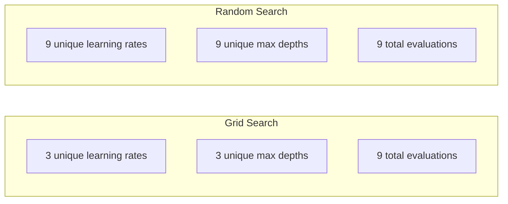
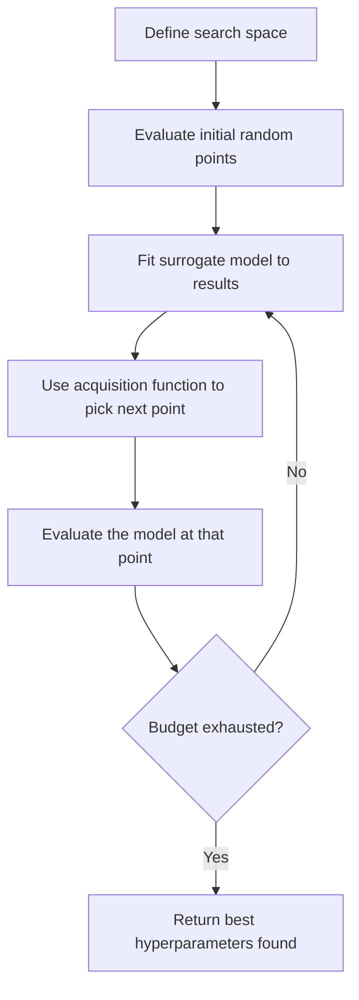
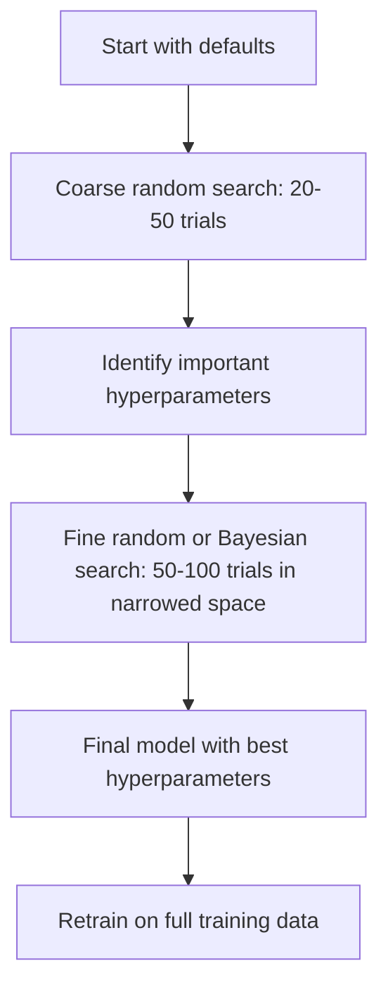
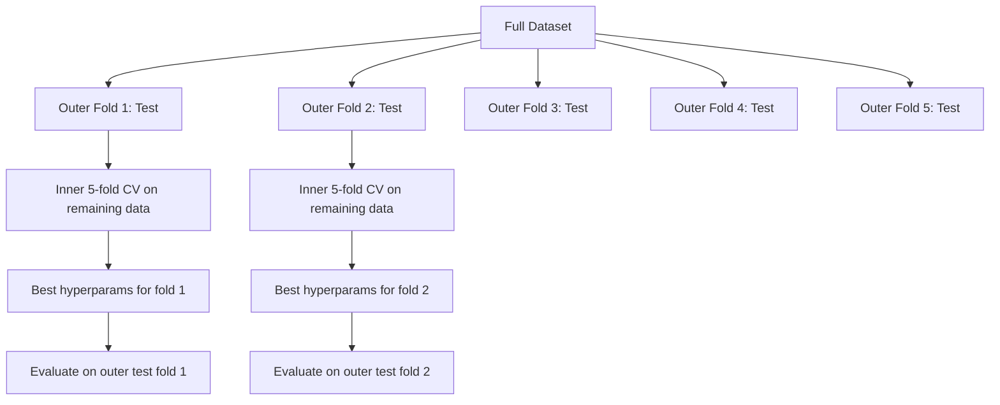

# हाइपरपरपरमीटर ट्यूनिंग

> हाइपरपरमैटर्स ही प्रशिक्षण शुरू करने से पहले आप किस मोड़ को समायोजित करना चाहते हैं।

**Type:** Build
**Language:**पायथन
**Prerequisites:** Phase 2, Lesson 11 (Ensemble Methods)
**Time:** ~90 分钟

## 学习目标
- शून्य से क्रश खोज, यादृच्छिक खोज और बेयिसियन अनुकूलन को प्राप्त करने से, और उनके लिए नमूना दक्षता की तुलना करें
-  समझाएँ कि जब अधिकांश हाइपरपरपैरामीटर का वैधता आयाम कम होता है, तो यादृच्छिक खोज ग्रिड खोज से बेहतर होती है
- उपयोग सरोगेट मॉडल 和 अधिग्रहण समारोह  निर्माण Bayesian अनुकूलन  चक्र  मार्गदर्शन खोज
- डिजाइन एक हाइपरपरमैटर ट्यूनिंग  रणनीति, अनुकूली सत्यापन के माध्यम से  वैधता सेट से बचें  अतिअनुकूली

## 问题
आपके ग्रेडिएंट बूस्टिंग  मॉडल में सीखने की दर है  वृक्षों की संख्या  अधिकतम गहराई  मिन प्रति पत्ती  सबसैम्पल अनुपात 和 स्तंभ नमूना अनुपात  ये भी छह हाइपरपरमैटर हैं  यदि प्रत्येक में 5  उचित  मूल्य है, तो ग्रिड में 5^6 = 15,625  组合  है  प्रत्येक प्रशिक्षण में 10 सेकंड  सभी प्रयासों को एक बार फिर से करने की आवश्यकता है  43 小时的计算时间 

ग्रिड खोज सबसे सीधा तरीका है, आकार में बदलाव के बाद सबसे खराब तरीका है। रैंडम खोज कम गणना मात्रा के साथ बेहतर हो सकती है।

## 概念
### पैरामीटर बनाम हाइपरपरपरमीटर

पैरामीटर प्रशिक्षण के दौरान सीखने के लिए प्राप्त होते हैं (उच्चतम पैरामीटर प्रशिक्षण शुरू करने के लिए निर्धारित होते हैं, ताकि सीखने के लिए यह नियंत्रित किया जा सके कि यह कैसे होता है)

| Hyperparameter | 控制什么 | 典型范围 |
|---------------|-----------------|---------------|
| Learning rate | 每次更新的步长 | 0.001 到 1.0 |
| Number of trees/epochs | 训练时长 | 10 到 10,000 |
| Max depth | 模型复杂度 | 1 到 30 |
| Regularization (lambda) | 防止过拟合 | 0.0001 到 100 |
| Batch size | Gradient 估计噪声 | 16 到 512 |
| Dropout rate | 被丢弃的 neurons 比例 | 0.0 到 0.5 |

### ग्रिड खोज

ग्रिड खोज प्रत्येक प्रकार के संयोजन का मूल्यांकन करेगी। यह सरल है, लेकिन हाइपरपरमैटर्स के साथ संख्यात्मक रूप से वृद्धि होगी।

```
Grid for 2 hyperparameters:

  learning_rate: [0.01, 0.1, 1.0]
  max_depth:     [3, 5, 7]

  Evaluations: 3 x 3 = 9 combinations

  (0.01, 3)  (0.01, 5)  (0.01, 7)
  (0.1,  3)  (0.1,  5)  (0.1,  7)
  (1.0,  3)  (1.0,  5)  (1.0,  7)
```

ग्रिड खोज में एक मौलिक कमी हैः यदि एक हाइपरपैरामीटर  महत्वपूर्ण है, जबकि दूसरा महत्वपूर्ण नहीं है, तो अधिकांश मूल्यांकन बर्बाद हो जाएंगे।

### यादृच्छिक खोज

यादृच्छिक खोज ग्रिड से मध्य मूल्य नहीं है, बल्कि वितरण से हाइपरपैरामीटर का नमूना है। इसी तरह 9 बार मूल्यांकन के बजट में, प्रत्येक हाइपरपैरामीटर को 9 अद्वितीय मूल्य प्राप्त हो सकता है।



क्यों यादृच्छिक 会胜过网(Bergstra & Bengio, 2012):

- अधिकांश हाइपरपरमैटर्स का प्रभावी आयाम बहुत कम है।
- ग्रिड खोज अपूर्ण परिमाणों में घाटे का आकलन करेगी।
- इसी बजट में, यादृच्छिक खोज महत्वपूर्ण आयामों को अधिक घनत्व से कवर करेगी।
- 60 बार यादृच्छिक परीक्षणों में नीचे, यदि खोज स्थान में सबसे अच्छा बिंदु है, आप 95% संभावना है एक दूरी सबसे अच्छा 5% के भीतर बिंदु खोजने के लिए है।

### बेयसियन अनुकूलन

यादृच्छिक खोज परिणामों को अनदेखा करेगी। यह उच्च सीखने की दरों तक नहीं सीखता है, इससे विचलन होगा, न ही गहराई तक सीखता है। 3 गहराई से बेहतर है। 10।



两个关键组件:

**Surrogate model:**एक मूल्यांकन लागत कम मॉडल (आमतौर पर गौसी प्रक्रिया) निकट-महंगी उद्देश्य कार्य के लिए उपयोग किया जाता है। यह खोज स्थान के किसी भी बिंदु पर पूर्वानुमान और अनिश्चितता अनुमान देता है।

**Acquisition function:**通过平衡利用 (在已知好点附近搜索) और अन्वेषण (在不确定性高的区域搜索) ,决定下一步评估哪里──常见选择包括:

- **Expected Improvement (EI):**हम अनुमान है कि यह बिंदु वर्तमान के मुकाबले अधिकतम मूल्य में वृद्धि कर सकता है?
- **Upper Confidence Bound (UCB):**预测值加上某倍数不确定性――更高的UCB表示这个点有潜力,或还没有充分探索――
- **Probability of Improvement (PI):**इस बिंदु से वर्तमान सर्वोत्तम मूल्य की संभावना कितनी है?

बेयसियन अनुकूलन आमतौर पर यादृच्छिक खोज की तुलना में 2-5 गुना कम मूल्यांकन के अवसरों से बेहतर हाइपरपैरामीटर खोजने में मदद करता है।

### जल्दी रुकना

यह एक हाइपरपरमैटर खोज है जो भाषा के संदर्भ में जल्दी रुकती है।

策略:
- **Patience-based:**यदि सत्यापन हानि 连续 N 个时代 没有提升,就停止
- **Median pruning:**यदि किसी परीक्षण के मध्य परिणाम उसी चरण के मुकाबले परीक्षण के मध्य परिणाम से कम हैं, तो रुकें।
- **Hyperband:**अनेक आवंटन को छोटे बजट से आवंटित किया जाए, फिर धीरे-धीरे सर्वोत्तम आवंटन के बजट में वृद्धि की जाए

हाइपरबैंड 尤其有效── यह पहले 1 युग का उपयोग करता है  81 配置 को प्रारंभ करने, पहले तीनों को आरक्षित करने, उन्हें 3 युगों को पुनः आरक्षित करने, पहले तीनों को पुनः आरक्षित करने, इस प्रकार के सुझावों के अनुसार।

### सीखने की दरों के अनुसूचक

सीखने की दर  लगभग हमेशा सबसे महत्वपूर्ण हाइपरपैरामीटर होती है, जो कि तय होती रहती है, जैसे कि प्रशिक्षण के दौरान इसे समायोजित करने के लिए समय सारिणी का उपयोग किया जाता है

| Scheduler | Formula | 何时使用 |
|-----------|---------|-------------|
| Step decay | 每 N 个 epochs 乘以 0.1 | 经典 CNN 训练 |
| Cosine annealing | lr * 0.5 * (1 + cos(pi * t / T)) | 现代默认选择 |
| Warmup + decay | 先线性增加，再 cosine decay | Transformers |
| One-cycle | 在一个 cycle 内先增加再减少 | 快速收敛 |
| Reduce on plateau | 指标停滞时按因子降低 | 稳妥默认选择 |

### हाइपरपरपरमीटर महत्व

सभी हाइपरपरपैरामीटर समान रूप से महत्वपूर्ण नहीं हैं।

**高重要性：**
- सीखने की दर (始终优先调)
- अनुमानकों की संख्या / युगों(उपयोग जल्दी रुकने, बजाय调它)
- नियमन शक्ति

**中等重要性：**
- अधिकतम गहराई / परतों की संख्या
- प्रति पत्ती/वजन क्षय प्रति न्यूनतम नमूने
- उप-समुदा अनुपात

**低重要性：**
- अधिकतम विशेषताएं( यादृच्छिक जंगलों के लिए)
- 具体 सक्रियण फ़ंक्शन 的选择
- बैच आकार ((在合理范围内)

पहले महत्वपूर्ण, शेष बरकरार रखा गया है।

### व्यावहारिक रणनीति



具体工作流:

1. **从库的默认值开始。**उन्हें अनुभवी प्रैक्टिशनरों द्वारा चुना जाता है, आमतौर पर 80% प्रभाव प्राप्त होता है
2. **粗粒度 random search。**प्रयोग व्यापक दायरा,20-50 बार परीक्षणों──उपस्थित रोकथाम के साथ 快速终止差的跑步──
3. **分析结果。** कौन से हाइपरपरपैरामीटर प्रदर्शन से संबंधित हैं?
4. **精细搜索。**संकुचित के बाद के अंतरिक्ष में बेयिसियन अनुकूलन या फोकस के यादृच्छिक खोजों का उपयोग करना  50-100 बार परीक्षण 
5. **使用找到的最佳 hyperparameters 在全部训练数据上重新训练。**

### क्रॉस-वैलिडेशन 集成

एक ही सत्यापन विभाजन में ऊपर调 hyperparameters 有风险――उत्कृष्ट हाइपरपरमैटर्स हो सकता है कि विशिष्ट सत्यापन तह में अनुकूलित हो――निहित क्रॉस-वैलिडेशन 通过使用两层循环解决这个问题:

- **Outer loop**(आवेदन): डेटा को ट्रेन+वॉल एवं परीक्षण में विभाजित किया जाएगा।
- **Inner loop**(调优):将 train+val 拆分为 train 和 val── सर्वोत्तम हाइपरपरपरमीटर्स को खोजने हेतु



प्रत्येक बाहरी तह शहर स्वतंत्र रूप से अपने सर्वश्रेष्ठ हाइपरपैरामीटर ढूंढता है।

उपयोग करें

```python
from sklearn.model_selection import cross_val_score, GridSearchCV
from sklearn.ensemble import GradientBoostingRegressor

inner_cv = GridSearchCV(
    GradientBoostingRegressor(),
    param_grid={
        "learning_rate": [0.01, 0.05, 0.1],
        "max_depth": [2, 3, 5],
        "n_estimators": [50, 100, 200],
    },
    cv=5,
    scoring="neg_mean_squared_error",
)

outer_scores = cross_val_score(
    inner_cv, X, y, cv=5, scoring="neg_mean_squared_error"
)

print(f"Nested CV MSE: {-outer_scores.mean():.4f} +/- {outer_scores.std():.4f}")
```

यह बहुत महंगा है ((5 बाहरी फोल्ड x 5 आंतरिक फोल्ड x 27 ग्रिड अंक = 675 बार मॉडल फिट), लेकिन यह विश्वसनीय प्रदर्शन अनुमान दे सकता है।

### व्यावहारिक सुझाव

**从 learning rate 开始。**ग्रेडिएंट आधारित विधि के लिए, यह हमेशा सबसे महत्वपूर्ण हाइपरमैटर होता है। खराब सीखने की दर अन्य सभी सेटिंग्स को अर्थहीन बना देगी। पहले अन्य हाइपरमैटर को डिफ़ॉल्ट मान के रूप में तय कर लें, और सीखने की दर को स्कैन करें।

**对 learning rate 和 regularization 使用 log-uniform distributions。**0.001 और 0.01 के बीच अंतर, 0.1 और 1.0 के बीच अंतर के साथ समान रूप से महत्वपूर्ण है।

**使用 early stopping，而不是调 n_estimators。**जैसे कि, n_estimators या epochs 设置较高, जल्दी रोकना तय करें कि किस समय रुकना है।

**预算分配。**60% को सुधारने के बजट को सबसे महत्वपूर्ण पहले 2 हाइपरपरमैटर्स पर खर्च किया गया है। शेष 40% को अन्य सभी तत्वों पर उपयोग किया गया है।

**尺度很重要。**永远不要在日志尺度上搜索批量尺度(16、32、64 就可以) ∼始终在日志尺度上搜索学习率──让搜索分布匹配超参数 影响模型的方式──

| Model Type | Top Hyperparameters | Recommended Search | Budget |
|-----------|--------------------|--------------------|--------|
| Random Forest | n_estimators, max_depth, min_samples_leaf | Random search，50 次 trials | 低（训练快） |
| Gradient Boosting | learning_rate, n_estimators, max_depth | Bayesian，100 次 trials + early stopping | 中 |
| Neural Network | learning_rate, weight_decay, batch_size | Bayesian 或 random，100+ 次 trials | 高（训练慢） |
| SVM | C, gamma (RBF kernel) | 在 log scale 上 grid，25-50 次 trials | 低（2 个参数） |
| Lasso/Ridge | alpha | 在 log scale 上 1D search，20 次 trials | 很低 |
| XGBoost | learning_rate, max_depth, subsample, colsample | Bayesian，100-200 次 trials + early stopping | 中 |

**拿不准时：**प्रयोग यादृच्छिक खोज, प्रयोग संख्या कम से कम हाइपरपरमैटर संख्या के 2 倍 ((उदाहरण के लिए, 6 个 हाइपरमैटर = कम से कम 12 बार परीक्षण) 


```figure
k-fold-cv
```

##  इसे निर्माण
### 步骤 1: शून्य से क्रियान्वयन ग्रिड खोज

`code/tuning.py`मध्य कोड ने शून्य से ग्रिड खोज, यादृच्छिक खोज और एक सरल बेयिसियन अनुकूलक को प्राप्त किया है।

```python
def grid_search(model_fn, param_grid, X_train, y_train, X_val, y_val):
    keys = list(param_grid.keys())
    values = list(param_grid.values())
    best_score = -float("inf")
    best_params = None
    n_evals = 0

    for combo in itertools.product(*values):
        params = dict(zip(keys, combo))
        model = model_fn(**params)
        model.fit(X_train, y_train)
        score = evaluate(model, X_val, y_val)
        n_evals += 1

        if score > best_score:
            best_score = score
            best_params = params

    return best_params, best_score, n_evals
```

### 步骤 2: शून्य से रैंडम खोज को प्राप्त करना

```python
def random_search(model_fn, param_distributions, X_train, y_train,
                  X_val, y_val, n_iter=50, seed=42):
    rng = np.random.RandomState(seed)
    best_score = -float("inf")
    best_params = None

    for _ in range(n_iter):
        params = {k: sample(v, rng) for k, v in param_distributions.items()}
        model = model_fn(**params)
        model.fit(X_train, y_train)
        score = evaluate(model, X_val, y_val)

        if score > best_score:
            best_score = score
            best_params = params

    return best_params, best_score, n_iter
```

### 步骤 3:बेईशियन अनुकूलन (बॉक्सिंग)

核心思想:将高斯过程 拟合到已观测的(हायपरमीटर, स्कोर)配对上, फिर अधिग्रहण फ़ंक्शन के साथ निर्णय अगले चरण को देखना

```python
class SimpleBayesianOptimizer:
    def __init__(self, search_space, n_initial=5):
        self.search_space = search_space
        self.n_initial = n_initial
        self.X_observed = []
        self.y_observed = []

    def _kernel(self, x1, x2, length_scale=1.0):
        dists = np.sum((x1[:, None, :] - x2[None, :, :]) ** 2, axis=2)
        return np.exp(-0.5 * dists / length_scale ** 2)

    def _fit_gp(self, X_new):
        X_obs = np.array(self.X_observed)
        y_obs = np.array(self.y_observed)
        y_mean = y_obs.mean()
        y_centered = y_obs - y_mean

        K = self._kernel(X_obs, X_obs) + 1e-4 * np.eye(len(X_obs))
        K_star = self._kernel(X_new, X_obs)

        L = np.linalg.cholesky(K)
        alpha = np.linalg.solve(L.T, np.linalg.solve(L, y_centered))
        mu = K_star @ alpha + y_mean

        v = np.linalg.solve(L, K_star.T)
        var = 1.0 - np.sum(v ** 2, axis=0)
        var = np.maximum(var, 1e-6)

        return mu, var

    def _expected_improvement(self, mu, var, best_y):
        sigma = np.sqrt(var)
        z = (mu - best_y) / (sigma + 1e-10)
        ei = sigma * (z * norm_cdf(z) + norm_pdf(z))
        return ei

    def suggest(self):
        if len(self.X_observed) < self.n_initial:
            return sample_random(self.search_space)

        candidates = [sample_random(self.search_space) for _ in range(500)]
        X_cand = np.array([to_vector(c) for c in candidates])
        mu, var = self._fit_gp(X_cand)
        ei = self._expected_improvement(mu, var, max(self.y_observed))
        return candidates[np.argmax(ei)]

    def observe(self, params, score):
        self.X_observed.append(to_vector(params))
        self.y_observed.append(score)
```

GP surrogate में प्रत्येक उम्मीदवार बिंदु दो तरह की चीजें देते हैंः预测分数(mu) 和不确定性(var) ―― अपेक्षित सुधार 会平衡二者:它偏好模型预测高分的点,或不确定性高的点── शुरुआती अधिकांश बिंदुओं में अधिक अनिश्चितता होती है, इसलिए अनुकूलक करेगा अन्वेषण──后期则将集中到最有望的区域──

### 步骤 4: सभी विधियों की तुलना करें

एक ही सिंथेटिक उद्देश्य में ऊपर तीन तरीके से काम करते हैं并比较── यह तुलना एक सरलीकृत रैपर का उपयोग करके होती है, सीधे उद्देश्य फ़ंक्शन के साथ 调用每个优化器(没有模型训练), इसलिए एपीआई ऊपर मॉडल आधारित 实现 से भिन्न हैः

```python
def synthetic_objective(params):
    lr = params["learning_rate"]
    depth = params["max_depth"]
    return -(np.log10(lr) + 2) ** 2 - (depth - 4) ** 2 + 10

param_grid = {
    "learning_rate": [0.001, 0.01, 0.1, 1.0],
    "max_depth": [2, 3, 4, 5, 6, 7, 8],
}

grid_best = None
grid_score = -float("inf")
grid_history = []
for combo in itertools.product(*param_grid.values()):
    params = dict(zip(param_grid.keys(), combo))
    score = synthetic_objective(params)
    grid_history.append((params, score))
    if score > grid_score:
        grid_score = score
        grid_best = params

param_dist = {
    "learning_rate": ("log_float", 0.001, 1.0),
    "max_depth": ("int", 2, 8),
}

rand_best = None
rand_score = -float("inf")
rand_history = []
rng = np.random.RandomState(42)
for _ in range(28):
    params = {k: sample(v, rng) for k, v in param_dist.items()}
    score = synthetic_objective(params)
    rand_history.append((params, score))
    if score > rand_score:
        rand_score = score
        rand_best = params

optimizer = SimpleBayesianOptimizer(param_dist, n_initial=5)
bayes_history = []
for _ in range(28):
    params = optimizer.suggest()
    score = synthetic_objective(params)
    optimizer.observe(params, score)
    bayes_history.append((params, score))
bayes_score = max(s for _, s in bayes_history)

print(f"{'Method':<20} {'Best Score':>12} {'Evaluations':>12}")
print("-" * 50)
print(f"{'Grid Search':<20} {grid_score:>12.4f} {len(grid_history):>12}")
print(f"{'Random Search':<20} {rand_score:>12.4f} {len(rand_history):>12}")
print(f"{'Bayesian Opt':<20} {bayes_score:>12.4f} {len(bayes_history):>12}")
```

उसी बजट में, बेईशियन अनुकूलन आमतौर पर सबसे तेजी से सर्वोत्तम स्कोर ढूंढ सकता है, क्योंकि यह स्पष्ट रूप से खराब क्षेत्र में घाटे का आकलन नहीं करेगा।

## इसका उपयोग करें
### अभ्यास में ओप्टुना

Optuna is strict hyperparameter tuning                                                                                                                                                                                                                                                          

```python
import optuna

def objective(trial):
    lr = trial.suggest_float("learning_rate", 1e-4, 1e-1, log=True)
    n_est = trial.suggest_int("n_estimators", 50, 500)
    max_depth = trial.suggest_int("max_depth", 2, 10)

    model = GradientBoostingRegressor(
        learning_rate=lr,
        n_estimators=n_est,
        max_depth=max_depth,
    )
    model.fit(X_train, y_train)
    return mean_squared_error(y_val, model.predict(X_val))

study = optuna.create_study(direction="minimize")
study.optimize(objective, n_trials=100)

print(f"Best params: {study.best_params}")
print(f"Best MSE: {study.best_value:.4f}")
```

Optuna की महत्वपूर्ण विशेषताएंः
- `suggest_float(..., log=True)`उपयोग करने के लिए सबसे उपयुक्त लॉग पैमाने पर ऊपर खोज के पैरामीटर (शिक्षा दर, विनियमन)
- `suggest_int`पूर्णांक पैरामीटर के लिए उपयोग करें
- `suggest_categorical`उपयोग करने के लिए अलग चयन
- 内置 मध्यम धावक, खराब परीक्षणों के लिए उपयोग किया जाता है  प्रारंभिक रोकना
- `study.trials_dataframe()`विश्लेषण के लिए उपयोग किया जाता है

### कटाई के साथ ओप्टुना

कटाई 会提前停止无希望的试验, इस प्रकार भारी मात्रा में गणना को बचाने के लिएः

```python
import optuna
from sklearn.model_selection import cross_val_score

def objective(trial):
    params = {
        "learning_rate": trial.suggest_float("lr", 1e-4, 0.5, log=True),
        "max_depth": trial.suggest_int("max_depth", 2, 10),
        "n_estimators": trial.suggest_int("n_estimators", 50, 500),
        "subsample": trial.suggest_float("subsample", 0.5, 1.0),
    }

    model = GradientBoostingRegressor(**params)
    scores = cross_val_score(model, X_train, y_train, cv=3,
                             scoring="neg_mean_squared_error")
    mean_score = -scores.mean()

    trial.report(mean_score, step=0)
    if trial.should_prune():
        raise optuna.TrialPruned()

    return mean_score

pruner = optuna.pruners.MedianPruner(n_startup_trials=10, n_warmup_steps=5)
study = optuna.create_study(direction="minimize", pruner=pruner)
study.optimize(objective, n_trials=200)
```

`MedianPruner`एक परीक्षण में एक परीक्षण के मध्य मूल्य एक ही चरण में सभी परीक्षणों के मध्य मूल्य के साथ समाप्त होता है।`trial.report()`报告中间指标,并调用 `trial.should_prune()`जांच करें कि क्या यह परीक्षण रुकना चाहिए।`n_startup_trials=10` सुनिश्चित करें कि कम से कम 10 परीक्षण  पूर्ण पूर्ण होने के बाद, काटना 才会启动── यह आमतौर पर 40 से 60% की कुल गणना मात्रा को बचा सकता है──

### sklearn के अंतर्निहित ट्यूनेर

                                                                                                                                                                                                                                                              `GridSearchCV``RandomizedSearchCV`和 `HalvingRandomSearchCV`:

```python
from sklearn.model_selection import RandomizedSearchCV
from scipy.stats import loguniform, randint

param_dist = {
    "learning_rate": loguniform(1e-4, 0.5),
    "max_depth": randint(2, 10),
    "n_estimators": randint(50, 500),
}

search = RandomizedSearchCV(
    GradientBoostingRegressor(),
    param_dist,
    n_iter=100,
    cv=5,
    scoring="neg_mean_squared_error",
    random_state=42,
    n_jobs=-1,
)
search.fit(X_train, y_train)
print(f"Best params: {search.best_params_}")
print(f"Best CV MSE: {-search.best_score_:.4f}")
```

सीखने की दर तथा नियमितता के लिए प्रयोग स्किप`loguniform`△ पूरे संख्या में हाइपरपरमैटर्स प्रयोग `randint``n_jobs=-1`标志会在所有CPU核心上并行──

### हाइपरपरपरमीटर ट्यूनिंग 中的常见错误

**通过 preprocessing 产生 data leakage。**यदि आप क्रॉस-वैलिडेशन में पहले से ही पूरा डेटासेट ऊपर फिट एक स्केलर, वैलिडेशन तह की जानकारी हो जाएगा प्रशिक्षण में लीक`Pipeline`, तो यह केवल प्रशिक्षण तह में ऊपर फिट बैठता है.

**对 validation set 过拟合。**运行数千次试验 实际上等于在验证集上训练――最终性能估计应使用嵌套交叉验证,或者留出一个在调优期间从未触碰的独立测试集――

**搜索范围太窄。**यदि आपका सर्वोत्तम मूल्य खोज स्थान की सीमा पर स्थित है, तो खोज क्षेत्र पर्याप्त व्यापक नहीं है।

**忽略交互效应。**बढ़ते समय, सीखने की दर और अनुमानकों की संख्या में मजबूत संबंध हैं।

**没有对 iterative models 使用 early stopping。**ग्रेडिएंट बूस्टिंग तथा न्यूरल नेटवर्क के लिए, n_estimators या epochs  सेट करना अधिक उच्च मूल्य के लिए तथा प्रारंभिक रोक का उपयोग करना 

## अभ्यास
1. उसी कुल बजट के साथ रैंडम सर्च और रैंडम सर्च (उदाहरण के लिए 50 बार मूल्यांकन) ◊ तुलना करें सबसे अच्छा प्रतिशत मिला ◊ विभिन्न बीज के साथ प्रयोग करें 10 बार ◊ रैंडम सर्च  कितनी बार जीत?

2. शून्य से हाइपरबैंड को प्राप्त करने से, प्रत्येक प्रशिक्षण में 81 विन्यासों की शुरुआत होती है, प्रत्येक प्रशिक्षण में 1 युग होता है। प्रति चरण प्रति प्रति चरण 1/3 तक बढ़ जाएगा।

3. 给课11 中的梯度提升 实现添加一个学习率调度器 (学习率调度器) 

4. प्रयोग Optuna 在真实数据集 (उदाहरण के लिए, स्तन कैंसर डेटासेट)`optuna.visualization.plot_param_importances(study)`查看哪些超参数最重要―― यह इस वर्ग में महत्व क्रम से मेल खाता है?

5. 实现一个简单的收购功能(预期改善),并演示探索与利用――绘制替代模型的平均值和不确定性,并演示 EI 选择下一步评估的位置──

## 关键术语
| Term | 人们通常说 | 实际含义 |
|------|----------------|----------------------|
| Hyperparameter | “你选择的一个设置” | 训练前设置的值，用来控制学习过程，不是从数据中学习得到的 |
| Grid search | “尝试每一种组合” | 在指定 parameter grid 上进行穷举搜索。成本呈指数级增长。 |
| Random search | “就是随机采样” | 从分布中采样 hyperparameters。比 grid search 更好地覆盖重要维度。 |
| Bayesian optimization | “智能搜索” | 使用 objective 的 surrogate model 来决定下一步评估哪里，平衡 exploration 和 exploitation |
| Surrogate model | “一个便宜的近似” | 一个模型（通常是 Gaussian process），根据已观测评估来近似昂贵的 objective function |
| Acquisition function | “下一步看哪里” | 通过平衡 expected improvement 和不确定性，为候选点打分。EI 和 UCB 是常见选择。 |
| Early stopping | “停止浪费时间” | 当 validation performance 停止提升时，提前终止训练 |
| Hyperband | “配置的锦标赛分组” | 自适应资源分配：用小预算启动许多 configs，保留最好的并增加它们的预算 |
| Learning rate scheduler | “训练期间改变 lr” | 一个函数，用于在训练过程中调整 learning rate，以获得更好的收敛 |

## 延伸阅读
- [Bergstra & Bengio: Random Search for Hyper-Parameter Optimization (2012)](https://jmlr.org/papers/v13/bergstra12a.html)-- 证明 胜过网 的论文
- [Snoek et al., Practical Bayesian Optimization of Machine Learning Algorithms (2012)](https://arxiv.org/abs/1206.2944)-- ML के लिए बेयिसियन अनुकूलन के लिए उपयोग किया
- [Li et al., Hyperband: A Novel Bandit-Based Approach (2018)](https://jmlr.org/papers/v18/16-558.html)-- हाइपरबैंड 论文
- [Optuna: A Next-generation Hyperparameter Optimization Framework](https://arxiv.org/abs/1907.10902)-- ओप्टुना 论文
- [Probst et al., Tunability: Importance of Hyperparameters (2019)](https://jmlr.org/papers/v20/18-444.html)-- 哪些 हाइपरपरपरमीटर्स  महत्वपूर्ण
