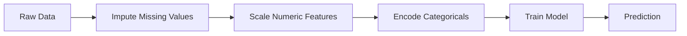
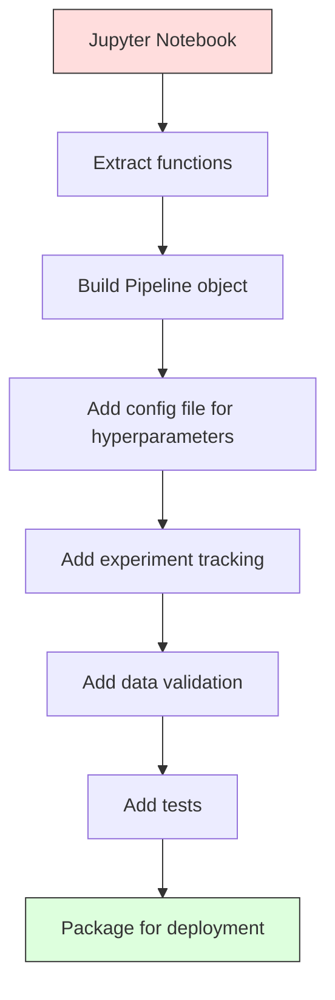

# एमएल पाइपलाइन

> 模型不是产品──パイプライン 才是──パイプलाइन 覆盖从原始数据到部署的预测的全部过程,并且每一步都必须可复现──

**Type:** Build
**Language:**पायथन
**Prerequisites:** Phase 2, Lesson 12 (Hyperparameter Tuning)
**Time:** ~120 minutes

## 学习目标
- शून्य से एक एमएल पाइपलाइन का निर्माण, इम्प्यूटेशन, स्केलिंग, एन्कोडिंग और मॉडल प्रशिक्षण 串联成一个可复现的单一对象
-  पहचान डेटा रिसाव  परिदृश्य,并 व्याख्या पाइपलाइन  कैसे केवल प्रशिक्षण डेटा के माध्यम से अप करने के लिए तैयार ट्रांसफार्मर रिसाव को रोकने के लिए
-  एक स्तंभ ट्रांसफार्मर का निर्माण करें, संख्यात्मक और श्रेणीगत सुविधाओं के लिए  विभिन्न पूर्व प्रसंस्करण लागू करें
- पाइपलाइन के क्रमबद्धीकरण को प्राप्त करना, तथा एक ही तैयार पाइपलाइन के साथ प्रशिक्षण एवं उत्पादन में एक समान परिणाम प्राप्त करना

## 问题
आप एक नोटबुक हैः यह डेटा लोड, माध्यम के साथ पूर्ण करने के लिए गायब मान, संकुचित सुविधाओं, प्रशिक्षण मॉडल, और सटीकता मुद्रण.

एक महीने बाद, किसी ने पुनः प्रशिक्षण मॉडल, लेकिन अलग परिणाम प्राप्त किए। औसत परीक्षण डेटा के पूर्ण डेटासेट में शामिल है।

ये परिकल्पना नहीं हैं। ये उत्पादन में एमएल सिस्टम के विफल होने के सबसे आम कारण हैं।

## 概念
### पाइपलाइन क्या है

पाइपलाइन एक क्रमबद्ध डेटा परिवर्तन का एक समूह है, बाद में एक मॉडल। प्रत्येक चरण में एक चरण का आउटपुट एक इनपुट के रूप में होता है।



पाइपलाइन 保证:
- परिवर्तन केवल प्रशिक्षण डेटा पर निर्भर करता है
- इन्फेरेंस 时应用 पूरी तरह से समान परिवर्तन
-  संपूर्ण वस्तु को क्रमबद्ध किया जा सकता है, एक कलाकृतियों के रूप में 
- क्रॉस-वैलिडेशन प्रत्येक तह में पाइपलाइन में लागू होगा, छोटे लीक को रोकने के लिए

### डेटा लीक: चुपचाप हत्यारा

डेटा लीक परीक्षण सेट या भविष्य के डेटा में सूचना प्रदूषण प्रशिक्षण के दौरान होता है। पाइपलाइन सबसे आम लीक के रूप को रोक सकती है।

**Leaky（错误）：**
```python
X = df.drop("target", axis=1)
y = df["target"]

scaler = StandardScaler()
X_scaled = scaler.fit_transform(X)

X_train, X_test = X_scaled[:800], X_scaled[800:]
y_train, y_test = y[:800], y[800:]
```

स्केलर ने परीक्षण डेटा को देखा है। औसत और मानक विचलन में परीक्षण नमूने शामिल हैं।

**Correct：**
```python
X_train, X_test = X[:800], X[800:]

scaler = StandardScaler()
X_train_scaled = scaler.fit_transform(X_train)
X_test_scaled = scaler.transform(X_test)
```

उपयोग पाइपलाइन 时,你不需要专门思考这个问题―― पाइपलाइन 会自动处理――

### स्क्लेर्न पाइपलाइन

sklearn के `Pipeline`एक अनुमानक और एक संयोजन ट्रांसफार्मर. यह उजागर किया गया है.`.fit()``.predict()`和 `.score()`, क्रमशः सभी चरणों को लागू करें

```python
from sklearn.pipeline import Pipeline
from sklearn.preprocessing import StandardScaler
from sklearn.linear_model import LogisticRegression

pipe = Pipeline([
    ("scaler", StandardScaler()),
    ("model", LogisticRegression()),
])

pipe.fit(X_train, y_train)
predictions = pipe.predict(X_test)
```

जब आप调用 `pipe.fit(X_train, y_train)`时:
1. Scaler में X_train 上调用 `fit_transform`
2. मॉडल में पैमाने X_train 上调用 `fit`

जब आप调用 `pipe.predict(X_test)`时:
1. Scaler में X_test 上调用 `transform`(फिट_ट्रांसफॉर्म नहीं)
2. मॉडल में स्केल X_test 上调用 `predict`

स्केलर फिटिंग के दौरान कभी भी परीक्षण डेटा नहीं देखेगा।

### स्तंभट्रांसफार्मर:不同列使用不同管道

वास्तविक डेटासेट में संख्यात्मक और श्रेणीगत स्तंभ होते हैं, उन्हें अलग-अलग पूर्व प्रसंस्करण की आवश्यकता होती है।`ColumnTransformer` इस स्थिति को संभालने के लिए जिम्मेदार 

```python
from sklearn.compose import ColumnTransformer
from sklearn.preprocessing import StandardScaler, OneHotEncoder
from sklearn.impute import SimpleImputer

numeric_pipe = Pipeline([
    ("impute", SimpleImputer(strategy="median")),
    ("scale", StandardScaler()),
])

categorical_pipe = Pipeline([
    ("impute", SimpleImputer(strategy="most_frequent")),
    ("encode", OneHotEncoder(handle_unknown="ignore")),
])

preprocessor = ColumnTransformer([
    ("num", numeric_pipe, ["age", "income", "score"]),
    ("cat", categorical_pipe, ["city", "gender", "plan"]),
])

full_pipeline = Pipeline([
    ("preprocess", preprocessor),
    ("model", GradientBoostingClassifier()),
])
```

OneHotEncoder 中的 `handle_unknown="ignore"`उत्पादन के लिए महत्वपूर्ण है। जब नई श्रेणी (जैसे कि कभी नहीं देखी गई शहर) दिखाई देती है, तो यह एक पूर्ण शून्य वेक्टर उत्पन्न करती है, न कि सीधे टूटती है।

### प्रयोगों का पता लगाना

पाइपलाइन  प्रशिक्षण को पुनः प्राप्त करने के लिए, लेकिन आप भी परीक्षणों का पता लगाने की जरूरत है  के बीच क्या हुआः किस हाइपरपैरामीटर का उपयोग किया गया है                                                                                                                                                                                                                                                                                                                                                                                                                                                                                      

**MLflow**                                                                                                                                                                                                                                                                                                                                                                                                                                                                                                                             

```python
import mlflow

with mlflow.start_run():
    mlflow.log_param("max_depth", 5)
    mlflow.log_param("n_estimators", 100)
    mlflow.log_param("learning_rate", 0.1)

    pipe.fit(X_train, y_train)
    accuracy = pipe.score(X_test, y_test)

    mlflow.log_metric("accuracy", accuracy)
    mlflow.sklearn.log_model(pipe, "model")
```

प्रत्येक बार शहर में पैरामीटर, मेट्रिक्स, कलाकृतियों और पूर्ण मॉडल को रिकॉर्ड किया जाता है।

**Weights & Biases (wandb)**提供相同功能,并带有托管仪表板:

```python
import wandb

wandb.init(project="my-pipeline")
wandb.config.update({"max_depth": 5, "n_estimators": 100})

pipe.fit(X_train, y_train)
accuracy = pipe.score(X_test, y_test)

wandb.log({"accuracy": accuracy})
```

### मॉडल संस्करण

完成 प्रयोग ट्रैकिंग 之后, आपको मॉडल संस्करणों का प्रबंधन करने की आवश्यकता है. कौन सा मॉडल उत्पादन में है? कौन सा चरण में है? कौन सा उपयोग किया जाता है?

MLflow का मॉडल रजिस्ट्री 提供:
- **Version tracking:**प्रत्येक सहेजे गए मॉडल एक संस्करण संख्या प्राप्त होगा
- **Stage transitions:**"स्टेजिंग"、"प्रोडक्शन"、"आर्काइव्ड"
- **Approval workflow:**模型 को स्पष्ट रूप से उत्पादन में पदोन्नत किया जाना चाहिए
- **Rollback:**立即切回之前的版本

### डीवीसी के साथ डेटा वर्शनिंग

代码用 git做版本化──数据也应该被版本化,但 git 无法处理大文件──DVC (Data Version Control) 解决了这个问题──

```
dvc init
dvc add data/training.csv
git add data/training.csv.dvc data/.gitignore
git commit -m "Track training data"
dvc push
```

डीवीसी वास्तविक डेटा भंडारण को रिमोट स्टोरेज में रखता है (S3 ̊GCS ̊Azure) और एक बहुत छोटा सा रख देता है`.dvc`文件来记录哈什──当你支付出某 git commit 时,`dvc checkout`उस समय इस्तेमाल किए जाने वाले सटीक डेटा को पुनर्प्राप्त करेगा।

इसका मतलब है कि प्रत्येक गिट कॉम एक ही समय में कोड और डेटा को तय करता है।

### पुनः प्रयोज्य प्रयोग

एक प्रयोग करने योग्य 4 चीजें होती हैंः

1. **Fixed random seeds:** numpy、random 和 framework(torch、sklearn) सेट बीज
2. **Pinned dependencies:**उपयोग带精确版本的要求.txt या कविता.लॉक
3. **Versioned data:**डीवीसी या इसी तरह के उपकरण का उपयोग करें
4. **Config files:**सभी हाइपरपैरामीटर कॉन्फ़िग में रखा गया है, हार्ड कोड नहीं

```python
import numpy as np
import random

def set_seed(seed=42):
    random.seed(seed)
    np.random.seed(seed)
    try:
        import torch
        torch.manual_seed(seed)
        torch.cuda.manual_seed_all(seed)
        torch.backends.cudnn.deterministic = True
    except ImportError:
        pass
```

### नोटबुक से उत्पादन पाइपलाइन तक



典型演进过程:

1. **Notebook exploration:**快速 प्रयोग  दृश्य  विशेषता विचार
2. **Extract functions:**प्रसंस्करण से पहले, सुविधाओं की इंजीनियरिंग, मूल्यांकन, मॉड्यूल में स्थानांतरण
3. **Build Pipeline:**串联成 sklearn पाइपलाइन या कस्टम वर्ग में परिवर्तन
4. **Config management:**सभी हाइपरपरपैरामीटर को यैमएल/जेएसओएन कॉन्फ़िग में स्थानांतरित करें
5. **Experiment tracking:**添加 एमएलफ्लो या वैंडब लॉगिंग
6. **Data validation:**प्रशिक्षण में पूर्व जांच योजनाएँ, वितरण और यादृच्छिक मूल्य पैटर्न
7. **Tests:**ट्रांसफार्मर  इकाई परीक्षणों को तैयार करना, पूर्ण पाइपलाइन  एकीकरण परीक्षणों को तैयार करना
8. **Deployment:**पाइपलाइन को सीरियल बनाने के लिए API का उपयोग करें

### पाइपलाइन की आम गलतियाँ

| Mistake | Why it is bad | Fix |
|---------|-------------|-----|
| 在 splitting 前对完整数据 fitting | Data leakage | 使用带 cross_val_score 的 Pipeline |
| 在 Pipeline 外做 feature engineering | Train 与 serve 时 transforms 不一致 | 把所有 transforms 放入 Pipeline |
| 不处理 unknown categories | Production 中出现新值会崩溃 | OneHotEncoder(handle_unknown="ignore") |
| Hardcoded column names | schema 变化时会出错 | 从 config 使用 column name lists |
| 没有 data validation | bad data 会导致悄无声息的错误 predictions | 在 prediction 前添加 schema checks |
| Training/serving skew | 模型在 prod 中看到不同 features | training 和 serving 共用一个 Pipeline 对象 |


```figure
f3-pipeline-flow
```

##  इसे निर्माण
`code/pipeline.py`中的代码 शून्य से एक पूर्ण एमएल पाइपलाइन का निर्माणः

### 步骤 1: कस्टम ट्रांसफार्मर

```python
class CustomTransformer:
    def __init__(self):
        self.means = None
        self.stds = None

    def fit(self, X):
        self.means = np.mean(X, axis=0)
        self.stds = np.std(X, axis=0)
        self.stds[self.stds == 0] = 1.0
        return self

    def transform(self, X):
        return (X - self.means) / self.stds

    def fit_transform(self, X):
        return self.fit(X).transform(X)
```

### 步骤 2: शून्य से निर्माण पाइपलाइन

```python
class PipelineFromScratch:
    def __init__(self, steps):
        self.steps = steps

    def fit(self, X, y=None):
        X_current = X.copy()
        for name, step in self.steps[:-1]:
            X_current = step.fit_transform(X_current)
        name, model = self.steps[-1]
        model.fit(X_current, y)
        return self

    def predict(self, X):
        X_current = X.copy()
        for name, step in self.steps[:-1]:
            X_current = step.transform(X_current)
        name, model = self.steps[-1]
        return model.predict(X_current)
```

### 步骤 3: उपयोग पाइपलाइन  क्रॉस-वैलिडेशन करें

代码演示了使用管道的跨验证 如何防止数据泄漏:scaler 会分别在每个折的训练数据上合──

### 第4 步: उपयोग sklearn के पूर्ण उत्पादन पाइपलाइन

एक पूर्ण पाइपलाइन, शामिल `ColumnTransformer`、多条 पूर्व प्रसंस्करण पथ 和一个模型,并使用正确的交叉验证与实验记录 进行训练──

## 交付 यह
本课产出:
- `outputs/prompt-ml-pipeline.md`-- एमएल पाइपलाइन के निर्माण और परीक्षण के लिए कौशल
- `code/pipeline.py`-- एक पूर्ण पाइपलाइन, खरोंच से  निष्पादन करने के लिए  संस्करण

## अभ्यास
1. पाइपलाइन का निर्माण, 3 अंक स्तंभों तथा 2 श्रेणी स्तंभों के डेटासेट को संसाधित करना `ColumnTransformer`अंकशास्त्र के लिए  मध्यम इंपुटेशन + स्केलिंग का प्रयोग करें, श्रेणियों के लिए  सर्वाधिक आवृत्ति इंपुटेशन + एक-हॉट एन्कोडिंग का प्रयोग करें  पांच गुना क्रॉस-वैलिडेशन का उपयोग करें  अभ्यास करें 

2. इसलिए डेटा लीक का परिचय देनाः बिभाजन में पूर्व से पूर्ण डेटासेट फिट स्केलर── तुलना क्रॉस-वैलिडेशन स्कोर (लीक) और पाइपलाइन क्रॉस-वैलिडेशन स्कोर (प्यूरी)── क्या अंतर बड़ा है?

3. उपयोग `joblib.dump`अपने पाइपलाइन को क्रमबद्ध करें।

4.  Pipeline  एक कस्टम ट्रांसफार्मर जोड़ें, दो सबसे महत्वपूर्ण संख्यात्मक स्तंभों के लिए  बहुपद सुविधाएँ बनाएं डिग्री 2)── इसे Pipeline के किस स्थान पर रखा जाना चाहिए?

5.  पाइपलाइन  सेटिंग MLflow ट्रैकिंग── उपयोग विभिन्न हाइपरपैरामीटर 运行 5 बार प्रयोग── उपयोग MLflow UI(`mlflow ui`) तुलना करें,并选择最佳模型──

## 关键术语
| Term | What people say | What it actually means |
|------|----------------|----------------------|
| Pipeline | "Chain of transforms + model" | 一组有序的已拟合 transformers 和一个模型，作为一个整体应用以防止泄漏 |
| Data leakage | "Test info leaked into training" | 使用 training set 之外的信息构建模型，从而夸大 performance estimates |
| ColumnTransformer | "Different preprocessing per column" | 对不同列子集应用不同 Pipelines，并合并结果 |
| Experiment tracking | "Logging your runs" | 为每次 training run 记录 parameters、metrics、artifacts 和 code versions |
| MLflow | "Track and deploy models" | 用于 experiment tracking、model registry 和 deployment 的 open-source platform |
| DVC | "Git for data" | 面向 large data files 的 version control system，在 git 中存储 hashes，在 remote storage 中存储数据 |
| Model registry | "Model version catalog" | 使用 stage labels（staging、production、archived）追踪 model versions 的系统 |
| Training/serving skew | "It worked in the notebook" | Training 与 inference 期间数据处理方式存在差异，导致 silent errors |
| Reproducibility | "Same code, same result" | 使用相同代码、数据和配置获得完全相同结果的能力 |

## 延伸阅读
- [scikit-learn Pipeline docs](https://scikit-learn.org/stable/modules/compose.html)-- 官方 पाइपलाइन संदर्भ
- [MLflow documentation](https://mlflow.org/docs/latest/index.html)-- प्रयोगों का पता लगाना और मॉडल रजिस्ट्री
- [DVC documentation](https://dvc.org/doc)-- डेटा संस्करण
- [Sculley et al., Hidden Technical Debt in Machine Learning Systems (2015)](https://papers.nips.cc/paper/2015/hash/86df7dcfd896fcaf2674f757a2463eba-Abstract.html)--  ML प्रणालियों की जटिलता के बारे में उद्घाटनात्मक लेख
- [Google ML Best Practices: Rules of ML](https://developers.google.com/machine-learning/guides/rules-of-ml)-- 实用生产 ML 建议
