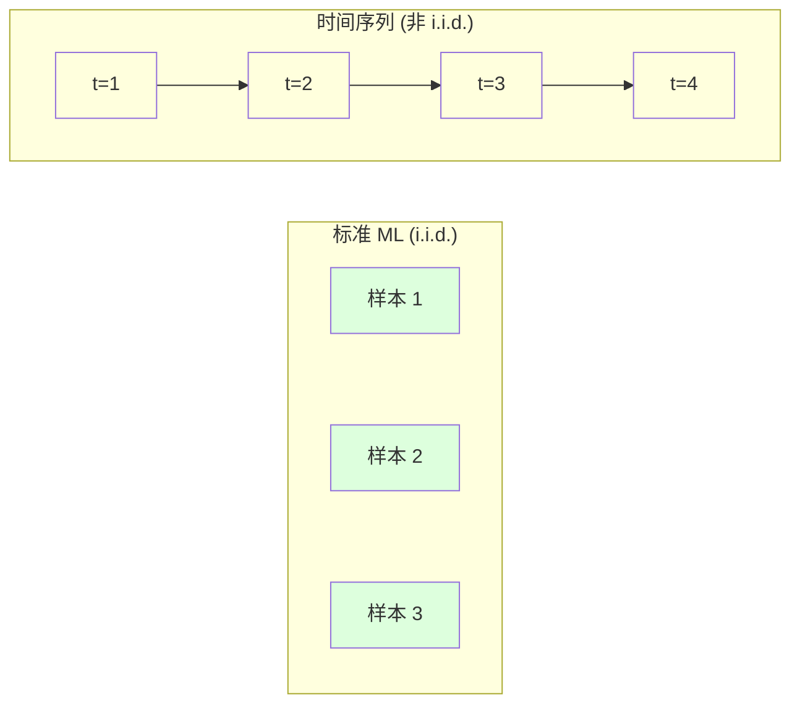
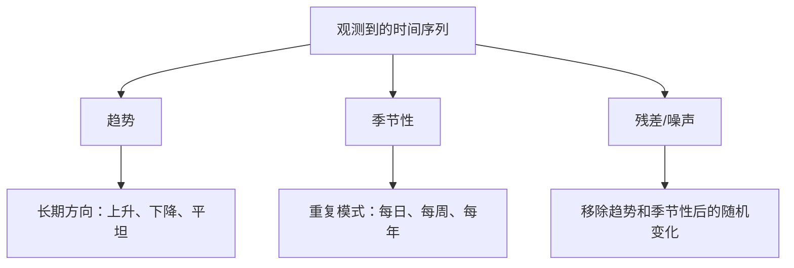
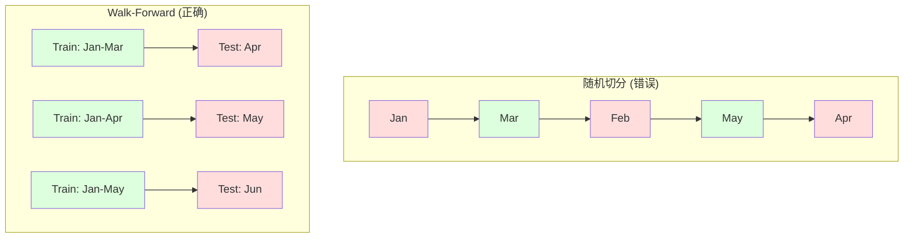

# समय क्रम आधार

>  अतीत के प्रदर्शन का भविष्यवाणी करना संभव है                                                                                                                                                                                                                                                          

**Type:** Build
**Language:**पायथन
**Prerequisites:** Phase 2, Lessons 01-09
**Time:** ~90 分钟

## 学习目标

- समय अनुक्रम को प्रवृत्ति, मौसमी और अवशिष्ट घटकों में विभाजित करना, और समतलता का परीक्षण करना
- ् ् ् ् ् ् ् ् ् ् ् ् ् ् ् ् ् ् ् ् ् ् ् ् ् ् ् ् ् ् ् ् ् ् ् ् ् ् ् ् ् ् ् ् ् ् ् ् ् ् ् ् ् ् ् ् ् ् ् ् ् ् ् ् ् ् ् ् ् ् ् ् ् ् ् ् ् ् ् ् ् ् ् ् ् ् ् ् ् ् ् ् ् ् ् ् ् ् ् ् ् ् ् ् ् ् ् ् ् ् ् ् ् ् ् ् ् ् ् ् ् ् ् ् ् ् ् ् ् ् ् ् ् ् ् ् ् ् ् ् ् ् ् ् ् ् ् ् ् ् ् ् ् ् ् ् ् ् ् ् ् ् ् ् ् ् ् ् ् ् ् ् ् ् ् ् ् ् ् ् ् ् ् ् ् ् ् ् ् ् ् ् ् ् ् ् ् ् ् ् ् ् ् ् ् ् ् ् ् ् ् ् ् ् ् ् ् ् ् ् ् ् ् ् ् ् ् ् ् ् ् ् ् ् ् ् ् ् ् ् ् ् ् ् ् ् ् ् ् ् ् ् ् ् ्
- संरचना आगे चल सत्यापन  फ्रेमवर्क, भविष्य में डेटा लीक को रोकने के लिए प्रशिक्षण में
-  समझाएँ कि समय अनुक्रम के लिए समय ट्रेन/परीक्षण विभाजन का प्रभाव क्यों नहीं पड़ता, और इसे सही समय अनुक्रम के साथ प्रदर्शन अंतर दिखाएँ

## 问题

आप समय के अनुसार क्रमबद्ध डेटा है। दैनिक बिक्री, प्रति घंटे तापमान, प्रति मिनट सीपीयू उपयोग दर, प्रति सप्ताह शेयर मूल्य। आप अगले मूल्य, अगले सप्ताह, अगले तिमाही का अनुमान लगाना चाहते हैं।

आप बाहर मानक ML 工具箱:随机 ट्रेन/टेस्ट विभाजन, पार-मान्यीकरण, इनपुट सुविधा मैट्रिक्स, आउटपुट भविष्यवाणी, प्रत्येक चरण गलत है।

 समय क्रम में मानदंडों को तोड़ना ML पर निर्भर करता है परिकल्पनाएँ  नमूना स्वतंत्र नहीं है  आज का तापमान कल के तापमान पर निर्भर करता है                                                                                                                                                                                                                                            

एक मॉडल जो 95% सटीकता प्राप्त करता है, सही समय आधारित मूल्यांकन के साथ केवल 55% संभव है। यह अंतर तकनीकी विवरण नहीं है। यह कागज पर उपयोग किए जाने वाले मॉडल और उत्पादन में उपयोग किए जाने वाले मॉडल के बीच अंतर है।

इस वर्ग में मूलभूत सामग्री शामिल हैः समय डेटा क्या है, कैसे ईमानदारी से मूल्यांकन मॉडल, और कैसे समय अनुक्रम को मानक एमएल मॉडल में परिवर्तित करने के लिए उपयोग की जा सकती है विशेषताएं।

## 概念

### समय क्रम क्या अलग है

标准 ML 假设 i.i.d. -- 独立同分布── प्रत्येक नमूना एक ही वितरण से निकाला गया है, और अन्य नमूनों से स्वतंत्र है── समय क्रम एक साथ इन दो बिंदुओं के विपरीत हैः

- **不独立。**आज की शेयर कीमतें कल की कीमतों पर निर्भर करती हैं।
- **不同分布。**12 महीने की बिक्री 3 महीने से अलग दिखती है।

ये उल्लंघन हल्के नहीं हैं। ये आपके लक्षण निर्माण के तरीके को बदल देंगे, मॉडल का मूल्यांकन करने के तरीके को, साथ ही साथ कौन से एल्गोरिदम उपयोग किए जा सकते हैं।



मानक एमएल में, नमूने परस्पर विनिमय योग्य हैं।

### समय क्रम का घटक भाग

प्रत्येक समय क्रम निम्नलिखित सामग्री का संयोजन हैः



- **趋势**:长期方向―― आय प्रतिवर्ष 10% बढ़े― वैश्विक तापमान में वृद्धि
- **季节性**: फिक्स्ड间隔上重复模式──零售销售在 12 月激增──空调使用量在 7 月达到峰值──
- **残差**: स्थानांतरण प्रवृत्ति एवं मौसमी अवशेष का भाग। यदि अवशेष सफेद शोर जैसा दिखता है, तो संकेत को विभाजित करके संकेत प्राप्त किया गया है।

### समतलता

यदि किसी समय क्रम की सांख्यिकीय विशेषताएं (उत्पादक मूल्य, अंतर, स्वयंसंबंधित) समय के साथ परिवर्तन नहीं करती हैं, तो यह समतुल्य है। अधिकांश पूर्वानुमान विधि समतुल्यता का अनुमान लगाती हैं।

**为什么重要：**असमान क्रम के औसत मूल्य में बदलाव होता है। जनवरी के आंकड़ों पर प्रशिक्षित मॉडल में, प्राप्त औसत मूल्य में 2 महीने के औसत मूल्य से भिन्नता होती है।

**如何检查：** विंडो पर रॉलिंग औसत और रॉलिंग मानक विचलन की गणना करें यदि वे भटकते हैं, तो क्रमहीन है

**如何修复：**差分── न建模原始值, बल्कि建模连续值 के बीच परिवर्तनः

```
diff[t] = value[t] - value[t-1]
```

यदि एक बार अंतर स्थिर नहीं हो पाता है तो इसे एक बार पुनः लागू करना चाहिए।

**示例：**

原始序列:[100, 102, 106, 112, 120]
एक वर्ग差分: [2, 4, 6, 8](अभी भी ऊपर की ओर बढ़ रहा है)
二阶差分: [2, 2, 2](常数 -- 平稳)

मूल क्रम में दोहरे प्रवृत्ति हैं। एक चरण में इसे एक रैखिक प्रवृत्ति में बदल दिया जाता है।

**形式化检验：**बढ़ी हुई डिकी-फुलर (एडीएफ) परीक्षण एक समतल स्थिरता मानक सांख्यिकीय परीक्षण है। मूल परिकल्पना एक क्रम है जो असमान है। 0.05 से कम के p-मूल्य का कहना है कि आप मूल परिकल्पना को अस्वीकार कर सकते हैं और एक समतल निष्कर्ष निकाल सकते हैं।

### से जुड़े हुए पृष्ठ

समय t के मूल्य और समय t-k  के मूल्य के बीच संबंध की डिग्री।

**ACF 告诉你：**
- 序列能记住多远── यदि ACF में 5 后降到零, तो 5 步前的值无关紧要──
- यदि ACF में 12 महीने के डेटा में देरी होती है तो वार्षिक मौसम की स्थिति होती है।
- ACF के उपयोग में देरी का समय आने तक उपयोग करना

**PACF (Partial Autocorrelation Function)**यदि आज 3 天前 से संबंधित है, केवल इसलिए कि दोनों कल से संबंधित हैं, तो 3 के PACF की देरी शून्य होगी, जबकि 3 के ACF की देरी शून्य नहीं होगी।

### 滞后特征:把时间序列转换为监督学习

标准 ML 模型 आवश्यकता विशेषता मैट्रिक्स X 和 लक्ष्य y ⋅ समय क्रम केवल आपको एक श्रेणी मूल्य देता है ⋅桥梁就是滞后特征──

取序列 [10, 12, 14, 13, 15],创建 lag-1 和 lag-2 विशेषताएं:

| lag_2 | lag_1 | target |
|-------|-------|--------|
| 10    | 12    | 14     |
| 12    | 14    | 13     |
| 14    | 13    | 15     |

现在你有一个标准回归问题――任何ML 模型(线性回归、随机森林、渐进增强) इन से 延误 预测 लक्ष्य──

आप अन्य विनिर्माण विशेषताएंः
- **Rolling statistics:**हाल के k 个值 के औसत ̊std、min、max
- **Calendar features:**星期几月份, यह छुट्टी है, यह सप्ताहांत है
- **Differenced values:**तुलना में ऊपर कदम की परिवर्तन
- **Expanding statistics:**累计平均 累计 योग
- **Ratio features:**当前值 / रोलिंग औसत (偏离近期平均值多远)
- **Interaction features:**lag_1 * दिन_of_week(工作日对动量的影响)

**多少个 lag？**उपयोग करें ऑटोकोरेलेशन फ़ंक्शन। यदि ACF तक की देरी 10 हैं, तो कम से कम 10  लेग का उपयोग करें। यदि周季节性 है, तो इसमें 7  लेग शामिल हो सकते हैं।

**target 对齐陷阱。** जब लैंडिंग विशेषताएं बनाई जाती हैं, तो लक्ष्य  समय t का मूल्य होना चाहिए, और सभी विशेषताएं समय t-1 या उससे पहले के मूल्य का उपयोग करना चाहिए। यदि आप समय t के मूल्य को एक विशेषता के रूप में शामिल करने में रुचि नहीं रखते हैं, तो आपके पास एक पूर्ण पूर्वानुमान है - साथ ही एक पूरी तरह से बेकार मॉडल है। यह समय अनुक्रम विशेषता परियोजना में सबसे आम त्रुटि है।

### आगे की पुष्टि

यह इस वर्ग की सबसे महत्वपूर्ण अवधारणा है। मानक के-गुना क्रॉस-वैलिडेशन में नमूने को ट्रेन और परीक्षण में आवंटित किया जाएगा। समय अनुक्रम के लिए, यह भविष्य की जानकारी को लीक करेगा।



आगे की वैधताः
1. में截止时间 t के डेटा पर प्रशिक्षण
2. 预测时间 t+1( या उपयोग के लिए多步预测的 t+1 तक t+k)
3. खिड़की को आगे ले जाने
4. 重复

प्रत्येक परीक्षण में केवल प्रशिक्षण के बाद के सभी डेटा शामिल हैं। भविष्य में कोई रिसाव नहीं है। यह आपको एक ईमानदार अनुमान देगा, मॉडल तैनाती के बाद प्रदर्शन कैसे होगा।

**Expanding window**प्रयोग सभी ऐतिहासिक डेटा अभ्यास करने के लिए**Sliding window**उपयोग फिक्स्ड बड़े आकार के प्रशिक्षण विंडो (Fixed Size Training Window) ️ विंडो स्लाइडिंग) ️ जब आप मानते हैं कि पुराने डेटा अभी भी प्रासंगिक हैं, उपयोग विस्तारित करते हैं️ जब दुनिया बदलती है और पुराने डेटा हानिकारक हैं, स्लाइडिंग का उपयोग करें️

### ARIMA 直觉

एरिमा क्लासिक टाइम सीरीज मॉडल है। इसमें तीन घटक हैंः

- **AR (Autoregressive):**अतीत के मूल्य से पूर्वानुमान हेतु उपयोग करें
- **I (Integrated):**通过差分实现平稳性──I(d) 应用 d 次差分──
- **MA (Moving Average):**अतीत से पूर्वानुमान त्रुटि से पूर्वानुमान करें।

ARIMA(p, d, q) 组合了三者──你基于ACF/PACF 分析或自动搜索(auto-ARIMA) चयन p、d、q──

हम शून्य से एआरआईएमए को प्राप्त नहीं करेंगे - इसे संख्यात्मक अनुकूलन की आवश्यकता है, जो इस कक्षा के दायरे से परे है।

### 何時使用何

| Approach | Best For | Handles Seasonality | Handles External Features |
|----------|---------|-------------------|------------------------|
| 滞后特征 + ML | 有很多外部特征的表格数据 | 通过 calendar features | 是 |
| ARIMA | 单个单变量序列、短期 | SARIMA 变体 | 否（ARIMAX 支持有限） |
| Exponential smoothing | 简单趋势 + 季节性 | 是（Holt-Winters） | 否 |
| Prophet | 业务预测、节假日 | 是（Fourier terms） | 有限 |
| Neural networks (LSTM, Transformer) | 长序列、多序列 | 学习得到 | 是 |

 अधिकांश वास्तविक समस्याओं के लिए, लॅगट्रेचर + ग्रेडिएंट बूस्टिंग सबसे मजबूत प्रारंभिक बिंदु है यह बाहरी विशेषताओं का स्वाभाविक रूप से समर्थन करता है, स्थिरता की आवश्यकता नहीं करता है, और डिबग करना आसान है

### 预测 क्षितिज और रणनीति

单步预测会预测未来一个时间步――多步预测会预测多个时间步―― तीन प्रकार की रणनीति हैः

**Recursive (iterated):**预测 अगले चरण, अगले चरण के रूप में अनुमानित परिणाम को समझें--- सरल, लेकिन त्रुटि संचयित होती है-- प्रत्येक अनुमान ऊपर एक अनुमान का उपयोग करता है, इसलिए त्रुटि जटिल होती है---

**Direct:**प्रत्येक क्षितिज के लिए  प्रशिक्षण एक अलग मॉडल── मॉडल-1  भविष्यवाणी t+1, मॉडल-5  भविष्यवाणी t+5── कोई त्रुटि संचय नहीं है, लेकिन प्रत्येक मॉडल के प्रशिक्षण नमूना कम है, और वे जानकारी साझा नहीं करते──

**Multi-output:**训练一个同时输出所有视界的模型――跨视界共享信息,但需要支持多输出模型(或自定义损失函数)――

 अधिकांश वास्तविक प्रश्नों के लिए, लघु क्षितिज (१-५ 步) से पुनरावर्ती 开始, अधिक दीर्घ क्षितिज प्रयोग प्रत्यक्ष 

### 时间序列中的常见错误

| Mistake | Why it happens | How to fix |
|---------|---------------|-----------|
| 随机 train/test split | 来自标准 ML 的习惯 | 使用 walk-forward 或 temporal split |
| 使用未来特征 | 误把时间 t 的特征包含进去 | 审计每个特征的时间对齐 |
| 对季节性 overfitting | 模型记住了日历模式 | 在 test set 中留出一个完整季节周期 |
| 忽略尺度变化 | 收入翻倍但模式保持 | 建模百分比变化而非绝对值 |
| 过多滞后特征 | “更多历史更好” | 使用 ACF 确定相关 lag |
| 不做差分 | “模型会自己搞定” | 树模型能处理趋势；线性模型需要平稳性 |


```figure
f3-series-decompose
```

##  इसे निर्माण

`code/time_series.py`मध्य कोड ने शून्य से कोर निर्माण ब्लॉक को प्राप्त किया है।

### 滞后特征创建器

```python
def make_lag_features(series, n_lags):
    n = len(series)
    X = np.full((n, n_lags), np.nan)
    for lag in range(1, n_lags + 1):
        X[lag:, lag - 1] = series[:-lag]
    valid = ~np.isnan(X).any(axis=1)
    return X[valid], series[valid]
```

यह 1D क्रम को सुविधा मैट्रिक्स में बदल देगा, उनमें से प्रत्येक पंक्ति निकटतम है।`n_lags`个值作为特征,并以当前值作为目标──

### आगे की क्रॉस-वैलिडेशन

```python
def walk_forward_split(n_samples, n_splits=5, min_train=50):
    assert min_train < n_samples, "min_train must be less than n_samples"
    step = max(1, (n_samples - min_train) // n_splits)
    for i in range(n_splits):
        train_end = min_train + i * step
        test_end = min(train_end + step, n_samples)
        if train_end >= n_samples:
            break
        yield slice(0, train_end), slice(train_end, test_end)
```

प्रत्येक चरण में प्रशिक्षण डेटा को परीक्षण डेटा से पहले सख्ती से सुनिश्चित करें।

### 简单 Autoregressive 模型

纯AR 模型就是滞后特征 पर रैखिक प्रतिगमन:

```python
class SimpleAR:
    def __init__(self, n_lags=5):
        self.n_lags = n_lags
        self.weights = None
        self.bias = None

    def fit(self, series):
        X, y = make_lag_features(series, self.n_lags)
        # Solve via normal equations
        X_b = np.column_stack([np.ones(len(X)), X])
        theta = np.linalg.lstsq(X_b, y, rcond=None)[0]
        self.bias = theta[0]
        self.weights = theta[1:]
        return self
```

यह अवधारणा में पाठ 02 में रैखिक प्रतिगमन के साथ पूरी तरह से समान है, केवल एक ही चर के समय में देरी संस्करण पर लागू होता है।

### समतलता जांच

代码计算 रलिंग सांख्यिकी, दृश्यता और संख्यात्मकता की आकलन करने के लिए स्थिरताः

```python
def check_stationarity(series, window=50):
    rolling_mean = np.array([
        series[max(0, i - window):i].mean()
        for i in range(1, len(series) + 1)
    ])
    rolling_std = np.array([
        series[max(0, i - window):i].std()
        for i in range(1, len(series) + 1)
    ])
    return rolling_mean, rolling_std
```

यदि रोलिंग का अर्थ 漂移 या रोलिंग std  परिवर्तन होता है, तो क्रम है अपतिन                                                                                                                                                                                                                                                   

代码 भी तुलना क्रम के पहले आधे और दूसरे आधे भागों के माध्यम से समतलता की जांच करने के लिए पारित होगा। यदि औसत मूल्य अंतर आधे मानक अंतर से अधिक है, या परिमाण अंतर 2x से अधिक है, तो क्रम को असंतुलित के रूप में चिह्नित किया जाएगा।

### से जुड़े हुए पृष्ठ

```python
def autocorrelation(series, max_lag=20):
    n = len(series)
    mean = series.mean()
    var = series.var()
    acf = np.zeros(max_lag + 1)
    for k in range(max_lag + 1):
        cov = np.mean((series[:n-k] - mean) * (series[k:] - mean))
        acf[k] = cov / var if var > 0 else 0
    return acf
```

## इसका उपयोग करें

उपयोग कर सकते हैं, आप सीधे कर सकते हैं के लिए देरी लक्षण किसी भी regresor के लिएः

```python
from sklearn.linear_model import Ridge
from sklearn.ensemble import GradientBoostingRegressor

X, y = make_lag_features(series, n_lags=10)

for train_idx, test_idx in walk_forward_split(len(X)):
    model = Ridge(alpha=1.0)
    model.fit(X[train_idx], y[train_idx])
    predictions = model.predict(X[test_idx])
```

对于ARIMA,使用统计模型:

```python
from statsmodels.tsa.arima.model import ARIMA

model = ARIMA(train_series, order=(5, 1, 2))
fitted = model.fit()
forecast = fitted.forecast(steps=30)
```

`time_series.py`मध्य कोड ने दो प्रकार के तरीकों का प्रदर्शन किया, और आगे की वैलिडेशन का उपयोग किया  तुलना करने हेतु।

### sklearn समय श्रृंखलाएँविभाजित

sklearn  ने आगे चलकर सत्यापन को प्राप्त किया `TimeSeriesSplit`:

```python
from sklearn.model_selection import TimeSeriesSplit

tscv = TimeSeriesSplit(n_splits=5)
for train_index, test_index in tscv.split(X):
    X_train, X_test = X[train_index], X[test_index]
    y_train, y_test = y[train_index], y[test_index]
    model.fit(X_train, y_train)
    score = model.score(X_test, y_test)
```

यह हमारे शून्य से प्राप्त करने के बराबर है `walk_forward_split`, लेकिन एकजुट करने के लिए किया गया है के लिए क्रॉस-मान्यीकरण  फ्रेमवर्क में sklearn . आप इसे साथ कर सकते हैं .`cross_val_score`एकजुट उपयोगः

```python
from sklearn.model_selection import cross_val_score

scores = cross_val_score(model, X, y, cv=TimeSeriesSplit(n_splits=5))
print(f"Mean score: {scores.mean():.4f} +/- {scores.std():.4f}")
```

### 评估指标

时间序列预测 उपयोग करें प्रत्यावर्तन संकेत, लेकिन带有时间感知的上下文:

- **MAE (Mean Absolute Error):**                                                                                                                                                                                                                                                              
- **RMSE (Root Mean Squared Error):**औसत वर्ग त्रुटि का वर्गमूल। MAE के मुकाबले, यह बड़ी त्रुटियों को दंडित करने में अधिक भारी है।
- **MAPE (Mean Absolute Percentage Error):*** 100 का औसत मूल्य है, जो कि विभिन्न क्रमों के साथ तुलना करने के लिए उपयुक्त नहीं है।
- **Naive baseline comparison:**始终与简单基线比较――季节性天才基线 会预测上一周期的价值(昨天、上周) ⋅ यदि आपका मॉडल साफ़ साफ़ साफ़ नहीं हो सकता है, तो समस्याएं हैं,

### घूर्णन विशेषताएं

代码 ने लंबित लक्षणों को दिखाया और रलिंग आंकड़ों को दिखाया। 7 天和 14 天 विंडो पर mean、std、min、max)  ये लक्षण मॉडल को निकटवर्ती प्रवृत्ति और गतिशीलता की जानकारी प्रदान करते हैं, जबकि ये जानकारी केवल लंबित लक्षणों पर कब्जा करने में असमर्थ हैं

उदाहरण के लिए, यदि रोलिंग का औसत बढ़ता है, तो ऊपर की प्रवृत्ति दिखाई देती है। यदि रोलिंग स्टडी बढ़ता है, तो गतिशीलता बढ़ती है। ये पेड़ आधारित मॉडल हैं जिन्हें सीखना संभव है, लेकिन रैखिक मॉडल सीखने के लिए असंभव है।

## 交付 यह

本课产出:
- `outputs/prompt-time-series-advisor.md`-- एक समय की सीमा निर्धारित करने के लिए प्रश्न का संकेत
- `code/time_series.py`-- 滞后特征、前行验证、AR 模型、平稳性检查

### तुम को हरा देना होगा बेसलाइन

किसी भी मॉडल का निर्माण करने से पहले, पहले आधार रेखा का निर्माण करेंः

1. **Last value (persistence).**预测 कल की तरह ही आज भी होगा  कई क्रमों के लिए, यह अपेक्षाकृत कठिन है 
2. **Seasonal naive.**预测 आज की बैठक पिछले सप्ताह के समान ही दिन में होगी  या पिछले साल के समान ही दिन में  यदि आपका मॉडल इसे हरा नहीं सकता है, तो यह स्पष्ट कर देगा कि यह मौसम से परे कोई उपयोगी मोड नहीं सीखा है
3. **Moving average.**预测 हाल ही में k 个值 के औसत मूल्य──能平滑噪音,但无法捕获突变──

यदि आपका उच्चतम एमएल मॉडल मौसमी साफ़ आधार रेखा देता है, तो आपके पास बग है। सबसे आम बात यह है कि विशेषता में भविष्य के रिसाव, गलत मूल्यांकन विधि, या क्रम स्वयं निश्चित रूप से आकस्मिक और अप्रत्याशित है।

### 实用建议

1. **从绘图开始。**किसी भी निर्माण से पहले, मूल क्रम को पहले चित्रित करें। प्रवृत्ति, मौसम, बाहरी, संरचनात्मक टूटने की तलाश करें।

2. **先差分，再建模。**यदि क्रम में स्पष्ट प्रवृत्ति है, तो निर्माण में देरी के लक्षणों से पहले अंतर करना चाहिए। पेड़ आधारित मॉडल प्रवृत्ति को संभाल सकते हैं, लेकिन रैखिक मॉडल नहीं कर सकते हैं, और अंतर आमतौर पर बुरा नहीं होगा।

3. **至少留出一个完整季节周期。**यदि सप्ताह में मौसम की स्थिति है, तो परीक्षण सेट कम से कम एक सप्ताह की आवश्यकता है। यदि महीने में मौसम की स्थिति है, तो कम से कम एक महीने की आवश्यकता है। अन्यथा आप यह आकलन नहीं कर सकते कि मॉडल ने मौसम की स्थिति को पकड़ लिया है या नहीं।

4. **在生产中监控。** विश्व परिवर्तन के साथ, समय अनुक्रम मॉडल समय के साथ विघटित हो जाएगा रोल करने के तरीके से पूर्वानुमान त्रुटि का पालन करें जब त्रुटि बढ़ना शुरू हो जाती है, तो हाल के समय के डेटा के साथ पुनः प्रशिक्षण मॉडल

5. **警惕 regime changes。**प्रकोप से पहले के डेटा पर प्रशिक्षित मॉडल प्रकोप के बाद के व्यवहार की भविष्यवाणी नहीं कर सकते हैं। ज्ञात शासन परिवर्तन के संकेतकों को लक्षणों में शामिल करें, या पुराने डेटा को भूल जाने के लिए स्लाइडिंग विंडो का उपयोग करें।

6. **对偏斜序列做 log-transform。**收入、价格和计数通常右偏──取日记可以稳定方差,并把乘法模式变成加法模式,从而让线性模型能够处理──在日记 空间预测,再取指数回到原始单位──

## अभ्यास

1. **平稳性实验。**एक रैखिक प्रवृत्ति की क्रमशः क्रमशः क्रमशः क्रमशः क्रमशः क्रमशः क्रमशः क्रमशः क्रमशः क्रमशः क्रमशः क्रमशः क्रमशः क्रमशः क्रमशः क्रमशः क्रमशः क्रमशः क्रमशः क्रमशः क्रमशः क्रमशः क्रमशः क्रमशः क्रमशः क्रमशः क्रमशः क्रमशः क्रमशः क्रमशः क्रमशः क्रमशः क्रमशः क्रमशः क्रमशः क्रमशः क्रमशः क्रमशः क्रमशः क्रमशः क्रमशः क्रमशः क्रमशः क्रमशः क्रमशः क्रमशः क्रमशः क्रमशः क्रमशः क्रमशः क्रमशः क्रमशः क्रमशः क्रमशः क्रमशः क्रमशः क्रमशः क्रमशः क्रमशः क्रमशः क्रमशः क्रमशः क्रमशः क्रमशः क्रमशः क्रमशः क्रमशः क्रमशः क्रमशः क्रमशः क्रमशः क्रमशः क्रमशः क्रमशः क्रमशः क्रमशः क्रमशः क्रमशः क्रमशः क्रमशः क्रमशः क्रमशः क्रमशः क्रमशः क्रमशः क्रमशः क्रमशः क्रमशः क्रमशः क्रमशः क्रमशः क्रमशः क्रमशः क्रमशः क्रमशः क्रमशः क्रमशः क्रमशः क्रमशः क्रमशः क्रमशः क्रमशः क्रमशः क्रमशः क्रमशः क्रमशः क्रमशः क्रमशः क्रमशः क्रमशः क्रमशः क्रमशः क्रमशः क्रमशः क्रमशः क्रमशः क्रमशः क्रमशः क्रमशः क्रमशः क्रमशः क्रमशः क्रमशः क्रमशः क्रमशः क्रमशः क्रमशः क्रमशः क्रमशः क्रमशः क्रमशः क्रमशः क्रमशः क्रमशः क्रमशः क्रमशः क्रमशः क्रमशः क्रमशः क्रमशः क्रमशः क्रमशः क्रमशः क्रमशः क्रमशः क्रमशः क्रमशः क्रमशः क्रमशः क्रमशः क्रमशः क्रमशः क्रमशः क्रमशः क्रमशः क्रमशः क्रमशः क्रमशः क्रमशः क्रमशः क्रमशः क्रमशः क्रमशः क्रमशः क्रमशः क्रमशः क्रमशः क्रमशः क्रमशः क्रमशः क्रमशः क्रमशः क्रमशः क्रमशः क्रमशः क्रमशः क्रमशः क्रमशः क्रमशः क्रमशः क्रमशः क्रमशः क्रमशः क्रमशः क्रमशः क्रमशः क्रमशः क्रमशः क्रमशः क्रमशः क्रमशः क्रमशः क्रमशः क्रमशः क्रमशः क्रमशः क्रमशः क्रमशः क्रमशः क्रमशः क्रमशः क्रमशः क्रमशः क्रमशः क्रमशः क्रमशः क्रमशः क्रमशः क्रमशः क्रमशः क्रमशः क्रमशः क्रमशः क्रमशः क्रमशः क्रमशः क्रमशः क्रमशः क्रमशः क्रमशः क्रमशः क्रमशः क्रमशः क्रमशः क्रमशः क्रमशः क्रमशः क्रमशः क्रमशः क्रमशः क्रमशः क्रमशः क्रमशः क्रमशः क्रमशः क्रमशः क्रमशः क्रमशः क्रमशः क्रमशः क्रमशः क्रमशः क्रमशः क्रमशः क्रमशः क्रमशः क्रमशः क्रमशः क्रमशः क्रमशः क्रमशः क्रम

2. **Lag 选择。**季节性序列 (期=7) पर ACF की गणना करें. कौन सी देरी का स्व-संबंध उच्चतम है? केवल इन देरी का उपयोग करें।

3. **Walk-forward vs random split。**                                                                                                                                                                                                                                                              

4. **特征工程。**向滞后特征添加滚动平均 (window=7)、滚动 std (window=7) 和 सप्ताह के दिन की विशेषताएं──使用前进验证比较添加这些额外特征前后的精度──

5. **多步预测。**修改 AR 模型,让它预测未来 5 步而不是 1 步──比较两种策略:(a) 预测一步,把预测作为下一步的输入(recursive),以及 (b) 为每个视界 训练单独模型(直接)──哪个更准确?

## 关键术语

| Term | What people say | What it actually means |
|------|----------------|----------------------|
| Stationarity | “统计量不随时间变化” | 均值、方差和自相关结构随时间保持不变的序列 |
| Differencing | “连续值相减” | 计算 y[t] - y[t-1] 来移除趋势并实现平稳性 |
| Autocorrelation (ACF) | “一个序列与自身的相关程度” | 时间序列与自身滞后副本之间的相关性，作为 lag 的函数 |
| Partial autocorrelation (PACF) | “只有直接相关” | 移除所有更短 lag 的影响后，lag k 上的自相关 |
| Lag features | “把过去值作为输入” | 使用 y[t-1]、y[t-2]、...、y[t-k] 作为特征来预测 y[t] |
| Walk-forward validation | “尊重时间顺序的 cross-validation” | 训练数据在时间上始终先于测试数据的评估方式 |
| ARIMA | “经典时间序列模型” | AutoRegressive Integrated Moving Average：组合过去值（AR）、差分（I）和过去误差（MA） |
| Seasonality | “重复的日历模式” | 与日历周期（每日、每周、每年）相关的、规则且可预测的时间序列周期 |
| Trend | “长期方向” | 序列水平随时间持续上升或下降 |
| Expanding window | “使用所有历史” | 训练集随每个 fold 增长的 walk-forward validation |
| Sliding window | “固定大小的历史” | 训练集是向前滑动的固定长度窗口的 walk-forward validation |

## 延伸阅读

- [Hyndman and Athanasopoulos, Forecasting: Principles and Practice (3rd ed.)](https://otexts.com/fpp3/)-- सर्वश्रेष्ठ मुफ्त समय क्रम पूर्वानुमान सामग्री
- [scikit-learn Time Series Split](https://scikit-learn.org/stable/modules/generated/sklearn.model_selection.TimeSeriesSplit.html)-- sklearn के आगे चलने के लिए विभाजन
- [statsmodels ARIMA docs](https://www.statsmodels.org/stable/generated/statsmodels.tsa.arima.model.ARIMA.html)-- 带诊断的ARIMA 实现
- [Makridakis et al., The M5 Competition (2022)](https://www.sciencedirect.com/science/article/pii/S0169207021001874)-- 展示 ML 方法与统计方法 बड़े पैमाने पर पूर्वानुमान प्रतियोगिता
