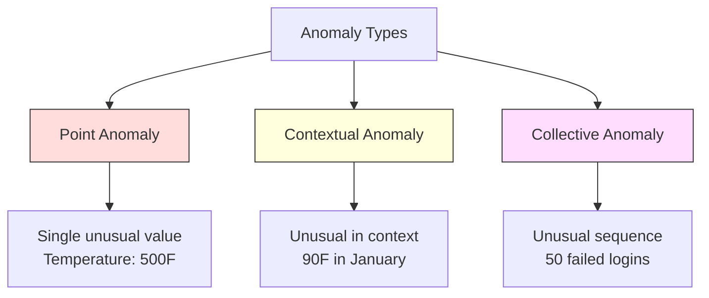
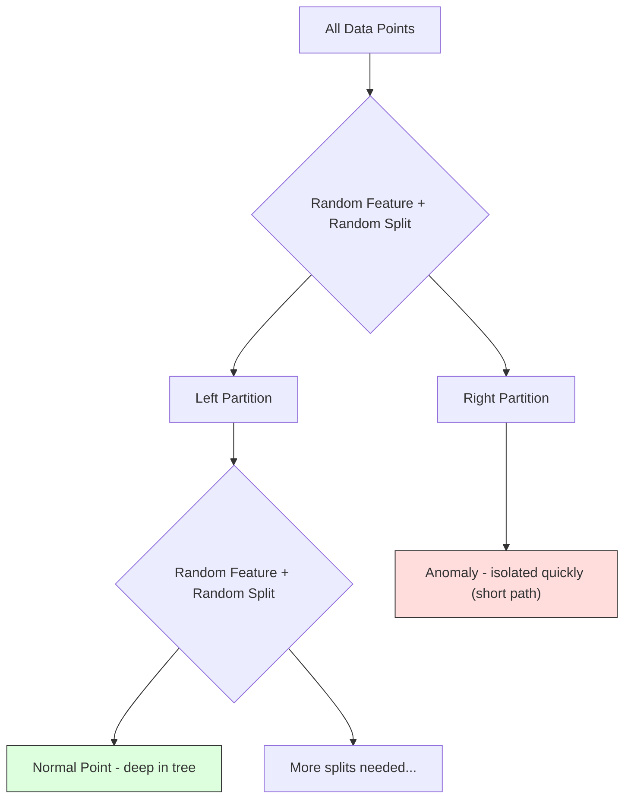
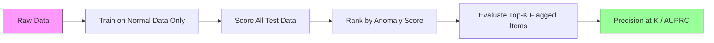

# विसंगतियों का पता लगाना

> सामान्य                                                                                                                                                                                                                                                                                                                                                                                                                                                                                                                             

**Type:** Build
**Language:**पायथन
**Prerequisites:** Phase 2, Lessons 01-09
**Time:** ~75 minutes

## 学习目标

- शून्य से प्राप्त करने के लिए Z-स्कोर,IQR तथा अलगाव वन विरूपण का पता लगाने के तरीके
- 区分点、背景和集体异常,并为每种选择合适的检测方法
- 解释为什么异常检测被表述为正常数据 建模而不是异常的进行分类
- अनियंत्रित विसंगतियों का पता लगाने और पर्यवेक्षित वर्गीकरण की तुलना करें, और उपन्यास विसंगतियों का आकलन करें

## 问题

एक क्रेडिट कार्ड दोपहर 2 बजे न्यूयॉर्क में इस्तेमाल किया गया, फिर दोपहर 2:05 बजे टोक्यो में इस्तेमाल किया गया। एक कारखाने से सेंसर का पढ़ने का क्रम 150 डिग्री है, जबकि सामान्य सीमा 80-120 है।

ये सभी विसंगतिएँ हैं। इन्हें खोजना महत्वपूर्ण है। धोखाधड़ी से अरबों डॉलर का नुकसान होगा। उपकरण टूटने से समय रुक जाएगा।

挑战在于:你很少拥有标签带的异常例――欺诈占据只有交易的0.1%――设备故障一年只发生几次――你无法训练标准分类器,因为"异常"类别中几乎没有可学习的内容――即使你有标签,你见过的异常也不是未来会遇到的所有类型――明天的欺诈方案将与今天的方案不同――

विसंगति का पता लगाने के लिए प्रश्नों को उलट दिया गया है। यह सीखना नहीं है कि क्या असामान्य है, बल्कि यह सीखना है कि क्या सामान्य है।

## 概念

### विसंगतियों का प्रकार

सभी विसंगतियों एक ही नहीं हैंः

- **Point anomalies.**单个数据点无论上下文如何都非常异常──500 डिग्री का तापमान读数──一个通常消费 $50 的账户发生 $50,000 का कारोबार।
- **Contextual anomalies.**某数据点在给定下文下异常──90° गर्मियों में सामान्य, शीतकालीन में असामान्य──同一个值,不同上下文──
- **Collective anomalies.**एक समूह डेटा बिंदु के रूप में एक पूरे के रूप में असामान्य है, भले ही प्रत्येक व्यक्तिगत डेटा बिंदु सामान्य हो।

大多数方法检测点异常――背景异常――时间或位置特征―― सामूहिक异常――序列-चेतना 方法――



### अनियंत्रित 表述

मानक वर्गीकरण में, आपके पास दो प्रकार के टैग हैं। विसंगति का पता लगाने में, आमतौर पर निम्नलिखित तीन स्थितियों में से एक का सामना करना पड़ता हैः

1. **Fully unsupervised.**完全没有标签──你在所有数据上配合探测器,并希望异常 足够稀少,不会污染"正常"模型──
2. **Semi-supervised.**आप एक है जो केवल सामान्य डेटा को शामिल करता है। आप इस शुद्ध संग्रह में फिट बैठते हैं, और फिर अन्य सभी डेटा के लिए एक विभाजन है। यदि संभव है, तो यह सबसे मजबूत सेटिंग है।
3. **Weakly supervised.**आप कम मात्रा में लेबल के विसंगतियों को देखेंगे। उन्हें मूल्यांकन के लिए इस्तेमाल करेंगे, प्रशिक्षण के बजाय। पहले अनियंत्रित प्रशिक्षण करें, फिर लेबल के टुकड़े में सटीकता/याद लेने का माप लें।

关键洞见:अनमोली डिटेक्शन और वर्गीकरण में कोई वास्तविक अंतर है। आप सामान्य डेटा के वितरण का निर्माण कर रहे हैं, न कि दो श्रेणियों के बीच निर्णय सीमा सीख रहे हैं।

### पर्यवेक्षित बनाम अनियंत्रित:权衡

यदि वास्तव में कोई लक्षणात्मक विसंगति है, तो क्या उन्हें प्रशिक्षण के लिए उपयोग किया जाना चाहिए, या केवल मूल्यांकन के लिए?

**Supervised（当作 Classification 处理）：**
- 能捕捉你以前见过的确定的异常 类型
- ज्ञात विसंगति के लिए उच्चतम सटीकता वाला प्रकार
-  पूर्ण रूप से उपन्यास विसंगति  प्रकार
- जब कोई नया विसंगति  प्रकार उत्पन्न होता है तो पुनः प्रशिक्षण की आवश्यकता होती है
- 需要足够多的异常示例(通常太少)

**Unsupervised（对 normal 建模，标记偏离项）：**
- 能捕捉到任何偏离正常的情况,包括 उपन्यास 类型
- 无需带标签的异常
- झूठी सकारात्मक दर 更高(并非所有不寻常 都是坏事)
- वितरण परिवर्तन के लिए अधिक मजबूत

प्रैक्टिस में, बेस्ट सिस्टम एसोसिएशन इन दो चीजों का संयोजन करता हैः अनियंत्रित डिटेक्शन के साथ  व्यापक कवरेज प्राप्त करना, पर्यवेक्षित मॉडल के साथ  ज्ञात उच्च प्राथमिकता वाले विसंगतियों का निपटारा करना  प्रकार,并让人工审查模糊案例──

### Z-Score 方法

सबसे सरल विधि── प्रत्येक विशेषता के औसत तथा मानक विचलन को गणना करना── किसी भी दूरी के औसत से अधिक की मानक विचलन के बिंदु को चिह्नित करना──

```text
z_score = (x - mean) / std
anomaly if |z_score| > threshold
```

默认 सीमा 3.0 है (गॉसियन वितरण के लिए 99.7% सामान्य डेटा 落在 3                                                                                                                                                                                                                                                    

**优点：**简单――快速――可解释("यह मूल्य सामान्य से दूर है 4.5 标准 विचलन")

**缺点：**假设数据服从正常分布──对训练数据中的异值 敏感(异值会移动 mean并增大,使它们更难被检测出来)──在多模分布上失效──

**适用场景：**डाटा大致呈钟形分布 के एकल विशेषता 监控── सर्वर प्रतिक्रिया समय、 निर्माण公差、 स्थिर आधार रेखा के साथ संवेदक पढ़ने──

**失效场景：**कई क्लस्टर डेटा ((दो कार्यालयों की स्थिति में अलग-अलग आधार रेखा 温度) ]], विकृत डेटा ((व्यापार राशि में $ 1000  बहुत कम देखा गया है लेकिन असामान्य नहीं है) ]] प्रशिक्षण केंद्रित में असाधारण डेटा शामिल है।

### IQR 方法

Z-स्कोर से अधिक मजबूत── अंतर-क्वार्टिल रेंज का उपयोग करें, औसत 和 मानक विचलन के बजाय──

```
Q1 = 25th percentile
Q3 = 75th percentile
IQR = Q3 - Q1
lower_bound = Q1 - factor * IQR
upper_bound = Q3 + factor * IQR
anomaly if x < lower_bound or x > upper_bound
```

默认 कारक 1.5 है

**优点：**अप्रासंगिकता के लिए प्रयुक्त वितरणों में कोई सामान्यता का अनुमान नहीं है।

**缺点：** केवल एकतरफा  प्रत्येक विशेषता 独立应用)  केवल विशेषताओं में ही अनियमितताओं का परीक्षण नहीं किया जा सकता है  प्रत्येक विशेषता में एक बिंदु  ऊपर एक अलग से देखा जा सकता है जो सामान्य है, लेकिन संयुक्त स्थान के बीच में असामान्य है)

**实践说明：**IQR में 1.5 कारक प्रतिरोध बॉक्स प्लॉट में छाती के छाती के छाती के छाती के छाती के छाती के छाती के छाती के छाती के छाती के छाती के छाती के छाती के छाती के छाती के छाती के छाती के छाती के छाती के छाती के छाती के छाती के छाती के छाती के छाती के छाती के छाती के छाती के छाती के छाती के छाती के छाती के छाती के छाती के छाती के छाती के छाती के छाती के छाती के छाती के छाती के छाती के छाती के छाती के छाती के छाती के छाती के छाती के छाती के छाती के छाती के छाती के छाती के छाती के छाती के छाती के छाती के छाती के छाती के छाती के छाती के छाती के छाती के छाती के छाती के छाती के छाती के छाती के छाती के छाती के छाती के छाती के छाती के छाती के छाती के छाती के छाती के छाती के छाती के छाती के छाती के छाती के छाती के छाती के छाती के छाती के छाती के छाती के छाती के छाती के छाती के छाती के छाती के छाती के छाती के छाती के छाती के छाती के छाती के छाती के छाती के छाती के छाती के छाती के छाती के छाती के छाती के छाती के छाती के छाती के छाती के छाती के छाती के छाती के छाती के छाती के छाती के छाती के छाती के छाती के छाती के छाती के छाती के छाती के छाती के छाती के छाती के छाती के छाती के छाती के छाती के छाती के छाती के छाती के छाती के छाती के छाती के छाती के छाती के छाती के छाती के छाती के छाती के छाती के छाती के छाती के छाती के छाती के छाती के छाती के छाती के छाती के छाती के छाती के छाती के छाती के छाती के छाती के छाती के छाती के छाती के छाती के छाती के छाती के छाती के छाती के छ

### अलगाव वन

关键洞见:अनोमेली संख्या कम है और विभक्ति भिन्न है। जब डेटा पर यादृच्छिक विभाजन होता है, तो अननोमेली को अधिक आसानी से अलग किया जाता है, उन्हें केवल कम यादृच्छिक विभाजन की आवश्यकता होती है ताकि वे शेष डेटा से अलग हो सकें।



**工作方式：**
1. 构建许多随机树木(一个孤立森林)
2. प्रत्येक नोड में, एक सुविधा चुनें, और उस सुविधा के न्यूनतम और अधिकतम के बीच एक विभाजित मूल्य चुनें
3. 持续分裂, जब तक प्रत्येक बिंदु अलग हो जाते हैं
4. सभी पेड़ों में अपवाद ऊपर कम औसत पथ लंबाई है

**为什么有效：**सामान्य बिंदु  घने क्षेत्रों में स्थित हैं                                                                                                                                                                                                                                                           

विसंगति स्कोर  सभी पेड़ों के औसत पथ लंबाई के आधार पर, यादृच्छिक द्विआधारी खोज पेड़ के अपेक्षित पथ लंबाई  सामान्यीकरण के लिए उपयोगः

```
score(x) = 2^(-average_path_length(x) / c(n))
```

उनमें से `c(n)`个样本的预期路径长度──Score 接近 1 表示异常──Score 接近 0.5 表示正常──Score 接近 0 表示非常正常(位于密集集团深处)。

**优点：**没有分布假设──适用于高尺寸──扩展性好(由于每棵树使用子样本,所以相对于样本大小是子线性)──处理混合特征类型──

**缺点：**難以處理密集區中的異常 (अवशिष्टता) 

**关键 hyperparameters：**
- `n_estimators`वृक्ष संख्या ः १०० सामान्यतः पर्याप्त ः १०० अधिक वृक्ष अधिक स्थिर अंक लाएंगे, लेकिन गणना धीमी होगी ः
- `max_samples`प्रत्येक पेड़ के नमूने संख्या ः मूल निबंध डिफ़ॉल्ट मान 256 है।
- `contamination`: 预期异常比例── केवल सीमा निर्धारित करने के लिए उपयोग किया जाता है──

### स्थानीय आउटलियर फैक्टर (LOF)

LOF किसी बिंदु के आसपास की स्थानीय घनत्व की तुलना अपने पड़ोसियों के आसपास की घनत्व से करता है।

**工作方式：**
1. प्रत्येक बिंदु के लिए, अपने निकटतम पड़ोसियों को खोजने के लिए
2. 计算 स्थानीय पहुंच घनत्व (neighborhood has more density)
3. प्रत्येक बिंदु की घनत्व की तुलना में अपने पड़ोसियों की घनत्व
4. यदि किसी बिंदु की घनत्व अपने पड़ोसियों से कम है, यह बाहर है

**LOF score：**
- LOF  करीब 1.0 दिखाएं घनत्व पड़ोसियों के समान
- LOF 1.0 से बड़ा है घनत्व का पता लगाएं  कम पड़ोसी से कम है
- LOF 远大于 1.0(उदाहरण के लिए 2.0+) घनत्व का प्रतिनिधित्व करता है 显著更低(很可能是异常)

"स्थानीय"  भाग महत्वपूर्ण है। एक को दो क्लस्टरों के डेटा सेट पर विचार करेंः एक में 1000 个点 का घनी क्लस्टर होता है, दूसरा में 50 个点 का दुर्लभ क्लस्टर होता है।

**优点：**检测 स्थानीय विसंगतियों (), उनके आसपास के क्षेत्रों में असामान्य बिंदुओं, भले ही वे पूरे क्षेत्र में असामान्य न हों, विभिन्न घनत्वों के समूहों के लिए उपयुक्त हैं।

**缺点：**बड़े डेटासेट पर धीमा (नाईव कार्यान्वयन) (O (n^2)) ◊ के प्रति चयन संवेदनशीलता (k) ◊ बहुत उच्च आयामों में (N) ◊ परिमाणता का अभिशाप (Dimensionalism Curse) दूरी की गणना को प्रभावित करेगा) ◊

### तुलना

| Method | Assumptions | Speed | Handles High Dims | Detects Local Anomalies |
|--------|------------|-------|-------------------|------------------------|
| Z-score | Normal distribution | 非常快 | 是（逐 feature） | 否 |
| IQR | 无（逐 feature） | 非常快 | 是（逐 feature） | 否 |
| Isolation Forest | 无 | 快 | 是 | 部分 |
| LOF | Distance 有意义 | 慢 | 较差 | 是 |

### 评估 चुनौती

 मूल्यांकन विसंगतियों के डिटेक्टर मूल्यांकन वर्गीकरणकर्ताओं से अधिक कठिनः

- **Extreme class imbalance.**यदि विसंगतियों का 0.1% हिस्सा होता है, तो सभी सामग्री के लिए "सामान्य" पूर्वानुमान 99.9% सटीकता प्राप्त होगा।
- **AUROC 具有误导性。**गंभीर असंतुलन में, यहां तक कि मॉडल में वास्तविक सीमाओं में, अधिकांश विसंगतियों को खो दिया गया है, AUROC भी गलत लग सकता है।
- **更好的 metrics：**सटीकता@k(शीर्ष k 被标记项 में से कई वास्तविक विसंगतियों हैं) 、AUPRC(सटीकता-पुनर्प्राप्त वक्र 下面积), तथा स्थिरांक झूठी सकारात्मक दर 下的召回──



### विसंगतियों का पता लगाने की पाइपलाइन

实践中,अनोमली डिटेक्शन  निम्न कार्यप्रवाह का पालन करेंः

1. **收集 baseline data.**理想情况下, चुन एक तुम जानते हो कोई (या लगभग कोई) विसंगति नहीं है के दौर──
2. **Feature engineering.**मूल विशेषताएं 加上 व्युत्पन्न विशेषताएं(रोलिंग सांख्यिकी, समय विशेषताएं, अनुपात)
3. **训练 detector.**मूल डेटा में ऊपर तैयार किया गया है।
4. **对新数据打分.**प्रत्येक नए अवलोकन के लिए एक असामान्यता स्कोर प्राप्त होगा।
5. **Threshold selection.**选择分割off──这是业务决策:更高门意味着虚假报警更少,但错过异常更多──
6. **Alert and investigate.**अनुक्रमित बिंदु कृत्रिम जांच या स्वचालित प्रतिक्रिया में प्रवेश करें।
7. **Feedback collection.**记录被标记项是真实异常也是假警报──使用这些数据评估探测器,并随时间调整门──

पाइपलाइन 永远不是" Done"―― डाटा वितरण 会漂移, नई विसंगति 类型会出现, सीमाएँ भी समायोजित करने की आवश्यकता है――把Anomaly Detection当作一个持续运行的系统,而不是一次性模型――


```figure
f3-anomaly-fence
```

##  इसे निर्माण

`code/anomaly_detection.py`मध्य कोड ने शून्य से Z-स्कोर, IQR और आइसोलेशन फॉरेस्ट को प्राप्त किया है।

### Z-Score डिटेक्टर

```python
def zscore_detect(X, threshold=3.0):
    mean = X.mean(axis=0)
    std = X.std(axis=0)
    std[std == 0] = 1.0
    z = np.abs((X - mean) / std)
    return z.max(axis=1) > threshold
```

简单且向量化── यदि कोई भी विशेषता  सीमा से अधिक है, तो इसे चिन्हित करें

### आईक्यूआर डिटेक्टर

```python
def iqr_detect(X, factor=1.5):
    q1 = np.percentile(X, 25, axis=0)
    q3 = np.percentile(X, 75, axis=0)
    iqr = q3 - q1
    iqr[iqr == 0] = 1.0
    lower = q1 - factor * iqr
    upper = q3 + factor * iqr
    outside = (X < lower) | (X > upper)
    return outside.any(axis=1)
```

### शून्य से निष्क्रिय वन

शून्य से实现 के संस्करण में अलग-अलग पेड़ बनाएँ, सुविधाओं के स्थान पर यादृच्छिक विभाजन करेंः

```python
class IsolationTree:
    def __init__(self, max_depth):
        self.max_depth = max_depth

    def fit(self, X, depth=0):
        n, p = X.shape
        if depth >= self.max_depth or n <= 1:
            self.is_leaf = True
            self.size = n
            return self
        self.is_leaf = False
        self.feature = np.random.randint(p)
        x_min = X[:, self.feature].min()
        x_max = X[:, self.feature].max()
        if x_min == x_max:
            self.is_leaf = True
            self.size = n
            return self
        self.threshold = np.random.uniform(x_min, x_max)
        left_mask = X[:, self.feature] < self.threshold
        self.left = IsolationTree(self.max_depth).fit(X[left_mask], depth + 1)
        self.right = IsolationTree(self.max_depth).fit(X[~left_mask], depth + 1)
        return self
```

隔离某个点所需的路径长度决定它的异常度比分──更短的路径表示更异常──

`IsolationForest`वर्ग 包装了多棵树:

```python
class IsolationForest:
    def __init__(self, n_estimators=100, max_samples=256, seed=42):
        self.n_estimators = n_estimators
        self.max_samples = max_samples

    def fit(self, X):
        sample_size = min(self.max_samples, X.shape[0])
        max_depth = int(np.ceil(np.log2(sample_size)))
        for _ in range(self.n_estimators):
            idx = rng.choice(X.shape[0], size=sample_size, replace=False)
            tree = IsolationTree(max_depth=max_depth)
            tree.fit(X[idx])
            self.trees.append(tree)

    def anomaly_score(self, X):
        avg_path = average path length across all trees
        scores = 2.0 ** (-avg_path / c(max_samples))
        return scores
```

सामान्यीकरण कारक `c(n)`यह n तत्वों के बाइनरी खोज पेड़ में शामिल है एक बार असफल खोज के अपेक्षित पथ लंबाई── यह बराबर है`2 * H(n-1) - 2*(n-1)/n`, उनमें से `H`यह एक सामंजस्य संख्या है। यह सामान्यीकरण विभिन्न आकारों के डेटासेट में स्कोर की तुलना सुनिश्चित करता है।

### डेमो 场景

代码生成多个测试场景:

1. **Single cluster with outliers.**एक 2D गौसी समूह, और दूर केंद्र में स्थित है अप्रासंगिकताओं में डाला गया है। सभी तरीकों यहाँ सभी प्रभावी होना चाहिए।
2. **Multimodal data.**तीन अलग-अलग आकारों और घनत्वों के समूहों में                                                                                                                                                                                                                                                        
3. **High-dimensional data.**50 विशेषताएं, लेकिन विसंगति केवल उनमें से 5 विशेषताएं ही हैं ️️️️️️️️️️️️️️️️️️️️️️️️️️️️️️️️️️️️️️️️️️️️️️️️️️️️️️️️️️️️️️️️️️️️️️️️️️️️️️️️️️️️️️️️️️️️️️️️️️️️️️️️️️️️️️️️️️️️️️️️️️️️️️️️️️️️️️️️️️️️️️️️️️️️️️️️️️️️️️️️️️️️️️️️️️️️️️️️️️️️️️️️️️️️️️️️️️️️️️️️️

प्रत्येक डेमो सटीकता, याद करने, F1 और सटीकता का उपयोग करता है।

## इसका उपयोग करें

उपयोग से शून्य से नहीं बल्कि उपयोग से पूरा करने के लिए):

```python
from sklearn.ensemble import IsolationForest
from sklearn.neighbors import LocalOutlierFactor

iso = IsolationForest(n_estimators=100, contamination=0.05, random_state=42)
iso.fit(X_train)
predictions = iso.predict(X_test)

lof = LocalOutlierFactor(n_neighbors=20, contamination=0.05, novelty=True)
lof.fit(X_train)
predictions = lof.predict(X_test)
```

ध्यान दें,`contamination`设置预期异常例如──正确设置它很重要,太低会漏掉异常,太高会产生虚假报警──

`anomaly_detection.py`मध्य कोड एक ही डेटा पर शून्य से कार्यान्वयन संस्करण से तुलना कर सकते हैं।

### स्क्लेयरन प्रदूषण पैरामीटर

sklearn 中的 `contamination`पैरामीटर तय करता है कि कैसे निरंतर विसंगति स्कोर को बाइनरी भविष्यवाणियों के लिए परिवर्तित किया जाए।

```python
iso_5 = IsolationForest(contamination=0.05)
iso_10 = IsolationForest(contamination=0.10)
```

 दोनों में समान विसंगति स्कोर उत्पन्न होते हैं`iso_5`标记 शीर्ष 5%, जबकि `iso_10`标记前10%── यदि आप वास्तविक विसंगति दर को नहीं जानते हैं, तो प्रदूषण को "स्वचालित" के रूप में सेट करें,并直接 कच्चे स्कोर का उपयोग करें── गलत सकारात्मक और गलत नकारात्मक के बीच लागत तौल अपने सीमांकन को सेट करें──

### एक श्रेणी का एसवीएम

另一个值得了解的未监督异常检测器──One-Class SVM 会在高维特征空间中围绕正常数据 拟合一个边界(使用内核技巧)──

```python
from sklearn.svm import OneClassSVM

oc_svm = OneClassSVM(kernel="rbf", gamma="auto", nu=0.05)
oc_svm.fit(X_train)
predictions = oc_svm.predict(X_test)
```

`nu`पैरामीटर 近似表示异常的比例──One-Class SVM 在小到中等数据集上效果很好,但无法扩展到非常大的数据(kerne matrix 会平方增长)──

### ऑटोएकोडर दृष्टिकोण(预览)

ऑटोकोडर एक तंत्रिका नेटवर्क है जो डेटा को संपीड़ित और पुनर्निर्माण करता है। सामान्य डेटा में अप्रासंगिकताएं अधिक होती हैं।

यह चरण 3 में होगा, लेकिन सिद्धांत एक ही हैः सामान्य 建模, 标记偏离项.

### विसंगतियों का पता लगाने के लिए एक साथ

जैसे कि एंसेंबल विधियों में सुधार होगा वर्गीकरण (Lection 11) , कई विसंगतियों के डिटेक्टरों को भी सुधार होगा परीक्षण प्रभावों में सुधार होगा। सबसे सरल विधिः

1. 运行多个探测器(Z-स्कोर、IQR、पृथक वन、LOF)
2. प्रत्येक डिटेक्टर के स्कोर को सामान्य करने के लिए [0, 1]
3. सामान्यीकृत स्कोर के लिए औसत
4. 标记平均分高于门的点

इससे गलत सकारात्मकता कम होती है, क्योंकि विभिन्न तरीकों के अलग-अलग विफलता मोड होते हैं। चार तरीकों से चिह्नित सभी बिंदु लगभग निश्चित रूप से असामान्य होते हैं। केवल एक विधि द्वारा चिह्नित बिंदु केवल उस विधि की विशेषता के कारण असामान्य हो सकता है।

अधिक जटिल सेट प्रत्येक डिटेक्टर के अनुमानित विश्वसनीयता के आधार पर वजन प्रदान करेंगे। यदि ज्ञात विसंगतियों का सत्यापन सेट है, तो उस पर मापा जा सकता है।

### 生产环境考虑

1. **Threshold drift.**漂移, तय सीमा 会过时―― निगरानी विसंगतियों स्कोर का वितरण,并定期调整――
2. **Alert fatigue.**झूठी अलार्म 太多时, ऑपरेटर 会停止关注──先使用较高门
3. **Ensemble approach.**उत्पादन वातावरण में, कई डिटेक्टरों को संयोजित करना। केवल कई तरीकों से किसी बिंदु को असामान्य माना जाता है जब इसे चिह्नित किया जाता है।
4. **Feature engineering.**आदिम विशेषताएं आमतौर पर पर्याप्त नहीं हैं। इसके अतिरिक्त रलिंग सांख्यिकी, अनुपात, समय-से-पिछले घटना और डोमेन-विशिष्ट विशेषताएं हैं।
5. **Feedback loop.**जब ऑपरेटर  जांच  चिन्हित किए गए पहलुओं की पुष्टि या अस्वीकार करते हैं, तो इन  इनपुट सिस्टमों को                                                                                                                                                                                                                                               

## 交付 यह

本课产出:
- `outputs/skill-anomaly-detector.md`-- एक उपयुक्त डिटेक्टर का चयन करने के लिए निर्णय कौशल
- `code/anomaly_detection.py`- शून्य से प्राप्त Z-स्कोर, IQR तथा पृथक्करण वन, और स्क्लेयरन के मुकाबले

### 选择 सीमा

अनियमितता स्कोर एक निरंतर मूल्य है। द्विआधारी निर्णय लेने के लिए आपको एक सीमा की आवश्यकता है। यह व्यावसायिक निर्णय है, तकनीकी निर्णय नहीं है।

考虑两个场景:
- **Fraud detection.**漏掉欺诈代价很高(拒付、客户信任) ――झूठे अलार्म की लागत है कृत्रिम विश्लेषक 5 分钟――
- **Equipment maintenance.**झूठी अलार्म का अर्थ है एक बार अनावश्यक रुकना, लागत के लिए$50,000。missed failure 意味着 $500,000 के निर्माण की सीमा निर्धारित करने के लिए इन लागतों का संतुलन बनाना।

दो प्रकार के मामलों में, सर्वोत्तम सीमाएं गलत सकारात्मक और गलत नकारात्मक  के बीच लागत अनुपात पर निर्भर करती हैं।

###  विस्तार से उत्पादन वातावरण तक

对于生产环境中的实时异常检测:

1. **Batch training, online scoring.**定期(每日、每周) 短期 सामान्य डेटा 上训练模型── प्रत्येक नई अवलोकन तक पहुंचने के लिए स्कोरिंग करना──
2. **Feature computation must match.**यदि आप प्रशिक्षण के दौरान 30 天 खिड़की के रोलिंग आंकड़ों का उपयोग करते हैं, तो नए अवलोकन के लिए 30 天 इतिहास की आवश्यकता होगी 计算 सुविधाएँ──缓存需要历史──
3. **Score distribution monitoring.**यदि औसत स्कोर ऊपर जाता है, तो डेटा बदल रहा है, या मॉडल 已经过时了――
4. **Explainability.**जब आप एक विसंगति 时,说明原因──Z-score:"Feature X than normal 高 4.2 个标准偏差──" पृथक्करण वन:" यह बिंदु औसत में 3.1 बार विभाजित है में पृथक् होते हैं(सामान्य अंक 需要 8.5 बार) 』"

## अभ्यास

1. **Threshold tuning.**1.0 से 5.0 तक के 0.5 के लिए सीमाओं का उपयोग करें Z-स्कोर डिटेक्टर चलाएं  प्रत्येक सीमाओं को नीचे सटीकता और याद दिलाने के लिए चित्रित करें  आपके डेटा का सबसे अच्छा संतुलन बिंदु कहां है?

2. **Multivariate anomalies.** 2D डेटा बनाएं, जिनमें से प्रत्येक विशेषता 单独看都像正常, लेकिन组合起来是异常的 (उदाहरण के लिए, मुख्य क्लस्टर विघात के बिंदु से दूर) 

3. **从零实现 LOF.**उपयोग के निकटतम पड़ोसियों 实现 स्थानीय आउटलीयर फैक्टर ⇒ उपयोग के बराबर 10 और के बराबर 50, के चयन का परिणाम कैसे प्रभावित करता है?

4. **Streaming Anomaly Detection.**修改Z-score डिटेक्टर,使其在流媒体设置中工作:随着新点到达更新运行平均和变异(वेल्फर्ड के ऑनलाइन एल्गोरिथ्म)

5. **Real-world evaluation.**️️️️️️️️️️️️️️️️️️️️️️️️️️️️️️️️️️️️️️️️️️️️️️️️️️️️️️️️️️️️️️️️️️️️️️️️️️️️️️️️️️️️️️️️️️️️️️️️️️️️️️️️️️️️️️️️️️️️️️️️️️️️️️️️️️️️️️️️️️️️️️️️️️️️️️️️️️️️️️️️️️️️️️️️️️️️️️️️️️️️️️️️️️️️️️️️️️️️️️️️️️️️️️️️️️️️️️️️️️️️️️️️️️️️️️️️️️️️️️️️️️️️️️️️️️️️️️️️️️️️️️️️️️️️️️️️️️️️️️️️️️️️️️️️️️️️️️️️️️️️️️️️️️️️️️️️️️️️️️️️️️️️️️️️️️️️️️️️️️️️️️️️️️️️️️️️️️️️️️️️️️️️️️️️️️️️️️️️️️️️️️️️️️️️️️️️️️️️️️️️️️️️️️️️️️️️️️️️️️️️️️️️️️️️️️️️️️️️️️️️️️️️️️️️️️️️️️️️️️️️️️️️️️️️️️️️️️️️️️️️️️️️️️️️️️️️️️️️️️️️️️️️️️️️

## 关键术语

| Term | 人们通常怎么说 | 它实际意味着什么 |
|------|----------------|----------------------|
| Anomaly | "Outlier，异常点" | 一个明显偏离 normal data 预期模式的数据点 |
| Point anomaly | "单个奇怪的值" | 一个无论上下文如何都异常的单独 observation |
| Contextual anomaly | "normal 值，错误上下文" | 一个在给定上下文（时间、位置等）下异常、但在另一个上下文中可能 normal 的 observation |
| Isolation Forest | "用 random splits 找 outliers" | 一种 random trees 的 ensemble，它能用比 normal points 更少的 splits 隔离 anomalies |
| Local Outlier Factor | "把 density 和 neighbors 比较" | 一种标记 local density 明显低于其 neighbors density 的点的方法 |
| Z-score | "距离 mean 的 standard deviations 数" | (x - mean) / std，用 standard deviation 为单位衡量某个点距离中心有多远 |
| IQR | "Interquartile range" | Q3 - Q1，衡量数据中间 50% 的 spread，用于 robust outlier detection |
| Contamination | "预期 anomalies 比例" | 一个 hyperparameter，用于告诉 detector 应该将数据中多大比例标记为 anomalous |
| Precision@k | "top k flags 中有多少是真的" | 只在 k 个最可疑点上计算的 precision，适用于 imbalanced Anomaly Detection |
| AUPRC | "Precision-recall curve 下的面积" | 一个汇总所有 thresholds 下 precision-recall 表现的 metric，对 imbalanced data 比 AUROC 更好 |

## 延伸阅读

- [Liu et al., Isolation Forest (2008)](https://cs.nju.edu.cn/zhouzh/zhouzh.files/publication/icdm08b.pdf)-- 原始 पृथक्करण वन 论文
- [Breunig et al., LOF: Identifying Density-Based Local Outliers (2000)](https://dl.acm.org/doi/10.1145/342009.335388)-- 原始 LOF 论文
- [scikit-learn Outlier Detection docs](https://scikit-learn.org/stable/modules/outlier_detection.html)-- सभी विकृति डिटेक्टरों का विवरण
- [Chandola et al., Anomaly Detection: A Survey (2009)](https://dl.acm.org/doi/10.1145/1541880.1541882)-- विसंगति का पता लगाने के तरीके का समग्र विवरण
- [Goldstein and Uchida, A Comparative Evaluation of Unsupervised Anomaly Detection Algorithms (2016)](https://journals.plos.org/plosone/article?id=10.1371/journal.pone.0152173)-- वास्तविक डेटा संग्रह में 10 तरीकों के वास्तविक प्रमाणों की तुलना
