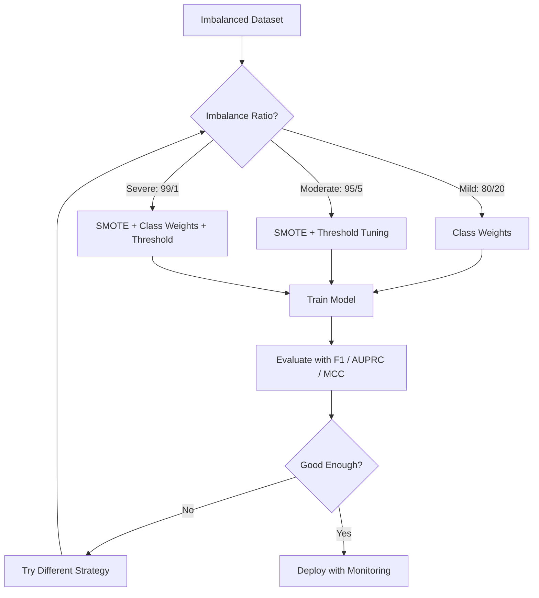
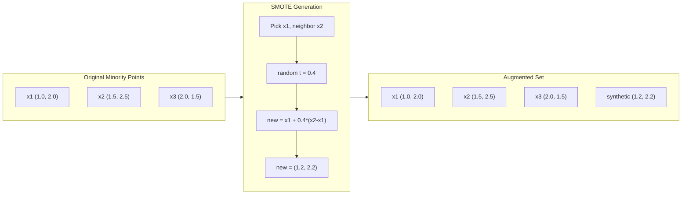
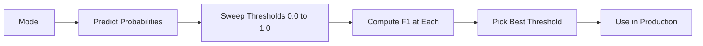
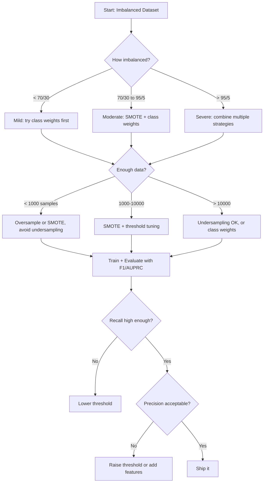

# 处理不平衡数据

> जब आपके डेटा का 99% है तो यह सामान्य है, सटीकता एक झूठ है।

**类型：**निर्माण
**语言：**पायथन
**先修要求：**चरण 2, पाठ 01-09 (विशेषकर मूल्यांकन सूचक)
**时间：**≈ 90 मिनट

## 学习目标

- शून्य से SMOTE को प्राप्त करने से, कृत्रिम ओवरसैम्पिंग का वर्णन करना
- F1、AUPRC 和 मैथ्यूज सहसंबंध गुणांक  मूल्यांकन न संतुलन वर्गीकरण, उपयोग की सटीकता की बजाय
- वर्ग भारण तारे समायोजन तथा पुनः नमूनाकरण 策略,并为给定的不平衡比例选择合适方法
- संयुक्त SMOTE, वर्ग भार और सीमा अनुकूलन के साथ एक पूर्ण असंतुलित डेटा पाइपलाइन का निर्माण

## 问题

आप एक धोखाधड़ी परीक्षण मॉडल बनाया है. यह 99.9% सटीकता तक पहुँच गया है. आप बहुत खुश हैं. फिर आप यह महसूस किया है कि यह हर लेनदेन के लिए पूर्वानुमान के लिए है.

यह कोई बग नहीं है। जब केवल 0.1% के लेनदेन धोखाधड़ी होते हैं, तो यह उचित व्यवहार है। मॉडल ने सीखा कि: हमेशा अनुमान लगाने वाली बहुमत वर्ग को समग्र त्रुटि को कम से कम किया जा सकता है।

जहाँ भी वास्तव में महत्वपूर्ण है वर्गीकरण 场景,都会遇到这种情况──疾病诊断:1% 阳性率──网络入侵:0.01% 攻击──制造缺陷:0.5% 缺陷率──垃圾邮件过:20% 垃圾邮件──流失预测:5% 流失用户──少数派 वर्ग 越重要,往往越稀少──

सटीकता विफल होगी, क्योंकि यह सभी सही भविष्यवाणियों को समान व्यवहार करती है। सही तौर पर एक वैध लेनदेन और सही ढंग से एक धोखाधड़ी को पकड़ने के लिए सही है, लेकिन सटीकता का केवल एक हिस्सा है। लेकिन धोखाधड़ी को पकड़ने के लिए मॉडल अस्तित्व का पूरा कारण है। हमें मॉडल को दुर्लभ लेकिन महत्वपूर्ण श्रेणियों के संकेतकों, तकनीकों और प्रशिक्षण रणनीतियों पर ध्यान केंद्रित करने के लिए मजबूर करने की आवश्यकता है।

## 概念

### सटीकता क्यों विफल हो जाएगा

考虑一个包含1000 样本的数据集:990 个负,10 个正,一个始终预测负的模型:

|  | Predicted Positive | Predicted Negative |
|--|---|---|
| Actually Positive | 0 (TP) | 10 (FN) |
| Actually Negative | 0 (FP) | 990 (TN) |

सटीकता = (0 + 990) / 1000 = 99.0%

模型 ने शून्य बार धोखाधड़ी को पकड़ लिया 零个疾病 零个缺陷 零个缺陷 零个缺陷 零个缺陷 零个缺陷 零个缺陷 零个缺陷 零个缺陷 零个缺陷 零个缺陷 零个缺陷 零个缺陷 零个缺陷 零个缺陷 零个缺陷 零个缺陷 零个缺陷 零个缺陷 零个缺陷 零个缺陷 零个缺陷 零个缺陷 零个缺陷 零个缺陷 零个缺陷 零个缺陷 零个缺陷 零个缺陷 零个缺陷 零个缺陷 零个缺陷 零个缺陷 零个缺陷 零个缺陷 零个缺陷 零个缺陷 零个缺陷 零个缺陷 零个缺陷 零个缺陷 零个缺陷 零个缺陷 零个缺陷 零个缺陷 零个缺陷 零个缺陷 零个缺陷 零个缺陷 零个缺陷 零个缺陷 零个缺陷 零个缺陷 零个缺陷 零个缺陷 零个缺陷 

### बेहतर संकेत

**Precision**= टीपी / (टीपी + एफपी) ◊ सभी सकारात्मक के रूप में चिह्नित नमूनों में, वास्तव में सकारात्मक के कितने हैं?

**Recall**= टीपी / (टीपी + एफएन) ◊ सभी वास्तविक सकारात्मक नमूनों में, हमने कितना पकड़ा है?

**F1 Score**= 2 * सटीकता * याद / (सटीकता + याद) ⋅调和平均数──相比算术平均数, यह अधिक कठोर होगा सटीकता और याद 之间极端不平衡──

**F-beta Score**= (1 + बीटा^2) * सटीकता * याद / (बीटा^2 * सटीकता + याद) ⋅ जब बीटा > 1 时, याद更重要──当 बीटा < 1 时, सटीकता 更重要──F2 在欺诈检测中很常见(漏掉欺诈比误报更糟)

**AUPRC**(अंतर्गत सटीक-पुनर्विचार वक्र क्षेत्र) ◊ AUC-ROC के समान है, लेकिन असंतुलित डेटा के लिए अधिक जानकारी मात्रा ◊随机分类器 के AUPRC के समान सकारात्मक वर्ग के अनुपात ◊ 不像 ROC 那样是0.5) ◊ यह सुधार को अधिक आसानी से देखा जा सकता है ◊

**Matthews Correlation Coefficient**= (TP * TN - FP * FN) / sqrt((TP+FP)(TP+FN)(TN+FP)(TN+FN))。 दायरा -1 से +1 तक है── केवल तभी जब मॉडल दो श्रेणियों पर अच्छा प्रदर्शन करता है तभी उच्च分 देगा── भले ही श्रेणियों का आकार बहुत बड़ा हो, भी संतुलन बनाए रखना──

对于上始终预测负的模型:精度 = 0/0(未定义,通常设为0),回忆 = 0/10 = 0,F1 = 0,MCC = 0──

### असंतुलित डेटा पाइपलाइन



### SMOTE: सिंथेटिक अल्पसंख्यक ओवरसैम्पलिंग तकनीक

随时过样本会复制现有少数样本── यह काम कर सकता है, लेकिन इसके लिए अनुकूलित जोखिम है, क्योंकि मॉडल बार-बार पूरी तरह से एक ही बिंदु को देखेंगे──

SMOTE नए सिंथेटिक अल्पसंख्यक 样本 बनाएगा, ये 样本 समझ में आ सकते हैं, लेकिन नहीं हैं।

1. प्रत्येक अल्पसंख्यक के लिए नमूना x, अन्य अल्पसंख्यक के नमूने में से एक में इसका निकटतम पड़ोसी पाया
2. 随机选择一个邻居
3. x और पड़ोसी के बीच लाइन के खंड पर एक नया नमूना बनाएं

公式:`new_sample = x + random(0, 1) * (neighbor - x)`

यह वास्तविक अल्पसंख्यक बिंदुओं के बीच मूल्य में डालता है, सुविधा अंतरिक्ष के एक ही क्षेत्र में नमूना बनाता है, न कि केवल पहले से मौजूद डेटा को कॉपी करता है।



### नमूनाकरण 策略对比

**Random Oversampling**: अल्पसंख्यक के प्रतिलिपि 样本, इसकी संख्या बहुमत से मेल खाती है
- 优点:简单, कोई सूचना हानि नहीं
- 缺点: पूर्ण重复会导致过拟合, प्रशिक्षण समय बढ़ा

**Random Undersampling**: बहुमत को हटाना 样本, इसकी संख्या को अल्पसंख्यक के अनुरूप बनाना
- 优点: प्रशिक्षण快,简单
- 缺点: संभावित उपयोगी बहुमत डेटा, फ़ैसर + उच्च

**SMOTE**: के माध्यम से插值创建 सिंथेटिक अल्पसंख्यक 样本──
- 优点: नए डेटा पॉइंट उत्पन्न करना, यादृच्छिक ओवरसैम्पिंग के मुकाबले  न्यूनतर
- 缺点:可能在决策边界 附近创建噪音样本,不考虑多数阶级的分布

| Strategy | Data Changed | Risk | When to Use |
|----------|-------------|------|-------------|
| Oversample | 复制 minority | 过拟合 | 小数据集，中等不平衡 |
| Undersample | 移除 majority | 信息损失 | 大数据集，需要快速训练 |
| SMOTE | 添加 synthetic minority | 边界噪声 | 中等不平衡，有足够 minority 样本用于 k-NN |

### कक्षाओं के वजन

डेटा को बदलने के बजाय, मॉडल को गलत तरीके से संसाधित करने के तरीके को बदलने से अल्पसंख्यक वर्ग के गलत वर्गीकरण को अधिक अधिकार दिया जाता है।

 एक के लिए जिसमें 950  नकारात्मक और 50  सकारात्मक  नमूना के द्विवार्षिक प्रश्न हैंः
- नकारात्मक वर्ग 的权重 = n_samples / (2 * n_negative) = 1000 / (2 * 950) = 0.526
- सकारात्मक वर्ग 的权重 = n_samples / (2 * n_positive) = 1000 / (2 * 50) = 10.0

सकारात्मक वर्ग  प्राप्त 19 倍权重──误分类 एक सकारात्मक 样本的价格,相当于误分类 19 负面 样本──模型被迫关注少数类──

लॉजिस्टिक प्रतिगमन में, यह हानि समारोह को संशोधित करेगाः

```
weighted_loss = -sum(w_i * [y_i * log(p_i) + (1-y_i) * log(1-p_i)])
```

इनमें से एक नमूना i के वर्ग पर निर्भर करता है।

वर्ग वजन अपेक्षाकृत अधिक नमूनाकरण के साथ गणितीय रूप से बराबर है, लेकिन नए डेटा बिंदुओं का निर्माण नहीं करता है।

### सीमा समायोजन

大多数分類者会输出一个概率──默认值是0.5: यदि P(积极) >= 0.5,就预测为积极──但 0.5 是任意的──当类别不平衡时,最优值通常要低得多──

流程:
1. 训练一个模型
2. पर सत्यापन सेट ऊपर प्राप्त पूर्वानुमान संभावना
3. 0.0 से 1.0 तक 扫描值
4. प्रत्येक मूल्य पर गणना F1 ((या आप चुनते हैं के सूचक)
5. 选择使指标最大的值



एक मॉडल एक धोखाधड़ी लेनदेन के लिए एक धोखाधड़ी उत्पादन P( धोखाधड़ी) = 0.15──   0.5 नीचे, इसे गैर धोखाधड़ी के रूप में वर्गीकृत किया जाएगा  0.10 नीचे, इसे सही ढंग से पकड़ा जाएगा                                                                                                                                                                                                                                  

### लागत-संवेदनशील शिक्षा

वर्ग भारों का व्यापक रूप से उपयोग नहीं किया जाता है, बल्कि विशिष्ट गलत वर्गीकरण लागतों का वितरण किया जाता हैः

| | Predict Positive | Predict Negative |
|--|---|---|
| Actually Positive | 0 (correct) | C_FN = 100 |
| Actually Negative | C_FP = 1 | 0 (correct) |

漏掉一笔欺诈交易 (FN) का खर्च एक बार की गलत रिपोर्ट से अधिक है FP) उच्च 100 गुना है 模型优化是总成本,而不是总错误数――

जब आप वास्तविक दुनिया की लागत का अनुमान लगा सकते हैं, तो यह सबसे सिद्धान्तपूर्ण तरीका है। कैंसर की निदान और एक बार की गलत रिपोर्ट के कारण अतिरिक्त जीवन परीक्षण, इसकी लागत पूरी तरह से अलग है।

### निर्णायक प्रक्रिया




```figure
class-imbalance
```

##  इसे निर्माण

### 步骤 1: एक असंतुलित डेटासेट उत्पन्न करें

```python
import numpy as np


def make_imbalanced_data(n_majority=950, n_minority=50, seed=42):
    rng = np.random.RandomState(seed)

    X_maj = rng.randn(n_majority, 2) * 1.0 + np.array([0.0, 0.0])
    X_min = rng.randn(n_minority, 2) * 0.8 + np.array([2.5, 2.5])

    X = np.vstack([X_maj, X_min])
    y = np.concatenate([np.zeros(n_majority), np.ones(n_minority)])

    shuffle_idx = rng.permutation(len(y))
    return X[shuffle_idx], y[shuffle_idx]
```

### 步骤 2: शून्य से SMOTE को प्राप्त करना

```python
def euclidean_distance(a, b):
    return np.sqrt(np.sum((a - b) ** 2))


def find_k_neighbors(X, idx, k):
    distances = []
    for i in range(len(X)):
        if i == idx:
            continue
        d = euclidean_distance(X[idx], X[i])
        distances.append((i, d))
    distances.sort(key=lambda x: x[1])
    return [d[0] for d in distances[:k]]


def smote(X_minority, k=5, n_synthetic=100, seed=42):
    rng = np.random.RandomState(seed)
    n_samples = len(X_minority)
    k = min(k, n_samples - 1)
    synthetic = []

    for _ in range(n_synthetic):
        idx = rng.randint(0, n_samples)
        neighbors = find_k_neighbors(X_minority, idx, k)
        neighbor_idx = neighbors[rng.randint(0, len(neighbors))]
        t = rng.random()
        new_point = X_minority[idx] + t * (X_minority[neighbor_idx] - X_minority[idx])
        synthetic.append(new_point)

    return np.array(synthetic)
```

### 步骤 3: यादृच्छिक ओवरसैम्पलिंग तथा अंडरसैम्पलिंग

```python
def random_oversample(X, y, seed=42):
    rng = np.random.RandomState(seed)
    classes, counts = np.unique(y, return_counts=True)
    max_count = counts.max()

    X_resampled = list(X)
    y_resampled = list(y)

    for cls, count in zip(classes, counts):
        if count < max_count:
            cls_indices = np.where(y == cls)[0]
            n_needed = max_count - count
            chosen = rng.choice(cls_indices, size=n_needed, replace=True)
            X_resampled.extend(X[chosen])
            y_resampled.extend(y[chosen])

    X_out = np.array(X_resampled)
    y_out = np.array(y_resampled)
    shuffle = rng.permutation(len(y_out))
    return X_out[shuffle], y_out[shuffle]


def random_undersample(X, y, seed=42):
    rng = np.random.RandomState(seed)
    classes, counts = np.unique(y, return_counts=True)
    min_count = counts.min()

    X_resampled = []
    y_resampled = []

    for cls in classes:
        cls_indices = np.where(y == cls)[0]
        chosen = rng.choice(cls_indices, size=min_count, replace=False)
        X_resampled.extend(X[chosen])
        y_resampled.extend(y[chosen])

    X_out = np.array(X_resampled)
    y_out = np.array(y_resampled)
    shuffle = rng.permutation(len(y_out))
    return X_out[shuffle], y_out[shuffle]
```

### 步骤 4: वर्ग भार के साथ लॉजिस्टिक regression

```python
def sigmoid(z):
    return 1.0 / (1.0 + np.exp(-np.clip(z, -500, 500)))


def logistic_regression_weighted(X, y, weights, lr=0.01, epochs=200):
    n_samples, n_features = X.shape
    w = np.zeros(n_features)
    b = 0.0

    for _ in range(epochs):
        z = X @ w + b
        pred = sigmoid(z)
        error = pred - y
        weighted_error = error * weights

        gradient_w = (X.T @ weighted_error) / n_samples
        gradient_b = np.mean(weighted_error)

        w -= lr * gradient_w
        b -= lr * gradient_b

    return w, b


def compute_class_weights(y):
    classes, counts = np.unique(y, return_counts=True)
    n_samples = len(y)
    n_classes = len(classes)
    weight_map = {}
    for cls, count in zip(classes, counts):
        weight_map[cls] = n_samples / (n_classes * count)
    return np.array([weight_map[yi] for yi in y])
```

### 步骤 5:तारे की सेटिंग

```python
def find_optimal_threshold(y_true, y_probs, metric="f1"):
    best_threshold = 0.5
    best_score = -1.0

    for threshold in np.arange(0.05, 0.96, 0.01):
        y_pred = (y_probs >= threshold).astype(int)
        tp = np.sum((y_pred == 1) & (y_true == 1))
        fp = np.sum((y_pred == 1) & (y_true == 0))
        fn = np.sum((y_pred == 0) & (y_true == 1))

        if metric == "f1":
            precision = tp / (tp + fp) if (tp + fp) > 0 else 0.0
            recall = tp / (tp + fn) if (tp + fn) > 0 else 0.0
            score = 2 * precision * recall / (precision + recall) if (precision + recall) > 0 else 0.0
        elif metric == "recall":
            score = tp / (tp + fn) if (tp + fn) > 0 else 0.0
        elif metric == "precision":
            score = tp / (tp + fp) if (tp + fp) > 0 else 0.0

        if score > best_score:
            best_score = score
            best_threshold = threshold

    return best_threshold, best_score
```

### 步骤 6: मूल्यांकन फ़ंक्शन

```python
def confusion_matrix_values(y_true, y_pred):
    tp = np.sum((y_pred == 1) & (y_true == 1))
    tn = np.sum((y_pred == 0) & (y_true == 0))
    fp = np.sum((y_pred == 1) & (y_true == 0))
    fn = np.sum((y_pred == 0) & (y_true == 1))
    return tp, tn, fp, fn


def compute_metrics(y_true, y_pred):
    tp, tn, fp, fn = confusion_matrix_values(y_true, y_pred)
    accuracy = (tp + tn) / (tp + tn + fp + fn)
    precision = tp / (tp + fp) if (tp + fp) > 0 else 0.0
    recall = tp / (tp + fn) if (tp + fn) > 0 else 0.0
    f1 = 2 * precision * recall / (precision + recall) if (precision + recall) > 0 else 0.0

    denom = np.sqrt(float((tp + fp) * (tp + fn) * (tn + fp) * (tn + fn)))
    mcc = (tp * tn - fp * fn) / denom if denom > 0 else 0.0

    return {
        "accuracy": accuracy,
        "precision": precision,
        "recall": recall,
        "f1": f1,
        "mcc": mcc,
    }
```

### 步骤 7: सभी विधियों की तुलना करें

```python
X, y = make_imbalanced_data(950, 50, seed=42)
split = int(0.8 * len(y))
X_train, X_test = X[:split], X[split:]
y_train, y_test = y[:split], y[split:]

# Baseline: no treatment
w_base, b_base = logistic_regression_weighted(
    X_train, y_train, np.ones(len(y_train)), lr=0.1, epochs=300
)
probs_base = sigmoid(X_test @ w_base + b_base)
preds_base = (probs_base >= 0.5).astype(int)

# Oversampled
X_over, y_over = random_oversample(X_train, y_train)
w_over, b_over = logistic_regression_weighted(
    X_over, y_over, np.ones(len(y_over)), lr=0.1, epochs=300
)
preds_over = (sigmoid(X_test @ w_over + b_over) >= 0.5).astype(int)

# SMOTE
minority_mask = y_train == 1
X_minority = X_train[minority_mask]
synthetic = smote(X_minority, k=5, n_synthetic=len(y_train) - 2 * int(minority_mask.sum()))
X_smote = np.vstack([X_train, synthetic])
y_smote = np.concatenate([y_train, np.ones(len(synthetic))])
w_sm, b_sm = logistic_regression_weighted(
    X_smote, y_smote, np.ones(len(y_smote)), lr=0.1, epochs=300
)
preds_smote = (sigmoid(X_test @ w_sm + b_sm) >= 0.5).astype(int)

# Class weights
sample_weights = compute_class_weights(y_train)
w_cw, b_cw = logistic_regression_weighted(
    X_train, y_train, sample_weights, lr=0.1, epochs=300
)
probs_cw = sigmoid(X_test @ w_cw + b_cw)
preds_cw = (probs_cw >= 0.5).astype(int)

# Threshold tuning (tune on held-out validation set, not test set)
probs_val = sigmoid(X_val @ w_cw + b_cw)
best_thresh, best_f1 = find_optimal_threshold(y_val, probs_val, metric="f1")
preds_thresh = (probs_cw >= best_thresh).astype(int)
```

कोड फ़ाइल एक स्क्रिप्ट में चलती है इन सभी सामग्री और परिणाम मुद्रित करते हैं।

## इसका उपयोग करें

借助小学学习和失衡学习, ये तकनीकें हैं

```python
from sklearn.linear_model import LogisticRegression
from sklearn.metrics import classification_report, f1_score
from sklearn.model_selection import train_test_split
from imblearn.over_sampling import SMOTE
from imblearn.under_sampling import RandomUnderSampler
from imblearn.pipeline import Pipeline

X_train, X_test, y_train, y_test = train_test_split(X, y, stratify=y)

model_weighted = LogisticRegression(class_weight="balanced")
model_weighted.fit(X_train, y_train)
print(classification_report(y_test, model_weighted.predict(X_test)))

smote = SMOTE(random_state=42)
X_resampled, y_resampled = smote.fit_resample(X_train, y_train)
model_smote = LogisticRegression()
model_smote.fit(X_resampled, y_resampled)
print(classification_report(y_test, model_smote.predict(X_test)))

pipeline = Pipeline([
    ("smote", SMOTE()),
    ("model", LogisticRegression(class_weight="balanced")),
])
pipeline.fit(X_train, y_train)
print(classification_report(y_test, pipeline.predict(X_test)))
```

शून्य से प्राप्त संस्करण स्पष्ट रूप से प्रत्येक प्रकार की तकनीक को स्पष्ट रूप से प्रदर्शित करेगा।

## 交付 यह

本课会产出:
- `outputs/skill-imbalanced-data.md`-- एक भाग                                                                                                                                                                                                                                                                                                                                                                                                                                                                                                                           

## अभ्यास

1. **Borderline-SMOTE**: संशोधित SMOTE 实现, केवल निर्णय सीमा के निकट अल्पसंख्यक के लिए कृत्रिम नमूना उत्पन्न करना (यानी कि- निकटतम पड़ोसियों में बहुमत वर्ग 样本的点 शामिल हैं) ◊

2. **Cost matrix optimization**: लागत-संवेदनशील सीखने को प्राप्त करना, जिसमें लागत मैट्रिक्स एक घटक है। एक फ़ंक्शन बनाएं, लागत मैट्रिक्स प्राप्त करें और न्यूनतम अपेक्षित लागत का सर्वोत्तम पूर्वानुमान लौटाएं। विभिन्न लागत अनुपात का उपयोग करें।

3. **Threshold calibration**: प्लेट स्केलिंग को प्राप्त करना (उत्पादन) (उत्पादन) (उत्पादन) (उत्पादन) (उत्पादन) (उत्पादन) (उत्पादन) (उत्पादन) (उत्पादन) (उत्पादन) (उत्पादन) (उत्पादन) (उत्पादन) (उत्पादन) (उत्पादन) (उत्पादन) (उत्पादन) (उत्पादन) (उत्पादन) (उत्पादन) (उत्पादन) (उत्पादन) (उत्पादन) (उत्पादन) (उत्पादन) (उत्पादन) (उत्पादन) (उत्पादन) (उत्पादन) (उत्पादन) (उत्पादन) (उत्पादन) (उत्पादन) (उत्पादन) (उत्पादन) (उत्पादन) (उत्पादन) (उत्पादन) (उत्पादन) (उत्पादन) (उत्पादन) (उत्पादन) (उत्पादन) (उत्पादन) (उत्पादन) (उत्पादन) (उत्पादन) (उत्पादन) (उत्पादन) (उत्पादन) (उत्पादन) (उत्पादन) (उत्पादन) (उत्पादन) (उत्पादन) (उत्पादन) (उत्पादन) (उत्पादन) (उत्पादन) (उत्पादन) (उत्पादन) (उत्पादन) (उत्पादन) (उत्पादन) (उत्पादन) (उत्पादन) (उत्पादन) (उत्पादन) (उत्पादन) (उत्पादन) (उत्पादन) (उत्पादन) (उत्पादन) (उत्पादन) (उत्पादन) (उत्पादन) (उत्पादन) (उत्पादन) (उत्पादन) (उत्पादन) (), (इ) (इ) (), (इ) (), (इ) (इ) (), (), (), (), (), (), (), (), (), (), (), (), (), (), (), (), (), (), (), (), (), (), (), (), (), (), (), (), (), (), (), (), (), (), (), (), (), (), (), (), (

4. **Ensemble with balanced bagging**: प्रशिक्षण कई मॉडल, प्रत्येक मॉडल एक संतुलित बूटस्ट्रैप  Sample का उपयोग करते हैं। सभी अल्पसंख्यक + बहुमत के随机子集) ⋅ उनके लिए अनुमानित औसत ⋅ इस विधि की तुलना SMOTE के एकल उपयोग वाले मॉडल से की जाएगी।

5. **Imbalance ratio experiment**: एक संतुलित डेटासेट लें, और धीरे-धीरे असंतुलित अनुपात में वृद्धि करें(50/50、70/30、90/10、95/5、99/1)  प्रत्येक अनुपात पर, अलग-अलग उपयोग और SMOTE के उपयोग के बिना प्रशिक्षण  दो तरीकों के F1 बनाम असंतुलन अनुपात का चित्रण  किस अनुपात के तहत, SMOTE  में सार्थक अंतर उत्पन्न होने लगे?

## 关键术语

| Term | What people say | What it actually means |
|------|----------------|----------------------|
| Class imbalance | “一个类别的样本多得多” | 数据集中类别分布显著偏斜，导致模型偏向 majority class |
| SMOTE | “Synthetic oversampling” | 通过在现有 minority 样本及其 k-nearest minority neighbors 之间插值，创建新的 minority 样本 |
| Class weights | “让 rare class 上的错误代价更高” | 用特定类别的权重乘以 Loss Function，使模型对 minority 误分类施加更重惩罚 |
| Threshold tuning | “移动 decision boundary” | 将 Classification 的概率 cutoff 从默认 0.5 改为能优化目标指标的值 |
| Precision-recall tradeoff | “你不能两者兼得” | 降低阈值会抓住更多 positive（更高 recall），但也会标记更多 false positive（更低 precision），反之亦然 |
| AUPRC | “PR curve 下的面积” | 将 precision-recall curve 汇总为一个数字；当类别严重不平衡时，比 AUC-ROC 信息量更大 |
| Matthews Correlation Coefficient | “平衡指标” | 预测标签与真实标签之间的相关性；只有模型在两个类别上都表现良好时才会产生高分 |
| Cost-sensitive learning | “不同错误的代价不同” | 将现实世界中的误分类成本纳入训练目标，使模型优化总成本，而不是错误数量 |
| Random oversampling | “复制 minority” | 重复 minority class 样本以平衡类别数量；简单，但有过拟合到重复点的风险 |

## 延伸阅读

- [SMOTE: Synthetic Minority Over-sampling Technique (Chawla et al., 2002)](https://arxiv.org/abs/1106.1813)-- 原始 SMOTE 论文, आज भी असंतुलित सीखने में सबसे अधिक उद्धृत कार्य है
- [Learning from Imbalanced Data (He & Garcia, 2009)](https://ieeexplore.ieee.org/document/5128907)-- कुल-व्यापक नमूनाकरण, लागत-संवेदनशील एवं एल्गोरिथ्म स्तर के तरीके
- [imbalanced-learn documentation](https://imbalanced-learn.org/stable/)-- पायथन 库, प्रदान SMOTE 变体、उप-उदाहरण  रणनीति और पाइपलाइन 集成
- [The Precision-Recall Plot Is More Informative than the ROC Plot (Saito & Rehmsmeier, 2015)](https://journals.plos.org/plosone/article?id=10.1371/journal.pone.0118432)-- किस समय और क्यों में असंतुलन समस्या में आरओसी वक्रों के बजाय पीआर वक्रों का उपयोग करना चाहिए
