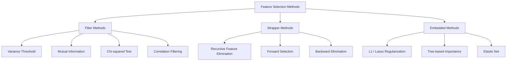
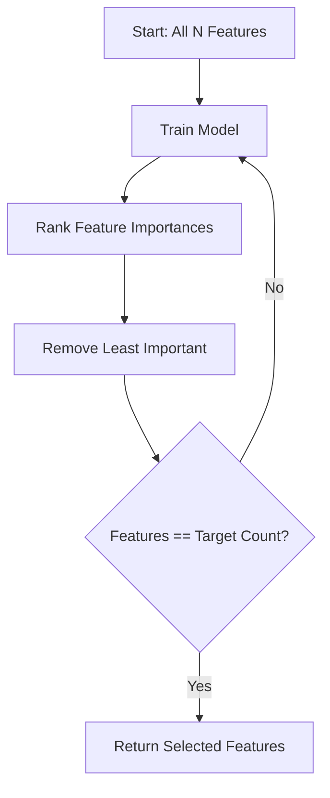
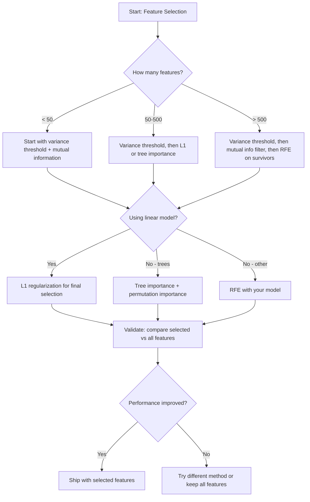

# विशेषता चयन

> 更多 विशेषताएं नहीं बेहतर हैं 才更好.

**Type:** Build
**Language:**पायथन
**先修要求：**चरण 2, पाठ 01-09, 08(特征工程)
**Time:** ~75 分钟

## 学习目标
- शून्य से फ़िल्टर पद्धति को प्राप्त करना (रेंज थ्रॉवल, पारस्परिक जानकारी, चि-क्वायर) और रैपर पद्धति (RFE, आगे का चयन)
-  व्याख्या क्यों आपसी सूचना                                                                                                                                                                                                                                                                                                                                                                                                                                                                                                                        
- तुलना करें L1 नियमितता (अंकित चयन) और RFE (अंकित चयन)
- बिल्डिंग एक संयोजन बहुविध विधि सुविधा चयन पाइपलाइन, और प्रदर्शित यह पर रखा डेटा पर सुधार सामान्यीकरण के प्रभाव

## 问题
आपके पास 500 विशेषताएं हैं। आपका मॉडल बहुत धीमा है, लगातार ओवरफिट होता है, और कोई भी यह नहीं समझा सकता कि उसने क्या सीखा है। आप लगातार अधिक विशेषताएं जोड़ते हैं, प्रदर्शन में सुधार की उम्मीद करते हैं। परिणाम खराब हो जाते हैं।

यह आयामीता की शाप की वास्तविक अभिव्यक्ति है। संख्यात्मक वृद्धि, सुविधाओं के साथ सुविधाओं की विशालता में विस्फोटक वृद्धि हुई है। डेटा बिंदुओं के बीच की दूरी कम हो गई है।

विशेषता चयन है解药──剥离噪音──移除冗余──保留那些真正携带目标信息的特征──结果是:训练更快、一般化更好,并且模型真的可以解释──

 लक्ष्य सभी उपलब्ध सूचनाओं का उपयोग नहीं करना है, बल्कि सही सूचनाओं का उपयोग करना है।

## 概念
### विशेषता चयन के तीन प्रकार

प्रत्येक प्रकार की विशेषता चयन विधि निम्नलिखित तीन वर्गों में से एक हैः



**Filter methods**उपयोग सांख्यिकीय माप स्वतंत्र रूप से प्रत्येक विशेषता के लिए 打分──它们不使用模型──速度快,但会错失功能相互作用──

**Wrapper methods** प्रशिक्षण मॉडल फीचर सबसेट का मूल्यांकन करने के लिए  वे मॉडल प्रदर्शन का उपयोग  के रूप में  करते हैं  परिणाम बेहतर हैं, लेकिन लागत अधिक है, क्योंकि मॉडल को कई बार पुनः प्रशिक्षित करने की आवश्यकता होती है

**Embedded methods**मॉडलिंग प्रशिक्षण के दौरान विशेषताएं चुनें。L1 नियमितता  वजन  शून्य को आगे बढ़ाएगी。 निर्णय वृक्ष  सबसे उपयोगी विशेषताओं पर आधारित  विभाजन करें。 चयन  फ़िटिंग के दौरान होता है, न कि एक अलग चरण के रूप में

### भिन्नता की सीमा

️️️️️️️️️️️️️️️️️️️️️️️️️️️️️️️️️️️️️️️️️️️️️️️️️️️️️️️️️️️️️️️️️️️️️️️️️️️️️️️️️️️️️️️️️️️️️️️️️️️️️️️️️️️️️️️️️️️️️️️️️️️️️️️️️️️️️️️️️️️️️️️️️️️️️️️️️️️️️️️️️️️️️️️️️️️️️️️️️️️️️️️️️️️️️️️️️️️️️️️️️️️️️️️️️️️️️️️️️️️️️️️️️️️️️️️️️️️️️️️️️️️️️️️️️️️️️️️️️️️️️️️️️️️️️️️️️️️️️️️️️️️️️️️️️️️️️️️️️️️️️️️️️️️️️️️️️️️️️️️️️️️️️️️️️️️️️️️️️️️️️️️️️️️️️️️️️️️️️️️️️️️️️️️️️️️️️️️️️️️️️️️️️️️️️️️️️️️️️️️️️️️️️️️️️️️️️️️️️️️️️️️️️️️️️️️️️️️️️️️️️️️️️️️️️️️️️️️️️️️️️️️️️️️️️️️️️️️️️️️️️️️️️️️️️️️️️️️️️️️️️️️️️️️️

 एक विशेषता पर विचार करें, 1000 ऩमों में से 999 ऩमों में 0.0 ऩम हैं। ऩम ऩम ऩम ऩम ऩम ऩम ऩम ऩम ऩम ऩम ऩम ऩम ऩम ऩम ऩम ऩम ऩम ऩम ऩम ऩम ऩम ऩम ऩम ऩम ऩम ऩम ऩम ऩम ऩम ऩम ऩम ऩम ऩम ऩम ऩम ऩम ऩम ऩम ऩम ऩम ऩम ऩम ऩम ऩम ऩम ऩम ऩम ऩम ऩम ऩम ऩम ऩम ऩम ऩम ऩम ऩम ऩम ऩम ऩम ऩम ऩम ऩम ऩम ऩम ऩम ऩम ऩम ऩम ऩम ऩम ऩम ऩम ऩम ऩम ऩम ऩम ऩम ऩम ऩम ऩम ऩम ऩम ऩम ऩम ऩम ऩम ऩम ऩम ऩम ऩम ऩम ऩम ऩम ऩम ऩम ऩम ऩम ऩम ऩम ऩम ऩम ऩम ऩम ऩम ऩम ऩम ऩम ऩम ऩम ऩम ऩम ऩम ऩम ऩम ऩम ऩम ऩम ऩम ऩम ऩम ऩम ऩम ऩम ऩम ऩम ऩम ऩम ऩम ऩम ऩम ऩम ऩम ऩम ऩम ऩम ऩम ऩम ऩम ऩम ऩम ऩम ऩम ऩम ऩम ऩम ऩम ऩम ऩम ऩम ऩम ऩम ऩम ऩम ऩम ऩम ऩम ऩम ऩम ऩम ऩम ऩ

```
variance(x) = mean((x - mean(x))^2)
```

 एक सीमा सेट करें (उदाहरण के लिए 0.01)  प्रत्येक भिन्नता को  इस सीमा से कम की विशेषता से त्याग दें यह लक्ष्य चर को पूरी तरह से अनदेखा करने के मामले में स्थिरांक या निकट-स्थिरताओं को हटा देगा

उपयोगः अन्य तरीकों से पहले पूर्व प्रसंस्करण चरण के रूप में यह लगभग शून्य लागत से स्पष्ट रूप से बेकार सुविधाओं को पकड़ लेता है।

सीमा: एक विशेषता हो सकती है उच्च भिन्नता, लेकिन अभी भी शुद्ध शोर है।

### परस्पर सूचना

पारस्परिक सूचना  मापने के लिए पता है कि विशेषता X का मूल्य लक्ष्य Y की अनिश्चितता को किस हद तक कम कर सकता है।

```
I(X; Y) = sum_x sum_y p(x, y) * log(p(x, y) / (p(x) * p(y)))
```

यदि X 和 Y 独立,则 p(x, y) = p(x) * p(y), तो log 项为零,I(X; Y) = 0──X 能告诉你越多关于 Y 的信息,相互信息就越高──

तुलनात्मक संबंध के महत्वपूर्ण लाभः आपसी जानकारी ️️️️️️️️️️️️️️️️️️️️️️️️️️️️️️️️️️️️️️️️️️️️️️️️️️️️️️️️️️️️️️️️️️️️️️️️️️️️️️️️️️️️️️️️️️️️️️️️️️️️️️️️️️️️️️️️️️️️️️️️️️️️️️️️️️️️️️️️️️️️️️️️️️️️️️️️️️️️️️️️️️️️️️️️️️️️️️️️️️️️️️️️️️️️️️️️️️️️️️️️️️️️️️️️️️️️️️️️️️️️️️️️️️️️️️️️️️️️️️️️️️️️️️️️️️️️️️️️️️️️️️️️️️️️️️️️️️️️️️️️️️️️️️️️️️️️️️️️️️️️️️️️️️️️️️️️️️️️️️️️️️️️️️️️️️️️️️️️️️️️️️️️️️️️️️️️️️️️️️️️️️️️️️️️️️️️️️️️️️️️️️️️️️️️️️️️️️️️️️️️️️️️️️️️️️️️️️️️️️️️️️️️️️️️️️️️️️️️️️️️️️️️️️️️️️️️️️️️️️️️️️️️️️️️️️️️️️️️️️️️️️️️️️️️️️️️️️️️️️

 निरंतर सुविधाओं के लिए, पहले व्यंजनों को ध्यान में रखें️ हिस्टोग्राम के आधार पर अनुमान)️️️️️️️️️️️️️️️️️️️️️️️️️️️️️️️️️️️️️️️️️️️️️️️️️️️️️️️️️️️️️️️️️️️️️️️️️️️️️️️️️️️️️️️️️️️️️️️️️️️️️️️️️️️️️️️️️️️️️️️️️️️️️️️️️️️️️️️️️️️️️️️️️️️️️️️️️️️️️️️️️️️️️️️️️️️️️️️️️️️️️️️️️️️️️️️️️️️️️️️️️️️️️️️️️️️️️️️️️️️️️️️️️️️️️


### पुनरावर्ती विशेषता उन्मूलन (RFE)

आरएफई एक रैपर विधि है। यह मॉडल का उपयोग करता है।

1. उपयोग सभी सुविधाएँ  प्रशिक्षण मॉडल
2. 按重点对特征 排名(रेखीय मॉडल प्रयोग गुणांक,वृक्ष प्रयोग अशुद्धता में कमी)
3. 移除最不重要 विशेषताएं
4. 重复, until शेष期望 संख्यात्मक विशेषताएं



आरएफई फीचर इंटरैक्शन पर विचार करेगा, क्योंकि मॉडल एक ही समय में सभी शेष फीचर्स को देखेगा। एक फीचर को हटाने से अन्य फीचर्स का महत्व बदल जाएगा।

成本:You need to train model N - target 次。 500  फीचर्स के लिए  लक्ष्य 为 10 की स्थिति में, यह 490 बार प्रशिक्षण है。 महंगे मॉडल के लिए, यह बहुत धीमा होगा。 प्रत्येक चरण के माध्यम से कई फीचर्स को स्थानांतरित किया जा सकता है ताकि गति प्राप्त हो सके जैसे कि प्रत्येक चरण को स्थानांतरित करने के लिए नीचे 10%)。

### L1 (लासो) विनियमन

L1 नियमितकरण 会把重量的绝对值加入 हानि फ़ंक्शन:

```
loss = prediction_error + alpha * sum(|w_i|)
```

अल्फा 参数 नियंत्रण विशेषताएं 被剪枝的激进程度── अल्फा 越高,越多重量 会精确变成零──

L1 पेनल्टी वजन स्थान में एक 形束区域 का निर्माण करती है। सबसे अच्छा उपयोग इस 形 के कोने पर होता है, जहां एक या अधिक वजन 形 के लिए 零──L2 नियमितता)

यही एम्बेडेड फीचर चयन हैः मॉडल में प्रशिक्षण के दौरान सीखने के लिए कौन सी विशेषताएं                                                                                                                                                                                                                                                     

优势: केवल एक बार प्रशिक्षण की आवश्यकता है,能处理相关特征(选择其中一个并把其他置零),内置于大多数线性模型实现中──

सीमाएँः केवल रैखिक मॉडल के लिए लागू होते हैं 

### पेड़ आधारित विशेषता का महत्व

निर्णय वृक्ष  और उनके समूहों  यादृच्छिक वन  ग्रेडिएंट बढ़ते हुए)  排名 排名   प्रत्येक विभाजित शहर                                                                                                                                                                                                                                            

 के लिए  पेड़  के यादृच्छिक जंगल:

```
importance(feature_j) = (1/T) * sum over all trees of
    sum over all nodes splitting on feature_j of
        (n_samples * impurity_decrease)
```

यह प्रत्येक विशेषता के लिए सामान्य महत्व स्कोर प्रदान करेगा। यह स्वचालित रूप से गैर-रेखीय संबंधों और विशेषता बातचीत को संभाल सकता है।

ध्यानःवृक्ष आधारित महत्व 会偏向具有许多独特值的特征 ([[उच्च कार्डिनलता]]) 随机 ID 列会显得重要,因为它能完美分分每样品──使用 permutation importance 作为智能检查──

### उत्परिवर्तन महत्व

एक प्रकार का मॉडल-अज्ञानी 方法:

1. प्रशिक्षण मॉडल, और सत्यापन डेटा ऊपर रिकॉर्ड आधार पर प्रदर्शन
2. प्रत्येक विशेषता के लिएः के रूप में यह के मानों को मिलाएं, माप प्रदर्शन की गिरावट
3. नीचे गिरना, यह सुविधा  अधिक महत्वपूर्ण है

यदि एक विशेषता को मिटाया जाए, तो यह प्रदर्शन को नुकसान नहीं पहुंचाएगा, मॉडल पर निर्भर नहीं करेगा।

परिवर्तन महत्व  वृक्ष आधारित महत्व के कार्डिनलता पूर्वाग्रह से बचें  लेकिन यह बहुत धीमा हैः प्रत्येक विशेषता का एक बार पूर्ण मूल्यांकन करने की आवश्यकता होती है, और स्थिरता प्राप्त करने के लिए कई बार दोहराया जाना चाहिए

### तुलना तालिका

| Method | Type | Speed | Nonlinear | Feature Interactions |
|--------|------|-------|-----------|---------------------|
| Variance threshold | Filter | 非常快 | 否 | 否 |
| Mutual information | Filter | 快 | 是 | 否 |
| Correlation filter | Filter | 快 | 否 | 否 |
| RFE | Wrapper | 慢 | 取决于 model | 是 |
| L1 / Lasso | Embedded | 快 | 否（linear） | 否 |
| Tree importance | Embedded | 中等 | 是 | 是 |
| Permutation importance | Model-agnostic | 慢 | 是 | 是 |

### निर्णय प्रवाह चार्ट




```figure
f3-feature-prune
```

##  इसे निर्माण
### 步骤 1: ज्ञात विशेषता संरचना के साथ सिंथेटिक डेटा उत्पन्न करें

```python
import numpy as np


def make_feature_selection_data(n_samples=500, seed=42):
    rng = np.random.RandomState(seed)

    x1 = rng.randn(n_samples)
    x2 = rng.randn(n_samples)
    x3 = rng.randn(n_samples)
    x4 = x1 + 0.1 * rng.randn(n_samples)
    x5 = x2 + 0.1 * rng.randn(n_samples)

    informative = np.column_stack([x1, x2, x3, x4, x5])

    correlated = np.column_stack([
        x1 * 0.9 + 0.1 * rng.randn(n_samples),
        x2 * 0.8 + 0.2 * rng.randn(n_samples),
        x3 * 0.7 + 0.3 * rng.randn(n_samples),
        x1 * 0.5 + x2 * 0.5 + 0.1 * rng.randn(n_samples),
        x2 * 0.6 + x3 * 0.4 + 0.1 * rng.randn(n_samples),
    ])

    noise = rng.randn(n_samples, 10) * 0.5

    X = np.hstack([informative, correlated, noise])
    y = (2 * x1 - 1.5 * x2 + x3 + 0.5 * rng.randn(n_samples) > 0).astype(int)

    feature_names = (
        [f"info_{i}" for i in range(5)]
        + [f"corr_{i}" for i in range(5)]
        + [f"noise_{i}" for i in range(10)]
    )

    return X, y, feature_names
```

हम जानते हैं कि मूल सत्यः विशेषताएं 0-4 सूचनात्मक हैं और 3 和 4 0 和 1 के संबद्ध प्रतियां हैं), विशेषताएं 5-9 सूचनात्मक विशेषताएं हैं  संबंधित, विशेषताएं 10-19 शुद्ध शोर हैं।

### 步骤 2: भिन्नता सीमा

```python
def variance_threshold(X, threshold=0.01):
    variances = np.var(X, axis=0)
    mask = variances > threshold
    return mask, variances
```

### 步骤 3: पारस्परिक सूचना (विवश)

```python
def discretize(x, n_bins=10):
    min_val, max_val = x.min(), x.max()
    if max_val == min_val:
        return np.zeros_like(x, dtype=int)
    bin_edges = np.linspace(min_val, max_val, n_bins + 1)
    binned = np.digitize(x, bin_edges[1:-1])
    return binned


def mutual_information(X, y, n_bins=10):
    n_samples, n_features = X.shape
    mi_scores = np.zeros(n_features)

    y_vals, y_counts = np.unique(y, return_counts=True)
    p_y = y_counts / n_samples

    for f in range(n_features):
        x_binned = discretize(X[:, f], n_bins)
        x_vals, x_counts = np.unique(x_binned, return_counts=True)
        p_x = dict(zip(x_vals, x_counts / n_samples))

        mi = 0.0
        for xv in x_vals:
            for yi, yv in enumerate(y_vals):
                joint_mask = (x_binned == xv) & (y == yv)
                p_xy = np.sum(joint_mask) / n_samples
                if p_xy > 0:
                    mi += p_xy * np.log(p_xy / (p_x[xv] * p_y[yi]))
        mi_scores[f] = mi

    return mi_scores
```

### 步骤 4: पुनरावर्ती विशेषता उन्मूलन

```python
def simple_logistic_importance(X, y, lr=0.1, epochs=100):
    n_samples, n_features = X.shape
    w = np.zeros(n_features)
    b = 0.0

    for _ in range(epochs):
        z = X @ w + b
        pred = 1.0 / (1.0 + np.exp(-np.clip(z, -500, 500)))
        error = pred - y
        w -= lr * (X.T @ error) / n_samples
        b -= lr * np.mean(error)

    return w, b


def rfe(X, y, n_features_to_select=5, lr=0.1, epochs=100):
    n_total = X.shape[1]
    remaining = list(range(n_total))
    rankings = np.ones(n_total, dtype=int)
    rank = n_total

    while len(remaining) > n_features_to_select:
        X_subset = X[:, remaining]
        w, _ = simple_logistic_importance(X_subset, y, lr, epochs)
        importances = np.abs(w)

        least_idx = np.argmin(importances)
        original_idx = remaining[least_idx]
        rankings[original_idx] = rank
        rank -= 1
        remaining.pop(least_idx)

    for idx in remaining:
        rankings[idx] = 1

    selected_mask = rankings == 1
    return selected_mask, rankings
```

### 步骤 5: L1 विशेषता चयन

```python
def soft_threshold(w, alpha):
    return np.sign(w) * np.maximum(np.abs(w) - alpha, 0)


def l1_feature_selection(X, y, alpha=0.1, lr=0.01, epochs=500):
    n_samples, n_features = X.shape
    w = np.zeros(n_features)
    b = 0.0

    for _ in range(epochs):
        z = X @ w + b
        pred = 1.0 / (1.0 + np.exp(-np.clip(z, -500, 500)))
        error = pred - y

        gradient_w = (X.T @ error) / n_samples
        gradient_b = np.mean(error)

        w -= lr * gradient_w
        w = soft_threshold(w, lr * alpha)
        b -= lr * gradient_b

    selected_mask = np.abs(w) > 1e-6
    return selected_mask, w
```

### 步骤 6: वृक्ष आधारित महत्व (सरल निर्णय वृक्ष)

```python
def gini_impurity(y):
    if len(y) == 0:
        return 0.0
    classes, counts = np.unique(y, return_counts=True)
    probs = counts / len(y)
    return 1.0 - np.sum(probs ** 2)


def best_split(X, y, feature_idx):
    values = np.unique(X[:, feature_idx])
    if len(values) <= 1:
        return None, -1.0

    best_threshold = None
    best_gain = -1.0
    parent_gini = gini_impurity(y)
    n = len(y)

    for i in range(len(values) - 1):
        threshold = (values[i] + values[i + 1]) / 2.0
        left_mask = X[:, feature_idx] <= threshold
        right_mask = ~left_mask

        n_left = np.sum(left_mask)
        n_right = np.sum(right_mask)

        if n_left == 0 or n_right == 0:
            continue

        gain = parent_gini - (n_left / n) * gini_impurity(y[left_mask]) - (n_right / n) * gini_impurity(y[right_mask])

        if gain > best_gain:
            best_gain = gain
            best_threshold = threshold

    return best_threshold, best_gain


def tree_importance(X, y, n_trees=50, max_depth=5, seed=42):
    rng = np.random.RandomState(seed)
    n_samples, n_features = X.shape
    importances = np.zeros(n_features)

    for _ in range(n_trees):
        sample_idx = rng.choice(n_samples, size=n_samples, replace=True)
        feature_subset = rng.choice(n_features, size=max(1, int(np.sqrt(n_features))), replace=False)

        X_boot = X[sample_idx]
        y_boot = y[sample_idx]

        tree_imp = _build_tree_importance(X_boot, y_boot, feature_subset, max_depth)
        importances += tree_imp

    total = importances.sum()
    if total > 0:
        importances /= total

    return importances


def _build_tree_importance(X, y, feature_subset, max_depth, depth=0):
    n_features = X.shape[1]
    importances = np.zeros(n_features)

    if depth >= max_depth or len(np.unique(y)) <= 1 or len(y) < 4:
        return importances

    best_feature = None
    best_threshold = None
    best_gain = -1.0

    for f in feature_subset:
        threshold, gain = best_split(X, y, f)
        if gain > best_gain:
            best_gain = gain
            best_feature = f
            best_threshold = threshold

    if best_feature is None or best_gain <= 0:
        return importances

    importances[best_feature] += best_gain * len(y)

    left_mask = X[:, best_feature] <= best_threshold
    right_mask = ~left_mask

    importances += _build_tree_importance(X[left_mask], y[left_mask], feature_subset, max_depth, depth + 1)
    importances += _build_tree_importance(X[right_mask], y[right_mask], feature_subset, max_depth, depth + 1)

    return importances
```

### 步骤 7: सभी तरीकों को चलाएं और तुलना करें

代码文件会在同一合成数据集上运行全部五种方法,并打印一个比较表,显示每个方法选择了哪些功能──

## इसका उपयोग करें
उपयोग करें स्किट-लर्न 时,विशेषताओं का चयन 已内置到管道 中:

```python
from sklearn.feature_selection import (
    VarianceThreshold,
    mutual_info_classif,
    RFE,
    SelectFromModel,
)
from sklearn.linear_model import Lasso, LogisticRegression
from sklearn.ensemble import RandomForestClassifier

vt = VarianceThreshold(threshold=0.01)
X_filtered = vt.fit_transform(X)

mi_scores = mutual_info_classif(X, y)
top_k = np.argsort(mi_scores)[-10:]

rfe_selector = RFE(LogisticRegression(), n_features_to_select=10)
rfe_selector.fit(X, y)
X_rfe = rfe_selector.transform(X)

lasso_selector = SelectFromModel(Lasso(alpha=0.01))
lasso_selector.fit(X, y)
X_lasso = lasso_selector.transform(X)

rf = RandomForestClassifier(n_estimators=100)
rf.fit(X, y)
importances = rf.feature_importances_
```

इन सभी तरीकों से जो होता है, उसे सही ढंग से प्रदर्शित किया गया है।`var(X, axis=0)`并应用面具── आपसी जानकारी है आकस्मिकता तालिका में मध्य统计 संयुक्त 和 मार्जिनल आवृत्तियों──RFE एक प्रशिक्षण,排名,剪枝的循环──L1 带软门 步骤的渐进下降──三重点 会在分区间累积杂质减小──没有魔法,只是统计和循环──

sklearn  संस्करण ने मजबूती बढ़ाई है, उदाहरण के लिए, पारस्परिक_info_classif का उपयोग करना k-NN घनत्व अनुमान के बजाय बिल्डिंग) 、गति (C 实现) और पाइपलाइन एकीकरण

## 交付 यह
本课产出:
- `outputs/skill-feature-selector.md`-- सही सुविधा चयन विधि का चयन करने के लिए उपयोग किया गया है

## अभ्यास
1. **Forward selection**: RFE की विपरीत प्रक्रिया को पूरा करना 零个特征 से शुरू करना 开始── प्रत्येक चरण में जोड़ा जा सकता है सबसे अधिक सुधार करने वाला मॉडल प्रदर्शन का एक विशेषता── जब जोड़ा गया है सुविधाएँ 无再有助时停止── चयनित सुविधाएँ RFE के परिणामों से तुलना करें── कौन सा अधिक तेज़ है? कौन सा परिणाम बेहतर है?

2. **Stability selection**: चलना L1 सुविधा चयन 50 बार, प्रत्येक बार उपयोग डेटा के साथ 80% उप-सैंपल, और उपयोग थोड़ा अलग अल्फा मानों।

3. **Multicollinearity detection**: गणना सभी सुविधाओं का सहसंबंध मैट्रिक्स── एक फ़ंक्शन को प्राप्त करना, एक निश्चित सहसंबंध सीमा प्रदान करना, उदाहरण के लिए 0.9), प्रत्येक अत्यधिक सहसंबंधित सुविधाओं के प्रति एक सुविधा को हटाना, लक्ष्य की पारस्परिक जानकारी को बनाए रखना और अधिक)── सिंथेटिक डेटासेट में 上测试,并验证它移除了冗余 सहसंबंधित सुविधाएँ──

4. **Feature selection pipeline**:把差异门,相互信息过 和 RFE 串成一条管道──先移除近零差异特征,然后按相互信息保留50%,再在幸存者上运行 RFE──将该管道与直接在所有特征上运行 RFE比较──管道更快吗?准确性是否相同?

5. **Permutation importance from scratch**: पारमुट्य महत्व को प्राप्त करना। प्रत्येक विशेषता के लिए, इसके मानों को 10 बार मिलाएं, F1 स्कोर का औसत घटाव मापें।

## 关键术语
| Term | What people say | What it actually means |
|------|----------------|----------------------|
| Filter method | “独立为 features 打分” | 一种 feature selection 方法，不训练 model，而是使用统计度量对 features 排名，并孤立地评估每个 feature |
| Wrapper method | “用 model 挑 features” | 一种 feature selection 方法，通过训练 model 并使用其 performance 作为 selection criterion 来评估 feature subsets |
| Embedded method | “model 在训练期间选择 features” | 作为 model fitting 一部分发生的 feature selection，例如 L1 regularization 会把 weights 推向零 |
| Mutual information | “一个变量能告诉你关于另一个变量的多少信息” | 给定 X 的知识后，关于 Y 的不确定性减少量的度量，能够捕捉线性和非线性 dependencies |
| Recursive Feature Elimination | “训练、排名、剪枝、重复” | 一种迭代式 wrapper method，会训练 model、移除最不重要的 feature(s)，并重复直到达到 target count |
| L1 / Lasso regularization | “会消灭 features 的 penalty” | 将 weight 绝对值之和加入 Loss Function，这会把不重要 feature 的 weights 推到精确为零 |
| Variance threshold | “移除 constant features” | 丢弃在 samples 之间 variance 低于指定 threshold 的 features，过滤掉不携带信息的 features |
| Feature importance | “哪些 features 最重要” | 表示每个 feature 对 model predictions 贡献程度的分数，可由 split gains（trees）或 coefficient magnitudes（linear）计算 |
| Permutation importance | “shuffle 并测量损害” | 通过随机 shuffle 每个 feature 的 values，并测量由此导致的 model performance 下降来评估 feature importance |
| Curse of dimensionality | “features 太多，data 不够” | 添加 features 会使 feature space 的体积指数级增长，导致 data 稀疏且 distances 失去意义的现象 |

## 延伸阅读
- [An Introduction to Variable and Feature Selection (Guyon & Elisseeff, 2003)](https://jmlr.org/papers/v3/guyon03a.html)-- विशेषता चयन विधियों का आधारभूत विवरण, आज भी व्यापक रूप से उद्धृत किया जाता है
- [scikit-learn Feature Selection Guide](https://scikit-learn.org/stable/modules/feature_selection.html)-- ∙ फ़िल्टर, रैपर तथा एम्बेडेड तरीकों के बारे में व्यावहारिक संदर्भ, कोड उदाहरण शामिल हैं
- [Stability Selection (Meinshausen & Buhlmann, 2010)](https://arxiv.org/abs/0809.2932)-- एक मजबूत पुनः प्रयोज्य परिणाम प्राप्त करने के लिए सुविधा चयन के साथ संयोजन में उप-सैंपलिंग
- [Beware Default Random Forest Importances (Strobl et al., 2007)](https://bmcbioinformatics.biomedcentral.com/articles/10.1186/1471-2105-8-25)-- वृक्ष आधारित महत्व दिखाएं 中的 कार्डिनलता पूर्वाग्रह,并 सशर्त महत्व 作为替代方案
