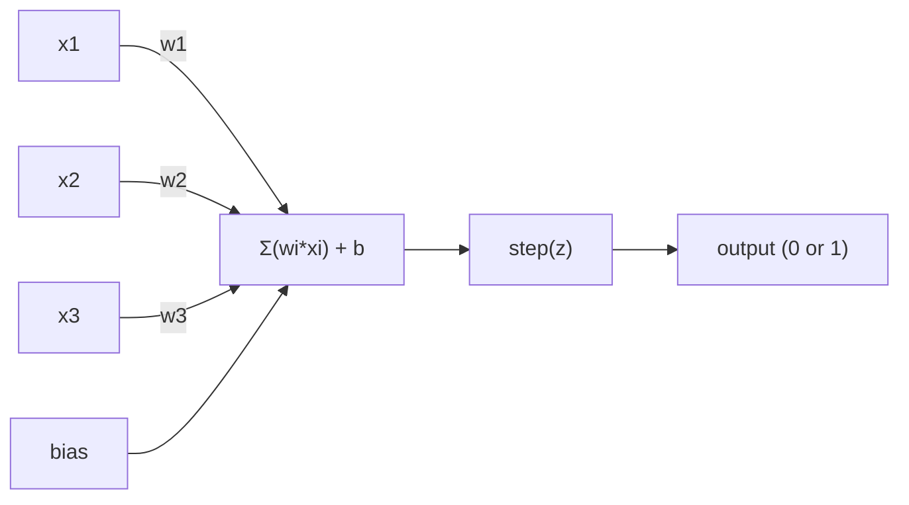
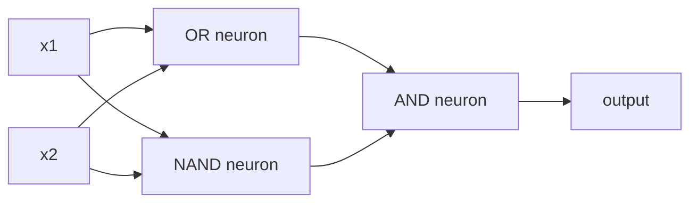

# पर्सेप्ट्रोन

> पर्सेप्ट्रॉन न्यूरल नेटवर्क का परमाणु है। इसे तोड़ने पर, आप वजन देखेंगे।

**类型：**构建
**语言：**पायथन
**先修要求：**चरण 1 ((रेखीय बीजगणित 直觉)
**时间：**~ 60 मिनट

## 学习目标
- पायथन से शून्य को लागू करने के लिए एक Perceptron, वजन अद्यतन नियम और कदम सक्रियण समारोह सहित
- 解释为什么单个Perceptron只能解决线性分离的问题,并演示XOR विफलता मामला
- 组合 OR、NAND 和 AND गेट के माध्यम से  निर्माण एक बहु-परत धारणा XOR हल करने के लिए
- उपयोग सिग्मोइड सक्रियण और बैकप्रॉपेगमेंट  प्रशिक्षण दो परत नेटवर्क, अपने आप XOR सीखने बनाने

## 问题
आप वेक्टर और डॉट उत्पाद को समझ चुके हैं। आप जानते हैं कि मैट्रिक्स इनपुट को आउटपुट में बदल देगा। लेकिन मशीन को कैसे *लर्निंग* करना चाहिए?

पर्सेप्ट्रॉन ने इस प्रश्न का उत्तर दिया। यह सबसे सरल सीखने की मशीन हैः कुछ इनपुट प्राप्त करें, वजन गुणा करें, पूर्वाग्रह जोड़ें, फिर एक द्विआधारी निर्णय लें। इसके बाद पुनः समायोजन करें।

Perceptron को समझने का मतलब है कोड में लर्निंग को समझने का मतलब है लर्निंग  तक आखिर क्या हैः लगातार संख्याओं को समायोजित करने तक, जब तक आउटपुट   यथार्थ के अनुरूप  तक

## 概念
### एक न्यूरॉन, एक निर्णय

एक पर्सेप्ट्रॉन  n  इनपुट प्राप्त करेगा, प्रत्येक इनपुट  को एक भार, मांग और जोड़कर पूर्वाग्रह में गुणा करेगा, फिर परिणाम को एक सक्रियण फ़ंक्शन में प्रसारित करेगा



चरण फ़ंक्शन 非常直接: यदि भारित योग 加 पूर्वाग्रह >= 0, तो आउटपुट 为 1──否则, आउटपुट 为 0──

```
step(z) = 1  if z >= 0
           0  if z < 0
```

यह एक रैखिक वर्गीकरणकर्ता है। वजन और पूर्वाग्रह एक लाइन को परिभाषित करते हैं।

### निर्णय सीमा

 दो इनपुट के लिए, पर्सेप्ट्रॉन 2 डी अंतरिक्ष में एक लाइन खींचता हैः

```
  x2
  ┤
  │  Class 1        /
  │    (0)          /
  │                /
  │               / w1·x1 + w2·x2 + b = 0
  │              /
  │             /     Class 2
  │            /        (1)
  ┼───────────/──────────── x1
```

線一側所有点输出 为 0──另一側所有点输出 为 1── प्रशिक्षण प्रक्रिया इस लाइन को तब तक ले जाएगी जब तक कि यह इन वर्गों से सही ढंग से अलग न हो जाए──

### सीखने का नियम

Perceptron सीखने नियम 很简单:

```
For each training example (x, y_true):
    y_pred = predict(x)
    error = y_true - y_pred

    For each weight:
        w_i = w_i + learning_rate * error * x_i
    bias = bias + learning_rate * error
```

यदि भविष्यवाणी सही है, तो त्रुटि = 0, कुछ भी नहीं बदलेगा। यदि यह भविष्यवाणी 0 है, लेकिन यह 1, वजन बढ़ेगा। यदि यह 1 है, लेकिन यह 0, वजन घटेगा।

### एक्सओआर समस्या

 समस्या यहाँ पर है  इन तर्क द्वारों को देखें:

```
AND gate:           OR gate:            XOR gate:
x1  x2  out         x1  x2  out         x1  x2  out
0   0   0           0   0   0           0   0   0
0   1   0           0   1   1           0   1   1
1   0   0           1   0   1           1   0   1
1   1   1           1   1   1           1   1   0
```

और 和 OR है रैखिक रूप से अलग करने योग्य के: आप एक रेखा खींच सकते हैं,把 0 和 1 分开。XOR 则不是──没有任何一条直线能把 [0,1] 和 [1,0] 与 [0,0] 和 [1,1] 分开──

```
AND (separable):        XOR (not separable):

  x2                      x2
  1 ┤  0     1            1 ┤  1     0
    │     /                 │
  0 ┤  0 / 0              0 ┤  0     1
    ┼──/──────── x1         ┼──────────── x1
       line works!          no single line works!
```

यह एक मूलभूत सीमा है। एकल धारणा केवल रैखिक रूप से अलग करने योग्य समस्याओं को हल कर सकती है। 1969 में मिन्स्की और पेपर ने इस बात का प्रमाण दिया, जबकि इससे लगभग एक दशक तक न्यूरल नेटवर्क अनुसंधान रुक गया।

 समाधान: 把Perceptron 堆叠成层── बहु-层 perceptron दो रैखिक निर्णयों को 组合成 एक गैर रैखिक निर्णय XOR को हल करने के लिए 组合成 एक गैर रैखिक निर्णय को 组合成 XOR──


```figure
perceptron-boundary
```

##  इसे निर्माण
### 步骤 1:Perceptron वर्ग

```python
class Perceptron:
    def __init__(self, n_inputs, learning_rate=0.1):
        self.weights = [0.0] * n_inputs
        self.bias = 0.0
        self.lr = learning_rate

    def predict(self, inputs):
        total = sum(w * x for w, x in zip(self.weights, inputs))
        total += self.bias
        return 1 if total >= 0 else 0

    def train(self, training_data, epochs=100):
        for epoch in range(epochs):
            errors = 0
            for inputs, target in training_data:
                prediction = self.predict(inputs)
                error = target - prediction
                if error != 0:
                    errors += 1
                    for i in range(len(self.weights)):
                        self.weights[i] += self.lr * error * inputs[i]
                    self.bias += self.lr * error
            if errors == 0:
                print(f"Converged at epoch {epoch + 1}")
                return
        print(f"Did not converge after {epochs} epochs")
```

### 步骤 2: तर्क के द्वार पर 上训练

```python
and_data = [
    ([0, 0], 0),
    ([0, 1], 0),
    ([1, 0], 0),
    ([1, 1], 1),
]

or_data = [
    ([0, 0], 0),
    ([0, 1], 1),
    ([1, 0], 1),
    ([1, 1], 1),
]

not_data = [
    ([0], 1),
    ([1], 0),
]

print("=== AND Gate ===")
p_and = Perceptron(2)
p_and.train(and_data)
for inputs, _ in and_data:
    print(f"  {inputs} -> {p_and.predict(inputs)}")

print("\n=== OR Gate ===")
p_or = Perceptron(2)
p_or.train(or_data)
for inputs, _ in or_data:
    print(f"  {inputs} -> {p_or.predict(inputs)}")

print("\n=== NOT Gate ===")
p_not = Perceptron(1)
p_not.train(not_data)
for inputs, _ in not_data:
    print(f"  {inputs} -> {p_not.predict(inputs)}")
```

### 步骤 3:观察 XOR 失败

```python
xor_data = [
    ([0, 0], 0),
    ([0, 1], 1),
    ([1, 0], 1),
    ([1, 1], 0),
]

print("\n=== XOR Gate (single perceptron) ===")
p_xor = Perceptron(2)
p_xor.train(xor_data, epochs=1000)
for inputs, expected in xor_data:
    result = p_xor.predict(inputs)
    status = "OK" if result == expected else "WRONG"
    print(f"  {inputs} -> {result} (expected {expected}) {status}")
```

यह कभी भी एक दूसरे के साथ नहीं होगा। यह एक एकल धारणा है जो XOR का कठिन प्रमाण नहीं सीख सकती है।

### 步骤 4: दो परतों के साथ  हल XOR

技巧是:XOR = (x1 OR x2) और NOT (x1 AND x2)



```python
def xor_network(x1, x2):
    or_neuron = Perceptron(2)
    or_neuron.weights = [1.0, 1.0]
    or_neuron.bias = -0.5

    nand_neuron = Perceptron(2)
    nand_neuron.weights = [-1.0, -1.0]
    nand_neuron.bias = 1.5

    and_neuron = Perceptron(2)
    and_neuron.weights = [1.0, 1.0]
    and_neuron.bias = -1.5

    hidden1 = or_neuron.predict([x1, x2])
    hidden2 = nand_neuron.predict([x1, x2])
    output = and_neuron.predict([hidden1, hidden2])
    return output


print("\n=== XOR Gate (multi-layer network) ===")
for inputs, expected in xor_data:
    result = xor_network(inputs[0], inputs[1])
    print(f"  {inputs} -> {result} (expected {expected})")
```

चार प्रकार की स्थिति पूरी तरह सही है।

### 步骤 5: दो-परत नेटवर्क को प्रशिक्षित करें

चरण 4 हाथ से वजन जोड़ दिया गया है। यह XOR के लिए प्रभावी है, लेकिन आप पहले से सही वजन के बारे में नहीं जानते हैं के लिए वास्तविक समस्या है।

```python
class TwoLayerNetwork:
    def __init__(self, learning_rate=0.5):
        import random
        random.seed(0)
        self.w_hidden = [[random.uniform(-1, 1), random.uniform(-1, 1)] for _ in range(2)]
        self.b_hidden = [random.uniform(-1, 1), random.uniform(-1, 1)]
        self.w_output = [random.uniform(-1, 1), random.uniform(-1, 1)]
        self.b_output = random.uniform(-1, 1)
        self.lr = learning_rate

    def sigmoid(self, x):
        import math
        x = max(-500, min(500, x))
        return 1.0 / (1.0 + math.exp(-x))

    def forward(self, inputs):
        self.inputs = inputs
        self.hidden_outputs = []
        for i in range(2):
            z = sum(w * x for w, x in zip(self.w_hidden[i], inputs)) + self.b_hidden[i]
            self.hidden_outputs.append(self.sigmoid(z))
        z_out = sum(w * h for w, h in zip(self.w_output, self.hidden_outputs)) + self.b_output
        self.output = self.sigmoid(z_out)
        return self.output

    def train(self, training_data, epochs=10000):
        for epoch in range(epochs):
            total_error = 0
            for inputs, target in training_data:
                output = self.forward(inputs)
                error = target - output
                total_error += error ** 2

                d_output = error * output * (1 - output)

                saved_w_output = self.w_output[:]
                hidden_deltas = []
                for i in range(2):
                    h = self.hidden_outputs[i]
                    hd = d_output * saved_w_output[i] * h * (1 - h)
                    hidden_deltas.append(hd)

                for i in range(2):
                    self.w_output[i] += self.lr * d_output * self.hidden_outputs[i]
                self.b_output += self.lr * d_output

                for i in range(2):
                    for j in range(len(inputs)):
                        self.w_hidden[i][j] += self.lr * hidden_deltas[i] * inputs[j]
                    self.b_hidden[i] += self.lr * hidden_deltas[i]
```

```python
net = TwoLayerNetwork(learning_rate=2.0)
net.train(xor_data, epochs=10000)
for inputs, expected in xor_data:
    result = net.forward(inputs)
    predicted = 1 if result >= 0.5 else 0
    print(f"  {inputs} -> {result:.4f} (rounded: {predicted}, expected {expected})")
```

यह चरण 4 के साथ दो महत्वपूर्ण अंतर है। पहला, सिग्मोइड ने चरण समारोह को बदल दिया, क्योंकि यह समतल है, इसलिए ग्रेडिएंट मौजूद है। दूसरा,`train`方法把 error from output Backpropagation to hidden layer,并按每重量对错误的贡献比例调整它们──这就是 20 行代码中的 Backpropagation──

यह पाठ 03 की ओर की पुल है।`d_output`和 `hidden_deltas`                                                                                                                                                                                                                                                              

## इसका उपयोग करें
आप अभी से शून्य से निर्माण की सभी सामग्री, एक आयात में मौजूद हैंः

```python
from sklearn.linear_model import Perceptron as SkPerceptron
import numpy as np

X = np.array([[0,0],[0,1],[1,0],[1,1]])
y = np.array([0, 0, 0, 1])

clf = SkPerceptron(max_iter=100, tol=1e-3)
clf.fit(X, y)
print([clf.predict([x])[0] for x in X])
```

五行──你的30行 `Perceptron`वर्ग एक ही बात करता है। स्क्लेयर संस्करण में अभिसरण जांचों में वृद्धि हुई है। कई प्रकार के नुकसान कार्यों के साथ-साथ दुर्लभ इनपुट समर्थन, लेकिन मूल चक्र पूरी तरह से समान हैः वजन राशि। चरण समारोह।

वास्तविक अंतर पैमाने पर प्रकट होता है। उत्पादन नेटवर्क के बीच क्या परिवर्तन होता हैः

- चरण समारोह होगा सिग्मोइड ̊ RELU या अन्य समतल सक्रियण
- वजन 会通过背扩散自动学习(पाठ 03)
- परतों में गहराई होगी:3、10、100+ परतें
- एक ही सिद्धांत अभी भी लागू हैः प्रत्येक स्तर से पहले के स्तर के आउटपुट के बीच नई सुविधाओं का निर्माण

单个感觉tron只能画直线――它们堆叠起来,你可以画任何形状――

## 交付 यह
本课会产出:
- `outputs/skill-perceptron.md`- एक कौशल, यह बताता है कि जब एक परत और बहु परत वास्तुकला की आवश्यकता होती है

## अभ्यास
1. NAND गेट में, किसी भी तर्क सर्किट को NAND द्वारा बनाया जा सकता है।
2. 修改Perceptron class,使其在每时代跟踪决策界面(w1*x1 + w2*x2 + b = 0) 』印印在 AND gate 训练期间这条线如何移动──
3. 构建一个3输入感知器:只有当3输入中至少2个为1时才输出1(बहुतमत फ़ंक्शन) 

## 关键术语
| Term | What people say | What it actually means |
|------|----------------|----------------------|
| Perceptron | “一个假的 neuron” | 一个 linear classifier：inputs 与 weights 的 dot product，加上 bias，再通过 step function |
| Weight | “一个 input 有多重要” | 一个 multiplier，用来缩放每个 input 对 decision 的贡献 |
| Bias | “threshold” | 一个 constant，用来平移 decision boundary，让 Perceptron 即使在 inputs 为零时也能触发 |
| Activation function | “压缩数值的东西” | 一个在 weighted sum 之后应用的 function：Perceptron 使用 step function，现代 networks 使用 sigmoid/ReLU |
| Linearly separable | “你能在它们之间画一条线” | 一个 dataset，其中单个 hyperplane 可以完美分离 classes |
| XOR problem | “Perceptron 做不到的那件事” | single-layer networks 无法学习 non-linearly-separable functions 的证明 |
| Decision boundary | “classifier 发生切换的位置” | 将 input space 分成两个 classes 的 hyperplane w*x + b = 0 |
| Multi-layer perceptron | “一个真正的 Neural Network” | 按 layers 堆叠的 Perceptron，其中每一层的 output 会输入到下一层 |

## 延伸阅读
- फ्रैंक रोसेनब्लेट, द पर्सेप्ट्रॉनः ब्रेन में सूचना भंडारण और संगठन के लिए एक संभावनावादी मॉडल(1958)-- 开创这一切的原始论文
- मिन्स्की और पेपर्ट, Perceptrons(1969)-- इस पुस्तक ने साबित किया कि एक्सओआर ऎसी एकल-स्तरीय नेटवर्क  द्वारा हल नहीं किया जा सकता, और यह कि पर्सेप्ट्रन के अध्ययन को एक दशक में रोक दिया गया।
- माइकल नीलसन, न्यूरल नेटवर्क और डीप लर्निंग,अध्याय 1http://neuralnetworksanddeeplearning.com/）--免费在线资源, यह पर्सेप्ट्रॉन 如何组合成网络的最佳可视化解释
