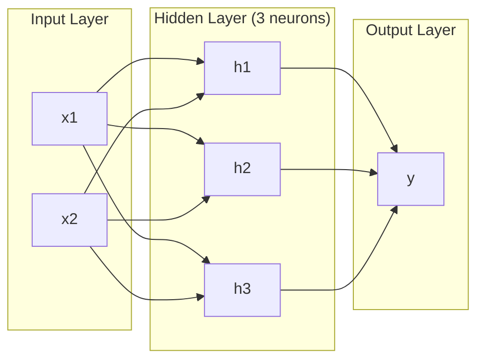
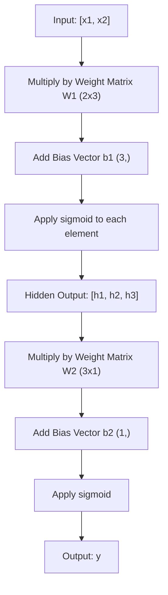
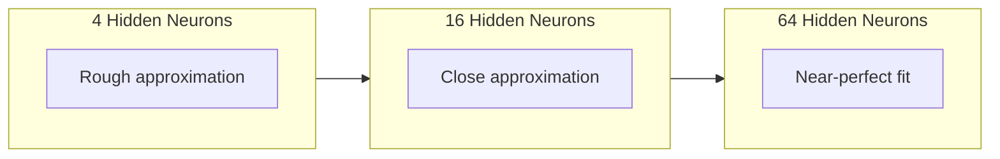

# बहुस्तरीय नेटवर्क एवं फॉरवर्ड पास

> एक तंत्रिका एक रेखा खींचती है. उन्हें ढेर कर, आप कुछ भी खींच सकते हैं.

**Type:** 构建
**Languages:** Python
**Prerequisites:** Phase 01（Math Foundations），Lesson 03.01（The Perceptron）
**Time:** 约 90 分钟

## 学习目标

- उपयोग परत और नेटवर्क वर्ग से शून्य से निर्माण एक बहुस्तरीय नेटवर्क, पूरा करने के लिए पूर्ण आगे पास
-  ट्रैकिंग नेटवर्क प्रत्येक स्तर में मैट्रिक्स  आयाम,并识别 आकार असंगत
- 解释堆叠非线性激活 如何让网络学习曲的决策边界
- उपयोग 2-2-1 架构和手工调好的 सिग्मोइड 权重解决 XOR 问题

## 问题

单个神经元就是一个画线器――仅此而已―― यह केवल आपके डेटा में एक सीधी रेखा खींच सकता है――AI में प्रत्येक वास्तविक समस्या-- 图像识别、语言理解、下围棋-- सभी को वक्रों की आवश्यकता होती है―― 神经元堆叠成层,就是获得曲线的方法──

1969 में, मिन्स्की और पेपर ने यह सीमा घातक साबित कीः एकल स्तरीय नेटवर्क XOR को नहीं सीख सकता है।

इसने न्यूरल नेटवर्क के लिए समर्थन की लागत को एक दशक से अधिक समय तक रोक दिया है। इसके बाद, सुधार का तरीका स्पष्ट हैः केवल एक परत का उपयोग न करें।

यह ढेर बहुस्तरीय नेटवर्क है। यह आज के उत्पादन वातावरण में प्रत्येक गहन सीखने के मॉडल का आधार है। आगे की राह -- डेटा से इनपुट प्रवाह से छिपे हुए परत तक आउटपुट तक -- यह पहली चीज है जिसे आपको पहले कुछ भी काम करने से पहले बनाना होगा।

## 概念

### 层:输入、 छिपा 、 आउटपुट

एक बहुस्तरीय नेटवर्क में तीन प्रकार के होते हैंः

**输入层**-- 严格来说不是一层──它保存原始数据──两个特征意味着两个输入节点──这里不发生计算──

**Hidden layer**-- 工作发生的地方── प्रत्येक तंत्रिका एक स्तर पर प्रत्येक आउटपुट, भार और एक पूर्वाग्रह को प्राप्त करता है, फिर परिणाम को सक्रिय फ़ंक्शन में प्रसारित करता है── इसे  छिपा हुआ कहा जाता है, क्योंकि आप प्रशिक्षण डेटा में सीधे इन मानों को नहीं देखेंगे──

**输出层**-- 最终答案──二分类, एक से जुड़े सिग्मोइड के साथ तंत्रिका का उपयोग करना── बहुधा, प्रत्येक वर्ग में एक तंत्रिका है──



यह एक 2-3-1 网络── दो इनपुट, तीन छिपे हुए न्यूरॉन, एक आउटपुट── प्रत्येक कनेक्शन एक भार धारण करता है── प्रत्येक तंत्रिका (输入除外) एक पूर्वाग्रह धारण करता है──

प्रत्येक परत में एक समूह संख्यात्मक रूप से बने वेक्टर उत्पन्न होते हैं, जिन्हें छिपा हुआ राज्य कहा जाता है। पाठ के लिए, छिपा हुआ राज्य आयाम बढ़ाएगा-- एक शब्द को 768 अंकों में कोडित करके अर्थ को पकड़ने के लिए। छवि के लिए, वे आयाम कम करेंगे-- लाखों चित्रों को संपीड़ित करके प्रबंधनीय रूप में प्रदर्शित करेगा। छिपा हुआ राज्य वह जगह है जहां सीखने का आयोजन होता है।

### तंत्रिका तंत्र

प्रत्येक तंत्रिका तीन चीजें करता हैः

1. प्रति भार भार के अनुसार प्रत्येक इनपुट को गुणा करना
2. सभी गुणाओं को जोड़ने और एक पूर्वाग्रह
3. इस और इनपुट सक्रियण फ़ंक्शन को जोड़ना

अब, सक्रिय फ़ंक्शन सिग्मोइड हैः

```
sigmoid(z) = 1 / (1 + e^(-z))
```

सिग्मोइड्स किसी भी संख्या को (0, 1) के दायरे में संकुचित करेंगे। बड़े सकारात्मक प्रवेश 1 के लिए आगे बढ़ेंगे। बड़े नकारात्मक प्रवेश 0 के लिए आगे बढ़ेंगे। यह समतल वक्रता सीखने की अनुमति देती है।

### फॉरवर्ड पासः डेटा कैसे流动

आगे की राह में, डेटा का एक स्तर से दूसरे स्तर पर प्रवेश किया जाता है, जब तक कि यह आउटपुट तक नहीं पहुंच जाता है।



प्रत्येक स्तर पर, तीन ऑपरेशन क्रमशः होते हैंः

```
z = W * input + b       (linear transformation)
a = sigmoid(z)           (activation)
```

एक स्तर का प्रवेश मिलता है और एक स्तर का प्रवेश होता है।

### मैट्रिक्स 维度

 ट्रैकिंग आयाम गहन सीखने में सबसे महत्वपूर्ण तालीम कौशल है 👇

| Step | Operation | Dimensions | Result Shape |
|------|-----------|------------|-------------|
| 输入 | x | -- | (2,) |
| Hidden 线性部分 | W1 * x + b1 | W1: (3, 2), b1: (3,) | (3,) |
| Hidden 激活 | sigmoid(z1) | -- | (3,) |
| 输出线性部分 | W2 * h + b2 | W2: (1, 3), b2: (1,) | (1,) |
| 输出激活 | sigmoid(z2) | -- | (1,) |

नियम:第 k 层的权重矩阵 W का आकार है (न्यूरॉन_इन_लेयर_k, न्यूरॉन_इन_लेयर_k_मिनस_1) 行对应应应应上一层──列对应应上一层── यदि आकार对不上,你就有错──

### सार्वभौमिक समीकरण प्रमेय

1989 में, जॉर्ज साइबेन्को ने एक असाधारण तथ्य साबित कियाः एक एकल छिपी हुई परत और पर्याप्त संख्या में तंत्रिका नेटवर्क के साथ, यह किसी भी निरंतर कार्य के निकट आ सकता है।

इसका मतलब यह नहीं है कि एक छिपी हुई परत 总是最佳选择── इसका मतलब है कि यह संरचना सैद्धांतिक रूप से सक्षम है── अभ्यास में, गहरे नेटवर्क (अधिक स्तर, प्रत्येक स्तर कम तंत्रिका) के समान कार्य के साथ बहुत कम से कम और व्यापक नेटवर्क के समान तत्वों का उपयोग कर सकता है── यही कारण है कि गहरे सीखने में काम करने में सक्षम है──

直觉是: छिपे हुए परत के बीच के प्रत्येक तंत्रिका एक 凸起 या विशेषता सीखता है── जब तक पर्याप्त 凸起 या विशेषताएं हों, और उन्हें सही स्थान पर रखकर, हम किसी भी समतल वक्र रेखा के करीब आ सकते हैं── तंत्रिकाओं की अधिक से अधिक, 凸起, 接近越好──



### संयोग

न्यूरल नेटवर्क है कोम्पाउंडेबल का। आप उन्हें ढेर कर सकते हैं, उन्हें संबद्ध कर सकते हैं, उन्हें संचालित कर सकते हैं। विस्पर मॉडल एक एन्कोडर नेटवर्क का उपयोग करें।


```figure
mlp-forward
```

##  इसे निर्माण

纯 Python──不使用numpy──每一个矩阵操作都从零编写──

### 步骤 1: सिग्मोइड 激活

```python
import math

def sigmoid(x):
    x = max(-500.0, min(500.0, x))
    return 1.0 / (1.0 + math.exp(-x))
```

मूल्य क्लैंप को [500, 500] तक रखें ताकि यह अधिक से अधिक न हो।`math.exp(500)` बहुत बड़ा लेकिन अभी भी सीमित है`math.exp(1000)`यह बहुत बड़ा है।

### 步骤 2: परत वर्ग

सभी गहन सीखने में सबसे महत्वपूर्ण ऑपरेशन मैट्रिक्स 乘法 है। प्रत्येक स्तर  प्रत्येक ध्यान सिर  प्रत्येक आगे का पार  नीचे का स्तर matmul  एक रैखिक परत  एक इनपुट वेक्टर प्राप्त करती है, इसे भार भार मैट्रिक्स में गुणा करती है, और इसमें पूर्वाग्रह वेक्टर:y = Wx + b जोड़ा जाता है। यह एकल पथ न्यूरल नेटवर्क में 90% का गणना मात्रा का प्रतिनिधित्व करता है।

एक परत सहेजें एक भारवजन मैट्रिक्स 和 एक पूर्वाग्रह वेक्टर―― इसकी आगे की विधि 收取一个输入 वेक्टर,并返回激活后的输出――

```python
class Layer:
    def __init__(self, n_inputs, n_neurons, weights=None, biases=None):
        if weights is not None:
            self.weights = weights
        else:
            import random
            self.weights = [
                [random.uniform(-1, 1) for _ in range(n_inputs)]
                for _ in range(n_neurons)
            ]
        if biases is not None:
            self.biases = biases
        else:
            self.biases = [0.0] * n_neurons

    def forward(self, inputs):
        self.last_input = inputs
        self.last_output = []
        for neuron_idx in range(len(self.weights)):
            z = sum(
                w * x for w, x in zip(self.weights[neuron_idx], inputs)
            )
            z += self.biases[neuron_idx]
            self.last_output.append(sigmoid(z))
        return self.last_output
```

权重矩阵 का आकार है (n_neurons, n_inputs) ⋅ प्रत्येक पंक्ति एक तंत्रिका है सभी इनपुट के पार ⋅权重的输入.

### 步骤 3: नेटवर्क वर्ग

एक नेटवर्क स्तरीय की सूची है। आगे की पास उन्हें जोड़ देगाः द्वितीय के स्तरीय के आउटपुट और इनपुट को द्वितीय के + 1 स्तरीय में जोड़ दिया गया है।

```python
class Network:
    def __init__(self, layers):
        self.layers = layers

    def forward(self, inputs):
        current = inputs
        for layer in self.layers:
            current = layer.forward(current)
        return current
```

यह संपूर्ण आगे की यात्रा है। चार पंक्ति logical। डेटा प्रवेश, प्रत्येक परत के माध्यम से गुजरना, दूसरे छोर से बाहर निकलना।

### 步骤 4: XOR का उपयोग करें

पाठ 01 में, हम OR、NAND 和 AND perceptron  को संयोजन करके XOR को हल करते हैं। अब हमारे Layer 和 Network वर्ग के साथ एक ही काम करते हैं।

```python
hidden = Layer(
    n_inputs=2,
    n_neurons=2,
    weights=[[20.0, 20.0], [-20.0, -20.0]],
    biases=[-10.0, 30.0],
)

output = Layer(
    n_inputs=2,
    n_neurons=1,
    weights=[[20.0, 20.0]],
    biases=[-30.0],
)

xor_net = Network([hidden, output])

xor_data = [
    ([0, 0], 0),
    ([0, 1], 1),
    ([1, 0], 1),
    ([1, 1], 0),
]

for inputs, expected in xor_data:
    result = xor_net.forward(inputs)
    predicted = 1 if result[0] >= 0.5 else 0
    print(f"  {inputs} -> {result[0]:.6f} (rounded: {predicted}, expected: {expected})")
```

较大的权重(20, -20) 让 sigmoid 表现像阶跃函数──第一隐藏神经元 近似 OR──第二近似 NAND──输出神经元把它们组合成 AND,也就是 XOR──

### 步骤 5: 圆形分类

एक और कठिन प्रश्नः 2 डी बिंदु वर्गीकरण को मूल बिंदु के केंद्र में किया जाना चाहिए, जिसका त्रिज्या 0.5 के इर्द-गिर्द या बाहर है।

```python
import random
import math

random.seed(42)

data = []
for _ in range(200):
    x = random.uniform(-1, 1)
    y = random.uniform(-1, 1)
    label = 1 if (x * x + y * y) < 0.25 else 0
    data.append(([x, y], label))

circle_net = Network([
    Layer(n_inputs=2, n_neurons=8),
    Layer(n_inputs=8, n_neurons=1),
])
```

उपयोग के साथ वजन, नेटवर्क विभाजन प्रभाव अच्छा नहीं होगा। लेकिन आगे पास  अभी भी चल जाएगा।

```python
correct = 0
for inputs, expected in data:
    result = circle_net.forward(inputs)
    predicted = 1 if result[0] >= 0.5 else 0
    if predicted == expected:
        correct += 1

print(f"Accuracy with random weights: {correct}/{len(data)} ({100*correct/len(data):.1f}%)")
```

️️️️️️️️️️️️️️️️️️️️️️️️️️️️️️️️️️️️️️️️️️️️️️️️️️️️️️️️️️️️️️️️️️️️️️️️️️️️️️️️️️️️️️️️️️️️️️️️️️️️️️️️️️️️️️️️️️️️️️️️️️️️️️️️️️️️️️️️️️️️️️️️️️️️️️️️️️️️️️️️️️️️️️️️️️️️️️️

## इसका उपयोग करें

PyTorch चार लाइन कोड के साथ ऊपर की सभी सामग्री को पूराः

```python
import torch
import torch.nn as nn

model = nn.Sequential(
    nn.Linear(2, 8),
    nn.Sigmoid(),
    nn.Linear(8, 1),
    nn.Sigmoid(),
)

x = torch.tensor([[0.0, 0.0], [0.0, 1.0], [1.0, 0.0], [1.0, 1.0]])
output = model(x)
print(output)
```

`nn.Linear(2, 8)`यही आपका परत वर्ग:आकार 为 (8, 2) का वजन मैट्रिक्स,आकार 为 (8,) का पूर्वाग्रह वेक्टर`nn.Sigmoid()`函数, प्रत्येक तत्व अनुप्रयोग`nn.Sequential`है आपका नेटवर्क वर्ग: क्रमशः串联各层──

区别在速度和规模中──PyTorch GPUs पर चलता है, लाखों नमूनों का बैच संसाधित करता है, और स्वचालित रूप से बैकप्रॉपेगेशन के ग्रेडिएंट के लिए गणना करता है──लेकिन फॉरवर्ड पास 逻辑 आपके अभी-अभी से शून्य से निर्माण की सामग्री के साथ पूरी तरह से समान है──

## 交付 यह

इस कक्षा में एक दोहराए जाने योग्य संकेत दिया गया है, जो नेटवर्क संरचनाओं को डिजाइन करने के लिए उपयोग किया जाता हैः

- `outputs/prompt-network-architect.md`

जब आप एक विशिष्ट समस्या के लिए यह तय करने की जरूरत है कि कितने स्तरों का उपयोग करें, प्रत्येक स्तर पर कितने तंत्रिकाओं, और कैसे सक्रियण फ़ंक्शन का उपयोग करने के लिए, आप इसका उपयोग कर सकते हैं।

## अभ्यास

1. 构建一个 2-4-2-1 网络(两个隐藏层), और XOR 数据上使用随机权重运行 前进通行──印印中间隐藏层的输出,观察表示在每层如何变变──

2.                                                                                                                                                                                                                                                               

3. नेटवर्क वर्ग में एक को लागू करने के लिए `count_parameters`विधि, वापसी योग्य वजन और पूर्वाग्रह की कुल संख्या ⋅ एक 784-256-128-10 网络 में ⋅ क्लासिक MNIST 架构) पर परीक्षण करें ⋅ इसमें कितने तत्व हैं?

4. एक 3-4-4-2 网络构建 फॉरवर्ड पास──向它输入 RGB 颜色值(归结到0-1),并观察两个输出── यह एक दो प्रकार का सरल रंग वर्गीकरण है──

5. एक लकी कदम फ़ंक्शन से सिग्मोइड का प्रतिस्थापन करेंः यदि z < 0, तो 0.01 * z पर लौटें, अन्यथा 1.0 पर लौटें।

## 关键术语

| Term | 人们会怎么说 | 它实际意味着什么 |
|------|----------------|----------------------|
| Forward pass | “运行模型” | 将输入推过每一层 -- 乘以权重、加上 bias、激活 -- 以产生输出 |
| Hidden layer | “中间部分” | 输入和输出之间的任意层，其值不会在数据中被直接观察到 |
| Multi-layer network | “一个深的 Neural Network” | 按顺序堆叠的神经元层，其中每一层的输出会输入到下一层 |
| Activation function | “非线性” | 在线性变换之后应用的函数，用来把曲线引入决策边界 |
| Sigmoid | “S 曲线” | sigma(z) = 1/(1+e^(-z))，将任意实数压缩到 (0,1)，平滑且处处可微 |
| Weight matrix | “参数” | 一个 shape 为 (current_layer_neurons, previous_layer_neurons) 的 Matrix W，包含可学习的连接强度 |
| Bias vector | “偏移量” | 在 Matrix 乘法之后添加的 Vector，使神经元即使在所有输入为零时也能激活 |
| Universal approximation | “Neural Network 可以学习任何东西” | 一个拥有足够多神经元的单 hidden layer 可以逼近任意连续函数 -- 但“足够多”可能意味着数十亿 |
| Linear transformation | “Matrix 乘法步骤” | z = W * x + b，激活前的计算，将输入映射到一个新空间 |
| Decision boundary | “分类器切换的地方” | 输入空间中的一个曲面，网络输出在这里跨过分类阈值 |

## 延伸阅读

- माइकल नीलसन, "न्यूरल नेटवर्क और डीप लर्निंग", अध्याय 1-2 (http://neuralnetworksanddeeplearning.com/) -- 关于前进通行和网络结构最清晰的免费解释,包含交互式可视化
- साइबेन्को, "सिग्मोइडल फ़ंक्शन के सुपरपोझिशन द्वारा अनुमान" (1989) -- मूल सार्वभौमिक अनुमान प्रमेय 论文,出乎意料地易读
- 3Blue1Brown, "लेकिन एक तंत्रिका नेटवर्क क्या है?https://www.youtube.com/watch?v=aircAruvnKk) -- 20 मिनट का दृश्य व्याख्या स्तर, वजन और आगे की उत्तीर्णता, सही मन की मानसिकता मॉडल बनाने में मदद करें
- गुडफ़ेल, बेन्गियो, Courville, "डीप लर्निंग", अध्याय 6 (https://www.deeplearningbook.org/) -- बहुस्तरीय नेटवर्क का मानक संदर्भ, मुफ्त ऑनलाइन पढ़ना
