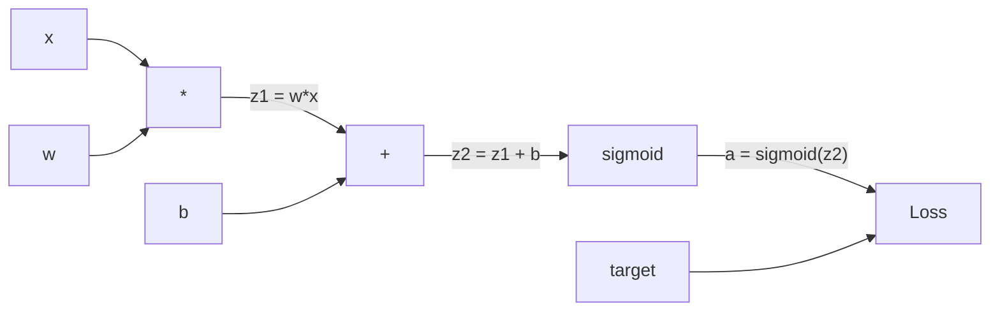
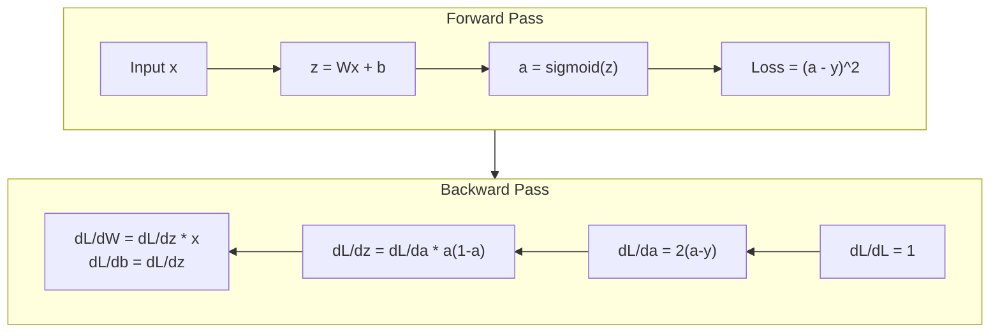
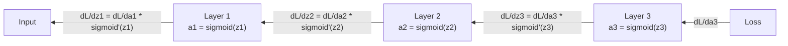

# शून्य से प्राप्त बैकप्रॉपेगमेंट

> बैकप्रॉपेगेशन एक संभव एल्गोरिथ्म है। इसके बिना, न्यूरल नेटवर्क केवल एक महंगा आकस्मिक संख्या जनरेटर है।

**Type:** Build
**Languages:** Python
**Prerequisites:** Lesson 03.02 (Multi-Layer Networks)
**Time:** ~120 minutes

## 学习目标
-                                                                                                                                                                                                                                                                                                                                                                                                                                                                                                                              
- उपयोग श्रृंखला नियम 推导 जोड़, गुणा और सिग्मोइड के बैकवर्ड पास
- केवल उपयोग करें आप शून्य से प्राप्त बैकप्रॉपेगेशन इंजन, XOR और सर्कल वर्गीकरण में ऊपर प्रशिक्षण एक बहु परत नेटवर्क
- 识别深层sigmoid network 中的消失梯度 问题,并解释为什么渐进的会指数级缩小

## 问题
आपके नेटवर्क में एक छिपी हुई परत है, जिसमें 768 输入 और 3072 输出 शामिल हैं। यह 2,359,296 权重 है। यह गलत भविष्यवाणी की है। यह किस वजन का गलत अनुमान लगाता है? प्रत्येक वजन का मतलब है कि 230 मिलियन बार आगे की यात्रा करना है। बैकप्रपॉगरेशन एक बार में सभी 230 मिलियन ग्रेडिएंट्स को वापस करने के लिए गणना की जा सकती है। यह अनुकूलन नहीं है। यह प्रशिक्षण और असंभव प्रशिक्षण के बीच का अंतर है।

 सरल प्रथा यह हैः एक भार उठाएं, इसे थोड़ा सा परेशान करें, फिर से एक बार आगे की पार करें, मापें हानि बढ़ रही है या घट रही है। यह इस भार को ग्रेडिएंट देगा।

बैकप्रॉपेगेशन  ने इस समस्या को हल किया ∙ एक बार फॉरवर्ड पास, एक बार बैकवर्ड पास, सभी ग्रेडिएंट्स का गणना किया गया ∙ मुख्य बात यह है कि कैलकुलेशन में चेन नियम, संगठनात्मक ग्राफ पर व्यवस्थित रूप से लागू किया गया ∙ यह है कि यह एल्गोरिथ्म गहन सीखने को व्यावहारिक बनाता है ∙ इसके बिना, हम अभी भी केवल खिलौने की समस्या में फंस सकते हैं ∙

## 概念
### चेन नियम, नेटवर्क पर लागू

你在阶段01中见过链条规则──快速回顾: यदि y = f(g(x)), तो dy/dx = f'(g(x)) * g'(x)──你沿着链条相乘衍生物──

न्यूरल नेटवर्क में, 链条                                                                                                                                                                                                                                                          

### कम्प्यूटेशनल ग्राफ

प्रत्येक बार फॉरवर्ड पास शहर एक ग्राफ का निर्माण करेगा। प्रत्येक नोड एक ऑपरेशन है।



आगे की पारः मूल्य से बाईं ओर दाईं ओर流动──x 和 w 产生 z1 = w*x──加上 b 得到 z2──सिग्मोइड 给出激活 a──使用 Loss फ़ंक्शन 将 a 与 target y 比较──

पिछड़ा पारः ग्रेडिएंट से दाएं से बाईं ओर流动。 से dL/da 开始(लॉस 如何随着激活 改变)。乘以 da/dz2(सिग्मोइड डेरिवेटिव)。 प्राप्त dL/dz2。拆分成 dL/db(यह dL/dz2 के बराबर है, क्योंकि z2 = z1 + b) 和 dL/dz1。 फिर dL/dw = dL/dz1 * x,dL/dx = dL/dz1 * w。

ग्राफ में प्रत्येक नोड में Backward Pass के दौरान केवल एक ही कार्य होता हैः ऊपर से Gradient प्राप्त करना, उसके अपने स्थानीय व्युत्पन्न को गुणा करना, फिर नीचे से संचरण करना।

### आगे और पीछे



फॉरवर्ड पास प्रत्येक मध्यवर्ती मान को संग्रहीत करेगाःz、a、 प्रत्येक परत के इनपुट।

### Gradient नेटवर्क के बीच में प्रवाह

एक 3-परत नेटवर्क के लिए, प्रत्येक स्तर के माध्यम से ग्रेडिएंट कनेक्शनः



प्रत्येक स्तर पर, ग्रेडिएंट शहर में सिग्मोइड व्युत्पन्न से गुणा किया जाता है। सिग्मोइड व्युत्पन्न एक * (1 - a) है, जिसका अधिकतम मूल्य 0.25 है।

### गिरते हुए ग्रेडिएंट

यही कारण है कि घटती हुई ग्रेडिएंट  समस्या  सिग्मोइड  आउटपुट को 0 और  के बीच संकुचित कर देता है  इसकी व्युत्पन्न  हमेशा 0.25 से कम  होती है  पर्याप्त सिग्मोइड परत  के बाद, ग्रेडिएंट  संकुचित होकर शून्य के निकट होता है  प्रारंभिक परत  लगभग सीखने में असमर्थ होती है, क्योंकि वे प्राप्त करने वाले ग्रेडिएंट  के निकट होते हैं 

```
sigmoid(z):     Output range [0, 1]
sigmoid'(z):    Max value 0.25 (at z = 0)

After 5 layers:   gradient * 0.25^5 = 0.001x original
After 10 layers:  gradient * 0.25^10 = 0.000001x original
```

यही कारण है कि गहरे स्तर के सिग्मोइड नेटवर्क को प्रशिक्षित करना लगभग असंभव है।

### 推导 2-परत नेटवर्क का ग्रेडिएंट

नीचे एक विशिष्ट गणितीय उदाहरण हैः नेटवर्क में इनपुट x ̊带 sigmoid के छिपे हुए परत ̊带 sigmoid के आउटपुट परत, तथा MSE हानि ̊

आगे की यात्राः
```
z1 = W1 * x + b1
a1 = sigmoid(z1)
z2 = W2 * a1 + b2
a2 = sigmoid(z2)
L = (a2 - y)^2
```

पिछड़ा पार (逐步应用 श्रृंखला नियम):
```
dL/da2 = 2(a2 - y)
da2/dz2 = a2 * (1 - a2)
dL/dz2 = dL/da2 * da2/dz2 = 2(a2 - y) * a2 * (1 - a2)

dL/dW2 = dL/dz2 * a1
dL/db2 = dL/dz2

dL/da1 = dL/dz2 * W2
da1/dz1 = a1 * (1 - a1)
dL/dz1 = dL/da1 * da1/dz1

dL/dW1 = dL/dz1 * x
dL/db1 = dL/dz1
```

प्रत्येक ग्रेडिएंट 乘积 乘积 乘积 乘积 乘积 乘积 乘积 乘积 乘积 乘积 乘积 乘积 乘积 乘积 乘积 乘积 乘积 乘积 乘积 乘积 乘积 乘积 乘积 乘积 乘积 乘积 乘积 乘积 乘积 乘积 乘积 乘积 乘积 乘积 乘积 乘积 乘积 乘积 乘积 乘积 乘积 乘积 乘积 乘积 乘积 乘积 乘积 乘积 乘积 乘积 乘积 乘积 乘积 乘积 乘积 乘积 乘积 乘积 乘积 乘积 乘积 乘积 乘积 乘积 乘积 乘积 乘积 乘积 乘积 乘积 乘积 乘积 乘积 乘积 乘积 乘积 乘积 乘积 乘积 乘积 乘积 乘积 乘积 乘积 乘积 乘积 乘积 乘积 乘积 乘积 乘积 乘积 乘积 乘积 乘积 乘积 乘积 乘积 乘积 乘积 乘积 乘积 乘积 乘积 乘积 乘积 乘积 乘积 乘积 乘积 乘积 乘积 乘积 乘积 乘积 乘积 乘积 乘积 乘积 乘积 乘积 乘积 乘积 乘积 乘积 乘积 乘 乘积 乘积 乘积 乘积 乘积 乘积 乘积 乘 乘 乘积 乘 乘 乘 乘积 乘 乘 乘 乘 乘 乘 乘 乘 乘 乘 乘 乘 乘 乘 乘 乘 乘 乘 乘 乘 乘 乘 乘 乘 乘 乘 乘 乘 乘 乘 乘 乘 乘 乘 乘 乘 乘 乘 乘 乘 乘 乘 乘 乘


```figure
backprop-vanishing
```

##  इसे निर्माण
### 步骤 1: मूल्य नोड

हमारे गणना में प्रत्येक संख्या एक मूल्य में बदल जाती है। यह अपने स्वयं के डेटा को संग्रहीत करती है, ग्रेडिएंट, और यह कैसे बनाया गया है।

```python
class Value:
    def __init__(self, data, children=(), op=''):
        self.data = data
        self.grad = 0.0
        self._backward = lambda: None
        self._children = set(children)
        self._op = op

    def __repr__(self):
        return f"Value(data={self.data:.4f}, grad={self.grad:.4f})"
```

कोई ग्रेडिएंट नहीं है (0.0)`_children`इस मान का अन्य मान उत्पन्न होगा, तो हम ग्राफ पर एक टोपोलॉजिकल प्रकार कर सकते हैं।

### 步骤 2: 带 पिछड़ा कार्य का संचालन

प्रत्येक ऑपरेशन में एक नया मूल्य बनाया जाता है, और यह परिभाषित किया जाता है कि कैसे इसके माध्यम से प्रवाह के विपरीत।

```python
def __add__(self, other):
    other = other if isinstance(other, Value) else Value(other)
    out = Value(self.data + other.data, (self, other), '+')

    def _backward():
        self.grad += out.grad
        other.grad += out.grad

    out._backward = _backward
    return out

def __mul__(self, other):
    other = other if isinstance(other, Value) else Value(other)
    out = Value(self.data * other.data, (self, other), '*')

    def _backward():
        self.grad += other.data * out.grad
        other.grad += self.data * out.grad

    out._backward = _backward
    return out
```

दोनों इनपुटों को सीधे आउटपुट प्राप्त करने के लिए Gradient 

对于乘法:d(a*b)/da = b,d(a*b)/db = a。 प्रत्येक इनपुट                                                                                                                                                                                                                                                

`+=`很关键──一个值可能会被多个操作使用──它的渐进是来自所有路径的渐进之和──

### 步骤 3: सिग्मोइड और हानि

```python
import math

def sigmoid(self):
    x = self.data
    x = max(-500, min(500, x))
    s = 1.0 / (1.0 + math.exp(-x))
    out = Value(s, (self,), 'sigmoid')

    def _backward():
        self.grad += (s * (1 - s)) * out.grad

    out._backward = _backward
    return out
```

सिग्मोइड व्युत्पन्नः सिग्मोइड(x) * (1 - सिग्मोइड(x))。 हम में फर्वार्ड पास 中已计算了 सिग्मोइड(x) = s──复用它──不需要额外工作──

```python
def mse_loss(predicted, target):
    diff = predicted + Value(-target)
    return diff * diff
```

单个输出的 MSE:(预测 - लक्ष्य) ^2──我们把减法表达为加上一个取负的值──

### 步骤 4: बैकवर्ड पास

टोपोलॉजिकल प्रकार  सुनिश्चित करें कि हम सही क्रम में संसाधित नोड के अनुसार एक नोड के ग्रेडिएंट को इसके माध्यम से प्रसार जारी रखने से पहले पूरी तरह से संचित किया जाए

```python
def backward(self):
    topo = []
    visited = set()

    def build_topo(v):
        if v not in visited:
            visited.add(v)
            for child in v._children:
                build_topo(child)
            topo.append(v)

    build_topo(self)
    self.grad = 1.0
    for v in reversed(topo):
        v._backward()
```

√ √ √ √ √ √ √ √ √ √ √ √ √ √ √ √ √ √ √ √ √ √ √ √ √ √ √ √ √ √ √ √ √ √ √ √ √ √ √ √ √ √ √ √ √ √ √ √ √ √ √ √ √ √ √ √ √ √ √ √ √ √ √ √ √ √ √ √ √ √ √ √ √ √ √ √ √ √ √ √ √ √ √ √ √ √ √ √ √ √ √ √ √ √ √ √ √ √ √ √ √ √ √ √ √ √ √ √ √ √ √ √ √ √ √ √ √ √ √ √ √ √ √ √ √ √ √ √ √ √ √ √ √ √ √ √ √ √ √ √ √ √ √ √ √ √ √ √ √ √ √ √ √ √ √ √ √ √ √ √ √ √ √ √ √ √ √ √ √ √ √ √ √ √ √ √ √ √ √ √ √ √ √ √ √ √ √ √ √ √ √ √ √ √ √ √ √ √ √ √ √ √ √ √ √ √ √ √ √ √ √ √ √ √ √ √ √ √ √ √ √ √ √ √ √ √ √ √ √ √ √ √ √ √ √ √ √ √ √ √ √ √ √ √ √ √ √ √ √ √ √ √ √ √ √`_backward`मैं उसे अपने बच्चों को देने के लिए ग्रेडिएंट को भेजना चाहता हूँ।

### 步骤 5: परत और नेटवर्क

```python
import random

class Neuron:
    def __init__(self, n_inputs):
        scale = (2.0 / n_inputs) ** 0.5
        self.weights = [Value(random.uniform(-scale, scale)) for _ in range(n_inputs)]
        self.bias = Value(0.0)

    def __call__(self, x):
        act = sum((wi * xi for wi, xi in zip(self.weights, x)), self.bias)
        return act.sigmoid()

    def parameters(self):
        return self.weights + [self.bias]


class Layer:
    def __init__(self, n_inputs, n_outputs):
        self.neurons = [Neuron(n_inputs) for _ in range(n_outputs)]

    def __call__(self, x):
        out = [n(x) for n in self.neurons]
        return out[0] if len(out) == 1 else out

    def parameters(self):
        params = []
        for n in self.neurons:
            params.extend(n.parameters())
        return params


class Network:
    def __init__(self, sizes):
        self.layers = []
        for i in range(len(sizes) - 1):
            self.layers.append(Layer(sizes[i], sizes[i + 1]))

    def __call__(self, x):
        for layer in self.layers:
            x = layer(x)
            if not isinstance(x, list):
                x = [x]
        return x[0] if len(x) == 1 else x

    def parameters(self):
        params = []
        for layer in self.layers:
            params.extend(layer.parameters())
        return params

    def zero_grad(self):
        for p in self.parameters():
            p.grad = 0.0
```

एक न्यूरॉन इंपुट प्राप्त करें, वजन योग + पूर्वाग्रह की गणना करें, फिर सिग्मोइड को लागू करें।`parameters()`विधि सभी सीखने योग्य मूल्य को इकट्ठा करेगी, ताकि हम उन्हें अपडेट कर सकें।

### 步骤 6: XOR में प्रशिक्षण

```python
random.seed(42)
net = Network([2, 4, 1])

xor_data = [
    ([0.0, 0.0], 0.0),
    ([0.0, 1.0], 1.0),
    ([1.0, 0.0], 1.0),
    ([1.0, 1.0], 0.0),
]

learning_rate = 1.0

for epoch in range(1000):
    total_loss = Value(0.0)
    for inputs, target in xor_data:
        x = [Value(i) for i in inputs]
        pred = net(x)
        loss = mse_loss(pred, target)
        total_loss = total_loss + loss

    net.zero_grad()
    total_loss.backward()

    for p in net.parameters():
        p.data -= learning_rate * p.grad

    if epoch % 100 == 0:
        print(f"Epoch {epoch:4d} | Loss: {total_loss.data:.6f}")

print("\nXOR Results:")
for inputs, target in xor_data:
    x = [Value(i) for i in inputs]
    pred = net(x)
    print(f"  {inputs} -> {pred.data:.4f} (expected {target})")
```

观察 Loss 下降──随机预测到正确的XOR आउटपुट, पूरी तरह से बैकप्रॉपेगरेशन 计算 ग्रेडिएंट 并向正确方向微调权重来驱动──

### 步骤 7: सर्कल वर्गीकरण

पाठ 02 में, आप सर्कल वर्गीकरण के लिए हैं।

```python
random.seed(7)

def generate_circle_data(n=100):
    data = []
    for _ in range(n):
        x1 = random.uniform(-1.5, 1.5)
        x2 = random.uniform(-1.5, 1.5)
        label = 1.0 if x1 * x1 + x2 * x2 < 1.0 else 0.0
        data.append(([x1, x2], label))
    return data

circle_data = generate_circle_data(80)

circle_net = Network([2, 8, 1])
learning_rate = 0.5

for epoch in range(2000):
    random.shuffle(circle_data)
    total_loss_val = 0.0
    for inputs, target in circle_data:
        x = [Value(i) for i in inputs]
        pred = circle_net(x)
        loss = mse_loss(pred, target)
        circle_net.zero_grad()
        loss.backward()
        for p in circle_net.parameters():
            p.data -= learning_rate * p.grad
        total_loss_val += loss.data

    if epoch % 200 == 0:
        correct = 0
        for inputs, target in circle_data:
            x = [Value(i) for i in inputs]
            pred = circle_net(x)
            predicted_class = 1.0 if pred.data > 0.5 else 0.0
            if predicted_class == target:
                correct += 1
        accuracy = correct / len(circle_data) * 100
        print(f"Epoch {epoch:4d} | Loss: {total_loss_val:.4f} | Accuracy: {accuracy:.1f}%")
```

यहाँ हम ऑनलाइन एसजीडी का उपयोग करते हैं - प्रत्येक नमूना के बाद वजन अपडेट किया जाता है, न कि एक संपूर्ण बैच एकत्र किया जाता है। यह अधिक तेजी से एक पूर्ण हानि परिदृश्य में एक सिग्मोइड संतृप्ति से बचने के लिए एक पूर्ण हानि परिदृश्य में एक त्वरित टूटना होगा।

没有手动调参――网络会自己发现圆形决策界限――这就是反扩散的力量:你定义建筑、损失函数和数据──算法会找到权重──

## इसका उपयोग करें
PyTorch ने कुछ कोड के साथ ऊपर की सभी कार्य पूरी की।

```python
import torch
import torch.nn as nn

model = nn.Sequential(
    nn.Linear(2, 4),
    nn.Sigmoid(),
    nn.Linear(4, 1),
    nn.Sigmoid(),
)
optimizer = torch.optim.SGD(model.parameters(), lr=1.0)
criterion = nn.MSELoss()

X = torch.tensor([[0,0],[0,1],[1,0],[1,1]], dtype=torch.float32)
y = torch.tensor([[0],[1],[1],[0]], dtype=torch.float32)

for epoch in range(1000):
    pred = model(X)
    loss = criterion(pred, y)
    optimizer.zero_grad()
    loss.backward()
    optimizer.step()

print("PyTorch XOR Results:")
with torch.no_grad():
    for i in range(4):
        pred = model(X[i])
        print(f"  {X[i].tolist()} -> {pred.item():.4f} (expected {y[i].item()})")
```

`loss.backward()`यही तुम्हारा है`total_loss.backward()``optimizer.step()`यही आप हाथ से लिख रहे हैं `p.data -= lr * p.grad``optimizer.zero_grad()`यही तुम्हारा है`net.zero_grad()` एक ही एल्गोरिथ्म, औद्योगिक स्तर पर कार्यान्वयन पाईटॉर्च  GPU त्वरण मिश्रित सटीकता ग्रेडिएंट चेकपोइंटिंग, तथा सैकड़ों प्रकार की परत प्रकार के लिए जिम्मेदार है, लेकिन बैकवर्ड पास  अभी भी एक ही श्रृंखला नियम है, एक ही कंप्यूटेशनल ग्राफ पर लागू होता है

训练会运行前进通行,然后运行后进通行,再更新权重――Inference 只运行前进通行――没有渐进,没有更新―― यह अंतर महत्वपूर्ण है, क्योंकि inference 才是生产环境中发生的事情―― जब आप क्लाउड या GPT जैसे एपीआई 时, आप निष्कर्षण करते हैं--आपका शीघ्र向前流经网络,Token from the other end of output―― कोई भी权重发生变――理解后进通行 很重要, क्योंकि यह उस नेटवर्क में प्रत्येक एक अधिकार को आकार देता है――

## 交付 यह
本课会产出:
- `outputs/prompt-gradient-debugger.md`-- एक दोहराया जा सकता है संकेत, किसी भी तंत्रिका नेटवर्क के भीतर ग्रेडिएंट का निदान करने के लिए प्रयोग किया जाता है

## अभ्यास
1. 给 मूल्य वर्ग 添加一个 `__sub__`विधि ((a - b = a + (-1 * b))。 फिर एक को प्राप्त करें `__neg__`विधि── के माध्यम से सरल अभिव्यक्ति जैसे (a - b) ^2) के हाथ से गणना की तुलना की जाए, सत्यापन ग्रेडिएंट है या नहीं सही

2. 给值 添加一个 `relu`विधि ((आउटपुट 为 अधिकतम(0, x),उत्पन्न 在 x > 0 时为 1,否则为 0) ・・・ छिपे हुए परत में रीलू 替换 sigmoid,并再次在 XOR 上训练──比较收速度──你应该会看到训练更快--这是课04的预告──

3. एक पूर्णांक शक्तियों का उपयोग करने के लिए मूल्य पर प्राप्त करने के लिए`__pow__`विधि---उपयोग कर इसे `mse_loss`替换成真正的 `(predicted - target) ** 2`अभिव्यक्ति ः सत्यापन ग्रेडिएंट से मूल प्राप्ति मेल खाती ः

4. 给 प्रशिक्षण लूप 添加梯度剪切:调用 `backward()`之后,把所有渐变 क्लिप到 [-1, 1]──训练一个更深的网络(4+层与 sigmoid),并比较有无剪切的损失曲线──这是你对抗爆炸梯度的第一防线──

5.  एक दृश्य निर्माणः XOR  प्रशिक्षण पूरा होने के बाद, प्रिंट नेटवर्क में प्रत्येक पैरामीटर के ग्रेडिएंट── ढूंढें कि किस स्तर के ग्रेडिएंट का न्यूनतम स्तर── यह आपको Concept 部分读到的消失梯度 问题── में दिखाएगा।

## 关键术语
| Term | What people say | What it actually means |
|------|----------------|----------------------|
| Backpropagation | “Network 学会了” | 一种算法，通过沿 Computational Graph 反向应用 chain rule，为每个权重计算 dL/dw |
| Computational graph | “Network 结构” | 一个有向无环 graph，其中 node 是 operation，edge 承载 value（forward）和 Gradient（backward） |
| Chain rule | “把 derivative 相乘” | 如果 y = f(g(x))，那么 dy/dx = f'(g(x)) * g'(x) -- Backpropagation 的数学基础 |
| Gradient | “最陡上升方向” | Loss 相对于某个 parameter 的 partial derivative -- 告诉你如何改变该 parameter 来降低 Loss |
| Vanishing gradient | “深层 network 学不会” | 当 Gradient 通过带有 sigmoid 这类 saturating activation 的 layer 传播时，会指数级缩小 |
| Forward pass | “运行 network” | 通过顺序应用每一层的 operation，从 input 计算 output，并存储 intermediate value |
| Backward pass | “计算 Gradient” | 反向遍历 Computational Graph，在每个 node 使用 chain rule 累积 Gradient |
| Learning rate | “学习速度” | 一个控制权重更新步长的 scalar：w_new = w_old - lr * gradient |
| Topological sort | “正确顺序” | 一种 graph node 排序方式，使每个 node 都出现在其依赖的所有 node 之后 -- 确保 Gradient 在传播前已完全累积 |
| Autograd | “自动微分” | 一个在 forward computation 期间构建 Computational Graph，并自动计算 Gradient 的系统 -- PyTorch 的 engine 做的就是这个 |

## 延伸阅读
- Rumelhart, Hinton & Williams, "बैक-प्रसारण त्रुटियों द्वारा प्रतिनिधित्व सीखना" (1986) -- 这篇论文让 Backpropagation 成为主流,并解锁了多层网络培训
- 3Blue1Brown, "न्यूरल नेटवर्क" श्रृंखला (https://www.youtube.com/playlist?list=PLZHQObOWTQDNU6R1_67000Dx_ZCJB-3pi) --                                                                                                                                                                                                                                                                                                                                                                                                                                                                                                                            
