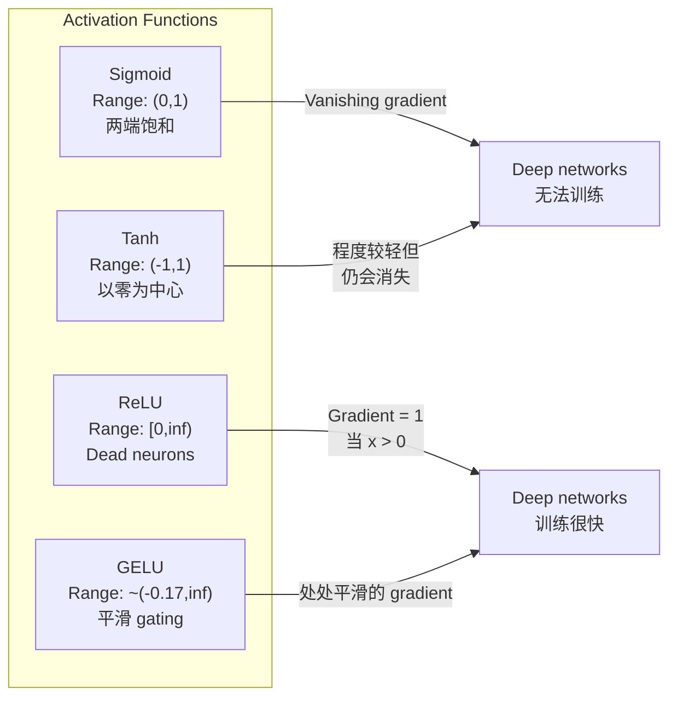
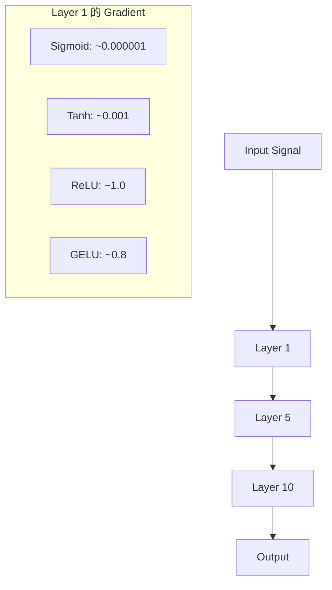
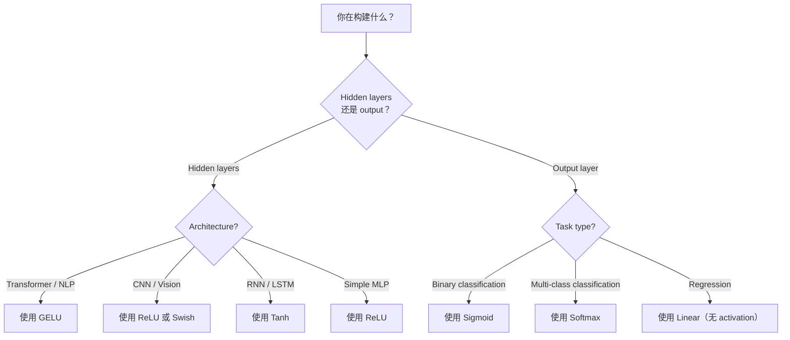

# 激活函数

>  कोई गैर-रेखीय, आपका 100 परत नेटवर्क  सिर्फ एक बार精致矩阵 गुणन  सक्रियण  तंत्रिका नेटवर्क  सक्षम करने के लिए कर सकते हैं के साथ कर्षण सोचने के दरवाजे 

**Type:** Build
**Languages:** Python
**Prerequisites:** Lesson 03.03 (Backpropagation)
**Time:** ~75 分钟

## 学习目标

- से शून्य प्राप्त सिग्मोइड、टाँह、रेलू、लकी रिलू、गेलू、स्विस 和 सॉफ्टमैक्स  और उसके डेरिवेटिव
- 通过测量不同激活在10+ 层中的激活大小, निदान गायब हो रही ग्रेडिएंट समस्या
- 检测 ReLU नेटवर्क के बीच मृत न्यूरॉन्स,并解释为什么 GELU 能避免这种故障模式
- निर्दिष्ट वास्तुकला (transformer,CNN,RNN,output layer) सही सक्रियण फ़ंक्शन चुनें

## 问题

堆叠 दो रैखिक परिवर्तनः y = W2(W1x + b1) + b2。展开它:y = W2W1x + W2b1 + b2。 यह सिर्फ y = Ax + c एक एकल रैखिक परिवर्तन── चाहे आप ढेर कितनी रैखिक परतें हों, परिणाम都会缩短成一次矩阵乘点── आपका 100-परत नेटवर्क एकल परत के साथ 具有相同表示能力──

यह सैद्धांतिक रूप से चश्मा नहीं है। इसका अर्थ है कि गहरी रैखिक नेटवर्क 字面上无法学习 XOR,无法分类螺旋数据集,无法识别人脸──没有激活功能,深度只是一种幻觉──

सक्रियण कार्य 打破线性── वे गैर-रेखीय कार्य 扭曲每一层的输出,让网络 能够曲决策界限、近似任意函数,并真正学习── लेकिन यदि आप गलत सक्रियण चुनते हैं, तो आपके ग्रेडिएंट्स शून्य तक गायब हो जाएंगे (深度网络中的 sigmoid) 爆到无穷大 (无穷大) ), या आपके न्यूरॉन्स会永久死亡 (无谨慎初始化) 

## 概念

### क्यों अपरलैंगिक आवश्यक है

मैट्रिक्स गुणांक एक संयुग्मित है। मैट्रिक्स ए को एक वेक्टर से गुणा करने के लिए पहले मैट्रिक्स ए का उपयोग करें, फिर मैट्रिक्स बी को गुणा करने के लिए परिणाम, सीधे एबी से गुणा करने के बराबर है। इसका मतलब है कि दस रैखिक परतों का एक ढेर है। गणित में, यह एक रैखिक परत के बराबर है जिसमें एक बड़ी मैट्रिक्स है। इन सभी मापदंडों को, इन सभी गहराई को बर्बाद कर दिया गया है। आपको इस कड़ी को तोड़ने के लिए कुछ की आवश्यकता है। यह सक्रियण कार्यों का प्रभाव है।

नीचे है प्रमाण ः एक रैखिक परत  गणना f(x) = Wx + b── संचयी दोः

```
Layer 1: h = W1 * x + b1
Layer 2: y = W2 * h + b2
```

代入:

```
y = W2 * (W1 * x + b1) + b2
y = (W2 * W1) * x + (W2 * b1 + b2)
y = A * x + c
```

एक स्तर──在层之间插入 गैर रैखिक सक्रियण g():

```
h = g(W1 * x + b1)
y = W2 * h + b2
```

现在代入被打破了──W2 * g(W1 * x + b1) + b2 不能再简化为单线性转换──网络可以表示非线性函数──每增加一层带激活的层,都会增加表示能力──

### सिग्मोइड

न्यूरल नेटवर्क नवीनतम सक्रियण कार्य

```
sigmoid(x) = 1 / (1 + e^(-x))
```

输出范围:(0, 1)──平滑、可微, किसी भी वास्तविक संख्या को समान संभावना के मूल्य में映射 करेगा──

व्युत्पन्न

```
sigmoid'(x) = sigmoid(x) * (1 - sigmoid(x))
```

इस व्युत्पन्न का अधिकतम मूल्य 0.25 है, वर्तमान में x = 0 है। बैकप्रॉपेग में, gradients 会逐层相乘──十层 सिग्मोइड का अर्थ है कि gradient 最多会被 0.25 连续乘十次:

```
0.25^10 = 0.000000953674
```

 मूल संकेतों के लाखों में से एक में से एक है। यह गिरने वाली ग्रेडिएंट समस्या है। प्रारंभिक परतों के बीच ग्रेडिएंट बहुत छोटे हो गए हैं, वजन लगभग अद्यतन नहीं हुए हैं। नेटवर्क में दिखता है।

另一个问题:sigmoid 输出始终为正(0到 1), इसका मतलब है वजन ऊपर की उतार-चढ़ाव 总是同号―― यह उतार-चढ़ाव 过程 में इसके आकार के झटके का कारण बनता है।

### तान

सिग्मोइड का संस्करण

```
tanh(x) = (e^x - e^(-x)) / (e^x + e^(-x))
```

输出范围:(-1, 1)──以零为中心,可以消除之字形问题──

व्युत्पन्न

```
tanh'(x) = 1 - tanh(x)^2
```

अधिकतम व्युत्पन्न में x = 0 时为 1.0比西格莫ид 好四倍──但消失梯度问题 仍然存在──对于很大的正输入或负输入,衍生会趋近零──十层仍然会压碎梯度,只是没有那么激烈──

### रियलीः突破

सुधारित रैखिक इकाई──नयर 和 हिंटन ने 2010 में इसे गहन सीखने में बढ़ावा दिया। यह फ़ंक्शन खुद फ़ुकुशिमा 1969 के काम से जुड़ी हुई है।

```
relu(x) = max(0, x)
```

输出范围:[0, अनंत) ・उत्पन्न 非常简单:

```
relu'(x) = 1  if x > 0
            0  if x <= 0
```

正输入 के लिए, कोई गायब हो रहा ग्रेडिएंट नहीं है  gradient 正好是 1,会直接传递过去── यही कारण है कि गहरे नेटवर्क 变得可训练的原因ReLU 能够跨层保留梯度大小──

लेकिन इसमें एक विफलता मोड हैः मृत न्यूरॉन समस्या। यदि किसी न्यूरॉन का वजनदार इनपुट 始终为负 (अतिरिक्त नकारात्मक पूर्वाग्रह या दुर्भाग्यपूर्ण वजन प्रारंभ होने के कारण) है, तो इसका आउटपुट हमेशा शून्य, ग्रेडिएंट हमेशा शून्य होगा, इसलिए कभी अपडेट नहीं होगा।

### रिलू लीक

मृत न्यूरॉन्स, सबसे सरल पुनर्स्थापना विधि

```
leaky_relu(x) = x        if x > 0
                alpha * x if x <= 0
```

इनमें से अल्फा एक छोटी नियमित संख्या है, आमतौर पर 0.01 के लिए। नकारात्मक आधे अक्ष में शून्य के बजाय एक छोटी झुकाव होती है, इसलिए मृत न्यूरॉन्स अभी भी ग्रेडिएंट सिग्नल प्राप्त कर सकते हैं, और पुनर्प्राप्त करने का अवसर प्राप्त करते हैं।

### जीएलयूः现代默认选择

गौशियन त्रुटि रैखिक इकाई── 2016 में हेंड्रिक्स और गिम्पेल द्वारा प्रस्तावित── है BERT、GPT तथा अधिकांश आधुनिक ट्रांसफार्मरों में默认 सक्रियण──

```
gelu(x) = x * Phi(x)
```

इनमें से Phi(x) मानक सामान्य वितरण का संचयी वितरण कार्य है।

```
gelu(x) ~= 0.5 * x * (1 + tanh(sqrt(2/pi) * (x + 0.044715 * x^3)))
```

GELU 处平滑, अनुमति较小的负值(不像 ReLU 那样硬截断为零), और एक संभावना व्याख्या हैः यह प्रत्येक प्रविष्टि के आधार पर Gaussian वितरण में नीचे के लिए सही संभावना के लिए इसके अतिरिक्त शक्ति पर है।

### स्विस / सिलू

द्वारा रामाचंद्रन et al. 2017 में स्वचालित खोज के माध्यम से 发现的自闭关门激活──

```
swish(x) = x * sigmoid(x)
```

स्विश का स्वरूप है x * sigmoid(x) ✿ गूगल ने सक्रियण फ़ंक्शन स्पेस पर स्वचालित खोज के माध्यम से इसे पाया है  एक तंत्रिका नेटवर्क डिजाइन तंत्रिका नेटवर्क का हिस्सा ✿

GELU के समान, यह平滑、非单调,并允许较小的负值──差异很微妙:Swish उपयोग sigmoid 作为门, जबकि GELU उपयोग Gaussian CDF── अभ्यास में, प्रदर्शन लगभग समान──Swish उपयोग EfficientNet 和 कुछ दृष्टि मॉडल──GELU 则主导语言模型──

### सॉफ्टमैक्स: आउटपुट सक्रियण

छिपे हुए परतों के लिए उपयोग नहीं किया जाता है;; सॉफ्टमैक्स कच्चे स्कोर (लॉग) के वेक्टर को संभावना वितरण के लिए परिवर्तित करेगा;;

```
softmax(x_i) = e^(x_i) / sum(e^(x_j) for all j)
```

प्रत्येक आउटपुट 0 से 1 के बीच है। सभी आउटपुट और 1 के बीच है। यह बहु-वर्ग वर्गीकरण के मानक अंतिम सक्रियण में बदल जाता है। सबसे अधिक लॉजिट उच्चतम संभावना प्राप्त करता है, लेकिन argmax के विपरीत, सॉफ्टमैक्स सूक्ष्म है, और अपेक्षाकृत विश्वसनीय जानकारी को बनाए रखता है।

### 形形对比



### ग्रेडिएंट प्रवाह के लिए



### 什么时候使用什么种类的激活



## 动手构建

### 步骤 1: सभी सक्रियण कार्यों को प्राप्त करना  और उसके व्युत्पन्न

प्रत्येक फ़ंक्शन एक फ़्लोट प्राप्त करता है और एक फ़्लोट को वापस करता है। प्रत्येक व्युत्पन्न फ़ंक्शन एक ही इनपुट प्राप्त करता है और एक ही ग्रेडिएंट को वापस करता है।

```python
import math

def sigmoid(x):
    x = max(-500, min(500, x))
    return 1.0 / (1.0 + math.exp(-x))

def sigmoid_derivative(x):
    s = sigmoid(x)
    return s * (1 - s)

def tanh_act(x):
    return math.tanh(x)

def tanh_derivative(x):
    t = math.tanh(x)
    return 1 - t * t

def relu(x):
    return max(0.0, x)

def relu_derivative(x):
    return 1.0 if x > 0 else 0.0

def leaky_relu(x, alpha=0.01):
    return x if x > 0 else alpha * x

def leaky_relu_derivative(x, alpha=0.01):
    return 1.0 if x > 0 else alpha

def gelu(x):
    return 0.5 * x * (1 + math.tanh(math.sqrt(2 / math.pi) * (x + 0.044715 * x ** 3)))

def gelu_derivative(x):
    phi = 0.5 * (1 + math.erf(x / math.sqrt(2)))
    pdf = math.exp(-0.5 * x * x) / math.sqrt(2 * math.pi)
    return phi + x * pdf

def swish(x):
    return x * sigmoid(x)

def swish_derivative(x):
    s = sigmoid(x)
    return s + x * s * (1 - s)

def softmax(xs):
    max_x = max(xs)
    exps = [math.exp(x - max_x) for x in xs]
    total = sum(exps)
    return [e / total for e in exps]
```

### 步骤 2: मृत्यु में दृश्यता ग्रेडिएंट

-5 से 5 तक के 100 个均间隔点上计算梯度―― एक पाठ हिस्टोग्राम मुद्रित करें, प्रत्येक सक्रियण का梯度 दिखाएं,

```python
def gradient_scan(name, derivative_fn, start=-5, end=5, n=100):
    step = (end - start) / n
    near_zero = 0
    healthy = 0
    for i in range(n):
        x = start + i * step
        g = derivative_fn(x)
        if abs(g) < 0.01:
            near_zero += 1
        else:
            healthy += 1
    pct_dead = near_zero / n * 100
    print(f"{name:15s}: {healthy:3d} healthy, {near_zero:3d} near-zero ({pct_dead:.0f}% dead zone)")

gradient_scan("Sigmoid", sigmoid_derivative)
gradient_scan("Tanh", tanh_derivative)
gradient_scan("ReLU", relu_derivative)
gradient_scan("Leaky ReLU", leaky_relu_derivative)
gradient_scan("GELU", gelu_derivative)
gradient_scan("Swish", swish_derivative)
```

### 步骤 3: विलुप्त हो रहा है ग्रेडिएंट 实验

उपयोग सिग्मोइड के साथ ReLU, एक संकेत N 层 आगे-पास के माध्यम से  करें

```python
import random

def vanishing_gradient_experiment(activation_fn, name, n_layers=10, n_inputs=5):
    random.seed(42)
    values = [random.gauss(0, 1) for _ in range(n_inputs)]

    print(f"\n{name} through {n_layers} layers:")
    for layer in range(n_layers):
        weights = [random.gauss(0, 1) for _ in range(n_inputs)]
        z = sum(w * v for w, v in zip(weights, values))
        activated = activation_fn(z)
        magnitude = abs(activated)
        bar = "#" * int(magnitude * 20)
        print(f"  Layer {layer+1:2d}: magnitude = {magnitude:.6f} {bar}")
        values = [activated] * n_inputs

vanishing_gradient_experiment(sigmoid, "Sigmoid")
vanishing_gradient_experiment(relu, "ReLU")
vanishing_gradient_experiment(gelu, "GELU")
```

### 步骤 4: मृत न्यूरॉन 检测器

एक ReLU नेटवर्क बनाने, यादृच्छिक इनपुट प्रसारित करने के लिए उनमें से, गणना करने के लिए कितने न्यूरॉन्स से सक्रिय नहीं किया गया है।

```python
def dead_neuron_detector(n_inputs=5, hidden_size=20, n_samples=1000):
    random.seed(0)
    weights = [[random.gauss(0, 1) for _ in range(n_inputs)] for _ in range(hidden_size)]
    biases = [random.gauss(0, 1) for _ in range(hidden_size)]

    fire_counts = [0] * hidden_size

    for _ in range(n_samples):
        inputs = [random.gauss(0, 1) for _ in range(n_inputs)]
        for neuron_idx in range(hidden_size):
            z = sum(w * x for w, x in zip(weights[neuron_idx], inputs)) + biases[neuron_idx]
            if relu(z) > 0:
                fire_counts[neuron_idx] += 1

    dead = sum(1 for c in fire_counts if c == 0)
    rarely_fire = sum(1 for c in fire_counts if 0 < c < n_samples * 0.05)
    healthy = hidden_size - dead - rarely_fire

    print(f"\nDead Neuron Report ({hidden_size} neurons, {n_samples} samples):")
    print(f"  Dead (never fired):     {dead}")
    print(f"  Barely alive (<5%):     {rarely_fire}")
    print(f"  Healthy:                {healthy}")
    print(f"  Dead neuron rate:       {dead/hidden_size*100:.1f}%")

    for i, c in enumerate(fire_counts):
        status = "DEAD" if c == 0 else "WEAK" if c < n_samples * 0.05 else "OK"
        bar = "#" * (c * 40 // n_samples)
        print(f"  Neuron {i:2d}: {c:4d}/{n_samples} fires [{status:4s}] {bar}")

dead_neuron_detector()
```

### 步骤 5: प्रशिक्षण对比सिग्मोइड बनाम रिलू बनाम जेलू

圆内点 = वर्ग 1,圆外 = वर्ग 0) 上, उपयोग तीन अलग-अलग सक्रियण 训练同一个双层网络──比较收速度──

```python
def make_circle_data(n=200, seed=42):
    random.seed(seed)
    data = []
    for _ in range(n):
        x = random.uniform(-2, 2)
        y = random.uniform(-2, 2)
        label = 1.0 if x * x + y * y < 1.5 else 0.0
        data.append(([x, y], label))
    return data


class ActivationNetwork:
    def __init__(self, activation_fn, activation_deriv, hidden_size=8, lr=0.1):
        random.seed(0)
        self.act = activation_fn
        self.act_d = activation_deriv
        self.lr = lr
        self.hidden_size = hidden_size

        self.w1 = [[random.gauss(0, 0.5) for _ in range(2)] for _ in range(hidden_size)]
        self.b1 = [0.0] * hidden_size
        self.w2 = [random.gauss(0, 0.5) for _ in range(hidden_size)]
        self.b2 = 0.0

    def forward(self, x):
        self.x = x
        self.z1 = []
        self.h = []
        for i in range(self.hidden_size):
            z = self.w1[i][0] * x[0] + self.w1[i][1] * x[1] + self.b1[i]
            self.z1.append(z)
            self.h.append(self.act(z))

        self.z2 = sum(self.w2[i] * self.h[i] for i in range(self.hidden_size)) + self.b2
        self.out = sigmoid(self.z2)
        return self.out

    def backward(self, target):
        error = self.out - target
        d_out = error * self.out * (1 - self.out)

        for i in range(self.hidden_size):
            d_h = d_out * self.w2[i] * self.act_d(self.z1[i])
            self.w2[i] -= self.lr * d_out * self.h[i]
            for j in range(2):
                self.w1[i][j] -= self.lr * d_h * self.x[j]
            self.b1[i] -= self.lr * d_h
        self.b2 -= self.lr * d_out

    def train(self, data, epochs=200):
        losses = []
        for epoch in range(epochs):
            total_loss = 0
            correct = 0
            for x, y in data:
                pred = self.forward(x)
                self.backward(y)
                total_loss += (pred - y) ** 2
                if (pred >= 0.5) == (y >= 0.5):
                    correct += 1
            avg_loss = total_loss / len(data)
            accuracy = correct / len(data) * 100
            losses.append(avg_loss)
            if epoch % 50 == 0 or epoch == epochs - 1:
                print(f"    Epoch {epoch:3d}: loss={avg_loss:.4f}, accuracy={accuracy:.1f}%")
        return losses


data = make_circle_data()

configs = [
    ("Sigmoid", sigmoid, sigmoid_derivative),
    ("ReLU", relu, relu_derivative),
    ("GELU", gelu, gelu_derivative),
]

results = {}
for name, act_fn, act_d_fn in configs:
    print(f"\n=== Training with {name} ===")
    net = ActivationNetwork(act_fn, act_d_fn, hidden_size=8, lr=0.1)
    losses = net.train(data, epochs=200)
    results[name] = losses

print("\n=== Final Loss Comparison ===")
for name, losses in results.items():
    print(f"  {name:10s}: start={losses[0]:.4f} -> end={losses[-1]:.4f} (improvement: {(1 - losses[-1]/losses[0])*100:.1f}%)")
```


```figure
softmax-temperature
```

## इसका उपयोग करें

PyTorch ने एक साथ इन सभी कार्यों को दो प्रकार के प्रकार के कार्यात्मक और मॉड्यूल के रूप में प्रदान किया हैः

```python
import torch
import torch.nn as nn
import torch.nn.functional as F

x = torch.randn(4, 10)

relu_out = F.relu(x)
gelu_out = F.gelu(x)
sigmoid_out = torch.sigmoid(x)
swish_out = F.silu(x)

logits = torch.randn(4, 5)
probs = F.softmax(logits, dim=1)

model = nn.Sequential(
    nn.Linear(10, 64),
    nn.GELU(),
    nn.Linear(64, 32),
    nn.GELU(),
    nn.Linear(32, 5),
)
```

ट्रांसफार्मर मध्य छिपे हुए परतों:GELU。CNN मध्य छिपे हुए परतों:ReLU。 वर्गीकरण का आउटपुट परतःsoftmax──निवर्तन का आउटपुट परत:无(रेखीय)。概率 का आउटपुट परत:sigmoid──就是这样──先从这些默认值开始──只有你有证据时才改变它们──

RNNs तथा LSTMs के लिए छिपे हुए राज्य उपयोग टैन, गेट के लिए उपयोग सिग्मोइड, लेकिन यदि आज आप शून्य से निर्माण करते हैं, तो आप RNNs का उपयोग नहीं करेंगे।

## 交付成果

本课会产出:
- `outputs/prompt-activation-selector.md` एक दोहराया जा सकता है शीघ्र, किसी भी वास्तुकला के लिए मदद  सही सक्रियण समारोह चुनें

## अभ्यास

1. 实现 पैरामेट्रिक रिलू (PReLU), जिसमें नकारात्मक ढलान अल्फा एक सीखने योग्य पैरामीटर है।

2. विलुप्त होने वाले ग्रेडिएंट प्रयोग को 10 लेयर से 50 लेयर में बदला जा सकता है।

3. 实现 ELU (आखिरकार रैखिक इकाई):elu(x) = x यदि x > 0, अल्फा * (e^x - 1) यदि x <= 0── एक ही नेटवर्क में ऊपर इसकी मृत न्यूरॉन दर के साथ ReLU के प्रति तुलना में

4. ग्रिडिएंट स्वास्थ्य मॉनिटर  का निर्माण, प्रशिक्षण के दौरान संचालन: प्रत्येक युग  गणना प्रत्येक स्तर के औसत ग्रेडिएंट परिमाण  किसी भी स्तर के ग्रेडिएंट  से कम 0.001 या 100  से अधिक  पर प्रिंट चेतावनी 

5. 修改训练对比, प्रयोग करें पाठ 01 में XOR डेटासेट, बजाय सर्कलों.  किस प्रकार की सक्रियण XOR में ऊपर प्राप्त सबसे तेजी से?

## 关键术语

| Term | 人们怎么说 | 它实际是什么意思 |
|------|----------------|----------------------|
| Activation function | “非线性部分” | 应用于每个 neuron 输出的函数，用于打破线性，使 network 能够学习 nonlinear mappings |
| Vanishing gradient | “Gradients 在 deep networks 中消失” | 当 activation 的 derivative 小于 1 时，gradients 会通过 layers 指数级缩小，使早期 layers 无法训练 |
| Exploding gradient | “Gradients 爆炸” | 当有效乘数超过 1 时，gradients 会通过 layers 指数级增长，导致训练不稳定 |
| Dead neuron | “停止学习的 neuron” | 输入永久为负的 ReLU neuron，会产生零输出和零 gradient |
| Sigmoid | “把值压缩到 0-1” | logistic function 1/(1+e^-x)，历史上很重要，但会在 deep networks 中导致 vanishing gradients |
| ReLU | “把负数裁剪为零” | max(0, x)——通过保留 gradient magnitude 让 deep learning 变得实用的 activation |
| GELU | “transformer activation” | Gaussian Error Linear Unit，一种平滑 activation，会根据输入为正的概率对输入加权 |
| Swish/SiLU | “Self-gated ReLU” | x * sigmoid(x)，通过 automated search 发现，用于 EfficientNet |
| Softmax | “把分数变成概率” | 将 logits 的 Vector 归一化为 probability distribution，其中所有值都在 (0,1) 内且总和为 1 |
| Leaky ReLU | “不会死亡的 ReLU” | max(alpha*x, x)，其中 alpha 很小（0.01），通过允许较小的 negative gradients 来防止 dead neurons |
| Saturation | “sigmoid 的平坦部分” | activation 的 derivative 趋近于零的区域，会阻断 gradient flow |
| Logit | “softmax 之前的原始分数” | 应用 softmax 或 sigmoid 之前，final layer 的未归一化输出 |

## 延伸阅读

- नायर और हिंटन, "संशोधित रैखिक इकाइयों को सीमित बोल्ट्ज़मैन मशीनों में सुधार" (2010) 介绍 ReLU 并促成深度网络 训练的论文
- हेंड्रिक्स और गिम्पल, "गौसियन त्रुटि रैखिक इकाइयां (GELU) " (2016)  बाद में प्रस्तावित बन गए ट्रांसफार्मर 默认选择的 सक्रियण फ़ंक्शन
- रामाचंद्रन और अन्य, "सक्रियता कार्यों की खोज" (2017)  स्वचालित खोज का उपयोग करें 发现 Swish, प्रदर्शन सक्रियण 设计可以自动化
- ग्लोरोट और बेन्गियो, "गहरे फीडफॉरवर्ड तंत्रिका नेटवर्क को प्रशिक्षित करने की कठिनाई को समझना" (2010)
- गुडफ़ेलो, बेन्गियो, Courville, "डीप लर्निंग" अध्याय 6.3 (https://www.deeplearningbook.org/) छुपी इकाइयों तथा सक्रियण कार्यों के बारे में कठोर विवरण
