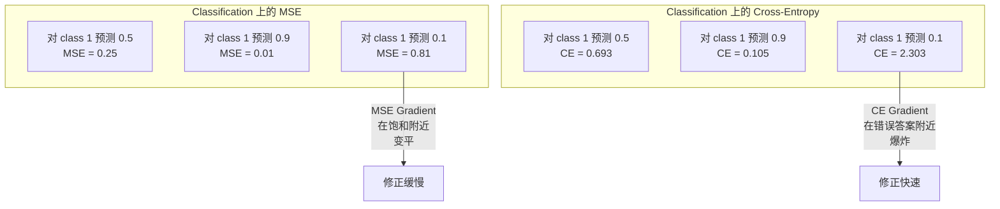
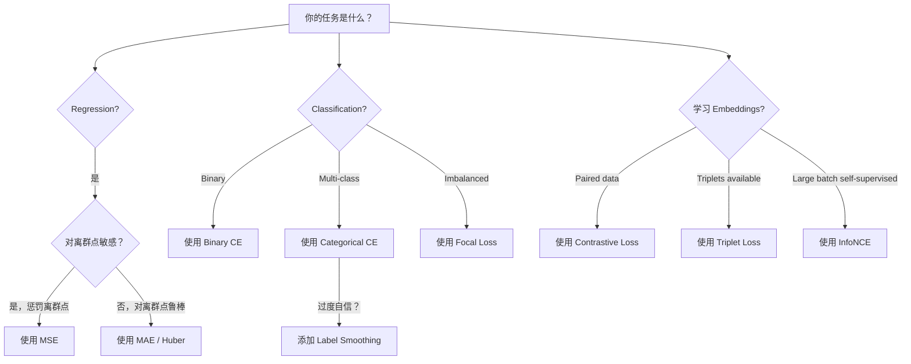
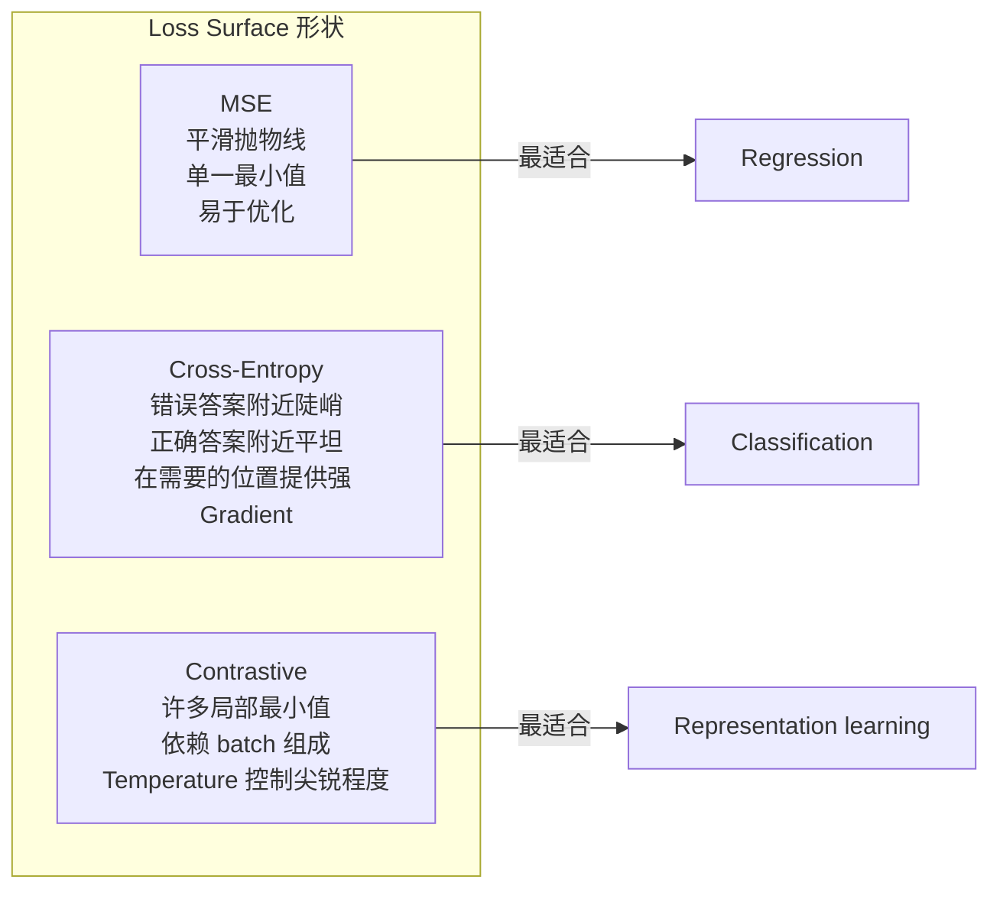

# हानि कार्य

> आपका न्यूरल नेटवर्क एक पूर्वानुमान बनाओ। मूल सत्य अलग-अलग उत्तर देता है। यह गलत है।

**Type:** Build
**Languages:** Python
**Prerequisites:** Lesson 03.04 (Activation Functions)
**Time:** ~75 minutes

## 学习目标

- MSE ∞ द्विआधारी क्रॉस-एंट्रोपी ∞ श्रेणीगत क्रॉस-एंट्रोपी और विपरीत हानि (InfoNCE) के साथ-साथ उनके ग्रेडिएंट को शून्य से प्राप्त करना
-  सभी नमूनों के लिए  0.5 के विफलता मॉडल का पूर्वानुमान, व्याख्या क्यों MSE वर्गीकरण के लिए उपयुक्त नहीं है
- लेबल चिकनाई  को क्रॉस-एंट्रोपी के लिए इस्तेमाल किया जाएगा,并 वर्णन यह कैसे अत्यधिक आत्मविश्वास पूर्वानुमान को रोकने के लिए
- पुनरावृत्ति, द्विआधारी वर्गीकरण, बहु-वर्ग वर्गीकरण तथा एम्बेडिंग सीखने का कार्य सही हानि फ़ंक्शन चुनें

## 问题

वर्गीकरण  समस्या पर न्यूनतम MSE के मॉडल, सभी चीजों के लिए बहुत आत्मविश्वास से भविष्यवाणी करेगा 0.5── यह वास्तव में न्यूनतम हानि में है── लेकिन यह भी पूरी तरह से उपयोग नहीं किया गया है──

हानि फ़ंक्शन मॉडल के वास्तविक अनुकूलन का एकमात्र वस्तु है। सटीकता नहीं है। F1 स्कोर नहीं है। न ही आप प्रबंधक को किसी भी मीट्रिक को रिपोर्ट करते हैं। अनुकूलक हानि फ़ंक्शन के ग्रेडिएंट को लेगा, और इस संख्या को छोटा करने के लिए अपना वजन समायोजित करेगा। यदि हानि फ़ंक्शन  ने आपके लिए वास्तव में चिंतित कुछ नहीं पकड़ा है, तो मॉडल इसे पूरा करने के लिए सबसे कम कीमत का एक तरीका ढूंढ लेगा, लेकिन यह तरीका लगभग हमेशा आपके लिए नहीं है।

यहाँ एक विशिष्ट उदाहरण है। आप एक द्विआधारी वर्गीकरण 任务── दो श्रेणियों, 50/50 分布── आप MSE का उपयोग हानि के रूप में करते हैं। मॉडल प्रत्येक प्रविष्टि के लिए एक हानि अनुमान 0.5── औसत MSE 0.25 है, जो कि कुछ भी नहीं सीखा है के मामले में हो सकता है कि न्यूनतम मूल्य है। यह मॉडल किसी भी भेदभाव क्षमता नहीं है, लेकिन तकनीकी रूप से यह कहते हैं कि यह आपके नुकसान समारोह को कम कर दिया है। क्रॉस-एंट्रोपी के बाद, एक ही मॉडल को अनुमान को 0 या 1 के लिए आगे बढ़ाने के लिए मजबूर किया जाएगा क्योंकि -लॉग 0.5) = 0.693 बहुत खराब हानि है, जबकि -लॉग(0.99) = 0.01 होगा आत्मविश्वास और सही अनुमान लगाने के लिए पुरस्कार। हानि समारोह का विकल्प, यह है कि मॉडल और मापने के लिए मेट्रिक रिक्त मॉडल के बीच अंतर है।

स्थिति भी बदतर हो जाएगी। स्व-निरीक्षण सीखने में, आपको भी कोई टैग नहीं है। कॉन्ट्रास्टिव लॉस ने सीखने के संकेतों को पूरी तरह से परिभाषित किया हैः क्या समान है, क्या अलग है, और मॉडल को अलग करने के लिए अधिक उपयोग किया जाना चाहिए।

## 概念

### औसत वर्ग त्रुटि (MSE)

प्रतिगमन का मानद विकल्प--- गणना पूर्वानुमान मूल्य और लक्ष्य मूल्य के बीच अंतर का वर्ग, और सभी नमूनों पर औसत प्राप्त करना

```
MSE = (1/n) * sum((y_pred - y_true)^2)
```

क्यों वर्ग महत्वपूर्ण हैः यह दूसरी तरह से बड़ी त्रुटियों को दंडित करेगा। त्रुटियों के लिए 2 की लागत 1 की 4 गुना है। त्रुटियों के लिए 10 की लागत 100 गुना है।

वास्तविक संख्याः यदि आपका मॉडल घर की कीमत का अनुमान लगाता है, तो अधिकांश घरों के लिए अंतर है $10,000，但对一栋豪宅偏差 $200,000,MSE एक और 99 सूट के प्रदर्शन को नुकसान पहुंचा सकता है।

MSE 相对预测值 का ग्रेडिएंट है:

```
dMSE/dy_pred = (2/n) * (y_pred - y_true)
```

यह त्रुटि के लिए एक विशेषता है, वर्गीकरण के लिए एक समस्या है, आप आत्मविश्वास के लिए एक सूचकांक श्रेणी दंड करना चाहते हैं, लेकिन त्रुटि के जवाब के लिए नहीं।

### क्रॉस-एंट्रोपी हानि

वर्गीकरण का हानि कार्य── यह सूचना सिद्धांत से उत्पन्न हुआ है-- अनुमानित संभावना वितरण और वास्तविक वितरण के बीच अंतर को मापने हेतु।

**Binary Cross-Entropy (BCE):**

```
BCE = -(y * log(p) + (1 - y) * log(1 - p))
```

इनमें से y है वास्तविक标签(0 या 1),p है पूर्वानुमान संभावना──

क्यों -log(p) 有效:当真标签是1 且你预测 p = 0.99 时,Loss是 -log(0.99) = 0.01──当你预测 p = 0.01 时,Loss是 -log(0.01) = 4.6── यह 460 倍 का अंतर है क्रॉस-एन्ट्रोपी 有效的原因── यह कठोर होगा आत्मविश्वास को दंडित करना लेकिन गलत भविष्यवाणी, लगभग एक ही समय में आत्मविश्वास और सही भविष्यवाणी को दंडित नहीं करना──

ग्रेडिएंट 讲述是同一个故事:

```
dBCE/dp = -(y/p) + (1-y)/(1-p)
```

जब y = 1 且p 接近零时,Gradient 是 -1/p,会趋向负负无穷――模型会得到一个巨大的信号来修正错误――当 p 接近1 时,Gradient 很小──已经正确了,不需要修改──

**Categorical Cross-Entropy:**

एक-हॉट 编码目标 के बहु-वर्ग वर्गीकरण के लिए उपयोग किया जाता है

```
CCE = -sum(y_i * log(p_i))
```

只有真实类别会贡献损失(因为其他所有 y_i 都是零) ⋅ यदि 10 个类别,正确类别得到的概率是0.1 ⋅随机猜测),Loss 是 -log(0.1) = 2.3 ⋅ यदि正确类别得到的概率是0.9,Loss 是 -log(0.9) =0.105 ⋅模型会学习把概率质量集中到正确答案上──

### एमएसई वर्गीकरण के अनुरूप क्यों नहीं है



जब पूर्वानुमान 0 या 1 के करीब होता है, तो एमएसई ग्रेडिएंट 和)  से बढ़कर बढ़ जाता है।

### लेबल स्मूथिंग

️️️️️️️️️️️️️️️️️️️️️️️️️️️️️️️️️️️️️️️️️️️️️️️️️️️️️️️️️️️️️️️️️️️️️️️️️️️️️️️️️️️️️️️️️️️️️️️️️️️️️️️️️️️️️️️️️️️️️️️️️️️️️️️️️️️️️️️️️️️️️️️️️️️️️️️️️️️️️️️️️️️️️️️️️️️️️️️️️️️️️️️️️️️️️️️️️️️️️️️️️️️️️️️️️️️️️️️️️️️️️️️️️️️️️️️️️️️️️️️️️️️️️️️️️️️️️️️️️️️️️️️️️️️️️️️️️️️️️️️️️️️️️️️️️️️️️️️️️️️️️️️️️️️️️️️️️️️️️️️️️️️️️️️️️️️️️️️️️️️️️️️️️️️️️️️️️️️️️️️️️️️️️️️️️️️️️️️️️️️️️️️️️️️️️️️️️️️️️️️️️️️️️️️️️️️️️️️️️️️️️️️️️️️️️️️️️️️️️️️️️️️️️️️️️️️️️️️️️️️️️️️️️️️️️️️️️️️️️️️️️️️️️️️️️️️️️️️️️️️️️️️️️️️️

```
smooth_label = (1 - alpha) * one_hot + alpha / num_classes
```

जब अल्फा = 0.1 且有 10 个类别时: लक्ष्य不再是 [0, 0, 1, 0, ...], बल्कि [0.01, 0.01, 0.91, 0.01,...]──模型的目标是0.91,而不是1.0──

यह क्यों प्रभावी हैः एक कोशिश करने के लिए सॉफ्टमैक्स  आउटपुट सटीक 1.0 के मॉडल, आवश्यकता है लॉजिट  को आगे बढ़ाएं हीन की ओर। यह अत्यधिक आत्मविश्वास का कारण बनता है, व्यापकता क्षमता को नुकसान पहुंचाता है, और मॉडल को वितरण परित्याग के लिए कमजोर बनाता है।

### विपरीत हानि

没有标签──没有类别──只有输入对和一个问题:它们相似还是不同?

**SimCLR-style contrastive loss (NT-Xent / InfoNCE):**

取一张图像──创建它的两个增强视图 (उत्पादन, घूर्णन, रंग झिझक)──它们是积极的对 -它们应该有相似的嵌入式──批发中的每张其他图像都会形成一个负的对 -它们应该有不同的嵌入式──

```
L = -log(exp(sim(z_i, z_j) / tau) / sum(exp(sim(z_i, z_k) / tau)))
```

उनमें से sim() है कॉस्मीन समानता, z_i 和 z_j है सकारात्मक जोड़ी, मांग और कवर सभी नकारात्मक,tau (तापमान)  नियंत्रण वितरण के चरम डिग्री。更低的温度 = 更难的负面 = 更激进的分离──

वास्तविक संख्याः बैच आकार 256 प्रत्येक सकारात्मक जोड़ी के लिए 255 ण नकारात्मक हैं। तापमान tau = 0.07(SimCLR 默认值) ⋅ यह हानि दिखती है जैसे कि समानता के लिए सॉफ्टमैक्स करना है - यह आशा करता है कि सकारात्मक जोड़ी की समानता सभी 256 ण विकल्पों में सबसे अधिक है।

**Triplet Loss:**

接收三个输入: एंकर、 सकारात्मक(同一类别)、 नकारात्मक(不同类别) 

```
L = max(0, d(anchor, positive) - d(anchor, negative) + margin)
```

मार्जिन (आमतौर पर 0.2-1.0) जबरदस्ती सकारात्मक और नकारात्मक अंतर के बीच न्यूनतम अंतर है। यदि नकारात्मक 已经足够远, हानि 就是零-- 没有渐进,没有更新── यह प्रशिक्षण को अधिक高效 बनाता है, लेकिन सावधानीपूर्वक त्रिभुज खनन की आवश्यकता है।

### फोकल हानि

उपयोग में असंतुलित डेटा संग्रह। मानक क्रॉस-एंट्रोपी बैठक सभी सही प्रकार के नमूनों के साथ समान व्यवहार करेगी। फोकल हानि आसान उदाहरणों के वजन को कम करेगीः

```
FL = -alpha * (1 - p_t)^gamma * log(p_t)
```

इनमें से p_t है वास्तविक वर्ग का पूर्वानुमान संभावना, गामा  नियंत्रण聚焦程度──当 गामा = 0 时, यह है मानक क्रॉस-एंट्रोपी──当 गामा = 2(默认值) 时:

- सरल उदाहरण (p_t = 0.9): वजन = (0.1) ^2 = 0.01──基本被忽略──
- कठिन उदाहरण (p_t = 0.1): वजन = (0.9) ^2 = 0.81──完整的渐进信号──

लिन और अन्य द्वारा प्रस्तावित, वस्तुओं की पहचान के लिए, उनमें से 99% उम्मीदवार क्षेत्र पृष्ठभूमि हैं।

### हानि कार्य 决策树



### भू-भाग का नुकसान




```figure
cross-entropy-loss
```

##  इसे निर्माण

### 步骤 1: एमएसई  और उसके ग्रेडिएंट

```python
def mse(predictions, targets):
    n = len(predictions)
    total = 0.0
    for p, t in zip(predictions, targets):
        total += (p - t) ** 2
    return total / n

def mse_gradient(predictions, targets):
    n = len(predictions)
    grads = []
    for p, t in zip(predictions, targets):
        grads.append(2.0 * (p - t) / n)
    return grads
```

### 步骤 2:बाइनरी क्रॉस-एंट्रोपी

log(0)  समस्या वास्तविकता है। यदि मॉडल एक सकारात्मक उदाहरण पर 精确预测 0,log(0) = 负无穷──剪剪可以防止这一点──

```python
import math

def binary_cross_entropy(predictions, targets, eps=1e-15):
    n = len(predictions)
    total = 0.0
    for p, t in zip(predictions, targets):
        p_clipped = max(eps, min(1 - eps, p))
        total += -(t * math.log(p_clipped) + (1 - t) * math.log(1 - p_clipped))
    return total / n

def bce_gradient(predictions, targets, eps=1e-15):
    grads = []
    for p, t in zip(predictions, targets):
        p_clipped = max(eps, min(1 - eps, p))
        grads.append(-(t / p_clipped) + (1 - t) / (1 - p_clipped))
    return grads
```

### 步骤 3: 带 Softmax का श्रेणीगत क्रॉस-एंट्रोपी

Softmax मूल लॉजिट को अनुमान के लिए परिवर्तित करेगा।

```python
def softmax(logits):
    max_val = max(logits)
    exps = [math.exp(x - max_val) for x in logits]
    total = sum(exps)
    return [e / total for e in exps]

def categorical_cross_entropy(logits, target_index, eps=1e-15):
    probs = softmax(logits)
    p = max(eps, probs[target_index])
    return -math.log(p)

def cce_gradient(logits, target_index):
    probs = softmax(logits)
    grads = list(probs)
    grads[target_index] -= 1.0
    return grads
```

softmax + क्रॉस-एंट्रोपी का ग्रेडिएंट बैठक优雅地化简化: वास्तविक वर्ग के लिए, यह सिर्फ है - 1), अन्य सभी वर्ग के लिए, यह सिर्फ है - अनुमानित संभावना) ⋅ यह सुंदर सरलता संयोग नहीं है - यही कारण है कि सॉफ्टमैक्स और क्रॉस-एंट्रोपी का उपयोग किया जाता है।

### 步骤 4: लेबल चिकनाई

```python
def label_smoothed_cce(logits, target_index, num_classes, alpha=0.1, eps=1e-15):
    probs = softmax(logits)
    loss = 0.0
    for i in range(num_classes):
        if i == target_index:
            smooth_target = 1.0 - alpha + alpha / num_classes
        else:
            smooth_target = alpha / num_classes
        p = max(eps, probs[i])
        loss += -smooth_target * math.log(p)
    return loss
```

### 步骤 5: विपरीत हानि (InfoNCE)

```python
def cosine_similarity(a, b):
    dot = sum(x * y for x, y in zip(a, b))
    norm_a = math.sqrt(sum(x * x for x in a))
    norm_b = math.sqrt(sum(x * x for x in b))
    if norm_a < 1e-10 or norm_b < 1e-10:
        return 0.0
    return dot / (norm_a * norm_b)

def contrastive_loss(anchor, positive, negatives, temperature=0.07):
    sim_pos = cosine_similarity(anchor, positive) / temperature
    sim_negs = [cosine_similarity(anchor, neg) / temperature for neg in negatives]

    max_sim = max(sim_pos, max(sim_negs)) if sim_negs else sim_pos
    exp_pos = math.exp(sim_pos - max_sim)
    exp_negs = [math.exp(s - max_sim) for s in sim_negs]
    total_exp = exp_pos + sum(exp_negs)

    return -math.log(max(1e-15, exp_pos / total_exp))
```

### 步骤 6: वर्गीकरण ऊपर की एमएसई बनाम क्रॉस-एंट्रोपी

प्रयोग两种 हानि फ़ंक्शन 训练课 04 中中的同一个神经网络(循环数据集) ――观察跨透气 收得更快──

```python
import random

def sigmoid(x):
    x = max(-500, min(500, x))
    return 1.0 / (1.0 + math.exp(-x))

def make_circle_data(n=200, seed=42):
    random.seed(seed)
    data = []
    for _ in range(n):
        x = random.uniform(-2, 2)
        y = random.uniform(-2, 2)
        label = 1.0 if x * x + y * y < 1.5 else 0.0
        data.append(([x, y], label))
    return data


class LossComparisonNetwork:
    def __init__(self, loss_type="bce", hidden_size=8, lr=0.1):
        random.seed(0)
        self.loss_type = loss_type
        self.lr = lr
        self.hidden_size = hidden_size

        self.w1 = [[random.gauss(0, 0.5) for _ in range(2)] for _ in range(hidden_size)]
        self.b1 = [0.0] * hidden_size
        self.w2 = [random.gauss(0, 0.5) for _ in range(hidden_size)]
        self.b2 = 0.0

    def forward(self, x):
        self.x = x
        self.z1 = []
        self.h = []
        for i in range(self.hidden_size):
            z = self.w1[i][0] * x[0] + self.w1[i][1] * x[1] + self.b1[i]
            self.z1.append(z)
            self.h.append(max(0.0, z))

        self.z2 = sum(self.w2[i] * self.h[i] for i in range(self.hidden_size)) + self.b2
        self.out = sigmoid(self.z2)
        return self.out

    def backward(self, target):
        if self.loss_type == "mse":
            d_loss = 2.0 * (self.out - target)
        else:
            eps = 1e-15
            p = max(eps, min(1 - eps, self.out))
            d_loss = -(target / p) + (1 - target) / (1 - p)

        d_sigmoid = self.out * (1 - self.out)
        d_out = d_loss * d_sigmoid

        for i in range(self.hidden_size):
            d_relu = 1.0 if self.z1[i] > 0 else 0.0
            d_h = d_out * self.w2[i] * d_relu
            self.w2[i] -= self.lr * d_out * self.h[i]
            for j in range(2):
                self.w1[i][j] -= self.lr * d_h * self.x[j]
            self.b1[i] -= self.lr * d_h
        self.b2 -= self.lr * d_out

    def compute_loss(self, pred, target):
        if self.loss_type == "mse":
            return (pred - target) ** 2
        else:
            eps = 1e-15
            p = max(eps, min(1 - eps, pred))
            return -(target * math.log(p) + (1 - target) * math.log(1 - p))

    def train(self, data, epochs=200):
        losses = []
        for epoch in range(epochs):
            total_loss = 0.0
            correct = 0
            for x, y in data:
                pred = self.forward(x)
                self.backward(y)
                total_loss += self.compute_loss(pred, y)
                if (pred >= 0.5) == (y >= 0.5):
                    correct += 1
            avg_loss = total_loss / len(data)
            accuracy = correct / len(data) * 100
            losses.append((avg_loss, accuracy))
            if epoch % 50 == 0 or epoch == epochs - 1:
                print(f"    Epoch {epoch:3d}: loss={avg_loss:.4f}, accuracy={accuracy:.1f}%")
        return losses
```

## इसका उपयोग करें

PyTorch  ने सभी मानक हानि फ़ंक्शन प्रदान किया, और संख्यात्मक स्थिरता को शामिल कियाः

```python
import torch
import torch.nn as nn
import torch.nn.functional as F

predictions = torch.tensor([0.9, 0.1, 0.7], requires_grad=True)
targets = torch.tensor([1.0, 0.0, 1.0])

mse_loss = F.mse_loss(predictions, targets)
bce_loss = F.binary_cross_entropy(predictions, targets)

logits = torch.randn(4, 10)
labels = torch.tensor([3, 7, 1, 9])
ce_loss = F.cross_entropy(logits, labels)
ce_smooth = F.cross_entropy(logits, labels, label_smoothing=0.1)
```

उपयोग `F.cross_entropy`(ऐसा नहीं है `F.nll_loss`加手动软max) ・ यह लॉग-सॉफ्टमैक्स और नकारात्मक लॉग-संभाव्यता 合并 एक संख्यात्मक स्थिर संचालन हेतु करेगा―― पहले अकेले सॉफ्टमैक्स को पुनः लागू करें 稳定性更差-- बड़े सूचकांक के चरण में घटने में सटीकता खो जाएगी―

 विपरीत सीखने के लिए, अधिकांश टीम स्वयं परिभाषित करने का उपयोग करती हैं, या उपयोग करती हैं `lightly``pytorch-metric-learning`इस प्रकार के भंडार ः मूल चक्र हमेशा समान होते हैंः गणना में समानता के प्रति, सकारात्मक एवं नकारात्मक पर आधारित  softmax का निर्माण, फिर Backpropagation 

## 交付 यह

本课会产出:
- `outputs/prompt-loss-function-selector.md`-- एक दोहराया जा सकता है संकेत, सही हानि समारोह का चयन करने के लिए
- `outputs/prompt-loss-debugger.md`-- एक निदान शीघ्र, के लिए प्रसंस्करण करने के लिए हानि कर्षण

## अभ्यास

1. 实现 हुबर हानि (smooth L1 loss), यह MSE के उपयोग में छोटे त्रुटियों के लिए, MAE के उपयोग में बड़े त्रुटियों के लिए प्रशिक्षण प्रदान करता है।

2.  फोकल हानि  बाइनरी वर्गीकरण  प्रशिक्षण चक्र में                                                                                                                                                                                                                                                      

3. 实现带带半硬负矿的三重损失──为 5 个类别生成 2D Embedding 数据──对每一个基,找到仍然比积极更远的最硬负半硬)──将收情况与随机三重选择进行比较──

4. 运行 MSE vs क्रॉस-एंट्रोपी प्रति तुलना, लेकिन प्रशिक्षण के दौरान प्रत्येक स्तर के ग्रेडिएंट परिमाण का पालन करें, प्रत्येक युग के औसत ग्रेडिएंट मानदंडों को चित्रित करें, मॉडल के सबसे अनिश्चित प्रारंभिक युगों में, क्रॉस-एंट्रोपी अधिक ग्रेडिएंट उत्पन्न करेगी।

5. 实现 KL विभेदन हानि,并验证当真实分布是一热时,最小化 KL(真实精算预测) 会给与交叉 Entropy 相同的 Gradient──然后尝试软目标──如知识蒸化),其中真实分布来自教师模型的软max 输出──

## 关键术语

| Term | 人们常说的说法 | 它实际意味着什么 |
|------|----------------|----------------------|
| Loss function | “模型错得有多离谱” | 一个可微函数，将预测和目标映射到 Optimizer 要最小化的标量 |
| MSE | “平均平方误差” | 预测和目标之间平方差的均值；以二次方式惩罚大误差 |
| Cross-entropy | “Classification 的 Loss” | 使用 -log(p) 衡量预测概率分布和真实分布之间的差异 |
| Binary cross-entropy | “BCE” | 两个类别的 cross-entropy：-(y*log(p) + (1-y)*log(1-p)) |
| Label smoothing | “软化目标” | 用软值（例如 0.1/0.9）替换硬 0/1 目标，以防止过度自信并提升泛化能力 |
| Contrastive loss | “拉近，推远” | 一种通过让相似对在 Embedding 空间中更近、非相似对更远来学习表示的 Loss |
| InfoNCE | “CLIP/SimCLR Loss” | 对相似度分数进行 normalized temperature-scaled cross-entropy；将 contrastive learning 视为 Classification |
| Focal loss | “不平衡数据修复方案” | 用 (1-p_t)^gamma 加权的 cross-entropy，用于降低 easy examples 的权重并聚焦 hard examples |
| Triplet loss | “Anchor-positive-negative” | 在 Embedding 空间中，使 anchor 比 negative 至少按一个 margin 更接近 positive |
| Temperature | “尖锐度旋钮” | 作用在 logits/相似度上的标量除数，用于控制结果分布的峰值程度；越低越尖锐 |

## 延伸阅读

- Lin et al., "घन वस्तु पहचान के लिए फोकल हानि" (2017) -- 引入焦点损失,用于处理对象检测 中的极端类别不平衡(RetinaNet)
- चेन और अन्य, "विजुअल रिप्रेजेंटेशन के कंट्रास्टिव लर्निंग के लिए एक सरल फ्रेमवर्क" (SimCLR, 2020) -- उपयोग NT-Xent हानि 定义了现代 कंट्रास्टिव लर्निंग 流程
- Szegedy et al., "Rethinking the Inception Architecture" (2016) -- 引入 लेबल चिकनाई 作为正则化技术,如今已成为多数大模型的标准做法
- हिंटन और अन्य, "निरोगिक नेटवर्क में ज्ञान को अलग करना" (2015) -- Using soft targets 和 KL divergence के ज्ञान को अलग करना,是模型压缩的基础
