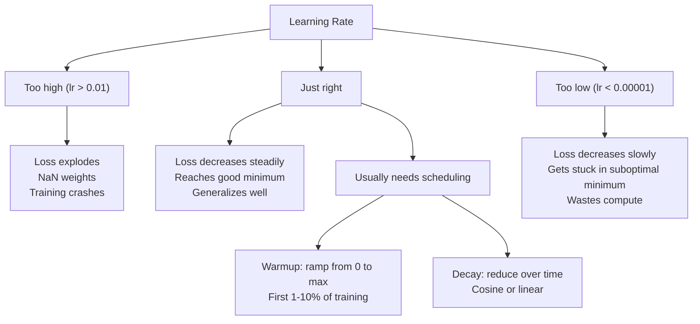
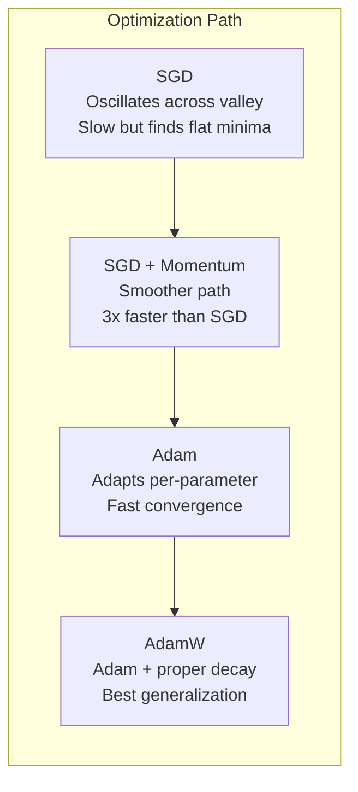
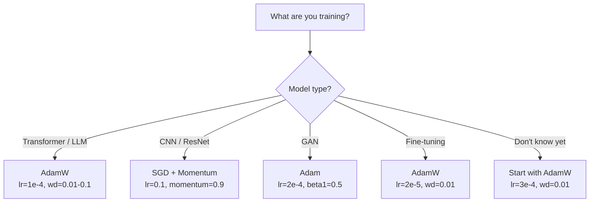

# अनुकूलन

> ग्रेडिएंट डेसेंट  आपको बताता है कि आपको किस दिशा में चलना चाहिए। यह बहुत दूर जाने का कोई संकेत नहीं देता है, न ही बहुत तेजी से जाने का कोई संकेत देता है।

**Type:** Build
**Languages:** Python
**Prerequisites:** Lesson 03.05 (Loss Functions)
**Time:** ~75 minutes

## 学习目标

- पायथन से शून्य से एसजीडी को प्राप्त करें
-  व्याख्या एडम की पूर्वाग्रह सुधार  कैसे मुआवजा प्रशिक्षण प्रारंभिक चरणों में से शून्य आरंभिकता के समय अनुमान
-  दिखाएँ कि एक ही कार्य पर, एडम के पास L2 नियमितता के साथ एडम की बेहतर समग्र क्षमता क्यों है
- ट्रांसफार्मर, सीएनएन, जीएएन तथा सूक्ष्म-ट्यूनिंग के लिए अनुकूल अनुकूलन अनुकूलन और डिफ़ॉल्ट हाइपरपरपरमैटर्स का चयन करें

## 问题

आप ग्रेडिएंट की गणना कर चुके हैं। आप जानते हैं कि 4,721 वजन को 0.003 से कम किया जाना चाहिए ताकि हानि को कम किया जा सके। लेकिन 0.003 की इकाई क्या है? किसके आधार पर संकुचित? 1 कदम और 1,000 कदम को समान मात्रा में स्थानांतरित किया जाना चाहिए?

वैनिला ग्रेडिएंट ड्रेसेंस प्रत्येक पैरामीटर पर एक ही सीखने की दर लागू करता हैः w = w - lr * ग्रेडिएंट── यह तीन समस्याएं पैदा करता है, जिससे अभ्यास में तंत्रिका नेटवर्क को बहुत दर्दनाक बना देता है──

प्रथम, झोंगझोंग।  गंवई परिदृश्य  बहुत कम एक सपाट के कटोरे की तरह  यह एक और लंबी और संकीर्ण घाटी की तरह है ग्रेडिएंट दिशा में दरार घाटी के माध्यम से दिशा में दिशा में दिशा में दिशा में दिशा में नहीं, बल्कि घाटी के साथ दिशा में संकीर्ण आयामों में गंवई और झूलने वाला होगा ग्रेडिएंट निस्तारण, जबकि वास्तव में उपयोगी दिशा में प्रगति बहुत छोटी है आप इस तरह की घटना को देख चुके हैंः खोना पहले तेजी से नीचे उतरना, फिर मंच अवधि में प्रवेश करना, न कि मॉडल  प्राप्त किया गया है, बल्कि क्योंकि यह झोंगझोंग में है

दूसरा, सभी मापदंडों के लिए एक ही सीखने की दर का उपयोग करना गलत है। कुछ मापदंडों को बड़े पैमाने पर अपडेट करने की आवश्यकता है।

तीसरा,सैडल पॉइंट्स── उच्च स्तर की अंतरिक्ष में, लॉस लैंडस्केप  एक बड़ा समतल क्षेत्र है, जिसमें ग्रेडिएंट 接近零── वनिला एसजीडी इन क्षेत्रों पर ग्रेडिएंट की गति से चढ़ेगा, जबकि यह गति वास्तव में शून्य के करीब है। मॉडल लग रहा है कि यह लकड़ी में है── यह एक समतल क्षेत्र में है, दूसरी ओर एक उपयोगी नीचे की दिशा है── लेकिन एसजीडी  इस क्षेत्र के माध्यम से इसे बढ़ावा नहीं देता है तंत्र──

एडम ने इन तीनों समस्याओं को हल किया। यह प्रत्येक पैरामीटर के लिए दो चल रहे औसत को बनाए रखता है - औसत ग्रेडिएंट (मॉमेंट, प्रसंस्करण) और औसत वर्ग ग्रेडिएंट (अनुकूलन दर, प्रसंस्करण) ।

## 概念

### स्टोकास्टिक ग्रेडिएंट डाउनडेन्स (SGD)

最简单的优化器──在迷你批量上计算 渐进,并朝相反方向前进一步──

```
w = w - lr * gradient
```

स्टोकास्टिक यह दर्शाता है कि आप डेटा के किसी भी प्रकार का उपयोग करते हैं, जो कि एक पूर्ण डेटासेट का उपयोग करने के बजाय ग्रेडिएंट का अनुमान लगाने के लिए है।

सीखने की दर अद्वितीय है। बहुत अधिक: हानि प्रसारण। बहुत कम: प्रशिक्षण बहुत लंबा समय लेगा। सर्वोत्तम मूल्य वास्तुकला, डेटा, बैच आकार और वर्तमान प्रशिक्षण चरण पर निर्भर करता है। आधुनिक नेटवर्क के लिए, वैनिला एसजीडी की विशिष्ट मूल्य सीमा 0.01 से 0.1 है। लेकिन एक प्रशिक्षण प्रक्रिया के दौरान भी, आदर्श सीखने की दर भी बदल जाएगी।

### गति

छोटे गेंद के नीचे पहाड़ की तरह बहुत अधिक उपयोग किया जाता है, लेकिन यह सटीक है। आप केवल ग्रेडिएंट के आधार पर नहीं बढ़ते हैं, बल्कि एक गति बनाए रखते हैं, जो पिछले ग्रेडिएंट को इकट्ठा करने के लिए उपयोग की जाती है।

```
m_t = beta * m_{t-1} + gradient
w = w - lr * m_t
```

बीटा (आमतौर पर 0.9) का नियंत्रण है। जब बीटा = 0.9 时,momentum 大致等于最近 10 个梯子的平均值 (/1/ (1 - 0.9) = 10) ⋅

क्यों यह झोंपड़ा सुधार सकता हैः एक ही दिशा में इंगित करने वाले ग्रेडिएंट्स एकत्रित होंगे। दिशाएं दोहरा-फराया होकर एक दूसरे का प्रतिरोध करेंगे। उस संकीर्ण घाटी में, प्रत्येक चरण में प्रत्येक भाग का आकार बदल जाएगा और कम हो जाएगा।

वास्तविक संख्याः बहुत खराब स्थिति में नुकसान परिदृश्य पर, अकेले उपयोग करने के लिए SGD को 10,000 कदम की आवश्यकता हो सकती है।

### आरएमएसपीआरपी

प्रथम वास्तव में प्रभावी प्रति पैरामीटर अनुकूलन सीखने की दर 方法── द्वारा Hinton 在 Coursera 课程中提出 ((从未正式发表)──

```
s_t = beta * s_{t-1} + (1 - beta) * gradient^2
w = w - lr * gradient / (sqrt(s_t) + epsilon)
```

s_t अनुसरण करें वर्ग ग्रेडिएंट्स का चल रहा औसत── निरंतर अधिक ग्रेडिएंट्स के मापदंडों को एक बड़ी संख्या में विभाजित करेगा️ कम प्रभावी सीखने की दर️️ Gradients ️ छोटे मापदंडों को एक छोटी संख्या में विभाजित करेगा️ अधिक प्रभावी सीखने की दर️️️️️

यह सभी मापदंडों का समाधान करता है एक ही सीखने की दर का उपयोग करके समस्या है। एक लगातार भारी वजन प्राप्त कर रहा है। यह लक्ष्य के करीब हो सकता है।

Epsilon (आमतौर पर 1e-8) किसी पैरामीटर पर होगा जो अभी तक अपडेट नहीं हुआ है।

### एडमः गति + आरएमएसप्रॉप

आदम ने दो प्रकार के विचारों को मिलाया। यह प्रत्येक पैरामीटर के लिए दो घातीय चलती औसत बनाए रखता हैः

```
m_t = beta1 * m_{t-1} + (1 - beta1) * gradient        (first moment: mean)
v_t = beta2 * v_{t-1} + (1 - beta2) * gradient^2       (second moment: variance)
```

**Bias correction**है अधिकांश व्याख्याएँ करेंगे कूदने के महत्वपूर्ण विवरणों── में पहला चरण, m_1 = (1 - बीटा1) * ग्रेडिएंट── जब बीटा1 = 0.9 时, यह 0.1 * ग्रेडिएंट -- 小了十倍── चलती औसत अभी भी कोई पूर्व ताप── पूर्वाग्रह सुधार होगा क्षतिपूर्तिः

```
m_hat = m_t / (1 - beta1^t)
v_hat = v_t / (1 - beta2^t)
```

第 1 步且beta1 = 0.9 时:m_hat = m_1 / (1 - 0.9) = m_1 / 0.1 = 实际 ग्रेडिएंट。第 100 步时:(1 - 0.9^100) 约等于 1.0, इसलिए सुधार 消失── पूर्व ~10 步对偏见的修正很重要,在 ~50 步后基本无关紧要──

更新公式:

```
w = w - lr * m_hat / (sqrt(v_hat) + epsilon)
```

Adam 默认值:lr = 0.001,beta1 = 0.9,beta2 = 0.999,epsilon = 1e-8。 ये默认值 80% के लिए लागू होती हैं 问题──当它们不适用时,先改 lr──然后改beta2──几乎永远不要改beta1或epsilon──

### एडमः सही ढंग से वजन घटाने के लिए

L2 नियमितता 会向损失 中添加兰布 * w^2──在尼拉 SGD 中,这等于体重衰退(每步从体重中减去兰布 * w)──在亚当中,这种等价关系会失效──

लोश्चिलोव और हट्टर का洞见是: जब आप L2 को घाटे में जोड़ते हैं, तो एडम को                                                                                                                                                                                                                                                

एडम के माध्यम से एडम अपडेट के बाद सीधे वजन पर लागू वजन घटाने के लिए इस समस्या को ठीक करने के लिएः

```
w = w - lr * m_hat / (sqrt(v_hat) + epsilon) - lr * lambda * w
```

वजन घटाने की अवधि (LR * lambda * w) एडम के अनुकूलन कारक द्वारा नहीं संकुचित होती है 缩放── प्रत्येक पैरामीटर को समान अनुपात में संकुचित किया जाता है──

यह एक छोटे से विवरण की तरह दिखता है। यह नहीं है। यह लगभग सभी कार्यों में एडम + एल 2 नियमितता से बेहतर समाधान प्राप्त करता है। यह पिटॉर्च में उपयोग किया जाता है, जो ट्रांसफार्मरों, प्रसारण मॉडल और अधिकांश आधुनिक वास्तुकलाओं के डिफ़ॉल्ट ऑप्टिमाइज़रों को प्रशिक्षित करता है।

### सीखने की दर: सबसे महत्वपूर्ण हाइपरपरमैटर



यदि आप केवल एक हाइपरपरमैटर को समायोजित करते हैं, तो यह सीखने की दर को समायोजित करता है।

- SGD: lr = 0.01 से 0.1
- आदम/आदमडब्ल्यू: lr = 1e-4 से 3e-4
- परिष्कृत पूर्व-प्रशिक्षित मॉडलः lr = 1e-5 से 5e-5
- सीखने की दर में वृद्धिः 1-10% के चरणों में मध्यवर्ती रैंप

### अनुकूलन करने वाला



### प्रत्येक प्रकार के अनुकूलक 何時胜出




```figure
optimizer-trajectory
```

##  इसे निर्माण

### 步骤 1: वैनिला एसजीडी

```python
class SGD:
    def __init__(self, lr=0.01):
        self.lr = lr

    def step(self, params, grads):
        for i in range(len(params)):
            params[i] -= self.lr * grads[i]
```

### 步骤 2: 带 Momentum का SGD

```python
class SGDMomentum:
    def __init__(self, lr=0.01, beta=0.9):
        self.lr = lr
        self.beta = beta
        self.velocities = None

    def step(self, params, grads):
        if self.velocities is None:
            self.velocities = [0.0] * len(params)
        for i in range(len(params)):
            self.velocities[i] = self.beta * self.velocities[i] + grads[i]
            params[i] -= self.lr * self.velocities[i]
```

### 步骤 3: आदम

```python
import math

class Adam:
    def __init__(self, lr=0.001, beta1=0.9, beta2=0.999, epsilon=1e-8):
        self.lr = lr
        self.beta1 = beta1
        self.beta2 = beta2
        self.epsilon = epsilon
        self.m = None
        self.v = None
        self.t = 0

    def step(self, params, grads):
        if self.m is None:
            self.m = [0.0] * len(params)
            self.v = [0.0] * len(params)

        self.t += 1

        for i in range(len(params)):
            self.m[i] = self.beta1 * self.m[i] + (1 - self.beta1) * grads[i]
            self.v[i] = self.beta2 * self.v[i] + (1 - self.beta2) * grads[i] ** 2

            m_hat = self.m[i] / (1 - self.beta1 ** self.t)
            v_hat = self.v[i] / (1 - self.beta2 ** self.t)

            params[i] -= self.lr * m_hat / (math.sqrt(v_hat) + self.epsilon)
```

### 步骤 4: एडम

```python
class AdamW:
    def __init__(self, lr=0.001, beta1=0.9, beta2=0.999, epsilon=1e-8, weight_decay=0.01):
        self.lr = lr
        self.beta1 = beta1
        self.beta2 = beta2
        self.epsilon = epsilon
        self.weight_decay = weight_decay
        self.m = None
        self.v = None
        self.t = 0

    def step(self, params, grads):
        if self.m is None:
            self.m = [0.0] * len(params)
            self.v = [0.0] * len(params)

        self.t += 1

        for i in range(len(params)):
            self.m[i] = self.beta1 * self.m[i] + (1 - self.beta1) * grads[i]
            self.v[i] = self.beta2 * self.v[i] + (1 - self.beta2) * grads[i] ** 2

            m_hat = self.m[i] / (1 - self.beta1 ** self.t)
            v_hat = self.v[i] / (1 - self.beta2 ** self.t)

            params[i] -= self.lr * m_hat / (math.sqrt(v_hat) + self.epsilon)
            params[i] -= self.lr * self.weight_decay * params[i]
```

### 步骤 5: 训练对比

पाठ 05 के सर्कल डेटासेट के ऊपर, सभी चार प्रकार के अनुकूलक का उपयोग करके एक दोस्तरीय नेटवर्क में प्रशिक्षण करें।

```python
import random

def sigmoid(x):
    x = max(-500, min(500, x))
    return 1.0 / (1.0 + math.exp(-x))

def make_circle_data(n=200, seed=42):
    random.seed(seed)
    data = []
    for _ in range(n):
        x = random.uniform(-2, 2)
        y = random.uniform(-2, 2)
        label = 1.0 if x * x + y * y < 1.5 else 0.0
        data.append(([x, y], label))
    return data


class OptimizerTestNetwork:
    def __init__(self, optimizer, hidden_size=8):
        random.seed(0)
        self.hidden_size = hidden_size
        self.optimizer = optimizer

        self.w1 = [[random.gauss(0, 0.5) for _ in range(2)] for _ in range(hidden_size)]
        self.b1 = [0.0] * hidden_size
        self.w2 = [random.gauss(0, 0.5) for _ in range(hidden_size)]
        self.b2 = 0.0

    def get_params(self):
        params = []
        for row in self.w1:
            params.extend(row)
        params.extend(self.b1)
        params.extend(self.w2)
        params.append(self.b2)
        return params

    def set_params(self, params):
        idx = 0
        for i in range(self.hidden_size):
            for j in range(2):
                self.w1[i][j] = params[idx]
                idx += 1
        for i in range(self.hidden_size):
            self.b1[i] = params[idx]
            idx += 1
        for i in range(self.hidden_size):
            self.w2[i] = params[idx]
            idx += 1
        self.b2 = params[idx]

    def forward(self, x):
        self.x = x
        self.z1 = []
        self.h = []
        for i in range(self.hidden_size):
            z = self.w1[i][0] * x[0] + self.w1[i][1] * x[1] + self.b1[i]
            self.z1.append(z)
            self.h.append(max(0.0, z))

        self.z2 = sum(self.w2[i] * self.h[i] for i in range(self.hidden_size)) + self.b2
        self.out = sigmoid(self.z2)
        return self.out

    def compute_grads(self, target):
        eps = 1e-15
        p = max(eps, min(1 - eps, self.out))
        d_loss = -(target / p) + (1 - target) / (1 - p)
        d_sigmoid = self.out * (1 - self.out)
        d_out = d_loss * d_sigmoid

        grads = [0.0] * (self.hidden_size * 2 + self.hidden_size + self.hidden_size + 1)
        idx = 0
        for i in range(self.hidden_size):
            d_relu = 1.0 if self.z1[i] > 0 else 0.0
            d_h = d_out * self.w2[i] * d_relu
            grads[idx] = d_h * self.x[0]
            grads[idx + 1] = d_h * self.x[1]
            idx += 2

        for i in range(self.hidden_size):
            d_relu = 1.0 if self.z1[i] > 0 else 0.0
            grads[idx] = d_out * self.w2[i] * d_relu
            idx += 1

        for i in range(self.hidden_size):
            grads[idx] = d_out * self.h[i]
            idx += 1

        grads[idx] = d_out
        return grads

    def train(self, data, epochs=300):
        losses = []
        for epoch in range(epochs):
            total_loss = 0.0
            correct = 0
            for x, y in data:
                pred = self.forward(x)
                grads = self.compute_grads(y)
                params = self.get_params()
                self.optimizer.step(params, grads)
                self.set_params(params)

                eps = 1e-15
                p = max(eps, min(1 - eps, pred))
                total_loss += -(y * math.log(p) + (1 - y) * math.log(1 - p))
                if (pred >= 0.5) == (y >= 0.5):
                    correct += 1
            avg_loss = total_loss / len(data)
            accuracy = correct / len(data) * 100
            losses.append((avg_loss, accuracy))
            if epoch % 75 == 0 or epoch == epochs - 1:
                print(f"    Epoch {epoch:3d}: loss={avg_loss:.4f}, accuracy={accuracy:.1f}%")
        return losses
```

## इसका उपयोग करें

PyTorch Optimizers 会处理 पैरामीटर समूह、ग्रेडिएंट क्लिपिंग तथा सीखने की दर शेड्यूलिंग:

```python
import torch
import torch.optim as optim

model = torch.nn.Sequential(
    torch.nn.Linear(784, 256),
    torch.nn.ReLU(),
    torch.nn.Linear(256, 10),
)

optimizer = optim.AdamW(model.parameters(), lr=3e-4, weight_decay=0.01)

scheduler = optim.lr_scheduler.CosineAnnealingLR(optimizer, T_max=100)

for epoch in range(100):
    optimizer.zero_grad()
    output = model(torch.randn(32, 784))
    loss = torch.nn.functional.cross_entropy(output, torch.randint(0, 10, (32,)))
    loss.backward()
    torch.nn.utils.clip_grad_norm_(model.parameters(), max_norm=1.0)
    optimizer.step()
    scheduler.step()
```

模式始终是:zero_grad、forward、loss、backward、(clip)、step、(schedule)。记住这个顺序──弄错它──例如在优化器.step() 之前调用时间表.step((是细微 bug 的常见来源──

 CNN के लिए, कई प्रैक्टिशनर अभी भी गति के साथ SGD का उपयोग करना पसंद करते हैं (lr=0.1,momentum=0.9,weight_decay=1e-4),并搭配 step या cosine schedule──SGD अधिक समतल न्यूनतम पाएगा, जबकि यह आमतौर पर बेहतर समग्रता क्षमता रखता है── ट्रांसफार्मर और LLMs के लिए, वार्मिंग + cosine decay के साथ AdamW आम तौर पर एक आदर्श विकल्प है──除非 वहाँ मापने के कारण हैं, अन्यथा मत करो और सहमति के खिलाफ विरोध करो──

## 交付 यह

本课产出:
- `outputs/prompt-optimizer-selector.md`-- एक के लिए उपयोग किया जाता है के लिए किसी भी वास्तुकला  सही चुनें अनुकूलक और सीखने की दर के लिए निर्णय त्वरित

## अभ्यास

1. 实现 नेस्टरोव गति, जिसमें आप वर्तमान स्थान पर नहीं हैं Lookhead 位置(w - lr * beta * v)

2. ➡️ एक सीखने की दर वार्मिंग शेड्यूल को प्राप्त करनाः प्रशिक्षण के पहले 10% चरणों में 0 线性 रामप से अधिकतम_lr तक, फिर कॉस्किन क्षय तक 0 ⋅ तुलना करें आदम + वार्मिंग के साथ बिना वार्मिंग के आदम ⋅ माप सर्कल डेटासेट में 90% सटीकता तक पहुँचने ⋅ कितने युगों की आवश्यकता है

3. ️️️️️️️️️️️️️️️️️️️️️️️️️️️️️️️️️️️️️️️️️️️️️️️️️️️️️️️️️️️️️️️️️️️️️️️️️️️️️️️️️️️️️️️️️️️️️️️️️️️️️️️️️️️️️️️️️️️️️️️️️️️️️️️️️️️️️️️️️️️️️️️️️️️️️️️️️️️️️️️️️️️️️️️️️️️️️️️️️️️️️️️️️️️️️️️️️️️️️️️️️️️️️️️️️️️️️️️️️️️️️️️️️️️️️️️️️️️️️️️️️️️️️️️️️️️️️️️️️️️️️️️️️️️️️️️️️️️️️️️️️️️️️️️️️️️️️️️️️️️️️️️️️️️️️️️️️️️️️️️️️️️️️️️️️️️️️️️️️️️️️️️️️️️️️️️️️️️️️️️️️️️️️️️️️️️️️️️️️️️️️️️️️️️️️️️️️️️️️️️️️️️️️️️️️️️️️️️️️️️️️️️️️️️️️️️️️️️️️️️️️️️️️️️️️️️️️️️️️️️️️️️️️️️️️️️️️️️️️️️️️️️️️️️️️️️️️️️️️️️️️️️️️️️️

4. 实现梯度剪裁 (→ वैश्विक मानदंड क्लिप) ∼将最大梯度标准 设置为 1.0──使用较高学习率(Adam 的 lr=0.01) 分别在有剪裁和无剪裁的情况下训练──统计 10 个随机种子中,有多少次运行会发散(Loss 变为 NaN)──

5. एक बड़े वजन वाले नेटवर्क में ऊपर तुलना एडम और एडम वें। सभी वजन को [-5, 5] के बीच के क्रमबद्ध मानों में प्रारम्भिक रूप से किया जाएगा।

## 关键术语

| Term | 人们通常怎么说 | 它实际意味着什么 |
|------|----------------|----------------------|
| Learning rate | “Step size” | Gradient update 上的标量乘数；训练中影响最大的单个 hyperparameter |
| SGD | “Basic gradient descent” | Stochastic Gradient Descent：通过减去 lr * gradient 来更新 weights，Gradient 在 mini-batch 上计算 |
| Momentum | “Rolling ball analogy” | 过去 Gradients 的 exponential moving average；削弱振荡，并加速一致方向 |
| RMSProp | “Adaptive learning rate” | 用近期 Gradients 的 running RMS 除以每个 parameter 的 Gradient；均衡 learning rates |
| Adam | “The default optimizer” | 将 momentum（first moment）和 RMSProp（second moment）结合起来，并对初始 steps 进行 bias correction |
| AdamW | “Adam done right” | 带 decoupled weight decay 的 Adam；直接对 weights 应用 regularization，而不是通过 Gradient |
| Bias correction | “Warmup for running averages” | 除以 (1 - beta^t)，用于补偿 Adam 的 moment estimates 的零初始化 |
| Weight decay | “Shrink the weights” | 每一步减去 weight 值的一部分；一种惩罚大 weights 的 regularizer |
| Learning rate schedule | “Changing lr over time” | 在训练期间调整 learning rate 的函数；warmup + cosine decay 是现代默认方案 |
| Gradient clipping | “Capping the gradient norm” | 当 Gradient Vector 的 norm 超过阈值时对其进行缩放；防止 exploding gradient updates |

## 延伸阅读

- किंगमा एंड बा, आदमः स्टोकास्टिक अनुकूलन के लिए एक विधि (2014) -- 原始 आदम पेपर, समाहित अभिसरण विश्लेषण 和 पूर्वाग्रह सुधार 推导
- लोश्चिलोव और हट्टर, डिस्कॉप्ड वजन घटाने विनियमन (2017) -- 证明在亚当中L2 विनियमन与体重 घटाने 不等价,并提出亚当W
- स्मिथ, निरोगिक नेटवर्क प्रशिक्षण के लिए चक्रवर्ती सीखने की दर (2017) --  LR रेंज परीक्षण और चक्रवर्ती कार्यक्रमों की शुरूआत, स्थिर सीखने की दर की मांग को कम करने
- रुडर, एक सिंहावलोकन ग्रेडिएंट ड्रेसेंस ऑप्टिमाइजेशन एल्गोरिदम (2016) -- 关于所有优化器 变体的最佳单篇综述,比较清晰,直觉解释也明确
