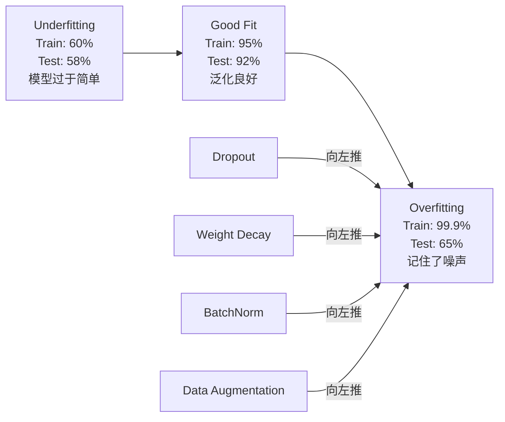
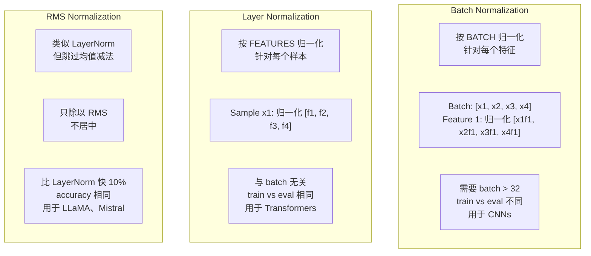
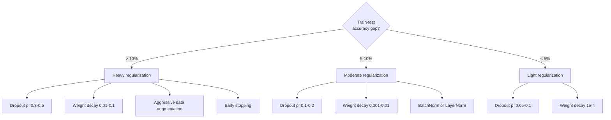

# नियमन

> आपके मॉडल को प्रशिक्षण डेटा पर 99% तक पहुंच जाता है, लेकिन परीक्षण डेटा पर केवल 60% तक पहुंच जाता है। यह डेटा को याद करता है, नियम नहीं सीखता है। नियमन आपके द्वारा जटिलता पर लगाए गए करों का एक हिस्सा है, जो मॉडल को व्यापक बनाने के लिए उपयोग किया जाता है।

**Type:** Build
**Languages:** Python
**Prerequisites:** Lesson 03.06 (Optimizers)
**Time:** ~75 minutes

## 学习目标
- शून्य से प्राप्त करने के साथ उल्टे पैमाने का ड्रॉपअप, L2 वजन घटाने, बैच सामान्यीकरण, परत सामान्यीकरण और RMSNorm
- योजना-परीक्षण सटीकता अंतर को मापने,并 नियमितता के माध्यम से  प्रयोग निदान अति-फिटिंग
-  व्याख्या क्यों ट्रांसफार्मर उपयोग LayerNorm बशर्ते बैचनॉर्म, और क्यों आधुनिक LLM अधिक RMSNorm पसंद करते हैं
- 技术组合 技术组合 技术组合 技术组合

## 问题
एक पैरामीटर पर्याप्त न्यूरल नेटवर्क किसी भी डेटा सेट को याद कर सकता है। यह परिकल्पना नहीं है। Zhang et al. (2017) ImageNet के साथ साथ प्रशिक्षण मानक नेटवर्क इस बात का प्रमाण है। ये नेटवर्क पूरी तरह से यादृच्छिक टैग वितरण पर लगभग शून्य प्रशिक्षण हानि तक पहुंच गए हैं। वे एक मिलियन को याद करते हैं। कोई भी मॉडल नहीं है।

यह एक अति-फिटिंग समस्या है, और मॉडल अधिक बड़ा है, यह समस्या अधिक गंभीर है। GPT-3 में 175 बिलियन पैरामीटर हैं। प्रशिक्षण समूह में लगभग 500 बिलियन टोकन हैं। इतने सारे पैरामीटर हैं, मॉडल में पर्याप्त क्षमता है, जो प्रशिक्षण डेटा के बहुत सारे टुकड़े को याद रख सकता है। कोई विनियमन नहीं है, यह केवल प्रशिक्षण नमूने को दोहराएगा, न कि एक सामान्यीकृत मोड को सीखना।

 प्रशिक्षण प्रदर्शन और परीक्षण प्रदर्शन के बीच अंतर अति-फिटिंग अंतर है। इस वर्ग में प्रत्येक तकनीक इस अंतर पर अलग-अलग कोणों से हमला करती है। Dropout जरूरत नेटवर्क को किसी भी एकल तंत्रिका पर निर्भर नहीं करने के लिए मजबूर करती है।  वजन घटाने  किसी भी एकल वजन को बहुत बड़ा होने से रोकने के लिए  बैच सामान्यीकरण 会平滑  लॉस परिदृश्य, ऑप्टिमाइज़र को अधिक平坦、 अधिक सार्वभौमिक न्यूनतम खोजने में मदद करता है।  परत सामान्यीकरण एक ही काम करता है, लेकिन बैच सामान्यीकरण  विफलता में काम कर सकता है।️ छोटी बैच ️ लंबाई अनुक्रम) ️ RMSNorm ️ औसत मान गणना के माध्यम से, इसे लगभग 10% ️ तेजी से करें। प्रत्येक तकनीक बहुत सरल है। ️ एकत्रित, वे स्मृति मॉडल और सार्वभौमिक मॉडल के बीच अंतर हैं

## 概念
### अति-फिटिंग स्पेक्ट्रम

प्रत्येक मॉडल अंडरफिटिंग से लेकर ओवरफिटिंग से लेकर ओवरफिट तक (जिसमें शोर पकड़े जाने तक) एक स्थान पर स्थित होता है।



### छोड़ना

सबसे सरल नियमितकरण  तकनीक, लेकिन सबसे उत्कृष्ट व्याख्या है  प्रशिक्षण के दौरान, प्रत्येक तंत्रिका के आउटपुट को शून्य के रूप में निर्धारित किया जाएगा।

```
output = activation(z) * mask    where mask[i] ~ Bernoulli(1 - p)
```

जब p = 0.5 , प्रत्येक आगे की उत्तीर्णता से आधा तंत्रिका शून्य पर रखा जाता है। नेटवर्क को अतिरिक्त संकेत सीखना चाहिए, क्योंकि यह यह अनुमान नहीं लगा सकता है कि कौन से तंत्रिका उपयोग करने योग्य हैं।

एक साथ  व्याख्याः एक है N 个神经元并使用中断的网络会创建2^N 个可能的子网络 (所有神经元开关或关联的组合) ⋅ उपयोग中断的训练近似于同时训练所有2^N 个子网络,每个都在不同的小组上训练――测试时,你使用所有神经元(无中断),并将输出按 (1 - p)缩小,以匹配训练期间的期望值―― यह 2^N 个子网络的预测价格等于平均单个模型获得一个巨大的组件――

实践中,缩放会在训练期间应用,而不是测试期间应用(inverted dropout):

```
During training:  output = activation(z) * mask / (1 - p)
During testing:   output = activation(z)   (no change needed)
```

यह बेहतर है, क्योंकि परीक्षण कोड पूरी तरह से छोड़ने के लिए पता करने की जरूरत नहीं है

默认比例:ट्रांसफॉर्मर 使用 p = 0.1,MLPs 使用 p = 0.5,CNNs 使用 p = 0.2-0.3──更高的 droppoput = 更强的规范化 = 更高的不适应风险──

### वजन घटाने (एल 2 नियमन)

सम्पत्ति के अधिकार के वर्ग आकार में हानि शामिल करें

```
total_loss = task_loss + (lambda / 2) * sum(w_i^2)
```

नियमन के क्रम का ग्रेडिएंट लैम्ब्डा * w है। इसका अर्थ है कि प्रत्येक चरण में, प्रत्येक भार अपने आकार के अनुपात के अनुसार शून्य तक संकुचित होगा।

क्यों यह व्यापकता में मदद करता हैः ओवरफिट  मॉडल अक्सर अधिक वजन होता है, प्रशिक्षण डेटा में शोर बढ़ाता है।

लैम्ब्डा हाइपरपरमैटर 控制强度──典型值:

- ट्रांसफार्मर ऊपर का AdamW उपयोग 0.01
- सीएनएन के ऊपर SGD 1e-4 का उपयोग
- 严重 overfit 的模型使用 0.1

उदाहरण: पाठ 06 में चर्चाः वजन घटाने 和 L2 नियमितकरण 在 SGD 中等价,但在亚当中不等价──使用亚当 训练时,始终使用亚当W(脱重减) 

### बैच सामान्यीकरण

प्रत्येक स्तर के आउटपुट को निम्न स्तर तक पारित करने से पहले, पहले मिनी-बैच  आयाम पर इसके एकीकरण को।

对于某一层的一批激活:

```
mu = (1/B) * sum(x_i)           (batch mean)
sigma^2 = (1/B) * sum((x_i - mu)^2)   (batch variance)
x_hat = (x_i - mu) / sqrt(sigma^2 + eps)   (normalize)
y = gamma * x_hat + beta        (scale and shift)
```

गामा व बीटा सीखने योग्य पैरामीटर हैं, जिससे नेटवर्क को सर्वोत्तम परिस्थितियों में इस प्रकार के सामान्यीकरण को रद्द कर दिया जा सके।

**Training vs inference split:** प्रशिक्षण के दौरान,mu 和 sigma से वर्तमान मिनी-बैच──推理 के दौरान,आपको प्रशिक्षण के दौरान संचयी चल रही औसत ((मॉमेंटम = 0.1 का एक्सपोनेंशियल चलती औसत, यानि 90% 旧值 + 10% नया मूल्य) 

बैचनॉर्म क्यों प्रभावी है अभी भी विवाद है। मूल लेख दावा करता है कि यह "आंतरिक कोविरेट शिफ्ट" को कम करता है। (बढ़ते स्तर के अपडेट के साथ, स्तर में परिवर्तन होता है) । (Santurkar et al. (2018)) यह स्पष्ट करता है कि यह व्याख्या गलत है।

BatchNorm में एक मूल सीमा हैः यह बैच के आंकड़ों पर निर्भर करता है। बैच आकार के लिए 1 时, औसत मूल्य और अनुपात का कोई मतलब नहीं है।

### परत सामान्यीकरण

√ √ √ √ √ √ √ √ √ √ √ √ √ √ √ √ √ √ √ √ √ √ √ √ √ √ √ √ √ √ √ √ √ √ √ √ √ √ √ √ √ √ √ √ √ √ √ √ √ √ √ √ √ √ √ √ √ √ √ √ √ √ √ √ √ √ √ √ √ √ √ √ √ √ √ √ √ √ √ √ √ √ √ √ √ √ √ √ √ √ √ √ √ √ √ √ √ √ √ √ √ √ √ √ √ √ √ √ √ √ √ √ √ √ √ √ √ √ √ √ √ √ √ √ √ √ √ √ √ √ √ √ √ √ √ √ √ √ √ √ √ √ √ √ √ √ √ √ √ √ √ √ √ √ √ √ √ √ √ √ √ √ √ √ √ √ √ √ √ √ √ √ √ √ √ √ √ √ √ √ √ √ √ √ √ √ √ √ √ √ √ √ √ √ √ √ √ √ √ √ √ √ √ √ √ √ √ √ √ √ √ √ √ √ √ √ √ √ √ √ √ √ √ √ √ √ √ √ √ √ √ √ √ √ √ √ √ √ √ √ √ √ √ √ √ √ √ √ √ √ √ √ √ √ √

```
mu = (1/D) * sum(x_j)           (feature mean)
sigma^2 = (1/D) * sum((x_j - mu)^2)   (feature variance)
x_hat = (x_j - mu) / sqrt(sigma^2 + eps)
y = gamma * x_hat + beta
```

D है विशेषता आयामों में। प्रत्येक नमूना स्वतंत्र रूप से बंटवारे पर निर्भर नहीं करता है। यही कारण है कि ट्रांसफार्मर बैचनॉर्म के बजाय लेयरनॉर्म का उपयोग करता है।

ट्रांसफार्मर मध्य LayerNorm 会应用在每一个自我注意区 和每一个 feed-forward block 之后(Post-LN),或应用在它们之前(Pre-LN,训练时更稳定) 

### आरएमएसएनआरएम

做平均值减法 LayerNorm── द्वारा Zhang & Sennrich (2019) 提出──

```
rms = sqrt((1/D) * sum(x_j^2))
y = gamma * x / rms
```

इन पर कोई औसत मूल्य नहीं है, कोई बीटा पैरामीटर नहीं है। इसका परिणाम यह है कि मॉडल के प्रदर्शन में औसत मूल्य का कमी बहुत कम है, लेकिन इसकी लागत कम हो जाती है।

LLaMA、LLaMA 2、LLaMA 3、Mistral तथा अधिकांश आधुनिक LLM RMSNorm का उपयोग करते हैं LayerNorm के बजाय।

### सामान्यीकरण तुलना



###  के रूप में नियमन के डेटा वृद्धि

यह मॉडल संशोधन नहीं है, बल्कि डेटा संशोधन है।

- चित्रः यादृच्छिक फसल, फ्लिप, रोटेशन, रंग झिझक, कटआउट
- पाठः पर्यायवाची प्रतिस्थापन, बैक-ट्रांसलेशन, यादृच्छिक हटाने
- ऑडियोः समय का विस्तार, पिच शिफ्ट, शोर जोड़ना

प्रभाव और नियमितता समान हैः यह प्रशिक्षण सेट के प्रभावी आकार को बढ़ाता है, जिससे मॉडल को विशिष्ट नमूने को याद रखना अधिक कठिन हो जाता है। एक बार मॉडल को केवल मूल रूप में प्रत्येक छवि को देखने से इसे याद किया जा सकता है।

### जल्दी रुकना

⇒ ⇒ ⇒ ⇒ ⇒ ⇒ ⇒ ⇒ ⇒ ⇒ ⇒ ⇒ ⇒ ⇒ ⇒ ⇒ ⇒ ⇒ ⇒ ⇒ ⇒ ⇒ ⇒ ⇒ ⇒ ⇒ ⇒ ⇒ ⇒ ⇒ ⇒ ⇒ ⇒ ⇒ ⇒ ⇒ ⇒ ⇒ ⇒ ⇒ ⇒ ⇒ ⇒ ⇒ ⇒ ⇒ ⇒ ⇒ ⇒ ⇒ ⇒ ⇒ ⇒ ⇒ ⇒ ⇒ ⇒ ⇒ ⇒ ⇒ ⇒ ⇒ ⇒ ⇒ ⇒ ⇒ ⇒ ⇒ ⇒ ⇒ ⇒ ⇒ ⇒ ⇒ ⇒ ⇒ ⇒ ⇒ ⇒ ⇒ ⇒ ⇒ ⇒ ⇒ ⇒ ⇒ ⇒ ⇒ ⇒ ⇒ ⇒ ⇒ ⇒ ⇒ ⇒ ⇒ ⇒ ⇒ ⇒ ⇒ ⇒ ⇒ ⇒ ⇒ ⇒ ⇒ ⇒ ⇒ ⇒ ⇒ ⇒ ⇒ ⇒ ⇒ ⇒ ⇒ ⇒ ⇒ ⇒ ⇒ ⇒ ⇒ ⇒ ⇒ ⇒ ⇒ ⇒ ⇒ ⇒ ⇒ ⇒ ⇒ ⇒ ⇒ ⇒ ⇒ ⇒ ⇒ ⇒ ⇒ ⇒ ⇒ ⇒ ⇒ ⇒ ⇒ ⇒ ⇒ ⇒ ⇒ ⇒ ⇒ ⇒ ⇒ ⇒ ⇒ ⇒ ⇒ ⇒ ⇒ ⇒ ⇒ ⇒ ⇒ ⇒ ⇒ ⇒ ⇒ ⇒ ⇒ ⇒ ⇒ ⇒ ⇒ ⇒ ⇒ ⇒ ⇒ ⇒ ⇒ ⇒ ⇒ ⇒ ⇒ ⇒ ⇒ ⇒ ⇒ ⇒ ⇒ ⇒ ⇒ ⇒ ⇒ ⇒ ⇒ ⇒  ⇒ ⇒ ⇒    ⇒                                                                                                        

### कब क्या लागू करें




```figure
l2-regularization
```

##  इसे निर्माण
### 步骤 1: ड्रॉपआउट (ट्रेन और ईवल मोड)

```python
import random
import math


class Dropout:
    def __init__(self, p=0.5):
        self.p = p
        self.training = True
        self.mask = None

    def forward(self, x):
        if not self.training:
            return list(x)
        self.mask = []
        output = []
        for val in x:
            if random.random() < self.p:
                self.mask.append(0)
                output.append(0.0)
            else:
                self.mask.append(1)
                output.append(val / (1 - self.p))
        return output

    def backward(self, grad_output):
        grads = []
        for g, m in zip(grad_output, self.mask):
            if m == 0:
                grads.append(0.0)
            else:
                grads.append(g / (1 - self.p))
        return grads
```

### 步骤 2: L2 वजन घटाने

```python
def l2_regularization(weights, lambda_reg):
    penalty = 0.0
    for w in weights:
        penalty += w * w
    return lambda_reg * 0.5 * penalty

def l2_gradient(weights, lambda_reg):
    return [lambda_reg * w for w in weights]
```

### 步骤 3: बैच सामान्यीकरण

```python
class BatchNorm:
    def __init__(self, num_features, momentum=0.1, eps=1e-5):
        self.gamma = [1.0] * num_features
        self.beta = [0.0] * num_features
        self.eps = eps
        self.momentum = momentum
        self.running_mean = [0.0] * num_features
        self.running_var = [1.0] * num_features
        self.training = True
        self.num_features = num_features

    def forward(self, batch):
        batch_size = len(batch)
        if self.training:
            mean = [0.0] * self.num_features
            for sample in batch:
                for j in range(self.num_features):
                    mean[j] += sample[j]
            mean = [m / batch_size for m in mean]

            var = [0.0] * self.num_features
            for sample in batch:
                for j in range(self.num_features):
                    var[j] += (sample[j] - mean[j]) ** 2
            var = [v / batch_size for v in var]

            for j in range(self.num_features):
                self.running_mean[j] = (1 - self.momentum) * self.running_mean[j] + self.momentum * mean[j]
                self.running_var[j] = (1 - self.momentum) * self.running_var[j] + self.momentum * var[j]
        else:
            mean = list(self.running_mean)
            var = list(self.running_var)

        self.x_hat = []
        output = []
        for sample in batch:
            normalized = []
            out_sample = []
            for j in range(self.num_features):
                x_h = (sample[j] - mean[j]) / math.sqrt(var[j] + self.eps)
                normalized.append(x_h)
                out_sample.append(self.gamma[j] * x_h + self.beta[j])
            self.x_hat.append(normalized)
            output.append(out_sample)
        return output
```

### 步骤 4: परत सामान्यीकरण

```python
class LayerNorm:
    def __init__(self, num_features, eps=1e-5):
        self.gamma = [1.0] * num_features
        self.beta = [0.0] * num_features
        self.eps = eps
        self.num_features = num_features

    def forward(self, x):
        mean = sum(x) / len(x)
        var = sum((xi - mean) ** 2 for xi in x) / len(x)

        self.x_hat = []
        output = []
        for j in range(self.num_features):
            x_h = (x[j] - mean) / math.sqrt(var + self.eps)
            self.x_hat.append(x_h)
            output.append(self.gamma[j] * x_h + self.beta[j])
        return output
```

### 步骤 5: RMSNorm

```python
class RMSNorm:
    def __init__(self, num_features, eps=1e-6):
        self.gamma = [1.0] * num_features
        self.eps = eps
        self.num_features = num_features

    def forward(self, x):
        rms = math.sqrt(sum(xi * xi for xi in x) / len(x) + self.eps)
        output = []
        for j in range(self.num_features):
            output.append(self.gamma[j] * x[j] / rms)
        return output
```

### 步骤 6: नियमितता के साथ और बिना प्रशिक्षण

```python
def sigmoid(x):
    x = max(-500, min(500, x))
    return 1.0 / (1.0 + math.exp(-x))


def make_circle_data(n=200, seed=42):
    random.seed(seed)
    data = []
    for _ in range(n):
        x = random.uniform(-2, 2)
        y = random.uniform(-2, 2)
        label = 1.0 if x * x + y * y < 1.5 else 0.0
        data.append(([x, y], label))
    return data


class RegularizedNetwork:
    def __init__(self, hidden_size=16, lr=0.05, dropout_p=0.0, weight_decay=0.0):
        random.seed(0)
        self.hidden_size = hidden_size
        self.lr = lr
        self.dropout_p = dropout_p
        self.weight_decay = weight_decay
        self.dropout = Dropout(p=dropout_p) if dropout_p > 0 else None

        self.w1 = [[random.gauss(0, 0.5) for _ in range(2)] for _ in range(hidden_size)]
        self.b1 = [0.0] * hidden_size
        self.w2 = [random.gauss(0, 0.5) for _ in range(hidden_size)]
        self.b2 = 0.0

    def forward(self, x, training=True):
        self.x = x
        self.z1 = []
        self.h = []
        for i in range(self.hidden_size):
            z = self.w1[i][0] * x[0] + self.w1[i][1] * x[1] + self.b1[i]
            self.z1.append(z)
            self.h.append(max(0.0, z))

        if self.dropout and training:
            self.dropout.training = True
            self.h = self.dropout.forward(self.h)
        elif self.dropout:
            self.dropout.training = False
            self.h = self.dropout.forward(self.h)

        self.z2 = sum(self.w2[i] * self.h[i] for i in range(self.hidden_size)) + self.b2
        self.out = sigmoid(self.z2)
        return self.out

    def backward(self, target):
        eps = 1e-15
        p = max(eps, min(1 - eps, self.out))
        d_loss = -(target / p) + (1 - target) / (1 - p)
        d_sigmoid = self.out * (1 - self.out)
        d_out = d_loss * d_sigmoid

        for i in range(self.hidden_size):
            d_relu = 1.0 if self.z1[i] > 0 else 0.0
            d_h = d_out * self.w2[i] * d_relu
            self.w2[i] -= self.lr * (d_out * self.h[i] + self.weight_decay * self.w2[i])
            for j in range(2):
                self.w1[i][j] -= self.lr * (d_h * self.x[j] + self.weight_decay * self.w1[i][j])
            self.b1[i] -= self.lr * d_h
        self.b2 -= self.lr * d_out

    def evaluate(self, data):
        correct = 0
        total_loss = 0.0
        for x, y in data:
            pred = self.forward(x, training=False)
            eps = 1e-15
            p = max(eps, min(1 - eps, pred))
            total_loss += -(y * math.log(p) + (1 - y) * math.log(1 - p))
            if (pred >= 0.5) == (y >= 0.5):
                correct += 1
        return total_loss / len(data), correct / len(data) * 100

    def train_model(self, train_data, test_data, epochs=300):
        history = []
        for epoch in range(epochs):
            total_loss = 0.0
            correct = 0
            for x, y in train_data:
                pred = self.forward(x, training=True)
                self.backward(y)
                eps = 1e-15
                p = max(eps, min(1 - eps, pred))
                total_loss += -(y * math.log(p) + (1 - y) * math.log(1 - p))
                if (pred >= 0.5) == (y >= 0.5):
                    correct += 1
            train_loss = total_loss / len(train_data)
            train_acc = correct / len(train_data) * 100
            test_loss, test_acc = self.evaluate(test_data)
            history.append((train_loss, train_acc, test_loss, test_acc))
            if epoch % 75 == 0 or epoch == epochs - 1:
                gap = train_acc - test_acc
                print(f"    Epoch {epoch:3d}: train_acc={train_acc:.1f}%, test_acc={test_acc:.1f}%, gap={gap:.1f}%")
        return history
```

## इसका उपयोग करें
PyTorch 以模块形式 सभी सामान्यीकरण एवं नियमितीकरण प्रदान करता हैः

```python
import torch
import torch.nn as nn

model = nn.Sequential(
    nn.Linear(784, 256),
    nn.BatchNorm1d(256),
    nn.ReLU(),
    nn.Dropout(0.3),
    nn.Linear(256, 128),
    nn.BatchNorm1d(128),
    nn.ReLU(),
    nn.Dropout(0.3),
    nn.Linear(128, 10),
)

model.train()
out_train = model(torch.randn(32, 784))

model.eval()
out_test = model(torch.randn(1, 784))
```

`model.train()`/`model.eval()`切换非常关键──它会开/关闭 ड्रॉपआउट,并告诉BatchNorm`model.eval()`️️️️️️️️️️️️️️️️️️️️️️️️️️️️️️️️️️️️️️️️️️️️️️️️️️️️️️️️️️️️️️️️️️️️️️️️️️️️️️️️️️️️️️️️️️️️️️️️️️️️️️️️️️️️️️️️️️️️️️️️️️️️️️️️️️️️️️️️️️️️️️️️️️️️️️️️️️️️️️️️️️️️️️️️️️️️️️️️️️️️️️️️️️️️️️️️️️️️️️️️️️

对于变压器,模式不同:

```python
class TransformerBlock(nn.Module):
    def __init__(self, d_model=512, nhead=8, dropout=0.1):
        super().__init__()
        self.attention = nn.MultiheadAttention(d_model, nhead, dropout=dropout)
        self.norm1 = nn.LayerNorm(d_model)
        self.ff = nn.Sequential(
            nn.Linear(d_model, d_model * 4),
            nn.GELU(),
            nn.Linear(d_model * 4, d_model),
            nn.Dropout(dropout),
        )
        self.norm2 = nn.LayerNorm(d_model)
        self.dropout = nn.Dropout(dropout)

    def forward(self, x):
        attended, _ = self.attention(x, x, x)
        x = self.norm1(x + self.dropout(attended))
        x = self.norm2(x + self.ff(x))
        return x
```

LayerNorm, बैचनॉर्म के बजाय।

## 交付 यह
本课会产出:
- `outputs/prompt-regularization-advisor.md`-- एक त्वरित, अतिउचित निदान के लिए और सही नियमितकरण रणनीति की सिफारिश करने के लिए

## अभ्यास
1. 2D डेटा के लिए स्थानिक ड्रॉपआउट को प्राप्त करेंः एकल तंत्रिकाओं को न छोड़ें, बल्कि संपूर्ण सुविधा चैनलों को छोड़ें।

2. 将课05 中的标签滑滑与本课的落后结合实现――四种配置训练:两者都不用、仅落后、仅标签滑、两者都用――每种配置的衡量终极列车测试精度差距――哪种组合得到的差距 最小?

3. अपने सर्कल-डेटासेट नेटवर्क में, छिपे हुए परत और सक्रियण के बीच एक बैचनॉर्म परत जोड़ें। 0.01、0.05 और 0.1 नीचे, बैचनॉर्म का उपयोग और उपयोग नहीं करना। बैचनॉर्म प्रशिक्षण। बैचनॉर्म को वैनिला नेटवर्क में उच्च सीखने की दरों का प्रसार करने में सक्षम होना चाहिए।

4. 实现早期停止: प्रत्येक युग 跟踪测试损失,保存最佳权重,如果测试损失 连续 20 个时代 没有改善则停止――运行规律化网络 1000 个时代――报告哪个时代 拥有最佳测试精度,以及你节省了多少时代的计算――

5. एक 4-स्तर नेटवर्क में ((केवल 2 स्तरों पर नहीं) तुलना LayerNorm और RMSNorm ⋅ के साथ एक ही वजन के साथ प्रारंभ करने के लिए दोों को। प्रशिक्षण 200  युगों,并比较最终精度、训练速度 (प्रत्येक युग का समय) तथा प्रथम स्तर के ग्रेडिएंट magnitudes ⋅ परीक्षण RMSNorm ⋅ सटीकता के समान स्थिति में अधिक तेजी से।

## 关键术语
| Term | What people say | What it actually means |
|------|----------------|----------------------|
| Overfitting | "模型记住了数据" | 当模型的训练表现显著高于测试表现时，表示它学到了噪声而不是信号 |
| Regularization | "防止 overfitting" | 任何约束模型复杂度以改善泛化的技术：dropout、weight decay、normalization、augmentation |
| Dropout | "随机删除神经元" | 训练期间以概率 p 将随机神经元置零，迫使模型学习冗余表示；等价于训练一个 ensemble |
| Weight decay | "L2 penalty" | 每一步通过减去 lambda * w 将所有权重向零收缩；通过权重大小惩罚复杂度 |
| Batch normalization | "按 batch 归一化" | 训练期间使用 batch statistics、推理期间使用 running averages，在 batch 维度上对层输出进行归一化 |
| Layer normalization | "按样本归一化" | 在每个样本内部跨特征归一化；与 batch 无关，用于 batch size 可变的 Transformer |
| RMSNorm | "没有均值的 LayerNorm" | Root mean square normalization；从 LayerNorm 中去掉均值减法，以相同 accuracy 获得 10% 加速 |
| Early stopping | "在 overfit 前停止" | 当 validation loss 不再改善时停止训练；最简单的 regularizer，通常与其他方法一起使用 |
| Data augmentation | "用更少数据生成更多数据" | 变换训练输入（flip、crop、noise）以增加有效数据集大小，并迫使模型学习不变性 |
| Generalization gap | "Train-test split" | 训练表现与测试表现之间的差异；regularization 的目标是最小化这个 gap |

## 延伸阅读
- श्रीवास्तव और अन्य, "ड्रोपआउटः ओवरफिशिंग से न्यूरल नेटवर्क को रोकने का एक सरल तरीका" (2014) -- 原始 dropup 论文,包含集合 解释和大量实验
- Ioffe & Szegedy, "बैच नॉर्मलाइजेशनः डीप लेनिंग के लिए गहन नेटवर्क प्रशिक्षण को कम करके आंतरिक कोवरीएट शिफ्ट" (2015) --  बैच नॉर्म की शुरूआत  उसके प्रशिक्षण प्रक्रम, 
- Zhang & Sennrich, "रूट मीन स्क्वायर लेयर नॉर्मलाइजेशन" (2019) -- प्रमाणित RMSNorm 能以更少计算匹配 LayerNorm सटीकता; द्वारा LLaMA 和 Mistral 采用
- Zhang et al., "Deep Learning Understanding Requires Rethinking Generalization" (2017) -- 里程碑论文, प्रदर्शन न्यूरल नेटवर्क को याद किया जा सकता है
