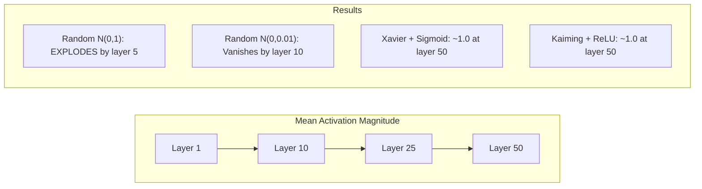
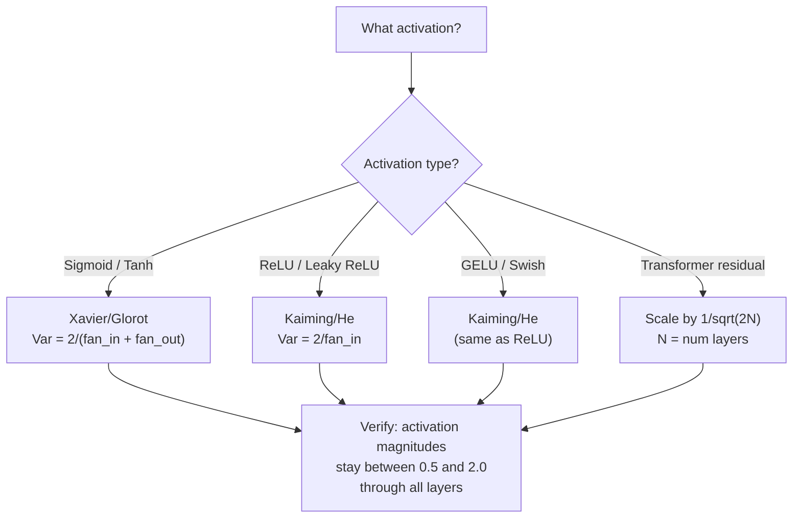

# वजन आरंभिकरण और प्रशिक्षण स्थिरता

> 50 स्तरों पर भी तीन स्तरों की तरह ही प्रशिक्षण शुरू हो सकता है।

**Type:** Build
**Languages:** Python
**Prerequisites:** Lesson 03.04 (Activation Functions), Lesson 03.07 (Regularization)
**Time:** ~90 minutes

## 学习目标
- 实现 शून्य、random、Xavier/Glorot 和 Kaiming/He आरंभिकरण 策略,并测量它们对50层中激活幅度的影响
- 推导为什么 Xavier init 使用 Var(w) = 2/(fan_in + fan_out), जबकि Kaiming उपयोग Var(w) = 2/fan_in
- 演示 शून्य आरंभिकता की सामीप्य  समस्या,并解释为什么仅靠随机尺度还不够
- 将正确的初始化 策略匹配到激活函数:sigmoid/tanh 使用 Xavier,ReLU/GELU 使用 Kaiming

## 问题
सभी भारों को शून्य में रखना है। प्रत्येक न्यूरॉन एक ही कार्य करता है, एक ही ग्रेडिएंट प्राप्त करता है, और एक ही तरीके से अपडेट करता है। 10,000 युगों के बाद, आपके 512 न्यूरॉन छिपे हुए परत अभी भी एक ही न्यूरॉन के 512 प्रतियां हैं।

उन्हें बहुत बड़ा प्रारंभ करें। सक्रियण पूरे नेटवर्क में विस्फोट करेंगे। परत 10 तक, संख्या 1e15 तक पहुंच जाएगी। परत 20 तक, वे अनंत हो जाएंगे।

मानक सामान्य वितरण के बीच यादृच्छिक प्रारम्भिककरण── 3 परतों पर प्रभावी── 50 परतों तक, संकेत शून्य तक संकुचित होता है, या अनंत तक विस्फोट होता है, यादृच्छिक पैमाने पर निर्भर करता है, या तो छोटा या छोटा बड़ा──能工作 और崩掉 के बीच की सीमा बेहद संकीर्ण है──

वजन आरंभिकरण गहन सीखने में सबसे कम मूल्यांकन किया गया निर्णय है। वास्तुकला में एक लेख होगा। अनुकूलक में एक ब्लॉग होगा। आरंभिकरण आमतौर पर केवल एक लेख प्राप्त होता है। लेकिन यदि यहाँ गलत है, तो बाकी सब कुछ मायने नहीं रखता है - आपका नेटवर्क प्रशिक्षण शुरू होने से पहले ही मर चुका है।

## 概念
### समरूपता समस्या

एक परत के मध्य प्रत्येक न्यूरॉन की संरचना समान हैः इनपुट, पूर्वाग्रह, अनुप्रयोग सक्रियण के साथ भारों का उपयोग करें। यदि सभी भार समान मूल्य से शुरू होते हैं, तो प्रत्येक न्यूरॉन एक ही आउटपुट का गणना करेगा।

आप पर कब्जा कर लिया गया है। नेटवर्क में सैकड़ों पैरामीटर हैं, लेकिन वे सभी एक साथ चल रहे हैं। इसे सममितता कहा जाता है, जबकि यादृच्छिक आरंभिकरण इसका प्रकोप करने का तरीका है। प्रत्येक न्यूरॉन वजन के स्थान के बीच अलग-अलग स्थान से शुरू होता है, इसलिए प्रत्येक न्यूरॉन अलग-अलग विशेषताएं सीखता है।

लेकिन यादृच्छिकता भी पर्याप्त नहीं है।

### परतों के माध्यम से भिन्नता फैलाना

考虑一个具有风扇_in 个输入的单个层:

```
z = w1*x1 + w2*x2 + ... + w_n*x_n
```

यदि प्रत्येक भार वियू भिन्नता के लिए Var(w) का वितरण से आते हैं, और प्रत्येक इनपुट xi के भिन्नता के लिए Var(x), तो आउटपुट भिन्नता के लिएः

```
Var(z) = fan_in * Var(w) * Var(x)
```

यदि Var(w) = 1 且 fan_in = 512, तो आउटपुट भिन्नता यानि इनपुट भिन्नता का 512 倍──经过 10 层:512^10 = 1.2e27── आपका सिग्नल 已爆炸──

यदि Var(w) = 0.001, तो आउटपुट वैरिएंस प्रत्येक स्तर पर 0.001 * 512 = 0.512 缩小──经过 10 层:0.512^10 = 0.00013── आपका संकेत 已消失──

目標:选择 Var(w), जिससे Var(z) = Var(x) ・・・सग्नल आयाम 在各层之间保持恒定──

### ज़ावियर/ग्लोरोट आरंभिकरण

Glorot and Bengio (2010) 推导了适用于 सिग्मोइड 和 टैन सक्रियण 的解──为了在前方和后方通过 中都保持变异 恒定:

```
Var(w) = 2 / (fan_in + fan_out)
```

实践中, वजन निम्नानुसार वितरण 中采样:

```
w ~ Uniform(-limit, limit)  where limit = sqrt(6 / (fan_in + fan_out))
```

या:

```
w ~ Normal(0, sqrt(2 / (fan_in + fan_out)))
```

यह इसलिए प्रभावी है, क्योंकि सिग्मोइड और टैन शून्य के निकट निकटता में है, जबकि सही प्रारंभिककरण के बाद सक्रियण इस क्षेत्र में ठीक है।

### कैमिंग/वह आरंभिकरण

ReLU 会杀杀一半输出(所有负都变成零) ・有效风扇_in 减半,因为平均来看一半输入被置零;;Xavier init 没有考虑这一点 -它低估了所需的变化──

He et al. (2015) 调整了公式:

```
Var(w) = 2 / fan_in
```

निम्नानुसार वितरण से वजन

```
w ~ Normal(0, sqrt(2 / fan_in))
```

2. उपयोग करने के लिए रिफंड करने के लिए RLU आधा सक्रियण 置零 प्रभाव                                                                                                                                                                                                                                                     

### ट्रांसफार्मर आरंभिकरण

जीपीटी-2 ने एक और मोड शुरू किया। शेष कनेक्शन प्रत्येक उप-परत के आउटपुट को इसके इनपुट तक बढ़ाएगाः

```
x = x + sublayer(x)
```

प्रत्येक चरण में वृद्धि होगी भिन्नता── N अवशिष्ट परतों के लिए, भिन्नता N के अनुसार होगी 成 अनुपात वृद्धि── GPT-2 会将残留层的重量 按1/sqrt(2N) 缩小, जिनमें से N 层数── यह संचित संकेत परिमाण 稳定── बनाए रख सकता है।

लामा 3 ((405B पैरामीटर,126 परतें) ने इसी तरह के कार्यक्रमों का उपयोग किया। यदि ऐसा संकुचन नहीं होता है, तो शेष प्रवाह में 126 परतों में होगा ध्यान तथा फ़ीड फॉरवर्ड ब्लॉक में वृद्धि होगी।

```mermaid
flowchart TD
    subgraph "Zero Init"
        Z1["Layer 1<br/>All weights = 0"] --> Z2["Layer 2<br/>All neurons identical"]
        Z2 --> Z3["Layer 3<br/>Still identical"]
        Z3 --> ZR["Result: 1 effective neuron<br/>regardless of width"]
    end

    subgraph "Xavier Init"
        X1["Layer 1<br/>Var = 2/(fan_in+fan_out)"] --> X2["Layer 2<br/>Signal stable"]
        X2 --> X3["Layer 50<br/>Signal stable"]
        X3 --> XR["Result: Trains with<br/>sigmoid/tanh"]
    end

    subgraph "Kaiming Init"
        K1["Layer 1<br/>Var = 2/fan_in"] --> K2["Layer 2<br/>Signal stable"]
        K2 --> K3["Layer 50<br/>Signal stable"]
        K3 --> KR["Result: Trains with<br/>ReLU/GELU"]
    end
```



### 50 स्तरों के माध्यम से सक्रियण परिमाण



### सही मन की चुनना




```figure
weight-init-variance
```

##  इसे निर्माण
### 步骤 1: प्रारंभ रणनीति

प्रारंभिक भार मैट्रिक्स के चार तरीके── प्रत्येक तरीके में एक सूची में लौटते हैं, जिसमें एक 2D मैट्रिक्स है, जिसमें फैन_इन 列 और फैन_आउट 行──

```python
import math
import random


def zero_init(fan_in, fan_out):
    return [[0.0 for _ in range(fan_in)] for _ in range(fan_out)]


def random_init(fan_in, fan_out, scale=1.0):
    return [[random.gauss(0, scale) for _ in range(fan_in)] for _ in range(fan_out)]


def xavier_init(fan_in, fan_out):
    std = math.sqrt(2.0 / (fan_in + fan_out))
    return [[random.gauss(0, std) for _ in range(fan_in)] for _ in range(fan_out)]


def kaiming_init(fan_in, fan_out):
    std = math.sqrt(2.0 / fan_in)
    return [[random.gauss(0, std) for _ in range(fan_in)] for _ in range(fan_out)]
```

### 步骤 2: सक्रियण कार्य

हमें प्रत्येक आरंभिक रणनीति और उसके अपेक्षित सक्रियण के साथ परीक्षण करने के लिए सिग्मोइड, टैन और रिलू की आवश्यकता है।

```python
def sigmoid(x):
    x = max(-500, min(500, x))
    return 1.0 / (1.0 + math.exp(-x))


def tanh_act(x):
    return math.tanh(x)


def relu(x):
    return max(0.0, x)
```

### 步骤 3: आगे 50 परतों के माध्यम से पारित

                                                                                                                                                                                                                                                              

```python
def forward_deep(init_fn, activation_fn, n_layers=50, width=64, n_samples=100):
    random.seed(42)
    layer_magnitudes = []

    inputs = [[random.gauss(0, 1) for _ in range(width)] for _ in range(n_samples)]

    for layer_idx in range(n_layers):
        weights = init_fn(width, width)
        biases = [0.0] * width

        new_inputs = []
        for sample in inputs:
            output = []
            for neuron_idx in range(width):
                z = sum(weights[neuron_idx][j] * sample[j] for j in range(width)) + biases[neuron_idx]
                output.append(activation_fn(z))
            new_inputs.append(output)
        inputs = new_inputs

        magnitudes = []
        for sample in inputs:
            magnitudes.append(sum(abs(v) for v in sample) / width)
        mean_mag = sum(magnitudes) / len(magnitudes)
        layer_magnitudes.append(mean_mag)

    return layer_magnitudes
```

### 步骤 4: प्रयोग

运行所有组合:शून्य init、random N(0,1)、random N(0,0.01)、Xavier के साथ सिग्मोइड、Xavier के साथ ताँह、Kaiming के साथ ReLU──打印关键层的大小──

```python
def run_experiment():
    configs = [
        ("Zero init + Sigmoid", lambda fi, fo: zero_init(fi, fo), sigmoid),
        ("Random N(0,1) + ReLU", lambda fi, fo: random_init(fi, fo, 1.0), relu),
        ("Random N(0,0.01) + ReLU", lambda fi, fo: random_init(fi, fo, 0.01), relu),
        ("Xavier + Sigmoid", xavier_init, sigmoid),
        ("Xavier + Tanh", xavier_init, tanh_act),
        ("Kaiming + ReLU", kaiming_init, relu),
    ]

    print(f"{'Strategy':<30} {'L1':>10} {'L5':>10} {'L10':>10} {'L25':>10} {'L50':>10}")
    print("-" * 80)

    for name, init_fn, act_fn in configs:
        mags = forward_deep(init_fn, act_fn)
        row = f"{name:<30}"
        for idx in [0, 4, 9, 24, 49]:
            val = mags[idx]
            if val > 1e6:
                row += f" {'EXPLODED':>10}"
            elif val < 1e-6:
                row += f" {'VANISHED':>10}"
            else:
                row += f" {val:>10.4f}"
        print(row)
```

### 步骤 5: सममिति प्रदर्शन

 शून्य प्रारंभ दिखाएँ पूरी तरह से एक ही न्यूरॉन्स उत्पन्न होगा

```python
def symmetry_demo():
    random.seed(42)
    weights = zero_init(2, 4)
    biases = [0.0] * 4

    inputs = [0.5, -0.3]
    outputs = []
    for neuron_idx in range(4):
        z = sum(weights[neuron_idx][j] * inputs[j] for j in range(2)) + biases[neuron_idx]
        outputs.append(sigmoid(z))

    print("\nSymmetry Demo (4 neurons, zero init):")
    for i, out in enumerate(outputs):
        print(f"  Neuron {i}: output = {out:.6f}")
    all_same = all(abs(outputs[i] - outputs[0]) < 1e-10 for i in range(len(outputs)))
    print(f"  All identical: {all_same}")
    print(f"  Effective parameters: 1 (not {len(weights) * len(weights[0])})")
```

### 步骤 6: परत-पर-परत परिमाण रिपोर्ट

印打激活大小在50层中可视化条形图──

```python
def magnitude_report(name, magnitudes):
    print(f"\n{name}:")
    for i, mag in enumerate(magnitudes):
        if i % 5 == 0 or i == len(magnitudes) - 1:
            if mag > 1e6:
                bar = "X" * 50 + " EXPLODED"
            elif mag < 1e-6:
                bar = "." + " VANISHED"
            else:
                bar_len = min(50, max(1, int(mag * 10)))
                bar = "#" * bar_len
            print(f"  Layer {i+1:3d}: {bar} ({mag:.6f})")
```

## इसका उपयोग करें
PyTorch इन इन के रूप में इनपुट फ़ंक्शन प्रदान करेगाः

```python
import torch
import torch.nn as nn

layer = nn.Linear(512, 256)

nn.init.xavier_uniform_(layer.weight)
nn.init.xavier_normal_(layer.weight)

nn.init.kaiming_uniform_(layer.weight, nonlinearity='relu')
nn.init.kaiming_normal_(layer.weight, nonlinearity='relu')

nn.init.zeros_(layer.bias)
```

जब आप调用 `nn.Linear(512, 256)`时,PyTorch 默认使用Kaiming वर्दी आरंभीकरण── यही कारण है कि अधिकांश सरल नेटवर्क बस काम--PyTorch 已经做了正确选择── लेकिन जब आप कस्टम आर्किटेक्चर बनाते हैं, या 20 से अधिक परतों में गहराई से प्रवेश करते हैं, तो आपको यह समझने की आवश्यकता होती है कि क्या हो रहा है, और संभवतः एक कवर करने की आवश्यकता होती है默认 सेटिंग──

 ट्रांसफार्मर के लिए, हगिंगफेस मॉडल आमतौर पर उनके बीच होते हैं `_init_weights`方法中处理初期化──GPT-2 का实现会按1/sqrt(N) 缩放残余投影── यदि आप शून्य से ट्रांसफार्मर का निर्माण शुरू करते हैं, तो आपको स्वयं इसे जोड़ना होगा──

## 交付 यह
本课会产出:
- `outputs/prompt-init-strategy.md`-- एक प्रयोग करने के लिए निदान वजन आरंभिकरण  समस्या并推正确策略的提示

## अभ्यास
1. 添加 LeCun आरंभीकरण(Var = 1/fan_in,为 SELU सक्रियण 设计) ・运行50-परत प्रयोग, LeCun init + tanh का उपयोग करें,并与Xavier + tanh对比──

2.  जीपीटी-2 अवशिष्ट स्केलिंग को प्राप्त करना: अवशिष्ट धारा में शामिल होने से पहले, प्रत्येक स्तर का उत्पादन  से गुणा करके 1/sqrt 2*N)  से अलग 50 स्तरों पर चलाया जाएगा, जिसमें स्केलिंग और बिना स्केलिंग के स्थिति में, अवशिष्ट परिमाण का मापन  तेजी से वृद्धि 

3.  एक "init स्वास्थ्य जांच"  फ़ंक्शन बनाएं, प्राप्त नेटवर्क के परत आयामों और सक्रियण प्रकार, फिर सही आरंभिकरण का सुझाव दें, और वर्तमान में init में समस्या का कारण बनेंगे चेतावनी दें

4. प्रयोग फैन_इन = 16 与 फैन_इन = 1024 运行实验──Xavier 和 Kaiming 会适配 फैन_इन, लेकिन यादृच्छिक init 不会── प्रदर्शन लेयर के साथ 变大,工作和断 के बीच अंतर कैसे बढ़े──

5. 实现 ऑर्थोगनल आरंभिकरण(एक यादृच्छिक मैट्रिक्स उत्पन्न करें, गणना इसकी SVD, ऑर्थोगनल मैट्रिक्स U) ⋅ का उपयोग करें 50 परतों के ReLU नेटवर्क के साथ काइमिंग 进行比较──

## 关键术语
| Term | What people say | What it actually means |
|------|----------------|----------------------|
| Weight initialization | “随机设置 starting weights” | 选择 initial weight values 的策略，它决定一个 network 是否有可能训练 |
| Symmetry breaking | “让 neurons 变得不同” | 使用 random initialization 确保 neurons 学习不同 features，而不是计算完全相同的函数 |
| Fan-in | “一个 neuron 的 inputs 数量” | incoming connections 的数量，它决定 input variance 如何在 weighted sum 中累积 |
| Fan-out | “一个 neuron 的 outputs 数量” | outgoing connections 的数量，与在 Backpropagation 期间维持 Gradient variance 有关 |
| Xavier/Glorot init | “sigmoid initialization” | Var(w) = 2/(fan_in + fan_out)，旨在通过 sigmoid 和 tanh activations 保持 variance |
| Kaiming/He init | “ReLU initialization” | Var(w) = 2/fan_in，考虑了 ReLU 会将一半 activations 置零 |
| Variance propagation | “signals 如何在 layers 中增长或缩小” | 基于 weight scale，逐层分析 activation variance 如何变化的数学分析 |
| Residual scaling | “GPT-2 的 init trick” | 将 residual connection weights 按 1/sqrt(2N) 缩放，以防止 variance 在 N 个 transformer layers 中增长 |
| Dead network | “什么都训练不了” | 一个因 initialization 不佳而导致所有 Gradients 为 zero 或所有 activations 饱和的 network |
| Exploding activations | “数值走向 infinity” | 当 weight variance 过高时，activation magnitudes 会在 layers 中指数级增长 |

## 延伸阅读
- ग्लोरोट और बेन्गियो, "गहरे फीडफॉरवर्ड तंत्रिका नेटवर्क को प्रशिक्षित करने की कठिनाई को समझना" (2010) -- 原始 论文,包含变化分析
- He et al., "डिफिंग डीप इन रिफिक्सर" (2015) -- ने ReLU नेटवर्क के लिए काइमिंग आरंभिकरण शुरू किया
- Radford et al., "भाषा मॉडल असुरक्षित मल्टीटास्क लर्निंगर्स हैं" (2019) -- GPT-2 论文, जिसमें अवशिष्ट स्केलिंग आरंभिकरण शामिल है
- मिश्किन और मतास, "All You Need is a Good Init" (2016) - परत-अनुक्रमिक इकाई-वियरिएंस आरंभिकरण, एक प्रकार के तुलनात्मक विश्लेषणात्मक सूत्र के अनुभव विकल्प
