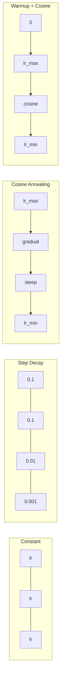
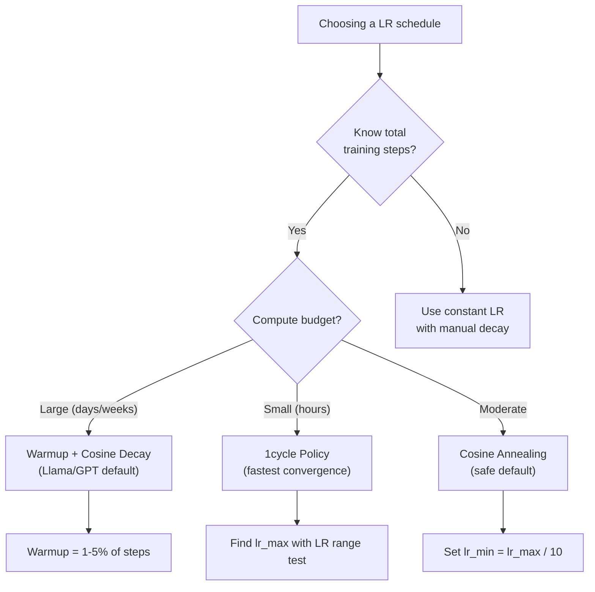
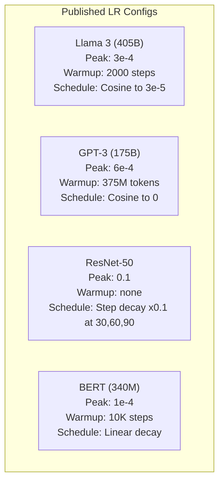

# सीखने की दर और वार्मअप

> सीखने की दर एक ही सबसे महत्वपूर्ण हाइपरमैटर है। वास्तुकला नहीं है। डेटासेट का आकार नहीं है। सक्रियण फ़ंक्शन नहीं है।

**类型：**构建
**语言：**पायथन
**先修：**पाठ 03.06 (अनुकूलन), पाठ 03.08 (वजन आरंभिकरण)
**时间：**≈ 90 मिनट

## 学习目标

- शून्य से निरंतर ̊ चरण क्षय ̊ कोसिन annealing ̊ वार्मअप + कोसिन तथा 1 चक्र सीखने की दर के कार्यक्रम प्राप्त करने
- 演示 सीखने की दर 选择的三种失败模式: विभेदन(过高) 、स्थिरता(过低) और कंपन(कोई गिरावट नहीं)
-  समझाएँ कि एडम आधारित ऑप्टिमाइज़र  वार्मअप की आवश्यकता क्यों है, और यह कैसे स्थिर प्रारंभिक प्रशिक्षण
- एक ही कार्य में सभी पांच प्रकार के कार्यक्रमों की तुलना करने की अभिसरण गति, और प्रशिक्षण बजट के लिए उपयुक्त कार्यक्रम का चयन

## 问题

 सीखने की दर  0.1  को सेट करें प्रशिक्षण भिन्न होगा  नुकसान 3 चरणों में कूदकर अनंत होगा  इसे 0.0001  को सेट करें प्रशिक्षण धीमा हो जाएगा  100 युगों के बाद, मॉडल  लगभग भी अपने आप में रुक जाएगा  इसे 0.01  को सेट करें प्रशिक्षण पहले 50 युगों में प्रभावी है, उसके बाद हानि  एक हमेशा के लिए अपर्याप्त न्यूनतम  के आसपास टहलता है, क्योंकि चरण बहुत बड़ा है 

प्रशिक्षण के दौरान यह बदलता रहता है। प्रारंभिक, आप बड़े पैमाने पर तेजी से कवर करने की जगह का उपयोग करना चाहते हैं। प्रशिक्षण के बाद, आप बहुत छोटे चरणों के साथ एक तेज न्यूनतम प्राप्त करना चाहते हैं।

过去三年发表的每个主流模型都使用了学习率时间表──Llama 3 使用了峰值 lr=3e-4,2000 个升温步骤,并通过了宇宙衰退 衰减到3e-5──GPT-3 使用了 lr=6e-4,并进行了375 मिलियन टोकन上升升温──这些不是随意选择──它们是耗资数百万美元的大规模超参数扫描的结果──

आपको शेड्यूल समझने की जरूरत है, क्योंकि डिफ़ॉल्ट मान आपके समस्या के लिए जरूरी नहीं है। जब आप एक पूर्व-प्रशिक्षित मॉडल को ठीक से ट्यून करते हैं, तो सही शेड्यूल शून्य से प्रशिक्षण से अलग होता है।

## 概念

### निरंतर सीखने की दर

सबसे सरल तरीका है-- एक संख्या चुनें, हर कदम पर इसका उपयोग करें।

```
lr(t) = lr_0
```

很少是最优的──它要么对训练末期来说太高 ((在最小的附近振荡),要么对训练初步来说太低 ((在小步上浪费计算) ──对小模型和调试来说也可以──对任何需要训练超过一小时的任务来说都是糟糕的选择──

### चरण क्षय

ResNet 时代 के पुराने तरीके से                                                                                                                                                                                                                                                           

```
lr(t) = lr_0 * gamma^(floor(epoch / step_size))
```

इनमें से गामा = 0.1 且 step_size = 30 表示:lr प्रत्येक 30 时代 降低 10x──ResNet-50 就使用了这个--lr=0.1,在30、60和90 时代降低 10x──

问题是:最优衰变 点取决于数据集和架构――换到另一个问题,就需要重新调调什么时降低――转变也很突然--当速度突然变时,Loss可能会峰――

### कॉसिन एनेलिंग

ानुसार कॉसिन 曲线, अधिकतम सीखने की दर से न्यूनतम मूल्य तक समतल गिरावटः

```
lr(t) = lr_min + 0.5 * (lr_max - lr_min) * (1 + cos(pi * t / T))
```

इनमें से t है वर्तमान चरण, T है सर्व चरण संख्या।

जब t=0 时,cosine 项为1,所以 lr = lr_max──当 t=T 时,cosine 项为 -1,所以 lr = lr_min──decay 一开始很平缓,中间加速,接近末尾时再次变得平缓──

यह अधिकांश आधुनिक प्रशिक्षण संचालन की एक मानक विकल्प है। इसके अलावा, lr_max और lr_min  के अलावा, कोई हाइपरपरपैरामीटर समायोजित करने की आवश्यकता नहीं है।

### क्यों करना चाहिए से छोटा शुरू

एडम और अन्य अनुकूलन अनुकूलक 会维护 ग्रेडिएंट औसत 和 भिन्नता के चल रहे अनुमानों── चरण 0 में, ये अनुमान शून्य के लिए आरंभ किए गए थे── प्रारंभिक कुछ ग्रेडिएंट अपडेट  बहुत खराब सांख्यिकी पर आधारित हैं── यदि आपकी सीखने की दर इस अवधि में बहुत बड़ी है, तो मॉडल बहुत बड़ा होगा और दिशा में खराब कदमों──

वार्मअप इस समस्या को ठीक कर सकता है। पहले एक बहुत ही छोटी सीखने की दर से शुरू होता है। आमतौर पर यह lr_max / वार्मअप_स्टेप्स, यहां तक कि शून्य के लिए भी होता है। और पहले N स्टेप्स के बीच रैखिक रूप से रैंप अप करके lr_max तक पहुंच जाता है।

```
lr(t) = lr_max * (t / warmup_steps)     for t < warmup_steps
```

典型 वार्मिंगः总训练步骤的1-5%──Llama 3 训练了约1.8 ट्रिलियन टोकन,并 वार्मिंग了2000 कदम──GPT-3 在375 मिलियन टोकन上进行了 वार्मिंग──

### रैखिक वार्मिंग + कोसिन क्षय

现代默认方案── पहले रैखिक रैंप अप, फिर कॉसिनस गिरावट के साथः

```
if t < warmup_steps:
    lr(t) = lr_max * (t / warmup_steps)
else:
    progress = (t - warmup_steps) / (total_steps - warmup_steps)
    lr(t) = lr_min + 0.5 * (lr_max - lr_min) * (1 + cos(pi * progress))
```

यही है लामा, जीपीटी, पॉलम तथा अधिकांश आधुनिक ट्रांसफार्मर का उपयोग करने का एक तरीका है।

### 1 चक्र नीति

लेस्ली स्मिथ की खोज (२०१८): प्रशिक्षण के पहले भाग में सीखने की दर को कम से उच्च स्तर तक बढ़ाएं, और फिर से निम्न स्तर पर।

理論是: उच्च सीखने की दर                                                                                                                                                                                                                                                           

```
Phase 1 (0 to T/2):    lr ramps from lr_max/25 to lr_max
Phase 2 (T/2 to T):    lr ramps from lr_max to lr_max/10000
```

स्थिर कम्प्यूटिंग बजट में नीचे, चक्र आमतौर पर कॉस्मीन एनेलिंग की तुलना में अधिक तेज़ होता है।

### अनुसूची 形状



### निर्णायक प्रक्रिया



### 已发表模型中的真实数值




```figure
lr-schedule
```

##  इसे निर्माण

### 步骤 1:अनुसूची कार्य

प्रत्येक कार्य  प्राप्त करने के लिए वर्तमान चरण,并返回 उस चरण की सीखने की दर 

```python
import math


def constant_schedule(step, lr=0.01, **kwargs):
    return lr


def step_decay_schedule(step, lr=0.1, step_size=100, gamma=0.1, **kwargs):
    return lr * (gamma ** (step // step_size))


def cosine_schedule(step, lr=0.01, total_steps=1000, lr_min=1e-5, **kwargs):
    if step >= total_steps:
        return lr_min
    return lr_min + 0.5 * (lr - lr_min) * (1 + math.cos(math.pi * step / total_steps))


def warmup_cosine_schedule(step, lr=0.01, total_steps=1000, warmup_steps=100, lr_min=1e-5, **kwargs):
    if total_steps <= warmup_steps:
        return lr * (step / max(warmup_steps, 1))
    if step < warmup_steps:
        return lr * step / warmup_steps
    progress = (step - warmup_steps) / (total_steps - warmup_steps)
    return lr_min + 0.5 * (lr - lr_min) * (1 + math.cos(math.pi * progress))


def one_cycle_schedule(step, lr=0.01, total_steps=1000, **kwargs):
    mid = max(total_steps // 2, 1)
    if step < mid:
        return (lr / 25) + (lr - lr / 25) * step / mid
    else:
        progress = (step - mid) / max(total_steps - mid, 1)
        return lr * (1 - progress) + (lr / 10000) * progress
```

### 步骤 2: सभी शेड्यूल को दृश्यमान बनाना

प्रिंट एक पाठ आधारित साजिश, प्रत्येक कार्यक्रम को दिखाएं प्रशिक्षण प्रक्रिया में परिवर्तन

```python
def visualize_schedule(name, schedule_fn, total_steps=500, **kwargs):
    steps = list(range(0, total_steps, total_steps // 20))
    if total_steps - 1 not in steps:
        steps.append(total_steps - 1)

    lrs = [schedule_fn(s, total_steps=total_steps, **kwargs) for s in steps]
    max_lr = max(lrs) if max(lrs) > 0 else 1.0

    print(f"\n{name}:")
    for s, lr_val in zip(steps, lrs):
        bar_len = int(lr_val / max_lr * 40)
        bar = "#" * bar_len
        print(f"  Step {s:4d}: lr={lr_val:.6f} {bar}")
```

### 步骤 3: प्रशिक्षण नेटवर्क

सर्कल डेटासेट में एक सरल दो-परत नेटवर्क का उपयोग करते हुए, पिछले कुछ कक्षाओं के समान, लेकिन इस बार हम कार्यक्रम को बदल दिया।

```python
import random


def sigmoid(x):
    x = max(-500, min(500, x))
    return 1.0 / (1.0 + math.exp(-x))


def relu(x):
    return max(0.0, x)


def relu_deriv(x):
    return 1.0 if x > 0 else 0.0


def make_circle_data(n=200, seed=42):
    random.seed(seed)
    data = []
    for _ in range(n):
        x = random.uniform(-2, 2)
        y = random.uniform(-2, 2)
        label = 1.0 if x * x + y * y < 1.5 else 0.0
        data.append(([x, y], label))
    return data


def train_with_schedule(schedule_fn, schedule_name, data, epochs=300, base_lr=0.05, **kwargs):
    random.seed(0)
    hidden_size = 8
    total_steps = epochs * len(data)

    std = math.sqrt(2.0 / 2)
    w1 = [[random.gauss(0, std) for _ in range(2)] for _ in range(hidden_size)]
    b1 = [0.0] * hidden_size
    w2 = [random.gauss(0, std) for _ in range(hidden_size)]
    b2 = 0.0

    step = 0
    epoch_losses = []

    for epoch in range(epochs):
        total_loss = 0
        correct = 0

        for x, target in data:
            lr = schedule_fn(step, lr=base_lr, total_steps=total_steps, **kwargs)

            z1 = []
            h = []
            for i in range(hidden_size):
                z = w1[i][0] * x[0] + w1[i][1] * x[1] + b1[i]
                z1.append(z)
                h.append(relu(z))

            z2 = sum(w2[i] * h[i] for i in range(hidden_size)) + b2
            out = sigmoid(z2)

            error = out - target
            d_out = error * out * (1 - out)

            for i in range(hidden_size):
                d_h = d_out * w2[i] * relu_deriv(z1[i])
                w2[i] -= lr * d_out * h[i]
                for j in range(2):
                    w1[i][j] -= lr * d_h * x[j]
                b1[i] -= lr * d_h
            b2 -= lr * d_out

            total_loss += (out - target) ** 2
            if (out >= 0.5) == (target >= 0.5):
                correct += 1
            step += 1

        avg_loss = total_loss / len(data)
        accuracy = correct / len(data) * 100
        epoch_losses.append(avg_loss)

    return epoch_losses
```

### 步骤 4: सभी अनुसूची की तुलना करें

प्रत्येक अनुसूची के साथ एक ही नेटवर्क को प्रशिक्षित करें, तथा अंतिम हानि और अभिसरण की तुलना करें।

```python
def compare_schedules(data):
    configs = [
        ("Constant", constant_schedule, {}),
        ("Step Decay", step_decay_schedule, {"step_size": 15000, "gamma": 0.1}),
        ("Cosine", cosine_schedule, {"lr_min": 1e-5}),
        ("Warmup+Cosine", warmup_cosine_schedule, {"warmup_steps": 3000, "lr_min": 1e-5}),
        ("1cycle", one_cycle_schedule, {}),
    ]

    print(f"\n{'Schedule':<20} {'Start Loss':>12} {'Mid Loss':>12} {'End Loss':>12} {'Best Loss':>12}")
    print("-" * 70)

    for name, schedule_fn, extra_kwargs in configs:
        losses = train_with_schedule(schedule_fn, name, data, epochs=300, base_lr=0.05, **extra_kwargs)
        mid_idx = len(losses) // 2
        best = min(losses)
        print(f"{name:<20} {losses[0]:>12.6f} {losses[mid_idx]:>12.6f} {losses[-1]:>12.6f} {best:>12.6f}")
```

### 步骤 5:LR 过高 vs 过低

演示三种失败模式:过高(विभेदन) 、过低(爬行) 和刚刚好──

```python
def lr_sensitivity(data):
    learning_rates = [1.0, 0.1, 0.01, 0.001, 0.0001]

    print("\nLR Sensitivity (constant schedule, 100 epochs):")
    print(f"  {'LR':>10} {'Start Loss':>12} {'End Loss':>12} {'Status':>15}")
    print("  " + "-" * 52)

    for lr in learning_rates:
        losses = train_with_schedule(constant_schedule, f"lr={lr}", data, epochs=100, base_lr=lr)
        start = losses[0]
        end = losses[-1]

        if end > start or math.isnan(end) or end > 1.0:
            status = "DIVERGED"
        elif end > start * 0.9:
            status = "BARELY MOVED"
        elif end < 0.15:
            status = "CONVERGED"
        else:
            status = "LEARNING"

        end_str = f"{end:.6f}" if not math.isnan(end) else "NaN"
        print(f"  {lr:>10.4f} {start:>12.6f} {end_str:>12} {status:>15}")
```

## इसका उपयोग करें

PyTorch में `torch.optim.lr_scheduler`इसमें अनुसूची प्रदान की गई हैः

```python
import torch
import torch.optim as optim
from torch.optim.lr_scheduler import CosineAnnealingLR, OneCycleLR, StepLR

model = nn.Sequential(nn.Linear(10, 64), nn.ReLU(), nn.Linear(64, 1))
optimizer = optim.Adam(model.parameters(), lr=3e-4)

scheduler = CosineAnnealingLR(optimizer, T_max=1000, eta_min=1e-5)

for step in range(1000):
    loss = train_step(model, optimizer)
    scheduler.step()
```

 वार्मिंग + कॉसिन के लिए, lambda शेड्यूलर का उपयोग करें, या HuggingFace का उपयोग करें `get_cosine_schedule_with_warmup`:

```python
from transformers import get_cosine_schedule_with_warmup

scheduler = get_cosine_schedule_with_warmup(
    optimizer,
    num_warmup_steps=2000,
    num_training_steps=100000,
)
```

HuggingFace फ़ंक्शन है अधिकांश Llama 和 GPT ठीक-ठीक स्क्रिप्ट्स 使用的方案──拿不准时,使用热升 + कोसिने,并将热升 设为总步骤的 3-5%── यह लगभग सभी स्थितियों में लागू होते हैं──

## 交付 यह

本课会产出:
- `outputs/prompt-lr-schedule-advisor.md`-- एक संकेत, आपके प्रशिक्षण सेटिंग के आधार पर प्रयोग करने के लिए अनुशंसित उपयुक्त सीखने की दर अनुसूची और हाइपरपरपैरामीटर

## अभ्यास

1. 实现 eksponential decay:lr(t) = lr_0 * गामा^t, जिसमें गामा = 0.999──

2. 实现学习率范围测试(Leslie Smith): प्रशिक्षण几百步,同时将 LR从1e-7指数增加到1――绘制损失对 LR──最优最大 LR 位于损失 开始增加之前──

3. प्रयोग वार्मअप + कॉसिन  प्रशिक्षण, लेकिन बदल वार्मअप 长度:总 कदम का 0%、1%、5%、10%、20%──

4. 实现带热启动的共体调节 (SGDR): प्रत्येक टी चरण में सीखने की दर को lr_max पर पुनर्स्थापित किया जाएगा, फिर फिर से गिरावट आएगी।

5. निर्माण एकअनुसूची सर्जन, निगरानी प्रशिक्षण हानि, और हानि 稳定时自动从暖化 转换到阴; यदि हानि पठार 太久,则降低 lr。

## 关键术语

| Term | 人们通常怎么说 | 它真正的含义 |
|------|----------------|----------------------|
| Learning rate | “model 学得有多快” | 用来乘以 Gradient、决定参数更新大小的标量 |
| Schedule | “随时间改变 LR” | 将 training step 映射到 learning rate 的 function，旨在优化 convergence |
| Warmup | “从小 LR 开始” | 在最初 N steps 中，将 LR 从接近零 linearly ramp 到目标值，以稳定 Optimizer 统计量 |
| Cosine annealing | “平滑 LR decay” | 在训练过程中，让 LR 按 cosine 曲线从 lr_max 降低到 lr_min |
| Step decay | “在 milestones 降低 LR” | 在固定 epoch intervals，将 LR 乘以一个因子（通常是 0.1） |
| 1cycle policy | “先上后下” | Leslie Smith 的方法：在单个 cycle 中将 LR 先 ramp up 再 ramp down，以获得更快 convergence |
| LR range test | “找到最佳 learning rate” | 在短时间训练中逐步增加 LR，以找到 Loss 开始 diverge 的数值 |
| Cosine with warm restarts | “重置并重复” | 周期性地将 LR 重置为 lr_max，并再次 decay（SGDR） |
| Eta min | “LR 的下限” | schedule 最终 decay 到的最小 learning rate |
| Peak learning rate | “最大 LR” | 训练过程中达到的最高 LR，通常出现在 warmup 之后 |

## 延伸阅读

- लोश्चिलोव और हटर, "एसजीडीआरः वार्म रिस्टार्ट्स के साथ स्टोकास्टिक ग्रेडिएंट डाउनसेंट" (2017) -- 引入了 कोसिन एनेलिंग 和 वार्म रिस्टार्ट्स
- स्मिथ, "सुपर-कन्वर्जेंसः बड़ी सीखने की दरों का उपयोग करके तंत्रिका नेटवर्क का बहुत तेज़ प्रशिक्षण" (2018) -- 1 चक्र नीति 论文
- Touvron et al., "Llama 2: ओपन फाउंडेशन और फाइन-ट्यून चैट मॉडल" (2023) -- 记录了大规模使用的暖化 + कॉसिन शेड्यूल
- Goyal et al., "सटीक, बड़े मिनी बैच SGD: प्रशिक्षण ImageNet 1 घंटे में" (2017) -- बड़े बैच प्रशिक्षण के रैखिक स्केलिंग नियम 和 वार्मअप
