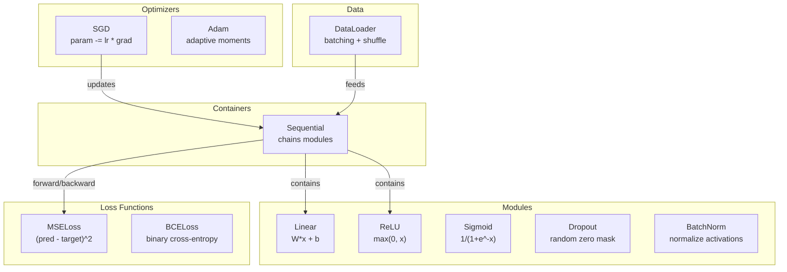
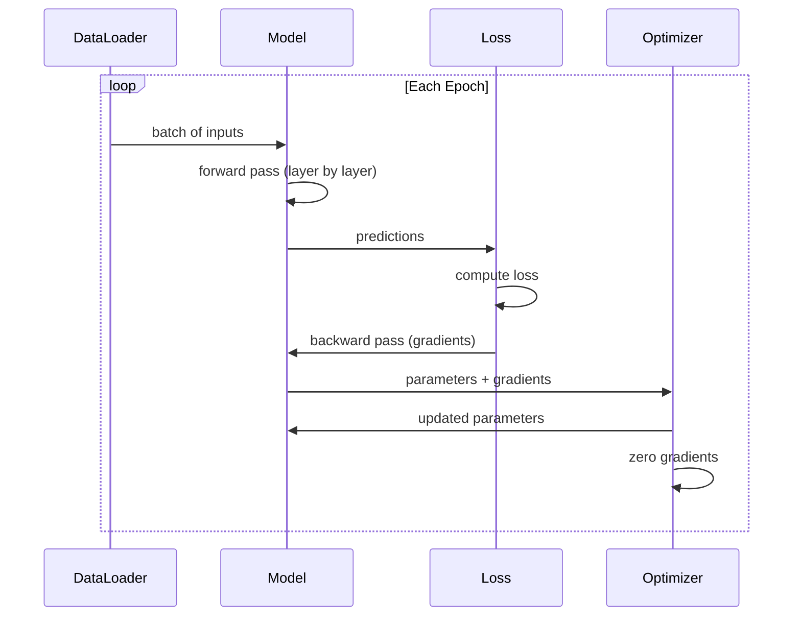
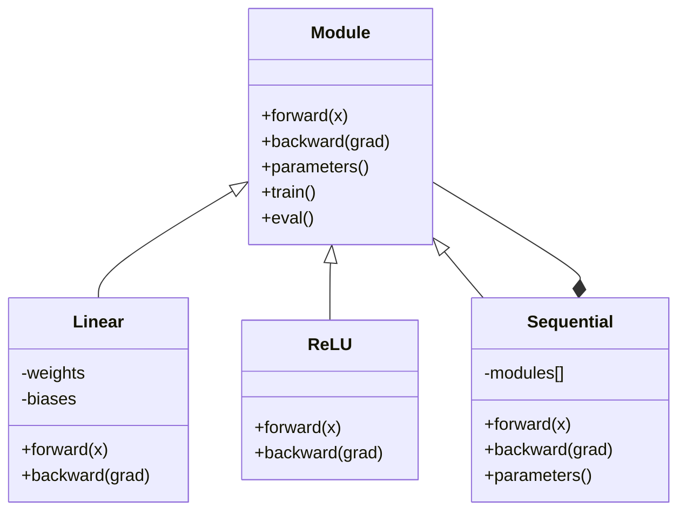

# अपने खुद के मिनी फ्रेमवर्क का निर्माण

> आप ने न्यूरॉन्स, परतों, नेटवर्क, बैकप्रॉप, सक्रियण, हानि फ़ंक्शन, ऑप्टिमाइज़र, विनियमन, आरंभिकरण और एलआर शेड्यूल बनाए हैं। वे सभी विखुरने वाले स्वतंत्र घटक हैं। अब उन्हें एक ढांचे में जोड़ें।

**类型:**构建
**语言:**पायथन
**前置知识:**चरण 03 全部内容(पाठ 01-09)
**时间:**~ 120 मिनट

## 学习目标

-  एक पूर्ण डीप लर्निंग फ्रेमवर्क का निर्माण करना (~ 500 行), जिसमें मॉड्यूल, रैखिक, रिलू, सिग्मोइड, ड्रॉपआउट, बैचनॉर्म, अनुक्रमिक, हानि फ़ंक्शन, ऑप्टिमाइज़र और डेटा लोडर शामिल हैं
- 解释 मॉड्यूल अपव्यय ((आगे, पीछे, पैरामीटर), तथा क्यों ट्रेन/ईवल मोड स्विच करना आवश्यक है
- सभी घटकों को एक कार्य करने योग्य प्रशिक्षण लूप में जोड़ना, सर्कल वर्गीकरण में उपयोग किया जाता है ऊपर एक 4-परत नेटवर्क का प्रशिक्षण
- अपने ढांचे के भीतर प्रत्येक घटक को प्रतिपादन के लिए मैगरेट करना PyTorch 等价物(nn.Module、nn.Sequential、optim.Adam、DataLoader)

## 问题

आपने विभिन्न दस्तावेजों में बिखरे हुए बिल्डिंग ब्लॉकों को 10 भागों में बनाया है।`Value`कक्षा में, वहाँ एक प्रशिक्षण लूप है, एक और फ़ाइल में वजन आरंभिकरण है, एक और फ़ाइल में सीखने की दर कार्यक्रम हैं। एक नेटवर्क को प्रशिक्षित करने के लिए, आपको पांच अलग-अलग पाठ्यक्रमों में चिपकने कोड को कॉपी करने की आवश्यकता है, फिर उन्हें हाथ से कनेक्ट करें।

यह समस्या को हल करने के लिए ढांचे है।`nn.Module``nn.Sequential``optim.Adam``DataLoader`, तथा इनका संयोजन करके उत्पन्न प्रशिक्षण लूप पैटर्न---TensorFlow  प्रदान `keras.Layer``keras.Sequential``keras.optimizers.Adam` ये सब जादू नहीं हैं ये संगठन के मॉडल हैं, जिससे आप नेटवर्क को परिभाषित, प्रशिक्षित और मूल्यांकन कर सकते हैं, बिना हर बार अंतर्निहित कनेक्टिविटी लॉजिक को फिर से विकसित करने की आवश्यकता है

आप लगभग 500 行 पायथन 构建 समान चीज़ों──无需 numpy──无需外部依赖── इस ढांचे को किसी भी फ़ीड फॉरवर्ड नेटवर्क, SGD या एडम 训练, डेटा के लिए बैचिंग, अनुप्रयोग ड्रॉपआउट और बैच सामान्यीकरण, किसी भी सक्रियण का उपयोग करके,并调度学习率── परिभाषित किया जा सकता है।

完成后,你会准确理解在 PyTorch 中写下 `model = nn.Sequential(...)`जब कुछ हुआ है, तो आप समझेंगे कि यह क्यों है।`model.train()`和 `model.eval()`आप समझेंगे क्यों `optimizer.zero_grad()`यह एक अलग तरीका है. आप इन सब को समझेंगे. क्योंकि ये आपके द्वारा बनाए गए हैं.

## 核心概念

### मॉड्यूल अपव्यय

PyTorch के भीतर प्रत्येक परत अपने आप को विरासत में मिला है`nn.Module`◊ एक मॉड्यूल है तीन जिम्मेदारियां:

1. **forward()**-- 给定输入,计算输出
2. **parameters()**-- 返回所有可训练体重
3. **backward()**-- 计算 gradients(在 PyTorch 中由自动级 处理, हमारे ढांचे में स्पष्ट रूप से कार्यान्वयन)

रैखिक परत एक मॉड्यूल है。 RELU सक्रियण एक मॉड्यूल है。 ड्रॉपआउट परत एक मॉड्यूल है。 बैच सामान्यीकरण परत भी एक मॉड्यूल है。 उनमें एक ही इंटरफ़ेस है。

### अनुक्रमिक कंटेनर

`nn.Sequential`会串联模块──前传:让数据依次通过模块1、模块2、模块3──后传:反向遍历这条链──容器 本身也是一个模块--它有前传() 参数() 和后传()──这是复合模式:一串模块 本身也是一个模块──

### 训练 vs मूल्यांकन 模式

प्रशिक्षण में ड्रॉपअप में न्यूरॉन्स                                                                                                                                                                                                                                                          `train()`和 `eval()`प्रत्येक मॉड्यूल में एक है।`training`ध्वज

### अनुकूलन

अनुकूलक प्रयोग करें पैरामीटर के ग्रेडिएंट्स उन्हें अद्यतन करना.`param -= lr * grad`✿आदम:维护 गति और भिन्नता अनुमान, फिर अद्यतन किया जाए──अनुकूलनकर्ता को नेटवर्क वास्तुकला जानने की आवश्यकता नहीं है - यह केवल एक 平的参数 列表 और उसके ग्रेडिएंट्स को देखता है──

### डेटा लोडर

बैचिंग  बहुत महत्वपूर्ण है, दो कारण हैं। पहला, बड़ी समस्याओं के लिए, आप पूरे डेटासेट को याद रखने में असमर्थ हैं। दूसरा, मिनी-बैच ग्रेडिएंट ड्रेसेंस  ने स्थानीय न्यूनतम से बचने में मदद करने के लिए शोर प्रदान किया है।

### फ्रेमवर्क आर्किटेक्चर



### प्रशिक्षण लूप



### मॉड्यूल पदानुक्रम




```figure
gradient-clipping
```

##  इसे निर्माण

### 步骤 1: मॉड्यूल बेस क्लास

प्रत्येक परत को एक अमूर्त इंटरफ़ेस प्राप्त करना होगा।

```python
class Module:
    def __init__(self):
        self.training = True

    def forward(self, x):
        raise NotImplementedError

    def backward(self, grad):
        raise NotImplementedError

    def parameters(self):
        return []

    def train(self):
        self.training = True

    def eval(self):
        self.training = False
```

### 步骤 2: रैखिक परत

                                                                                                                                                                                                                                                              

```python
import math
import random


class Linear(Module):
    def __init__(self, fan_in, fan_out):
        super().__init__()
        std = math.sqrt(2.0 / fan_in)
        self.weights = [[random.gauss(0, std) for _ in range(fan_in)] for _ in range(fan_out)]
        self.biases = [0.0] * fan_out
        self.weight_grads = [[0.0] * fan_in for _ in range(fan_out)]
        self.bias_grads = [0.0] * fan_out
        self.fan_in = fan_in
        self.fan_out = fan_out
        self.input = None

    def forward(self, x):
        self.input = x
        output = []
        for i in range(self.fan_out):
            val = self.biases[i]
            for j in range(self.fan_in):
                val += self.weights[i][j] * x[j]
            output.append(val)
        return output

    def backward(self, grad):
        input_grad = [0.0] * self.fan_in
        for i in range(self.fan_out):
            self.bias_grads[i] += grad[i]
            for j in range(self.fan_in):
                self.weight_grads[i][j] += grad[i] * self.input[j]
                input_grad[j] += grad[i] * self.weights[i][j]
        return input_grad

    def parameters(self):
        params = []
        for i in range(self.fan_out):
            for j in range(self.fan_in):
                params.append((self.weights, i, j, self.weight_grads))
            params.append((self.biases, i, None, self.bias_grads))
        return params
```

### 步骤 3: सक्रियण मॉड्यूल

RELU、Sigmoid 和 Tanh 实现为模块──每个都会缓存后转传输所需内容──

```python
class ReLU(Module):
    def __init__(self):
        super().__init__()
        self.mask = None

    def forward(self, x):
        self.mask = [1.0 if v > 0 else 0.0 for v in x]
        return [max(0.0, v) for v in x]

    def backward(self, grad):
        return [g * m for g, m in zip(grad, self.mask)]


class Sigmoid(Module):
    def __init__(self):
        super().__init__()
        self.output = None

    def forward(self, x):
        self.output = []
        for v in x:
            v = max(-500, min(500, v))
            self.output.append(1.0 / (1.0 + math.exp(-v)))
        return self.output

    def backward(self, grad):
        return [g * o * (1 - o) for g, o in zip(grad, self.output)]


class Tanh(Module):
    def __init__(self):
        super().__init__()
        self.output = None

    def forward(self, x):
        self.output = [math.tanh(v) for v in x]
        return self.output

    def backward(self, grad):
        return [g * (1 - o * o) for g, o in zip(grad, self.output)]
```

### 步骤 4: ड्रॉप आउट मॉड्यूल

 प्रशिक्षण समय में  तत्व को                                                                                                                                                                                                                                                           

```python
class Dropout(Module):
    def __init__(self, p=0.5):
        super().__init__()
        self.p = p
        self.mask = None

    def forward(self, x):
        if not self.training:
            return x
        self.mask = [0.0 if random.random() < self.p else 1.0 / (1 - self.p) for _ in x]
        return [v * m for v, m in zip(x, self.mask)]

    def backward(self, grad):
        if self.mask is None:
            return grad
        return [g * m for g, m in zip(grad, self.mask)]
```

### 步骤 5: बैचनोर्म मॉड्यूल

按功能 在批量上将激活 归一化为零 mean 和 इकाई भिन्नता──为 eval मोड 维护运行统计──

```python
class BatchNorm(Module):
    def __init__(self, size, momentum=0.1, eps=1e-5):
        super().__init__()
        self.size = size
        self.gamma = [1.0] * size
        self.beta = [0.0] * size
        self.gamma_grads = [0.0] * size
        self.beta_grads = [0.0] * size
        self.running_mean = [0.0] * size
        self.running_var = [1.0] * size
        self.momentum = momentum
        self.eps = eps
        self.x_norm = None
        self.std_inv = None
        self.batch_input = None

    def forward_batch(self, batch):
        batch_size = len(batch)
        output_batch = []

        if self.training:
            mean = [0.0] * self.size
            for sample in batch:
                for j in range(self.size):
                    mean[j] += sample[j]
            mean = [m / batch_size for m in mean]

            var = [0.0] * self.size
            for sample in batch:
                for j in range(self.size):
                    var[j] += (sample[j] - mean[j]) ** 2
            var = [v / batch_size for v in var]

            self.std_inv = [1.0 / math.sqrt(v + self.eps) for v in var]

            self.x_norm = []
            self.batch_input = batch
            for sample in batch:
                normed = [(sample[j] - mean[j]) * self.std_inv[j] for j in range(self.size)]
                self.x_norm.append(normed)
                output = [self.gamma[j] * normed[j] + self.beta[j] for j in range(self.size)]
                output_batch.append(output)

            for j in range(self.size):
                self.running_mean[j] = (1 - self.momentum) * self.running_mean[j] + self.momentum * mean[j]
                self.running_var[j] = (1 - self.momentum) * self.running_var[j] + self.momentum * var[j]
        else:
            std_inv = [1.0 / math.sqrt(v + self.eps) for v in self.running_var]
            for sample in batch:
                normed = [(sample[j] - self.running_mean[j]) * std_inv[j] for j in range(self.size)]
                output = [self.gamma[j] * normed[j] + self.beta[j] for j in range(self.size)]
                output_batch.append(output)

        return output_batch

    def forward(self, x):
        result = self.forward_batch([x])
        return result[0]

    def backward(self, grad):
        if self.x_norm is None:
            return grad
        for j in range(self.size):
            self.gamma_grads[j] += self.x_norm[0][j] * grad[j]
            self.beta_grads[j] += grad[j]
        return [grad[j] * self.gamma[j] * self.std_inv[j] for j in range(self.size)]

    def parameters(self):
        params = []
        for j in range(self.size):
            params.append((self.gamma, j, None, self.gamma_grads))
            params.append((self.beta, j, None, self.beta_grads))
        return params
```

### 步骤 6: अनुक्रमिक कंटेनर

串联模块──前进从左到右,后退从右到左──

```python
class Sequential(Module):
    def __init__(self, *modules):
        super().__init__()
        self.modules = list(modules)

    def forward(self, x):
        for module in self.modules:
            x = module.forward(x)
        return x

    def backward(self, grad):
        for module in reversed(self.modules):
            grad = module.backward(grad)
        return grad

    def parameters(self):
        params = []
        for module in self.modules:
            params.extend(module.parameters())
        return params

    def train(self):
        self.training = True
        for module in self.modules:
            module.train()

    def eval(self):
        self.training = False
        for module in self.modules:
            module.eval()
```

### 步骤 7: हानि कार्य

MSE 和 द्विआधारी क्रॉस-एंट्रोपी── प्रत्येक व्यक्ति हानि मूल्य वापस करता है,并提供一个倒退的) 返回渐进的

```python
class MSELoss:
    def __call__(self, predicted, target):
        self.predicted = predicted
        self.target = target
        n = len(predicted)
        self.loss = sum((p - t) ** 2 for p, t in zip(predicted, target)) / n
        return self.loss

    def backward(self):
        n = len(self.predicted)
        return [2 * (p - t) / n for p, t in zip(self.predicted, self.target)]


class BCELoss:
    def __call__(self, predicted, target):
        self.predicted = predicted
        self.target = target
        eps = 1e-7
        n = len(predicted)
        self.loss = 0
        for p, t in zip(predicted, target):
            p = max(eps, min(1 - eps, p))
            self.loss += -(t * math.log(p) + (1 - t) * math.log(1 - p))
        self.loss /= n
        return self.loss

    def backward(self):
        eps = 1e-7
        n = len(self.predicted)
        grads = []
        for p, t in zip(self.predicted, self.target):
            p = max(eps, min(1 - eps, p))
            grads.append((-t / p + (1 - t) / (1 - p)) / n)
        return grads
```

### 步骤 8: एसजीडी और एडम अनुकूलक

两者都接收参数列表,并使用梯度 更新重量──

```python
class SGD:
    def __init__(self, parameters, lr=0.01):
        self.params = parameters
        self.lr = lr

    def step(self):
        for container, i, j, grad_container in self.params:
            if j is not None:
                container[i][j] -= self.lr * grad_container[i][j]
            else:
                container[i] -= self.lr * grad_container[i]

    def zero_grad(self):
        for container, i, j, grad_container in self.params:
            if j is not None:
                grad_container[i][j] = 0.0
            else:
                grad_container[i] = 0.0


class Adam:
    def __init__(self, parameters, lr=0.001, beta1=0.9, beta2=0.999, eps=1e-8):
        self.params = parameters
        self.lr = lr
        self.beta1 = beta1
        self.beta2 = beta2
        self.eps = eps
        self.t = 0
        self.m = [0.0] * len(parameters)
        self.v = [0.0] * len(parameters)

    def step(self):
        self.t += 1
        for idx, (container, i, j, grad_container) in enumerate(self.params):
            if j is not None:
                g = grad_container[i][j]
            else:
                g = grad_container[i]

            self.m[idx] = self.beta1 * self.m[idx] + (1 - self.beta1) * g
            self.v[idx] = self.beta2 * self.v[idx] + (1 - self.beta2) * g * g

            m_hat = self.m[idx] / (1 - self.beta1 ** self.t)
            v_hat = self.v[idx] / (1 - self.beta2 ** self.t)

            update = self.lr * m_hat / (math.sqrt(v_hat) + self.eps)

            if j is not None:
                container[i][j] -= update
            else:
                container[i] -= update

    def zero_grad(self):
        for container, i, j, grad_container in self.params:
            if j is not None:
                grad_container[i][j] = 0.0
            else:
                grad_container[i] = 0.0
```

### 步骤 9: डेटा लोडर

 डेटा  को  बैचों में विभाजित करें,并可选择在每时代中混动──

```python
class DataLoader:
    def __init__(self, data, batch_size=32, shuffle=True):
        self.data = data
        self.batch_size = batch_size
        self.shuffle = shuffle

    def __iter__(self):
        indices = list(range(len(self.data)))
        if self.shuffle:
            random.shuffle(indices)
        for start in range(0, len(indices), self.batch_size):
            batch_indices = indices[start:start + self.batch_size]
            batch = [self.data[i] for i in batch_indices]
            inputs = [item[0] for item in batch]
            targets = [item[1] for item in batch]
            yield inputs, targets

    def __len__(self):
        return (len(self.data) + self.batch_size - 1) // self.batch_size
```

### 第 10 步: में सर्कल वर्गीकरण 上 प्रशिक्षण 4-परत नेटवर्क

सभी चीजों को जोड़ें, मॉडल परिभाषित करें, हानि फ़ंक्शन चुनें, अनुकूलन चुनें, प्रशिक्षण लूप चलाएं

```python
def make_circle_data(n=500, seed=42):
    random.seed(seed)
    data = []
    for _ in range(n):
        x = random.uniform(-2, 2)
        y = random.uniform(-2, 2)
        label = 1.0 if x * x + y * y < 1.5 else 0.0
        data.append(([x, y], [label]))
    return data


def train():
    random.seed(42)

    model = Sequential(
        Linear(2, 16),
        ReLU(),
        Linear(16, 16),
        ReLU(),
        Linear(16, 8),
        ReLU(),
        Linear(8, 1),
        Sigmoid(),
    )

    criterion = BCELoss()
    optimizer = Adam(model.parameters(), lr=0.01)

    data = make_circle_data(500)
    split = int(len(data) * 0.8)
    train_data = data[:split]
    test_data = data[split:]

    loader = DataLoader(train_data, batch_size=16, shuffle=True)

    model.train()

    for epoch in range(100):
        total_loss = 0
        total_correct = 0
        total_samples = 0

        for batch_inputs, batch_targets in loader:
            batch_loss = 0
            for x, t in zip(batch_inputs, batch_targets):
                pred = model.forward(x)
                loss = criterion(pred, t)
                batch_loss += loss

                optimizer.zero_grad()
                grad = criterion.backward()
                model.backward(grad)
                optimizer.step()

                predicted_class = 1.0 if pred[0] >= 0.5 else 0.0
                if predicted_class == t[0]:
                    total_correct += 1
                total_samples += 1

            total_loss += batch_loss

        avg_loss = total_loss / total_samples
        accuracy = total_correct / total_samples * 100

        if epoch % 10 == 0 or epoch == 99:
            print(f"Epoch {epoch:3d} | Loss: {avg_loss:.6f} | Train Accuracy: {accuracy:.1f}%")

    model.eval()
    correct = 0
    for x, t in test_data:
        pred = model.forward(x)
        predicted_class = 1.0 if pred[0] >= 0.5 else 0.0
        if predicted_class == t[0]:
            correct += 1
    test_accuracy = correct / len(test_data) * 100
    print(f"\nTest Accuracy: {test_accuracy:.1f}% ({correct}/{len(test_data)})")

    return model, test_accuracy
```

## इसका उपयोग करें

नीचे आपके द्वारा बनाई गई सामग्री का PyTorch और अन्य संस्करण हैः

```python
import torch
import torch.nn as nn
from torch.utils.data import DataLoader, TensorDataset

model = nn.Sequential(
    nn.Linear(2, 16),
    nn.ReLU(),
    nn.Linear(16, 16),
    nn.ReLU(),
    nn.Linear(16, 8),
    nn.ReLU(),
    nn.Linear(8, 1),
    nn.Sigmoid(),
)

criterion = nn.BCELoss()
optimizer = torch.optim.Adam(model.parameters(), lr=0.01)

for epoch in range(100):
    model.train()
    for inputs, targets in dataloader:
        optimizer.zero_grad()
        predictions = model(inputs)
        loss = criterion(predictions, targets)
        loss.backward()
        optimizer.step()

    model.eval()
    with torch.no_grad():
        test_predictions = model(test_inputs)
```

 संरचना पूरी तरह से संगत है।`Sequential``Linear``ReLU``Sigmoid``BCELoss``Adam``zero_grad``backward``step``train``eval` प्रत्येक अवधारणा एक है ️️️️️️️️️️️️️️️️️️️️️️️️️️️️️️️️️️️️️️️️️️️️️️️️️️️️️️️️️️️️️️️️️️️️️️️️️️️️️️️️️️️️️️️️️️️️️️️️️️️️️️️️️️️️️️️️️️️️️️️️️️️️️️️️️️️️️️️️️️️️️️️️️️️️️️️️️️️️️️️️️️️️️️️️️️️️️️️️️️️️️️️️️️️️️️️️️️️️️️️️️️️️️️️️️️️️️️️️️️️️️️️️️️️️️️️️️️️️️️️️️️️️️️️️️️️️️️️️️️️️️️️️️️️️️️️️️️️️️️️️️️️️️️️️️️️️️️️️️️️️️️️️️️️️️️️️️️️️️️️️️️️️️️️️️️️️️️️️️️️️️️️️️️️️️️️️️️️️️️️️️️️️️️️️️️️️️️️️️️️️️️️️️️️️️️️️️️️️️️️️️️️️️️️️️️️️️️️️️️️️️️️️️️️️️️️️️️️️️️️️️️️️️️️️️️️️️️️️️️️️️️️️️️️️️️️️️️️️️️️️️️️️️️️️️️️️️️️️️️️️️️

अब, जब आप PyTorch कोड देखते हैं, आप निश्चित रूप से जानते हैं कि हर पंक्ति में क्या हो रहा है।

## 交付内容

本课会产出:
- `outputs/prompt-framework-architect.md`-- एक के लिए उपयोग किया जाता है फ्रेमवर्क अमूर्तियों  डिजाइन तंत्रिका नेटवर्क वास्तुकला का संकेत

## अभ्यास

1. बहु-वर्ग वर्गीकरण 添加一个 `SoftmaxCrossEntropyLoss`वर्ग── प्रति भविष्यवाणियों को करना softmax, गणना क्रॉस-एंट्रोपी हानि,并处理组合后的倒退通过──在一个3级螺旋数据集上测试它──

2. में अनुकूलक में सीखने की दर अनुसूची को प्राप्त करने के लिएः जोड़ना एक `set_lr()`विधि,并接入 पाठ 09 中的 कॉस्मीन शेड्यूल── उपयोग गरम + कॉस्मीन 训练圈 वर्गीकरण,并与恒例 LR对比──

3.  为 क्रमबद्ध 添加 `save()`和 `load()`विधि, सभी वजन 序列化  JSON 文件,并重新加载──验证加载后的模型与原始模型 产生相同的预测──

4. में एडम अनुकूलक में वजन घटाने को प्राप्त करना ((L2 नियमितता) 🔥添加一个 `weight_decay`पैरामीटर, वजन को प्रत्येक चरण में शून्य की ओर संकुचित करते हुए दिखाता है।

5. वास्तविक मिनी बैच ग्रेडिएंट संचय  प्रति नमूना प्रशिक्षण लूप बदलें: एक बैच के सभी नमूनों में ऊपर जमा ग्रेडिएंट, फिर बैच आकार में विभाजित, फिर से एक बार अनुकूलन चरण को निष्पादित करें।

## 关键术语

| Term | 人们通常怎么说 | 它真正的含义 |
|------|----------------|----------------------|
| Module | “一个 layer” | framework 中的基础 abstraction -- 任何具有 forward()、backward() 和 parameters() 的东西 |
| Sequential | “按顺序堆叠 layers” | 一个串联 modules 的 container，在 forward 时按顺序应用，在 backward 时反向应用 |
| Forward pass | “运行 network” | 按顺序让 input 通过每个 module 来计算 output |
| Backward pass | “计算 gradients” | 将 Loss Gradient Backpropagation通过每个 module，以计算 parameter gradients |
| Parameters | “可训练 weights” | network 中 Optimizer 可以更新的所有值 -- weights 和 biases |
| Optimizer | “更新 weights 的东西” | 一种使用 gradients 更新 parameters 的算法，实现 SGD、Adam 或其他规则 |
| DataLoader | “喂 data 的东西” | 一个 iterator，将 dataset 切分为 batches，并可选择在 epochs 之间 shuffle |
| Training mode | “model.train()” | 一个启用 stochastic 行为的 flag，例如 dropout，以及使用 batch stats 的 batch normalization |
| Evaluation mode | “model.eval()” | 一个禁用 dropout 并让 batch normalization 使用 running statistics 的 flag |
| Zero grad | “清空 gradients” | 在计算下一个 batch 的 gradients 之前，将所有 parameter gradients 重置为零 |

## 延伸阅读

- Paszke et al., "PyTorch: एक अनिवार्य शैली, उच्च प्रदर्शन गहरी शिक्षा पुस्तकालय" (2019) -- 描述 PyTorch 设计决策的论文
- Chollet, "पायथन के साथ गहरी शिक्षा, दूसरा संस्करण" (2021) -- अध्याय 3 介绍 केरास आंतरिक, उपयोग समान मॉड्यूल/परत अमूर्त
- जॉनसन, "टिनी-डीएनएन" (https://github.com/tiny-dnn/tiny-dnn) -- एक हेडर-केवल सी ++ डीप लर्निंग फ्रेमवर्क, फ्रेमवर्क के आंतरिक को समझने के लिए उपयोग किया जाता है
