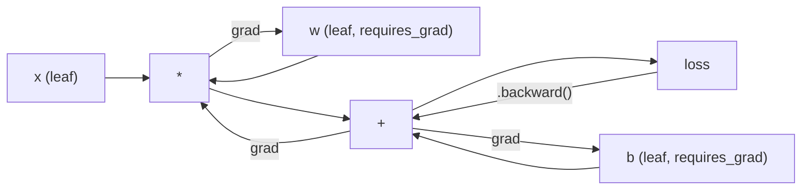
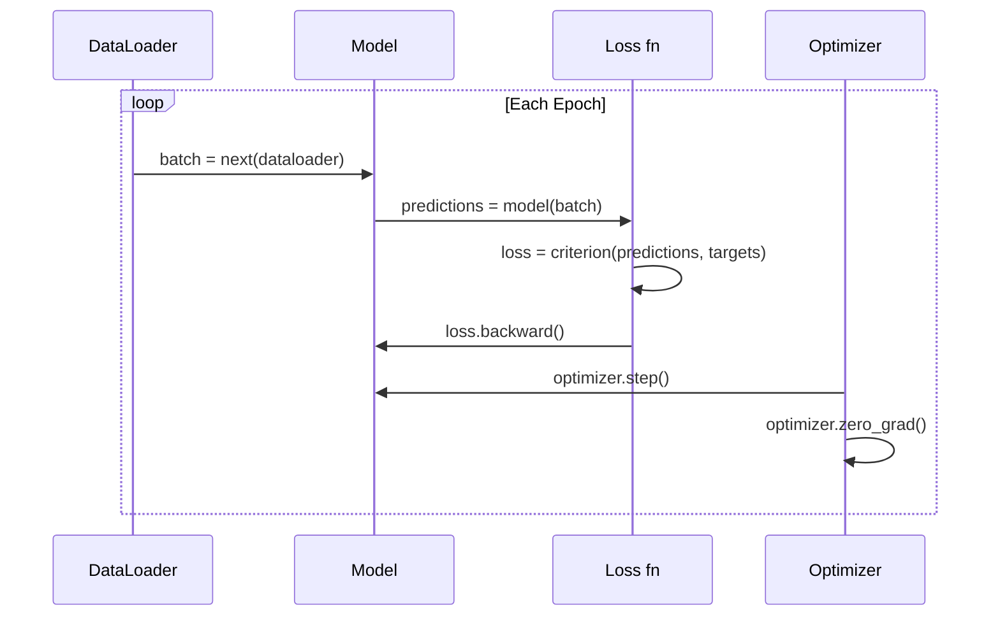

# पिटर्च प्रवेश

> तुम ने एक इंजन बनाया है, जो कि जीवन और संगीत के साथ आता है।

**Type:** Build
**Languages:** Python
**Prerequisites:** Lesson 03.10 (Build Your Own Mini Framework)
**Time:** ~75 minutes

## 学习目标
- PyTorch का प्रयोग nn.Module、nn.Sequential 和 autograd 构建并训练 तंत्रिका नेटवर्क
- उपयोग PyTorch Tensor、GPU 加速,以及标准训练循环(0_grad、forward、loss、backward、step)
- अपने को शून्य से प्राप्त करने के लिए एक मिनी फ्रेमवर्क  घटक को प्रतिरोधी PyTorch आदि के लिए परिवर्तित करना
- एक ही कार्य पर प्रोफ़ाइल और PyTorch के प्रशिक्षण गति के साथ अपने शुद्ध पायथन ढांचे की तुलना

## 问题
आपके पास एक काम करने योग्य मिनी फ्रेमवर्क है। रैखिक परतें, RELU, ड्रॉपआउट, बैच मानदंड, एडम, एक डेटा लोडर, एक प्रशिक्षण चक्र। यह शुद्ध पायथन का उपयोग करके गोल वर्गीकरण के मुद्दे पर एक 4-परत नेटवर्क का प्रशिक्षण कर सकता है।

लेकिन एक ही समस्या पर, यह भी PyTorch से 500 गुना धीमा है।

आपका मिनी फ्रेमवर्क एक नमूना को संसाधित करने के लिए एक बार पायथन के लिए एक ही ऑपरेशन को विभाजित करेगा। पायटॉर्च एक ही ऑपरेशन को अनुकूलित सी ++ / सीयूडीए कर्नल को वितरित करेगा और GPU पर काम करेगा। एक एकल ब्लॉक NVIDIA A100 पर, पायटॉर्च एक ResNet-50 को प्रशिक्षित करेगा।

速度不是唯一差距──你的框架 没有GPU 支持──没有自动区分你为每个模块写回来了()──没有序列化──没有分布式训练──没有混合精度──除了打印 语句外,没有办法调试渐进流──

PyTorch  ने इन सभी कमियों को भर दिया है। इसके अलावा यह आपके द्वारा बनाए गए एक ही मानसिक मॉडल को बरकरार रखता हैः मॉड्यूल, फॉरवर्ड, पैरामीटर, बैकवर्ड, ऑप्टिमाइज़र, स्टेप, अवधारणा एक ही है।

## 概念
### क्यों पायटॉर्च ने जीत हासिल की

2015 साल, TensorFlow  require आप in running any content पहले एक स्थिर गणना ग्राफ को परिभाषित करें──आप ग्राफ का निर्माण करें, इसे संकलन करें, फिर डेटा भेजें──debug अर्थ  on ग्राफ विज़ुअलाइज़ेशन── संशोधन वास्तुकला अर्थ  से शून्य पुनः निर्माण ग्राफ──

PyTorch 2017 में प्रकाशित, विभिन्न विचारों को अपनाया गयाः तीव्र निष्पादन।`y = model(x)`会真的立刻计算 y, बजाय 给稍后才会计算 y 的图 添加一个节点──这意味着标准 Python डिबगिंग 工具都能工作──print() 能工作──pdb 能工作──前进通过 里 if/else 能工作──

2020 तक, बाजार ने जवाब दिया है। एमएल शोध पत्रों में पाइटॉर्च का हिस्सा 7% से 2017 तक बढ़कर 75% से अधिक हो गया है।

इस वर्ग का मुख्य बिंदुः डेवलपर अनुभव में वृद्धि होगी। एक धीमा 10%, लेकिन डिबग 快 50% के ढांचे, हर बार जीतेंगे।

### टेंसर

टेंसर एक बहु-आयामी घटक है, जिसमें तीन महत्वपूर्ण गुण हैंः आकार, प्रकार और उपकरण।

```python
import torch

x = torch.zeros(3, 4)           # shape: (3, 4), dtype: float32, device: cpu
x = torch.randn(2, 3, 224, 224) # batch of 2 RGB images, 224x224
x = torch.tensor([1, 2, 3])     # from a Python list
```

**Shape**表示维度──scalar 的形 是 (),वेक्टर 是 (n,),मैट्रिक्स 是 (m,n),一批图像 是 (बैच, चैनल, ऊंचाई, चौड़ाई)──

**Dtype** नियंत्रण सटीकता और内存──

| dtype | Bits | Range | Use case |
|-------|------|-------|----------|
| float32 | 32 | ~7 位十进制数字 | 默认训练 |
| float16 | 16 | ~3.3 位十进制数字 | Mixed precision |
| bfloat16 | 16 | 与 float32 相同的范围，精度更低 | LLM 训练 |
| int8 | 8 | -128 到 127 | Quantized inference |

**Device**निर्णय लेना कि क्या हुआ है।

```python
device = torch.device("cuda" if torch.cuda.is_available() else "cpu")
x = torch.randn(3, 4, device=device)
x = x.to("cuda")
x = x.cpu()
```

प्रत्येक ऑपरेशन सभी टेंसर की आवश्यकता होती है एक ही डिवाइस पर स्थित है . यह शुरुआती सबसे आम पीटोरच त्रुटि है .`RuntimeError: Expected all tensors to be on the same device` सुधार विधि सभी सामग्री को एक ही डिवाइस पर स्थानांतरित करने की गणना है

**Reshaping**यह मेटाडेटा को बदलता है, डेटा को नहीं।

```python
x = torch.randn(2, 3, 4)
x.view(2, 12)      # reshape to (2, 12) -- must be contiguous
x.reshape(6, 4)    # reshape to (6, 4) -- works always
x.permute(2, 0, 1) # reorder dimensions
x.unsqueeze(0)     # add dimension: (1, 2, 3, 4)
x.squeeze()        # remove size-1 dimensions
```

### ऑटोग्राड

आपके मिनी फ्रेमवर्क  requires आप के लिए प्रत्येक मॉड्यूल  implement backward ()。PyTorch  जरूरत नहीं── यह एक निर्देशित एसाइक्लिक ग्राफ में Tensor  के प्रत्येक ऑपरेशन रिकॉर्ड करेगा, फिर इस ग्राफ के माध्यम से उलट, स्वचालित रूप से गणना ग्रेडिएंट 



अपने ढांचे के साथ मुख्य अंतरःPyTorch टेप आधारित ऑटोडिफ़ का उपयोग करें। प्रत्येक ऑपरेशन आगे के पास के दौरान जोड़ा जाता है।`.backward()`मैं इस टेप को पुनर्प्रकाशित करने के लिए होगा

```python
x = torch.randn(3, requires_grad=True)
y = x ** 2 + 3 * x
z = y.sum()
z.backward()
print(x.grad)  # dz/dx = 2x + 3
```

ऑटोग्राड के तीन नियम:

1.  केवल `requires_grad=True`के पत्ती Tensor 会累积 ग्रेडिएंट
2. ग्रेडिएंट 默认会累积 प्रत्येक बार पीछे की ओर पास पूर्व调用 `optimizer.zero_grad()`
3. `torch.no_grad()`会禁用 ग्रेडिएंट ट्रैकिंग (दर-असल मूल्यांकन के दौरान उपयोग)

### nn.मॉड्यूल

`nn.Module`यह PyTorch में प्रत्येक तंत्रिका नेटवर्क 组件 के आधार पर है। आप पहले ही इस सार को पाठ 10 में बनाया है। PyTorch के संस्करण में स्वचालित पैरामीटर पंजीकरण, पुनरावर्ती मॉड्यूल खोज, डिवाइस प्रबंधन और राज्य निर्देश क्रमबद्धता को बढ़ाया गया है।

```python
import torch.nn as nn

class MLP(nn.Module):
    def __init__(self, input_dim, hidden_dim, output_dim):
        super().__init__()
        self.layer1 = nn.Linear(input_dim, hidden_dim)
        self.relu = nn.ReLU()
        self.layer2 = nn.Linear(hidden_dim, output_dim)

    def forward(self, x):
        x = self.layer1(x)
        x = self.relu(x)
        x = self.layer2(x)
        return x
```

जब आप में हैं`__init__`एक में डाल `nn.Module`या `nn.Parameter`                                                                                                                                                                                                                                                              `model.parameters()`मैं प्रत्येक पंजीकृत पैरामीटर को पुनः एकत्र करने के लिए जाएगा। यही कारण है कि आप फिर से एक मिनी फ्रेमवर्क में की तरह वजन को हाथ से एकत्र करने की जरूरत नहीं है।

核心 निर्माण ब्लॉकः

| Module | What it does | Parameters |
|--------|-------------|------------|
| nn.Linear(in, out) | Wx + b | in*out + out |
| nn.Conv2d(in_ch, out_ch, k) | 2D convolution | in_ch*out_ch*k*k + out_ch |
| nn.BatchNorm1d(features) | Normalize activations | 2 * features |
| nn.Dropout(p) | Random zeroing | 0 |
| nn.ReLU() | max(0, x) | 0 |
| nn.GELU() | Gaussian error linear | 0 |
| nn.Embedding(vocab, dim) | Lookup table | vocab * dim |
| nn.LayerNorm(dim) | Per-sample normalization | 2 * dim |

### हानि कार्य और अनुकूलक

PyTorch अपने द्वारा निर्मित सभी सामग्री के उत्पादन के लिए तैयार संस्करण

**Loss functions**(आता से `torch.nn`):

| Loss | Task | Input |
|------|------|-------|
| nn.MSELoss() | Regression | 任意 shape |
| nn.CrossEntropyLoss() | Multi-class classification | Logits（不是 softmax） |
| nn.BCEWithLogitsLoss() | Binary classification | Logits（不是 sigmoid） |
| nn.L1Loss() | Regression（robust） | 任意 shape |
| nn.CTCLoss() | Sequence alignment | Log probabilities |

ध्यान दें:`CrossEntropyLoss`内部组合了 `LogSoftmax`+ `NLLLoss`                                                                                                                                                                                                                                                              

**Optimizers**(आता से `torch.optim`):

| Optimizer | When to use | Typical LR |
|-----------|-------------|-----------|
| SGD(params, lr, momentum) | CNNs、调优良好的 pipelines | 0.01--0.1 |
| Adam(params, lr) | 默认起点 | 1e-3 |
| AdamW(params, lr, weight_decay) | Transformers、fine-tuning | 1e-4--1e-3 |
| LBFGS(params) | Small-scale、second-order | 1.0 |

### प्रशिक्षण चक्र

प्रत्येक पिटॉर्च प्रशिक्षण चक्र एक ही 5 चरणों के मॉडल का पालन करते हैं।



规范模式:

```python
for epoch in range(num_epochs):
    model.train()
    for inputs, targets in train_loader:
        inputs, targets = inputs.to(device), targets.to(device)
        optimizer.zero_grad()
        outputs = model(inputs)
        loss = criterion(outputs, targets)
        loss.backward()
        optimizer.step()
```

बैच लूप 内部五行── प्रशिक्षण से GPT-4、 स्थिर विसारण 和 LLaMA के भी यह पांच行── वास्तुकला 会变── डेटा 会变── यह पांच行不会变──

### डेटासेट और डेटा लोडर

पिटॉर्च की `Dataset`यह एक है दो तरीकों के साथ अमूर्त वर्गः`__len__`和 `__getitem__``DataLoader`इसमें बैचिंग, म्यूचुअल-प्रोसेस डेटा लोडिंग एवं बशिंग शामिल हैं।

```python
from torch.utils.data import Dataset, DataLoader

class MNISTDataset(Dataset):
    def __init__(self, images, labels):
        self.images = images
        self.labels = labels

    def __len__(self):
        return len(self.labels)

    def __getitem__(self, idx):
        return self.images[idx], self.labels[idx]

loader = DataLoader(dataset, batch_size=64, shuffle=True, num_workers=4)
```

`num_workers=4`मैं 4 प्रक्रियाओं को प्रारंभ करता हूँ और डेटा लोड करता हूँ, जबकि GPU  प्रशिक्षण वर्तमान बैच में है।

### जीपीयू प्रशिक्षण

मॉडल को GPU में स्थानांतरित करेंः

```python
device = torch.device("cuda" if torch.cuda.is_available() else "cpu")
model = model.to(device)
```

यह प्रत्येक पैरामीटर और बफर को GPU में स्थानांतरित करेगा।

```python
inputs, targets = inputs.to(device), targets.to(device)
```

**Mixed precision**会在现代 GPU(A100、H100、RTX 4090) ऊपर把内存 उपयोग घटाएँ、吞吐量翻倍:आगे/पीछे उपयोग फ्लोट16 运行, साथ ही मास्टर वजन 保持在 float32:

```python
from torch.amp import autocast, GradScaler

scaler = GradScaler()
for inputs, targets in loader:
    with autocast(device_type="cuda"):
        outputs = model(inputs)
        loss = criterion(outputs, targets)
    scaler.scale(loss).backward()
    scaler.step(optimizer)
    scaler.update()
    optimizer.zero_grad()
```

### प्रति比:मिनी फ्रेमवर्क बनाम पायटॉर्च बनाम जैक्स

| Feature | Mini Framework (L10) | PyTorch | JAX |
|---------|---------------------|---------|-----|
| Autodiff | Manual backward() | Tape-based autograd | Functional transforms |
| Execution | Eager（Python loops） | Eager（C++ kernels） | Traced + JIT compiled |
| GPU support | 无 | 有（CUDA、ROCm、MPS） | 有（CUDA、TPU） |
| Speed (MNIST MLP) | ~300s/epoch | ~0.5s/epoch | ~0.3s/epoch |
| Module system | Custom Module class | nn.Module | Stateless functions（Flax/Equinox） |
| Debugging | print() | print()、pdb、breakpoint() | 更难（JIT tracing 会破坏 print） |
| Ecosystem | 无 | Hugging Face、Lightning、timm | Flax、Optax、Orbax |
| Learning curve | 你已经构建过它 | 中等 | 陡峭（functional paradigm） |
| Production use | Toy problems | Meta、OpenAI、Anthropic、HF | Google DeepMind、Midjourney |


```figure
dropout-mask
```

##  इसे निर्माण
एक केवल PyTorch आदिम प्रयोग MNIST में प्रशिक्षण के 3 परत MLP── कोई उच्च स्तर के रैपर── कोई `torchvision.datasets` हम खुद ही कच्चे डेटा को डाउनलोड और विश्लेषण करते हैं

### 步骤 1: मूल फ़ाइल से MNIST लोड

MNIST 以 4 个 gzipped फ़ाइलें 发布:training images(60,000 x 28 x 28) ✓ प्रशिक्षण लेबल、टेस्ट इमेज(10,000 x 28 x 28) ✓ परीक्षण लेबल──我们下载它们并解析二进制形式──

```python
import torch
import torch.nn as nn
import struct
import gzip
import urllib.request
import os

def download_mnist(path="./mnist_data"):
    base_url = "https://storage.googleapis.com/cvdf-datasets/mnist/"
    files = [
        "train-images-idx3-ubyte.gz",
        "train-labels-idx1-ubyte.gz",
        "t10k-images-idx3-ubyte.gz",
        "t10k-labels-idx1-ubyte.gz",
    ]
    os.makedirs(path, exist_ok=True)
    for f in files:
        filepath = os.path.join(path, f)
        if not os.path.exists(filepath):
            urllib.request.urlretrieve(base_url + f, filepath)

def load_images(filepath):
    with gzip.open(filepath, "rb") as f:
        magic, num, rows, cols = struct.unpack(">IIII", f.read(16))
        data = f.read()
        images = torch.frombuffer(bytearray(data), dtype=torch.uint8)
        images = images.reshape(num, rows * cols).float() / 255.0
    return images

def load_labels(filepath):
    with gzip.open(filepath, "rb") as f:
        magic, num = struct.unpack(">II", f.read(8))
        data = f.read()
        labels = torch.frombuffer(bytearray(data), dtype=torch.uint8).long()
    return labels
```

### 步骤 2: मॉडल को परिभाषित करें

एक 3-परत MLP:784 -> 256 -> 128 -> 10。ReLU सक्रियण──用 ड्रॉपआउट करें नियमन──为了保持简单,不使用批量规范──

```python
class MNISTModel(nn.Module):
    def __init__(self):
        super().__init__()
        self.net = nn.Sequential(
            nn.Linear(784, 256),
            nn.ReLU(),
            nn.Dropout(0.2),
            nn.Linear(256, 128),
            nn.ReLU(),
            nn.Dropout(0.2),
            nn.Linear(128, 10),
        )

    def forward(self, x):
        return self.net(x)
```

आउटपुट परत  उत्पन्न 10 个 कच्चे लॉग्स( प्रत्येक अंक एक) ∼不使用软max`CrossEntropyLoss`मैं आंतरिक रूप से संसाधित होगा।

पैरामीटर गिनतीः784*256 + 256 + 256*128 + 128 + 128*10 + 10 = 235,146── आधुनिक मानक पर बहुत छोटा देखा गया है।

### 步骤 3: प्रशिक्षण लूप

规范的前进损失-后退步骤模式

```python
def train_one_epoch(model, loader, criterion, optimizer, device):
    model.train()
    total_loss = 0
    correct = 0
    total = 0
    for images, labels in loader:
        images, labels = images.to(device), labels.to(device)
        optimizer.zero_grad()
        outputs = model(images)
        loss = criterion(outputs, labels)
        loss.backward()
        optimizer.step()
        total_loss += loss.item() * images.size(0)
        _, predicted = outputs.max(1)
        correct += predicted.eq(labels).sum().item()
        total += labels.size(0)
    return total_loss / total, correct / total


def evaluate(model, loader, criterion, device):
    model.eval()
    total_loss = 0
    correct = 0
    total = 0
    with torch.no_grad():
        for images, labels in loader:
            images, labels = images.to(device), labels.to(device)
            outputs = model(images)
            loss = criterion(outputs, labels)
            total_loss += loss.item() * images.size(0)
            _, predicted = outputs.max(1)
            correct += predicted.eq(labels).sum().item()
            total += labels.size(0)
    return total_loss / total, correct / total
```

ध्यान मूल्यांकन के दौरान`torch.no_grad()`यह ऑटोग्रेड को बंद कर देगा, स्मृति को कम करेगा और निष्कर्षों को तेज करेगा इसके बिना, पायटॉर्च एक कंप्यूटेशनल ग्राफ बनाएगा जिसका आप उपयोग नहीं करेंगे

### 步骤 4: सभी भागों को कनेक्ट करें

```python
def main():
    device = torch.device("cuda" if torch.cuda.is_available() else "cpu")

    download_mnist()
    train_images = load_images("./mnist_data/train-images-idx3-ubyte.gz")
    train_labels = load_labels("./mnist_data/train-labels-idx1-ubyte.gz")
    test_images = load_images("./mnist_data/t10k-images-idx3-ubyte.gz")
    test_labels = load_labels("./mnist_data/t10k-labels-idx1-ubyte.gz")

    train_dataset = torch.utils.data.TensorDataset(train_images, train_labels)
    test_dataset = torch.utils.data.TensorDataset(test_images, test_labels)
    train_loader = torch.utils.data.DataLoader(
        train_dataset, batch_size=64, shuffle=True
    )
    test_loader = torch.utils.data.DataLoader(
        test_dataset, batch_size=256, shuffle=False
    )

    model = MNISTModel().to(device)
    criterion = nn.CrossEntropyLoss()
    optimizer = torch.optim.Adam(model.parameters(), lr=1e-3)

    num_params = sum(p.numel() for p in model.parameters())
    print(f"Device: {device}")
    print(f"Parameters: {num_params:,}")
    print(f"Train samples: {len(train_dataset):,}")
    print(f"Test samples: {len(test_dataset):,}")
    print()

    for epoch in range(10):
        train_loss, train_acc = train_one_epoch(
            model, train_loader, criterion, optimizer, device
        )
        test_loss, test_acc = evaluate(
            model, test_loader, criterion, device
        )
        print(
            f"Epoch {epoch+1:2d} | "
            f"Train Loss: {train_loss:.4f} | Train Acc: {train_acc:.4f} | "
            f"Test Loss: {test_loss:.4f} | Test Acc: {test_acc:.4f}"
        )

    torch.save(model.state_dict(), "mnist_mlp.pt")
    print(f"\nModel saved to mnist_mlp.pt")
    print(f"Final test accuracy: {test_acc:.4f}")
```

10 个时代 后的预期输出:~97.8% परीक्षण सटीकता──CPU 上训练时间:~30秒──GPU 上:~5秒──使用相同的架构的你的迷你框架:~45 分钟──

## इसका उपयोग करें
### 快速对比: मिनी फ्रेमवर्क बनाम पायटॉर्च

| Mini Framework (Lesson 10) | PyTorch |
|---------------------------|---------|
| `model = Sequential(Linear(784, 256), ReLU(), ...)` | `model = nn.Sequential(nn.Linear(784, 256), nn.ReLU(), ...)` |
| `pred = model.forward(x)` | `pred = model(x)` |
| `optimizer.zero_grad()` | `optimizer.zero_grad()` |
| `grad = criterion.backward()` then `model.backward(grad)` | `loss.backward()` |
| `optimizer.step()` | `optimizer.step()` |
| 无 GPU | `model.to("cuda")` |
| 每个 module 都要手写 backward | Autograd 处理所有内容 |

अंतर लगभग एक ही है। अंतर नीचे की सतह में सब कुछ है।

### बचत और लोड मॉडल

```python
torch.save(model.state_dict(), "model.pt")

model = MNISTModel()
model.load_state_dict(torch.load("model.pt", weights_only=True))
model.eval()
```

始终保存 `state_dict()`(पेरैमीटर शब्दकोश), न कि मॉडल ऑब्जेक्ट।

### सीखने की दरों की योजना

```python
scheduler = torch.optim.lr_scheduler.CosineAnnealingLR(
    optimizer, T_max=10
)
for epoch in range(10):
    train_one_epoch(model, train_loader, criterion, optimizer, device)
    scheduler.step()
```

PyTorch स्वतः 15+ शेड्यूलरों के साथःStepLR、ExponentialLR、CosineAnnealingLR、OneCycleLR、ReduceLROnPlateau──वे सभी एक ही अनुकूलक इंटरफ़ेस में जुड़ सकते हैं──

## 交付 यह
本课会产 दो कलाकृतियों से उत्पन्न हुआः

- `outputs/prompt-pytorch-debugger.md` निदान के लिए प्रयोग किया जाता है
- `outputs/skill-pytorch-patterns.md`PyTorch  प्रशिक्षण मोड की कौशल संदर्भ

## अभ्यास
1. **添加 batch normalization。**之后 () 之前 () 插入`nn.BatchNorm1d`◊ परीक्षण सटीकता और प्रशिक्षण गति की तुलना केवल ड्रॉप-आउट संस्करण के साथ करें।

2. **实现 learning rate finder。**1.0) से 1e-7 तक सीखने की दर में वृद्धि के साथ एक युग को प्रशिक्षित करें।

3. **迁移到 GPU 并使用 mixed precision。**प्रशिक्षण चक्र में शामिल हों`torch.amp.autocast`和 `GradScaler`在 GPU 上测量使用和不使用混合精度 时的吞吐量(样本/秒) 在 A100 上,预期约2x速度up──

4. **构建 custom Dataset。**डाउनलोड फैशन-MNIST(आकार MNIST के समान है, लेकिन सामग्री कपड़े आइटम हैं)`__getitem__`和 `__len__``FashionMNISTDataset(Dataset)`वर्ग── प्रशिक्षण समान MLP नहीं तुलना सटीकता── फैशन-MNIST 更難 प्रत्याशा ~88%, बजाय ~98%──

5. **用 SGD + momentum 替换 Adam。**उपयोग `SGD(params, lr=0.01, momentum=0.9)`訓練── तुलना करें अभिसरण वक्र── फिर加入 `CosineAnnealingLR`. . . . . . . . . . . . . . . . . . . . . . . . . . . . . . . . . . . . . . . . . . . . . . . . . . . . . . . . . . . . . . . . . . . . . . . . . . . . . . . . . . . . . . . . . . . . . . . . . . . . . . . . . . . . . . . . . . . . . . . . . . . . . . . . . . . . . . . . . . . . . . . . . . . . . . . . . . . . . . . . . . . . . . . . . . . . . . . . . . . . . . . . . . . . . . . . . . . . . . . . . . . . . . . . . . . . . . . . . . . . . . . . . . . . . . . . . . . . . . . . . . . . . . . . . . . . . . . . . . . . . . . . . . . . . . . . . . . . . . . . . . . . . . . . . . . . . . . . . . . . . . . . . . . . . . . . . . . . . . . . . . . . . . . . . . . . . . . . . . . . . . . . . . . . . . . . . . . . . . . . . . . . . . . . . . . . . . . . . . . . . . . . . . . . . . . . . . . . . . . . . . . . . . . . . . . . . . . . . . . . . . . . . . . . . . . . . . . . . . . . . . . . . . . . . . . . . . . . . . . . . . . . . . . . . . . . . . . . . . . . . . . . . . . . . . . . . . . . . . . . . . . . . . . . . .

## 关键术语
| Term | What people say | What it actually means |
|------|----------------|----------------------|
| Tensor | “一个多维数组” | 一个有类型、device-aware 的数组，每个操作都内置 automatic differentiation 支持 |
| Autograd | “Automatic backprop” | 一个 tape-based 系统，在 forward pass 期间记录操作，然后反向重放它们以计算精确 Gradient |
| nn.Module | “一个 layer” | 任意 differentiable computation block 的基类——注册 parameters、支持 nesting、处理 train/eval modes |
| state_dict | “model weights” | 一个把 parameter names 映射到 Tensor 的 OrderedDict——trained model 的可移植、可序列化表示 |
| .backward() | “计算 Gradient” | 反向遍历 computational graph，为每个带有 requires_grad=True 的 leaf Tensor 计算并累积 Gradient |
| .to(device) | “移动到 GPU” | 递归地把所有 parameters 和 buffers 转移到指定 device（CPU、CUDA、MPS） |
| DataLoader | “data pipeline” | 一个 iterator，会对来自 Dataset 的数据执行 batching、shuffling，并可选地并行化 data loading |
| Mixed precision | “使用 float16” | 使用 float16 forward/backward 提升速度，同时保留 float32 master weights 以保证 numerical stability |
| Eager execution | “立即运行” | 操作在被调用时立即执行，而不是推迟到之后的 compilation step——这是区分 PyTorch 与 TF 1.x 的核心设计选择 |
| zero_grad | “重置 Gradient” | 在下一次 backward pass 前把所有 parameter gradients 置零，因为 PyTorch 默认会累积 Gradient |

## 延伸阅读
- Paszke et al., PyTorch: एक अनिवार्य शैली, उच्च प्रदर्शन गहरी शिक्षा पुस्तकालय (2019) व्याख्या PyTorch 设计权衡的原始论文
- PyTorch Tutorials: उदाहरणों के साथ PyTorch सीखना (https://pytorch.org/tutorials/beginner/pytorch_with_examples.html) Tensor से nn.Module तक का आधिकारिक मार्ग
- PyTorch प्रदर्शन ट्यूनिंग गाइड (https://pytorch.org/tutorials/recipes/recipes/tuning_guide.html)मिश्रित परिशुद्धता DATALoader श्रमिक पिंटेड मेमोरी व अन्य उत्पादन अनुकूलन
- होरेस हे, Deep Learning Go Brrrr (https://horace.io/brrr_intro.html) क्यों GPU प्रशिक्षण 快速, तथा PyTorch विशिष्ट अनुकूलन रणनीतियों
