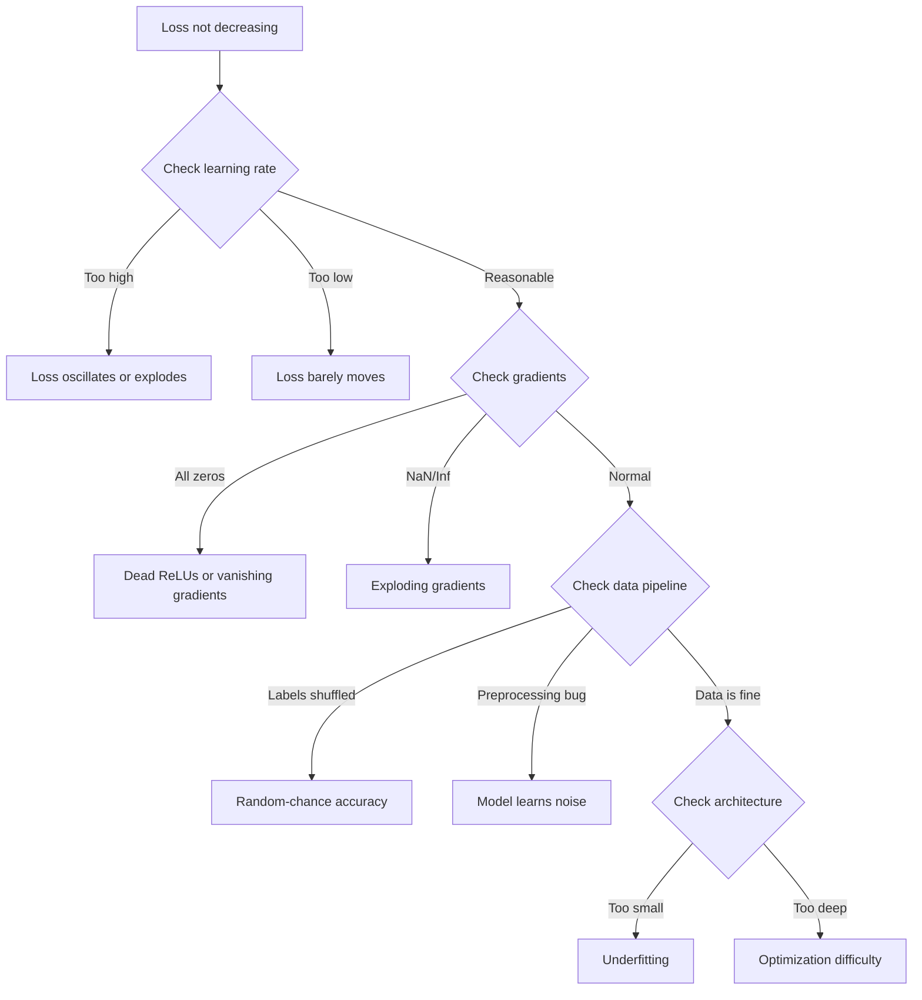
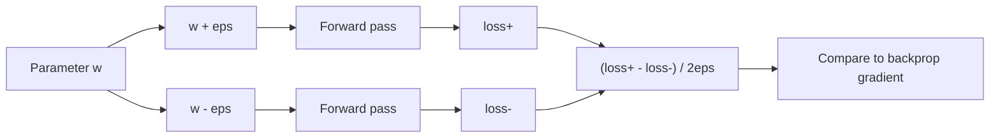
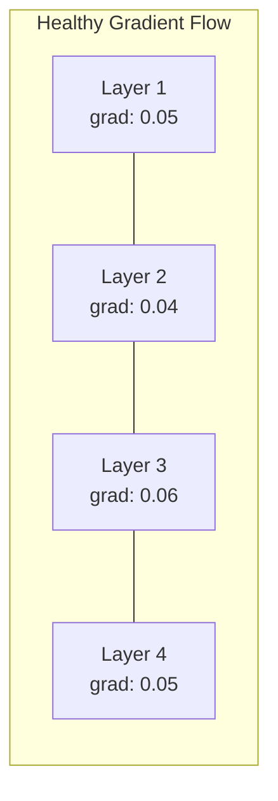
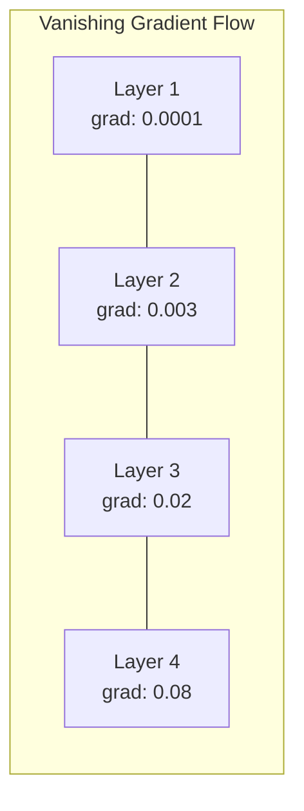
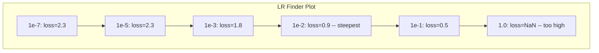

# 调试 तंत्रिका नेटवर्क

> आपका नेटवर्क 编译成功了――它运行了――它产生了一个数字―― यह संख्या गलत है, और कुछ भी नहीं टूट गया है―― स्वागत है सबसे कठिन प्रकार के डिबगिंग में से एक मेंः कोई त्रुटि नहीं संदेश के डिबगिंग――

**类型：**निर्माण
**语言：**पायथन, पायटॉर्च
**前置要求：**चरण 03 पाठ 01-10 (विशेषकर बैकप्रॉपेगमेंट, हानि फ़ंक्शंस, ऑप्टिमाइज़र)
**时间：**~ 90 मिनट

## 学习目标

- उपयोग प्रणालीगत डिबगिंग 策略诊断常见 तंत्रिका नेटवर्क故障(NaN हानि、平坦的 हानि वक्र、ओवरफिटिंग、oscillation)
- 应用 "ओवरफिट वन बैच" 技术,验证 मॉडल वास्तुकला 和 प्रशिक्षण लूप
- 检查 ग्रेडिएंट परिमाण、 सक्रियण वितरण तथा वजन मानदंड, विलुप्त हो रहा/विस्फोटरत ग्रेडिएंट की पहचान करने के लिए 问题
- डिबगिंग चेकलिस्ट का निर्माण, डेटा पाइपलाइन को कवर करना, मॉडल वास्तुकला, हानि फ़ंक्शन, अनुकूलन और सीखने की दर  समस्या

## 问题

传统软件坏掉时会崩──零指针会抛出例外──类型不匹配 会在编译时间中失败──一次失败──明显错误的输出会产生──

तंत्रिका नेटवर्क आपको यह सुविधा नहीं देगा।

एक खराब हुए तंत्रिका नेटवर्क एक पूर्ण संचालन होगा, एक हानि मूल्य प्रिंट, और भविष्यवाणियों का उत्पादन करेगा। हानि घट सकती है। भविष्यवाणियां शायद तर्कसंगत लगें। लेकिन मॉडल सही है। त्रुटिः शॉर्टकट सीखना, स्मृति शोर, या स्थानीय न्यूनतम प्राप्त करना। गूगल शोधकर्ताओं का अनुमान है कि 60 से 70% एमएल डिबगिंग में समय "चुप" बग पर खर्च किया जाता हैः वे गलतियां नहीं उत्पन्न करेंगे, लेकिन मॉडल की गुणवत्ता को कम करेंगे।

एक काम करने योग्य मॉडल और एक खराब मॉडल के बीच, हमेशा केवल एक पंक्ति में अंतर होता है।`zero_grad()`、转置的尺寸、偏差 10x 的学习率──经典的"न्यूरल नेटवर्क प्रशिक्षण के लिए नुस्खा"(2019)开篇就说:"सबसे आम न्यूरल नेटवर्क त्रुटियां बग हैं जो क्रैश नहीं करते हैं।"

इस कक्षा में आप इन कीड़े खोजने के लिए सिखाएगा

## 核心概念

### सोच को ठीक करना

忘掉印刷-प्रय 式 डिबगिंग── तंत्रिका नेटवर्क डिबगिंग 需要系统化方法,因为反回路 很慢每次训练运行 需要几分钟到几小时),而症状也很模糊坏损失可能意味着20种不同的问题)

黄金法则:**从简单开始，一次只增加一个复杂度，并独立验证每一部分。**



### लक्षण 1: हानि 不下降

यह सबसे आम शिकायत है। प्रशिक्षण चक्र में चल रहा है, युग लगातार आगे बढ़ते हैं, जबकि हानि ढ़लती रहती है।

**错误的 learning rate。**太高: हानि oscillate 或跳到NaN──太低: हानि 下降得非常慢,看起来像是平的──对于亚当,从1e-3 开始──对于SGD,从1e-1 或 1e-2 开始──在决定其他地方有问题之前,始终尝试 3 个相差 10x 的学习率(例如1e-2、1e-3、1e-4)──

**Dead ReLUs。**यदि एक ReLU न्यूरॉन  बहुत बड़ा नकारात्मक इनपुट प्राप्त करता है, तो यह 0 का आउटपुट करता है और इसका ग्रेडिएंट 0 है। यह फिर से सक्रिय नहीं होगा।

**Vanishing gradients。**सिग्मोइड या टैन सक्रियण के गहरे नेटवर्क में, ग्रेडिएंट्स में पिछड़े प्रसार समय में घटता है।

**Exploding gradients。**相反问题:ग्रैडिएंट्स 指数级增长──常见于RNNs 和非常深的网络──Loss 跳到NaN──修复方法:ग्रैडिएंट क्लिपिंग(`torch.nn.utils.clip_grad_norm_`)、 सीखने की दर को कम करना, या सामान्यीकरण को बढ़ाना

### लक्षण 2: हानि नीचे गिरता है लेकिन मॉडल  बहुत खराब

नुकसान घट गया है। प्रशिक्षण सटीकता 99% तक पहुंच गई है। लेकिन परीक्षण सटीकता 55% है।

**Overfitting。**मॉडल 记住了训练数据,而不是学习模式──训练损失和验证损失 之间的差距 会随时间变大──修复方法:更多数据、减量、体重衰退、早期停止、数据增量──

**Data leakage。**परीक्षण डेटा 泄漏进了训练――精度 高得可疑──常见原因:split 之前 shuffle、使用完整数据集的统计做做预处理、不同分区间 之间存在重复样品──修复方法:先分区,再预处理,检查重复──

**Label errors。**大多数真实数据集中有 5-10% 的标签是错的(Northcutt et al., 2021 -- "टेस्ट सेट में सर्वव्यापी लेबल त्रुटियां") ――model 学到了 noise──修复方法: आत्मविश्वासपूर्ण सीखने का उपयोग करें 找出并修复错误标签的例子,或使用损失缩小 忽略高损失样本──

### लक्षण 3: हानि के बीच NAN या Inf का उद्भव

हानि मूल्य 变成 `nan`या `inf` प्रशिक्षण 已失败──

**Learning rate 太高。**ग्रेडिएंट अपडेट 跨得太远, वजन विस्फोट का कारण बनता है──修复方法:降低10x──

**log(0) 或 log(negative)。**क्रॉस-एंट्रोपी हानि 会计算 `log(p)`यदि आपका मॉडल 输出精确的 0 या नकारात्मक संभावना,लॉग会爆炸──修复方法:将预测 क्लैंप到 `[eps, 1-eps]`, उनमें से `eps=1e-7`

**除以零。**बैच सामान्यीकरण 会除以标准偏移──常数值的批有 std=0──修复方法:在分母中添加epsilon(PyTorch 默认会这样做,但定制实现可能不会)

**Numerical overflow。**बड़ी सक्रियण 输入 `exp()`                                                                                                                                                                                                                                                              

### तकनीक 1:ग्रेडिएंट जांच

अपने विश्लेषणात्मक ग्रेडिएंट्स को तुलना करें (यदि वे असंगत हैं, तो पीछे की ओर से पास की जाँच करें, त्रुटि है)

参数 `w`का संख्यात्मक ग्रेडिएंटः

```
grad_numerical = (loss(w + eps) - loss(w - eps)) / (2 * eps)
```

एक致性指标 (सपेक्ष अंतर):

```
rel_diff = |grad_analytical - grad_numerical| / max(|grad_analytical|, |grad_numerical|, 1e-8)
```

यदि `rel_diff < 1e-5`: सही है, अगर `rel_diff > 1e-3`लगभग निश्चित रूप से कोई बग है।



### तकनीक 2: सक्रियण सांख्यिकी

प्रशिक्षण के दौरान निगरानी प्रत्येक स्तर के बाद सक्रियण के औसत तथा मानक विचलन── स्वस्थ नेटवर्क औसत 接近 0 、std 接近 1 (在正常化 后), या कम से कम 保持有界──

| Health indicator | Mean | Std | Diagnosis |
|-----------------|------|-----|-----------|
| Healthy | ~0 | ~1 | Network 正常学习 |
| Saturated | >>0 or <<0 | ~0 | Activations 卡在极端值 |
| Dead | 0 | 0 | Neurons 已经 dead（全为零） |
| Exploding | >>10 | >>10 | Activations 无界增长 |

### तकनीक 3: ग्रेडिएंट 流可视化

図 प्रत्येक स्तर के औसत ग्रेडिएंट परिमाणों को चित्रित करें  स्वस्थ के नेटवर्क में, प्रत्येक स्तर के ग्रेडिएंट परिमाणों को 大致相近  करना चाहिए  यदि प्रारंभिक स्तरों के ग्रेडिएंट्स बाद के स्तरों से 小 1000x होते हैं, तो गायब होने वाले ग्रेडिएंट्स होते हैं 





### तकनीक 4: ओवरफिट-वन-बैच टेस्ट

यह गहन शिक्षा में सबसे महत्वपूर्ण एकल डिबगिंग तकनीक है।

取一个小批量(8-32 个样本) ――在它上练100+ पुनरावृत्ति──输 应该接近零,训练精度 应该达到100%──如果没有,说明你的模型或训练循环有根本性错误,不要继续进行完整训练──

इस परीक्षण को पकड़ सकता हैः
- 损坏 के नुकसान कार्य
- 损坏 के पीछे की पत्तियों
- वास्तुकला 太小,无法表示数据
- अनुकूलक  कोई मॉडल मापदंडों से कनेक्ट नहीं
- डेटा व लेबल असंगत

यह केवल 30 सेकंड के लिए काम करता है, लेकिन यह कुछ घंटे की बचत कर सकता है पूरी प्रशिक्षण रन के डिबगिंग समय

### तकनीक 5:शिक्षा दर खोजक

लेस्ली स्मिथ(2017) ने कहा, एक युग में आंतरिक सीखने की दर बहुत छोटी से बहुत बड़ी तक (१ई-७) (१०) तक (१०) (१०) (१०) (१०)), साथ ही रिकॉर्ड हानि (१०) (२००) (२००) (१०) (१०) (१०) (१०) (१०) (१०) (१०) (१०) (१०) (१०) (१०) (१०) (१०) (१०) (१०) (१०) (१०) (१०) (१०) (१०) (१०) (१०) (१०) (१०) (१०) (१०) (१०) (१०) (१०) (१०) (१०) (१०) (१०) (१०) (१०) (१०) (१०) (१०) (१०) (१०) (१०) (१०) (१०) (१०) (१०) (१०) (१०) (१०) (१०) (१०) (१०) (१०) (१०) (१०) (१०) (१०) (१०) (१०) (१०) (१०) (१) (१०) (१०) (१०) (१) (१०) (१०) (१) (१) (१) (१) (१) (१) (१) (१) (१) (१) (१) (१) (१) (१) (१) (१) (१) (१) (१) (१) (१) (१) (१) (१) (१) (१) (१) (१) (१) (१) (१) (१) (१) (१) (१) (१) (१) (१) (१) (१) (१) (१) (१) (१) (१) (१) (१) (१) (१) (१) (१) (१) (१) (१) (१) (१) (१) (१) (



इस उदाहरण में सबसे अच्छा LR:~1e-3(अंत बिंदु 之前一个数量级)

### 常见 पायोटॉर्च कीड़े

ये PyTorch समुदाय में सबसे ज्यादा समय बर्बाद करने वाले बग हैंः

| Bug | Symptom | Fix |
|-----|---------|-----|
| 忘记 `optimizer.zero_grad()` | Gradients 在 batches 之间累积，loss oscillates | 在 `loss.backward()` 之前添加 `optimizer.zero_grad()` |
| test time 忘记 `model.eval()` | Dropout 和 batch norm 行为不同，test accuracy 在不同 runs 之间变化 | 添加 `model.eval()` 和 `torch.no_grad()` |
| 错误的 tensor shapes | Silent broadcasting 产生错误结果，没有报错 | debugging 期间在每个 operation 后打印 shapes |
| CPU/GPU mismatch | `RuntimeError: expected CUDA tensor` | 对 model 和 data 都使用 `.to(device)` |
| 没有 detach tensors | Computation graph 不断增长，OOM | 使用 `.detach()` 或 `with torch.no_grad()` |
| In-place operations 破坏 autograd | `RuntimeError: modified by in-place operation` | 将 `x += 1` 替换为 `x = x + 1` |
| Data 未 normalized | Loss 卡在 random-chance 水平 | 将 inputs normalize 到 mean=0, std=1 |
| Labels dtype 错误 | Cross-entropy 期望 `Long`，却得到 `Float` | 转换 labels：`labels.long()` |

### मास्टर डिबगिंग टेबल

| Symptom | Likely cause | First thing to try |
|---------|-------------|-------------------|
| Loss 卡在 -log(1/num_classes) | Model 正在预测 uniform distribution | 检查 data pipeline，验证 labels 匹配 inputs |
| 几步后 Loss NaN | Learning rate 太高 | 将 LR 降低 10x |
| Loss 立即 NaN | log(0) 或除以零 | 在 log/division operations 中添加 epsilon |
| Loss 剧烈 oscillating | LR 太高或 batch size 太小 | 降低 LR，增大 batch size |
| Loss 下降后 plateau | LR 对 fine-tuning phase 来说太高 | 添加 LR schedule（cosine 或 step decay） |
| Training acc 高，test acc 低 | Overfitting | 添加 dropout、weight decay、更多数据 |
| Training acc = test acc = chance | Model 没有学到任何东西 | 运行 overfit-one-batch test |
| Training acc = test acc 但都很低 | Underfitting | 更大的 model、更多 layers、更多 features |
| Gradients 全为零 | Dead ReLUs 或 detached computation graph | 切换到 LeakyReLU，检查 `.requires_grad` |
| Training 期间 out of memory | Batch 太大或 graph 未释放 | 降低 batch size，在 eval 使用 `torch.no_grad()` |


```figure
learning-curves
```

##  इसे निर्माण

एक निदान उपकरण, सक्रियणों, ग्रेडिएंट्स और हानि वक्रों की निगरानी के लिए उपयोग किया जाता है। आप एक नेटवर्क को जानबूझकर नष्ट कर देंगे, और इस उपकरण का उपयोग प्रत्येक समस्या का निदान करने के लिए करेंगे।

### 步骤 1: नेटवर्क डिबगर वर्ग

PyTorch मॉडल में हुक, प्रत्येक स्तर के सक्रियण और ग्रेडिएंट सांख्यिकी रिकॉर्ड करें

```python
import torch
import torch.nn as nn
import math


class NetworkDebugger:
    def __init__(self, model):
        self.model = model
        self.activation_stats = {}
        self.gradient_stats = {}
        self.loss_history = []
        self.lr_losses = []
        self.hooks = []
        self._register_hooks()

    def _register_hooks(self):
        for name, module in self.model.named_modules():
            if isinstance(module, (nn.Linear, nn.Conv2d, nn.ReLU, nn.LeakyReLU)):
                hook = module.register_forward_hook(self._make_activation_hook(name))
                self.hooks.append(hook)
                hook = module.register_full_backward_hook(self._make_gradient_hook(name))
                self.hooks.append(hook)

    def _make_activation_hook(self, name):
        def hook(module, input, output):
            with torch.no_grad():
                out = output.detach().float()
                self.activation_stats[name] = {
                    "mean": out.mean().item(),
                    "std": out.std().item(),
                    "fraction_zero": (out == 0).float().mean().item(),
                    "min": out.min().item(),
                    "max": out.max().item(),
                }
        return hook

    def _make_gradient_hook(self, name):
        def hook(module, grad_input, grad_output):
            if grad_output[0] is not None:
                with torch.no_grad():
                    grad = grad_output[0].detach().float()
                    self.gradient_stats[name] = {
                        "mean": grad.mean().item(),
                        "std": grad.std().item(),
                        "abs_mean": grad.abs().mean().item(),
                        "max": grad.abs().max().item(),
                    }
        return hook

    def record_loss(self, loss_value):
        self.loss_history.append(loss_value)

    def check_loss_health(self):
        if len(self.loss_history) < 2:
            return "NOT_ENOUGH_DATA"
        recent = self.loss_history[-10:]
        if any(math.isnan(v) or math.isinf(v) for v in recent):
            return "NAN_OR_INF"
        if len(self.loss_history) >= 20:
            first_half = sum(self.loss_history[:10]) / 10
            second_half = sum(self.loss_history[-10:]) / 10
            if second_half >= first_half * 0.99:
                return "NOT_DECREASING"
        if len(recent) >= 5:
            diffs = [recent[i+1] - recent[i] for i in range(len(recent)-1)]
            if max(diffs) - min(diffs) > 2 * abs(sum(diffs) / len(diffs)):
                return "OSCILLATING"
        return "HEALTHY"

    def check_activations(self):
        issues = []
        for name, stats in self.activation_stats.items():
            if stats["fraction_zero"] > 0.5:
                issues.append(f"DEAD_NEURONS: {name} has {stats['fraction_zero']:.0%} zero activations")
            if abs(stats["mean"]) > 10:
                issues.append(f"EXPLODING_ACTIVATIONS: {name} mean={stats['mean']:.2f}")
            if stats["std"] < 1e-6:
                issues.append(f"COLLAPSED_ACTIVATIONS: {name} std={stats['std']:.2e}")
        return issues if issues else ["HEALTHY"]

    def check_gradients(self):
        issues = []
        grad_magnitudes = []
        for name, stats in self.gradient_stats.items():
            grad_magnitudes.append((name, stats["abs_mean"]))
            if stats["abs_mean"] < 1e-7:
                issues.append(f"VANISHING_GRADIENT: {name} abs_mean={stats['abs_mean']:.2e}")
            if stats["abs_mean"] > 100:
                issues.append(f"EXPLODING_GRADIENT: {name} abs_mean={stats['abs_mean']:.2e}")
        if len(grad_magnitudes) >= 2:
            first_mag = grad_magnitudes[0][1]
            last_mag = grad_magnitudes[-1][1]
            if last_mag > 0 and first_mag / last_mag > 100:
                issues.append(f"GRADIENT_RATIO: first/last = {first_mag/last_mag:.0f}x (vanishing)")
        return issues if issues else ["HEALTHY"]

    def print_report(self):
        print("\n=== NETWORK DEBUGGER REPORT ===")
        print(f"\nLoss health: {self.check_loss_health()}")
        if self.loss_history:
            print(f"  Last 5 losses: {[f'{v:.4f}' for v in self.loss_history[-5:]]}")
        print("\nActivation diagnostics:")
        for item in self.check_activations():
            print(f"  {item}")
        print("\nGradient diagnostics:")
        for item in self.check_gradients():
            print(f"  {item}")
        print("\nPer-layer activation stats:")
        for name, stats in self.activation_stats.items():
            print(f"  {name}: mean={stats['mean']:.4f} std={stats['std']:.4f} zero={stats['fraction_zero']:.1%}")
        print("\nPer-layer gradient stats:")
        for name, stats in self.gradient_stats.items():
            print(f"  {name}: abs_mean={stats['abs_mean']:.2e} max={stats['max']:.2e}")

    def remove_hooks(self):
        for hook in self.hooks:
            hook.remove()
        self.hooks.clear()
```

### 步骤 2: ओवरफिट-वन-बैच टेस्ट

```python
def overfit_one_batch(model, x_batch, y_batch, criterion, lr=0.01, steps=200):
    optimizer = torch.optim.Adam(model.parameters(), lr=lr)
    model.train()
    print("\n=== OVERFIT ONE BATCH TEST ===")
    print(f"Batch size: {x_batch.shape[0]}, Steps: {steps}")

    for step in range(steps):
        optimizer.zero_grad()
        output = model(x_batch)
        loss = criterion(output, y_batch)
        loss.backward()
        optimizer.step()

        if step % 50 == 0 or step == steps - 1:
            with torch.no_grad():
                preds = (output > 0).float() if output.shape[-1] == 1 else output.argmax(dim=1)
                targets = y_batch if y_batch.dim() == 1 else y_batch.squeeze()
                acc = (preds.squeeze() == targets).float().mean().item()
            print(f"  Step {step:3d} | Loss: {loss.item():.6f} | Accuracy: {acc:.1%}")

    final_loss = loss.item()
    if final_loss > 0.1:
        print(f"\n  FAIL: Loss did not converge ({final_loss:.4f}). Model or training loop is broken.")
        return False
    print(f"\n  PASS: Loss converged to {final_loss:.6f}")
    return True
```

### 步骤 3:शिक्षा दर खोजक

```python
def find_learning_rate(model, x_data, y_data, criterion, start_lr=1e-7, end_lr=10, steps=100):
    import copy
    original_state = copy.deepcopy(model.state_dict())
    optimizer = torch.optim.SGD(model.parameters(), lr=start_lr)
    lr_mult = (end_lr / start_lr) ** (1 / steps)

    model.train()
    results = []
    best_loss = float("inf")
    current_lr = start_lr

    print("\n=== LEARNING RATE FINDER ===")

    for step in range(steps):
        optimizer.zero_grad()
        output = model(x_data)
        loss = criterion(output, y_data)

        if math.isnan(loss.item()) or loss.item() > best_loss * 10:
            break

        best_loss = min(best_loss, loss.item())
        results.append((current_lr, loss.item()))

        loss.backward()
        optimizer.step()

        current_lr *= lr_mult
        for param_group in optimizer.param_groups:
            param_group["lr"] = current_lr

    model.load_state_dict(original_state)

    if len(results) < 10:
        print("  Could not complete LR sweep -- loss diverged too quickly")
        return results

    min_loss_idx = min(range(len(results)), key=lambda i: results[i][1])
    suggested_lr = results[max(0, min_loss_idx - 10)][0]

    print(f"  Swept {len(results)} steps from {start_lr:.0e} to {results[-1][0]:.0e}")
    print(f"  Minimum loss {results[min_loss_idx][1]:.4f} at lr={results[min_loss_idx][0]:.2e}")
    print(f"  Suggested learning rate: {suggested_lr:.2e}")

    return results
```

### 步骤 4:ग्रेडिएंट चेकर

```python
def _flat_to_multi_index(flat_idx, shape):
    multi_idx = []
    remaining = flat_idx
    for dim in reversed(shape):
        multi_idx.insert(0, remaining % dim)
        remaining //= dim
    return tuple(multi_idx)


def gradient_check(model, x, y, criterion, eps=1e-4):
    model.train()
    x_double = x.double()
    y_double = y.double()
    model_double = model.double()

    print("\n=== GRADIENT CHECK ===")
    overall_max_diff = 0
    checked = 0

    for name, param in model_double.named_parameters():
        if not param.requires_grad:
            continue

        layer_max_diff = 0

        model_double.zero_grad()
        output = model_double(x_double)
        loss = criterion(output, y_double)
        loss.backward()
        analytical_grad = param.grad.clone()

        num_checks = min(5, param.numel())
        for i in range(num_checks):
            idx = _flat_to_multi_index(i, param.shape)
            original = param.data[idx].item()

            param.data[idx] = original + eps
            with torch.no_grad():
                loss_plus = criterion(model_double(x_double), y_double).item()

            param.data[idx] = original - eps
            with torch.no_grad():
                loss_minus = criterion(model_double(x_double), y_double).item()

            param.data[idx] = original

            numerical = (loss_plus - loss_minus) / (2 * eps)
            analytical = analytical_grad[idx].item()

            denom = max(abs(numerical), abs(analytical), 1e-8)
            rel_diff = abs(numerical - analytical) / denom

            layer_max_diff = max(layer_max_diff, rel_diff)
            checked += 1

        overall_max_diff = max(overall_max_diff, layer_max_diff)
        status = "OK" if layer_max_diff < 1e-5 else "MISMATCH"
        print(f"  {name}: max_rel_diff={layer_max_diff:.2e} [{status}]")

    model.float()

    print(f"\n  Checked {checked} parameters")
    if overall_max_diff < 1e-5:
        print("  PASS: Gradients match (rel_diff < 1e-5)")
    elif overall_max_diff < 1e-3:
        print("  WARN: Small differences (1e-5 < rel_diff < 1e-3)")
    else:
        print("  FAIL: Gradient mismatch detected (rel_diff > 1e-3)")
    return overall_max_diff
```

### 步骤 5: जानबूझकर नेटवर्क को नष्ट करना

अब उपकरण उपकरण टूट नेटवर्क पर लागू किया जाएगा ऊपर, और प्रत्येक समस्या का निदान।

```python
def demo_broken_networks():
    torch.manual_seed(42)
    x = torch.randn(64, 10)
    y = (x[:, 0] > 0).long()

    print("\n" + "=" * 60)
    print("BUG 1: Learning rate too high (lr=10)")
    print("=" * 60)
    model1 = nn.Sequential(nn.Linear(10, 32), nn.ReLU(), nn.Linear(32, 2))
    debugger1 = NetworkDebugger(model1)
    optimizer1 = torch.optim.SGD(model1.parameters(), lr=10.0)
    criterion = nn.CrossEntropyLoss()
    for step in range(20):
        optimizer1.zero_grad()
        out = model1(x)
        loss = criterion(out, y)
        debugger1.record_loss(loss.item())
        loss.backward()
        optimizer1.step()
    debugger1.print_report()
    debugger1.remove_hooks()

    print("\n" + "=" * 60)
    print("BUG 2: Dead ReLUs from bad initialization")
    print("=" * 60)
    model2 = nn.Sequential(nn.Linear(10, 32), nn.ReLU(), nn.Linear(32, 32), nn.ReLU(), nn.Linear(32, 2))
    with torch.no_grad():
        for m in model2.modules():
            if isinstance(m, nn.Linear):
                m.weight.fill_(-1.0)
                m.bias.fill_(-5.0)
    debugger2 = NetworkDebugger(model2)
    optimizer2 = torch.optim.Adam(model2.parameters(), lr=1e-3)
    for step in range(50):
        optimizer2.zero_grad()
        out = model2(x)
        loss = criterion(out, y)
        debugger2.record_loss(loss.item())
        loss.backward()
        optimizer2.step()
    debugger2.print_report()
    debugger2.remove_hooks()

    print("\n" + "=" * 60)
    print("BUG 3: Missing zero_grad (gradients accumulate)")
    print("=" * 60)
    model3 = nn.Sequential(nn.Linear(10, 32), nn.ReLU(), nn.Linear(32, 2))
    debugger3 = NetworkDebugger(model3)
    optimizer3 = torch.optim.SGD(model3.parameters(), lr=0.01)
    for step in range(50):
        out = model3(x)
        loss = criterion(out, y)
        debugger3.record_loss(loss.item())
        loss.backward()
        optimizer3.step()
    debugger3.print_report()
    debugger3.remove_hooks()

    print("\n" + "=" * 60)
    print("HEALTHY NETWORK: Correct setup for comparison")
    print("=" * 60)
    model_good = nn.Sequential(nn.Linear(10, 32), nn.ReLU(), nn.Linear(32, 2))
    debugger_good = NetworkDebugger(model_good)
    optimizer_good = torch.optim.Adam(model_good.parameters(), lr=1e-3)
    for step in range(50):
        optimizer_good.zero_grad()
        out = model_good(x)
        loss = criterion(out, y)
        debugger_good.record_loss(loss.item())
        loss.backward()
        optimizer_good.step()
    debugger_good.print_report()
    debugger_good.remove_hooks()

    print("\n" + "=" * 60)
    print("OVERFIT-ONE-BATCH TEST (healthy model)")
    print("=" * 60)
    model_test = nn.Sequential(nn.Linear(10, 32), nn.ReLU(), nn.Linear(32, 2))
    overfit_one_batch(model_test, x[:8], y[:8], criterion)

    print("\n" + "=" * 60)
    print("LEARNING RATE FINDER")
    print("=" * 60)
    model_lr = nn.Sequential(nn.Linear(10, 32), nn.ReLU(), nn.Linear(32, 2))
    find_learning_rate(model_lr, x, y, criterion)

    print("\n" + "=" * 60)
    print("GRADIENT CHECK")
    print("=" * 60)
    model_grad = nn.Sequential(nn.Linear(10, 8), nn.ReLU(), nn.Linear(8, 2))
    gradient_check(model_grad, x[:4], y[:4], criterion)
```

## इसका उपयोग करें

### पायटॉर्च अंतर्निहित उपकरण

```python
import torch
import torch.nn as nn

model = nn.Sequential(
    nn.Linear(768, 256),
    nn.ReLU(),
    nn.Linear(256, 10),
)

with torch.autograd.detect_anomaly():
    output = model(input_tensor)
    loss = criterion(output, target)
    loss.backward()

for name, param in model.named_parameters():
    if param.grad is not None:
        print(f"{name}: grad_mean={param.grad.abs().mean():.2e}")
```

### वजन और पूर्वाग्रह 集成

```python
import wandb

wandb.init(project="debug-training")

for epoch in range(100):
    loss = train_one_epoch()
    wandb.log({
        "loss": loss,
        "lr": optimizer.param_groups[0]["lr"],
        "grad_norm": torch.nn.utils.clip_grad_norm_(model.parameters(), float("inf")),
    })

    for name, param in model.named_parameters():
        if param.grad is not None:
            wandb.log({f"grad/{name}": wandb.Histogram(param.grad.cpu().numpy())})
```

### टेन्सरबोर्ड

```python
from torch.utils.tensorboard import SummaryWriter

writer = SummaryWriter("runs/debug_experiment")

for epoch in range(100):
    loss = train_one_epoch()
    writer.add_scalar("Loss/train", loss, epoch)

    for name, param in model.named_parameters():
        writer.add_histogram(f"weights/{name}", param, epoch)
        if param.grad is not None:
            writer.add_histogram(f"gradients/{name}", param.grad, epoch)
```

### डिबग चेकलिस्ट(完整 प्रशिक्षण 之前)

1. 运行 ओवरफिट-वन-बैच टेस्ट──यदि असफल हो, रुक──
2. 打印 मॉडल सारांश,验证 पैरामीटर गिनती 合理──
3. उपयोग यादृच्छिक डेटा 运行 एक बार आगे पास, जांच आउटपुट आकार
4.  प्रशिक्षण 5  युग, सत्यापन हानि 下降──
5. 检查 सक्रियण आँकड़े: कोई मृत परतें, कोई विस्फोट नहीं
6. 检查梯度 प्रवाह: कोई गायब नहीं, कोई विस्फोट नहीं
7. 验证 डेटा पाइपलाइन: 5 个 यादृच्छिक नमूने 及其标签印印

## 交付 यह

本课会产出:
- `outputs/prompt-nn-debugger.md`-- न्यूरल नेटवर्क प्रशिक्षण विफलता का निदान करने के लिए प्रयोग किया जाता है
- `outputs/skill-debug-checklist.md`-- प्रशिक्षण समस्याओं डिबगिंग के लिए उपयोग किया निर्णय पेड़ की जाँच सूची

डिबगिंग की महत्वपूर्ण तैनाती पैटर्नः
- उत्पादन प्रशिक्षण स्क्रिप्ट 添加 निगरानी हुक
- प्रत्येक N कदम सक्रियण और gradient के आंकड़े होगा W & B या TensorBoard तक रिकॉर्ड
- NaN हानि, मृत न्यूरॉन्स ((> 80% शून्य) या ग्रेडिएंट विस्फोट  स्वचालित अलर्ट प्राप्त
- प्रत्येक बार संशोधन वास्तुकला या डेटा पाइपलाइन 时,始终运行 ओवरफिट-एक बैच परीक्षण

## अभ्यास

1. **添加 exploding gradient detector。**修改 `NetworkDebugger`, इसे जांचने ग्रेडिएंट्स कभी सीमा से अधिक समय, और स्वचालित रूप से सुझाव ग्रेडिएंट काटने मूल्य में सुधार किया गया है।

2. **构建 dead neuron resurrector。**编写一个函数,识别死的RLU न्यूरॉन्स(始终输出 0),并使用Kaiming आरंभिकरण重新初始化它们的入荷重量──展示这能恢复一个>70% न्यूरॉन्स都死的网络──

3. **实现带 plotting 的 learning rate finder。**扩展 `find_learning_rate`, परिणाम को CSV के लिए सहेजें, और एक अलग-अलग स्क्रिप्ट लिखें CSV को पढ़ने के लिए, matplotlib का उपयोग करें LR बनाम हानि वक्र दिखाएँ।

4. **创建 data pipeline validator。**编写一个函数,检查:train/test split 之间重复样品、标签分布不平衡(>10:1 अनुपात)、输入正常化(mean 接近 0,std 接近 1),以及数据中的 NaN/Inf मान──在一个故意腐败的数据集上运行它──

5. **Debug 一个真实 failure。**उपयोग पाठ 10 के बीच मिनी-फ्रेमवर्क, एक सूक्ष्म बग पेश करना, उदाहरण के लिए, में पीछे के बीच स्थानांतरण वजन मैट्रिक्स),并 उपयोग ग्रेडिएंट जांच 精确定位哪个参数的 ग्रेडिएंट्स 不正确──记录调试过程──

## 关键术语

| Term | What people say | What it actually means |
|------|----------------|----------------------|
| Silent bug | "它能运行，但结果很差" | 不产生错误但降低 model quality 的 bug，是 ML 中占主导的 failure mode |
| Dead ReLU | "neurons 死了" | 输入始终为负的 ReLU neuron，因此它输出 0，并永久接收 0 Gradient |
| Vanishing gradients | "Early layers 停止学习" | Gradients 在 layers 中指数级缩小，使 early layers 的 weights 实际上被冻结 |
| Exploding gradients | "Loss 变成了 NaN" | Gradients 在 layers 中指数级增长，导致 weight updates 大到 overflow |
| Gradient checking | "验证 backprop 是否正确" | 将 backprop 得到的 analytical gradients 与 finite differences 得到的 numerical gradients 比较 |
| Overfit-one-batch | "最重要的 debug test" | 在单个小 batch 上训练，以验证 model 是否能学习；如果不能，说明存在根本性问题 |
| LR finder | "Sweep 以找到正确的 learning rate" | 在一个 epoch 内指数级增大 learning rate，并选择 loss diverge 前的 rate |
| Data leakage | "Test data 泄漏进 training" | test set 的信息污染了 training，产生人为偏高的 accuracy |
| Activation statistics | "监控 layer health" | 跟踪每层 output 的 mean、std 和 zero-fraction，以检测 dead、saturated 或 exploding neurons |
| Gradient clipping | "限制 Gradient magnitude" | 当 Gradients 的 norm 超过 threshold 时将其缩小，防止 exploding gradient updates |

## 延伸阅读

- स्मिथ, "शिक्षण तंत्रिका नेटवर्क के लिए चक्रवात सीखने की दरें" (2017) -- 提出 learning rate range test(LR finder) के论文
- Northcutt et al., "टेस्ट सेट में सर्वव्यापी लेबल त्रुटियां मशीन लर्निंग बेंचमार्क को अस्थिर करती हैं" (2021) -- प्रमाण ImageNet、CIFAR-10 और अन्य प्रमुख बेंचमार्क में 3-6% के लेबल गलत हैं
- Zhang et al., "Deep Learning Understanding Requires Re-thinking Generalization" (2017) -- इस लेख में दिखाया गया है कि तंत्रिका नेटवर्क यादृच्छिक लेबल को याद कर सकते हैं, यह भी ओवरफिट-वन-बैच परीक्षण के लिए एक प्रभावी कारण है
- PyTorch दस्तावेज 中关于 `torch.autograd.detect_anomaly`和 `torch.autograd.set_detect_anomaly`की अंतर्निहित NaN/Inf पता लगाने
