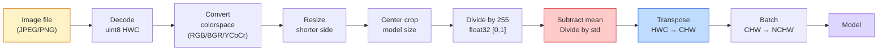
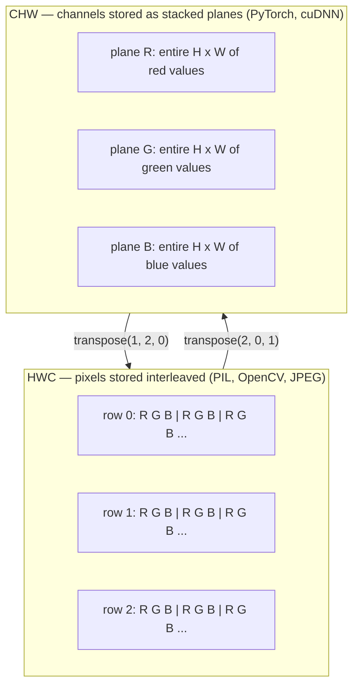

# 图像基础  पिक्सेल、 चैनल、 कलर स्पेस

> 图像是光采用的. 图像是光采用的. 图像是光采用的. 图像是光采用的. 图像是光采用的. 图像是光采用的. 图像是光采用的. 图像是光采用的.

**类型：**निर्माण
**语言：**पायथन
**前置要求：**चरण 1 पाठ 12 (टेन्सर ऑपरेशन), चरण 3 पाठ 11 (इंट्रो से पायटॉर्च)
**时间：** 45 मिनट

## 学习目标

-  समझाएं कि कैसे निरंतर दृश्य पिक्सेल में विघटित हो जाते हैं, और साथ ही नमूना और माप निर्णय क्यों प्रत्येक नीचे के मॉडल की ऊपरी सीमा को निर्धारित करते हैं
- चित्र को NumPy सरणी के रूप में 读取、切片和检查,并熟练在HWC और CHW लेआउट 之间切换
- RGB, ग्रेस्केल, HSV और YCbCr के बीच परिवर्तन, प्रत्येक रंग स्थान के अस्तित्व के कारणों का वर्णन
- 严格按照火vision的预期应用 级预处理(नियमित,मानक, आकार, चैनल-पहले)

## 问题

आप पढ़ेंगे प्रत्येक लेख लेख  डाउनलोड प्रत्येक पूर्व प्रशिक्षित वजन  अनुकूलित प्रत्येक दृष्टि एपीआई,  का अनुमान है कि विशिष्ट एन्कोडिंग के साथ प्रवेश `uint8`图像传给期望 `float32`मॉडल का, यह अभी भी चल रहा है, और  निष्पादन अर्थहीन परिणामों को प्रदान करते हैं। RGB पर प्रशिक्षित नेटवर्क को BGR  दे, सटीकता दस प्रतिशत अंक कम हो जाएगी। मॉडल के लिए चैनल-पहले, और आप इसे चैनल-अंतिम इनपुट देते हैं, पहली कन्वि लेयर को उच्चता को सुविधा चैनल के रूप में मानता है। ये सभी गलतियां नहीं डालेंगे। यह केवल आपके मीट्रिक को नष्ट कर देगा, फिर आप एक सप्ताह का समय खर्च करेंगे फ़ाइल लोड करने के तरीके में एक वास्तविक बग खोजने के लिए।

एक बार जब आप जानते हैं कि घुमावदारता में क्या स्लाइड होता है, तो यह स्वयं जटिल नहीं है। यह मुश्किल है,  एक छवि कैमरा,JPEG डिकोडर,PIL,OpenCV,torchvision और CUDA कर्नेल से अलग अर्थों को जानने के लिए। प्रत्येक स्टैक में अपनी अक्ष क्रम,byte सीमा और चैनल सम्मेलन को स्पष्ट करने के लिए असंभव है।

इस कक्षा में इस आधार को सुधारने के लिए, इस चरण की अगली सामग्री को इसके ऊपर बनाया जा सकता है। अंत में, आप जानते हैं कि पिक्सेल क्या है, क्यों प्रत्येक पिक्सेल में एक के बजाय तीन अंक हैं, इमेजनेट के आंकड़ों के साथ सामान्यीकरण करें।

## 概念

### 完整预处理 पाइपलाइन 一览

प्रत्येक उत्पादन स्तर की दृष्टि प्रणाली एक ही क्रमिक रूपान्तरण है।



红色和蓝色两个框是80% 静默失败发生的地方:缺少标准化,以及布局 错误──

### पिक्सेल नमूना है, एक वर्ग नहीं है

कैमरा सेंसर                                                                                                                                                                                                                                                             

```
Continuous scene                 Sensor grid                     Digital image
(infinite detail)                (H x W detectors)               (H x W integers)

    ~~~~~                        +--+--+--+--+--+                 210 198 180 155 120
   ♪ ♪ ♪ मैं एक आदमी हूँ ♪ ♪ मैं एक आदमी हूँ ♪ ♪ मैं एक आदमी हूँ ♪
  ~ प्रकाश ~ ----> +--+--+--+--+--+--+----> 200 190 175 150 115
   ~~~~~                         |  |  |  |  |  |                 195 185 170 148 112
                                 +--+--+--+--+--+                 188 180 165 145 108
```

इस चरण में दो विकल्प होंगे, जो सभी निम्न कार्यों की सीमा निर्धारित करेंगेः

- **Spatial sampling**निर्णय लेने के लिए कि प्रत्येक दृश्य में प्रति बार कितने डिटेक्टरों के प्रति应应应应应应应应应应应应应应应应应应应应应应应应应应应应应应应应应应应应应应应应应应应应应应应应应应应应应应应应应应应应应应应应应应应应应应应应应应应应应应应应应应应应应应应应应应应应应应应应应应应应应应应应应应应应应应应应应应应应应应应应应应应应应应应应应应应应应应应应应应应应应应应应应应应应应应应应应应应应应应应应应应应应应应应应应应应应应应应应应应应应应应应应应应应应应应应应应应应应应应应应应应应应应应应应应应应应应应应应应应应应应应应应应应应应应应应应应应应应应应应应应应应应应应应应应应应应应应应应应应应应应应应应应应应应应应应应应应应应应应应应应应应应应应应应应应应应应应应应应应应应应应应应应应应应应应应应应应应应应应应应应应应应应应应应应应应应应应应应应应应应应应应应应应应应应应应应应应应应应应应应应应应应应应应应应应应应应应应应应应应应应应应应应应应应应应应应应应应应应应应应应应应应应应应应应应应应应应应应应应应应应应应应应应应应应应应应应应应应应应应应应应应应应应应应应应应应应应应应应应应应应应应应应应应应应应应应应应应应应应应应应应应应应应应应应应应应应
- **Intensity quantization**निर्णय वोल्टेज                                                                                                                                                                                                                                                             

पिक्सेल न है के साथ आकार के रंग छोटे वर्ग ब्लॉक. यह एक एकल माप है. आकार या घूर्णन के समय, आप इस माप ग्रिड को पुनः नमूना कर रहे हैं.

### तीन चैनल क्यों हैं?

एक डिटेक्टर पूरे दृश्य प्रकाश谱 के दायरे के भीतर फोटॉन की गणना करेगा, वह ग्रेस्केल है। रंग प्राप्त करने के लिए, सेंसर ने लाल, हरा, नीला फ़िल्टर मोज़ेक का उपयोग किया।

```
One pixel in memory:

    (R, G, B) = (210, 140, 30)   <- reddish-orange

An H x W RGB image:

    shape (H, W, 3)     stored as   H rows of W pixels of 3 values
                                    each in [0, 255] for uint8
```

三不奇怪──深度相机会添加Z频道──卫星会添加红外线和紫外线带──医学扫描通常有一个频道──X-ray、CT) 或很多频道──超谱)──频道的数量是最后一个轴;conv层 会学习跨频道 混合──

### 两种布局公约:HWC和CHW

एक ही Tensor, दो तरह के क्रमों. प्रत्येक कु कुडुडु एक चुनेंगे.

```
HWC (height, width, channels)           CHW (channels, height, width)

   W ->                                    H ->
  +-----+-----+-----+                     +-----+-----+
H |R G B|R G B|R G B|                   C |R R R R R R|
| +-----+-----+-----+                   | +-----+-----+
v |R G B|R G B|R G B|                   v |G G G G G G|
  +-----+-----+-----+                     +-----+-----+
                                          |B B B B B B|
                                          +-----+-----+

   PIL, OpenCV, matplotlib,              PyTorch, most deep learning
   almost every image file on disk       frameworks, cuDNN kernels
```

CHW के अस्तित्व का कारण संभलण कर्नेल 会沿 H 和 W 滑动──把 चैनल अक्ष 放在前面, जिसका अर्थ है कि प्रत्येक कर्नेल प्रत्येक चैनल को ऊपर से लगातार 2D विमान में देख सकता है, ताकि शुद्ध भूमि वेक्टर 化──डिस्क प्रारूप 保持 HWC, क्योंकि यह संगत सेंसर 输出扫描线的方式──

आप एक हजार बार एक पंक्ति में प्रवेश करेंगे

```
img_chw = img_hwc.transpose(2, 0, 1)      # NumPy
img_chw = img_hwc.permute(2, 0, 1)        # PyTorch tensor
```

स्मृति लेआउट 可視化:



### बाइट रेंज 和 dtype

तीन प्रकार की सम्मेलन

| Convention | dtype | Range | 你会在哪里见到它 |
|------------|-------|-------|------------------|
| Raw | `uint8` | [0, 255] | Disk 上的文件、PIL、OpenCV output |
| Normalized | `float32` | [0.0, 1.0] | `img.astype('float32') / 255` 之后 |
| Standardized | `float32` | 大约 [-2, +2] | 减去 mean 并除以 std 之后 |

संवर्धित नेटवर्क मानक इनपुट में है।`mean=[0.485, 0.456, 0.406]``std=[0.229, 0.224, 0.225]`है में पूर्ण ImageNet प्रशिक्षण सेट ऊपर, के लिए [0, 1] सामान्यीकृत पिक्सेल  गणना प्राप्त की तीन चैनल के अंकगणितीय औसत 和 मानक विचलन---把 कच्चे `uint8`输入给期望标准化浮游的模型,是应用视觉中最常见的静默失败──

### रंग स्थान तथा वे क्यों मौजूद हैं

आरजीबी कैप्चर प्रारूप है, लेकिन यह हमेशा मॉडल के लिए सबसे उपयोगी अभिव्यक्ति नहीं है।

```
 RGB               HSV                       YCbCr / YUV

 R red             H hue (angle 0-360)       Y luminance (brightness)
 G green           S saturation (0-1)        Cb chroma blue-yellow
 B blue            V value/brightness (0-1)  Cr chroma red-green

 Linear to         Separates color from      Separates brightness from
 sensor output     brightness. Useful for    color. JPEG and most video
                   color thresholding, UI    codecs compress the chroma
                   sliders, simple filters   channels harder because the
                                             human eye is less sensitive
                                             to chroma detail than to Y.
```

अधिकांश आधुनिक सीएनएन के लिए, आप आरजीबी में प्रवेश करेंगे।

- **HSV** शास्त्रीय सीवी कोड  रंग आधारित विभाजन  सफेद-संतुलन 
- **YCbCr** 读取JPEG 内部、视频管道、 केवल Y उपर्युक्त ऑपरेशन के सुपर-रिज़ॉल्यूशन मॉडल पर निर्भर करता है。
- **Grayscale** ओसीआर 、 दस्तावेज़ मॉडल, तथा किसी भी रंग की स्थिति संकेत की स्थिति नहीं बल्कि कष्टप्रदता चर है

आरजीबी से 转灰度尺度 है बढ़ाव और, औसत नहीं है, क्योंकि मानव आंखें लाल या नीले रंग की तुलना में हरे रंग के प्रति अधिक संवेदनशील हैंः

```
Y = 0.299 R + 0.587 G + 0.114 B       (ITU-R BT.601, the classic weights)
```

### पहलू अनुपात, आकार और अंतराल

प्रत्येक मॉडल में निश्चित इनपुट आकार होता है। अधिकांश ImageNet वर्गीकरणकर्ता 224x224 है, आधुनिक डिटेक्टर 常用 384x384 या 512x512) ।

- **Resize shorter side, then center crop** 标准 ImageNet recipe── aspect ratio को बनाए रखें, छोड़ दें एक 条边缘 पिक्सेल──
- **Resize and pad** रक्षण आयाम अनुपात 和 प्रत्येक पिक्सेल, अतिरिक्त काले边── डिटेक्शन 和 OCR का मानक अभ्यास──
- **Resize directly to target** 拉伸图像──便宜,会扭曲几何, लेकिन कई वर्गीकरण कार्य के लिए 足够好──

जब नई नेटग और पुरानी नेटग असंगत होती है, तो इंटरपोलेशन विधि तय करती है कि मध्य पिक्सेल कैसे गणना करेंः

```
Nearest neighbour     fastest, blocky, only choice for masks/labels
Bilinear              fast, smooth, default for most image resizing
Bicubic               slower, sharper on upscaling
Lanczos               slowest, best quality, used for final display
```

 अनुभव नियम: प्रशिक्षण द्विआधारी, आप निकटतम उपयोग के लिए द्विआधारी या लैंचोस, किसी भी सामग्री के साथ पूर्ण वर्ग आईडी शामिल होगा


```figure
conv-output-size
```

##  इसे निर्माण

### 步骤 1: छवि लोड करें और आकार की जांच करें

उपयोग तकिया लोड करें किसी भी JPEG या PNG, कनवर्ट करें NumPy, और मुद्रित करें आप प्राप्त सामग्री── एक उपलब्ध लाइन चलाने की निश्चितता उदाहरण प्रदान करने के लिए, यहाँ एक तस्वीर को संकलित करें──

```python
import numpy as np
from PIL import Image

def synthetic_rgb(h=128, w=192, seed=0):
    rng = np.random.default_rng(seed)
    yy, xx = np.meshgrid(np.linspace(0, 1, h), np.linspace(0, 1, w), indexing="ij")
    r = (np.sin(xx * 6) * 0.5 + 0.5) * 255
    g = yy * 255
    b = (1 - yy) * xx * 255
    rgb = np.stack([r, g, b], axis=-1) + rng.normal(0, 6, (h, w, 3))
    return np.clip(rgb, 0, 255).astype(np.uint8)

arr = synthetic_rgb()
# 或从 disk 加载：
# arr = np.asarray(Image.open("your_image.jpg").convert("RGB"))

print(f"type:   {type(arr).__name__}")
print(f"dtype:  {arr.dtype}")
print(f"shape:  {arr.shape}     # (H, W, C)")
print(f"min:    {arr.min()}")
print(f"max:    {arr.max()}")
print(f"pixel at (0, 0): {arr[0, 0]}")
```

预期 आउटपुटः`shape: (H, W, 3)``dtype: uint8`、रेंज `[0, 255]`️ कैमरा से कोई बाइट JPEG डिकोडर या सिंथेटिक जनरेटर, ये सभी डिस्क पर कैनोनिक प्रतिनिधित्व हैं

### 步骤 2: अलग चैनल और पुनः排列 लेआउट

R、G、B से अलग करें, फिर HWC से PyTorch उपयोग CHW में परिवर्तित करें

```python
R = arr[:, :, 0]
G = arr[:, :, 1]
B = arr[:, :, 2]
print(f"R shape: {R.shape}, mean: {R.mean():.1f}")
print(f"G shape: {G.shape}, mean: {G.mean():.1f}")
print(f"B shape: {B.shape}, mean: {B.mean():.1f}")

arr_chw = arr.transpose(2, 0, 1)
print(f"\nHWC shape: {arr.shape}")
print(f"CHW shape: {arr_chw.shape}")
```

तीन ग्रेस्केल विमान, प्रत्येक चैनल एक एक──CHW 只是重排轴; जब मेमोरी लेआउट 允许时,严格来说不需要数据副本──

### 步骤 3:ग्रेस्केल एवं एचएसवी रूपांतरण

और ग्रे स्केल, फिर RGB-HSV को हाथ से चलाना

```python
def rgb_to_grayscale(rgb):
    weights = np.array([0.299, 0.587, 0.114], dtype=np.float32)
    return (rgb.astype(np.float32) @ weights).astype(np.uint8)

def rgb_to_hsv(rgb):
    rgb_f = rgb.astype(np.float32) / 255.0
    r, g, b = rgb_f[..., 0], rgb_f[..., 1], rgb_f[..., 2]
    cmax = np.max(rgb_f, axis=-1)
    cmin = np.min(rgb_f, axis=-1)
    delta = cmax - cmin

    h = np.zeros_like(cmax)
    mask = delta > 0
    rmax = mask & (cmax == r)
    gmax = mask & (cmax == g)
    bmax = mask & (cmax == b)
    h[rmax] = ((g[rmax] - b[rmax]) / delta[rmax]) % 6
    h[gmax] = ((b[gmax] - r[gmax]) / delta[gmax]) + 2
    h[bmax] = ((r[bmax] - g[bmax]) / delta[bmax]) + 4
    h = h * 60.0

    s = np.where(cmax > 0, delta / cmax, 0)
    v = cmax
    return np.stack([h, s, v], axis=-1)

gray = rgb_to_grayscale(arr)
hsv = rgb_to_hsv(arr)
print(f"gray shape: {gray.shape}, range: [{gray.min()}, {gray.max()}]")
print(f"hsv   shape: {hsv.shape}")
print(f"hue range: [{hsv[..., 0].min():.1f}, {hsv[..., 0].max():.1f}] degrees")
print(f"sat range: [{hsv[..., 1].min():.2f}, {hsv[..., 1].max():.2f}]")
print(f"val range: [{hsv[..., 2].min():.2f}, {hsv[..., 2].max():.2f}]")
```

Hue का आउटपुट इकाई है डिग्री, संतृप्ति 和 मूल्य में [0, 1] मध्य में── यह OpenCV के साथ `hsv_full`सम्मेलन 匹配──

### 步骤 4: सामान्यीकरण, मानकीकरण और पुनर्निर्माण

कच्चे बाइट से 转到预训练的图像网模型 期望的精确 Tensor,然后再转回来──

```python
mean = np.array([0.485, 0.456, 0.406], dtype=np.float32)
std = np.array([0.229, 0.224, 0.225], dtype=np.float32)

def preprocess_imagenet(rgb_uint8):
    x = rgb_uint8.astype(np.float32) / 255.0
    x = (x - mean) / std
    x = x.transpose(2, 0, 1)
    return x

def deprocess_imagenet(chw_float32):
    x = chw_float32.transpose(1, 2, 0)
    x = x * std + mean
    x = np.clip(x * 255.0, 0, 255).astype(np.uint8)
    return x

x = preprocess_imagenet(arr)
print(f"preprocessed shape: {x.shape}     # (C, H, W)")
print(f"preprocessed dtype: {x.dtype}")
print(f"preprocessed mean per channel:  {x.mean(axis=(1, 2)).round(3)}")
print(f"preprocessed std  per channel:  {x.std(axis=(1, 2)).round(3)}")

roundtrip = deprocess_imagenet(x)
max_diff = np.abs(roundtrip.astype(int) - arr.astype(int)).max()
print(f"roundtrip max pixel diff: {max_diff}    # 应该是 0 或 1")
```

प्रति चैनल औसत 应接近0,std 接近1── यह पूर्व-प्रक्रिया/अप्रक्रिया जोड़ी 正是 प्रत्येक टॉर्च विजन `transforms.Normalize`नीचे की ओर कुछ करना है।

### 步骤 5: तीन प्रकार की अंतराल विधि का उपयोग करके आकार बदलें

                                                                                                                                                                                                                                                              

```python
target = (arr.shape[0] * 3, arr.shape[1] * 3)

nearest = np.asarray(Image.fromarray(arr).resize(target[::-1], Image.NEAREST))
bilinear = np.asarray(Image.fromarray(arr).resize(target[::-1], Image.BILINEAR))
bicubic = np.asarray(Image.fromarray(arr).resize(target[::-1], Image.BICUBIC))

def local_roughness(x):
    gy = np.diff(x.astype(float), axis=0)
    gx = np.diff(x.astype(float), axis=1)
    return float(np.abs(gy).mean() + np.abs(gx).mean())

for name, out in [("nearest", nearest), ("bilinear", bilinear), ("bicubic", bicubic)]:
    print(f"{name:>8}  shape={out.shape}  roughness={local_roughness(out):6.2f}")
```

निकटतम का कड़ाई 分数最高, क्योंकि यह कठोर किनारे को बरकरार रखता है――बिलीनेर 最平滑──बिक्यूबिक 介于两者之间, बिना सीढ़ी-चरण कलाकृतियों के मामले में संज्ञानात्मक तीक्ष्णता को बरकरार रखता है──

## इसका उपयोग करें

`torchvision.transforms`मैं उपरोक्त सभी सामग्री को एक सम्मिश्र पाइपलाइन में पैक करूंगा।`preprocess_imagenet`कुछ भी करो,并额外加入 resize 和 फसल。

```python
import torch
from torchvision import transforms
from PIL import Image

img = Image.fromarray(synthetic_rgb(256, 256))

pipeline = transforms.Compose([
    transforms.Resize(256),
    transforms.CenterCrop(224),
    transforms.ToTensor(),
    transforms.Normalize(mean=[0.485, 0.456, 0.406], std=[0.229, 0.224, 0.225]),
])

x = pipeline(img)
print(f"tensor type:  {type(x).__name__}")
print(f"tensor dtype: {x.dtype}")
print(f"tensor shape: {tuple(x.shape)}      # (C, H, W)")
print(f"per-channel mean: {x.mean(dim=(1, 2)).tolist()}")
print(f"per-channel std:  {x.std(dim=(1, 2)).tolist()}")

batch = x.unsqueeze(0)
print(f"\nbatched shape: {tuple(batch.shape)}   # (N, C, H, W) — ready for a model")
```

चार चरण, क्रम अवश्य ऐसा होगाः`Resize(256)`256 तक छोटा सा सा साइड छोटा करें;`CenterCrop(224)`बीच से एक 224x224 पैच ले लो;`ToTensor()`255 से हटकर एचडब्ल्यूसी को सीएचडब्ल्यू में बदल दिया गया;`Normalize`减去ImageNet का अर्थ है并除以 std──颠倒这个顺序会改变到达模型的内容──

## 交付 यह

本课会产出:

- `outputs/prompt-vision-preprocessing-audit.md` एक त्वरित, किसी भी मॉडल कार्ड या डेटासेट कार्ड 转换成清单,列出团队必须遵守的精确预处理变量──
- `outputs/skill-image-tensor-inspector.md` एक कौशल, किसी भी छवि के आकार के Tensor या सरणी, रिपोर्ट dtype, लेआउट, रेंज, और यह कच्चे, सामान्य या मानकीकृत दिखता है

## अभ्यास

1. **(Easy)**分別使用 ओपनसीवी (`cv2.imread`) 和 तकिया 加载一张 JPEG──打印二者的形 和 `(0, 0)`处的Pixel── व्याख्या चैनल-क्रम 差异, फिर एक लाइन ट्रांसप्लांट लिखें, OpenCV सरणी को Pillow सरणी के साथ 完全一致 बनाएं──
2. **(Medium)**编写 `standardize(img, mean, std)` और इसके विपरीत, make二者能在任意 uint8 छवि上通过 `roundtrip_max_diff <= 1`测试── आपका फ़ंक्शन एक ही कॉल के साथ HWC के बीच एकल张 छवियों और NCHW के बीच बैचों को उसी समय संसाधित करने में सक्षम होना चाहिए──
3. **(Hard)** एक 3-चैनल ImageNet-मानक Tensor ले लो, इसे एक 1x1 conv के माध्यम से, इस conv RGB को एक एकल ग्रेस्केल चैनल के अतिरिक्त शक्ति मिश्रण के लिए सीखना `[0.299, 0.587, 0.114]`,结结它们,并验证输出与你的手动 `rgb_to_grayscale`फ्लोटिंग-पॉइंट त्रुटि 范围内匹配──क्या अन्य शास्त्रीय रंग-स्थान परिवर्तन 1x1 संभल में लिखा जा सकता है?

## 关键术语

| Term | 人们的说法 | 它实际的意思 |
|------|----------------|----------------------|
| Pixel | “一个彩色方块” | 一个 grid location 上的一次光强采样；color 用三个数字，grayscale 用一个数字 |
| Channel | “颜色” | 堆叠成 image Tensor 的并行 spatial grid 之一；在 HWC 中是最后一个 axis，在 CHW 中是第一个 |
| HWC / CHW | “shape” | image Tensor 的 axis ordering；disk 和 PIL 使用 HWC，PyTorch 和 cuDNN 使用 CHW |
| Normalize | “缩放图像” | 除以 255，让 Pixel 落在 [0, 1] 中；这是必要的，但还不充分 |
| Standardize | “零中心化” | 按 channel 减去 mean 并除以 std，使 input distribution 匹配模型训练时看到的分布 |
| Grayscale conversion | “对 channel 求平均” | 使用系数 0.299/0.587/0.114 的加权和，匹配人类 luminance perception |
| Interpolation | “resize 如何选 Pixel” | 当新 grid 与旧 grid 不对齐时决定 output value 的规则；label 用 nearest，training 用 bilinear，display 用 bicubic |
| Aspect ratio | “宽高比” | 区分“resize and pad”和“resize and stretch”的 ratio |

## 延伸阅读

- [Charles Poynton — A Guided Tour of Color Space](https://poynton.ca/PDFs/Guided_tour.pdf)                                                                                                                                                                                                                                                                                                                                                                                                                                                                                                                            
- [PyTorch Vision Transforms Docs](https://pytorch.org/vision/stable/transforms.html) आप उत्पादन में वास्तविक बैठक के निर्माण के पूर्ण परिवर्तन पाइपलाइन
- [How JPEG Works (Colt McAnlis)](https://www.youtube.com/watch?v=F1kYBnY6mwg) क्रोमा उप-सैंपलिंग ̊ डीसीटी और क्यों JPEG ̊ कोडिंग YCbCr और RGB की बजाय स्पष्ट दृश्यता व्याख्या
- [ImageNet Preprocessing Conventions (torchvision models)](https://pytorch.org/vision/stable/models.html) `mean=[0.485, 0.456, 0.406]`के अधिकार स्रोत, साथ ही मॉडल चिड़ियाघर में प्रत्येक मॉडल क्यों यह उम्मीद है
