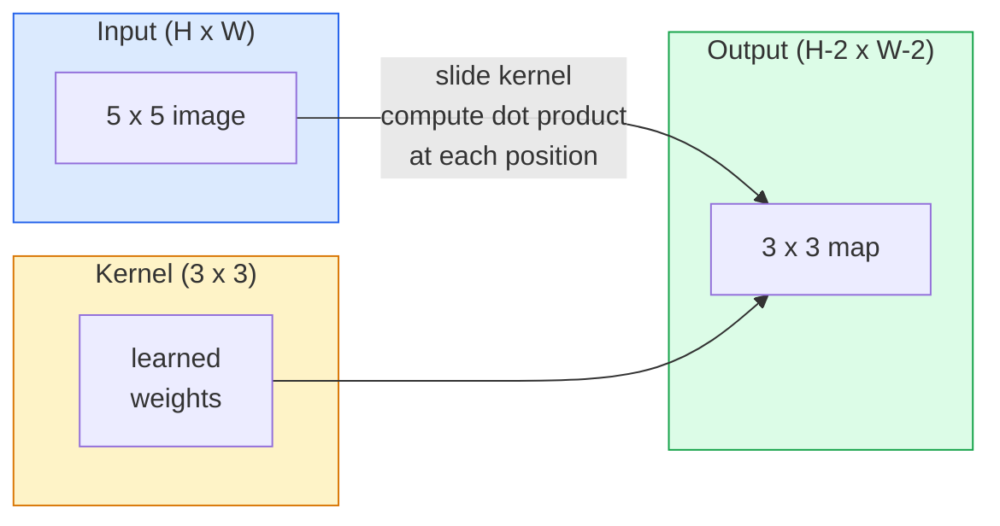
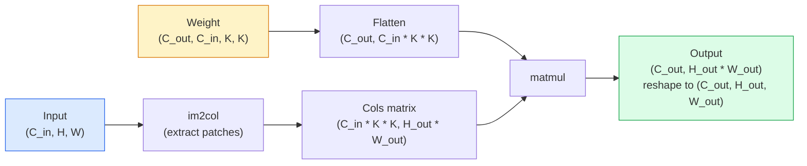

# खरोंच से घुमाव

> संकुचन एक बहुत ही छोटी घनी परत है, आप इसे एक छवि पर स्लाइड करते हैं, और प्रत्येक स्थान पर एक ही समूह का वजन साझा करते हैं।

**Type:** Build
**Languages:** Python
**Prerequisites:** Phase 3 (Deep Learning Core), Phase 4 Lesson 01 (Image Fundamentals)
**Time:** ~75 分钟

## 学习目标
- केवल उपयोग NumPy से शून्य 2D संरेखण को प्राप्त करने के लिए, शामिल हैं घोंसले हुए लूप  संस्करण और वेक्टरिज़ेड `im2col` संस्करण
- 针对 इनपुट आकार、कर्नल आकार、पadding 和 step के arbitrary组合, गणना आउटपुट स्पेस आकार,并解释 `(H - K + 2P) / S + 1`公式为什么成立
- 手工设计 kernels ((अल्प, धुंधला, तीखा, सबल),并解释每一个为什么会产生应对的激活模式
- एक विशेषता निकालने में संभलता  को संभलता  को संभलता गहराई के साथ संभलता  को प्राप्त क्षेत्र के आकार से जोड़ने

## 问题
एक 224x224 आरजीबी चित्र पर पूरी तरह से जुड़े परत का उपयोग करते हुए, प्रत्येक न्यूरॉन को 224 * 224 * 3 = 150,528 输入 भार की आवश्यकता होती है। एक 1,000  इकाई के लिए छिपे हुए परत में पहले से ही 1.5 बिलियन पैरामीटर हैं, और यह भी इससे पहले कि आप कुछ भी उपयोगी सीखें। इससे भी बदतर, यह परत एक कुत्ते के लिए एक ही मॉडल है जो एक कुत्ते के लिए एक ऊपर और एक कुत्ते के लिए एक दाएं निचले कोण है। यह प्रत्येक छवि की स्थिति को एक दूसरे से अलग वस्तु के रूप में मानता है, लेकिन यह छवि के लिए गलत है। एक बिल्ली को तीन चित्रों को स्थानांतरित करने के लिए, नेटवर्क को फिर से इस अवधारणा को सीखने के लिए मजबूर नहीं करना चाहिए।

图像模型 दो प्रकृति की आवश्यकता होती हैः**translation equivariance**(इनपुट से बाहर) और **parameter sharing**(एक ही विशेषता डिटेक्टर सभी स्थानों पर चल रहा है) ―― घनत्व परतें 两者都不给你──Convolution 两者都天然具备──

कन्भल्यूशन डीप लर्निंग के लिए नहीं है। यह जेपीईजी संपीड़न, फोटोशॉप में गैसियन ब्लर, औद्योगिक विजन में किनारे का पता लगाने के लिए भी है, साथ ही लगभग सभी ऑडियो फिल्टर के पीछे एक ही ऑपरेशन है। 2012 से 2020 तक सीएनएन ने इमेजनेट का नेतृत्व किया।

## 概念
### एक नाभिक, स्लाइडिंग

2D घुमाव एक छोटे वजन मैट्रिक्स को ले जाएगा जिसे kernel (या filter) कहा जाता है, इसे इनपुट से गुजर जाएगा, और प्रत्येक स्थान पर प्रत्येक तत्व को गुणा करके और और और और और और एक आउटपुट चित्र बन जाएगा।



एक विशिष्ट 3x3 उदाहरण, 5x5 के लिए输入 (( बिना पैडिंग, चरण 1):

```
Input X (5 x 5):                Kernel W (3 x 3):

  1  2  0  1  2                   1  0 -1
  0  1  3  1  0                   2  0 -2
  2  1  0  2  1                   1  0 -1
  1  0  2  1  3
  2  1  1  0  1

The kernel slides across every valid 3 x 3 window. Output Y is 3 x 3:

 Y[0,0] = sum( W * X[0:3, 0:3] )
 Y[0,1] = sum( W * X[0:3, 1:4] )
 Y[0,2] = sum( W * X[0:3, 2:5] )
 Y[1,0] = sum( W * X[1:4, 0:3] )
 ... and so on
```

यह एक सूत्र है, यानि **shared weights、locality、sliding window**,就是完整思想── बाकी सब कुछ लेखांकन है──

### आउटपुट आकार सूत्र

给定输入空间尺寸 `H`、कार्ण आकार `K`、पडिंग `P`、 कदम `S`:

```
H_out = floor( (H - K + 2P) / S ) + 1
```

याद रखिये इसे. आप इसे हर वास्तुकला में कई बार गणना करेंगे.

| Scenario | H | K | P | S | H_out |
|----------|---|---|---|---|-------|
| Valid conv，无 padding | 32 | 3 | 0 | 1 | 30 |
| Same conv（保持尺寸） | 32 | 3 | 1 | 1 | 32 |
| 按 2 倍 downsample | 32 | 3 | 1 | 2 | 16 |
| Pool 2x2 | 32 | 2 | 0 | 2 | 16 |
| 大 receptive field | 32 | 7 | 3 | 2 | 16 |

"समान पैडिंग" का अर्थ है चुनना P, जिससे जब S == 1 时 H_out == H。 के लिए अजीब संख्या K,也就是 P = (K - 1) / 2。 यही कारण है कि 3x3 कर्नेल प्रभुत्व रखते हैंः वे अभी भी केंद्र बिंदु के न्यूनतम अजीब संख्या कर्नेल 🏻 हैं।

### पद्दा

 बिना पैडिंग , प्रत्येक घुमावदार समय में सुविधाओं का नक्शा छोटा हो जाता है                                                                                                                                                                                                                                                   

```
Zero padding (P = 1) on a 5 x 5 input:

  0  0  0  0  0  0  0
  0  1  2  0  1  2  0
  0  0  1  3  1  0  0
  0  2  1  0  2  1  0       Now the kernel can centre on pixel
  0  1  0  2  1  3  0       (0, 0) and still have three rows and
  0  2  1  1  0  1  0       three columns of values to multiply.
  0  0  0  0  0  0  0
```

实践中会遇到的模式:`zero`(सबसे आम)`reflect`(镜像边缘, मेन जनरेटिव मॉडल्स में avoid हार्ड边界)`replicate`(复制边缘)`circular`(अंगूर, में टोरोइडल समस्याएं 中使用)

### कदम

गति ही गति है।`stride=1`                                                                                                                                                                                                                                                              `stride=2`अंतरिक्ष आयाम को आधा करने के लिए, सीएनएन के भीतर एक अलग पूलिंग परत का उपयोग नहीं करते हैं, बल्कि एक क्लासिक तरीके से डाउनसैम्पलिंग करते हैं। प्रत्येक आधुनिक वास्तुकला (ResNet,ConvNeXt,MobileNet) किसी न किसी स्थान पर कदम के साथ बदलती है।

```
Stride 1 on a 5 x 5 input, 3 x 3 kernel:

  starts: (0,0) (0,1) (0,2)        -> output row 0
          (1,0) (1,1) (1,2)        -> output row 1
          (2,0) (2,1) (2,2)        -> output row 2

  Output: 3 x 3

Stride 2 on the same input:

  starts: (0,0) (0,2)              -> output row 0
          (2,0) (2,2)              -> output row 1

  Output: 2 x 2
```

### कई इनपुट चैनल

वास्तविक छवि में तीन चैनल हैं। आरजीबी इनपुट पर 3x3 संभलण  वास्तव में एक 3x3x3 शरीरः प्रत्येक इनपुट चैनल में एक 3x3 切片 है। प्रत्येक स्थानिक स्थान पर, आप तीनों टुकड़ों के लिए गुणा और पूर्वाग्रह करेंगे।

```
Input:   (C_in,  H,  W)        3 x 5 x 5
Kernel:  (C_in,  K,  K)        3 x 3 x 3 (one kernel)
Output:  (1,     H', W')       2D map

For a layer that produces C_out output channels, you stack C_out kernels:

Weight:  (C_out, C_in, K, K)   e.g. 64 x 3 x 3 x 3
Output:  (C_out, H', W')       64 x 3 x 3

Parameter count: C_out * C_in * K * K + C_out   (the + C_out is biases)
```

अंतिम पंक्ति है आप योजना मॉडल जब होगा गणना की सामग्री. एक भूमिका है 3-चैनल  इनपुट पर 64-चैनल 3x3 conv है `64 * 3 * 3 * 3 + 64 = 1,792`个参数──很便宜──

### Im2col ट्रिक

घोंसले हुए लूप  facile à lire, mais très lent── GPU                                                                                                                                                                                                                                                                                                                                                                                                                                                                                                              



प्रत्येक उत्पादन स्तर के कन्वर्ट 实现  हैं इस विचार के साथ-साथ कैश-टाइलिंग 技巧 के कुछ प्रकार के                                                                                                                                                                                                                                                

### रिसेप्टिव फ़ील्ड

单个3x3 conv 会查看9 输入像素──堆叠两个3x3 conv,第二层中的一个神经元 会查看5x5 输入像素──三 3x3 conv 给出7x7──一般来说:

```
RF after L stacked K x K convs (stride 1) = 1 + L * (K - 1)

With strides:   RF grows multiplicatively with stride along each layer.
```

"一路 3x3" 能够有效(VGG、ResNet、ConvNeXt) का मूल कारण यह है कि दो 3x3 कन्व ों का इनपुट क्षेत्र एक 5x5 कन्व के समान है, लेकिन पैरामीटर कम है, और बीच में एक गैर-रैखिकता है।


```figure
convolution-kernel
```

##  इसे निर्माण
### 步骤 1: एक सरणी पैड

सबसे कम से कम आदिम से शुरूः एक H x W सरणी में  चारों ओर पूरक शून्य का फ़ंक्शन──

```python
import numpy as np

def pad2d(x, p):
    if p == 0:
        return x
    h, w = x.shape[-2:]
    out = np.zeros(x.shape[:-2] + (h + 2 * p, w + 2 * p), dtype=x.dtype)
    out[..., p:p + h, p:p + w] = x
    return out

x = np.arange(9).reshape(3, 3)
print(x)
print()
print(pad2d(x, 1))
```

पछाड़-अक्ष 技巧 `x.shape[:-2]`इसका मतलब है, एक ही फ़ंक्शन को बिना संशोधित किए कार्य करने में सक्षम है।`(H, W)``(C, H, W)`या `(N, C, H, W)`

### 步骤 2: 2D संरेखण को प्राप्त करने के लिए एक嵌套 चक्र का उपयोग करें

参考实现:慢,但毫不含糊── सिद्धांत रूप में, यह है `torch.nn.functional.conv2d`कुछ करना है

```python
def conv2d_naive(x, w, b=None, stride=1, padding=0):
    c_in, h, w_in = x.shape
    c_out, c_in_w, kh, kw = w.shape
    assert c_in == c_in_w

    x_pad = pad2d(x, padding)
    h_out = (h + 2 * padding - kh) // stride + 1
    w_out = (w_in + 2 * padding - kw) // stride + 1

    out = np.zeros((c_out, h_out, w_out), dtype=np.float32)
    for oc in range(c_out):
        for i in range(h_out):
            for j in range(w_out):
                hs = i * stride
                ws = j * stride
                patch = x_pad[:, hs:hs + kh, ws:ws + kw]
                out[oc, i, j] = np.sum(patch * w[oc])
        if b is not None:
            out[oc] += b[oc]
    return out
```

चार बार घोंसले हुए लूप्स (आउटपुट चैनल, पंक्ति, स्तंभ, पुनः जोड़कर C_in,kh,kw के लिए गुप्त रूप से मांग और)

### 步骤 3: उपयोग के साथ हस्ते-आधारित डिजाइन के कर्नेल सत्यापन

 एक ऊर्ध्वाधर सोबेल कर्नेल का निर्माण करें, इसे एक एक संश्लेषित चरण छवि पर लागू करें, और फिर ऊर्ध्वाधर किनारे को देखें 被点亮──

```python
def synthetic_step_image():
    img = np.zeros((1, 16, 16), dtype=np.float32)
    img[:, :, 8:] = 1.0
    return img

sobel_x = np.array([
    [[-1, 0, 1],
     [-2, 0, 2],
     [-1, 0, 1]]
], dtype=np.float32)[None]

x = synthetic_step_image()
y = conv2d_naive(x, sobel_x, padding=1)
print(y[0].round(1))
```

预期第7 列中出现较大的正值 ((左到右亮度增加),其他位置为零── इस छपाई में यानि गणित की सहीता की पुष्टि करने की जाँच है──

### 步骤 4: im2col

प्रत्येक कर्नेल आकार की खिड़की में एक पंक्ति में स्थानांतरित करें।`C_in=3, K=3`, प्रत्येक पंक्ति 27 अंक है.

```python
def im2col(x, kh, kw, stride=1, padding=0):
    c_in, h, w = x.shape
    x_pad = pad2d(x, padding)
    h_out = (h + 2 * padding - kh) // stride + 1
    w_out = (w + 2 * padding - kw) // stride + 1

    cols = np.zeros((c_in * kh * kw, h_out * w_out), dtype=x.dtype)
    col = 0
    for i in range(h_out):
        for j in range(w_out):
            hs = i * stride
            ws = j * stride
            patch = x_pad[:, hs:hs + kh, ws:ws + kw]
            cols[:, col] = patch.reshape(-1)
            col += 1
    return cols, h_out, w_out
```

यह अभी भी पायथन लूप है, लेकिन अब भारी गणना एक वेक्टरिज़ेड मैटमुल में बदल जाएगी।

### 步骤 5: im2col + matmul के माध्यम से 快速 conv को प्राप्त करना

एक बार मैट्रिक्स गुणा के साथ चौगुना लूप को प्रतिस्थापित करें

```python
def conv2d_im2col(x, w, b=None, stride=1, padding=0):
    c_out, c_in, kh, kw = w.shape
    cols, h_out, w_out = im2col(x, kh, kw, stride, padding)
    w_flat = w.reshape(c_out, -1)
    out = w_flat @ cols
    if b is not None:
        out += b[:, None]
    return out.reshape(c_out, h_out, w_out)
```

सटीकता जांच: दो कार्यान्वयन और तुलना

```python
rng = np.random.default_rng(0)
x = rng.normal(0, 1, (3, 16, 16)).astype(np.float32)
w = rng.normal(0, 1, (8, 3, 3, 3)).astype(np.float32)
b = rng.normal(0, 1, (8,)).astype(np.float32)

y_naive = conv2d_naive(x, w, b, padding=1)
y_im2col = conv2d_im2col(x, w, b, padding=1)

print(f"max abs diff: {np.max(np.abs(y_naive - y_im2col)):.2e}")
```

`max abs diff` चाहिए `1e-5`左右── यह अंतर फ्लोटिंग-पॉइंट 累加顺序 से आता है, बग नहीं──

### 步骤 6: एक समूह के हस्ते डिजाइन के कर्नेल

5 फिल्टर, एक एकल कंकण परत दिखाएं जो किसी भी प्रशिक्षण से पहले प्रदर्शन कर सकता है

```python
KERNELS = {
    "identity": np.array([[0, 0, 0], [0, 1, 0], [0, 0, 0]], dtype=np.float32),
    "blur_3x3": np.ones((3, 3), dtype=np.float32) / 9.0,
    "sharpen": np.array([[0, -1, 0], [-1, 5, -1], [0, -1, 0]], dtype=np.float32),
    "sobel_x": np.array([[-1, 0, 1], [-2, 0, 2], [-1, 0, 1]], dtype=np.float32),
    "sobel_y": np.array([[-1, -2, -1], [0, 0, 0], [1, 2, 1]], dtype=np.float32),
}

def apply_kernel(img2d, kernel):
    x = img2d[None].astype(np.float32)
    w = kernel[None, None]
    return conv2d_im2col(x, w, padding=1)[0]
```

️️️️️️️️️️️️️️️️️️️️️️️️️️️️️️️️️️️️️️️️️️️️️️️️️️️️️️️️️️️️️️️️️️️️️️️️️️️️️️️️️️️️️️️️️️️️️️️️️️️️️️️️️️️️️️️️️️️️️️️️️️️️️️️️️️️️️️️️️️️️️️️️️️️️️️️️️️️️️️️️️️️️️️️️️️️️️️️️️️️️️️️️️️️️️️️️️️️️️️️️️️️️️️️️️️️️️️️️️️️️️️️️️️️️️️️️️️️️️️️️️️️️️️️️️️️️️️️️️️️️️️️️️️️️️️️️️️️️️️️️️️️️️️️️️️️️️️️️️️️️️️️️️️️️️️️️️️️️️️️️️️️️️️️️️️️️️️️️️️️️️️️️️️️️️️️️️️️️️️️️️️️️️️️️️️️️️️️️️️️️️️️️️️️️️️️️️️️️️️️️️️️️️️️️️️️️️️️️️️️️️️️️️️️️️️️️️️️️️️️️️️️️️️️️️️️️️️️️️️️️️️️️️️️️️️️️️️️️️️️️️️️️️️️️️️️️️️️️️️️️️️️️️️️️

## इसका उपयोग करें
पिटॉर्च की `nn.Conv2d`ऑटोग्रेड,CUDA कर्नेल और cuDNN अनुकूलन के साथ एक ही ऑपरेशन को संकुल में रखा गया है।

```python
import torch
import torch.nn as nn

conv = nn.Conv2d(in_channels=3, out_channels=64, kernel_size=3, stride=1, padding=1)
print(conv)
print(f"weight shape: {tuple(conv.weight.shape)}   # (C_out, C_in, K, K)")
print(f"bias shape:   {tuple(conv.bias.shape)}")
print(f"param count:  {sum(p.numel() for p in conv.parameters())}")

x = torch.randn(8, 3, 224, 224)
y = conv(x)
print(f"\ninput  shape: {tuple(x.shape)}")
print(f"output shape: {tuple(y.shape)}")
```

`padding=1`换成 `padding=0`, खोलने से घटकर 222x222 `stride=1`换成 `stride=2`, खोई हुई मुलाकात 112x112 तक कम हो गया है,, यही है आप ऊपर याद किया है एक ही सूत्र है,,

## 交付 यह
本课会产出:

- `outputs/prompt-cnn-architect.md`: एक शीघ्र, दी गई इनपुट आकार, पैरामीटर बजट, लक्ष्य प्राप्त क्षेत्र, डिजाइन एक समूह`Conv2d`परतों, और प्रत्येक कदम सही K/S/P का उपयोग करें
- `outputs/skill-conv-shape-calculator.md`: एक कौशल, एक स्तर से एक नेटवर्क स्पेसिफिकेशन,并返回 प्रत्येक ब्लॉक का आउटपुट आकार、 रिसेप्टिव फ़ील्ड 和 पैरामीटर गिनती──

## अभ्यास
1. **(Easy)**给定一个 128x128 ग्रे स्केल 输入,以及一组 `[Conv3x3(s=1,p=1), Conv3x3(s=2,p=1), Conv3x3(s=1,p=1), Conv3x3(s=2,p=1)]`, हस्तशिल्प गणना प्रत्येक स्तर के आउटपुट अंतरिक्ष आकार और रिसेप्टिव क्षेत्र  के साथ एक dummy convs  से बना PyTorch `nn.Sequential`परीक्षण करवाएं
2. **(Medium)**扩展 `conv2d_naive`和 `conv2d_im2col`, उन्हें स्वीकार करने दें `groups`参数―― सबूत `groups=C_in=C_out`जा सकता है गहराई के हिसाब से घुमाव, और इसके पैरामीटर गिनती है `C * K * K`, बजाय `C * C * K * K`
3. **(Hard)** 手工实现 `conv2d_im2col`का पीछे की ओर पारितः给定输出 ग्रेडिएंट,计算 `x`和 `w`                                                                                                                                                                                                                                                              `torch.autograd.grad`验证──关键技巧是:im2col का ग्रेडिएंट है`col2im`और यह खिड़की पर एक बार फिर से चढ़ाना होगा।

## 关键术语
| Term | What people say | What it actually means |
|------|----------------|----------------------|
| Convolution | “滑动一个 filter” | 一个在每个空间位置用 shared weights 应用的可学习 dot product；数学上是 cross-correlation，但大家都叫它 convolution |
| Kernel / filter | “feature detector” | 一个形状为 (C_in, K, K) 的小型 weight tensor，它与输入窗口的 dot product 会产生一个输出像素 |
| Stride | “每次跳多远” | 连续 kernel placements 之间的步长；stride 2 会让每个空间维度减半 |
| Padding | “边缘上的零” | 在输入周围添加的额外值，使 kernel 可以以边界像素为中心；`same` padding 会让输出尺寸等于输入尺寸 |
| Receptive field | “neuron 能看到多少” | 某个输出 activation 所依赖的原始输入 patch，会随着深度和 stride 增长 |
| im2col | “GEMM trick” | 把每个 receptive window 重排成列，让 convolution 变成一次大型 matrix multiply，这是每个快速 conv kernel 的核心 |
| Depthwise conv | “每个 channel 一个 kernel” | 一个满足 `groups == C_in` 的 conv，每个输出 channel 只由匹配的输入 channel 计算得到；是 MobileNet 和 ConvNeXt 的 backbone |
| Translation equivariance | “输入平移，输出平移” | 输入平移 k 个像素时，输出也平移 k 个像素的性质；shared weights 天然带来这个性质 |

## 延伸阅读
- [A guide to convolution arithmetic for deep learning (Dumoulin & Visin, 2016)](https://arxiv.org/abs/1603.07285) प्रत्येक门课程都会借鉴的填充/步行/扩展 权威图解
- [CS231n: Convolutional Neural Networks for Visual Recognition](https://cs231n.github.io/convolutional-networks/) 经典讲座笔记,包括最初的 im2col 解释
- [The Annotated ConvNet (fast.ai)](https://nbviewer.org/github/fastai/fastbook/blob/master/13_convolutions.ipynb) एक से हाथ से लिखने के लिए संभलता 走到训练 अंक वर्गीकरण की नोटबुक
- [Receptive Field Arithmetic for CNNs (Dang Ha The Hien)](https://distill.pub/2019/computing-receptive-fields/)                                                                                                                                                                                                                                                              
