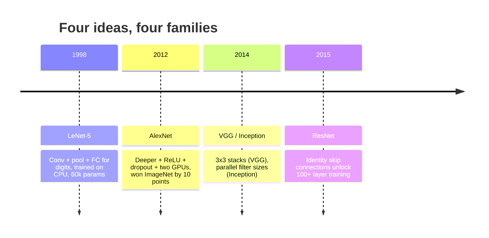
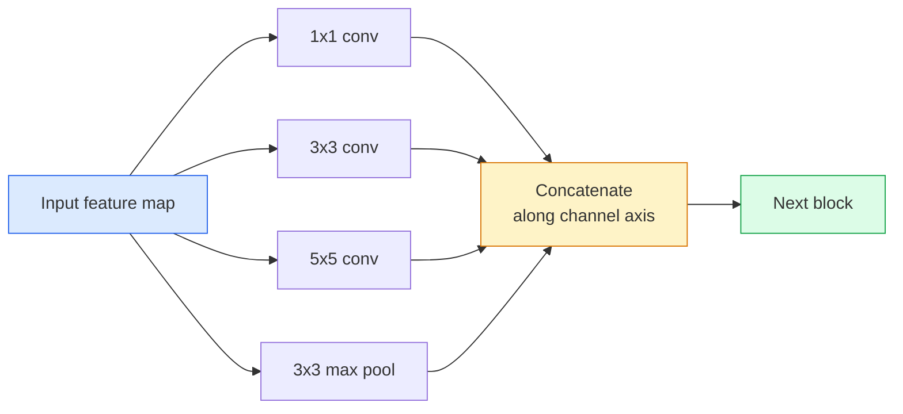
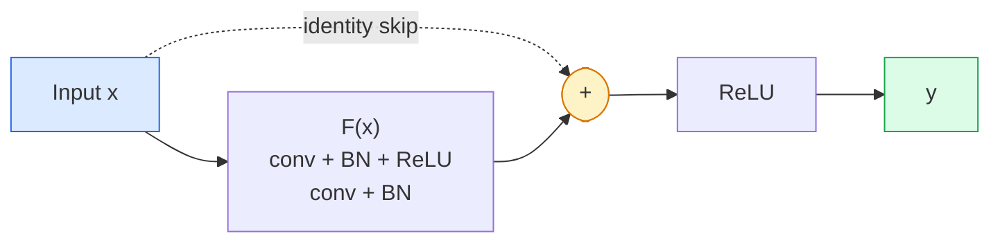

# सीएनएन  लेनेट से रेसनेट

> पिछले तीन दशक में प्रत्येक महत्वपूर्ण सीएनएन, मूल रूप से एक ही गैर-रैखिकता डाउनसैम्पल 配方, पुनः एक नया विचार पन्ना हुआ है।

**Type:** 学习 + 构建
**Languages:** Python
**先修要求：**चरण 3 पाठ 11 (पायटॉर्च), चरण 4 पाठ 01 (छवि मूल बातें), चरण 4 पाठ 02 (निरंतर से परिवर्तित)
**Time:** ~75 分钟

## 学习目标
- 追踪 LeNet-5 -> AlexNet -> VGG -> स्थापना -> ResNet का संरचनात्मक वंशावली,并说明每个家庭贡献的单一新想法
- PyTorch में LeNet-5 को लागू करें, एक VGG 风格 ब्लॉक, साथ ही एक ResNet BasicBlock, प्रत्येक 40 लाइनों के भीतर नियंत्रित
-  समझाएँ क्यों शेष कनेक्शन  एक अक्षम्य 1,000 परत नेटवर्क  अत्याधुनिक में बदल सकते हैं
- 阅读一个现代脊柱 (ResNet-18, ResNet-50), और查看源码前预测 इसके आउटपुट आकार、 रिसेप्टिव फ़ील्ड 和 पैरामीटर गिनती

## 问题
2011 में, सर्वश्रेष्ठ इमेजनेट वर्गीकरण के शीर्ष 5 सटीकता लगभग 74% है। 2012 में एलेक्सनेट 85% तक पहुंच गया है। 2015 में रेसनेट 96% तक पहुंच गया है। कोई नया डेटा नहीं है। कोई नई पीढ़ी के जीपीयू नहीं है। वास्तुकला विचार से उन्नत किया गया है। एक सक्षम कार्य करने वाला विजन इंजीनियर को यह जानना होगा कि कौन सा विचार किस लेख से आया है, क्योंकि आप 2026 में प्रकाशित प्रत्येक उत्पादन रीस्पोन, इन समान घटकों का एक पुनर्मिलन है; और क्योंकि ये विचार लगातार स्थानांतरित होंगेः समूहबद्ध कन्वर्स सीएनएन से ट्रांसफार्मर में स्थानांतरित, रेसनेट से स्थानांतरित करने के लिए शेष कनेक्शन, प्रत्येक एलएलएम में मौजूद प्रसारण मॉडल में बैच सामान्यीकरण।

按顺序学习这些网络也能让你避免一个常见错误: LeNet-sized network就能解决问题时,直接使用可用最大模型──MNIST 无需ResNet──了解每个家庭的规模曲线,能告诉你应该落在曲线的位置──

## 概念
###  परिवर्तन दृष्टि का चार विचार



शास्त्रीय दृष्टि में, इस चार बार से अधिक महत्वपूर्ण कुछ भी नहीं है।

### लेनेट-5 (1998)

यान लेकुन का अंक पहचानकर्ता 60,000 个 पैरामीटर  दो conv-pool ब्लॉक  दो पूरी तरह से जुड़े परत  टैन सक्रियण  यह प्रत्येक CNN 继承模板 को परिभाषित करता हैः

```
input (1, 32, 32)
  conv 5x5 -> (6, 28, 28)
  avg pool 2x2 -> (6, 14, 14)
  conv 5x5 -> (16, 10, 10)
  avg pool 2x2 -> (16, 5, 5)
  flatten -> 400
  dense -> 120
  dense -> 84
  dense -> 10
```

आधुनिक दुनिया के अनुसार सीएनएन, अर्थात् बारी बारी बारी बारी बारी बारी बारी बारी बारी बारी बारी बारी बारी बारी बारी बारी बारी बारी बारी बारी बारी बारी बारी बारी बारी बारी बारी बारी बारी बारी बारी बारी बारी बारी बारी बारी बारी बारी बारी बारी बारी बारी बारी बारी बारी बारी बारी बारी बारी बारी बारी बारी बारी बारी बारी बारी बारी बारी बारी बारी बारी बारी बारी बारी बारी बारी बारी बारी बारी बारी बारी बारी बारी बारी बारी बारी बारी बारी बारी बारी बारी बारी बारी बारी बारी बारी बारी बारी बारी बारी बारी बारी बारी बारी बारी बारी बारी बारी बारी बारी बारी बारी बारी बारी बारी बारी बारी बारी बारी बारी बारी बारी बारी बारी बारी बारी बारी बारी बारी बारी बारी बारी बारी बारी बारी बारी बारी बारी बारी बारी बारी बारी बारी बारी बारी बारी बारी बारी बारी बारी बारी बारी बारी बारी बारी बारी बारी बारी बारी बारी बारी बारी बारी बारी बारी बारी बारी बारी बारी बारी बारी बारी बारी बारी बारी बारी बारी बारी बारी बारी बारी बारी बारी बारी बारी बारी बारी बारी बारी बारी बारी बारी बारी बारी बारी बारी बारी बारी बारी बारी बारी बारी बारी बारी बारी बारी बारी बारी बारी बारी बारी बारी बारी बारी बारी बारी बारी बारी बारी बारी बारी बारी बारी बारी बारी बारी बारी बारी बारी बारी बारी बारी बारी बारी बारी बारी बारी बारी बारी बारी बारी बारी बारी बारी बारी बारी बारी बारी बारी बारी बारी बारी बारी बारी बारी बारी बारी बारी बारी बारी बारी बारी बारी बारी बारी बारी बारी बारी बारी बारी बारी बारी बारी बारी बारी बारी बारी बारी बारी बारी बारी बारी बारी बारी बारी बारी बारी बारी बारी बारी बारी बारी बारी बारी बारी बारी बारी बारी बारी बारी बारी बारी बारी बारी बारी बारी बारी बारी बारी बारी बारी बारी बारी बारी बारी बारी बारी बारी बारी बारी बारी बारी बारी बारी बारी बारी बारी बारी बारी बारी बारी बारी बारी बारी बारी बारी बारी बारी बारी बारी बारी बारी बारी बारी बारी बारी बारी बारी बारी बारी बारी बारी बारी बारी बारी बारी बारी बारी बारी बारी बारी बारी बारी बारी बारी बारी बारी बारी बारी बारी बारी बारी बारी बारी बारी बारी बारी बारी बारी बारी बारी बारी बारी बारी बारी बारी बारी बारी बारी बारी बारी बारी बारी बारी बारी बारी बारी बारी बारी बारी बारी बारी बारी बारी बारी बारी बारी बारी बारी बारी बारी बारी बारी बारी बारी बारी बारी बारी बारी बारी बारी बारी बारी बारी बारी बारी बारी बारी बारी बारी बारी बारी बारी बारी बारी बारी बारी बारी बारी बारी बारी बारी बारी बारी बारी बारी बारी बारी बारी बारी बारी बारी बारी बारी बारी बारी बारी बारी बारी बारी बारी बारी बारी बारी बारी बारी बारी बारी बारी बारी बारी बारी बारी बारी बारी बारी बारी बारी बारी बारी बारी बारी बारी बारी बारी बारी बारी बारी बारी बारी बारी बारी बारी बारी बारी बारी बारी बारी बारी बारी बारी बारी बारी बारी बारी बारी बारी बारी बारी बारी बारी

### एलेक्सनेट (2012)

तीन बदलावों ने इमेजनेट को तोड़ दिया:

1. उपयोग **ReLU**替代
2. में पूरी तरह से जुड़े सिर 中使用 **Dropout**नियमितता एक तकनीक के बजाय एक परत में बदल गई
3. **Depth and width** पाँच कंव परतें, तीन घने परतें, 60M पैरामीटर, दो ब्लॉक जीपीयू पर प्रशिक्षण,并把模型分成两个块卡上

论文 के चित्र 2  अभी भी GPU विभाजन, अर्थात् दो समानांतर धाराओं को प्रदर्शित करता है। यह समानांतर हार्डवेयर स्तर के कार्य समाधान है, संरचनात्मक नहीं है; लेकिन उपरोक्त तीन विचार अभी भी आपके द्वारा उपयोग किए जाने वाले प्रत्येक मॉडल में मौजूद हैं।

### वीजीजी (2014)

VGG  एक प्रश्न पूछाः यदि केवल 3x3 घुमाव का उपयोग किया, और लगातार गहराई से, क्या होगा?

```
stack:   conv 3x3 -> conv 3x3 -> pool 2x2
repeat:  16 or 19 conv layers
```

 दो 3x3 कन्व  देखने का इनपुट क्षेत्र एक 5x5 कन्व के समान है, लेकिन पैरामीटर कम (2*9*C^2 = 18C^2 vs 25*C^2), और बीच में अतिरिक्त एक ReLU──VGG  इसे पूर्ण संरचना में बदल दिया गया। इसकी सरलता, यानी एक ब्लॉक प्रकार का प्रतिकृति-संकलन, इसे सभी संरचनाओं के संदर्भ बिंदुओं में बदल देता है।

代价:138M पैरामीटर, प्रशिक्षण धीमा, इन्फेरेंस 昂贵

### स्थापना (2014,同年)

Google का जवाब है कि मुझे किस प्रकार का कर्नेल आकार उपयोग करना चाहिए?



प्रत्येक शाखा को विशेष रूप से बनाया गया हैः 1x1 चैनल मिश्रण के लिए उपयोग किया जाता है, 3x3 स्थानीय बनावट के लिए उपयोग किया जाता है, 5x5 बड़े पैटर्न के लिए उपयोग किया जाता है, पॉलिंग के लिए उपयोग किया जाता है, शिफ्ट-अनवियरेंट सुविधाओं; संयोजन 让下层选择任何有用的分支.

### अव्यवस्था की समस्या

2015 तक, VGG-19 能工作, जबकि VGG-32 不能── गहराई में यह मदद करने के लिए किया जाना चाहिए, लेकिन लगभग 20 परतों के बाद, प्रशिक्षण हानि और परीक्षण हानि सभी बदल गए हैं── यह ओवरफिटिंग नहीं है── यह अनुकूलक  उपयोगी वजन नहीं मिल सकता है, क्योंकि ग्रेडिएंट्स प्रत्येक परत के माध्यम से समय में गुणा करके छोटा होगा──

```
Plain deep network:
  y = f_L( f_{L-1}( ... f_1(x) ... ) )

Gradient wrt early layer:
  dL/dW_1 = dL/dy * df_L/df_{L-1} * ... * df_2/df_1 * df_1/dW_1

Each multiplicative term has magnitude roughly (weight magnitude) * (activation gain).
Stack 100 of them with gains < 1 and the gradient is effectively zero.
```

VGG 能在19层工作,是因为批量标准 (लगभग एक साथ प्रकाशित) 让激活 保持良好尺度――但即使是批量标准,也无法拯救超过30层左右的深度――

### ResNet (2015)

वह, झांग, रेन, सन ने एक समाधान प्रस्तावित किया।

```
standard block:   y = F(x)
residual block:   y = F(x) + x
```

`+ x`总能通过把 `F(x)`推到零来选择什么都不做── एक 1,000-层 ResNet 现在最差也不会差于1-层网络 差, क्योंकि प्रत्येक अतिरिक्त ब्लॉक में एक तुच्छ भागने का छेद होता है──有这个保证,优化器 愿意让每个块 变得*稍微*有用;而稍微有用的块 堆叠100次,就是最先进的──



इस ब्लॉक के दो चर हर जगह दिखाई देते हैंः

- **BasicBlock**(ResNet-18, ResNet-34): दो 3x3 कन्वर्स, कूद 跨过二者──
- **Bottleneck**(ResNet-50, -101, -152):1x1 नीचे,,3x3 मध्य,,1x1 ऊपर, skip 跨过三者──当频道数 很高时更便宜──

जब skip मुश्किल से नीचे के नमूने (चरण=2) पार करना होगा, तब पहचान पथ को 1x1 कदम=2 con के रूप में बदल दिया जाएगा, ताकि यह अनुरूप रूपों में हो।

### क्यों अवशेष का अर्थ दृष्टि से परे है

यह विचार वास्तव में छवि वर्गीकरण पर ध्यान केंद्रित नहीं करता है। यह गहरे नेटवर्क को विश्वसनीय, विस्तार योग्य इंजीनियरिंग उपकरण में बदलने के लिए केंद्रित है। आप अगले चरण में पढ़ेंगे कि प्रत्येक ट्रांसफार्मर, प्रत्येक ब्लॉक में एक ही स्किप कनेक्शन है।


```figure
pooling
```

##  इसे निर्माण
### 步骤 1: लेनेट-5

एक न्यूनतम और विश्वसनीय LeNet──Than सक्रियण, औसत पूलिंग── एकमात्र आधुनिकता की ओर अग्रसर है, हम नीचे उपयोग में हैं `nn.CrossEntropyLoss`, और मूल गौसी कनेक्शनों के बजाय

```python
import torch
import torch.nn as nn
import torch.nn.functional as F

class LeNet5(nn.Module):
    def __init__(self, num_classes=10):
        super().__init__()
        self.conv1 = nn.Conv2d(1, 6, kernel_size=5)
        self.conv2 = nn.Conv2d(6, 16, kernel_size=5)
        self.pool = nn.AvgPool2d(2)
        self.fc1 = nn.Linear(16 * 5 * 5, 120)
        self.fc2 = nn.Linear(120, 84)
        self.fc3 = nn.Linear(84, num_classes)

    def forward(self, x):
        x = self.pool(torch.tanh(self.conv1(x)))
        x = self.pool(torch.tanh(self.conv2(x)))
        x = torch.flatten(x, 1)
        x = torch.tanh(self.fc1(x))
        x = torch.tanh(self.fc2(x))
        return self.fc3(x)

net = LeNet5()
x = torch.randn(1, 1, 32, 32)
print(f"output: {net(x).shape}")
print(f"params: {sum(p.numel() for p in net.parameters()):,}")
```

अपेक्षित उत्पादन: `output: torch.Size([1, 10])`,`params: 61,706` यह आधुनिक दृष्टि का पूर्ण अंक वर्गीकरण है

### 步骤 2: एक VGG ब्लॉक

एक दोहराया जा सकता ब्लॉकः दो 3x3 कन्वर्स, रिलू, बैच मानक, अधिकतम पूल

```python
class VGGBlock(nn.Module):
    def __init__(self, in_c, out_c):
        super().__init__()
        self.conv1 = nn.Conv2d(in_c, out_c, kernel_size=3, padding=1)
        self.bn1 = nn.BatchNorm2d(out_c)
        self.conv2 = nn.Conv2d(out_c, out_c, kernel_size=3, padding=1)
        self.bn2 = nn.BatchNorm2d(out_c)
        self.pool = nn.MaxPool2d(2)

    def forward(self, x):
        x = F.relu(self.bn1(self.conv1(x)))
        x = F.relu(self.bn2(self.conv2(x)))
        return self.pool(x)

class MiniVGG(nn.Module):
    def __init__(self, num_classes=10):
        super().__init__()
        self.stack = nn.Sequential(
            VGGBlock(3, 32),
            VGGBlock(32, 64),
            VGGBlock(64, 128),
        )
        self.head = nn.Sequential(
            nn.AdaptiveAvgPool2d(1),
            nn.Flatten(),
            nn.Linear(128, num_classes),
        )

    def forward(self, x):
        return self.head(self.stack(x))

net = MiniVGG()
x = torch.randn(1, 3, 32, 32)
print(f"output: {net(x).shape}")
print(f"params: {sum(p.numel() for p in net.parameters()):,}")
```

CIFAR आकार इनपुट में तीन VGG ब्लॉक, एक अनुकूलन पूल, एक रैखिक परतों को उपयोग करते हुए, लगभग 290k पैरामीटरों को उपयोग करते हुए, CIFAR-10 के लिए पर्याप्त है।

### 步骤 3: एक ResNet BasicBlock

रेसनेट-18 और रेसनेट-34 के मुख्य निर्माण ब्लॉक

```python
class BasicBlock(nn.Module):
    def __init__(self, in_c, out_c, stride=1):
        super().__init__()
        self.conv1 = nn.Conv2d(in_c, out_c, kernel_size=3, stride=stride, padding=1, bias=False)
        self.bn1 = nn.BatchNorm2d(out_c)
        self.conv2 = nn.Conv2d(out_c, out_c, kernel_size=3, stride=1, padding=1, bias=False)
        self.bn2 = nn.BatchNorm2d(out_c)
        if stride != 1 or in_c != out_c:
            self.shortcut = nn.Sequential(
                nn.Conv2d(in_c, out_c, kernel_size=1, stride=stride, bias=False),
                nn.BatchNorm2d(out_c),
            )
        else:
            self.shortcut = nn.Identity()

    def forward(self, x):
        out = F.relu(self.bn1(self.conv1(x)))
        out = self.bn2(self.conv2(out))
        out = out + self.shortcut(x)
        return F.relu(out)
```

अवरोधित परतों 上的 `bias=False`यह एक बैच-नॉर्म की आदत है, क्योंकि बीएन का बीटा पैरामीटर पूर्वाग्रह को संभाल चुका है, इसलिए एक साथ कन्विल पूर्वाग्रह को भी व्यर्थ है।`shortcut`才需要真正的 conv;否则它就是一个无运身份──

### 步骤 4: एक छोटे से ResNet

堆叠四组 BasicBlocks, प्राप्त एक उपयुक्त CIFAR आकार के इनपुट के लिए काम कर ResNet

```python
class TinyResNet(nn.Module):
    def __init__(self, num_classes=10):
        super().__init__()
        self.stem = nn.Sequential(
            nn.Conv2d(3, 32, kernel_size=3, stride=1, padding=1, bias=False),
            nn.BatchNorm2d(32),
            nn.ReLU(inplace=True),
        )
        self.layer1 = self._make_group(32, 32, num_blocks=2, stride=1)
        self.layer2 = self._make_group(32, 64, num_blocks=2, stride=2)
        self.layer3 = self._make_group(64, 128, num_blocks=2, stride=2)
        self.layer4 = self._make_group(128, 256, num_blocks=2, stride=2)
        self.head = nn.Sequential(
            nn.AdaptiveAvgPool2d(1),
            nn.Flatten(),
            nn.Linear(256, num_classes),
        )

    def _make_group(self, in_c, out_c, num_blocks, stride):
        blocks = [BasicBlock(in_c, out_c, stride=stride)]
        for _ in range(num_blocks - 1):
            blocks.append(BasicBlock(out_c, out_c, stride=1))
        return nn.Sequential(*blocks)

    def forward(self, x):
        x = self.stem(x)
        x = self.layer1(x)
        x = self.layer2(x)
        x = self.layer3(x)
        x = self.layer4(x)
        return self.head(x)

net = TinyResNet()
x = torch.randn(1, 3, 32, 32)
print(f"output: {net(x).shape}")
print(f"params: {sum(p.numel() for p in net.parameters()):,}")
```

चार-संयुक्त ब्लॉक, प्रत्येक-संयुक्त दो-संयुक्त चरण 2। प्रत्येक-डाउनसैम्पल 时 चैनल का संख्या 翻倍―― लगभग 2.8M पैरामीटर।

### 步骤 5: पैरामीटर-टू-फ़ंक्शन दक्षता की तुलना करें

 समान इनपुट  तीन नेटवर्क पर पारित करें, और पैरामीटर की तुलना करें।

```python
def summary(name, net, x):
    y = net(x)
    params = sum(p.numel() for p in net.parameters())
    print(f"{name:12s}  input {tuple(x.shape)} -> output {tuple(y.shape)}  params {params:>10,}")

x = torch.randn(1, 3, 32, 32)
summary("LeNet5",     LeNet5(),       torch.randn(1, 1, 32, 32))
summary("MiniVGG",    MiniVGG(),      x)
summary("TinyResNet", TinyResNet(),   x)
```

तीन मॉडल, तीन समय, पैरामीटर गिनती 相差三数级── CIFAR-10 सटीकता के लिए, प्रशिक्षण कुछ युगों 后大致需要:LeNet 60%,MiniVGG 89%,TinyResNet 93%──

## इसका उपयोग करें
`torchvision.models`提供上所有模型的预训练版本──不同家族的电话签名 完全一致, यही रीढ़ की हड्डी के सार का अर्थ है──

```python
from torchvision.models import resnet18, ResNet18_Weights, vgg16, VGG16_Weights

r18 = resnet18(weights=ResNet18_Weights.IMAGENET1K_V1)
r18.eval()

print(f"ResNet-18 params: {sum(p.numel() for p in r18.parameters()):,}")
print(r18.layer1[0])
print()

v16 = vgg16(weights=VGG16_Weights.IMAGENET1K_V1)
v16.eval()
print(f"VGG-16   params: {sum(p.numel() for p in v16.parameters()):,}")
```

ResNet-18 में 11.7M पैरामीटर हैं──VGG-16 में 138M──ImageNet शीर्ष-1 सटीकता 接近 (69.8% बनाम 71.6%)──रजिस्टल कनेक्शन  आपको 12x पैरामीटर दक्षता 收益 收益 यही कारण है कि 2016 से ViT में 2021 के आने से पहले,ResNet वेरिएंट हमेशा प्रमुख स्थान पर रहे, और कंप्यूटिंग में सीमित वास्तविक तैनाती में अभी भी प्रमुख हैं──

प्रसारण सीखने के लिए, उपकरण हमेशा समान होता हैः लोड पूर्व-प्रशिक्षित, रीढ़ को फ्रीज, वर्गीकरण प्रमुख को प्रतिस्थापित करना

```python
for p in r18.parameters():
    p.requires_grad = False
r18.fc = nn.Linear(r18.fc.in_features, 10)
```

三行──現在你擁有10級CIFAR分類器, यह छविनेट 訓練的表現的继承者──

## 交付 यह
本课会产出:

- `outputs/prompt-backbone-selector.md`: एक शीघ्र, कार्य के आधार पर होगा, डेटासेट का आकार तथा गणना बजट  चुनें उपयुक्त CNN परिवार (LeNet/VGG/ResNet/MobileNet/ConvNeXt) 👇
- `outputs/skill-residual-block-reviewer.md`: एक कौशल,会读取 PyTorch मॉड्यूल并标记跳连接 错误(चरण परिवर्तन 时缺少快捷径、快捷径激活顺序、BN 相对添加位置)

## अभ्यास
1. **(Easy)** 手动逐层计算 `TinyResNet`के पैरामीटर`sum(p.numel() for p in net.parameters())`तुलनात्मक रूप से पैरामीटर बजट का मुख्य भाग कहाँ गया, क्या यह कन्वर्स, बीएन या वर्गीकरण प्रमुख है?
2. **(Medium)** बोतल गला ब्लॉक (1x1 -> 3x3 -> 1x1 स्किप के साथ) को लागू करें, और इसके साथ CIFAR के ResNet-50 शैली नेटवर्क का निर्माण करें`TinyResNet`तुलना में
3. **(Hard)**से `BasicBlock`मध्य स्थानांतरण स्किप कनेक्शन, में CIFAR-10 上分别训练一个34-ब्लॉक "प्लेन" नेटवर्क 和一个34-ब्लॉक ResNet,各训练 10 epochs──绘制二者的训练损失对 epoch──复现

## 关键术语
| Term | What people say | What it actually means |
|------|----------------|----------------------|
| Backbone | “模型” | 产生 feature map 并馈送给 task head 的 convolutional blocks 堆栈 |
| Residual connection | “Skip connection” | `y = F(x) + x`；通过将 F 设为零，让 Optimizer 学习 identity，从而让任意 depth 可训练 |
| BasicBlock | “两个带 skip 的 3x3 convs” | ResNet-18/34 的 building block：conv-BN-ReLU-conv-BN-add-ReLU |
| Bottleneck | “1x1 down，3x3，1x1 up” | ResNet-50/101/152 block；在高 channel counts 下成本低，因为 3x3 运行在缩减后的 width 上 |
| Degradation problem | “更深反而更差” | 超过约 20 个 plain conv layers 后，training error 和 test error 都会增加；由 residual connections 解决，而不是靠更多数据 |
| Stem | “第一层” | 将 3-channel input 转换为基础 feature width 的初始 conv；ImageNet 通常是 7x7 stride 2，CIFAR 通常是 3x3 stride 1 |
| Head | “分类器” | final backbone block 之后的 layers：adaptive pool、flatten、linear(s) |
| Transfer learning | “Pretrained weights” | 加载在 ImageNet 上训练过的 backbone，并且只在你的 task 上 fine-tune head |

## 延伸阅读
- [Deep Residual Learning for Image Recognition (He et al., 2015)](https://arxiv.org/abs/1512.03385) ResNet 论文;每张图都值得研究
- [Very Deep Convolutional Networks (Simonyan & Zisserman, 2014)](https://arxiv.org/abs/1409.1556) VGG 论文; अभी भी समझ में है क्यों 3x3 के लिए सबसे अच्छा संदर्भ है
- [ImageNet Classification with Deep CNNs (Krizhevsky et al., 2012)](https://papers.nips.cc/paper_files/paper/2012/hash/c399862d3b9d6b76c8436e924a68c45b-Abstract.html) AlexNet;终结 हस्तनिर्मित सुविधा 时代的论文
- [Going Deeper with Convolutions (Szegedy et al., 2014)](https://arxiv.org/abs/1409.4842) आरंभ v1; अभी भी दृष्टि परिवर्तनकों में दिखाई देगा मध्य के समानांतर फ़िल्टर  विचार
