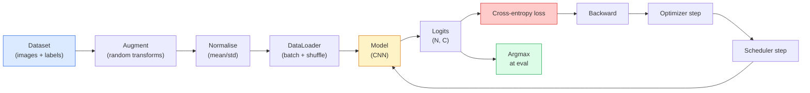

# छवि वर्गीकरण

> वर्गीकरणकर्ता पिक्सेल से वर्ग तक के संभावना वितरण का एक फ़ंक्शन है। बाकी सब कुछ पाइपलाइन कार्य है।

**Type:** Build
**Languages:** Python
**Prerequisites:** Phase 2 Lesson 09 (Model Evaluation), Phase 3 Lesson 10 (Mini Framework), Phase 4 Lesson 03 (CNNs)
**Time:** ~75 minutes

## 学习目标

- CIFAR-10 में ऊपर निर्मित टर्मिनल से टर्मिनल छवि वर्गीकरण पाइपलाइन: डेटासेट, वृद्धि, मॉडल, प्रशिक्षण लूप, मूल्यांकन
- 解释每个组件的作用(dataloader、loss、optimizer、scheduler、augmentation),并预测其中任意一个出错会如何体现在的输失曲线上
- शून्य से मिश्रण, कटआउट और लेबल चिकनाई को प्राप्त करने से, यह स्पष्ट करें कि उन्हें शामिल करने के लायक कब है
- 阅读 भ्रम मैट्रिक्स 和 प्रति वर्ग सटीकता/हटाने तालिका, संकलित सटीकता के साथ 之外的信息诊断数据集与模型的失败模式

## 问题

प्रत्येक अंतिम उप-लाइन दृष्टि कार्य, किसी न किसी स्तर पर सभी को छवि वर्गीकरण के बारे में वर्गीकृत किया जाएगा। डिटेक्शन क्षेत्र के लिए होगा, वर्गीकरण करेगा। विभाजन पिक्सल के लिए होगा, वर्गीकरण करेगा। पुनर्प्राप्ति वर्ग केंद्रों के अनुरूप होगा। वर्गीकरण करेगा, अर्थात् डेटासेट लूप, वृद्धि नीति, हानि, मूल्यांकन करेगा, इस चरण में सभी अन्य कार्यों की मूल क्षमता में स्थानांतरित किया जा सकता है।

अधिकांश वर्गीकरण बग 里里里里里 में नहीं हैं। वे पाइपलाइन में हैंः खराब होने के सामान्यीकरण, कोई हलचल नहीं है प्रशिक्षण सेट, लेबल को बढ़ाएगा, विकृत होगा, प्रशिक्षण डेटा द्वारा विरूपण की पुष्टि की गई है, 30 के बाद सीखने की दर फैल जाएगी। एक सही सेटिंग में CIFAR-10 पर 93% तक पहुंच सकता है, खराब सेटिंग में आमतौर पर केवल 70-75% प्राप्त किया जा सकता है, जबकि हानि कर्व पूरी तरह से उचित लगता है।

इस वर्ग में सभी पाइपलाइनों का निरीक्षण किया जाएगा।`torchvision.datasets`कुछ भी हो सकता है कीड़े की छिपी हुई चीज़ों में

## 核心概念

### वर्गीकरण पाइपलाइन



इस चक्र में प्रत्येक लाइन में बग हो सकता है। क्रॉस-एंट्रोपी कच्चे लॉग प्राप्त करते हैं, न कि सॉफ्टमैक्स आउटपुट, इसलिए हानि से पहले कुछ भी करें।`model(x).softmax()`                                                                                                                                                                                                                                                              `optimizer.zero_grad()` हर कदम को एक बार करना होगा; कूदकर यह ग्रेडिएंट जमा हो जाएगा, यह सीखने की दर 极不稳定 जैसी लगती है। इन बगों में से प्रत्येक  सीखने की वक्रता को समतल करने देगा, लेकिन गलतियां नहीं डालेंगे।

### क्रॉस-एंट्रोपी ̊लॉगिस तथा सॉफ्टमैक्स

वर्गीकरणकर्ता 会为每张图像产生 `C`个数字, तथाकथित logits. 个数字, तथाकथित logits. 个数字, तथाकथित logits. 个数字, तथाकथित logits. 个数字, तथाकथित logits. 个数字, तथाकथित logits. 个数字, तथाकथित logits. 个数字, तथाकथित logits. 个数字, तथाकथित logits. 个数字, तथाकथित logits. 个数字, तथाकथित logits. 个数字, तथाकथित logits. 个数字, तथाकथित logits. 个数字, तथाकथित logits. 个数字, तथाकथित logits.

```
softmax(z)_i = exp(z_i) / sum_j exp(z_j)
```

क्रॉस-एंट्रोपी 衡量正确 वर्ग का नकारात्मक लॉग संभावनाः

```
CE(z, y) = -log( softmax(z)_y )
        = -z_y + log( sum_j exp(z_j) )
```

सही तरफ प्रारूप है संख्यात्मक स्थिर प्रारूप (log-sum-exp)`nn.CrossEntropyLoss`एक Op में एक Op में एक Fusion softmax + NLL,并 सीधे कच्चे लॉजिट्स प्राप्त करते हैं── स्वयं पहले softmax 几乎总是 bug, चूंकि आप log(softmax(softmax(z)) की गणना करते हैं, यह एक अर्थहीन मात्रा है──

### क्यों वृद्धि प्रभावी है

सीएनएन के लिए अनुवाद प्रेरणात्मक पूर्वाग्रह है (जो वजन साझा करने से आता है), लेकिन फसलों  फ़्लिप्स  रंग जिक्र या अस्थिरता  कोई आंतरिक अपरिवर्तनीयता नहीं है  इसे इन अपरिवर्तनीयताओं का एकमात्र तरीका यह है कि इसे इन परिवर्तनों के पिक्सल को देखने में सक्षम बनाने के लिए दिया जाए प्रशिक्षण के दौरान प्रत्येक यादृच्छिक परिवर्तन अभिव्यक्ति में था इन दोनों छवियों के समान लेबल हैं; सीखने के लिए जो भिन्नताओं को अनदेखा कर सकते हैं

```
Original crop:  "dog facing left"
Flip:           "dog facing right"       <- same label, different pixels
Rotate(+15):    "dog, slight tilt"
Colour jitter:  "dog in warmer light"
RandomErasing:  "dog with patch missing"
```

规则是:augmentation 必须保留标签──对数字做切割和旋转可能将将6 变成9; इस डेटासेट के लिए, आप छोटे रोटेशन रेंज का उपयोग करना चाहते हैं,并选择尊重数字-विशिष्ट अपरिवर्तनीयता के बढ़ावों──

### मिश्रण और कटमिक्स

सामान्य वृद्धि पिक्सल को परिवर्तित करेगा, लेकिन लेबल को एक ही गर्म के लिए रखें**Mixup**和 **cutmix**इस बिंदु को तोड़ने के लिए एक साथ दोनो को भी जोड़ना होगा।

```
Mixup:
  lambda ~ Beta(a, a)
  x = lambda * x_i + (1 - lambda) * x_j
  y = lambda * y_i + (1 - lambda) * y_j

Cutmix:
  paste a random rectangle of x_j into x_i
  y = area-weighted mix of y_i and y_j
```

यह क्यों उपयोगी हैः मॉडल न फिर से याद करने के लिए एक-चौकली लक्ष्य, बल्कि कक्षाओं के बीच में सीखने 插值── प्रशिक्षण हानि बढ़ेगी, परीक्षण सटीकता बढ़ेगी── यह किसी भी वर्गीकरण के लिए सबसे सस्ता रबरता उन्नयन──

### लेबल चिकनाई

भ्रमित करने के लिए निकटतम.`[0, 0, 1, 0, 0]`作为训练目标,而是用 `[eps/C, eps/C, 1-eps, eps/C, eps/C]`, उनमें से `eps`यह 0.1 के समान एक छोटा मूल्य है। यह मॉडल को किसी भी प्रकार के अत्याधुनिक लॉजिट उत्पन्न करने से रोकता है, और लगभग शून्य लागत से माप सुधार करता है।`nn.CrossEntropyLoss(label_smoothing=0.1)`

### सटीकता  बाहर मूल्यांकन

संकलित सटीकता असंतुलन को छिपाने के लिए होगा एक 90-10 के द्विआधारी वर्गीकरण यदि हमेशा बहुमत वर्ग भविष्यवाणी, भी प्राप्त कर सकते हैं 90%।

- **Per-class accuracy** प्रत्येक वर्ग एक अंक; शीघ्र ही प्रदर्शन में कमी के वर्गों को उजागर करना
- **Confusion matrix** C x C ग्रिड, जिसमें पंक्ति i col j = true class i 被预测为 class j का संख्या;आयामी 是正确预测,off-diagonals 才是模型 问题所在──
- **Top-1 / Top-5** सही वर्ग या नहीं शीर्ष 1 या शीर्ष 5 भविष्यवाणियों में;Top-5 ImageNet  महत्वपूर्ण है, क्योंकि नोर्विच टेरियर और नोर्फ़ोक्स टेरियर जैसे वर्ग                                                                                                                                                                                                                                      
- **Calibration (ECE)** 0.8 आत्मविश्वास का पूर्वानुमान क्या वास्तव में 80% समय सही है? आधुनिक नेटवर्क 系统性地 अति-विश्वास; तापमान स्केलिंग या लेबल चिकनाई का उपयोग कर सकते हैं 修正──


```figure
receptive-field
```

##  इसे निर्माण

### 步骤 1: निश्चितता का सिंथेटिक डेटासेट

CIFAR-10  डिस्क पर स्थित है। इस कोर्स को पुनः प्राप्त करने योग्य और तेज़ बनाने के लिए, हमने एक सिंथेटिक डेटासेट बनाया जो CIFAR जैसा दिखता है, यानी कक्षा-विशिष्ट संरचना के साथ, मॉडल 32x32 RGB छवियों को सीखना होगा।

```python
import numpy as np
import torch
from torch.utils.data import Dataset


def synthetic_cifar(num_per_class=1000, num_classes=10, seed=0):
    rng = np.random.default_rng(seed)
    X = []
    Y = []
    for c in range(num_classes):
        centre = rng.uniform(0, 1, (3,))
        freq = 2 + c
        for _ in range(num_per_class):
            yy, xx = np.meshgrid(np.linspace(0, 1, 32), np.linspace(0, 1, 32), indexing="ij")
            r = np.sin(xx * freq) * 0.5 + centre[0]
            g = np.cos(yy * freq) * 0.5 + centre[1]
            b = (xx + yy) * 0.5 * centre[2]
            img = np.stack([r, g, b], axis=-1)
            img += rng.normal(0, 0.08, img.shape)
            img = np.clip(img, 0, 1)
            X.append(img.astype(np.float32))
            Y.append(c)
    X = np.stack(X)
    Y = np.array(Y)
    idx = rng.permutation(len(X))
    return X[idx], Y[idx]


class ArrayDataset(Dataset):
    def __init__(self, X, Y, transform=None):
        self.X = X
        self.Y = Y
        self.transform = transform

    def __len__(self):
        return len(self.X)

    def __getitem__(self, i):
        img = self.X[i]
        if self.transform is not None:
            img = self.transform(img)
        img = torch.from_numpy(img).permute(2, 0, 1)
        return img, int(self.Y[i])
```

प्रत्येक वर्ग में अपना रंग पैलेट और आवृत्ति पैटर्न होता है, फिर से गौशियन शोर, स्मृति पिक्सेल के बजाय मॉडल सीखने के संकेत को मजबूर करता है।

### 步骤 2:नियमितता और वृद्धि

प्रत्येक दृष्टि पाइपलाइन में ये दो परिवर्तन होते हैं

```python
def standardize(mean, std):
    mean = np.array(mean, dtype=np.float32)
    std = np.array(std, dtype=np.float32)
    def _fn(img):
        return (img - mean) / std
    return _fn


def random_hflip(p=0.5):
    def _fn(img):
        if np.random.random() < p:
            return img[:, ::-1, :].copy()
        return img
    return _fn


def random_crop(pad=4):
    def _fn(img):
        h, w = img.shape[:2]
        padded = np.pad(img, ((pad, pad), (pad, pad), (0, 0)), mode="reflect")
        y = np.random.randint(0, 2 * pad)
        x = np.random.randint(0, 2 * pad)
        return padded[y:y + h, x:x + w, :]
    return _fn


def compose(*fns):
    def _fn(img):
        for fn in fns:
            img = fn(img)
        return img
    return _fn
```

️️️️️️️️️️️️️️️️️️️️️️️️️️️️️️️️️️️️️️️️️️️️️️️️️️️️️️️️️️️️️️️️️️️️️️️️️️️️️️️️️️️️️️️️️️️️️️️️️️️️️️️️️️️️️️️️️️️️️️️️️️️️️️️️️️️️️️️️️️️️️️️️️️️️️️️️️️️️️️️️️️️️️️️️️️️️️️️️️️️️️️️️️️️️️️️️️️️️️️️️️️️️️️️️️️️️️️️️️️️️️️️️️️️️️️️️️️️️️️️️️️️️️️️️️️️️️️️️️️️️️️️️️️️️️️️️️️️️️️️️️️️️️️️️️️️️️️️️️️️️️️️️️️️️️️️️️️️️️️️️️️️️️️️️️️️️️️️️️️️️️️️️️️️️️️️️️️️️️️️️️️️️️️️️️️️️️️️️️️️️️️️️️️️️️️️️️️️️️️️️️️️️️️️️️️️️️️️️️️️️️️️️️️️️️️️️️️️️️️️️️️️️️️️️️️️️️️️️️️️️️️️️️️️️️️️️️️️️️️️️️️️️️️️️️️️️️️️️️️️️️️️️️️️️

### 步骤 3: मिश्रण

प्रशिक्षण चरण में 内部混合两张图像和两个标签── यह बैच परिवर्तन के लिए प्राप्त होता है, इसलिए यह आगे के पास स्थित होता है, न कि डेटासेट के अंदर 

```python
def mixup_batch(x, y, num_classes, alpha=0.2):
    if alpha <= 0:
        return x, torch.nn.functional.one_hot(y, num_classes).float()
    lam = float(np.random.beta(alpha, alpha))
    idx = torch.randperm(x.size(0), device=x.device)
    x_mixed = lam * x + (1 - lam) * x[idx]
    y_onehot = torch.nn.functional.one_hot(y, num_classes).float()
    y_mixed = lam * y_onehot + (1 - lam) * y_onehot[idx]
    return x_mixed, y_mixed


def soft_cross_entropy(logits, soft_targets):
    log_probs = torch.log_softmax(logits, dim=-1)
    return -(soft_targets * log_probs).sum(dim=-1).mean()
```

`soft_cross_entropy`यह सॉफ्ट लेबल वितरण के क्रॉस-एंट्रोपी के लिए है।

### 步骤 4:शिक्षण लूप

完整配方: एक बार डेटा, प्रत्येक बैच 计算一次梯度, प्रत्येक युग 执行一次时间表步骤──

```python
import torch
import torch.nn as nn
from torch.utils.data import DataLoader
from torch.optim import SGD
from torch.optim.lr_scheduler import CosineAnnealingLR

def train_one_epoch(model, loader, optimizer, device, num_classes, use_mixup=True):
    model.train()
    total, correct, loss_sum = 0, 0, 0.0
    for x, y in loader:
        x, y = x.to(device), y.to(device)
        if use_mixup:
            x_m, y_soft = mixup_batch(x, y, num_classes)
            logits = model(x_m)
            loss = soft_cross_entropy(logits, y_soft)
        else:
            logits = model(x)
            loss = nn.functional.cross_entropy(logits, y, label_smoothing=0.1)
        optimizer.zero_grad()
        loss.backward()
        optimizer.step()
        loss_sum += loss.item() * x.size(0)
        total += x.size(0)
        # Training accuracy vs the un-mixed labels `y` is only an approximation
        # when mixup is on (the model saw soft targets, not y). Treat it as a
        # rough progress signal; rely on val accuracy for real performance.
        with torch.no_grad():
            pred = logits.argmax(dim=-1)
            correct += (pred == y).sum().item()
    return loss_sum / total, correct / total


@torch.no_grad()
def evaluate(model, loader, device, num_classes):
    model.eval()
    total, correct = 0, 0
    loss_sum = 0.0
    cm = torch.zeros(num_classes, num_classes, dtype=torch.long)
    for x, y in loader:
        x, y = x.to(device), y.to(device)
        logits = model(x)
        loss = nn.functional.cross_entropy(logits, y)
        pred = logits.argmax(dim=-1)
        for t, p in zip(y.cpu(), pred.cpu()):
            cm[t, p] += 1
        loss_sum += loss.item() * x.size(0)
        total += x.size(0)
        correct += (pred == y).sum().item()
    return loss_sum / total, correct / total, cm
```

प्रत्येक प्रशिक्षण लूप को लिखने के दौरान 5 अपरिवर्तनीयों की जांच करनी चाहिएः

1. प्रशिक्षण पूर्व调用 `model.train()`, मूल्यांकन 前调用 `model.eval()`, यह ड्रॉपआउट और बैच मानदंडों के व्यवहार को बदल देगा
2. `.backward()`पूर्व调用 `.zero_grad()`
3. 累积 मेट्रिक्स 时使用 `.item()`, इस तरह गणना ग्राफ हमेशा जीवित रहने के लिए नहीं करेगा.
4. मूल्यांकन 期间使用 `@torch.no_grad()`, स्मृति और समय की बचत, दुर्घटनाओं को रोकने के लिए
5. कच्चे लॉजिट के लिए आरजीमैक्स करना, न कि सॉफ्टमैक्स के लिए आरजीमैक्स करना, परिणाम समान, कम एक अपोक्ति।

### 步骤 5: संचय अप

उपयोग上一课的 `TinyResNet`, प्रशिक्षण के कुछ युगों, फिर मूल्यांकन

```python
from main import synthetic_cifar, ArrayDataset
from main import standardize, random_hflip, random_crop, compose
from main import mixup_batch, soft_cross_entropy
from main import train_one_epoch, evaluate
# TinyResNet comes from the previous lesson (03-cnns-lenet-to-resnet).
# Adjust the import path to wherever you stored the previous lesson's code.
from cnns_lenet_to_resnet import TinyResNet  # example placeholder

X, Y = synthetic_cifar(num_per_class=500)
split = int(0.9 * len(X))
X_train, Y_train = X[:split], Y[:split]
X_val, Y_val = X[split:], Y[split:]

mean = [0.5, 0.5, 0.5]
std = [0.25, 0.25, 0.25]
train_tf = compose(random_hflip(), random_crop(pad=4), standardize(mean, std))
eval_tf = standardize(mean, std)

train_ds = ArrayDataset(X_train, Y_train, transform=train_tf)
val_ds = ArrayDataset(X_val, Y_val, transform=eval_tf)

train_loader = DataLoader(train_ds, batch_size=128, shuffle=True, num_workers=0)
val_loader = DataLoader(val_ds, batch_size=256, shuffle=False, num_workers=0)

device = "cuda" if torch.cuda.is_available() else "cpu"
model = TinyResNet(num_classes=10).to(device)
optimizer = SGD(model.parameters(), lr=0.1, momentum=0.9, weight_decay=5e-4, nesterov=True)
scheduler = CosineAnnealingLR(optimizer, T_max=10)

for epoch in range(10):
    tr_loss, tr_acc = train_one_epoch(model, train_loader, optimizer, device, 10, use_mixup=True)
    va_loss, va_acc, _ = evaluate(model, val_loader, device, 10)
    scheduler.step()
    print(f"epoch {epoch:2d}  lr {scheduler.get_last_lr()[0]:.4f}  "
          f"train {tr_loss:.3f}/{tr_acc:.3f}  val {va_loss:.3f}/{va_acc:.3f}")
```

संश्लेषण डेटासेट पर, यह पांच युगों में लगभग पूर्ण सत्यापन सटीकता तक पहुंच जाएगा, यह ठीक है।

### 步骤 6: पढ़ें भ्रम मैट्रिक्स

 अकेले सटीकता  हमेशा आपको बता नहीं सकता मॉडल  在哪里失败──混矩阵 可以──

```python
def print_confusion(cm, labels=None):
    c = cm.shape[0]
    labels = labels or [str(i) for i in range(c)]
    print(f"{'':>6}" + "".join(f"{l:>5}" for l in labels))
    for i in range(c):
        row = cm[i].tolist()
        print(f"{labels[i]:>6}" + "".join(f"{v:>5}" for v in row))
    print()
    tp = cm.diag().float()
    fp = cm.sum(dim=0).float() - tp
    fn = cm.sum(dim=1).float() - tp
    prec = tp / (tp + fp).clamp_min(1)
    rec = tp / (tp + fn).clamp_min(1)
    f1 = 2 * prec * rec / (prec + rec).clamp_min(1e-9)
    for i in range(c):
        print(f"{labels[i]:>6}  prec {prec[i]:.3f}  rec {rec[i]:.3f}  f1 {f1[i]:.3f}")

_, _, cm = evaluate(model, val_loader, device, 10)
print_confusion(cm)
```

行是真实类,列是预测──3 और 5 वर्गों के बीच एक अप-आयामी गणनाएं उत्पन्न होती हैं, जिसका अर्थ है कि मॉडल  इन दोनों वर्गों को मिलाया गया है,并为定向数据收集或类别特定增强提供起点──

## इसका उपयोग करें

`torchvision`मैं उपरोक्त सभी सामग्री को सामान्य उपयोग घटक में पैक कर दूँगा। वास्तविक CIFAR-10 के लिए, पूरी पाइपलाइन को केवल चार पंक्तियों की आवश्यकता होती है, फिर से एक प्रशिक्षण लूप जोड़ना।

```python
from torchvision.datasets import CIFAR10
from torchvision.transforms import Compose, RandomCrop, RandomHorizontalFlip, ToTensor, Normalize

mean = (0.4914, 0.4822, 0.4465)
std = (0.2470, 0.2435, 0.2616)
train_tf = Compose([
    RandomCrop(32, padding=4, padding_mode="reflect"),
    RandomHorizontalFlip(),
    ToTensor(),
    Normalize(mean, std),
])
eval_tf = Compose([ToTensor(), Normalize(mean, std)])

train_ds = CIFAR10(root="./data", train=True,  download=True, transform=train_tf)
val_ds   = CIFAR10(root="./data", train=False, download=True, transform=eval_tf)
```

ध्यान देने योग्य दो बिंदु हैंः अर्थ / std है**dataset-specific**हालांकि, वे CIFAR-10 प्रशिक्षण सेट पर गणना की गई हैं, न कि ImageNet; रिफ्लेक्ट पैड समुदाय की डिफ़ॉल्ट फसल नीति है।

## 交付 यह

本课会产出:

- `outputs/prompt-classifier-pipeline-auditor.md` एक शीघ्र, लेखा परीक्षा प्रशिक्षण स्क्रिप्ट यदि उपरोक्त पांच अपरिवर्तित को पूरा नहीं किया गया, तो पहला उल्लंघन प्रकट किया गया।
- `outputs/skill-classification-diagnostics.md` एक कौशल, दी गई भ्रम मैट्रिक्स 和 वर्ग नाम 列表后,总结 प्रति वर्ग विफलताओं,并提出最有影响力的单个修复──

## अभ्यास

1. **(Easy)**संश्लेषण डेटासेट में, एक ही मॉडल के साथ, अलग-अलग प्रशिक्षण के साथ मिश्रण और बिना मिश्रण के संस्करण, प्रत्येक प्रशिक्षण पांच युगों को चित्रित किया गया है।
2. **(Medium)**实现 Cutout: 中随机把一个8x8 方块置零,并运行ablation,对比无增长、hflip+crop、hflip+crop+cutout、hflip+crop+mixup──报告每种设置的 val精度──
3. **(Hard)** CIFAR-100 पाइपलाइन का निर्माण करना (~100 वर्ग, समान इनपुट आकार),并复现一次ResNet-34 प्रशिक्षण रन, परिणामों और प्रकाशित सटीकता के अंतर को 1% 以内 में बनाएँ।

## 关键术语

| Term | 人们通常怎么说 | 它实际是什么意思 |
|------|----------------|----------------------|
| Logits | “Raw outputs” | 每张图像对应的 pre-softmax C 维 Vector；cross-entropy 期望接收它们，而不是 softmaxed values |
| Cross-entropy | “The loss” | 正确 class 的 negative log-probability；在一个稳定 op 中结合 log-softmax 和 NLL |
| DataLoader | “The batcher” | 用 shuffling、batching 和（可选）multi-worker loading 包装 dataset；一半 training bugs 都会被怪到它头上 |
| Augmentation | “Random transforms” | training time 的任何 pixel-level transform，只要它保留 label；教会 CNN 它原生不具备的 invariances |
| Mixup / Cutmix | “Mix two images” | 同时混合 inputs 和 labels，让 classifier 学习平滑插值，而不是硬边界 |
| Label smoothing | “Softer targets” | 用 (1-eps, eps/(C-1), ...) 替换 one-hot；改善 calibration，并略微提升 accuracy |
| Top-k accuracy | “Top-5” | 正确 class 位于 k 个最高 probability predictions 之中；用于包含真实歧义 classes 的 datasets |
| Confusion matrix | “Where errors live” | C x C table，其中 entry (i, j) 统计 true class i 被预测为 j 的 images 数量；diagonal 是正确项，off-diagonal 告诉你该修什么 |

## 延伸阅读

- [CS231n: Training Neural Networks](https://cs231n.github.io/neural-networks-3/)                                                                                                                                                                                                                                                              
- [Bag of Tricks for Image Classification (He et al., 2019)](https://arxiv.org/abs/1812.01187) सभी छोटे कौशल एक साथ, हम इमेजनेट ऊपर ResNet सटीकता में वृद्धि कर सकते हैं  3-4%
- [mixup: Beyond Empirical Risk Minimization (Zhang et al., 2017)](https://arxiv.org/abs/1710.09412) मूल मिश्रित पेपर; तीन पृष्ठ सिद्धांत और प्रभावशाली प्रयोग
- [Why temperature scaling matters (Guo et al., 2017)](https://arxiv.org/abs/1706.04599) इस लेख  आधुनिक नेटवर्क  गलत मापने की पुष्टि की, और एक स्केलर पैरामीटर के साथ इसे सुधार 
