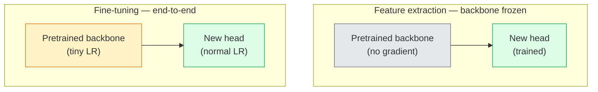

# स्थानांतरण सीखना और ठीक से ट्यूनिंग

> 其他人已经花了上百万GPU 小时,教会一个神经网络 识别边缘,纹理和物体部件是什么样子── 培训你自己的模型之前,你应该借这些功能──

**Type:** Build
**Languages:** Python
**Prerequisites:** Phase 4 Lesson 03 (CNNs), Phase 4 Lesson 04 (Image Classification)
**Time:** ~75 minutes

## 学习目标
- 区分 सुविधा निष्कर्षण 和 बारीक-ट्यूनिंग,并根据数据集的大小、域距离 和计算预算 选择合适方法
- पूर्व प्रशिक्षित रीढ़ की हड्डी को लोड करें, इसके वर्गीकरण सिर को प्रतिस्थापित करें, और 20 लाइनों के भीतर केवल प्रशिक्षण सिर प्राप्त करें
- उपयोग भेदभावपूर्ण सीखने की दर  चरणबद्ध स्तरों को हल करें, प्रारंभिक सामान्य सुविधाओं के अद्यतन की मात्रा को बाद के चरण के कार्य-विशिष्ट सुविधाओं से कम करें
- 诊断三类常见失败: अनफ्रीज ब्लॉक ऊपर LR 过高导致特征漂移、小数据集 上的BN आंकड़े कोल,以及灾难性遗忘

## 问题
ImageNet पर एक ResNet-50 को प्रशिक्षित करने के लिए लगभग 2,000 GPU-घंटे की आवश्यकता होती है। बहुत कम टीमें ऐसी बजट को पूरा कर सकती हैं जो प्रत्येक कार्य के लिए ऑनलाइन हो। लगभग सभी टीमें वास्तव में ऑनलाइन हैं, एक पूर्व-प्रशिक्षित रीढ़ की हड्डी के साथ एक नया सिर है, जबकि यह सिर कुछ सौ या हजारों कार्य-विशिष्ट छवियों में प्रशिक्षित है।

यह एक छोटा रास्ता नहीं है। ImageNet पर प्रशिक्षित किसी भी सीएनएन, इसके पहले conv ब्लॉक में शहर के सीखने के किनारे और Gabor के समान फ़िल्टर हैं। निम्नलिखित कुछ ब्लॉक में बनावट और सरल कारणों को सीखना है। मध्य ब्लॉक में आइटम भागों को सीखना है। अंतिम ब्लॉक में, 1,000 ImageNet श्रेणियों के संयोजन के करीब सीखना शुरू होता है। इस स्तर की संरचना का पहला 90% लगभग मूल रूप से चिकित्सा छवियों, औद्योगिक निरीक्षण, उपग्रह डेटा, और अन्य सभी कार्यों में स्थानांतरित किया जा सकता है।

अच्छा स्थानांतरण करना है तीन बग आप पर इंतजार कर रहे हैंः उच्च सीखने की दर के साथ पूर्व प्रशिक्षित सुविधाओं को नष्ट; 结过多导致模型 信息不足; BatchNorm के चल रहे आंकड़े 漂移到一个小数据集上, जबकि तंत्रिका नेटवर्क के बाकी भाग कभी भी इस डेटासेट से कुछ नहीं सीखा है।

## 概念
### विशेषताओं के लिए अनुकूलन

 दो प्रकार के मॉडल, आपके पास अधिक विश्वसनीय पूर्व-प्रशिक्षित विशेषताएं हैं, और आपके पास कितना डेटा है इस पर निर्भर करता है



经验法则:

| Dataset size | Domain distance | Recipe |
|--------------|-----------------|--------|
| < 1k images | 接近 ImageNet | 冻结 backbone，只训练 head |
| 1k-10k | 接近 | 冻结前 2-3 个 stages，fine-tune 其余部分 |
| 10k-100k | 任意 | 使用 discriminative LR 进行 end-to-end fine-tune |
| 100k+ | 远 | Fine-tune 全部参数；如果 domain 足够远，考虑从零训练 |

接近 ImageNet大致 मतलब है कि प्राकृतिक आरजीबी फ़ोटो में वस्तु जैसी सामग्री है― मेडिकल सीटी स्कैन, उपग्रह से उपग्रह की उपग्रह छवियां तथा सूक्ष्मदर्शी  दूर के डोमेन में हैं, सुविधाएँ  अभी भी उपयोगी हैं, लेकिन आपको अधिक परतों की अनुमति देने की आवश्यकता है 适应──

### ठंढने का काम क्यों होता है

सीएनएन ने सीएनएन के लिए सीखे गए इमेजनेट सुविधाएँ विशेष रूप से इन 1,000 श्रेणियों के लिए नहीं हैं। वे विशेष रूप से प्राकृतिक छवियों के सांख्यिकीय विशेषताओं के लिए अनुकूल हैंः विशिष्ट दिशाओं के किनारे, बनावट, विपरीत पैटर्न, आकार आदिमियां। ये सांख्यिकीय विशेषताएं लगभग हर दृश्य डोमेन में मानव द्वारा बताई गई हैं। यही कारण है कि इमेजनेट पर प्रशिक्षित एक मॉडल, CIFAR-10 पर शून्य-शॉट के नए मूल्यांकन में, केवल एक रैखिक सिर (असामान्य रूप से ठीक रीढ़ की हड्डी) को जोड़ने से 80%+ सटीकता प्राप्त हो सकती है।

### भेदभावपूर्ण सीखने की दरें

जब आप वास्तव में हल करते हैं, प्रारंभिक परतें  देर से परतों की तुलना में धीमी होनी चाहिए  प्रशिक्षण अधिक धीमी होना चाहिए।

```
Typical recipe:

  stage 0 (stem + first group): lr = base_lr / 100    (mostly fixed)
  stage 1:                       lr = base_lr / 10
  stage 2:                       lr = base_lr / 3
  stage 3 (last backbone group): lr = base_lr
  head:                          lr = base_lr  (or slightly higher)
```

PyTorch में, यह सिर्फ Optimizer के पैरामीटर समूहों को संचरण करता है 列表── एक मॉडल, पांच सीखने की दरें, शून्य अतिरिक्त कोड──

### बैचनॉर्म समस्या

बीएन परतों ImageNet पर गणना प्राप्त करने के लिए `running_mean`和 `running_var`बफरों── यदि आपके कार्य में अलग-अलग पिक्सेल वितरण है, जैसे कि अलग-अलग प्रकाश व्यवस्था, अलग-अलग सेंसर, अलग-अलग रंग स्थान, तो ये बफर गलत हैं── प्राथमिकता के अनुसार तीन विकल्प हैंः

1. **在 train mode 下 fine-tune BN。**让 BN 随其它部分一起更新运行统计――当任务数据集 中等大小(>= 5k उदाहरण)
2. **在 eval mode 下冻结 BN。**ImageNet के आंकड़ों को बनाए रखें, केवल वजन का प्रशिक्षण करें── जब आपका डेटासेट छोटा हो जाता है तो BN का चलती औसत 会很杂时,这是正确选择──
3. **用 GroupNorm 替换 BN。**完全移除 चलती-औसत 问题── प्रयोग में आयाम 很小──

यहाँ गलतियाँ करने से सटीकता घट जाती है 5-15%

### सिर का डिज़ाइन

वर्गीकरण सिर 1-3 रैखिक परतों के साथ एक वैकल्पिक ड्रॉपआउट है. प्रत्येक टर्चविजन रीढ़ की हड्डी एक डिफ़ॉल्ट सिर के साथ है, आप इसे बदलने की जरूरत हैः

```
backbone.fc = nn.Linear(backbone.fc.in_features, num_classes)          # ResNet
backbone.classifier[1] = nn.Linear(..., num_classes)                    # EfficientNet, MobileNet
backbone.heads.head = nn.Linear(..., num_classes)                       # torchvision ViT
```

 छोटों डेटासेट के लिए, एक एकल रैखिक परत आमतौर पर पर्याप्त है 😇 जब कार्य वितरण और रीढ़ की हड्डी का प्रशिक्षण वितरण 相距更远时, छिपे हुए परत जोड़ें  रैखिक -> रिलू -> ड्रॉपआउट -> रैखिक) मददगार होगा 😇

### परत-बुद्धिमान एलआर क्षय

यह आधुनिक ठीक-ठाक (बीईटी, डिनोव2, वियतनाम-बी) में इस्तेमाल होने वाले भेदभावपूर्ण एलआर का अधिक सस्ता संस्करण है।

```
lr_layer_k = base_lr * decay^(L - k)
```

जब क्षय = 0.75 且 L = 12 ट्रांसफार्मर ब्लॉक 时,第一个块的训练 LR 是头 LR 的 `0.75^11 ≈ 0.04x` यह ट्रांसफार्मर के लिए अधिक महत्वपूर्ण है CNN के लिए; सीएनएन के लिए, स्टेज-ग्रुप एलआर आमतौर पर पर्याप्त है

### क्या मूल्यांकन किया जाना चाहिए

स्थानांतरण-शिक्षा रन  दो आप खरोंच रन में नहीं ट्रैक करने के लिए नंबर की जरूरत हैः

- **Pretrained-only accuracy** रीढ़ 结时时头的精度──这是你的地板──
- **Fine-tuned accuracy** अंत-से-अंत प्रशिक्षण 后同一个模型的精度──这是你的天花板──

यदि ठीक-ठीक  से कम पूर्व-प्रशिक्षित  से, आप  के पास सीखने की दर या BN बग है


```figure
transfer-learning
```

##  इसे निर्माण
### 步骤 1: एक पूर्व प्रशिक्षित रीढ़ की हड्डी लोड करें और इसे निरीक्षण

```python
import torch
import torch.nn as nn
from torchvision.models import resnet18, ResNet18_Weights

backbone = resnet18(weights=ResNet18_Weights.IMAGENET1K_V1)
print(backbone)
print()
print("classifier head:", backbone.fc)
print("feature dim:", backbone.fc.in_features)
```

`ResNet18`वहाँ चार चरणों है`layer1..layer4`), एक स्टील और एक `fc`प्रत्येक मशाल दृष्टि वर्गीकरण रीढ़ की हड्डी में एक समान संरचना है।

### 步骤 2: सुविधा निकासी  सब कुछ जमे, सिर की जगह

```python
def make_feature_extractor(num_classes=10):
    model = resnet18(weights=ResNet18_Weights.IMAGENET1K_V1)
    for p in model.parameters():
        p.requires_grad = False
    model.fc = nn.Linear(model.fc.in_features, num_classes)
    return model

model = make_feature_extractor(num_classes=10)
trainable = sum(p.numel() for p in model.parameters() if p.requires_grad)
frozen = sum(p.numel() for p in model.parameters() if not p.requires_grad)
print(f"trainable: {trainable:>10,}")
print(f"frozen:    {frozen:>10,}")
```

 केवल `model.fc`यह प्रशिक्षित है। रीढ़ की हड्डी एक जमे हुए सुविधा निकालने वाला है।

### 步骤 3: भेदभावपूर्ण सूक्ष्म समायोजन

एक उपयोगिता, चरण-विशिष्ट सीखने की दरों के साथ पैरामीटर समूहों के निर्माण के लिए उपयोग किया जाता है।

```python
def discriminative_param_groups(model, base_lr=1e-3, decay=0.3):
    stages = [
        ["conv1", "bn1"],
        ["layer1"],
        ["layer2"],
        ["layer3"],
        ["layer4"],
        ["fc"],
    ]
    groups = []
    for i, names in enumerate(stages):
        lr = base_lr * (decay ** (len(stages) - 1 - i))
        params = [p for n, p in model.named_parameters()
                  if any(n.startswith(k) for k in names)]
        if params:
            groups.append({"params": params, "lr": lr, "name": "_".join(names)})
    return groups

model = resnet18(weights=ResNet18_Weights.IMAGENET1K_V1)
model.fc = nn.Linear(model.fc.in_features, 10)
for p in model.parameters():
    p.requires_grad = True

groups = discriminative_param_groups(model)
for g in groups:
    print(f"{g['name']:>10s}  lr={g['lr']:.2e}  params={sum(p.numel() for p in g['params']):>8,}")
```

`decay=0.3`प्रत्येक चरण की प्रशिक्षण दर अगले चरण का 30% है।`fc` प्राप्त `base_lr`,`layer4` प्राप्त `0.3 * base_lr`,`conv1` प्राप्त `0.3^5 * base_lr ≈ 0.00243 * base_lr` बहुत ही अच्छा लगता है; अनुभव पर यह वास्तव में प्रभावी है

### 步骤 4: बैचनॉर्म हैंडलिंग

प्रयोग करने के लिए बीएन चल रही आंकड़े और उसके वजन के सहायक नहीं结结

```python
def freeze_bn_stats(model):
    for m in model.modules():
        if isinstance(m, (nn.BatchNorm1d, nn.BatchNorm2d, nn.BatchNorm3d)):
            m.eval()
            for p in m.parameters():
                p.requires_grad = False
    return model
```

प्रत्येक युग में  प्रारंभ  समय सेट`model.train()`之后调用它──`model.train()`सभी सामग्री को प्रशिक्षण मोड में काट देगा; यह फ़ंक्शन केवल बीएन परतों पर विपरीत रूप से काट देगा।

### 步骤 5: एक न्यूनतम अंत-से-अंत बारीक-ट्यूनिंग लूप

```python
from torch.optim import SGD
from torch.utils.data import DataLoader
from torch.optim.lr_scheduler import CosineAnnealingLR
import torch.nn.functional as F

def fine_tune(model, train_loader, val_loader, device, epochs=5, base_lr=1e-3, freeze_bn=False):
    model = model.to(device)
    groups = discriminative_param_groups(model, base_lr=base_lr)
    optimizer = SGD(groups, momentum=0.9, weight_decay=1e-4, nesterov=True)
    scheduler = CosineAnnealingLR(optimizer, T_max=epochs)

    for epoch in range(epochs):
        model.train()
        if freeze_bn:
            freeze_bn_stats(model)
        tr_loss, tr_correct, tr_total = 0.0, 0, 0
        for x, y in train_loader:
            x, y = x.to(device), y.to(device)
            logits = model(x)
            loss = F.cross_entropy(logits, y, label_smoothing=0.1)
            optimizer.zero_grad()
            loss.backward()
            optimizer.step()
            tr_loss += loss.item() * x.size(0)
            tr_total += x.size(0)
            tr_correct += (logits.argmax(-1) == y).sum().item()
        scheduler.step()

        model.eval()
        va_total, va_correct = 0, 0
        with torch.no_grad():
            for x, y in val_loader:
                x, y = x.to(device), y.to(device)
                pred = model(x).argmax(-1)
                va_total += x.size(0)
                va_correct += (pred == y).sum().item()
        print(f"epoch {epoch}  train {tr_loss/tr_total:.3f}/{tr_correct/tr_total:.3f}  "
              f"val {va_correct/va_total:.3f}")
    return model
```

उपरोक्त नुस्खा का उपयोग करें CIFAR-10 में प्रशिक्षण शीर्ष पांच युगों, आप इसे डाल सकते हैं`ResNet18-IMAGENET1K_V1`लगभग 70% शून्य-शॉट रैखिक जांच सटीकता से बढ़कर लगभग 93% परिष्कृत सटीकता तक बढ़े़़। यदि केवल सिर को प्रशिक्षित किया जाए और पूरी तरह से रीढ़ की हड्डी न चलती रहे, तो सटीकता लगभग 86% होगी।

### 步骤 6: प्रगतिशील विसर्जन

एक प्रकार से अंत से पूर्व तक प्रत्येक युग 解一个阶段的时间表── यह अतिरिक्त युगों के लिए मूल्य में ढील सुविधा के लिए बहती है──

```python
def progressive_unfreeze_schedule(model):
    stages = ["layer4", "layer3", "layer2", "layer1"]
    yielded = set()

    def start():
        for p in model.parameters():
            p.requires_grad = False
        for p in model.fc.parameters():
            p.requires_grad = True

    def unfreeze(epoch):
        if epoch < len(stages):
            name = stages[epoch]
            yielded.add(name)
            for n, p in model.named_parameters():
                if n.startswith(name):
                    p.requires_grad = True
            return name
        return None

    return start, unfreeze
```

प्रथम युग में एक बार पहले से ही इस्तेमाल किया`start()`                                                                                                                                                                                                                                                              `unfreeze(epoch)` प्रत्येक समय जब प्रशिक्षित पैरामीटर 集合 occur change, तो हमें ऑप्टिमाइज़र को फिर से बनाना होगा, अन्यथा जमे हुए पैरामीटर  अभी भी कैश किए गए क्षणों को रखते हैं, इसे परेशान करेंगे

## इसका उपयोग करें
 अधिकांश वास्तविक कार्यों के लिए,`torchvision.models`अतिरिक्त कोड पर्याप्त है. उपर्युक्त अधिक भारी तंत्र, केवल तभी महत्वपूर्ण है जब आप पुस्तकालय डिफ़ॉल्ट समस्याओं का सामना करते हैं।

```python
from torchvision.models import resnet50, ResNet50_Weights

model = resnet50(weights=ResNet50_Weights.IMAGENET1K_V2)
model.fc = nn.Linear(model.fc.in_features, num_classes)
optimizer = torch.optim.AdamW(model.parameters(), lr=1e-4, weight_decay=1e-4)
```

 दो अन्य उत्पादन स्तर के डिफ़ॉल्टः

- `timm` लगभग 800  पूर्व प्रशिक्षित दृष्टि रीढ़ की हड्डी प्रदान करते हैं,并带有一致的API(`timm.create_model("resnet50", pretrained=True, num_classes=10)`)― टॉर्चविजन चिड़ियाघर के बाहर किसी भी बारीक-बारी से ट्यून के लिए, यह मानक विकल्प है―
- ् ट्रांस्फार्मर के लिए,`transformers.AutoModelForImageClassification.from_pretrained(name, num_labels=N)`मैं आपको ViT / BEiT / DeiT देता हूँ, और पाठ मॉडल के समान ही अर्थशास्त्र लोड करता हूँ

## 交付 यह
本课会产出:

- `outputs/prompt-fine-tune-planner.md` एक त्वरित, डेटासेट आकार, डोमेन दूरी और गणना बजट के आधार पर  फ़ीचर निष्कर्षण, प्रगतिशील ठीक-ठाक या अंत-से-अंत ठीक-ठाक चुनें
- `outputs/skill-freeze-inspector.md` एक कौशल, पायटॉर्च मॉडल  के बाद, रिपोर्ट करेगा कि कौन से पैरामीटर प्रशिक्षित हैं, कौन से बैचनॉर्म परतें  मूल्यांकन मोड में हैं, साथ ही ऑप्टिमाइज़र  क्या वास्तव में प्रशिक्षित पैरामीटर प्राप्त हुए हैं

## अभ्यास
1. **(Easy)**एक ही सिंथेटिक-CIFAR डेटासेट में ऊपर,`ResNet18`分别作为线性探测器(脊椎结结结) 和全细调 进行训练──并排报告两者精度──解释哪个缺口 说明特征转移 效果好,哪个缺口 说明效果不好──
2. **(Medium)**एक बग में लाने के लिए इरादा: ऊपर की रीढ़ की हड्डी स्टेज डाल `base_lr = 1e-1`, सिर ऊपर की बजाय. प्रशिक्षण हानि दिखाएँ. विस्फोट, फिर आवेदन के माध्यम से.`discriminative_param_groups`सहायक 恢复──记录每一个阶段 开始发散时的 LR──
3. **(Hard)**选取一个医学成像数据集 (उदाहरण के लिए CheXpert-small、PatchCamelyon 或 HAM10000),比较三种制度:(a) ImageNet-pretrained frozen backbone + linear head;(b) ImageNet-pretrained end-to-end fine-tune;(c) खरोंच प्रशिक्षण──报告每种方法的精度和计算成本──在什么数据集尺寸下, खरोंच प्रशिक्षण 开始具备竞争力?

## 关键术语
| Term | What people say | What it actually means |
|------|----------------|----------------------|
| Feature extraction | “Freeze and train head” | Backbone parameters 冻结，只有新的 classifier head 接收 Gradient |
| Fine-tuning | “Retrain end-to-end” | 所有 parameters 都 trainable，通常使用比 scratch training 小得多的 LR |
| Discriminative LR | “Smaller LR for early layers” | Optimizer parameter groups，其中 early-stage LR 是 late-stage LR 的一部分 |
| Layer-wise LR decay | “Smooth LR gradient” | 每层 LR 乘以 decay^(L - k)；常见于 transformer fine-tunes |
| Catastrophic forgetting | “The model lost ImageNet” | 过高 LR 在新任务信号被学到之前覆盖了 pretrained features |
| BN statistics drift | “Running mean is wrong” | BatchNorm running_mean/var 是在不同于当前任务的 distribution 上计算的，会悄悄损害 accuracy |
| Linear probe | “Frozen backbone + linear head” | 对 pretrained features 的评估，即 frozen representation 之上最佳 linear classifier 的 accuracy |
| Catastrophic collapse | “Everything predicts one class” | 当 fine-tuning 的 LR 高到在 head 的 Gradient 能稳定之前就破坏 features 时发生 |

## 延伸阅读
- [How transferable are features in deep neural networks? (Yosinski et al., 2014)](https://arxiv.org/abs/1411.1792) इस लेख में विभिन्न परतों के बीच हस्तांतरण क्षमता की विशेषताएं मापने की गई हैं
- [Universal Language Model Fine-tuning (ULMFiT, Howard & Ruder, 2018)](https://arxiv.org/abs/1801.06146) मूल भेदभावकारी एलआर / प्रगतिशील डिफ्रॉजिंग नुस्खा; ये विचार सीधे दृष्टि में स्थानांतरित किए जा सकते हैं
- [timm documentation](https://huggingface.co/docs/timm) 现代 दृष्टि रीढ़ की हड्डी 以及其 प्रशिक्षण时精确细调默认的参考
- [A Simple Framework for Linear-Probe Evaluation (Kornblith et al., 2019)](https://arxiv.org/abs/1805.08974) क्यों रैखिक जांच सटीकता  महत्वपूर्ण है, और कैसे सही ढंग से रिपोर्ट करने के लिए
