# 目标检测  शून्य से YOLO को प्राप्त करना

> पता लगाने है वर्गीकरण प्लस प्रतिगमन, सुविधा मानचित्र के प्रत्येक स्थान पर चलाने, फिर गैर-अधिकतम दमन के साथ 清理结果──

**类型：**构建
**语言：**पायथन
**前置要求：**चरण 4 पाठ 03 (सीएनएन), चरण 4 पाठ 04 (छवि वर्गीकरण), चरण 4 पाठ 05 (पहचाना सीखने)
**时间：** 75 मिनट

## 学习目标

-  समझाएँ ग्रिड-एंड-एंकर  कैसे डिझाइन करे  कैसे पता लगाने  घने भविष्यवाणी में परिवर्तित  समस्या,并说明输出テンसर 中每个数字的含义
- 计算 box  के बीच इंटरसेक्शन-ऑवर-यूनीयन,并从零实现非-मैक्सिमल सस्पेंशन
- पूर्व प्रशिक्षित रीढ़ की हड्डी पर एक न्यूनतम YOLO शैली के सिर का निर्माण, वर्गीकरण सहित √ वस्तु और बॉक्स-पतन हानि
- 读懂一行检测测测量(精度@0.5, remember, mAP@0.5, mAP@0.5:0.95),并判断下一步应该调整哪个扣

## 问题

वर्गीकरण 会说 यह张图是一只狗──Detection 会说在像素 (112, 40, 280, 210) 处有一只狗,在 (400, 180, 560, 310) 处有一只猫,画面中没有其他东西── यह संरचनात्मक परिवर्तन预测数量可变的带标签盒, बजाय प्रत्येक张图一个标签是每个自动驾驶系统、每个监控产品、每个文档布局解析器 和每个工厂视觉产线所依赖的能力──

डिटेक्शन भी है विज़ुअल में सभी इंजीनियरिंग लेने से एक साथ दिखाई देने वाली जगहों पर। आप चाहते हैं बॉक्स 准确(रिग्रेशन हेड), चाहते हैं प्रत्येक बॉक्स का वर्ग 正确(श्रेणीकरण हेड), चाहते हैं मॉडल जानता है कि जब कुछ भी नहीं है परीक्षण करने की आवश्यकता है ((ऑब्जेक्टिविटी स्कोर), भी चाहते हैं प्रत्येक वास्तविक वस्तु केवल एक भविष्यवाणी के लिए प्रतिक्रिया करते हैं ((नॉन-मैक्सिमल सस्पेंशन) ◊ किसी भी एक कड़ी में त्रुटि होती है, पाइपलाइन में किसी भी वस्तु का परीक्षण करने में विफल रहता है।

YOLO(You Only Look Once, Redmon et al. 2016) एक डिजाइन है, यह एक बार फिर से जा रहा है, जो एक बार फिर से जा रहा है।

## 概念

### पता लगाने  के रूप में घने भविष्यवाणी

वर्गीकरणकर्ता प्रत्येक 张图输出 C 个数字――YOLO 风格探测器 प्रत्येक 张图输出 `(S x S x (5 + C))`个数字, जिसमें से S है अंतरिक्ष ग्रिड आकार──

```mermaid
flowchart LR
    IMG["Input 416x416 RGB"] --> BB["Backbone<br/>(ResNet, DarkNet, ...)"]
    BB --> FM["Feature map<br/>(C_feat, 13, 13)"]
    FM --> HEAD["Detection head<br/>(1x1 convs)"]
    HEAD --> OUT["Output tensor<br/>(13, 13, B * (5 + C))"]
    OUT --> DEC["Decode<br/>(grid + sigmoid + exp)"]
    DEC --> NMS["Non-max suppression"]
    NMS --> RESULT["Final boxes"]

    style IMG fill:#dbeafe,stroke:#2563eb
    style HEAD fill:#fef3c7,stroke:#d97706
    style NMS fill:#fecaca,stroke:#dc2626
    style RESULT fill:#dcfce7,stroke:#16a34a
```



प्रत्येक `S * S`ग्रिड सेल 会预测 `B`个盒──对于每一个盒:

- 4 个数字描述几何信息:`tx, ty, tw, th`
- 1 个数字是对象性分数: क्या इस सेल में केंद्र में एक वस्तु है?
- C 个数字是类概率──

प्रत्येक सेल की कुल संख्याः`B * (5 + C)` VOC के लिए, यदि `S=13, B=2, C=20`, है प्रत्येक सेल 50 个数字.

### ग्रिड और एंकर क्यों चाहिए

朴素逆转会为每一个对象 预测绝对坐标形式的 `(x, y, w, h)` यह conv नेटवर्क के लिए कहना मुश्किल है, क्योंकि सममित छवि को सभी भविष्यवाणियों को सममित आकार के सभी वस्तुओं पर स्थित करने के लिए नहीं करना चाहिए 

एंकर  हल दूसरा प्रश्न──3x3 conv  बहुत मुश्किल से 16-पिक्सेल रिसेप्टिव फील्ड के फीचर सेल के भीतर रिग्रेशन 500-पिक्सेल चौड़ा बॉक्स से बाहर निकलना── इसलिए, हम प्रत्येक सेल में  पूर्वनिर्धारित `B`个先验盒形( anchors),并从每一个 anchor 预测小的 delta──模型学习选择正确的 anchor 并微调它,而不是从零回归──

```
Anchor box priors (example for 416x416 input):

  small:   (30,  60)
  medium:  (75,  170)
  large:   (200, 380)

At each grid cell, every anchor emits (tx, ty, tw, th, obj, c_1, ..., c_C).
```

आधुनिक डिटेक्टर आमतौर पर FPN का उपयोग करते हैं, विभिन्न संकल्पों में विभिन्न एंकर सेटों का उपयोग करते हैं 浅层高分辨率 मानचित्रों का उपयोग करते हैं 浅层高分辨率 मानचित्रों का उपयोग करते हैं 深层低分辨率 मानचित्रों का उपयोग करते हैं 浅层低分辨率 मानचित्रों का उपयोग करते हैं 浅层低分辨率 मानचित्रों का उपयोग करते हैं 浅层低分辨率 मानचित्रों का उपयोग करते हैं 浅层低分辨率 मानचित्रों का उपयोग करते हैं 浅层低分辨率 मानचित्रों का उपयोग करते हैं 浅层低分辨率 मानचित्रों का उपयोग करते हैं 浅层低分辨率 मानचित्रों का उपयोग करते हैं 浅层低分辨率 मानचित्रों का उपयोग करते हैं 浅层低分辨率 मानचित्रों का उपयोग करते हैं 浅层低分辨率 मानचित्रों का उपयोग करते हैं 浅层高分辨率 मानचित्रों का उपयोग करते हैं 浅层高分辨率

### 解码 भविष्यवाणियों

मूल `tx, ty, tw, th`यह बॉक्स निर्देशांक नहीं हैं; वे पूर्व-परिवर्तन के लिए आवश्यक हैं।

```
centre x  = (sigmoid(tx) + cell_x) * stride
centre y  = (sigmoid(ty) + cell_y) * stride
width     = anchor_w * exp(tw)
height    = anchor_h * exp(th)
```

`sigmoid`केंद्र की ओर मुड़कर सेल में ही सीमित करें`exp` चौड़ाई को एंकर से मुक्त रूप से संकुचित किया जा सकता है और कोई भी परिवर्तन नहीं होता है।`stride`इसे ग्रिड निर्देशांक को संकुचित करें पिक्सल में वापस करें. यह डिकोडिंग v2 से लेकर अब तक हर YOLO संस्करण में एक ही है.

### यूआई

डिटेक्शन में दो बॉक्स तुलनात्मकता के सामान्य माप का माप करेंः

```
IoU(A, B) = area(A intersect B) / area(A union B)
```

IoU = 1 पूरी तरह से समान है; IoU = 0 कोई ओवरलैप नहीं है; भविष्यवाणी और मूल सत्य बॉक्स के बीच IoU किसी भविष्यवाणी का निर्णय लेता है या नहीं, सही सकारात्मक गणना करना है।

### अधिकतम से बाहर दबाए जाने

आसन्न एंकरों में ऊपर प्रशिक्षण के conv नेटवर्क आमतौर पर एक ही वस्तु के लिए होगा  पूर्वानुमान ओवरले बॉक्स;;NMS बनाए रखने आत्मविश्वास उच्चतम भविष्यवाणी, और किसी भी IoU से अधिक मूल्य के अन्य भविष्यवाणी को हटाने;;

```
NMS(boxes, scores, iou_threshold):
    sort boxes by score descending
    keep = []
    while boxes not empty:
        pick the top-scoring box, add to keep
        remove every box with IoU > iou_threshold to the picked box
    return keep
```

典型值:ऑब्जेक्ट डिटेक्शन 中为0.45──近期探测器 会用 `soft-NMS``DIoU-NMS`替代标准 NMS, या सीधे सीखने के लिए दबाएं, लेकिन संरचनात्मक उद्देश्य समान है।

### हानि

यूलो हानि तीन भार भारोत्तोलन हानि है

```
L = lambda_coord * L_box(pred, target, where obj=1)
  + lambda_obj   * L_obj(pred, 1,     where obj=1)
  + lambda_noobj * L_obj(pred, 0,     where obj=0)
  + lambda_cls   * L_cls(pred, target, where obj=1)
```

只有包含对象的细胞 才会贡献框回归和分类损失──不含对象的细胞 只有贡献对象性损失──教模型保持沉默)──`lambda_noobj`सामान्यतः कम से कम 0.5 की तुलना में, क्योंकि अधिकांश कोशिकाएं खाली हैं, अन्यथा कुल हानि का नेतृत्व करेगी।

现代变体会把 MSE बॉक्स हानि 换成 CIoU / DIoU(直接优化 IoU), फोकल हानि 处理类失衡,并用质量焦点损失平衡对象性──三组件结构保持不变──

### पता लगाने की माप

सटीकता ️ सीधे पता लगाने में स्थानांतरित हो सकती है️ नीचे चार अंक हैंः

- **Precision@IoU=0.5** सकारात्मक होने के अनुमानों में, कुछ वास्तविक सत्य हैं
- **Recall@IoU=0.5** वास्तविक वस्तुओं में, हम बहुत कुछ पाया है
- **AP@0.5** IoU सीमा 0.5 下 सटीक-पुनर्प्राप्त वक्र का面积; प्रत्येक वर्ग एक एक संख्या
- **mAP@0.5:0.95**                                                                                                                                                                                                                                                              

चार आवश्यक रिपोर्टों। यदि एक डिटेक्टर mAP@0.5 में बहुत मजबूत है, लेकिन mAP@0.5:0.95 में बहुत कमजोर है, तो यह पता लगाएं कि स्थिति लगभग सही है, लेकिन पर्याप्त नहीं है; बेहतर बॉक्स-रिग्रेशन हानि के साथ 修复── यदि डिटेक्टर सटीकता उच्च है, तो यह पता लगाएं कि यह बहुत कम है; आत्मविश्वास की सीमा को कम या वस्तुत्व में वृद्धि 权重──


```figure
object-detection-nms
```

##  इसे निर्माण

### 步骤 1:

整节课的核心工具──作用于两个 `(x1, y1, x2, y2)`格式的盒 arrays──

```python
import numpy as np

def box_iou(boxes_a, boxes_b):
    ax1, ay1, ax2, ay2 = boxes_a[:, 0], boxes_a[:, 1], boxes_a[:, 2], boxes_a[:, 3]
    bx1, by1, bx2, by2 = boxes_b[:, 0], boxes_b[:, 1], boxes_b[:, 2], boxes_b[:, 3]

    inter_x1 = np.maximum(ax1[:, None], bx1[None, :])
    inter_y1 = np.maximum(ay1[:, None], by1[None, :])
    inter_x2 = np.minimum(ax2[:, None], bx2[None, :])
    inter_y2 = np.minimum(ay2[:, None], by2[None, :])

    inter_w = np.clip(inter_x2 - inter_x1, 0, None)
    inter_h = np.clip(inter_y2 - inter_y1, 0, None)
    inter = inter_w * inter_h

    area_a = (ax2 - ax1) * (ay2 - ay1)
    area_b = (bx2 - bx1) * (by2 - by1)
    union = area_a[:, None] + area_b[None, :] - inter
    return inter / np.clip(union, 1e-8, None)
```

 वापस एक `(N_a, N_b)`के जोड़ीबद्ध IoUs मैट्रिक्स── करना और एकल ग्राउंड-सत्य बॉक्स तुलना करते समय, उनमें से एक सरणी बनाने के रूप में `(1, 4)`

### 步骤 2: गैर अधिकतम दमन

```python
def nms(boxes, scores, iou_threshold=0.45):
    order = np.argsort(-scores)
    keep = []
    while len(order) > 0:
        i = order[0]
        keep.append(i)
        if len(order) == 1:
            break
        rest = order[1:]
        ious = box_iou(boxes[[i]], boxes[rest])[0]
        order = rest[ious <= iou_threshold]
    return np.array(keep, dtype=np.int64)
```

确定性实现, क्रमबद्धता लाया`O(N log N)` जटिलता, और एक ही इनपुट पर मेल खाती है `torchvision.ops.nms`का व्यवहार

### 步骤 3:बॉक्स एन्कोडिंग और डिकोडिंग

पिक्सेल निर्देशांक और नेटवर्क में  वास्तविक गिरावट का `(tx, ty, tw, th)`लक्ष्य 之间转换──

```python
def encode(box_xyxy, cell_x, cell_y, stride, anchor_wh):
    x1, y1, x2, y2 = box_xyxy
    cx = 0.5 * (x1 + x2)
    cy = 0.5 * (y1 + y2)
    w = x2 - x1
    h = y2 - y1
    tx = cx / stride - cell_x
    ty = cy / stride - cell_y
    tw = np.log(w / anchor_wh[0] + 1e-8)
    th = np.log(h / anchor_wh[1] + 1e-8)
    return np.array([tx, ty, tw, th])


def decode(tx_ty_tw_th, cell_x, cell_y, stride, anchor_wh):
    tx, ty, tw, th = tx_ty_tw_th
    cx = (sigmoid(tx) + cell_x) * stride
    cy = (sigmoid(ty) + cell_y) * stride
    w = anchor_wh[0] * np.exp(tw)
    h = anchor_wh[1] * np.exp(th)
    return np.array([cx - w / 2, cy - h / 2, cx + w / 2, cy + h / 2])


def sigmoid(x):
    return 1.0 / (1.0 + np.exp(-x))
```

测试:encode एक बॉक्स पुनः decodeआप मूल मूल्य के परिणाम के बहुत करीब प्राप्त करने में सक्षम होना चाहिए`tx`न कि सिग्मोइड के बाद के दायरे में, सिग्मोइड रिवर्स पूरी तरह से उलट नहीं होता है, इसलिए मामूली अंतर होता है)

### 步骤 4: एक न्यूनतम YOLO सिर

विशेषता मानचित्र ऊपर एक 1x1 कन्वर्ट, रीस्फॉर्म के लिए `(B, S, S, num_anchors, 5 + C)`

```python
import torch
import torch.nn as nn

class YOLOHead(nn.Module):
    def __init__(self, in_c, num_anchors, num_classes):
        super().__init__()
        self.num_anchors = num_anchors
        self.num_classes = num_classes
        self.conv = nn.Conv2d(in_c, num_anchors * (5 + num_classes), kernel_size=1)

    def forward(self, x):
        n, _, h, w = x.shape
        y = self.conv(x)
        y = y.view(n, self.num_anchors, 5 + self.num_classes, h, w)
        y = y.permute(0, 3, 4, 1, 2).contiguous()
        return y
```

输出 आकारः`(N, H, W, num_anchors, 5 + C)`                                                                                                                                                                                                                                                              `[tx, ty, tw, th, obj, cls_0, ..., cls_{C-1}]`

### 步骤 5:भू-सत्य का असाइनमेंट

 प्रत्येक मूल सत्य बॉक्स के लिए, निर्णय कौन `(cell, anchor)` जिम्मेदार यह 

```python
def assign_targets(boxes_xyxy, classes, anchors, stride, grid_size, num_classes):
    num_anchors = len(anchors)
    target = np.zeros((grid_size, grid_size, num_anchors, 5 + num_classes), dtype=np.float32)
    has_obj = np.zeros((grid_size, grid_size, num_anchors), dtype=bool)

    for box, cls in zip(boxes_xyxy, classes):
        x1, y1, x2, y2 = box
        cx, cy = 0.5 * (x1 + x2), 0.5 * (y1 + y2)
        gx, gy = int(cx / stride), int(cy / stride)
        bw, bh = x2 - x1, y2 - y1

        ious = np.array([
            (min(bw, aw) * min(bh, ah)) / (bw * bh + aw * ah - min(bw, aw) * min(bh, ah))
            for aw, ah in anchors
        ])
        best = int(np.argmax(ious))
        aw, ah = anchors[best]

        target[gy, gx, best, 0] = cx / stride - gx
        target[gy, gx, best, 1] = cy / stride - gy
        target[gy, gx, best, 2] = np.log(bw / aw + 1e-8)
        target[gy, gx, best, 3] = np.log(bh / ah + 1e-8)
        target[gy, gx, best, 4] = 1.0
        target[gy, gx, best, 5 + cls] = 1.0
        has_obj[gy, gx, best] = True
    return target, has_obj
```

एंकर चयन  मूल सत्य  के साथ  सर्वोत्तम आकार IoU यह एक सस्ता प्रॉक्सी है, जो YOLOv2/v3 के असाइनमेंट को मेल खाता है。v5 及后续版本使用更复杂的策略

### 步骤 6: तीन नुकसान

```python
def yolo_loss(pred, target, has_obj, lambda_coord=5.0, lambda_obj=1.0, lambda_noobj=0.5, lambda_cls=1.0):
    has_obj_t = torch.from_numpy(has_obj).bool()
    target_t = torch.from_numpy(target).float()

    # box-regression loss: only on cells with objects
    box_pred = pred[..., :4][has_obj_t]
    box_true = target_t[..., :4][has_obj_t]
    loss_box = torch.nn.functional.mse_loss(box_pred, box_true, reduction="sum")

    # objectness loss
    obj_pred = pred[..., 4]
    obj_true = target_t[..., 4]
    loss_obj_pos = torch.nn.functional.binary_cross_entropy_with_logits(
        obj_pred[has_obj_t], obj_true[has_obj_t], reduction="sum")
    loss_obj_neg = torch.nn.functional.binary_cross_entropy_with_logits(
        obj_pred[~has_obj_t], obj_true[~has_obj_t], reduction="sum")

    # classification loss on cells with objects
    cls_pred = pred[..., 5:][has_obj_t]
    cls_true = target_t[..., 5:][has_obj_t]
    loss_cls = torch.nn.functional.binary_cross_entropy_with_logits(
        cls_pred, cls_true, reduction="sum")

    total = (lambda_coord * loss_box
             + lambda_obj * loss_obj_pos
             + lambda_noobj * loss_obj_neg
             + lambda_cls * loss_cls)
    return total, {"box": loss_box.item(), "obj_pos": loss_obj_pos.item(),
                   "obj_neg": loss_obj_neg.item(), "cls": loss_cls.item()}
```

五个超参数, प्रत्येक YOLO ट्यूटोरियल 五个超参数, प्रत्येक YOLO ट्यूटोरियल 五个超参数, प्रत्येक YOLO ट्यूटोरियल 五个超参数, प्रत्येक YOLO ट्यूटोरियल 五个超参数, प्रत्येक YOLO ट्यूटोरियल 五个超参数, प्रत्येक YOLO ट्यूटोरियल 五个超参数, प्रत्येक YOLO ट्यूटोरियल 五个超参数, प्रत्येक YOLO ट्यूटोरियल 五个超参数, प्रत्येक YOLO ट्यूटोरियल 五个超参数, प्रत्येक YOLO ट्यूटोरियल 五个超参数`lambda_coord=5, lambda_noobj=0.5`मूल YOLOv1 पेपर के लिए, और आज भी उचित मान है।

### 步骤 7: इन्फेरेंस पाइपलाइन

डिकोड 原始 सिर आउटपुट, अप्लाई सिग्मोइड/एक्सपी, वस्तुत्व सीमा 过 के अनुसार, फिर एनएमएस निष्पादित करें。

```python
def postprocess(pred_tensor, anchors, stride, img_size, conf_threshold=0.25, iou_threshold=0.45):
    pred = pred_tensor.detach().cpu().numpy()
    grid_h, grid_w = pred.shape[1], pred.shape[2]
    num_anchors = len(anchors)

    boxes, scores, classes = [], [], []
    for gy in range(grid_h):
        for gx in range(grid_w):
            for a in range(num_anchors):
                tx, ty, tw, th, obj, *cls = pred[0, gy, gx, a]
                score = sigmoid(obj) * sigmoid(np.array(cls)).max()
                if score < conf_threshold:
                    continue
                cls_idx = int(np.argmax(cls))
                cx = (sigmoid(tx) + gx) * stride
                cy = (sigmoid(ty) + gy) * stride
                w = anchors[a][0] * np.exp(tw)
                h = anchors[a][1] * np.exp(th)
                boxes.append([cx - w / 2, cy - h / 2, cx + w / 2, cy + h / 2])
                scores.append(float(score))
                classes.append(cls_idx)

    if not boxes:
        return np.zeros((0, 4)), np.zeros((0,)), np.zeros((0,), dtype=int)
    boxes = np.array(boxes)
    scores = np.array(scores)
    classes = np.array(classes)
    keep = nms(boxes, scores, iou_threshold)
    return boxes[keep], scores[keep], classes[keep]
```

यही है पूर्ण मूल्यांकन पथः सिर -> डिकोड -> सीमा -> एनएमएस。

## इसका उपयोग करें

`torchvision.models.detection` एक ही अवधारणा संरचना के साथ उत्पादन स्तर डिटेक्टर प्रदान किए गए 

```python
import torch
from torchvision.models.detection import fasterrcnn_resnet50_fpn_v2

model = fasterrcnn_resnet50_fpn_v2(weights="DEFAULT")
model.eval()
with torch.no_grad():
    predictions = model([torch.randn(3, 400, 600)])
print(predictions[0].keys())
print(f"boxes:  {predictions[0]['boxes'].shape}")
print(f"scores: {predictions[0]['scores'].shape}")
print(f"labels: {predictions[0]['labels'].shape}")
```

रियल टाइम इन्फेरेंस पाइपलाइन के लिए,`ultralytics`(YOLOv8/v9) है मानक चयन:`from ultralytics import YOLO; model = YOLO('yolov8n.pt'); model(img)`◊ मॉडल आंतरिक रूप से डीकोडिंग और एनएमएस को संसाधित करेगा, और आपके ऊपर निर्मित के समान वापस आ जाएगा `boxes / scores / labels`तीनों समूहों

## 交付 यह

本课会产出:

- `outputs/prompt-detection-metric-reader.md` एक शीघ्र,把一行 `precision, recall, AP, mAP@0.5:0.95`转换为一句诊断和最有用的下一个实验──
- `outputs/skill-anchor-designer.md` एक कौशल, दिए गए मूल-सत्य बक्से डेटा संग्रह के बाद, `(w, h)`上运行 k-means,并返回 प्रत्येक FPN स्तर के एंकर सेट तथा सही एंकर का चयन करें संख्या आवश्यक कवरेज आँकड़े

## अभ्यास

1. **（简单）**实现 `box_iou`, और 1,000 组随机 बॉक्स जोड़े ऊपर और `torchvision.ops.box_iou`तुलना हेतु हेतु--परीक्षण हेतु अधिकतम पूर्ण भिन्नता से छोटा है।`1e-6`
2. **（中等）**`yolo_loss`移植为使用 `CIoU`बॉक्स हानि नहीं MSE का संस्करण है। एक 100 छवि सिंथेटिक डेटासेट में ऊपर दिखाएँः उसी युग में संख्याओं के नीचे, CIoU MSE से बेहतर प्राप्त करने के लिए अंतिम mAP@0.5:0.95。
3. **（困难）**实现 बहु-स्केल inference:以三种分辨率将同一图像输入模型,合并框预测,并最后运行一次NMS──在持久的集合上测量相比单-स्केल inference 的mAP 提升──

## 关键术语

| Term | 人们怎么说 | 它实际是什么意思 |
|------|----------------|----------------------|
| Anchor | “Box prior” | 每个 grid cell 上的预定义 box shape，network 从中预测 deltas，而不是预测绝对坐标 |
| IoU | “Overlap” | 两个 box 的 Intersection-over-union；detection 中通用的相似度度量 |
| NMS | “Deduplicate” | 贪心算法，保留最高分 predictions，并移除高于阈值的重叠 predictions |
| Objectness | “Is there something here” | 每个 anchor、每个 cell 的 scalar，用于预测是否有 object 的中心落在该 cell 中 |
| Grid stride | “Downsample factor” | 每个 grid cell 对应的 pixels 数；416-px input 配 13-grid head 时 stride 为 32 |
| mAP | “Mean average precision” | precision-recall curve 下方面积的平均值，对 classes 求平均，并且（对 COCO）也对 IoU thresholds 求平均 |
| AP@0.5 | “PASCAL VOC AP” | IoU threshold 0.5 下的 average precision；该 metric 的宽松版本 |
| mAP@0.5:0.95 | “COCO AP” | 在 IoU thresholds 0.5..0.95、步长 0.05 上求平均；严格版本，也是当前社区标准 |

## 延伸阅读

- [YOLOv1: You Only Look Once (Redmon et al., 2016)](https://arxiv.org/abs/1506.02640)  आधारभूत कागज; इसके बाद के प्रत्येक युग में इस संरचना में सुधार हुआ है।
- [YOLOv3 (Redmon & Farhadi, 2018)](https://arxiv.org/abs/1804.02767)  बहु-पैमाना FPN शैली के सिरों के पेपर की शुरूआत; आज तक अभी भी सबसे स्पष्ट आरेख है
- [Ultralytics YOLOv8 docs](https://docs.ultralytics.com) 当前生产参考; डेटासेट प्रारूपों, वृद्धि, प्रशिक्षण व्यंजनों को कवर
- [The Illustrated Guide to Object Detection (Jonathan Hui)](https://jonathan-hui.medium.com/object-detection-series-24d03a12f904) पूर्ण डिटेक्टर चिड़ियाघर के लिए सबसे अच्छा सादा अंग्रेजी 导览; DETR、RetinaNet、FCOS और YOLO के बीच संबंधों को समझने के लिए बहुत मूल्यवान है
