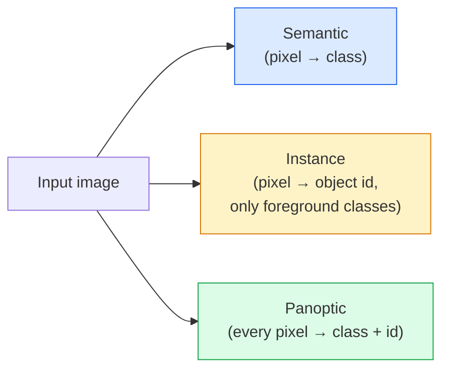
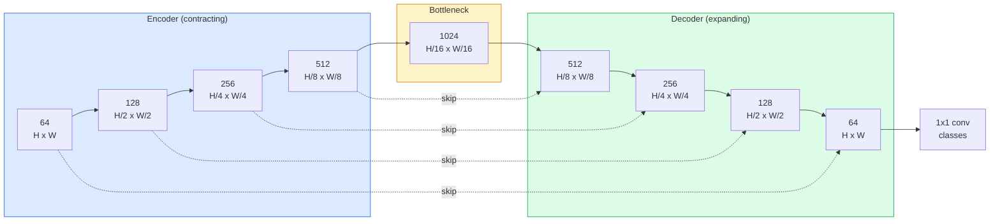

# अर्थशास्त्र खंडन  यू-नेट

> विभाजन प्रत्येक पिक्सेल पर होता है  वर्गीकरण किया जाता है  यू-नेट  से नीचे नमूना एन्कोडर और ऊपर नमूना डिकोडर 配对, और दोनों के बीच कनेक्शन छोड़ने कनेक्शन, इस बात को संभव बना देता है 

**Type:** Build
**Languages:** Python
**Prerequisites:** Phase 4 Lesson 03 (CNNs), Phase 4 Lesson 04 (Image Classification)
**Time:** ~75 minutes

## 学习目标
- 区分语义、实例和泛光分区,并为给定问题选择正确任务
- PyTorch में शून्य से U-Net का निर्माण, जिसमें एन्कोडर ब्लॉक, बोतल गला, ट्रांसपोस्टेड कन्वॉल्यूशन के साथ डिकोडर, साथ ही स्kip कनेक्शन शामिल हैं
- पिक्सेल-बुद्धिमान क्रॉस-एंट्रोपी ∆इस हानि, तथा वर्तमान चिकित्सा एवं औद्योगिक विभाजन के लिए एक निश्चित संयुक्त हानि को प्राप्त करना
- 按类 解读 IoU 和 Dice माप,并诊断低分是来自小物体回忆、边界精度,还是类失衡

## 问题
वर्गीकरण प्रति प्रति छवि 输出一个标签――检测对每张图像 输出少量框―― 分类对每像素 输出一个标签――对大小为`H x W`                                                                                                                                                                                                                                                              `H x W`(सार्थक) या `H x W x N_instances`(उदाहरण) के टेंसर. इसका मतलब है कि प्रत्येक छवि में एक के बजाय लाखों भविष्यवाणियां हैं.

खंडन के ढांचे ने समझाया कि यह लगभग सभी घने भविष्यवाणी दृष्टि का समर्थन क्यों करता है।

架构问题说起来简单,但解决起来不简单:你需要网络同时看图片的全球背景(यह किस प्रकार का दृश्य है) और स्थानीय पिक्सेल विवरण(究竟哪个像素是道路,哪个是路面) 标准 CNN会在空间维度上压缩以获得背景,但这会丢失――U-Net是同时获得者的设计――

## 概念
### 语义 vs 实例 vs 全景



- **Semantic**यह पिक्सेल सड़क है, वह पिक्सेल कार है।
- **Instance**यह पिक्सेल कार # 3 है, वह पिक्सेल कार # 5 है।
- **Panoptic**एक साथ आने वाले दोः प्रत्येक पिक्सेल एक वर्ग लेबल मिलता है, प्रत्येक उदाहरण एक अद्वितीय आईडी मिलता है, चीजें और चीजें सेगमेंट किया जाता है.

本课涵盖语义――下一课(Mask R-CNN)

### यू-नेट का आकार



एन्कोडर अंतरिक्ष रिज़ॉल्यूशन  आधा चार बार,并将频道 翻倍──Decoder 反向执行:将空间 रिज़ॉल्यूशन 翻倍四次,并将频道 减半──Skip connections 会在每个分辨率上将匹配的编码功能与解码功能 进行连接──最终的1x1 conv 在全分辨率下将`64 -> num_classes`

क्यों कनेक्शन को छोड़ना आवश्यक हैः जब डिकोडर पिक्सेल स्तर की भविष्यवाणियों को आउटपुट करने का प्रयास करता है, तो यह केवल बहुत छोटे फीचर मैप्स देखता है। कोई कूद नहीं करता है, यह किनारों को ठीक से पता नहीं लगा सकता है, क्योंकि ये जानकारी पहले से ही एन्कोडर में संपीड़ित हो चुकी है।

### ट्रांसपोस्टेड बनाम द्विआधारी उप-सैंपल

डेकोडर ं स्थानिक आयामों का विस्तार करना होगा 

- **Transposed convolution**(`nn.ConvTranspose2d`) 可学习的 upsample── ऐतिहासिक यू-नेट 默认方案── यदि कदम और नाभिक आकार नहीं हो सकता है, तो संभव है कि चेकरबोर्ड कलाकृतियाँ उत्पन्न हों──
- **Bilinear upsample + 3x3 conv** 平滑 upsample 后接一个 conv── कलाकृतियाँ, कम से कम, पैरामीटर, कम से कम,现在是现代默认方案──

द्वितीय, वास्तविक परियोजनाओं में से सभी को देखा जा सकता है।

### पिक्सेल ग्रिड ऊपर की क्रॉस-एंट्रोपी

 C 个 वर्गों के समावेशी विभाजन के लिए, मॉडल आउटपुट `(N, C, H, W)` लक्ष्य `(N, H, W)`, पूर्ण संख्या वर्ग आईडी शामिल है। क्रॉस-एंट्रोपी वर्गीकरण के साथ पूरी तरह से एक ही परिदृश्य है, केवल प्रत्येक स्थानिक स्थिति पर लागूः

```
Loss = mean over (n, h, w) of -log( softmax(logits[n, :, h, w])[target[n, h, w]] )
```

पिटर्च 中的 `F.cross_entropy`इस तरह के आकार को पुनः आकार देने की आवश्यकता नहीं है।

### Dice हानि और क्यों इसकी जरूरत है

क्रॉस-एंट्रोपी  बराबर प्रतिबिंबित प्रत्येक पिक्सेल  जब एक वर्ग 占据 फ्रेम का绝大部分 समय, यह गलत है मेडिकल इमेजिंग:99% पृष्ठभूमि, 1% ट्यूमर)  नेटवर्क सभी स्थानों पर पूर्वानुमान पृष्ठभूमि  99% सटीकता प्राप्त कर सकते हैं, लेकिन अभी भी बेकार है

डायस हानि  प्रत्यक्ष अनुकूलन भविष्यवाणी मास्क और वास्तविक मास्क  के बीच ओवरलैप करने के लिए इस समस्या को हल करने के लिएः

```
Dice(p, y) = 2 * sum(p * y) / (sum(p) + sum(y) + epsilon)
Dice_loss = 1 - Dice
```

उनमें से `p`यह एक वर्ग का सिग्मोइड/सॉफ्टमैक्स संभावना मानचित्र है,`y`यह द्विआधारी मूल सत्य का मुखौटा है। केवल जब यह ओवरलैप होता है, तो ही हानि शून्य होती है।

实践中, उपयोग **combined loss**:

```
L = L_cross_entropy + lambda * L_dice       (lambda ~ 1)
```

क्रॉस-एंट्रोपी प्रारंभिक प्रशिक्षण स्थिर ग्रेडिएंट प्रदान करना डिसे प्रशिक्षण 后段焦点在真正匹配面具形上―― यह संयोजन चिकित्सा-छविकरण का एक मानक पैटर्न है, किसी भी वर्ग-अंतुलित डेटासेट में 上都很难被超越──

### मूल्यांकन मेट्रिक्स

- **Pixel accuracy** 预测 सही पिक्सल 百分比──计算便宜──与分类中精度一样, असंतुलित डेटा上会失效──
- **IoU per class** प्रत्येक वर्ग मुखौटा का संघ पर चौराहा; वर्गों के पार 求平均 = mIoU。
- **Dice (F1 on pixels)** 类似 IoU;`Dice = 2 * IoU / (1 + IoU)`❖ चिकित्सा इमेजिंग, अधिक प्राथमिकता दीजिये, ड्राइविंग समुदाय, अधिक प्राथमिकता दीजिये;
- **Boundary F1**                                                                                                                                                                                                                                                              

️ प्रति वर्ग आईओयू की रिपोर्ट करें, न कि केवल एमओयू। ️ औसत आईओयू एक वर्ग को केवल 15% कवर करेगा, जबकि अन्य नौ वर्गों में 85% की स्थिति है।

### इनपुट संकल्प 权衡

यू-नेट का एन्कोडर रिज़ॉल्यूशन ढ़ाई गुना कम करेगा, इसलिए इनपुट  को 16 整除能被  किया जाना चाहिए।`H * W * C_max`缩放,在1024x1024 且瓶门为1024 时,前进通过 已经会使用数 GB VRAM──

दो मानक उपायः
1. इनपुट  处理带 ओवरलैप की 256x256 टाइलें टाइल, फिर सिलाई
2. विस्तारित घुमावों का उपयोग करके बोतल के गले को प्रतिस्थापित करें, एक ही समय में अधिक स्थानिक संकल्प बनाए रखने के साथ ही रिसेप्टिव क्षेत्र का विस्तार करें।

पहले मॉडल के लिए, 256x256 इनपुट और 64-चैनल-बेस यू-नेट का उपयोग करके 8 जीबी वीआरएएम पर आरामदायक प्रशिक्षण प्राप्त किया जा सकता है


```figure
segmentation-flood
```

##  इसे निर्माण
### 步骤 1: एन्कोडर ब्लॉक

两个3x3 कन्भ,带批量规范和 ReLU――第一 conv 改变频道数;第二保持不变――

```python
import torch
import torch.nn as nn
import torch.nn.functional as F

class DoubleConv(nn.Module):
    def __init__(self, in_c, out_c):
        super().__init__()
        self.net = nn.Sequential(
            nn.Conv2d(in_c, out_c, kernel_size=3, padding=1, bias=False),
            nn.BatchNorm2d(out_c),
            nn.ReLU(inplace=True),
            nn.Conv2d(out_c, out_c, kernel_size=3, padding=1, bias=False),
            nn.BatchNorm2d(out_c),
            nn.ReLU(inplace=True),
        )

    def forward(self, x):
        return self.net(x)
```

यह ब्लॉक पूरे समय में पुनः उपयोग किया जाएगा`bias=False`क्योंकि बीएन का बीटा ने पूर्वाग्रह को संभाल लिया है।

### 步骤 2: नीचे और ऊपर ब्लॉक

```python
class Down(nn.Module):
    def __init__(self, in_c, out_c):
        super().__init__()
        self.net = nn.Sequential(
            nn.MaxPool2d(2),
            DoubleConv(in_c, out_c),
        )

    def forward(self, x):
        return self.net(x)


class Up(nn.Module):
    def __init__(self, in_c, out_c):
        super().__init__()
        self.up = nn.Upsample(scale_factor=2, mode="bilinear", align_corners=False)
        self.conv = DoubleConv(in_c, out_c)

    def forward(self, x, skip):
        x = self.up(x)
        if x.shape[-2:] != skip.shape[-2:]:
            x = F.interpolate(x, size=skip.shape[-2:], mode="bilinear", align_corners=False)
        x = torch.cat([skip, x], dim=1)
        return self.conv(x)
```

只检查空间形(`shape[-2:]`) आकारों को संसाधित किया जा सकता है 16 整除的输入; एक सुरक्षित `F.interpolate`एक संक्षिप्त पूर्व-प्रति-पक्षीय tensor── पूर्ण आकार की तुलना में भी चैनल-कंट अंतर 触发, जबकि इस प्रकार के अंतर को स्पष्ट रूप से गलत होना चाहिए, चुपचाप इंटरपोलेट नहीं किया जाना चाहिए──

### 步骤 3: यू-नेट

```python
class UNet(nn.Module):
    def __init__(self, in_channels=3, num_classes=2, base=64):
        super().__init__()
        self.inc = DoubleConv(in_channels, base)
        self.d1 = Down(base, base * 2)
        self.d2 = Down(base * 2, base * 4)
        self.d3 = Down(base * 4, base * 8)
        self.d4 = Down(base * 8, base * 16)
        self.u1 = Up(base * 16 + base * 8, base * 8)
        self.u2 = Up(base * 8 + base * 4, base * 4)
        self.u3 = Up(base * 4 + base * 2, base * 2)
        self.u4 = Up(base * 2 + base, base)
        self.outc = nn.Conv2d(base, num_classes, kernel_size=1)

    def forward(self, x):
        x1 = self.inc(x)
        x2 = self.d1(x1)
        x3 = self.d2(x2)
        x4 = self.d3(x3)
        x5 = self.d4(x4)
        x = self.u1(x5, x4)
        x = self.u2(x, x3)
        x = self.u3(x, x2)
        x = self.u4(x, x1)
        return self.outc(x)

net = UNet(in_channels=3, num_classes=2, base=32)
x = torch.randn(1, 3, 256, 256)
print(f"output: {net(x).shape}")
print(f"params: {sum(p.numel() for p in net.parameters()):,}")
```

आउटपुट आकार `(1, 2, 256, 256)` इनपुट के स्थानिक आकार के बराबर, समाहित `num_classes`个频道──在 `base=32`时约7.7M पैरामीटर

### 步骤 4: नुकसान

```python
def dice_loss(logits, targets, num_classes, eps=1e-6):
    probs = F.softmax(logits, dim=1)
    targets_one_hot = F.one_hot(targets, num_classes).permute(0, 3, 1, 2).float()
    dims = (0, 2, 3)
    intersection = (probs * targets_one_hot).sum(dim=dims)
    denom = probs.sum(dim=dims) + targets_one_hot.sum(dim=dims)
    dice = (2 * intersection + eps) / (denom + eps)
    return 1 - dice.mean()


def combined_loss(logits, targets, num_classes, lam=1.0):
    ce = F.cross_entropy(logits, targets)
    dc = dice_loss(logits, targets, num_classes)
    return ce + lam * dc, {"ce": ce.item(), "dice": dc.item()}
```

वर्ग के अनुसार Dice 计算后再平均 (मैक्रो Dice)`eps`防止 बैच 中缺失 कुछ वर्ग 时出现除零──

### 步骤 5: आईओयू मेट्रिक

```python
@torch.no_grad()
def iou_per_class(logits, targets, num_classes):
    preds = logits.argmax(dim=1)
    ious = torch.zeros(num_classes)
    for c in range(num_classes):
        pred_c = (preds == c)
        true_c = (targets == c)
        inter = (pred_c & true_c).sum().float()
        union = (pred_c | true_c).sum().float()
        ious[c] = (inter / union) if union > 0 else torch.tensor(float("nan"))
    return ious
```

返回长度为 C का वेक्टर──`nan`标记批 中缺失类  计算 mIoU 时不要把这些值纳入平均――

### 步骤 6: अंत-से-अंत सत्यापन के लिए सिंथेटिक डेटासेट

रंगीन पृष्ठभूमि में आकार उत्पन्न करें, नेटवर्क को पिक्सेल रंग के बजाय आकार सीखना होगा

```python
import numpy as np
from torch.utils.data import Dataset, DataLoader

def synthetic_segmentation(num_samples=200, size=64, seed=0):
    rng = np.random.default_rng(seed)
    images = np.zeros((num_samples, size, size, 3), dtype=np.float32)
    masks = np.zeros((num_samples, size, size), dtype=np.int64)
    for i in range(num_samples):
        bg = rng.uniform(0, 1, (3,))
        images[i] = bg
        masks[i] = 0
        num_shapes = rng.integers(1, 4)
        for _ in range(num_shapes):
            cls = int(rng.integers(1, 3))
            color = rng.uniform(0, 1, (3,))
            cx, cy = rng.integers(10, size - 10, size=2)
            r = int(rng.integers(4, 12))
            yy, xx = np.meshgrid(np.arange(size), np.arange(size), indexing="ij")
            if cls == 1:
                mask = (xx - cx) ** 2 + (yy - cy) ** 2 < r ** 2
            else:
                mask = (np.abs(xx - cx) < r) & (np.abs(yy - cy) < r)
            images[i][mask] = color
            masks[i][mask] = cls
        images[i] += rng.normal(0, 0.02, images[i].shape)
        images[i] = np.clip(images[i], 0, 1)
    return images, masks


class SegDataset(Dataset):
    def __init__(self, images, masks):
        self.images = images
        self.masks = masks

    def __len__(self):
        return len(self.images)

    def __getitem__(self, i):
        img = torch.from_numpy(self.images[i]).permute(2, 0, 1).float()
        mask = torch.from_numpy(self.masks[i]).long()
        return img, mask
```

तीन वर्गः पृष्ठभूमि (0) 、 वृत्त (1) 、 वर्ग (2) ⋅ नेटवर्क 必須学会区分形──

### 步骤 7: प्रशिक्षण लूप

```python
def train_one_epoch(model, loader, optimizer, device, num_classes):
    model.train()
    loss_sum, total = 0.0, 0
    iou_sum = torch.zeros(num_classes)
    for x, y in loader:
        x, y = x.to(device), y.to(device)
        logits = model(x)
        loss, _ = combined_loss(logits, y, num_classes)
        optimizer.zero_grad()
        loss.backward()
        optimizer.step()
        loss_sum += loss.item() * x.size(0)
        total += x.size(0)
        iou_sum += iou_per_class(logits, y, num_classes).nan_to_num(0)
    return loss_sum / total, iou_sum / len(loader)
```

संश्लेषण डेटासेट में 10-30 युगों 上运行, observe आकार वर्गों के mIoU 爬升到0.9 以上──注意,`nan_to_num(0)`                                                                                                                                                                                                                                                              `torch.nanmean`, बजाय यहाँ सीधे औसत

## इसका उपयोग करें
 उत्पादन के लिए,`segmentation_models_pytorch`("smp") के साथ किसी भी टॉर्चविजन या टाइमबोन 封装了所有标准分割架构──三行代码:

```python
import segmentation_models_pytorch as smp

model = smp.Unet(
    encoder_name="resnet34",
    encoder_weights="imagenet",
    in_channels=3,
    classes=3,
)
```

实际工作中 यह भी जानना आवश्यक हैः
- **DeepLabV3+**विस्तारित कंसों का उपयोग करें प्लान्ट करें अधिकतम पूल के आधार पर डाउनसैम्पिंग, ताकि बोतल गला  रज़िओल्यूशन बनाए रखें; उपग्रह में और ड्राइविंग डेटा 上边界更快──
- **SegFormer**कन्वर्ट एन्कोडर को पदानुक्रमिक ट्रांसफार्मर के रूप में बदलना; कई बेंचमार्क में ऊपर वर्तमान SOTA है।
- **Mask2Former**/**OneFormer**में एक एक वास्तुकला 中统一语义、उदाहरण 和泛光分区――

यह तीनों में है`smp`या `transformers`इसमें सभी एक ही डेटा लोडर का उपयोग करके, एक ड्रॉप-इन प्रतिस्थापन के रूप में इस्तेमाल किया जा सकता है।

## 交付 यह
本课产出:

- `outputs/prompt-segmentation-task-picker.md` एक संकेत, जिसका उपयोग अर्थपूर्ण ∞ उदाहरण और पैनप्टिक खंडन ∞ के बीच चयन करने के लिए किया जाता है,并为给定任务命名架构──
- `outputs/skill-segmentation-mask-inspector.md` एक कौशल, वर्ग वितरण, पूर्वानुमानित-मास्क आंकड़ों, साथ ही कम पूर्वानुमानित या सीमा-मूर्ख वर्गों की रिपोर्ट करने के लिए उपयोग किया जाता है

## अभ्यास
1. **(Easy)** द्विआधारी विभाजन कार्य (पूर्वभूमि बनाम पृष्ठभूमि) को प्राप्त करना `bce_dice_loss` सिंथेटिक दो-वर्ग डेटासेट में, अग्रभूमि में केवल 5% पिक्सेल , संयुक्त हानि से अलग BCE 收更快
2. **(Medium)**`nn.Upsample + conv`अप-ब्लॉक 替换为 `nn.ConvTranspose2d`up-block──在合成数据集上训练二者并比较 mIoU──观察转载-conv 版本中棋盘文物 出现位置──
3. **(Hard)**选取一个真实分区数据集(ऑक्सफोर्ड-IIIT पालतू जानवर, सिटीस्केप मिनी स्प्लिट, या एक चिकित्सा उपसमूह),并将 U-Net 训练到距离 `smp.Unet`संदर्भ 2  IoU अंक से अधिक नहीं  प्रति वर्ग IoU रिपोर्ट,并识别哪些 वर्ग से हानि में शामिल हों 

## 关键术语
| Term | What people say | What it actually means |
|------|----------------|----------------------|
| Semantic segmentation | “标注每个 pixel” | 对每个 pixel 进行 C classes 的 Classification；同一 class 的 instances 会合并 |
| Instance segmentation | “标注每个 object” | 分离同一 class 的不同 instances；仅 foreground |
| Panoptic segmentation | “Semantic + instance” | 每个 pixel 得到一个 class；每个 thing instance 还得到一个唯一 id |
| Skip connection | “U-Net bridge” | 将 encoder features concatenate 到匹配 resolution 的 decoder features 中；保留 high-frequency detail |
| Transposed conv | “Deconvolution” | 可学习的 upsampling；可能产生 checkerboard artifacts |
| Dice loss | “Overlap loss” | 1 - 2|A ∩ B| / (|A| + |B|)；直接优化 mask overlap，并且对 class imbalance 鲁棒 |
| mIoU | “Mean intersection over union” | 跨 classes 平均 IoU；segmentation 的 community-standard metric |
| Boundary F1 | “Boundary accuracy” | 只在 boundary pixels 上计算的 F1 score；对 precision-critical tasks 很重要 |

## 延伸阅读
- [U-Net: Convolutional Networks for Biomedical Image Segmentation (Ronneberger et al., 2015)](https://arxiv.org/abs/1505.04597) मूल कागज; सभी लोग दोहराएंगे आंकड़ा में 2nd पृष्ठ
- [Fully Convolutional Networks (Long et al., 2015)](https://arxiv.org/abs/1411.4038) 首个将分类 变成端到端 conv समस्या का पेपर
- [segmentation_models_pytorch](https://github.com/qubvel/segmentation_models.pytorch) उत्पादन खंडन का संदर्भ; समाहित सभी मानक वास्तुकला व सभी मानक हानि
- [Lessons learned from training SOTA segmentation (kaggle.com competitions)](https://www.kaggle.com/code/iafoss/carvana-unet-pytorch) 讲解为什么TTA、伪标签和类重量在真实数据上很重要
