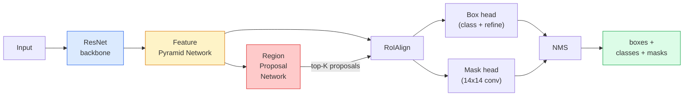

# इंस्टेंस सेगमेंट  मास्क आर-सीएनएन

>  फास्टर आर-सीएनएन डिटेक्टर के साथ एक बहुत ही छोटे मास्क शाखा, हम उदाहरण विभाजन प्राप्त किया है

**Type:** Build + Learn
**Languages:** Python
**Prerequisites:** Phase 4 Lesson 06 (YOLO), Phase 4 Lesson 07 (U-Net)
**Time:** ~75 minutes

## 学习目标
- 端到端追踪 मुखौटा R-CNN 架构:पिंटी、FPN、RPN、RoIAlign、बॉक्स हेड、मास्क हेड
- RoIAlign को शून्य से प्राप्त करने से,并 समझाएँ कि क्यों RoIPool का उपयोग नहीं किया जाता है
- उपयोग टर्चविजन के `maskrcnn_resnet50_fpn_v2`पूर्व प्रशिक्षित मॉडल 生成 उत्पादन गुणवत्ता के उदाहरण मास्क,并正确读取它的输出格式
- 通过换盒和 मुखौटा हेड,并保持脊椎 结,在小型自定义数据集上细节调整 मुखौटा R-CNN

## 问题
अर्थिक विभाजन प्रत्येक वर्ग के लिए एक मुखौटा देता है। प्रत्येक वस्तु के लिए एक मुखौटा देता है, भले ही दो वस्तुएं एक ही वर्ग में हों।

मास्क आर-सीएनएन (He et al., 2017) इस समस्या को हल करने के लिए उदाहरण विभाजन के माध्यम से 重新表述为检测-plus-a-mask来解决这个问题―― यह डिजाइन बहुत सरल है, इसलिए अगले पांच वर्षों तक, लगभग प्रत्येक उदाहरण विभाजन के लिए 论文都是 मास्क आर-सीएनएन के वेरिएंट, जबकि टॉर्च विजन कार्यान्वयन आज भी मध्यम आकार के डेटा सेट के उत्पादन में एक आदर्श विकल्प है।

困难的工程问题是采样: कैसे एक प्रस्ताव बॉक्स के बीच में तय आकार की विशेषता क्षेत्र काटना, जबकि इस बॉक्स के कोने बिंदु पिक्सेल सीमाओं के साथ नहीं है?

## 概念
### वास्तुकला



需要理解五个部分:

1. **Backbone** ImageNet में प्रशिक्षण के ResNet-50 या ResNet-101── उत्पन्न कदम के लिए 4、8、16、32 सुविधा मानचित्र 层级──
2. **FPN (Feature Pyramid Network)** ऊपर-नीचे + साइडल कनेक्शन, प्रत्येक स्तर में C चैनलों के अर्थ-अफूज़ सुविधाएँ हों。 डिटेक्शन 会查询与对象尺寸 匹配的FPN स्तर。
3. **RPN (Region Proposal Network)** एक छोटा सा कंव हेड, प्रत्येक एंकर स्थिति में 上预测 यहाँ क्या कोई वस्तु है?以及我该如何精细盒?── प्रति张图像产生约1000 प्रस्ताव──
4. **RoIAlign** किसी भी FPN स्तर से ऊपर के किसी भी बॉक्स 中采样固定大小(उदाहरण के लिए 7x7) के फीचर पैच── उपयोग द्विआधारी नमूनाकरण, नहीं करते मात्राकरण──
5. **Heads** 两层盒头,用于精细盒并选择类;再加一个小型卷头,为每一个提案 输出一个 `28x28`द्विआधारी मुखौटा

### RoIAlign क्यों नहीं RoIPool

मूल फास्ट आर-सीएनएन RoIPool का उपयोग करके, यह प्रस्ताव बॉक्स को एक ग्रिड में तोड़ता है, प्रत्येक सेल में अधिकतम सुविधा लेता है, और सभी आसनों को गोल करके पूरे संख्या में रखता है। इस प्रकार के गोल करने से सुविधा मानचित्र और इनपुट पिक्सेल निर्देशांक अधिकतम त्रुटि में एक पूर्ण सुविधा मानचित्र पिक्सेल  में 224x224  छवियों पर प्रभाव पड़ता है।

```
RoIPool:
  box (34.7, 51.3, 98.2, 142.9)
  round -> (34, 51, 98, 142)
  split grid -> round each cell boundary
  misalignment accumulates at every step

RoIAlign:
  box (34.7, 51.3, 98.2, 142.9)
  sample at exact float coordinates using bilinear interpolation
  no rounding anywhere
```

RoIAlign 能在 COCO上免费提升 3-4 个点的 मुखौटा AP──现在每个重视位置的探测器都会使用它,包括YOLOv7 seg、RT-DETR、Mask2Former──

### एक पैराग्राफ में आरपीएन

फ़ीचर मैप के प्रत्येक स्थान पर, K 个不同尺寸和形状的基箱ों को रखें। प्रत्येक基箱 के लिए 预测一个对象性分数,以及一个回归抵消,用来把基箱变成更贴合的对象的盒子. 根据分数保留前约1,000 个盒,在 IoU 0.7 下应用 NMS,然后把保留下来的盒子交给头. RPN 自己的迷你损失训练,它的结构与课6 的 YOLO损失相似,只是两个类别的️物体/没有对象) 

### मुखौटा सिर

प्रत्येक प्रस्ताव के लिए, मुखौटा सिर एक बहुत ही छोटा एफसीएन हैः चार 3x3 convs, एक 2x deconv, एक अंतिम 1x1 convs, में`28x28`संकल्प 下生成 `num_classes`个 आउटपुट चैनल── केवल पूर्वानुमानित वर्ग के लिए प्रति应 करने वाले चैनल के साथ ही बने रहें; अन्य चैनल 会被忽略── यह मास्क भविष्यवाणी और वर्गीकरण 解──

28x28 मास्क नमूना प्रस्ताव करने के लिए मूल पिक्सेल आकार, प्राप्त करने के लिए अंतिम द्विआधारी मास्क

### घाटे

मास्क आर सीएनएन के पास चार प्रकार के नुकसान हैं इसके अलावाः

```
L = L_rpn_cls + L_rpn_box + L_box_cls + L_box_reg + L_mask
```

- `L_rpn_cls`,`L_rpn_box` RPN प्रस्तावों की वस्तुनिष्ठता + बॉक्स रिग्रेशन。
- `L_box_cls` मुख्य वर्गीकरण 上针对 (C+1) वर्गों (C+1) के क्रॉस-एंट्रोपी शामिल है)
- `L_box_reg` सिर बॉक्स परिष्करण ऊपर की चिकनी L1──
- `L_mask` 28x28 मास्क आउटपुट 上的每像素二进化

प्रत्येक हानि का अपना स्वीकृत अधिकार होता है; टॉर्च विजन कार्यान्वयन उन्हें निर्माण तर्क के रूप में प्रकट करेगा।

### आउटपुट प्रारूप

`torchvision.models.detection.maskrcnn_resnet50_fpn_v2`返回一个字符列表,每张图像对应一个字符:

```
{
    "boxes":  (N, 4) in (x1, y1, x2, y2) pixel coordinates,
    "labels": (N,) class IDs, 0 = background so indices are 1-based,
    "scores": (N,) confidence scores,
    "masks":  (N, 1, H, W) float masks in [0, 1] — threshold at 0.5 for binary,
}
```

मास्क 已是全像分辨率──28x28 सिर आउटपुट 已在内部完成上样子──


```figure
cv3-roialign-sampling
```

##  इसे निर्माण
### 步骤 1: रॉयलिन को खरोंच से संरेखित करें

मास्क आर-सीएनएन का यह घटक, कोड के साथ समझना अक्षर विवरण से अधिक सरल है।

```python
import torch
import torch.nn.functional as F

def roi_align_single(feature, box, output_size=7, spatial_scale=1 / 16.0):
    """
    feature: (C, H, W) single-image feature map
    box: (x1, y1, x2, y2) in original image pixel coordinates
    output_size: side of the output grid (7 for box head, 14 for mask head)
    spatial_scale: reciprocal of the feature map stride
    """
    C, H, W = feature.shape
    x1, y1, x2, y2 = [c * spatial_scale - 0.5 for c in box]
    bin_w = (x2 - x1) / output_size
    bin_h = (y2 - y1) / output_size

    grid_y = torch.linspace(y1 + bin_h / 2, y2 - bin_h / 2, output_size)
    grid_x = torch.linspace(x1 + bin_w / 2, x2 - bin_w / 2, output_size)
    yy, xx = torch.meshgrid(grid_y, grid_x, indexing="ij")

    gx = 2 * (xx + 0.5) / W - 1
    gy = 2 * (yy + 0.5) / H - 1
    grid = torch.stack([gx, gy], dim=-1).unsqueeze(0)
    sampled = F.grid_sample(feature.unsqueeze(0), grid, mode="bilinear",
                            align_corners=False)
    return sampled.squeeze(0)
```

प्रत्येक संख्यात्मक मूल्य द्विआधारी रूप से नमूना स्थिति से आता है, कोई गोल, कोई मात्रा, कोई खो gradients नहीं है।

### 步骤 2: टॉर्चविजन के RoIAlign की तुलना करें

```python
from torchvision.ops import roi_align

feature = torch.randn(1, 16, 50, 50)
boxes = torch.tensor([[0, 10, 20, 100, 90]], dtype=torch.float32)  # (batch_idx, x1, y1, x2, y2)

ours = roi_align_single(feature[0], boxes[0, 1:].tolist(), output_size=7, spatial_scale=1/4)
theirs = roi_align(feature, boxes, output_size=(7, 7), spatial_scale=1/4, sampling_ratio=1, aligned=True)[0]

print(f"shape ours:   {tuple(ours.shape)}")
print(f"shape theirs: {tuple(theirs.shape)}")
print(f"max|diff|:    {(ours - theirs).abs().max().item():.3e}")
```

`sampling_ratio=1`且 `aligned=True`时,两者能在 `1e-5`इसने मेल खाया

### 步骤 3: एक पूर्व प्रशिक्षित मास्क आर-सीएनएन लोड करें

```python
import torch
from torchvision.models.detection import maskrcnn_resnet50_fpn_v2, MaskRCNN_ResNet50_FPN_V2_Weights

model = maskrcnn_resnet50_fpn_v2(weights=MaskRCNN_ResNet50_FPN_V2_Weights.DEFAULT)
model.eval()
print(f"params: {sum(p.numel() for p in model.parameters()):,}")
print(f"classes (including background): {len(model.roi_heads.box_predictor.cls_score.out_features * [0])}")
```

46M पैरामीटर,91 वर्गों(COCO)。 प्रथम वर्ग(id 0) background है;模型实际检测所有内容都从 id 1 开始──

### 步骤 4: निष्कर्षण चलाएं

```python
with torch.no_grad():
    x = torch.randn(3, 400, 600)
    predictions = model([x])
p = predictions[0]
print(f"boxes:  {tuple(p['boxes'].shape)}")
print(f"labels: {tuple(p['labels'].shape)}")
print(f"scores: {tuple(p['scores'].shape)}")
print(f"masks:  {tuple(p['masks'].shape)}")
```

मास्क टेन्सर का आकार है `(N, 1, H, W)`  0.5 के लिए, प्रत्येक वस्तु के लिए  द्विआधारी मुखौटा प्राप्त करेंः

```python
binary_masks = (p['masks'] > 0.5).squeeze(1)  # (N, H, W) boolean
```

### 步骤 5: कस्टम वर्ग गिनती के लिए सिर स्विच

常见的细调配方:复用脊椎、FPN 和 RPN; दो वर्गीकरण प्रमुखों को प्रतिस्थापित करना──

```python
from torchvision.models.detection.faster_rcnn import FastRCNNPredictor
from torchvision.models.detection.mask_rcnn import MaskRCNNPredictor

def build_custom_maskrcnn(num_classes):
    model = maskrcnn_resnet50_fpn_v2(weights=MaskRCNN_ResNet50_FPN_V2_Weights.DEFAULT)
    in_features = model.roi_heads.box_predictor.cls_score.in_features
    model.roi_heads.box_predictor = FastRCNNPredictor(in_features, num_classes)
    in_features_mask = model.roi_heads.mask_predictor.conv5_mask.in_channels
    hidden_layer = 256
    model.roi_heads.mask_predictor = MaskRCNNPredictor(in_features_mask, hidden_layer, num_classes)
    return model

custom = build_custom_maskrcnn(num_classes=5)
print(f"custom cls_score.out_features: {custom.roi_heads.box_predictor.cls_score.out_features}")
```

`num_classes`必须包含背景类, इसलिए एक में 4 个对象类的数据集应使用 `num_classes=5`

### 步骤 6: प्रशिक्षण की आवश्यकता नहीं है जो फ्रीज

छोटे डेटा संग्रह में, 结脊椎和FPN── केवल RPN वस्तुत्व + प्रतिगमन तथा दो सिर सीख──

```python
def freeze_backbone_and_fpn(model):
    # torchvision Mask R-CNN packs the FPN inside `model.backbone` (as
    # `model.backbone.fpn`), so iterating `model.backbone.parameters()` covers
    # both the ResNet feature layers and the FPN lateral/output convs.
    for p in model.backbone.parameters():
        p.requires_grad = False
    return model

custom = freeze_backbone_and_fpn(custom)
trainable = sum(p.numel() for p in custom.parameters() if p.requires_grad)
print(f"trainable after freeze: {trainable:,}")
```

500-छवि डेटा संग्रह में, यह प्राप्ति और अति-फिटिंग के बीच अंतर है।

## इसका उपयोग करें
मशाल दृष्टि में मास्क आर-सीएनएन का पूरा प्रशिक्षण चक्र  केवल 40 行 है, और विभिन्न कार्यों के बीच मूल रूप से अपरिवर्तित हैः डेटा सेट को प्रतिस्थापित करें, फिर प्रशिक्षण शुरू करें।

```python
def train_step(model, images, targets, optimizer):
    model.train()
    loss_dict = model(images, targets)
    losses = sum(loss for loss in loss_dict.values())
    optimizer.zero_grad()
    losses.backward()
    optimizer.step()
    return {k: v.item() for k, v in loss_dict.items()}
```

`targets`सूची में प्रति प्रति प्रति प्रति प्रति प्रति प्रति प्रति प्रति प्रति प्रति प्रति प्रति प्रति प्रति प्रति प्रति प्रति प्रति प्रति प्रति प्रति प्रति प्रति प्रति प्रति प्रति प्रति प्रति प्रति प्रति प्रति प्रति प्रति प्रति प्रति प्रति प्रति प्रति प्रति प्रति प्रति प्रति प्रति प्रति प्रति प्रति प्रति प्रति प्रति प्रति प्रति प्रति प्रति प्रति प्रति प्रति प्रति प्रति प्रति प्रति प्रति प्रति प्रति प्रति प्रति प्रति प्रति प्रति प्रति प्रति प्रति प्रति प्रति प्रति प्रति प्रति प्रति प्रति प्रति प्रति प्रति प्रति प्रति प्रति प्रति प्रति प्रति प्रति प्रति प्रति प्रति प्रति प्रति प्रति प्रति प्रति प्रति प्रति प्रति प्रति प्रति प्रति प्रति प्रति प्रति प्रति प्रति प्रति प्रति प्रति प्रति प्रति प्रति प्रति प्रति प्रति प्रति प्रति प्रति प्रति प्रति प्रति प्रति प्रति प्रति प्रति प्रति प्रति प्रति प्रति प्रति प्रति प्रति प्रति प्रति प्रति प्रति प्रति प्रति प्रति प्रति प्रति प्रति प्रति प्रति प्रति प्रति प्रति प्रति प्रति प्रति प्रति प्रति प्रति प्रति प्रति प्रति प्रति प्रति प्रति प्रति प्रति प्रति प्रति प्रति प्रति प्रति प्रति प्रति प्रति प्रति प्रति प्रति प्रति प्रति प्रति प्रति प्रति प्रति प्रति प्रति प्रति प्रति प्रति प्रति प्रति प्रति प्रति प्रति प्रति प्रति प्रति प्रति प्रति प्रति प्रति प्रति प्रति प्रति प्रति प्रति प्रति प्रति प्रति प्रति प्रति प्रति प्रति प्रति प्रति प्रति प्रति प्रति प्रति प्रति प्रति प्रति प्रति प्रति प्रति प्रति प्रति प्रति प्रति प्रति प्रति प्रति प्रति प्रति प्रति प्रति प्रति प्रति प्रति प्रति प्रति प्रति प्रति प्रति प्रति प्रति प्रति प्रति प्रति प्रति प्रति प्रति प्रति प्रति प्रति प्रति प्रति प्रति प्रति प्रति प्रति प्रति प्रति प्रति प्रति प्रति प्रति प्रति प्रति प्रति प्रति प्रति प्रति प्रति प्रति प्रति प्रति प्रति प्रति प्रति प्रति प्रति प्रति प्रति प्रति प्रति प्रति प्रति प्रति प्रति प्रति प्रति प्रति प्रति प्रति प्रति प्रति प्रति प्रति प्रति प्रति प्रति प्रति प्रति प्रति प्रति प्रति प्रति प्रति प्रति प्रति प्रति प्रति प्रति प्रति प्रति प्रति प्रति प्रति प्रति प्रति प्रति प्रति प्रति प्रति प्रति प्रति प्रति प्रति प्रति प्रति प्रति प्रति प्रति प्रति प्रति प्रति प्रति प्रति प्रति प्रति प्रति प्रति प्रति प्रति प्रति प्रति प्रति प्रति प्रति प्रति प्रति प्रति प्रति प्रति प्रति प्रति प्रति प्रति प्रति प्रति प्रति प्रति प्रति प्रति प्रति प्रति प्रति प्रति प्रति प्रति प्रति प्रति प्रति प्रति प्रति प्रति प्रति प्रति प्रति प्रति प्रति प्रति प्रति प्रति प्रति प्रति प्रति प्रति प्रति प्रति प्रति प्रति प्रति प्रति प्रति प्रति प्रति प्रति प्रति प्रति प्रति प्रति प्रति प्रति प्रति प्रति प्रति प्रति प्रति प्रति प्रति प्रति प्रति प्रति प्रति प्रति प्रति प्रति प्रति प्रति प्रति प्रति प्रति प्रति प्रति प्रति प्रति प्रति प्रति प्रति प्रति प्रति प्रति प्रति प्रति प्रति प्रति प्रति प्रति प्रति प्रति प्रति प्रति प्रति प्रति प्रति प्रति प्रति प्रति प्रति प्रति प्रति प्रति प्रति प्रति प्रति प्रति प्रति प्रति प्रति प्रति प्रति प्रति प्रति प्रति प्रति प्रति प्रति प्रति प्रति प्रति प्रति प्रति प्रति प्रति प्रति प्रति प्रति प्रति प्रति प्रति प्रति प्रति प्रति प्रति प्रति प्रति प्रति प्रति प्रति प्रति प्रति प्रति प्रति प्रति प्रति प्रति प्रति प्रति प्रति प्रति प्रति प्रति प्रति प्रति प्रति प्रति प्रति प्रति प्रति प्रति`boxes``labels`和 `masks`(क्योंकि `(num_instances, H, W)`द्विआधारी tensors) ⋅ मॉडल ⋅ प्रशिक्षण ⋅ रिटर्न ⋅ चार नुकसान ⋅ रिटर्न ⋅ मूल्यांकन ⋅ रिटर्न ⋅ पूर्वानुमान ⋅ सूची, यह ⋅`model.training`निर्णय लिया गया

`pycocotools`मूल्यांकनकर्ता 会同时为盒 和 मुखौटा 生成 mAP@IoU=0.5:0.95; आपको दो अंकों की आवश्यकता है, ताकि आप बोतल का निर्णय ले सकें.

## 交付 यह
本课会产出:

- `outputs/prompt-instance-vs-semantic-router.md` एक शीघ्र, तीन प्रश्नों का प्रस्ताव करेगा,并选择实例 vs. सेमेटिक vs. पैनप्टिक,以及精确的起始模型──
- `outputs/skill-mask-rcnn-head-swapper.md` एक कौशल, एक नया निर्धारित `num_classes`, के लिए वैकल्पिक मशाल दृष्टि पता लगाने मॉडल 生成 के लिए सिर के आदान-प्रदान के लिए 10 行代码──

## अभ्यास
1. **(Easy)**100 个随机盒上用 `torchvision.ops.roi_align`验证你的RoIAlign──报告最大绝对差值──同时运行RoIPool(pre-2017 व्यवहार),并显示它在附近边界的盒子上会偏离约1-2个特征地图像──
2. **(Medium)**एक 50 छवि कस्टम डेटासेट में ((किसी भी दो वर्गोंः गुब्बारे, मछली, छेद, लोगो) पर ठीक से ट्यून`maskrcnn_resnet50_fpn_v2`结脊椎, प्रशिक्षण 20 युग, रिपोर्ट मास्क AP@0.5
3. **(Hard)**इसे 56x56 के लिए बदलें, न कि 28x28 के संस्करण के लिए।

## 关键术语
| Term | What people say | What it actually means |
|------|----------------|----------------------|
| Mask R-CNN | “Detection plus masks” | Faster R-CNN + 一个小型 FCN head，为每个 proposal 的每个 class 预测一个 28x28 mask |
| FPN | “Feature pyramid” | top-down + lateral connections，让每个 stride level 都有 C channels 的语义丰富 features |
| RPN | “Region proposer” | 一个小型 conv head，每张图像生成约 1000 个 object/no-object proposals |
| RoIAlign | “No-rounding crop” | 从任意 float-coordinate box 中以 bilinear 方式采样固定大小的 feature grid |
| RoIPool | “Pre-2017 crop” | 与 RoIAlign 用途相同，但会 round box coordinates；已经过时 |
| Mask AP | “Instance mAP” | 使用 mask IoU 而不是 box IoU 计算的 average precision；COCO instance segmentation metric |
| Binary mask head | “Per-class mask” | 为每个 proposal 的每个 class 预测一个 binary mask；只保留 predicted class 的 channel |
| Background class | “Class 0” | 兜底的 “no object” class；真实 classes 的 indices 从 1 开始 |

## 延伸阅读
- [Mask R-CNN (He et al., 2017)](https://arxiv.org/abs/1703.06870) 论文; About RoIAlign के तीसरे भाग में महत्वपूर्ण जानकारी दी गई है
- [FPN: Feature Pyramid Networks (Lin et al., 2017)](https://arxiv.org/abs/1612.03144) FPN 论文; प्रत्येक आधुनिक डिटेक्टर इसे उपयोग कर रहे हैं
- [torchvision Mask R-CNN tutorial](https://pytorch.org/tutorials/intermediate/torchvision_tutorial.html) ठीक-ट्यूनिंग लूप का संदर्भ
- [Detectron2 model zoo](https://github.com/facebookresearch/detectron2/blob/main/MODEL_ZOO.md) उत्पादन स्तर के कार्यान्वयन, लगभग सभी पता लगाने और विभाजन प्रदान करते हैं 变体 के प्रशिक्षित वजन
