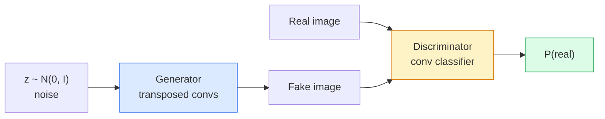
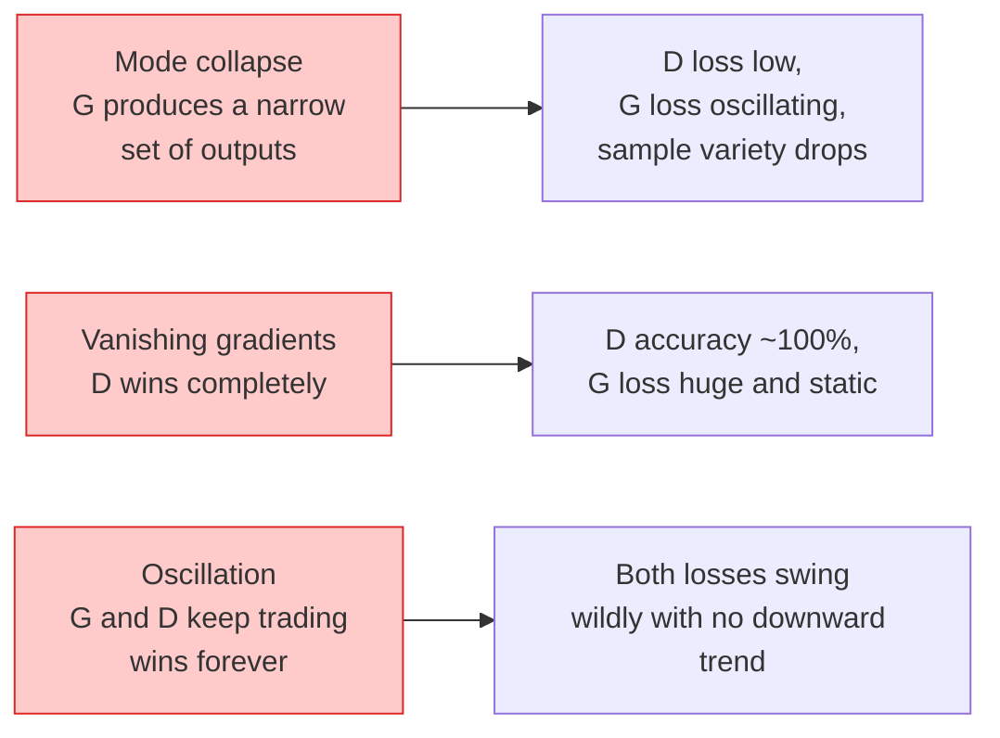

# छवि पीढ़ी  GAN

> GAN दो तंत्रिका नेटवर्क के बीच एक निश्चित बॉट है। एक जिम्मेदार चित्रकार, एक जिम्मेदार मूल्यांकनकर्ता। वे एक साथ बेहतर होते हैं, जब तक कि परिणाम चित्रण करने वाले द्वारा धोखा नहीं दिया जाता।

**Type:** Build
**Languages:** Python
**Prerequisites:** Phase 4 Lesson 03 (CNNs), Phase 3 Lesson 06 (Optimizers), Phase 3 Lesson 07 (Regularization)
**Time:** ~75 分钟

## 学习目标
-  व्याख्या जनरेटर और भेदभावकर्ता के बीच न्यूनतम , तथा क्यों संतुलन p_model = p_data के अनुरूप है
- PyTorch में DCGAN को लागू करें, और 60 लाइनों के भीतर इसे 32x32 संश्लेषित छवि का उत्पादन करने दें
- प्रयोग三种标准技巧稳定 GAN 训练: गैर-स saturating हानि、स्पेक्ट्रल मानदंड、TTUR (दो-टाइम स्केल अपडेट नियम)
- 读取训练曲线,区分健康收与模式崩,oscillation, भेदभाव-जीत-पूर्ण रूप से

## 问题
वर्गीकरण चर्च नेटवर्क छवि को टैग पर मैप करेगा। पीढ़ी ने इस समस्या को उलट दियाः नमूना एक ही वितरण से नई छवि की तरह दिखता हैः यहाँ तुलना के लिए कोई अंतर नहीं है।

标准 Loss Function (MSE、क्रॉस-एंट्रोपी) यह माप नहीं कर सकता है कि यह नमूना वास्तविक वितरण से आया है या नहीं।

GANs (Goodfellow et al., 2014) ने इस ढांचे को परिभाषित किया है। 2018 तक, StyleGAN  ने तस्वीरों के साथ उत्पन्न कर दिया है जो 1024x1024 लोगों के चेहरे को अलग करने में मुश्किल हैं। इसके बाद, विसारण मॉडल गुणवत्ता और नियंत्रण पर कब्जा करते हैं, लेकिन विसारण  को व्यावहारिक बनाने में मदद करते हैं। प्रत्येक तकनीक नियमितकरण  चयन लैटिन स्थान  विशेषता हानि  सबसे पहले GANs पर समझा जाता है।

## 概念
### दोनों नेटवर्क



**generator**G 接收一个噪音 वेक्टर `z`और एक तस्वीर का उत्पादन किया**discriminator**D 接收一张图像并输出单个标量:该图像为真实的概率──

### खेल

G 希望 D 犯错――D 希望自己判断正确――形式化地说:

```
min_G max_D  E_x[log D(x)] + E_z[log(1 - D(G(z)))]
```

से दाएं से बाईं ओर पढ़ने के लिएः डी यह वास्तव में अधिकतम कर रहा है`log D(real)`) और नकली(`log (1 - D(fake))`) चित्र पर सटीकता. G. यह कम हो रहा है D. में नकली ऊपर की सटीकता  यह चाहता है `D(G(z))`बहुत ऊंचा.

अच्छा साथी इस न्यूनतम के अस्तित्व को साबित किया है एक समग्र संतुलन, उनमें से`p_G = p_data`,D सभी स्थानों पर 0.5 आउटपुट, और वितरण और वास्तविक वितरण के बीच जेन्सेन-शैनन विचलन उत्पन्न करने के लिए शून्य है। कठिनाई यह है कि वहां कैसे पहुंचें।

### न संतोषजनक हानि

उपरोक्त रूप में संख्यात्मक मूल्य पर अस्थिर है।`D(G(z))`हर नकली के लिए शून्य के करीब है, इसलिए `log(1 - D(G(z)))`G का ग्रेडिएंट 会消失──修复方法:翻转 G का नुकसान──

```
L_D = -E_x[log D(x)] - E_z[log(1 - D(G(z)))]
L_G = -E_z[log D(G(z))]                          # non-saturating
```

现在当 `D(G(z))`接近零时,G 的损失 很大,Gradient 也有信息量── प्रत्येक आधुनिक GAN 都使用这个变体进行训练──

### डीसीजीएएन वास्तुकला नियम

Radford、Metz、Chintala (2015) ने कई वर्षों के असफल प्रयोगों को पांच नियम में बदल दिया, जिससे GAN  प्रशिक्षण अधिक स्थिर हो गयाः

1. दो नेटवर्क हैं)
2. Generator तथा discriminator में सभी बैच मानदंड का प्रयोग करते हैं, लेकिन G का आउटपुट और D का इनपुट को छोड़कर।
3. अधिक गहराई से जुड़े परतों को स्थानांतरित करना
4. G में बाहर निकासी परत के बाहर सभी परत का उपयोग करें ReLU(输出层用tanh,将输出限制在 [-1, 1])
5. D 在所有层使用LeakyReLU(negative_slope=0.2)。

प्रत्येक आधुनिक कन्-आधारित GAN (StyleGAN, BigGAN, GigGAN) अभी भी इन नियमों से उत्पन्न होता है, और एक बार उनका हिस्सा बदल जाता है।

### विफलता मोड  और विशेषताएं



- **Mode collapse**:G 找到一张能骗过D 的图像,然后只生成它──修复:加入迷你批次歧视、光谱规范,或标签条件──
- **Discriminator wins**:D 变强太快,G 的 ग्रेडिएंट 消失──修复:减小D、降低D सीखने की दर, या वास्तविक लेबल पर 应用 लेबल चिकनाई──
- **Oscillation**दो नेटवर्क लगातार एक दूसरे से लाभ लेने, लेकिन संतुलन के करीब नहीं आते हैं।

### मूल्यांकन

GANs  बिना मूल सत्य, तो आप कैसे जानते हैं कि वे काम कर रहे हैं?

- **Sample inspection** प्रत्येक युग  समाप्त होने पर सीधे देखें 64 个样本──不可妥协──
- **FID (Fréchet Inception Distance)** वास्तविक संचलन और उत्पन्न संचलन के प्रारंभ-v3 विशेषता वितरण  के बीच दूरी──越低越好──社区标准──
- **Inception Score**旧,也更脆弱; प्राथमिकता FID──
- **Precision/Recall for generative models**分别衡量质量 (असत्य) और कवरेज (विवरण)  स्मरण) 比单独使用FID 更有信息量──

 लघु सिंथेटिक-डेटा 运行, नमूना निरीक्षण 足足了


```figure
cv-gan-image
```

##  इसे निर्माण
### 步骤 1: जनरेटर

एक छोटे सीजीएएन जनरेटर, 64 维 शोर प्राप्त करने और एक张 32x32 图像生成──

```python
import torch
import torch.nn as nn

class Generator(nn.Module):
    def __init__(self, z_dim=64, img_channels=3, feat=64):
        super().__init__()
        self.net = nn.Sequential(
            nn.ConvTranspose2d(z_dim, feat * 4, kernel_size=4, stride=1, padding=0, bias=False),
            nn.BatchNorm2d(feat * 4),
            nn.ReLU(inplace=True),
            nn.ConvTranspose2d(feat * 4, feat * 2, kernel_size=4, stride=2, padding=1, bias=False),
            nn.BatchNorm2d(feat * 2),
            nn.ReLU(inplace=True),
            nn.ConvTranspose2d(feat * 2, feat, kernel_size=4, stride=2, padding=1, bias=False),
            nn.BatchNorm2d(feat),
            nn.ReLU(inplace=True),
            nn.ConvTranspose2d(feat, img_channels, kernel_size=4, stride=2, padding=1, bias=False),
            nn.Tanh(),
        )

    def forward(self, z):
        return self.net(z.view(z.size(0), -1, 1, 1))
```

चार ट्रांसपोस्टेड कन्वर्स, प्रत्येक उपयोग `kernel_size=4, stride=2, padding=1`, ताकि वे शुद्ध भूमि में अंतरिक्ष आकार दोगुना होगा।

### 步骤 2: भेदभाव

जनरेटर का दर्पण── लीकरीरेलू── स्ट्रिड्ड कन्व्स, आख़िर आउटपुट एक संकेत मात्रा लॉजिट──

```python
class Discriminator(nn.Module):
    def __init__(self, img_channels=3, feat=64):
        super().__init__()
        self.net = nn.Sequential(
            nn.Conv2d(img_channels, feat, kernel_size=4, stride=2, padding=1),
            nn.LeakyReLU(0.2, inplace=True),
            nn.Conv2d(feat, feat * 2, kernel_size=4, stride=2, padding=1, bias=False),
            nn.BatchNorm2d(feat * 2),
            nn.LeakyReLU(0.2, inplace=True),
            nn.Conv2d(feat * 2, feat * 4, kernel_size=4, stride=2, padding=1, bias=False),
            nn.BatchNorm2d(feat * 4),
            nn.LeakyReLU(0.2, inplace=True),
            nn.Conv2d(feat * 4, 1, kernel_size=4, stride=1, padding=0),
        )

    def forward(self, x):
        return self.net(x).view(-1)
```

अंतिम एक con `4x4`विशेषता मानचित्र 降到 `1x1`◊输出是每张图像一个标量; केवल लॉस 计算期间应用 sigmoid──

### 步骤 3: प्रशिक्षण चरण

交替执行: प्रत्येक बैच पहले एक बार अपडेट D, फिर एक बार अपडेट G。

```python
import torch.nn.functional as F

def train_step(G, D, real, z, opt_g, opt_d, device):
    real = real.to(device)
    bs = real.size(0)

    # D step
    opt_d.zero_grad()
    d_real = D(real)
    d_fake = D(G(z).detach())
    loss_d = (F.binary_cross_entropy_with_logits(d_real, torch.ones_like(d_real))
              + F.binary_cross_entropy_with_logits(d_fake, torch.zeros_like(d_fake)))
    loss_d.backward()
    opt_d.step()

    # G step
    opt_g.zero_grad()
    d_fake = D(G(z))
    loss_g = F.binary_cross_entropy_with_logits(d_fake, torch.ones_like(d_fake))
    loss_g.backward()
    opt_g.step()

    return loss_d.item(), loss_g.item()
```

चरण मध्य `G(z).detach()`至关重要: हम नहीं चाहते कि D 时 Gradient 流入 G में अपडेट हो। भूल जाओ कि यह क्लासिक शुरुआती की गलती है।

### 步骤 4: सिंथेटिक आकारों में ऊपर运行完整训练循环

```python
from torch.utils.data import DataLoader, TensorDataset
import numpy as np

def synthetic_images(num=2000, size=32, seed=0):
    rng = np.random.default_rng(seed)
    imgs = np.zeros((num, 3, size, size), dtype=np.float32) - 1.0
    for i in range(num):
        r = rng.uniform(6, 12)
        cx, cy = rng.uniform(r, size - r, size=2)
        yy, xx = np.meshgrid(np.arange(size), np.arange(size), indexing="ij")
        mask = (xx - cx) ** 2 + (yy - cy) ** 2 < r ** 2
        color = rng.uniform(-0.5, 1.0, size=3)
        for c in range(3):
            imgs[i, c][mask] = color[c]
    return torch.from_numpy(imgs)

device = "cuda" if torch.cuda.is_available() else "cpu"
data = synthetic_images()
loader = DataLoader(TensorDataset(data), batch_size=64, shuffle=True)

G = Generator(z_dim=64, img_channels=3, feat=32).to(device)
D = Discriminator(img_channels=3, feat=32).to(device)
opt_g = torch.optim.Adam(G.parameters(), lr=2e-4, betas=(0.5, 0.999))
opt_d = torch.optim.Adam(D.parameters(), lr=2e-4, betas=(0.5, 0.999))

for epoch in range(10):
    for (batch,) in loader:
        z = torch.randn(batch.size(0), 64, device=device)
        ld, lg = train_step(G, D, batch, z, opt_g, opt_d, device)
    print(f"epoch {epoch}  D {ld:.3f}  G {lg:.3f}")
```

`Adam(lr=2e-4, betas=(0.5, 0.999))` कम बीटा1  कम गति  अधिक स्थिर विरोधी खेल  से बचने के लिए  DCGAN 默认设置

### 步骤 5: नमूनाकरण

```python
@torch.no_grad()
def sample(G, n=16, z_dim=64, device="cpu"):
    G.eval()
    z = torch.randn(n, z_dim, device=device)
    imgs = G(z)
    imgs = (imgs + 1) / 2
    return imgs.clamp(0, 1)
```

采样前始终切换到 eval मोड── DCGAN के लिए यह महत्वपूर्ण है, क्योंकि बैच मानदंड चल रही आंकड़े का उपयोग करेगा, बजाय वर्तमान बैच के आंकड़े──

### 步骤 6: स्पेक्ट्रल सामान्यीकरण

भेदभाव करने वाला 中 BN 的即插即用替代方案,保证网络是1-Lipschitz──能修复大多数D जीतने के लिए बहुत कठिन失败──

```python
from torch.nn.utils import spectral_norm

def build_sn_discriminator(img_channels=3, feat=64):
    return nn.Sequential(
        spectral_norm(nn.Conv2d(img_channels, feat, 4, 2, 1)),
        nn.LeakyReLU(0.2, inplace=True),
        spectral_norm(nn.Conv2d(feat, feat * 2, 4, 2, 1)),
        nn.LeakyReLU(0.2, inplace=True),
        spectral_norm(nn.Conv2d(feat * 2, feat * 4, 4, 2, 1)),
        nn.LeakyReLU(0.2, inplace=True),
        spectral_norm(nn.Conv2d(feat * 4, 1, 4, 1, 0)),
    )
```

`Discriminator`替换为 `build_sn_discriminator()`                                                                                                                                                                                                                                                              

## इसका उपयोग करें
 कठोर पीढ़ी के लिए, पूर्व-प्रशिक्षित भारों का उपयोग या प्रसार में परिवर्तन करनाः

- `torch_fidelity`आप अपने जनरेटर में FID / IS का गणना कर सकते हैं, और स्वयं परिभाषित मूल्यांकन कोड लिखने की आवश्यकता नहीं है।
- `pytorch-gan-zoo`(उपरास) और `StudioGAN`提供经过测试的DCGAN、WGAN-GP、SN-GAN、StyleGAN 和 BigGAN 实现──

2026 तक,GANs  अभी भी इन दृश्यों का सबसे अच्छा विकल्प हैंः वास्तविक समय छवि उत्पादन ((लैटेंसी <10 ms) ]], शैली हस्तांतरण、 छवि-चित्र अनुवाद के लिए सटीक नियंत्रण के साथ ((Pix2Pix、CycleGAN) ◦ विसारण में फोटोरियलिज्म तथा पाठ कंडीशनिंग 上胜出──

## 交付 यह
本课产出:

- `outputs/prompt-gan-training-triage.md` एक शीघ्र, लिए पढ़ने के लिए प्रशिक्षण曲线描述并选择 विफलता मोड(मोड कोलपास、डी-विन、ओस्किलेशन),以及单个推修复方案──
- `outputs/skill-dcgan-scaffold.md`एक कौशल, कर सकते हैं के अनुसार `z_dim`、 लक्ष्य `image_size`和 `num_channels`编写DCGAN स्केफॉल्ड, प्रशिक्षण लूप सहित तथा नमूना बचतकर्ता

## अभ्यास
1. **(Easy)**सिंथेटिक सर्कल डेटासेट में ऊपर प्रशिक्षित DCGAN, और प्रत्येक युग के अंत में 16 ₹ नमूना के नेटवर्क को सहेजें।
2. **(Medium)**स्पेक्ट्रल मानदंडों का प्रयोग करें भेदभाव के बैच मानदंडों का प्रतिस्थापन करें।
3. **(Hard)**实现 सशर्त DCGAN:将 वर्ग लेबल 输入 G 和 D(在 G 中将 one-hot 拼接到噪音,在 D 中拼接到一个类嵌入频道) ⋅ पाठ 7 के सिंथेटिक "चक्रों बनाम वर्गों" डेटासेट 上训练,并通过使用指定标签 采样来展示类调节 有效──

## 关键术语
| Term | What people say | What it actually means |
|------|----------------|----------------------|
| Generator (G) | “负责画东西的网络” | 将 noise 映射到图像；训练目标是骗过 discriminator |
| Discriminator (D) | “评判者” | Binary classifier；训练目标是区分真实图像与生成图像 |
| Minimax | “这个博弈” | 在 adversarial loss 上对 G 取 min、对 D 取 max；均衡是 p_G = p_data |
| Non-saturating loss | “数值上合理的版本” | G 的 Loss 是 -log(D(G(z)))，而不是 log(1 - D(G(z)))，以避免训练早期 Gradient 消失 |
| Mode collapse | “Generator 只生成一种东西” | G 只生成数据分布中的一小部分；用 SN、minibatch discrimination 或更大的 batch 修复 |
| TTUR | “两个 learning rates” | D 比 G 学得更快，通常快 2-4 倍；稳定训练 |
| Spectral norm | “1-Lipschitz layer” | 一种 weight-normalisation，用来限制每层的 Lipschitz constant；防止 D 变得任意陡峭 |
| FID | “Fréchet Inception Distance” | 真实集合与生成集合的 Inception-v3 feature distributions 之间的距离；标准评估指标 |

## 延伸阅读
- [Generative Adversarial Networks (Goodfellow et al., 2014)](https://arxiv.org/abs/1406.2661) इस दिशा में शोध
- [DCGAN (Radford, Metz, Chintala, 2015)](https://arxiv.org/abs/1511.06434)让GAN可训练的架构规则
- [Spectral Normalization for GANs (Miyato et al., 2018)](https://arxiv.org/abs/1802.05957) सबसे उपयोगी एकल स्थिरता तकनीक
- [StyleGAN3 (Karras et al., 2021)](https://arxiv.org/abs/2106.12423)SOTA GAN; पढ़ते हुए लग रहा है जैसे पिछले दस साल के सभी कौशल का चयन संग्रह
