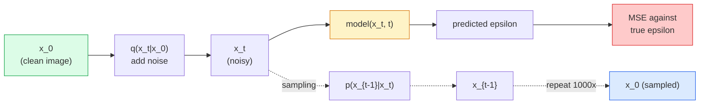

# 图像生成  विसारण मॉडल

> विसारण मॉडल सीखना है denoise करना। इसे प्रशिक्षण देना है जिसमें शोर वाली छवि से शोर का एक छोटा सा हिस्सा निकाला जाता है, प्रतिवर्ती दोहराव इस प्रक्रिया को 1000 बार, आपको एक छवि जनरेटर मिलता है।

**Type:** Build
**Languages:** Python
**Prerequisites:** Phase 4 Lesson 07 (U-Net), Phase 1 Lesson 06 (Probability), Phase 3 Lesson 06 (Optimizers)
**Time:** ~75 分钟

## 学习目标

- 推导 आगे की शोर प्रक्रिया `x_0 -> x_1 -> ... -> x_T`, और समझा क्यों बंद किया गया है`q(x_t | x_0)`किसी भी शहर के लिए
-  एक DDPM 风格 के प्रशिक्षण लक्ष्य को प्राप्त करना, जो प्रत्येक चरण में जोड़ा गया शोर को वापस करने के लिए, और शुद्ध शोर से  चरणबद्ध रूप से छवि को वापस करने के लिए एक नमूना प्राप्त करना
- निर्माण एक समय-कंडीशनिंग यू-नेट(छोटा तक CPU पर प्रशिक्षण में किया जा सकता है), किसी भी समय चरण के शोर की भविष्यवाणी करने के लिए उपयोग किया जाता है
-  व्याख्या डीडीपीएम और डीडीआईएम नमूनाकरण के अंतर, साथ ही उनके उपयुक्त परिदृश्यों के साथ-साथ लक्सन 23 में गहन व्याख्या प्रवाह के मिलान और सुधारित प्रवाह)

## 问题

GANs एक बार उत्पन्न होती हैंः शोर, इनपुट, छवि आउटपुट, केवल एक बार आगे जाने की आवश्यकता होती है। वे तेजी से होते हैं, लेकिन बहुत मुश्किल प्रशिक्षण देते हैं।

स्थिरता के अलावा, विसारण के युग संरचना ने आधुनिक छवि उत्पादन में सभी क्षमताओं को भी खोल दिया हैः पाठ कंडीशनिंग, पेंटिंग, छवि संपादन, सुपर-रिज़ॉल्यूशन, नियंत्रित शैली। नमूना लूप के प्रत्येक चरण को नए संयंत्र के प्रवेश द्वार में डाला जाता है। यह हुक है, जिससे स्थिर विसारण, छवि, डॉल-ई 3, मिडयॉर्नी, और आपके द्वारा उपयोग किए जाने वाले प्रत्येक नियंत्रणीय छवि मॉडल, विसारण पर आधारित हैं।

इस वर्ग में एक न्यूनतम डीडीपीएम का निर्माण किया जाएगा: आगे शोर, पीछे हटाने, प्रशिक्षण लूप, नीचे का वर्ग, स्थिर विसारण) इसे एक उत्पादन प्रणाली में जोड़ देगा, जिसमें VAE, पाठ एन्कोडर और वर्गीकरणकर्ता मुक्त मार्गदर्शन शामिल हैं।

## 核心概念

### आगे की प्रक्रिया

取一张图像 `x_0`加入少量 गौशियन शोर 得到 `x_1` पुनः जोड़ें कम मात्रा में शोर  प्राप्त `x_2`                                                                                                                                                                                                                                                              `x_T`् ् ् ् ् ् ् ् ् ् ् ् ् ् ् ् ् ् ् ् ् ् ् ् ् ् ् ् ् ् ् ् ् ् ् ् ् ् ् ् ् ् ् ् ् ् ् ् ् ् ् ् ् ् ् ् ् ् ् ् ् ् ् ् ् ् ् ् ् ् ् ् ् ् ् ् ् ् ् ् ् ् ् ् ् ् ् ् ् ् ् ् ् ् ् ् ् ् ् ् ् ् ् ् ् ् ् ् ् ् ् ् ् ् ् ् ् ् ् ् ् ् ् ् ् ् ् ् ् ् ् ् ् ् ् ् ् ् ् ् ् ् ् ् ् ् ् ् ् ् ् ् ् ् ् ् ् ् ् ् ् ् ् ् ् ् ् ् ् ् ् ् ् ् ् ् ् ् ् ् ् ् ् ् ् ् ् ् ् ् ् ् ् ् ् ् ् ् ् ् ् ् ् ् ् ् ् ् ् ् ् ् ् ् ् ् ् ् ् ् ् ् ् ् ् ् ् ् ् ् ् ् ् ् ् ् ् ् ् ् ् ् ् ् ् ् ् ् ् ् ् ् ् ् ्

```
q(x_t | x_{t-1}) = N(x_t; sqrt(1 - beta_t) * x_{t-1},  beta_t * I)
```

`beta_t`यह एक छोटा भिन्नता अनुसूची है, आमतौर पर T=1000 चरणों में 0.0001 线性 वृद्धि से 0.02 ̊ तक होती है। प्रत्येक चरण में हल्का छोटा संकेत होता है और नई शोर की शुरुआत होती है।

### 闭式跳转

एक कदम से शोर जोड़ना एक मार्कोव श्रृंखला है, लेकिन गणितीय रूप से यह तह हो सकता हैः आप सीधे से एक कदम कर सकते हैं `x_0`नमूना 出 `x_t`

```
Define alpha_t = 1 - beta_t
Define alpha_bar_t = prod_{s=1..t} alpha_s

Then:
  q(x_t | x_0) = N(x_t; sqrt(alpha_bar_t) * x_0,  (1 - alpha_bar_t) * I)

Equivalently:
  x_t = sqrt(alpha_bar_t) * x_0 + sqrt(1 - alpha_bar_t) * epsilon
  where epsilon ~ N(0, I)
```

यह एकतरफा तरीका है फैलाव                                                                                                                                                                                                                                                                                                                                                                                                                                                                                                                     `t`, सीधे से`x_0`नमूना 出 `x_t`,并一步完成训练,没有必要模拟完整的马科夫链――

### उल्टा प्रक्रिया

आगे की प्रक्रिया  निश्चित  उल्टा प्रक्रिया `p(x_{t-1} | x_t)`है न्यूरल नेटवर्क ◊ सीखना सामग्री──विभाजन मॉडल  `x_{t-1}`; वे पहले से ही ध्वनि के चरण में शामिल होने की भविष्यवाणी करते हैं `epsilon`, फिर गणितीय सूत्रों द्वारा निर्धारित किया गया है ।`x_{t-1}`



###  प्रशिक्षण हानि

 प्रत्येक प्रशिक्षण चरण के लिए:

1. नमूना 一张真实图像 `x_0`
2. से [1, T] 中均 नमूना एक समय चरण `t`
3. नमूना शोर `epsilon ~ N(0, I)`
4. 计算 `x_t = sqrt(alpha_bar_t) * x_0 + sqrt(1 - alpha_bar_t) * epsilon`
5. उपयोग नेटवर्क 预测 `epsilon_theta(x_t, t)`
6.                                                                                                                                                                                                                                                                                                                                                                                                                                                                                                                              `|| epsilon - epsilon_theta(x_t, t) ||^2`

यही है। нейरल नेटवर्क सीखना  पूर्वानुमान शोर                                                                                                                                                                                                                                                        

### नमूना (डीडीपीएम)

生成时: से `x_T ~ N(0, I)`开始, एक कदम पीछे की ओर

```
for t = T, T-1, ..., 1:
    eps = model(x_t, t)
    x_{t-1} = (1 / sqrt(alpha_t)) * (x_t - (beta_t / sqrt(1 - alpha_bar_t)) * eps) + sqrt(beta_t) * z
    where z ~ N(0, I) if t > 1, else 0
return x_0
```

关键在于, यद्यपि विपरीत संदिग्ध सामान्य रूप से कोई ज्ञात बंद स्वरूप नहीं है, लेकिन इस विशिष्ट गौशियन आगे की प्रक्रिया के लिए, यह बंद है।

### क्यों 1000 कदम है

आगे की शोर अनुसूची का चयन लक्ष्य है कि प्रत्येक चरण में पर्याप्त शोर शामिल हो जाए, ताकि उल्टा चरण निकटता से गौशियन हो। कदम संख्या बहुत कम हो, उल्टा चरण गाउशियन से दूर हो, नेटवर्क बहुत मुश्किल से अच्छी तरह से बनाया जा सके। कदम संख्या बहुत अधिक हो, नमूनाकरण महंगा हो जाएगा, लाभ भी घट जाएगा।

### डीडीआईएम:快 20 倍的 नमूना

訓練相同,樣本化改變──DDIM(Song et al., 2020) एक निश्चिततापूर्ण उल्टा प्रक्रिया को परिभाषित करता है, जो बिना दोबारा प्रशिक्षण के समय से आगे बढ़ सकता है──डीडीआईएम का उपयोग करके 50 步 नमूनाकरण, लगभग 1000 步 डीडीपीएम की गुणवत्ता प्राप्त कर सकता है── प्रत्येक उत्पादन प्रणाली डीडीआईएम या अधिक तेज़ परिवर्तनों का उपयोग करेगी──डीपीएम-सोलवर、ईलर पूर्वज)──

### समय की स्थिति

नेटवर्क `epsilon_theta(x_t, t)`需要知道它正在指明 哪个时间步骤──现代 Diffusion Models 通过阴道时间嵌入 注入 `t`(ट्रांसफार्मर में स्थितित्मक एन्कोडिंग के विचार समान हैं), और प्रत्येक यू-नेट स्तर पर इसे सुविधा मानचित्रों पर जोड़ें

```
t_embedding = sinusoidal(t)
feature_map += MLP(t_embedding)
```

 समय की स्थिति नहीं है, नेटवर्क ️ छवि स्वयं से शोर स्तर का अनुमान लगाना होगा, यह भी काम कर सकता है, लेकिन नमूना दक्षता ️ बहुत कम होगा


```figure
cv-diffusion-image
```

##  इसे निर्माण

### 步骤 1: शोर कार्यक्रम

```python
import torch

def linear_beta_schedule(T=1000, beta_start=1e-4, beta_end=2e-2):
    return torch.linspace(beta_start, beta_end, T)


def precompute_schedule(betas):
    alphas = 1.0 - betas
    alphas_cumprod = torch.cumprod(alphas, dim=0)
    return {
        "betas": betas,
        "alphas": alphas,
        "alphas_cumprod": alphas_cumprod,
        "sqrt_alphas_cumprod": torch.sqrt(alphas_cumprod),
        "sqrt_one_minus_alphas_cumprod": torch.sqrt(1.0 - alphas_cumprod),
        "sqrt_recip_alphas": torch.sqrt(1.0 / alphas),
    }

schedule = precompute_schedule(linear_beta_schedule(T=1000))
```

预先计算一次, प्रशिक्षण और नमूना लेने के दौरान 索引 के अनुसार एकत्र करना

### 步骤 2: आगे फैलाव (q_sample)

```python
def q_sample(x0, t, noise, schedule):
    sqrt_a = schedule["sqrt_alphas_cumprod"][t].view(-1, 1, 1, 1)
    sqrt_one_minus_a = schedule["sqrt_one_minus_alphas_cumprod"][t].view(-1, 1, 1, 1)
    return sqrt_a * x0 + sqrt_one_minus_a * noise
```

एक पंक्ति बंद रूप मेंः`t`एक बैच समय, बैच में प्रति张图像对应一个.

### 步骤 3: एक लघु समय-कंडीशनिंग यू-नेट

```python
import torch.nn as nn
import torch.nn.functional as F
import math

def timestep_embedding(t, dim=64):
    half = dim // 2
    freqs = torch.exp(-math.log(10000) * torch.arange(half, device=t.device) / half)
    args = t[:, None].float() * freqs[None]
    emb = torch.cat([args.sin(), args.cos()], dim=-1)
    return emb


class TinyUNet(nn.Module):
    def __init__(self, img_channels=3, base=32, t_dim=64):
        super().__init__()
        self.t_mlp = nn.Sequential(
            nn.Linear(t_dim, base * 4),
            nn.SiLU(),
            nn.Linear(base * 4, base * 4),
        )
        self.t_dim = t_dim
        self.enc1 = nn.Conv2d(img_channels, base, 3, padding=1)
        self.enc2 = nn.Conv2d(base, base * 2, 4, stride=2, padding=1)
        self.mid = nn.Conv2d(base * 2, base * 2, 3, padding=1)
        self.dec1 = nn.ConvTranspose2d(base * 2, base, 4, stride=2, padding=1)
        self.dec2 = nn.Conv2d(base * 2, img_channels, 3, padding=1)
        self.time_proj = nn.Linear(base * 4, base * 2)

    def forward(self, x, t):
        t_emb = timestep_embedding(t, self.t_dim)
        t_emb = self.t_mlp(t_emb)
        t_proj = self.time_proj(t_emb)[:, :, None, None]

        h1 = F.silu(self.enc1(x))
        h2 = F.silu(self.enc2(h1)) + t_proj
        h3 = F.silu(self.mid(h2))
        d1 = F.silu(self.dec1(h3))
        d2 = torch.cat([d1, h1], dim=1)
        return self.dec2(d2)
```

两层 U-Net, और बोतल गला में समय कंडीशनिंग में प्रवेश करें।

### 步骤 4: प्रशिक्षण लूप

```python
def train_step(model, x0, schedule, optimizer, device, T=1000):
    model.train()
    x0 = x0.to(device)
    bs = x0.size(0)
    t = torch.randint(0, T, (bs,), device=device)
    noise = torch.randn_like(x0)
    x_t = q_sample(x0, t, noise, schedule)
    pred = model(x_t, t)
    loss = F.mse_loss(pred, noise)
    optimizer.zero_grad()
    loss.backward()
    optimizer.step()
    return loss.item()
```

यह एक पूर्ण प्रशिक्षण चक्र है. कोई गैन खेल नहीं है, कोई विशेष हानि नहीं है.

### 步骤 5: नमूना (DDPM)

```python
@torch.no_grad()
def sample(model, schedule, shape, T=1000, device="cpu"):
    model.eval()
    x = torch.randn(shape, device=device)
    betas = schedule["betas"].to(device)
    sqrt_one_minus_a = schedule["sqrt_one_minus_alphas_cumprod"].to(device)
    sqrt_recip_alphas = schedule["sqrt_recip_alphas"].to(device)

    for t in reversed(range(T)):
        t_batch = torch.full((shape[0],), t, dtype=torch.long, device=device)
        eps = model(x, t_batch)
        coef = betas[t] / sqrt_one_minus_a[t]
        mean = sqrt_recip_alphas[t] * (x - coef * eps)
        if t > 0:
            x = mean + torch.sqrt(betas[t]) * torch.randn_like(x)
        else:
            x = mean
    return x
```

एक बैच नमूना बनाने के लिए 1000 बार आगे पास की आवश्यकता है।

### 步骤 6: डीडीआईएम नमूना ((确定性,约快 20倍)

```python
@torch.no_grad()
def sample_ddim(model, schedule, shape, steps=50, T=1000, device="cpu", eta=0.0):
    model.eval()
    x = torch.randn(shape, device=device)
    alphas_cumprod = schedule["alphas_cumprod"].to(device)

    ts = torch.linspace(T - 1, 0, steps + 1).long()
    for i in range(steps):
        t = ts[i]
        t_prev = ts[i + 1]
        t_batch = torch.full((shape[0],), t, dtype=torch.long, device=device)
        eps = model(x, t_batch)
        a_t = alphas_cumprod[t]
        a_prev = alphas_cumprod[t_prev] if t_prev >= 0 else torch.tensor(1.0, device=device)
        x0_pred = (x - torch.sqrt(1 - a_t) * eps) / torch.sqrt(a_t)
        sigma = eta * torch.sqrt((1 - a_prev) / (1 - a_t) * (1 - a_t / a_prev))
        dir_xt = torch.sqrt(1 - a_prev - sigma ** 2) * eps
        noise = sigma * torch.randn_like(x) if eta > 0 else 0
        x = torch.sqrt(a_prev) * x0_pred + dir_xt + noise
    return x
```

`eta=0`                                                                                                                                                                                                                                                              `eta=1`डीडीपीएम को बहाल करेगा।

## इसका उपयोग करें

生产工作中, उपयोग `diffusers`:

```python
from diffusers import DDPMScheduler, UNet2DModel

unet = UNet2DModel(sample_size=32, in_channels=3, out_channels=3, layers_per_block=2)
scheduler = DDPMScheduler(num_train_timesteps=1000)
```

यह भंडार मौजूदा शेड्यूलर प्रदान करता है।

अध्ययन कार्य में,`k-diffusion`(कैथरीन क्रॉसन) सबसे वफादार संदर्भ प्राप्ति और सर्वोत्तम नमूनाकरण संस्करणों हैं

## 交付 यह

本课会产出:

- `outputs/prompt-diffusion-sampler-picker.md` एक शीघ्र, गुणवत्ता लक्ष्य, देरी बजट और अनुकूलन पर आधारित होगा 类型选择 DDPM / DDIM / DPM-Solver / Euler。
- `outputs/skill-noise-schedule-designer.md` एक कौशल, T 和 लक्ष्य भ्रष्टाचार स्तर के आधार पर 生成 रैखिक, कोसिन या सिग्मोइड बीटा अनुसूची,并附带信号-噪音 अनुपात 随着时间变化诊断图――

## अभ्यास

1. **（简单）**可视化前进过程:取一张图像,并绘制 `t in [0, 100, 250, 500, 750, 1000]`时的 `x_t`验证 `x_1000`यह शुद्ध गौसीन शोर की तरह लग रहा है.
2. **（中等）**संश्लेषण-चक्र डेटासेट में ऊपर प्रशिक्षण TinyUNet 20 个时代,并样本 16 个圈──比较DDPM(1000 步) और DDIM(50 步)样本: क्या वे एक ही शोर बीज से 类似图像 उत्पन्न कर सकते हैं?
3. **（困难）**实现 कोसिन शोर कार्यक्रम ((निचोल एंड धारिवाल, 2021):`alpha_bar_t = cos^2((t/T + s) / (1 + s) * pi / 2)`◊ रैखिक एवं कॉस्मीन शेड्यूल का उपयोग करके  एक ही मॉडल का अभ्यास करें, और दिखाएं कि कॉस्मीन में कम चरणों में बेहतर नमूना उत्पन्न हो सकता है

## 关键术语

| Term | 人们通常怎么说 | 实际含义 |
|------|----------------|----------------------|
| Forward process | “随时间加入 noise” | 一个固定的 Markov chain，会在 T 步内把图像破坏成 Gaussian noise |
| Reverse process | “一步步 denoise” | 学到的分布，会从 noise 逐步走回图像 |
| Epsilon prediction | “预测 noise” | 训练目标：`epsilon_theta(x_t, t)` 预测在第 t 步加入的 noise |
| Beta schedule | “noise 大小” | T 个小 variance 组成的序列，定义每一步进入多少 noise |
| alpha_bar_t | “累计保留因子” | 到时间 t 为止的 (1 - beta_s) 乘积；t 越大，剩余信号越少 |
| DDPM sampler | “Ancestral，随机” | 从每个 x_{t-1} 的 conditional Gaussian 中 sample；1000 步 |
| DDIM sampler | “确定性，快速” | 将 sampling 重写为确定性 ODE；20-100 步即可得到相似质量 |
| Time conditioning | “告诉 model 当前是哪个 t” | 注入 U-Net 的 t 的 sinusoidal embedding，让它知道 noise level |

## 延伸阅读

- [Denoising Diffusion Probabilistic Models (Ho et al., 2020)](https://arxiv.org/abs/2006.11239) 让传播 变得实用并击败GANs的论文
- [Improved DDPM (Nichol & Dhariwal, 2021)](https://arxiv.org/abs/2102.09672) कोसिन अनुसूची तथा वी-पेरैमेटरीकरण
- [DDIM (Song, Meng, Ermon, 2020)](https://arxiv.org/abs/2010.02502) 让实时推断 成为可能的确定性样本
- [Elucidating the Design Space of Diffusion (Karras et al., 2022)](https://arxiv.org/abs/2206.00364) प्रत्येक विसारण  डिजाइन चयन के लिए एक समग्र दृष्टिकोण; वर्तमान सर्वोत्तम संदर्भ
