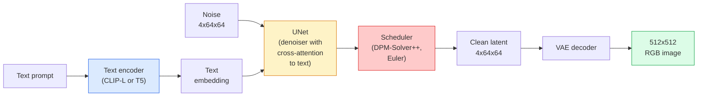

# स्थिर विसारण  架构与精细调

> स्थिर विसारण एक प्रकार का डीडीपीएम है, जो पूर्व प्रशिक्षण वीएई के लटेंट स्पेस में संचालित होता है, क्रॉस-अटेंशन के माध्यम से, एक त्वरित निश्चितता वाले ओडीई सॉल्वर का उपयोग करके, और वर्गीकरणकर्ता मुक्त मार्गदर्शन द्वारा मार्गदर्शन किया जाता है।

**Type:** Learn + Use
**Languages:** Python
**Prerequisites:** Phase 4 Lesson 10 (Diffusion), Phase 7 Lesson 02 (Self-Attention)
**Time:** ~75 分钟

## 学习目标
-  ट्रैकिंग स्थिर प्रसार पाइपलाइन के पांच घटक भागों:VAE、टेक्स कोडर、U-Net、 शेड्यूलर、सेफ्टी चेकर,并理解它们各自实际做什么
-  व्याख्या लटेंट विसारण, और क्यों 4x64x64 लटेंट अंतरिक्ष में प्रशिक्षण में (और न कि 3x512x512 图像 पर प्रशिक्षण में)
- उपयोग `diffusers`生成图像,运行 छवि-टू-छवि、इंपैटिंग 和 कंट्रोलनेट 引导的生成
- छोटे स्व-परिभाषित डेटाबेस पर LoRA ठीक-ठीक करने के साथ स्थिर विसारण, और निष्कर्ष लोड LoRA एडाप्टर

## 问题
直接在 512x512 RGB 图像上训练 DDPM 成本很高. प्रत्येक प्रशिक्षण चरण को एक यू-नेट से करना चाहिए बैकप्रपॉगरेशन, जबकि यह यू-नेट 看到的是 3x512x512 = 786,432 个输入值;采样还需要通过同一个 यू-नेट 进行50+ गुना आगे गुजरणे.

让开放权重文字-图像 变得实用技巧是 **latent diffusion**(Rombach et al., CVPR 2022) ∙ एक VAE को प्रशिक्षित करें, 3x512x512 图像映射到4x64x64 लटेंट Tensor पुनः映射回来, फिर इस लटेंट स्पेस में Diffusion ∙ गणना मात्रा नीचे ∙`(3*512*512)/(4*64*64) = 48x`एक ही GPU के ऊपर, नमूना समय कुछ सेकंड से दो सेकंड के भीतर गिर जाता है

 लगभग सभी आधुनिक छवि उत्पादन मॉडल SDXL、SD3、FLUX、HunyuanDiT、Wan-Video सभी लटेंट विसारण मॉडल हैं, बस ऑटोकोडर、डेनोइज़र(U-Net या DiT) और पाठ की स्थिति पर कुछ बदलाव होते हैं──学会 स्थिर विसारण, आप इस ढांचे को पहले से ही समझ चुके हैं──

## 概念
### पाइपलाइन



- **VAE** 结的自动编码器──编码器将图像转换为潜藏的(用于img2img 和训练)──Decoder将潜藏的图像转回──
- **Text encoder** CLIP पाठ एन्कोडर(SD 1.x/2.x)、CLIP-L + CLIP-G(SDXL) या T5-XXL(SD3/FLUX)。 उत्पन्न एक श्रृंखला टोकन एम्बेडमेंट्स。
- **U-Net** denoiser── समाहित क्रॉस-अटेंशन 层, में प्रत्येक संकल्प स्तर स्तर से लटेंट attend से पाठ एम्बेडिंग──
- **Scheduler** 采样算法(DDIM、Euler、DPM-Solver++)。 चयन सिग्मा,并将预测的噪音 混合回潜藏──
- **Safety checker**可选的输出图像 NSFW / 非法内容过器──

### वर्गीकरण मुक्त मार्गदर्शन (CFG)

सामान्य पाठ प्रत्येक संकेत के लिए शर्तों को लागू करेगा `c` 学习`epsilon_theta(x_t, t, c)`◊CFG प्रशिक्षण एक ही नेटवर्क है, लेकिन 10% समय बर्बाद हो जाएगा `c`(बदला-बदला के लिए रिक्त एम्बेडिंग), ताकि एक एक ही मॉडल प्राप्त हो सके जो एक ही समय में संदिग्ध और बिना शर्त शोर का अनुमान लगाता हैः

```
eps = eps_uncond + w * (eps_cond - eps_uncond)
```

`w`यह मार्गदर्शन पैमाने है।`w=0`यह बिना शर्त है,`w=1`सामान्य शर्त है,`w>1`                                                                                                                                                                                                                                                              `w=7.5`

CFG है पाठ-से-छवि उत्पादन गुणवत्ता प्राप्त करने के कारण . इसके बिना, आउटपुट पर शीघ्रता कमजोर है; इसके होने पर, शीघ्रता से अधिग्रहण होगा.

### लटेंट स्पेस ज्यामिति

VAE का 4-चैनल लटेंट न केवल संपीड़ित के बाद की छवि है। यह एक बहुविध है, जिसमें गणितीय परिचालन बड़े पैमाने पर है।

两个结果:

1. **Img2img**= छवि को गुप्त रूप से एन्कोड करना, भाग शोर को जोड़ना, परिचालन डीनोइज़र, पुनः डिकोड करना।
2. **Inpainting**= img2img के समान, लेकिन denoiser केवल अद्यतन मुखौटा 区域; गैर मुखौटा 区域 का संकलित लटेंट हेतु रखा गया है──

### यू-नेट वास्तुकला

SD U-Net है पाठ 10 में TinyUNet का बड़ा संस्करण, और तीन अंक बढ़ाया गया हैः

- प्रत्येक अंतरिक्ष संकल्प पर **Transformer blocks**, आत्म-विचार + पाठ एम्बेडिंग के लिए पार-विचार शामिल है।
- 通过阴道编码上的MLP 得到 **Time embedding**
- एन्कोडर और डिकोडर में मेल खाने के बीच रिज़ॉल्यूशन **Skip connections**

SD 1.5 का कुल तत्व संख्याः लगभग 860M。SDXL: लगभग 2.6B。FLUX: लगभग 12B。 तत्वों की वृद्धि मुख्य रूप से ध्यान स्तर से आती है。

### लोरा सूक्ष्म समायोजन

स्थिर विसारण के लिए पूर्ण ठीक-ठीक करने की आवश्यकता है 20+ GB VRAM,并更新 860M 个参数。LoRA(Low-Rank Adaptation) आधार मॉडल को बनाए रखें 结,并向 Attention 层注入小型 रैंक-विघटन मैट्रिक्स。 SD के लिए उपयोग किया जाता है LoRA एडाप्टर आमतौर पर 10-50 MB है, एकल ब्लॉक खपत स्तर GPU में प्रशिक्षण 10-60 मिनट, और निष्कर्ष  के रूप में ड्रॉप-इन संशोधन 加载。

```
Original: W_q : (d_in, d_out)   frozen
LoRA:     W_q + alpha * (A @ B)   where A : (d_in, r), B : (r, d_out)

r is typically 4-32.
```

लोरा लगभग सभी समुदायों के फाइन-ट्यूनिंग का एक अलग तरीका है।

### कार्यक्रम आप देखेंगे

- **DDIM** 确定性, लगभग 50 कदम, सरल
- **Euler ancestral** 随机性,30-50 कदम,样本略有创意──
- **DPM-Solver++ 2M Karras** 确定性,20-30 कदम,生产默认选择──
- **LCM / TCD / Turbo** स्थिरता मॉडल तथा डिस्टिल किए गए वेरिएंट;1-4 चरण, लेकिन भाग गुणवत्ता का त्याग करेंगे

`diffusers`मध्य चेंज शेड्यूलर को केवल एक पंक्ति में बदलाव की आवश्यकता होती है, कभी-कभी किसी भी पुनर्व्यवस्था के लिए कोई प्रशिक्षण नहीं होता है।


```figure
cv3-latent-compression
```

##  इसे निर्माण
本课端到端使用 `diffusers`, शून्य से पुनर्निर्माण से स्थिर प्रसारण के बजाय, आपको पुनर्निर्माण के भागों की आवश्यकता है।

### 步骤 1: पाठ-चित्र

```python
import torch
from diffusers import StableDiffusionPipeline

pipe = StableDiffusionPipeline.from_pretrained(
    "runwayml/stable-diffusion-v1-5",
    torch_dtype=torch.float16,
).to("cuda")

image = pipe(
    prompt="a dog riding a skateboard in tokyo, studio ghibli style",
    guidance_scale=7.5,
    num_inference_steps=25,
    generator=torch.Generator("cuda").manual_seed(42),
).images[0]
image.save("dog.png")
```

`float16`बिना गुणवत्ता हानि के VRAM ढ़ाई में कम किया जाएगा।`num_inference_steps=25`इसका प्रभाव डीडीआईएम के उपयोग के बराबर होता है।`num_inference_steps=50`

### 步骤 2: शेड्यूलर स्विच

```python
from diffusers import DPMSolverMultistepScheduler, EulerAncestralDiscreteScheduler

pipe.scheduler = DPMSolverMultistepScheduler.from_config(pipe.scheduler.config)
pipe.scheduler = EulerAncestralDiscreteScheduler.from_config(pipe.scheduler.config)
```

अनुसूचक राज्य के साथ U-नेट वजन 解── आप DDPM ऊपर प्रशिक्षण में कर सकते हैं, फिर किसी भी अनुसूचक 采样──

### 步骤 3: छवि-से-छवि

```python
from diffusers import StableDiffusionImg2ImgPipeline
from PIL import Image

img2img = StableDiffusionImg2ImgPipeline.from_pretrained(
    "runwayml/stable-diffusion-v1-5",
    torch_dtype=torch.float16,
).to("cuda")

init_image = Image.open("dog.png").convert("RGB").resize((512, 512))
out = img2img(
    prompt="a dog riding a skateboard, oil painting",
    image=init_image,
    strength=0.6,
    guidance_scale=7.5,
).images[0]
```

`strength`⇒ ⇒ ⇒ ⇒ ⇒ ⇒ ⇒ ⇒ ⇒ ⇒ ⇒ ⇒ ⇒ ⇒ ⇒ ⇒ ⇒ ⇒ ⇒ ⇒ ⇒ ⇒ ⇒ ⇒ ⇒ ⇒ ⇒ ⇒ ⇒ ⇒ ⇒ ⇒ ⇒ ⇒ ⇒ ⇒ ⇒ ⇒ ⇒ ⇒ ⇒ ⇒ ⇒ ⇒ ⇒ ⇒ ⇒ ⇒ ⇒ ⇒ ⇒ ⇒ ⇒ ⇒ ⇒ ⇒ ⇒ ⇒ ⇒ ⇒ ⇒ ⇒ ⇒ ⇒ ⇒ ⇒ ⇒ ⇒ ⇒ ⇒ ⇒ ⇒ ⇒ ⇒ ⇒ ⇒ ⇒ ⇒ ⇒ ⇒ ⇒ ⇒ ⇒ ⇒ ⇒ ⇒ ⇒ ⇒ ⇒ ⇒ ⇒ ⇒ ⇒ ⇒ ⇒ ⇒ ⇒ ⇒ ⇒ ⇒ ⇒ ⇒ ⇒ ⇒ ⇒ ⇒ ⇒ ⇒ ⇒ ⇒ ⇒ ⇒ ⇒ ⇒ ⇒ ⇒ ⇒ ⇒ ⇒ ⇒ ⇒ ⇒ ⇒ ⇒ ⇒ ⇒ ⇒ ⇒ ⇒ ⇒ ⇒ ⇒  ⇒ ⇒ ⇒ ⇒ ⇒ ⇒ ⇒ ⇒ ⇒ ⇒ ⇒   ⇒ ⇒   ⇒ ⇒ ⇒ ⇒   ⇒ ⇒     ⇒ ⇒   ⇒ ⇒                                                                                                                                                                                           

### 步骤 4: पेंटिंग

```python
from diffusers import StableDiffusionInpaintPipeline

inpaint = StableDiffusionInpaintPipeline.from_pretrained(
    "runwayml/stable-diffusion-inpainting",
    torch_dtype=torch.float16,
).to("cuda")

image = Image.open("dog.png").convert("RGB").resize((512, 512))
mask = Image.open("dog_mask.png").convert("L").resize((512, 512))

out = inpaint(
    prompt="a cat",
    image=image,
    mask_image=mask,
    guidance_scale=7.5,
).images[0]
```

मास्क के अंदर का सफेद चित्र पुनः उत्पन्न होने वाला क्षेत्र है।

### 步骤 5: लोरा लोडिंग

```python
pipe.load_lora_weights("sayakpaul/sd-lora-ghibli")
pipe.fuse_lora(lora_scale=0.8)

image = pipe(prompt="a village square in ghibli style").images[0]
```

`lora_scale`控制强度;0.0 = 无效,1.0 = 完整效果──`fuse_lora`मैं एक एडाप्टर को मूल भार तक बढ़ाऊंगा, लेकिन मैं एक अलग एडाप्टर को लोड करने से रोक दूंगा।`pipe.unfuse_lora()`

### 步骤 6: लोरा प्रशिक्षण (स्केच)

वास्तविक लोरा प्रशिक्षण  स्थित `peft`या `diffusers.training`中──大纲如下:

```python
# Pseudocode
for step, batch in enumerate(dataloader):
    images, prompts = batch
    latents = vae.encode(images).latent_dist.sample() * 0.18215

    t = torch.randint(0, num_train_timesteps, (batch_size,))
    noise = torch.randn_like(latents)
    noisy_latents = scheduler.add_noise(latents, noise, t)

    text_emb = text_encoder(tokenizer(prompts))

    pred_noise = unet(noisy_latents, t, text_emb)  # LoRA weights injected here

    loss = F.mse_loss(pred_noise, noise)
    loss.backward()
    optimizer.step()
```

只有LoRA矩阵会接收梯度;बेस U-Net、VAE 和文字编码都被结──使用批量尺寸为1 和梯度检查点时, यह 8GB VRAM के लिए अनुकूल हो सकता है──

## इसका उपयोग करें
उत्पादन में, आपको वास्तव में करने की आवश्यकता निर्णय हैः

- **Model family**:SD 1.5 ओपन सोर्स  समुदाय फाइन-ट्यून्स,SDXL उपयोग अधिक उच्च निष्ठा,SD3 / FLUX उपयोग अत्याधुनिक 和 कठोर लाइसेंस आवश्यकताओं
- **Scheduler**:20-30 चरणों का उपयोग करें DPM-Solver++ 2M Karras; जब विलंबता 1 से कम है 时使用 LCM-LoRA──
- **Precision**४०८०/४०९० 上使用 `float16`,A100 及更新设备上使用 `bfloat16`,VRAM 紧张时使用 `int8`(के माध्यम से `bitsandbytes`या `compel`)。
- **Conditioning**:普通文本可用; यदि अधिक मजबूत नियंत्रण की आवश्यकता हो, तो आधार पाइपलाइन में 之上加入ControlNet(canny、depth、pose)

् ् ् ् ् ् ् ् ् ् ् ् ् ् ् ् ् ् ् ् ् ् ् ् ् ् ् ् ् ् ् ् ् ् ् ् ् ् ् ् ् ् ् ् ् ् ् ् ् ् ् ् ् ् ् ् ् ् ् ् ् ् ् ् ् ् ् ् ् ् ् ् ् ् ् ् ् ् ् ् ् ् ् ् ् ् ् ् ् ् ् ् ् ् ् ् ् ् ् ् ् ् ् ् ् ् ् ् ् ् ् ् ् ् ् ् ् ् ् ् ् ् ् ् ् ् ् ् ् ् ् ् ् ् ् ् ् ् ् ् ् ् ् ् ् ् ् ् ् ् ् ् ् ् ् ् ् ् ् ् ् ् ् ् ् ् ् ् ् ् ् ् ् ् ् ् ् ् ् ् ् ् ् ् ् ् ् ् ् ् ् ् ् ् ् ् ् ् ् ् ् ् ् ् ् ् ् ् ् ् ् ् ् ् ् ् ् ् ् ् ् ् ् ् ् ् ् ् ् ् ् ् ् ् ् ् ् ् ् ् ् ् ् ् ् ् ् ् ् ् ् ् ् ् ्`AUTO1111`/`ComfyUI`                                                                                                                                                                                                                                                              `diffusers`+ `accelerate`, या उपयोग के साथ TensorRT संकलन के `optimum-nvidia`

## 交付 यह
本课产出:

- `outputs/prompt-sd-pipeline-planner.md` एक शीघ्र, लटेंसी बजट के आधार पर  निष्ठा लक्ष्य तथा लाइसेंसिंग प्रतिबंध  चयन SD 1.5 / SDXL / SD3 / FLUX, तथा शेड्यूलर तथा सटीकता
- `outputs/skill-lora-training-setup.md` एक कौशल, जो स्वयं परिभाषित डेटासेट के लिए उपयोग किया जाता है पूर्ण लोरा प्रशिक्षण कॉन्फ़िगरेशन को संपादित करने के लिए, जिसमें कैप्शन, रैंक, बैच आकार और सीखने की दर शामिल है

## अभ्यास
1. **(Easy)**उपयोग `[1, 3, 5, 7.5, 10, 15]`मध्य `guidance_scale`生成同一个提示──图像如何变化──在哪个指导值开始出现的文物?
2. **(Medium)**選取任意真实照片, में `[0.2, 0.4, 0.6, 0.8, 1.0]``strength`नीचे से `StableDiffusionImg2ImgPipeline`运行―― किस बल                                                                                                                                                                                                                                                            
3. **(Hard)**एक लोरा को एक एकल विषय (物、logo、角色) का उपयोग करके 10-20 张 छवि प्रशिक्षण एक लोरा, और उस विषय के नए परिदृश्यों को शामिल करने का उत्पादन करें।

## 关键术语
| Term | What people say | What it actually means |
|------|----------------|----------------------|
| Latent diffusion | “在 latents 中 diffuse” | 在 VAE latent space（4x64x64）而不是 pixel space（3x512x512）中运行整个 DDPM；节省 48x 计算量 |
| VAE scale factor | “0.18215” | 将 VAE 的原始 latent 重新缩放到大致 unit variance 的常数；硬编码在每个 SD pipeline 中 |
| Classifier-free guidance | “CFG” | 混合 conditional 和 unconditional noise predictions；影响最大的 inference knob |
| Scheduler | “Sampler” | 将 noise + model predictions 转换为 denoised latent trajectory 的算法 |
| LoRA | “Low-rank adapter” | 小型 rank-decomposition matrices，可在不触碰 base weights 的情况下 fine-tune Attention 层 |
| Cross-attention | “Text-image attention” | 从 latent tokens 到 text tokens 的 Attention；在每个 U-Net 层级注入 prompt 信息 |
| ControlNet | “Structure conditioning” | 一个单独训练的 adapter，用额外输入（canny、depth、pose、segmentation）引导 SD |
| DPM-Solver++ | “默认 scheduler” | 二阶确定性 ODE solver；在低 step counts（20-30）下拥有最佳质量（2026 年） |

## 延伸阅读
- [High-Resolution Image Synthesis with Latent Diffusion (Rombach et al., 2022)](https://arxiv.org/abs/2112.10752) स्थिर विसारण 论文; समाहित है डिजाइन के तर्कसंगतता का प्रमाण
- [Classifier-Free Diffusion Guidance (Ho & Salimans, 2022)](https://arxiv.org/abs/2207.12598) CFG 论文
- [LoRA: Low-Rank Adaptation of Large Language Models (Hu et al., 2021)](https://arxiv.org/abs/2106.09685) लोरा मूल रूप से एनएलपी में उपयोग किया जाता है; यह लगभग बिना किसी संशोधन के SD में स्थानांतरित हो जाता है
- [diffusers documentation](https://huggingface.co/docs/diffusers) प्रत्येक एसडी / एसडीएक्सएल / एसडी3 / फ्लुक्स पाइपलाइन का संदर्भ
