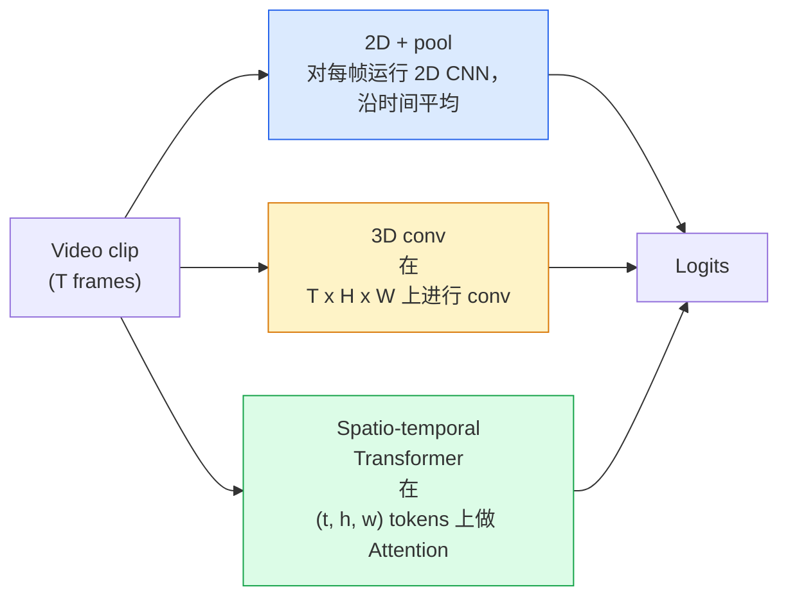

# वीडियो समझ  时间建模

> 视频 एक श्रृंखला है, जो कि भौतिक नियम के साथ जुड़ी हुई है। प्रत्येक वीडियो मॉडल को समय को अतिरिक्त अक्ष के रूप में देखना चाहिए।

**类型：**学习 + 构建
**语言：**पायथन
**先修要求：**चरण 4 पाठ 03(CNNs),चरण 4 पाठ 04(छवि वर्गीकरण)
**时间：**~ 45 मिनट

## 学习目标

- 区分三种主要视频建模方法(2D+पूल、3D conv、स्पेस-टाइमरल ट्रांसफार्मर), तथा अनुमान लगाकर उन्हें लागत एवं सटीक दर पर लेने की
- PyTorch में फ्रेम नमूनाकरण, समयबद्ध पूलिंग, तथा एक 2D+पूल बेसलाइन वर्गीकरण को लागू करें
- 解释为什么I3D के 膨胀3D kernels 能很好地从 ImageNet वजन 迁移,以及因数化 (2+1)D conv के अंतर
- मानक क्रिया-पहचान डेटासेट को समझना और माप:किनेटिक्स-400/600、UCF101、कुछ-कुछ V2; क्लिप स्तर और वीडियो स्तर की शीर्ष-1 सटीकता

## 问题

एक 30 सेकंड、30 फ़ीप्स का वीडियो 900 张图像── सरलता से देखें, वीडियो वर्गीकरण 900 बार छवि वर्गीकरण को चलाना है, फिर कुछ न कुछ संयोजन करना है── जब गति को लगभग हर एक में देखा जाता है, तो यह विधि प्रभावी है;;

प्रत्येक वीडियो संरचना का मूल प्रश्न हैः समय संरचना में किस समय किस तरह से बनाया जाता है? उत्तर गणना लागत सहित अन्य सभी चीजों को निर्धारित करेगा, पूर्व प्रशिक्षण रणनीति, छविनेट वजन का पुनः उपयोग करने के लिए, साथ ही मॉडल किस डेटासेट पर प्रशिक्षण करेगा।

इस वर्ग में समय की मात्रा की कहानी पर ध्यान केंद्रित किया गया है: नमूनाकरण, मॉडलिंग और संश्लेषण।

## 核心概念

### 三类架构家族



### 2 डी + पूल

取一个2D CNN(ResNet、EfficientNet、ViT) 在每个采样上独立运行它──对每的嵌入做平均或最大池,或注意池──将聚向量输入分类器──

优点:
- ImageNet प्री ट्रेनिंग 可以直接迁移──
- 实现最简单――
- 便宜:T  * 单张图像推理成本──

缺点:
- 无法建模运动──क्रिया = उपस्थिति का संश्लेषण──
- समयबद्ध पूलिंग क्रम से संवेदनशील नहीं है; खुले दरवाजे और बंद दरवाजे एक ही दिखते हैं

适用场景: मुख्य कार्य के रूप में दिखाई दे, 小视频数据集 पर स्थानांतरण सीखने, प्रारंभिक आधार रेखाएँ

### 3D घुमाव

2D (H, W) केर्नेल को 3D (T, H, W) केर्नेल में बदलना होगा।

I3D 技巧: एक पूर्व-प्रशिक्षित 2D ImageNet मॉडल ले लो, प्रत्येक 2D कर्नेल को 沿 नये समय轴复制, ताकि 膨胀── एक 3x3 2D कन्भ 变成 एक 3x3x3 3D कन्भ ── यह 3D मॉडल  मजबूत पूर्व-प्रशिक्षित वजन रखने की अनुमति देता है, बजाय शून्य से प्रशिक्षण शुरू करने के लिए──

优点:
- 直接建模 motion──
- I3D मुद्रास्फीति  निःशुल्क हस्तांतरण शिक्षा प्रदान करना

缺点:
- तुलनात्मक 2D मॉडल के अधिक T/8 के FLOPs के लिए समय के कर्नेल के लिए 3 ̊ संचयी 3 बार की स्थिति)
- समय के कर्नेल 很小;长程 आंदोलन 需要金字塔或双流方法──

适用场景:motion is signal's action recognition ((कुछ-कुछ V2、 contains a lot of motion-heavy classes of Kinetics) ]]

### 时空 ट्रांसफार्मर

将视频 टोकन化成空间-समय पैच 网格, और सभी पैच 之间做注意──TimeSformer、ViViT、Video Swin、VideoMAE──

महत्वपूर्ण ध्यान देने योग्य पैटर्नः
- **Joint**                                                                                                                                                                                                                                                              `T*H*W`呈二次复杂度;昂贵──
- **Divided** प्रत्येक ब्लॉक दो बार ध्यान दो बार ध्यान दो बार समय के साथ एक बार अंतरिक्ष के साथ एक बार
- **Factorised** समय का ध्यान और अंतरिक्ष का ध्यान  ब्लॉक के बीच 交换

优点:
- सभी प्रमुख बेंचमार्क में एसओटीए सटीकता प्राप्त करना
- 通过补丁通胀 从图像变形器(ViT)迁移──
- अल्प ध्यान के माध्यम से  समर्थन दीर्घ संदर्भ वीडियो

缺点:
- 计算需求高──
- ध्यान पैटर्न चुनें, अन्यथा रनटाइम में वृद्धि होगी।

适用场景:大数据集、高保真 वीडियो समझ、बहु-मॉडल वीडियो+पाठ कार्य──

### फ्रेम नमूनाकरण

एक 10 सेकंड ∙ 30 fps क्लिप में 300  हैं; इसे सभी 300  में डालें किसी भी मॉडल में बहुत बर्बाद है।

- **Uniform sampling** 在片中均选取 T ──2D+pool 的默认选择──
- **Dense sampling** 随机连续 T-frame window──3D convs 中常见,因为运动 需要相邻──
- **Multi-clip** एक ही वीडियो से कई टी-फ्रेम विंडो,分别分类, और परीक्षण समय औसत भविष्यवाणियों का प्रयोग किया गया है

T आमतौर पर 8、16、32 या 64── उच्चतर T = 更多的时间信号, इसका अर्थ है अधिक गणना──

### मूल्यांकन

दो स्तर:
- **Clip-level accuracy** 模型 देखें एक टी-फ्रेम क्लिप, रिपोर्ट शीर्ष-के
- **Video-level accuracy** प्रत्येक वीडियो के कई क्लिप के लिए क्लिप-स्तर की भविष्यवाणी  औसत; अधिक उच्च और अधिक स्थिर 

始终报告两者── एक स्कोर 78% क्लिप / 82% वीडियो के मॉडल पर अत्यधिक निर्भर करता है परीक्षण समय औसत; एक स्कोर 80% / 81% के मॉडल पर प्रति क्लिप ऊपर अधिक मजबूत──

### आप मिल जाएगा के डेटा संग्रह

- **Kinetics-400 / 600 / 700** 通用 एक्शन डेटासेट──400k क्लिप;YouTube URLs(很多现在已经失效)──
- **Something-Something V2**                                                                                                                                                                                                                                                              
- **UCF-101****HMDB-51** 更老、更小, लेकिन अभी भी रिपोर्ट किया जाता है
- **AVA** अंतरिक्ष एवं समय में क्रिया *स्थानीयकरण*; वर्गीकरण से अधिक कठिन


```figure
v4-video-temporal
```

##  इसे निर्माण

### 步骤 1: फ्रेम नमूना

适用于列表或视频 tensor) के समान 和 घने नमूनाकारों

```python
import numpy as np

def sample_uniform(num_frames_total, T):
    if num_frames_total <= T:
        return list(range(num_frames_total)) + [num_frames_total - 1] * (T - num_frames_total)
    step = num_frames_total / T
    return [int(i * step) for i in range(T)]


def sample_dense(num_frames_total, T, rng=None):
    rng = rng or np.random.default_rng()
    if num_frames_total <= T:
        return list(range(num_frames_total)) + [num_frames_total - 1] * (T - num_frames_total)
    start = int(rng.integers(0, num_frames_total - T + 1))
    return list(range(start, start + T))
```

दो लोग लौट आए`T`个 सूचकांक, काटे हुए वीडियो टेन्सर हेतु प्रयोग किया जाता है

### 步骤 2: एक 2D + पूल बेसलाइन

में प्रति  पर संचालित 2D ResNet-18, औसत पूल सुविधाओं, फिर分类──

```python
import torch
import torch.nn as nn
from torchvision.models import resnet18, ResNet18_Weights

class FramePool(nn.Module):
    def __init__(self, num_classes=400, pretrained=True):
        super().__init__()
        weights = ResNet18_Weights.IMAGENET1K_V1 if pretrained else None
        backbone = resnet18(weights=weights)
        self.features = nn.Sequential(*(list(backbone.children())[:-1]))  # global avg pool kept
        self.head = nn.Linear(512, num_classes)

    def forward(self, x):
        # x: (N, T, 3, H, W)
        N, T = x.shape[:2]
        x = x.view(N * T, *x.shape[2:])
        feats = self.features(x).view(N, T, -1)
        pooled = feats.mean(dim=1)
        return self.head(pooled)

model = FramePool(num_classes=10)
x = torch.randn(2, 8, 3, 224, 224)
print(f"output: {model(x).shape}")
print(f"params: {sum(p.numel() for p in model.parameters()):,}")
```

एक हजार एक लाख पैरामीटर, इमेजनेट पूर्व-प्रशिक्षित, क्रमशः चल रहा है, औसत 分类── उपस्थिति-भारी कार्यों में, यह आधार रेखा आमतौर पर वास्तविक 3 डी मॉडल की तुलना में केवल 5-10                                                                                                                                                                                                                                      

### 步骤 3:I3D शैली में फुलाया 3D कन्वेयर

 नए समय轴重复 वजन के माध्यम से,  एकल 2D कन्वर्ट 转换为 3D कन्वर्ट

```python
def inflate_2d_to_3d(conv2d, time_kernel=3):
    out_c, in_c, kh, kw = conv2d.weight.shape
    weight_3d = conv2d.weight.data.unsqueeze(2)  # (out, in, 1, kh, kw)
    weight_3d = weight_3d.repeat(1, 1, time_kernel, 1, 1) / time_kernel
    conv3d = nn.Conv3d(in_c, out_c, kernel_size=(time_kernel, kh, kw),
                        padding=(time_kernel // 2, conv2d.padding[0], conv2d.padding[1]),
                        stride=(1, conv2d.stride[0], conv2d.stride[1]),
                        bias=False)
    conv3d.weight.data = weight_3d
    return conv3d

conv2d = nn.Conv2d(3, 64, kernel_size=3, padding=1, bias=False)
conv3d = inflate_2d_to_3d(conv2d, time_kernel=3)
print(f"2D weight shape:  {tuple(conv2d.weight.shape)}")
print(f"3D weight shape:  {tuple(conv3d.weight.shape)}")
x = torch.randn(1, 3, 8, 56, 56)
print(f"3D output shape:  {tuple(conv3d(x).shape)}")
```

`time_kernel`                                                                                                                                                                                                                                                              

### 步骤 4: कारकबद्ध (2+1) डी कन्

3D कन्वर्ट को 2D में विभाजित करना (स्पेसियल) कन्वर्ट और 1D (टाइमरल) कन्वर्ट में विभाजित करना)

```python
class Conv2Plus1D(nn.Module):
    def __init__(self, in_c, out_c, kernel_size=3):
        super().__init__()
        mid_c = (in_c * out_c * kernel_size * kernel_size * kernel_size) \
                // (in_c * kernel_size * kernel_size + out_c * kernel_size)
        self.spatial = nn.Conv3d(in_c, mid_c, kernel_size=(1, kernel_size, kernel_size),
                                 padding=(0, kernel_size // 2, kernel_size // 2), bias=False)
        self.bn = nn.BatchNorm3d(mid_c)
        self.act = nn.ReLU(inplace=True)
        self.temporal = nn.Conv3d(mid_c, out_c, kernel_size=(kernel_size, 1, 1),
                                  padding=(kernel_size // 2, 0, 0), bias=False)

    def forward(self, x):
        return self.temporal(self.act(self.bn(self.spatial(x))))

c = Conv2Plus1D(3, 64)
x = torch.randn(1, 3, 8, 56, 56)
print(f"(2+1)D output: {tuple(c(x).shape)}")
```

पूर्ण R(2+1) डी नेटवर्क एक ResNet-18 के समान है, बस प्रत्येक 3x3 conv को बदल दिया`Conv2Plus1D`

## इसका उपयोग करें

两个库覆盖了生产级视频工作:

- `torchvision.models.video` R(2+1) D、MViT、Swin3D, के साथ पूर्व प्रशिक्षित गतिशीलता वजन──API छवि मॉडल के साथ समान──
- `pytorchvideo`(मेटा)  मॉडल चिड़ियाघर  के लिए प्रयोग किया जाता है Kinetics / SSv2 / AVA के डेटा लोडर  मानक परिवर्तनों

对于视觉语言视频模型(视频标题化、视频质量化),使用 `transformers`(`VideoMAE``VideoLLaMA``InternVideo`)。

## 交付 यह

本课会产出:

- `outputs/prompt-video-architecture-picker.md` एक त्वरित, उपस्थिति-विरोधी-गति के आधार पर, डेटासेट आकार तथा गणना बजट  चुनें 2D+पूल / I3D / (2+1)D / ट्रांसफार्मर。
- `outputs/skill-frame-sampler-auditor.md` एक कौशल, वीडियो पाइपलाइन के नमूना की जांच के लिए,并标记常见错误:off-by-one सूचकांक`num_frames < T`时采样 不均、缺少 पहलू-संरक्षण फसल等──

## अभ्यास

1. **（简单）**计算 FramePool 在 T=8 时的 FLOPs(近似值),并与 T=8 के I3D शैली 3D ResNet对比──说明为什么 2D+pool 便宜 3-5 倍──
2. **（中等）**生成一个合成视频数据集:随机小球朝随机方向移动,并按运动方向标注(左到右、右到左、斜向) 在上面训练 FramePool──显示它的准确率接近随机水平,从而证明仅靠外观不足以完成运动任务──
3. **（困难）**通过将ResNet-18 中的每个Conv2d 替换为 `Conv2Plus1D`, एक R(2+1) D-18── ImageNet-pretrained ResNet-18 के साथ निर्माण प्रथम conv के वजनों को बुलाने──

## 关键术语

| Term | 人们常说 | 实际含义 |
|------|----------------|----------------------|
| 2D + pool | “Per-frame classifier” | 在每个采样帧上运行 2D CNN，跨时间 average-pool features，然后分类 |
| 3D convolution | “Spatio-temporal kernel” | 在 (T, H, W) 上进行 conv 的 kernel；可以原生建模 motion |
| Inflation | “Lift 2D weights to 3D” | 通过沿新的时间轴重复 2D conv 的 weights 来初始化 3D conv weights，然后除以 kernel_T 以保持 activation scale |
| (2+1)D | “Factorised conv” | 将 3D 拆成 2D spatial + 1D temporal；参数更少，中间多一个非线性 |
| Divided attention | “Time then space” | 每层有两次 Attention 的 Transformer block：一次在同一帧的 tokens 上，一次在同一位置的 tokens 上 |
| Clip | “T-frame window” | T 帧的采样子序列；video model 消费的单位 |
| Clip vs video accuracy | “Two eval settings” | Clip = 每个视频一个 sample，video = 对多个 sampled clips 取平均 |
| Kinetics | “The ImageNet of video” | 400-700 个 action classes，300k+ YouTube clips，标准 video pretraining corpus |

## 延伸阅读

- [I3D: Quo Vadis, Action Recognition (Carreira & Zisserman, 2017)](https://arxiv.org/abs/1705.07750)  मुद्रास्फीति एवं गति विज्ञान डेटासेट का प्रस्ताव रखा
- [R(2+1)D: A Closer Look at Spatiotemporal Convolutions (Tran et al., 2018)](https://arxiv.org/abs/1711.11248) कारगर संकेतन, आज भी मजबूत आधार रेखा है
- [TimeSformer: Is Space-Time Attention All You Need? (Bertasius et al., 2021)](https://arxiv.org/abs/2102.05095) पहला शक्तिशाली वीडियो ट्रांसफार्मर
- [VideoMAE (Tong et al., 2022)](https://arxiv.org/abs/2203.12602) वीडियो के मास्क ऑटोकोडर प्रीट्रेनिंग के साथ; वर्तमान मुख्यधारा की प्रीट्रेनिंग नुस्खा
