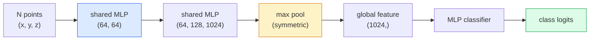

# 3 डी विजन  पॉइंट क्लाउड और एनईआरएफ

> 3D दृष्टि के दो प्रकार हैं। बिंदु बादल सेंसर का मूल आउटपुट है। NeRF सीखने के लिए आयामी क्षेत्र है। दोनों अंतरिक्ष में क्या है इसका उत्तर देते हैं।

**类型：**सीखें + निर्माण करें
**语言：**पायथन
**先修：**चरण 4 पाठ 03 (सीएनएन), चरण 1 पाठ 12 (टेन्सर ऑपरेशन)
**时间：**~ 45 मिनट

## 学习目标
- 区分显式(point cloud、mesh、voxel) और隐式(signed distance field、NeRF) 3D प्रतिनिधित्व,并理解各自适用场景
- PointNet के सममित-कार्य को समझना 技巧: यह कैसे तंत्रिका नेटवर्क को अपरिवर्तित बिंदुओं के लिए परमिट-अवस्थित 性质 बनाने के लिए बनाता है
-  ट्रैकिंग NeRF आगे पासःरे कास्टिंग, वॉल्यूमट्रिक रेंडरिंग, पोजिशनिंग कोडिंग, एमएलपी घनत्व+रंग सिर
- उपयोग `nerfstudio`या `instant-ngp`基于少量带姿的图像进行预训练的3D重建

## 问题
कैमरा  2D छवि उत्पन्न करें。LIDAR  3D बिंदुओं का एक समूह उत्पन्न करें。 संरचना-से-मोशन पाइपलाइन  दुर्लभ 3D कुंजी बिंदुओं का उत्पादन करें।

3D दृष्टि  बहुत महत्वपूर्ण है, क्योंकि लगभग सभी उच्च मूल्य वाले रोबोट कार्य 3D में काम करते हैंः पकड़ना, बाधाओं से बचने, नेविगेशन, AR अवरुद्ध, 3D सामग्री को कैप्चर करना। केवल 2D छवियों के विजन इंजीनियर को समझना, इस क्षेत्र में सबसे तेजी से बढ़ते भाग के बाहर बाहर बाहर रखा जाएगा।

इन दो प्रकार के प्रतिनिधित्वों के कारण विभिन्न कारणों से प्रभावित हैं। बिंदु बादल सेंसर हैं  मुफ्त में आपको कुछ देने के लिए।

## 概念
### बिंदु बादल

बिंदु बादल R^3 中 N 个点 के असंक्रमित संग्रह है, प्रत्येक बिंदु के चयन योग्य है विशेषताएं हैं ((रंग, तीव्रता, सामान्य) 👇

```
cloud = [
  (x1, y1, z1, r1, g1, b1),
  (x2, y2, z2, r2, g2, b2),
  ...
  (xN, yN, zN, rN, gN, bN),
]
```

 कोई ग्रिड नहीं, कोई कनेक्टिविटी नहीं  दो गुण हैं जिससे न्यूरल नेटवर्क को बहुत मुश्किल हो जाता हैः

- **Permutation invariance** 输出不能依赖点的顺序──
- **Variable N**  एक मॉडल  विभिन्न आकार के बादलों को संभाल सकता है 

PointNet (Qi et al., 2017) ने एक विचार के साथ दो समाधान किएः प्रत्येक बिंदु अनुप्रयोग साझा MLP के लिए, फिर सममित फ़ंक्शन के साथ संयोजन। परिणाम एक निश्चित आकार का वेक्टर है, और क्रम पर निर्भर नहीं है।

```
f(P) = max_{p in P} MLP(p)
```

यही पॉइंटनेट के पूरे कोर है। अधिक गहराई से भिन्न होते हुए, प्वाइंटनेट++, प्वाइंट ट्रांसफार्मर ने पदानुक्रमिक नमूनाकरण और स्थानीय संश्लेषण को शामिल किया है, लेकिन सममित-कार्य 技巧 बरकरार है।

### प्वाइंटनेट वास्तुकला



साझा MLP का अर्थ है एक ही MLP 独立地运行在每个点上──为了效率, आमतौर पर 1x1 conv को एक बिंदु आयाम के साथ प्राप्त किया जाता है।

### न्यूरल रेडिएंस फील्ड (NeRFs)

NeRFs (Mildenhall et al., 2020) ने प्रश्न पूछाः हम एक 3D दृश्य को पुनः निर्माण करने में सक्षम होंगे? इसका उत्तर यह हैः एक स्वयं ही दृश्य के साथ तंत्रिका नेटवर्क।`(x, y, z, viewing_direction)`映射到 `(density, colour)`染新视角就是 इस नेटवर्क के चारों ओर एक किरण कास्टिंग चक्र 

```
NeRF MLP:  (x, y, z, theta, phi) -> (sigma, r, g, b)

To render a pixel (u, v) of a new view:
  1. Cast a ray from the camera through pixel (u, v)
  2. Sample points along the ray at distances t_1, t_2, ..., t_N
  3. Query the MLP at each point
  4. Composite the colours weighted by (1 - exp(-sigma * dt))
  5. The sum is the rendered pixel colour
```

हानि 会将染出像素与训练照片中的地面-सत्य पिक्सेल 进行比较──通过染步骤做 Backprop 来更新MLP──没有3D地面真相,没有显式几何场景 存储在MLP重中──

### NeRF के बीच स्थिति एन्कोडिंग

作用在 `(x, y, z)`ऊपर की वैनिला MLP 无法表示高频细节, चूंकि MLP 在频谱上偏向低频──NeRF 通过在送进 MLP 前, प्रत्येक निर्देशांक 编码成Fourier विशेषता वेक्टर इस बिंदु को सुधारने के लिएः

```
gamma(p) = (sin(2^0 pi p), cos(2^0 pi p), sin(2^1 pi p), cos(2^1 pi p), ...)
```

अधिकतम तक L=10 个频率 स्तरों── यह ट्रांसफार्मरों के साथ स्थिति के उपयोग के समान तकनीक है, यह भी विसारण समय कंडीशनिंग में दिखाई देगा️10 पाठ में पुनः प्रकट होगा── इसे नहीं मिला, NeRFs बहुत अस्पष्ट दिखेंगे──

### वॉल्यूमेट्रिक रेंडरिंग

```
C(r) = sum_i T_i * (1 - exp(-sigma_i * delta_i)) * c_i

T_i  = exp(- sum_{j<i} sigma_j * delta_j)
delta_i = t_{i+1} - t_i
```

`T_i`यह संचरण है, यानि वहाँ कितना प्रकाश बिंदु तक पहुँचने के लिए कर सकते हैं`(1 - exp(-sigma_i * delta_i))`यै पॉइंट इ 处 की अस्पष्टता`c_i`                                                                                                                                                                                                                                                              

### एनईआरएफ की जगह क्या ले गया

纯 NeRFs 训练慢(数小时),染也慢(每张图数秒)。此后的发展脉络如下:

- **Instant-NGP**(2022)  हैश-ग्रिड एन्कोडिंग 替代 MLP का स्थिति इनपुट;数秒内完成训练──
- **Mip-NeRF 360** 处理 unlimited scenes 和 विरोधी अलियंसिंग──
- **3D Gaussian Splatting**(2023)  लाखों 3D गौसीयन  बदला वॉल्यूमेट्रिक क्षेत्र;数分钟训练,实时染──当前生产环境的默认选择──

2026 साल लगभग सभी वास्तविक NeRF उत्पाद  वास्तव में 3D Gaussian splatting हैं。心智模型 अभी भी NeRF है。

### डेटासेट और बेंचमार्क

- **ShapeNet** 3 डी सीएडी मॉडल ् ् ् ् ् ् ् ् ् ् ् ् ् ् ् ् ् ् ् ् ् ् ् ् ् ् ् ् ् ् ् ् ् ् ् ् ् ् ् ् ् ् ् ् ् ् ् ् ् ् ् ् ् ् ् ् ् ् ् ् ् ् ् ् ् ् ् ् ् ् ् ् ् ् ् ् ् ् ् ् ् ् ् ् ् ् ् ् ् ् ् ् ् ् ् ् ् ् ् ् ् ् ् ् ् ् ् ् ् ् ् ् ् ् ् ् ् ् ् ् ् ् ् ् ् ् ् ् ् ् ् ् ् ् ् ् ् ् ् ् ् ् ् ् ् ् ् ् ् ् ् ् ् ् ् ् ् ् ् ् ् ् ् ् ् ् ् ् ् ् ् ् ् ् ् ् ् ् ् ् ् ् ् ् ् ् ् ् ् ् ् ् ् ् ् ् ् ् ् ् ् ् ् ् ् ् ् ् ् ् ् ् ् ् ् ् ् ् ् ् ् ् ् ् ् ् ् ् ् ् ् ् ् ् ् ् ् ् ् ् ् ् ् ् ् ् ् ् ् ् ्
- **ScanNet** सेगमेंटेशन के वास्तविक कमरे के अंदर स्कैन के साथ
- **KITTI** स्वायत्त ड्राइविंग के लिए उपयोग किया जाता है LIDAR बिंदु बादल के बाहर
- **NeRF Synthetic**/**Blended MVS** व्यू संश्लेषण के लिए पोस्ट-इमेज डेटासेट हेतु हेतु हेतु हेतु हेतु हेतु हेतु हेतु हेतु हेतु हेतु हेतु हेतु हेतु हेतु हेतु हेतु हेतु हेतु हेतु हेतु हेतु हेतु हेतु हेतु हेतु हेतु हेतु हेतु हेतु हेतु हेतु हेतु हेतु हेतु हेतु हेतु हेतु हेतु हेतु हेतु हेतु हेतु हेतु हेतु हेतु हेतु हेतु हेतु हेतु हेतु हेतु हेतु हेतु हेतु हेतु हेतु हेतु हेतु हेतु हेतु हेतु हेतु हेतु हेतु हेतु हेतु हेतु हेतु हेतु हेतु हेतु हेतु हेतु हेतु हेतु हेतु हेतु हेतु हेतु हेतु हेतु हेतु हेतु हेतु हेतु हेतु हेतु हेतु हेतु हेतु हेतु हेतु हेतु हेतु हेतु हेतु हेतु हेतु हेतु हेतु हेतु हेतु हेतु हेतु हेतु हेतु हेतु हेतु हेतु हेतु हेतु हेतु हेतु हेतु हेतु हेतु हेतु हेतु हेतु हेतु हेतु हेतु हेतु हेतु हेतु हेतु हेतु हेतु हेतु हेतु हेतु हेतु हेतु हेतु हेतु हेतु हेतु हेतु हेतु हेतु हेतु हेतु हेतु हेतु हेतु हेतु हेतु हेतु हेतु हेतु हेतु हेतु हेतु हेतु हेतु हेतु हेतु हेतु हेतु हेतु हेतु हेतु हेतु हेतु हेतु हेतु हेतु हेतु हेतु हेतु हेतु हेतु हेतु हेतु हेतु हेतु हेतु हेतु हेतु हेतु हेतु हेतु हेतु हेतु हेतु हेतु हेतु हेतु हेतु हेतु हेतु हेतु हेतु हेतु हेतु हेतु हेतु हेतु हेतु हेतु हेतु हेतु हेतु हेतु हेतु हेतु हेतु हेतु हेतु हेतु हेतु हेतु हेतु हेतु हेतु हेतु हेतु हेतु हेतु हेतु हेतु हेतु हेतु हेतु हेतु हेतु हेतु हेतु हेतु हेतु हेतु हेतु हेतु हेतु हेतु हेतु हेतु हेतु हेतु हेतु हेतु हेतु हेतु हेतु हेतु हेतु हेतु हेतु हेतु हेतु हेतु हेतु हेतु हेतु हेतु हेतु हेतु हेतु हेतु हेतु हेतु हेतु हेतु हेतु हेतु हेतु हेतु हेतु हेतु हेतु हेतु हेतु हेतु हेतु हेतु हेतु हेतु हेतु हेतु हेतु हेतु हेतु हेतु हेतु हेतु हेतु हेतु हेतु हेतु हेतु हेतु हेतु हेतु हेतु हेतु हेतु हेतु हेतु हेतु हेतु हेतु हेतु हेतु हेतु हेतु हेतु हेतु हेतु हेतु हेतु हेतु हेतु हेतु हेतु हेतु हेतु हेतु हेतु हेतु हेतु हेतु हेतु हेतु हेतु हेतु हेतु हेतु हेतु हेतु हेतु हेतु हेतु हेतु हेतु हेतु हेतु हेतु हेतु हेतु हेतु हेतु हेतु हेतु हेतु हेतु हेतु हेतु हेतु हेतु हेतु हेतु हेतु हेतु हेतु हेतु हेतु हेतु हेतु हेतु हेतु हेतु हेतु हेतु हेतु हेतु हेतु हेतु हेतु हेतु हेतु हेतु हेतु हेतु हेतु हेतु हेतु हेतु हेतु हेतु हेतु हेतु हेतु हेतु हेतु हेतु हेतु हेतु हेतु हेतु हेतु हेतु हेतु हेतु हेतु हेतु हेतु हेतु हेतु हेतु हेतु हेतु हेतु हेतु हेतु हेतु हेतु हेतु हेतु हेतु हेतु हेतु हेतु हेतु हेतु हेतु हेतु हेतु हेतु हेतु हेतु हेतु हेतु हेतु हेतु हेतु हेतु हेतु हेतु हेतु हेतु हेतु हेतु हेतु हेतु हेतु हेतु हेतु हेतु हेतु हेतु हेतु हेतु हेतु हेतु हेतु हेतु हेतु हेतु हेतु हेतु हेतु हेतु हेतु हेतु हेतु हेतु हेतु हेतु हेतु हेतु हेतु हेतु हेतु हेतु हेतु हेतु हेतु हेतु हेतु हेतु हेतु हेतु हेतु हेतु हेतु हेतु हेतु हेतु हेतु हेतु हेतु हेतु हेतु हेतु हेतु हेतु हेतु हेतु हेतु हेतु हेतु हेतु
- **Mip-NeRF 360**डेटासेट  अनलिमिटेड वास्तविक दृश्यों。


```figure
nerf-rays
```

##  इसे निर्माण
### 步骤 1: प्वाइंटनेट वर्गीकरण

```python
import torch
import torch.nn as nn

class PointNet(nn.Module):
    def __init__(self, num_classes=10):
        super().__init__()
        self.mlp1 = nn.Sequential(
            nn.Conv1d(3, 64, 1),    nn.BatchNorm1d(64),   nn.ReLU(inplace=True),
            nn.Conv1d(64, 64, 1),   nn.BatchNorm1d(64),   nn.ReLU(inplace=True),
        )
        self.mlp2 = nn.Sequential(
            nn.Conv1d(64, 128, 1),  nn.BatchNorm1d(128),  nn.ReLU(inplace=True),
            nn.Conv1d(128, 1024, 1), nn.BatchNorm1d(1024), nn.ReLU(inplace=True),
        )
        self.head = nn.Sequential(
            nn.Linear(1024, 512),   nn.BatchNorm1d(512),  nn.ReLU(inplace=True),
            nn.Dropout(0.3),
            nn.Linear(512, 256),    nn.BatchNorm1d(256),  nn.ReLU(inplace=True),
            nn.Dropout(0.3),
            nn.Linear(256, num_classes),
        )

    def forward(self, x):
        # x: (N, 3, num_points) — transposed for Conv1d
        x = self.mlp1(x)
        x = self.mlp2(x)
        x = torch.max(x, dim=-1)[0]       # (N, 1024)
        return self.head(x)

pts = torch.randn(4, 3, 1024)
net = PointNet(num_classes=10)
print(f"output: {net(pts).shape}")
print(f"params: {sum(p.numel() for p in net.parameters()):,}")
```

≈ 1.6M पैरामीटर ≈ प्रत्येक बादल ≈ 1,024 ≈ बिंदुओं पर संचालित होता है ≈

### 步骤 2: स्थिति एन्कोडिंग

```python
def positional_encoding(x, L=10):
    """
    x: (..., D) -> (..., D * 2 * L)
    """
    freqs = 2.0 ** torch.arange(L, dtype=x.dtype, device=x.device)
    args = x.unsqueeze(-1) * freqs * 3.141592653589793
    sinc = torch.cat([args.sin(), args.cos()], dim=-1)
    return sinc.reshape(*x.shape[:-1], -1)

x = torch.randn(5, 3)
y = positional_encoding(x, L=10)
print(f"input:  {x.shape}")
print(f"encoded: {y.shape}     # (5, 60)")
```

乘以 `2^l * pi`मैं धीरे-धीरे उच्चतर आवृत्तियों को प्राप्त करूंगा।

### 步骤 3: लघु NeRF MLP

```python
class TinyNeRF(nn.Module):
    def __init__(self, L_pos=10, L_dir=4, hidden=128):
        super().__init__()
        self.L_pos = L_pos
        self.L_dir = L_dir
        pos_dim = 3 * 2 * L_pos
        dir_dim = 3 * 2 * L_dir
        self.trunk = nn.Sequential(
            nn.Linear(pos_dim, hidden), nn.ReLU(inplace=True),
            nn.Linear(hidden, hidden),  nn.ReLU(inplace=True),
            nn.Linear(hidden, hidden),  nn.ReLU(inplace=True),
            nn.Linear(hidden, hidden),  nn.ReLU(inplace=True),
        )
        self.sigma = nn.Linear(hidden, 1)
        self.color = nn.Sequential(
            nn.Linear(hidden + dir_dim, hidden // 2), nn.ReLU(inplace=True),
            nn.Linear(hidden // 2, 3), nn.Sigmoid(),
        )

    def forward(self, x, d):
        x_enc = positional_encoding(x, self.L_pos)
        d_enc = positional_encoding(d, self.L_dir)
        h = self.trunk(x_enc)
        sigma = torch.relu(self.sigma(h)).squeeze(-1)
        rgb = self.color(torch.cat([h, d_enc], dim=-1))
        return sigma, rgb

nerf = TinyNeRF()
x = torch.randn(128, 3)
d = torch.randn(128, 3)
s, c = nerf(x, d)
print(f"sigma: {s.shape}   rgb: {c.shape}")
```

मूल NeRF के साथ तुलना में बहुत छोटा है।

### 步骤 4: एक किरण के साथ वॉल्यूमेट्रिक प्रतिपादन

```python
def volumetric_render(sigma, rgb, t_vals):
    """
    sigma: (..., N_samples)
    rgb:   (..., N_samples, 3)
    t_vals: (N_samples,) distances along the ray
    """
    delta = torch.cat([t_vals[1:] - t_vals[:-1], torch.full_like(t_vals[:1], 1e10)])
    alpha = 1.0 - torch.exp(-sigma * delta)
    trans = torch.cumprod(torch.cat([torch.ones_like(alpha[..., :1]), 1.0 - alpha + 1e-10], dim=-1), dim=-1)[..., :-1]
    weights = alpha * trans
    rendered = (weights.unsqueeze(-1) * rgb).sum(dim=-2)
    depth = (weights * t_vals).sum(dim=-1)
    return rendered, depth, weights


N = 64
t_vals = torch.linspace(2.0, 6.0, N)
sigma = torch.rand(N) * 0.5
rgb = torch.rand(N, 3)
rendered, depth, weights = volumetric_render(sigma, rgb, t_vals)
print(f"rendered colour: {rendered.tolist()}")
print(f"depth:           {depth.item():.2f}")
```

एक रे, 64 ्सैम्पल, एक आरजीबी पिक्सेल और एक गहराई बनने के लिए एक साथ

## इसका उपयोग करें
वास्तविक काम के लिएः

- `nerfstudio`(Tancik et al.)  当前用于 NeRF / Instant-NGP / Gaussian Splatting का संदर्भ पुस्तकालय──命令行加网观看者──
- `pytorch3d`(मेटा)  विभेदित रेंडरिंग पॉइंट क्लाउड उपयोगिताएँ मेश ऑपरेशन्स 
- `open3d` बिंदु क्लाउड प्रसंस्करण, पंजीकरण, विज़ुअलाइज़ेशन

部署时,3D गैशियन स्प्लैटिंग 基本取代纯 NeRFs, क्योंकि यह 染速度快100倍──पुनर्निर्माण गुणवत्ता 具有可比性──

## 交付 यह
本课产出:

- `outputs/prompt-3d-task-router.md` एक शीघ्र, कार्य के आधार पर होगा 和 इनपुट डेटा 路由到合适的3D प्रतिनिधित्व(बिंदु बादल、 जाल、वॉक्सल、NeRF、गॉसियन स्प्लेट) 
- `outputs/skill-point-cloud-loader.md` एक कौशल, PyTorch लिखने के लिए उपयोग किया जाता है `Dataset`, लोड .ply / .pcd / .xyz 文件,并 सही मानकीकरण, केन्द्रित और बिंदु नमूनाकरण

## अभ्यास
1. **（Easy）**证明PointNet is permutation-invariant:将同一个云 运行两次,一次保持原顺序,一次打乱点――验证输出除了浮点噪音之外完全相同――
2. **（Medium）**实现 एक न्यूनतम किरण-उत्पादन समारोहः दी गई निर्धारित कैमरा अंतर्निहित और स्थिति, के लिए H x W छवि के प्रत्येक पिक्सेल 生成 किरण मूल और दिशाओं
3. **（Hard）**️️️️️️️️️️️️️️️️️️️️️️️️️️️️️️️️️️️️️️️️️️️️️️️️️️️️️️️️️️️️️️️️️️️️️️️️️️️️️️️️️️️️️️️️️️️️️️️️️️️️️️️️️️️️️️️️️️️️️️️️️️️️️️️️️️️️️️️️️️️️️️️️️️️️️️️️️️️️️️️️️️️️️️️️️️️️️️️️️️️️️️️️️️️️️️️️️️️️️️️️️️️️️️️️️️️️️️️️️️️️️️️️️️️️️️️️️️️️️️️️️️️️️️️️️️️️️️️️️️️️️️️️️️️️️️️️️️️️️️️️️️️️️️️️️️️️️️️️️️️️️️️️️️️️️️️️️️️️️️️️️️️️️️️️️️️️️️️️️️️️️️️️️️️️️️️️️️️️️️️️️️️️️️️️️️️️️️️️️️️️️️️️️️️️️️️️️️️️️️️️️️️️️️️️️️️️️️️️️️️️️️️️️️️️️️️️️️️️️️️️️️️️️️️️️️️️️️️️️️️️️️️️️️️️️️️️️️️️️️️️️️️️️️️️️️️️️️️️️️️️️️️️️️️️

## 关键术语
| Term | 人们常说 | 实际含义 |
|------|----------------|----------------------|
| Point cloud | “来自 LIDAR 的 3D points” | 无序的 (x, y, z) 集合 + 每个点可选的 features |
| PointNet | “第一个用于 point clouds 的 neural net” | 每个点一个 shared MLP + symmetric (max) pool；结构上天然 permutation-invariant |
| NeRF | “本身就是 scene 的 MLP” | 将 (x, y, z, dir) 映射到 (density, colour) 的 network；通过 ray casting 渲染 |
| Positional encoding | “Fourier features” | 将每个 coordinate 编码为多个 frequencies 下的 sin/cos，以克服 MLP 的低频偏置 |
| Volumetric rendering | “Ray integration” | 使用 transmittance 和 alpha 将 ray 上的 samples 合成为单个 pixel |
| Instant-NGP | “Hash-grid NeRF” | 用 multi-resolution hash grid 替换 NeRF 的 coordinate MLP；快 100-1000 倍 |
| 3D Gaussian splatting | “数百万个 Gaussians” | Scene = 3D Gaussians 的集合；实时渲染，数分钟训练 |
| SDF | “Signed distance field” | 返回到最近 surface 的 signed distance 的 function；另一种 implicit representation |

## 延伸阅读
- [PointNet (Qi et al., 2017)](https://arxiv.org/abs/1612.00593) परमुट-अनवियरेंट वर्गीकरण
- [NeRF (Mildenhall et al., 2020)](https://arxiv.org/abs/2003.08934) 让从照片进行3D重建 成为神经网络问题 的论文
- [Instant-NGP (Müller et al., 2022)](https://arxiv.org/abs/2201.05989) हैश ग्रिड,1000 倍加速
- [3D Gaussian Splatting (Kerbl et al., 2023)](https://arxiv.org/abs/2308.04079) उत्पादन में नेआरएफ की वास्तुकला को प्रतिस्थापित करना
