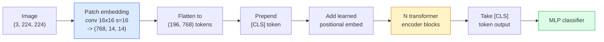

# दृष्टि परिवर्तनक (ViT)

> चित्र को पैच में काटें, प्रत्येक पैच को एक शब्द में काटें, मानक ट्रांसफार्मर को लागू करें

**类型：**构建
**语言：**पायथन
**前置要求：**चरण 7 पाठ 02 (स्व-ध्यान), चरण 4 पाठ 04 (छवि वर्गीकरण)
**时间：**~ 45 मिनट

## 学习目标

- शून्य से पैच एम्बेडिंग को प्राप्त करने से, सीखे गए स्थितिगत एम्बेडिंग, वर्ग टोकन और ट्रांसफार्मर एन्कोडर ब्लॉक, एक न्यूनतम ViT का निर्माण करें
-  समझाएँ कि क्यों वीटी  को पहले से ही समुद्री प्रशिक्षण डेटा की आवश्यकता थी, जब तक डीईटी और एमएई  साबित नहीं हुआ
- से संरचनागत अग्रिम कोण तुलना ViT、Swin 和 ConvNeXt(无先验、स्थानीय खिड़की ध्यान、conv रीढ़ की हड्डी)
- उपयोग `timm`和标准 रैखिक-सर्वेक्षण / ठीक-ठाक 流程,在小数据集上 ठीक-ठाक 预训练 ViT

## 问题

दशकों से, कन्भल्यूशन 几乎就是计算机视觉的同义词──CNN 具有很强的诱导偏见,包括本地化、翻译等差,没人认为你能替代它们──随后, डोसोविट्स्की等人 (2020) 证明, एक सीधा लागू किया गया है, सामान्य ट्रांसफार्मर के चित्र पट्टी के लिए, पूरी तरह से बिना कन्भल्यूशनल तंत्र का उपयोग, भी बड़े पैमाने पर पर्याप्त समय में मेल खाने के लिए और यहां तक कि सबसे अच्छा CNN 

关键在于规模足够大──在 ImageNet-1k 上,ViT 输给了ResNet──先在 ImageNet-21k 或 JFT-300M 上预训练,再在 ImageNet-1k 上细调的 ViT 则超过它──当时的结论是:变压器 缺少有用的先验,但可以从足够的数据中学习这些先验──后续工作 ((DeiT、MAE、DINO) 显示,只要训练配方正确,例如强增强、自监督预训练、蒸,ViT 在小数据上也可以训练很好──

2026 तक, शुद्ध सीएनएन पर एज डिवाइसों पर अभी भी प्रतिस्पर्धा है। ConvNeXt सबसे मजबूत है, लेकिन ट्रांसफार्मर ने लगभग सभी अन्य दिशाओं को नियंत्रित किया हैः विभाजन।

## 核心概念

### 流程



七个步骤――Patches -> tokens -> attention -> classifier── प्रत्येक变体(DeiT、Swin、ConvNeXt、MAE प्री ट्रेनिंग) 都只改变这七步中的一个两个,其余保持不变──

### पैच एम्बेडिंग

पहला कंकड़ है महत्वपूर्ण। कंकड़ का आकार 16, चरण 16, इसलिए एक张 224x224 图像会变成 14x14 का网格, से बना 16x16 पैच 组成, प्रत्येक पैच को 768-dim एम्बेडिंग के रूप में प्रोजेक्शन किया गया है।

```
Input:  (3, 224, 224)
Conv (3 -> 768, k=16, s=16, no padding):
Output: (768, 14, 14)
Flatten spatial: (196, 768)
```

196 पैच = 196 टोकन。 प्रत्येक टोकन का फीचर आयाम 768(ViT-B)、1024(ViT-L) या 1280(ViT-H)。 है।

### वर्ग टोकन

एक सीखा वेक्टर में एक क्रम में पहले जोड़ा गयाः

```
tokens = [CLS; patch_1; patch_2; ...; patch_196]   shape (197, 768)
```

经过 N 个 ट्रांसफार्मर ब्लॉक 后,`[CLS]`आउटपुट है, यह एक वेक्टर है।

### स्थितिगत सम्मिलन

ट्रांसफार्मर 没有内置的空间位置概念── प्रत्येक टोकन के लिए एक सीखा वेक्टर के साथः

```
tokens = tokens + learned_pos_embedding   (also shape (197, 768))
```

यह एम्बेडिंग मॉडल का एक पैरामीटर है; ग्रेडिएंट आधारित प्रशिक्षण इसे 2D 图像 संरचना के अनुकूल करेगा।

### ट्रांसफार्मर एन्कोडर ब्लॉक

标准结构──बहु-हेड स्व-विचार、MLP、अवशिष्ट कनेक्शन、पूर्व-परतNorm──

```
x = x + MSA(LN(x))
x = x + MLP(LN(x))

MLP is two-layer with GELU: Linear(d -> 4d) -> GELU -> Linear(4d -> d)
```

ViT-B/16  堆积 12 个这样的块, प्रत्येक ब्लॉक में 12 个注意头, कुल 86M मापदंडों 

### पूर्व-एलएन का उपयोग क्यों करें

早期 ट्रांसफार्मर 使用 पोस्ट-LN(`x = LN(x + sublayer(x))`), बिना वार्मिंग के, 6-8 स्तर से अधिक का प्रशिक्षण बहुत मुश्किल है।`x = x + sublayer(LN(x))`) बिना वार्मिंग के स्थिति में अधिक गहरे नेटवर्क को स्थिर प्रशिक्षण प्रदान कर सकते हैं।

### पैच आकार 权衡

- 16x16 पैच -> 196 टोकन, मानक सेटिंग
- 32x32 पैच -> 49 टोकन, अधिक तेजी से लेकिन संकल्प कम है
- 8x8 पैच -> 784 टोकन, अधिक सटीक, लेकिन O(n^2) ध्यान लागत  विस्तार性 बहुत ही कम है

अधिक बड़े पैच = अधिक कम टोकन = अधिक तेज़ लेकिन अंतरिक्ष विवरण कम──SwinV2 पदानुक्रमिक खिड़कियों में 4x4 पैच का उपयोग करता है──

### DeiT में ImageNet-1k 上训练 ViT का ढांचा

मूल ViT 需要JFT-300M 才能超过CNN──DeiT(Touvron et al., 2020) केवल ImageNet-1k का उपयोग करके, बस चार परिवर्तनों के माध्यम से ViT-B 训练将81.8% शीर्ष-1:

1. भारी वृद्धिः रैंडम वृद्धि、मिक्सअप、कटमिक्स、रैंडम मिटाना。
2. स्टोकास्टिक गहराई (अभ्यास समय)
3. दोहराया गया वृद्धि ((एक ही छवियों में प्रत्येक बैच में 中采样 3 次)
4. सीएनएन शिक्षक से  करे डिस्टिलशन 可选,会进一步提升精度)

प्रत्येक आधुनिक वीटी प्रशिक्षण उपकरण डेटी से उत्पन्न होते हैं।

### स्विन बनाम कन्वेनेक्स

- **Swin**(Liu et al., 2021)   विंडो पर आधारित ध्यान प्रत्येक ब्लॉक केवल स्थानीय विंडो में ध्यान केंद्रित करता है; आदान-प्रदान ब्लॉक 会移动 विंडो, ताकि खिड़कियों के पार 混合信息  混合信息                                                                                                                                                                                                                                  
- **ConvNeXt**(Liu et al., 2022)  重新设计的CNN,匹配 Swin的架构选择( गहराई से convs、LayerNorm、GELU、 उल्टा बोतल गला)  यह बताता है कि अंतर  ध्यान बनाम घुमाव नहीं है, बल्कि  आधुनिक प्रशिक्षण संयोजन + 架构──

2026 में, ConvNeXt-V2 और Swin-V2 सभी उत्पादन श्रेणी चयन हैं; सही चयन आपके निष्कर्ष स्टैक पर निर्भर करता है

### एमएई पूर्व प्रशिक्षण

Masked Autoencoder(He et al., 2022):随机 मास्क 75% पैच, प्रशिक्षण एन्कोडर केवल 25% को संसाधित करने के लिए, पुनः प्रशिक्षण एक छोटा डिकोडर, एन्कोडर आउटपुट के अनुसार 重建被 मास्क के पैचों──预训完成后,丢弃了解码并没有细调编码──

MAE 让 ViT केवल ImageNet-1k के साथ भी प्रशिक्षित किया जा सकता है, SOTA तक पहुंच सकता है, और यह वर्तमान में स्व-निरीक्षण योग्य उपकरण है।


```figure
batchnorm-inference
```

##  इसे निर्माण

### 步骤 1: पैच एम्बेडिंग

```python
import torch
import torch.nn as nn

class PatchEmbedding(nn.Module):
    def __init__(self, in_channels=3, patch_size=16, dim=192, image_size=64):
        super().__init__()
        assert image_size % patch_size == 0
        self.proj = nn.Conv2d(in_channels, dim, kernel_size=patch_size, stride=patch_size)
        num_patches = (image_size // patch_size) ** 2
        self.num_patches = num_patches

    def forward(self, x):
        x = self.proj(x)
        return x.flatten(2).transpose(1, 2)
```

एक कन्वि, एक फ्लैट, एक ट्रांसपोस. यह पूर्ण छवि-से-टोकन चरण है.

### 步骤 2: ट्रांसफार्मर ब्लॉक

पूर्व-एलएन, मल्टी-हेड स्व-विचार, ले जाया गया GELU के एमएलपी, शेष कनेक्शन

```python
class Block(nn.Module):
    def __init__(self, dim, num_heads, mlp_ratio=4, dropout=0.0):
        super().__init__()
        self.ln1 = nn.LayerNorm(dim)
        self.attn = nn.MultiheadAttention(dim, num_heads, dropout=dropout, batch_first=True)
        self.ln2 = nn.LayerNorm(dim)
        self.mlp = nn.Sequential(
            nn.Linear(dim, dim * mlp_ratio),
            nn.GELU(),
            nn.Dropout(dropout),
            nn.Linear(dim * mlp_ratio, dim),
            nn.Dropout(dropout),
        )

    def forward(self, x):
        a, _ = self.attn(self.ln1(x), self.ln1(x), self.ln1(x), need_weights=False)
        x = x + a
        x = x + self.mlp(self.ln2(x))
        return x
```

`nn.MultiheadAttention`负责拆分头, स्केलड डॉट-प्रोडक्ट, तथा आउटपुट प्रोजेक्शन`batch_first=True`, इसलिए आकार है `(N, seq, dim)`

### 步骤 3: वीआईटी

```python
class ViT(nn.Module):
    def __init__(self, image_size=64, patch_size=16, in_channels=3,
                 num_classes=10, dim=192, depth=6, num_heads=3, mlp_ratio=4):
        super().__init__()
        self.patch = PatchEmbedding(in_channels, patch_size, dim, image_size)
        num_patches = self.patch.num_patches
        self.cls_token = nn.Parameter(torch.zeros(1, 1, dim))
        self.pos_embed = nn.Parameter(torch.zeros(1, num_patches + 1, dim))
        self.blocks = nn.ModuleList([
            Block(dim, num_heads, mlp_ratio) for _ in range(depth)
        ])
        self.ln = nn.LayerNorm(dim)
        self.head = nn.Linear(dim, num_classes)
        nn.init.trunc_normal_(self.pos_embed, std=0.02)
        nn.init.trunc_normal_(self.cls_token, std=0.02)

    def forward(self, x):
        x = self.patch(x)
        cls = self.cls_token.expand(x.size(0), -1, -1)
        x = torch.cat([cls, x], dim=1)
        x = x + self.pos_embed
        for blk in self.blocks:
            x = blk(x)
        x = self.ln(x[:, 0])
        return self.head(x)

vit = ViT(image_size=64, patch_size=16, num_classes=10, dim=192, depth=6, num_heads=3)
x = torch.randn(2, 3, 64, 64)
print(f"output: {vit(x).shape}")
print(f"params: {sum(p.numel() for p in vit.parameters()):,}")
```

लगभग 2.8M पैरामीटर, एक CPU पर संसाधित किया जा सकता है छोटे ViT── असली ViT-B 86M है; एक ही वर्ग परिभाषा का उपयोग करते हुए,并设置 `dim=768, depth=12, num_heads=12`

### 步骤 4: मानसिकता जांच  单图像推理

```python
logits = vit(torch.randn(1, 3, 64, 64))
print(f"logits: {logits}")
print(f"probs:  {logits.softmax(-1)}")
```

应该能无错运行──概率 总和为1──

## इसका उपयोग करें

`timm`提供了所有 ViT 变体及其ImageNet पूर्व प्रशिक्षित वजन──一行代码:

```python
import timm

model = timm.create_model("vit_base_patch16_224", pretrained=True, num_classes=10)
```

`timm`यह एक ही एपीआई में ViT,Deit,Swin,Swin-V2,ConvNeXt,ConvNeXt-V2,MaxViT,MViT,EfficientFormer और दर्जनों अन्य मॉडल का समर्थन करता है।

对于多动态 工作(图像 + text),`transformers`提供 CLIP、SigLIP、BLIP-2、LLaVA── इन मॉडलों में छवि एन्कोडर सभी एक प्रकार के ViT 变体 हैं──

## 交付 यह

本课会产出:

- `outputs/prompt-vit-vs-cnn-picker.md` एक संकेत, डेटासेट आकार, गणना और निष्कर्ष स्टैक के आधार पर, में ViT, ConvNeXt या Swin 之间做选择──
- `outputs/skill-vit-patch-and-pos-embed-inspector.md` एक कौशल, परीक्षण के लिए प्रयोग किया जाता है ViT के पैच एम्बेडिंग और स्थितित्मक एम्बेडिंग आकारों या नहीं के अनुरूप मॉडल अपेक्षित अनुक्रम लंबाई, पकड़ सबसे आम है प्रत्यारोपण बग──

## अभ्यास

1. **（Easy）**印上小型ViT 中一次前进传递的每一个中间 tensor shape──确认:input `(N, 3, 64, 64)`-> पैच `(N, 16, 192)`-> CLS के साथ `(N, 17, 192)`-> वर्गीकरणकर्ता इनपुट `(N, 192)`-> आउटपुट `(N, num_classes)`
2. **（Medium）**पाठ 4 के सिंथेटिक-CIFAR डेटा संग्रह पर ठीक-ठीक एक पूर्व प्रशिक्षण`timm`ViT-S/16── उसी डेटा पर ResNet-18 परिष्करण तुलना करना── रिपोर्ट प्रशिक्षण समय तथा अंतिम सटीकता──
3. **（Hard）** लघु ViT 实现 MAE प्रीट्रेनिंग: मास्क 75% के पैच, प्रशिक्षण एन्कोडर + एक छोटा डीकोडर 来重建被 मास्क के पैच── तुलना प्रीट्रेनिंग 前后在合成数据 上的线性探测精度──

## 关键术语

| Term | 人们常说 | 实际含义 |
|------|----------------|----------------------|
| Patch embedding | “第一个 conv” | kernel size = stride = patch size 的 conv；将图像转换为 token embeddings 的网格 |
| Class token | “[CLS]” | 加在 token sequence 前面的 learned vector；它的最终 output 是全局图像表示 |
| Positional embedding | “Learned pos” | 添加到每个 token 上的 learned vector，让 transformer 知道每个 patch 来自哪里 |
| Pre-LN | “LayerNorm before sublayer” | 稳定的 transformer 变体：使用 `x + sublayer(LN(x))`，而不是 `LN(x + sublayer(x))` |
| Multi-head attention | “Parallel attention” | 标准 transformer attention，被拆分为 num_heads 个独立子空间，之后再 concatenated |
| ViT-B/16 | “Base, patch 16” | 规范尺寸：dim=768、depth=12、heads=12、patch_size=16、image=224；约 86M params |
| DeiT | “Data-efficient ViT” | 只用 ImageNet-1k 并配合强 augmentation 训练的 ViT；证明大型 pretraining datasets 并非绝对必要 |
| MAE | “Masked autoencoder” | Self-supervised pretraining：mask 75% 的 patches 并重建；主流 ViT pretraining 配方 |

## 延伸阅读

- [An Image is Worth 16x16 Words (Dosovitskiy et al., 2020)](https://arxiv.org/abs/2010.11929) ViT 论文
- [DeiT: Data-efficient Image Transformers (Touvron et al., 2020)](https://arxiv.org/abs/2012.12877) कैसे केवल ImageNet-1k  प्रशिक्षण ViT के साथ
- [Masked Autoencoders are Scalable Vision Learners (He et al., 2022)](https://arxiv.org/abs/2111.06377) MAE 预训练
- [timm documentation](https://huggingface.co/docs/timm) आप उत्पादन में उपयोग किए जाने वाले प्रत्येक दृष्टि ट्रांसफार्मर के संदर्भ दस्तावेज़
