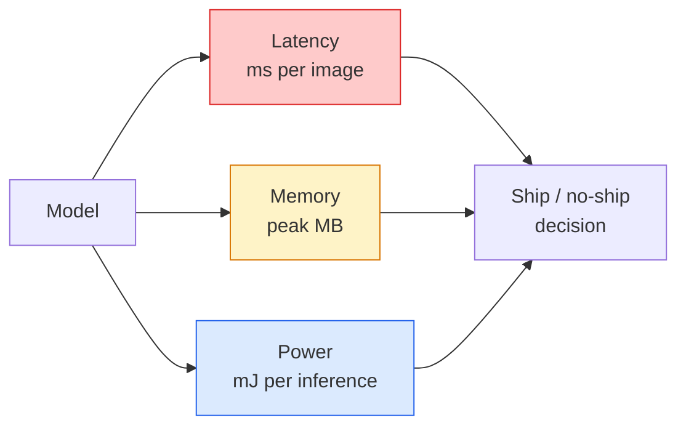

# वास्तविक समय दृष्टि  边缘部署

> एज इन्फेरेंस एक 90 सटीकता मॉडल है जो केवल 2 जीबी रैम वाले उपकरणों पर 30 एफपीएस पर चलती है। प्रत्येक प्रतिशत बिंदु की सटीकता को मिलीसेकंड स्तर की विलंबता के साथ बदला जाना चाहिए।

**Type:** Learn + Build
**Languages:** Python
**Prerequisites:** Phase 4 Lesson 04 (Image Classification), Phase 10 Lesson 11 (Quantization)
**Time:** ~75 minutes

## 学习目标
- 测量任意 PyTorch model का inference latency、peak memory 和 throughput,并读懂 FLOPs / parameters / latency  के बीच का वजन
- PyTorch का उपयोग पोस्ट-ट्रेनिंग क्वांटिसेशन  दृष्टि मॉडल  INT8 के रूप में मापने,并验证 सटीकता हानि < 1%
- 导出到ONNX,并使用ONNX रनटाइम या TensorRT 编译;说出三种最常见的导出失败原因及其修复方式
- 解释在边缘 约束下何时选择 मोबाइलनेटV3、EfficientNet-Lite、ConvNeXt-Tiny या मोबाइलविट

## 问题
 प्रशिक्षण चरण के दृष्टि मॉडल आमतौर पर एक तैरते-बिंदु 巨兽──100M पैरामीटर── प्रति आगे पारित 10 GFLOPs──2 GB VRAM── ये सभी मोबाइल फोन में नहीं लगाया जा सकता٬ वाहन में सूचना मनोरंजन इकाई、 औद्योगिक फ़ैशन मशीन या ड्रोन── एक दृष्टि प्रणाली की आपूर्ति करना, जिसका अर्थ है कि एक ही भविष्यवाणी क्षमता को छोटे 100 गुना के बजट में भरना है।

बड़े भाग काम तीन मोड़ों से पूराः मॉडल चयन (उपयोग करें) √ क्वांटिसेशन (इंटी 8 के साथ FP 32 के लिए) और निष्कर्षण रनटाइम (ओएनएनएक्स रनटाइम, टेंसरआरटी, कोर एमएल, टीएफएलआईटी) √ उन्हें समायोजित करें, यह तय करें कि आपने जो किया है वह एक डेमो है जो केवल वर्कस्टेशन पर चलता है, एक भी है जो $ 30 कैमरा मॉड्यूल पर तैनात किया जा सकता है।

इस वर्ग में पहले माप अनुशासन स्थापित करना है, फिर इन तीनों चक्रों को समझना है। लक्ष्य प्रत्येक किनारे रनटाइम को पूरा करना नहीं है, बल्कि यह जानना है कि कौन से लीवर हैं, और कैसे प्रत्येक लीवर को सत्यापित करना है।

## 概念
### तीन बजट



- **Latency**:p50、p95、p99── केवल देखें p50  औसत मूल्य वास्तविक समय प्रणालियों पर छिपा रहेगा  बहुत महत्वपूर्ण尾部 व्यवहार──
- **Peak memory**उपकरों ने कभी देखा है कि अधिकतम मूल्य, स्थिर-राज्य औसत नहीं है।
- **Power / energy**:电池供电设备上每次推断的千里元──通常使用CPU/GPU उपयोग * समय 近似──

edge  निर्णय निर्भर है एक张 (मॉडल, विलंबता, स्मृति, सटीकता) 表── प्रत्येक एकाइंड  सभी को लक्ष्य डिवाइस पर माप करना चाहिए, न कि कार्यस्थलों पर।

### माप अनुशासन

प्रत्येक बार किनारे प्रोफ़ाइल तीन नियम का पालन करना चाहिएः

1. मापने से पहले 5-10 बार डमी आगे पास का उपयोग करें**Warm up**मॉडल── शीत भंडारण एवं JIT संकलन 会产生不代表性的 प्रथम संख्यात्मक मूल्य──
2. समयबद्ध ब्लॉक में पूर्व उपयोग`torch.cuda.synchronize()` **Synchronise**GPU कार्यभारों──否则你测到是内核发射,而不是内核执行──
3. इनपुट आकार **Fix**उत्पादन संकल्प तक 224x224 ऊपरी विलंब 512x512 ऊपरी विलंब नहीं है

### FLOPs प्रॉक्सी के रूप में

FLOPs (FLOPs) एक सस्ता प्रकार है, जो उपकरणों से संबंधित नहीं है। यह वास्तुकला तुलना के लिए उपयुक्त है, लेकिन एक FLOPs के रूप में एक निश्चित दीवार घड़ी त्रुटि का कारण बनती है। एक FLOPs का 10% मॉडल, अभ्यास में 2x तेजी से हो सकता है, क्योंकि यह अधिक उपयुक्त हार्डवेयर के लिए उपयुक्त है।

规则: FLOPs के साथ वास्तुकला खोज करें, डिवाइस पर विलंब के साथ तैनाती निर्णय लें

### मात्रा एक段话说明

INT8  बदल FP32 वजन 和 सक्रियणों── मॉडल आकार  घटाना 4x, मेमोरी बैंडविड्थ  घटाना 4x, में INT8 केर्नेल के हार्डवेयर पर गणना  घटाना 2-4x( सभी आधुनिक मोबाइल SoC、所有带 Tensor Cores के NVIDIA GPU) ⋅ दृष्टि कार्यों ऊपर की सटीकता हानि आमतौर पर 0.1-1 个百分点 है, पोस्ट-प्रशिक्षण स्थैतिक मात्रा का उपयोग 即可达到──

类型:

- **Dynamic** वजन को INT8 में मापें, सक्रियण 以 FP 计算──简单,速度提升较小──
- **Static (post-training)** 量化 वजन, और लघु मापन सेट 上校准 सक्रियण रेंज。比 गतिशील 快得多。
- **Quantisation-aware training (QAT)** प्रशिक्षण के दौरान अनुकरणीय मात्रा, मॉडल को इसे अनुकूलित करने दें  सटीकता सबसे अच्छा है, लेकिन लेबल किए गए डेटा की आवश्यकता है 

दृष्टि के लिए, 5% के काम के साथ पोस्ट-ट्रेनिंग स्थैतिक मात्रा का लाभ 95% प्राप्त होता है। केवल जब PTQ  से सटीकता का नुकसान होता है तो ही QAT  का उपयोग अस्वीकार्य होता है।

### कटाई और डिस्टिलिशन

- **Pruning** 移除不重要重量 (महानता आधारित) या चैनल (structured)                                                                                                                                                                                                                                                     
- **Distillation** 训练一个小学生 去模仿大师的逻辑──通常能恢复缩小模型 后损失的大部分精度──生产边缘模型的标准做法──

### इन्फेरेंस रनटाइम

- **PyTorch eager** 慢,不适合部署── केवल विकास हेतु──
- **TorchScript** विरासत──已被 `torch.compile`और ओएनएनएक्स निर्यात 取代──
- **ONNX Runtime** मध्य立 रनटाइम──CPU、CUDA、CoreML、TensorRT、OpenVINO सभी ONNX प्रदाताओं में हैं──यहां से शुरू करें──
- **TensorRT** NVIDIA का संकलक── NVIDIA GPUs(workstation 和 Jetson) पर लटेंसी 最佳──可与 ONNX Runtime 集成,也可独立使用──
- **Core ML** Apple के iOS/macOS रनटाइम── आवश्यकता `.mlmodel`या `.mlpackage`
- **TFLite** Google का Android/ARM रनटाइम── आवश्यकता `.tflite`
- **OpenVINO** इंटेल के CPU/VPU रनटाइम── आवश्यक `.xml`+ `.bin`

实践中:export PyTorch -> ONNX -> 为 लक्ष्य 选择 रनटाइम。ONNX 是 lingua franca。

### एज वास्तुकला पिकर

| Budget | Model | Why |
|--------|-------|-----|
| < 3M params | MobileNetV3-Small | 到处都能编译，是很好的 baseline |
| 3-10M | EfficientNet-Lite-B0 | TFLite 上每 param 的 accuracy 最好 |
| 10-20M | ConvNeXt-Tiny | accuracy-per-param 最好，且 CPU-friendly |
| 20-30M | MobileViT-S or EfficientViT | 具备 ImageNet accuracy 的 Transformer |
| 30-80M | Swin-V2-Tiny | 如果 stack 支持 window attention |

इसके लिए कोई स्पष्ट कारण नहीं है, अन्यथा इन सभी को INT8 में मापें।


```figure
cnn-param-count
```

##  इसे निर्माण
### 步骤 1: सही माप लेटेंसी

```python
import time
import torch

def measure_latency(model, input_shape, device="cpu", warmup=10, iters=50):
    model = model.to(device).eval()
    x = torch.randn(input_shape, device=device)
    with torch.no_grad():
        for _ in range(warmup):
            model(x)
        if device == "cuda":
            torch.cuda.synchronize()
        times = []
        for _ in range(iters):
            if device == "cuda":
                torch.cuda.synchronize()
            t0 = time.perf_counter()
            model(x)
            if device == "cuda":
                torch.cuda.synchronize()
            times.append((time.perf_counter() - t0) * 1000)
    times.sort()
    return {
        "p50_ms": times[len(times) // 2],
        "p95_ms": times[int(len(times) * 0.95)],
        "p99_ms": times[int(len(times) * 0.99)],
        "mean_ms": sum(times) / len(times),
    }
```

गर्म करें, समक्रमण करें, उपयोग करें `time.perf_counter()` प्रतिशत रिपोर्ट करें, न कि सिर्फ अर्थ

### 步骤 2: पैरामीटर और FLOP गिनती

```python
def parameter_count(model):
    return sum(p.numel() for p in model.parameters())

def flops_estimate(model, input_shape):
    """
    Rough FLOP count for a conv/linear-only model. For production use `fvcore` or `ptflops`.
    """
    total = 0
    def conv_hook(m, inp, out):
        nonlocal total
        c_out, c_in, kh, kw = m.weight.shape
        h, w = out.shape[-2:]
        total += 2 * c_in * c_out * kh * kw * h * w
    def linear_hook(m, inp, out):
        nonlocal total
        total += 2 * m.in_features * m.out_features
    hooks = []
    for m in model.modules():
        if isinstance(m, torch.nn.Conv2d):
            hooks.append(m.register_forward_hook(conv_hook))
        elif isinstance(m, torch.nn.Linear):
            hooks.append(m.register_forward_hook(linear_hook))
    model.eval()
    with torch.no_grad():
        model(torch.randn(input_shape))
    for h in hooks:
        h.remove()
    return total
```

真实项目中使用 `fvcore.nn.FlopCountAnalysis`या `ptflops`; वे प्रत्येक मॉड्यूल प्रकार को सही ढंग से संभाल सकते हैं।

### 步骤 3: प्रशिक्षण के बाद स्थैतिक मात्रा

```python
def quantise_ptq(model, calibration_loader, backend="x86"):
    import torch.ao.quantization as tq
    model = model.eval().cpu()
    model.qconfig = tq.get_default_qconfig(backend)
    tq.prepare(model, inplace=True)
    with torch.no_grad():
        for x, _ in calibration_loader:
            model(x)
    tq.convert(model, inplace=True)
    return model
```

三个步骤:configure、prepare(插入观察员)、 using real data calibrate、convert(fuse + quantize) 👇`Conv -> BN -> ReLU`-> `ConvBnReLU`),可由 `torch.ao.quantization.fuse_modules`处理──

### 步骤 4: 导出到ONNX

```python
def export_onnx(model, sample_input, path="model.onnx"):
    model = model.eval()
    torch.onnx.export(
        model,
        sample_input,
        path,
        input_names=["input"],
        output_names=["output"],
        dynamic_axes={"input": {0: "batch"}, "output": {0: "batch"}},
        opset_version=17,
    )
    return path
```

`opset_version=17`यह 2026 के लिए सुरक्षा मान है।`dynamic_axes`让你可以使用任意批量大小 运行 ONNX模型──

### 步骤 5: बेंचमार्क और विभिन्न व्यवस्थाओं की तुलना

```python
import torch.nn as nn
from torchvision.models import mobilenet_v3_small

def compare_regimes():
    model = mobilenet_v3_small(weights=None, num_classes=10)
    params = parameter_count(model)
    flops = flops_estimate(model, (1, 3, 224, 224))
    lat_fp32 = measure_latency(model, (1, 3, 224, 224), device="cpu")
    print(f"FP32 MobileNetV3-Small: {params:,} params  {flops/1e9:.2f} GFLOPs  "
          f"p50={lat_fp32['p50_ms']:.2f}ms  p95={lat_fp32['p95_ms']:.2f}ms")
```

`resnet50``efficientnet_v2_s`和 `convnext_tiny`运行同一个函数,你就能得到部署决策所需的比较表──

## इसका उपयोग करें
उत्पादन स्टैक आमतौर पर प्राप्त होता है

- **Web / serverless**:PyTorch -> ONNX -> ONNX रनटाइम(CPU या CUDA प्रदाता) 
- **NVIDIA edge (Jetson, GPU server)**:PyTorch -> ONNX -> TensorRT── देरी, सर्वोत्तम, इंजीनियरिंग प्रयास अधिकतम──
- **Mobile**:PyTorch -> ONNX -> कोर एमएल (iOS) या टीएफएलइट (Android)

测量方面,`torch-tb-profiler``nvprof`/`nsys`, और macOS पर उपकरणों को परत-पर-परत टूटने दे सकते हैं`benchmark_app`(OpenVINO) 和 `trtexec`(टेन्सरRT) हम एक स्टैंडअलोन CLI संख्याओं को दे सकते हैं.

## 交付 यह
本课会产出:

- `outputs/prompt-edge-deployment-planner.md` एक शीघ्र, लक्ष्य डिवाइस और विलंबता SLA के आधार पर होगा  选择脊柱、量化策略 和运行时间──
- `outputs/skill-latency-profiler.md` एक कौशल, पूर्ण विलंब-बेंचमार्किंग स्क्रिप्ट को लिखने के लिए, जिसमें वार्मअप, सिंक्रनाइज़ेशन, प्रतिशत और मेमोरी ट्रैकिंग शामिल हैं।

## अभ्यास
1. **(Easy)**CPU पर 224x224 मापने `resnet18``mobilenet_v3_small``efficientnet_v2_s`和 `convnext_tiny`                                                                                                                                                                                                                                                              
2. **(Medium)**`mobilenet_v3_small`应用 पोस्ट-ट्रेनिंग स्थैतिक क्वांटिसेशन―― रिपोर्ट CIFAR-10 या इसी तरह के डेटा संग्रह आयोजित उपसमूह 上的 FP32 बनाम INT8 विलंबता 和 सटीकता हानि――
3. **(Hard)**`convnext_tiny`导出到ONNX,用 `CPUExecutionProvider`   के माध्यम से `onnxruntime`运行,并将延迟与 PyTorch उत्सुक आधार लाइन तुलना करें.

## 关键术语
| Term | What people say | What it actually means |
|------|----------------|----------------------|
| Latency | “有多快” | 从 input 到 output 的时间；看 p50/p95/p99 percentiles，而不是 mean |
| FLOPs | “Model size” | 每次 forward pass 的 floating-point ops；compute cost 的粗略 proxy |
| INT8 quantisation | “8-bit” | 用 8-bit integers 替代 FP32 weights/activations；体积约小 4x，速度快 2-4x |
| PTQ | “Post-training quantisation” | 在不 retraining 的情况下量化 trained model；简单，通常足够 |
| QAT | “Quantisation-aware training” | 训练期间模拟 quantisation；accuracy 最好，需要 labelled data |
| ONNX | “中立格式” | 每个主流 inference runtime 都支持的 model exchange format |
| TensorRT | “NVIDIA compiler” | 将 ONNX 编译为面向 NVIDIA GPUs 的 optimised engine |
| Distillation | “Teacher -> student” | 训练 small model 去模仿 big model 的 logits；恢复大部分损失的 accuracy |

## 延伸阅读
- [EfficientNet (Tan & Le, 2019)](https://arxiv.org/abs/1905.11946) उच्च दक्षता वाली संरचना के यौगिक स्केलिंग
- [MobileNetV3 (Howard et al., 2019)](https://arxiv.org/abs/1905.02244) मोबाइल-प्रथम वास्तुकला, जिसमें h-swish और squeeze-excite शामिल हैं
- [A Practical Guide to TensorRT Optimization (NVIDIA)](https://developer.nvidia.com/blog/accelerating-model-inference-with-tensorrt-tips-and-best-practices-for-pytorch-users/) 如何真正获得论文中的吞吐量数
- [ONNX Runtime docs](https://onnxruntime.ai/docs/) क्वांटिसेशन, ग्राफ अनुकूलन, प्रदाता चयन
